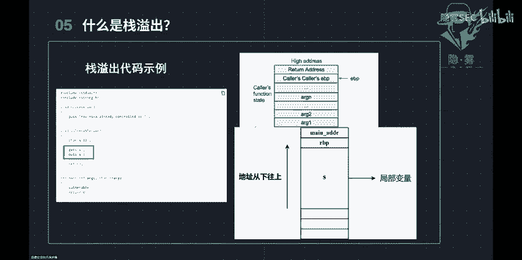
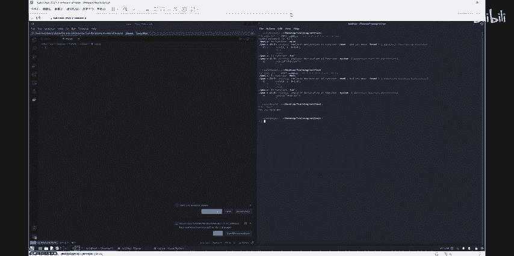
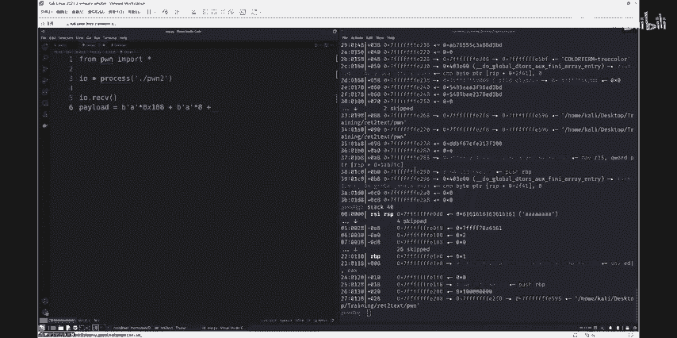
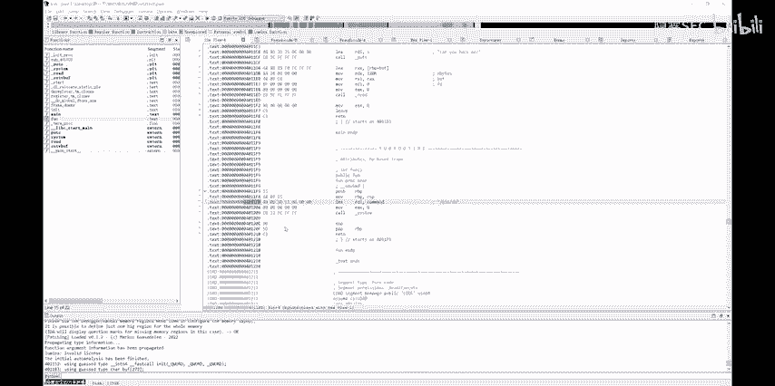
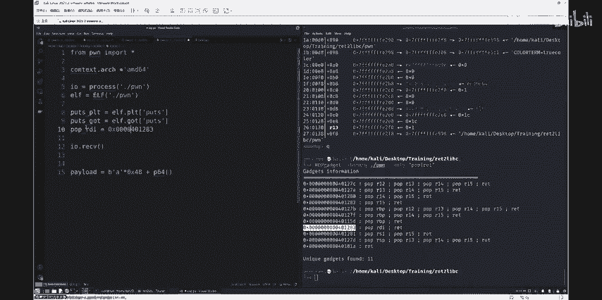

# CTF公开课第二讲——pwn入门 多角度教你栈溢出渗透 - P1 - 隐雾SEC - BV1XE421V7rg

。呃，是说几句话看看。哦，喂，听得到吗？听得到吗？这边没问题没问题哦好。

这边看得到吗？那边。请我。没问题，我能看得见。感觉今天没啥人啊。腾讯会那个B站那边。那边是在开吗？已经在开了，就是B站的直播。嗯，可能。可能会没啥人吧，目前来说还没开始嘛，我看要不要预热一下。

那我你你在群里面发了那个什么了没有啊。啊，就是群里面现在应该可以发一下那个直播通知什么的啊。然后会议通知那重新再发一遍，再提醒一下大家。那我待会儿就8点钟准时讲嘛，嗯再来几个人。嗯，现在没人的话。

就嗯可以吧，反正8点钟。8。05都可以，嗯先这个只要。只要到时间就可以讲了嘛，没问题了。So。你。问你他说这人土意。你反这朋友。啊，那好，我这边就。嗯，先开始讲好吧，嗯，大家好啊，我是今天的主讲人。

大家叫我呃A老师就行了啊。A伦。嗯，我是呃CTF中，我的主要的路线是胖，所以我现就带你们。呃，大概的了解一下吧，我不知道大家的这个水平是怎么样的啊，我现在说话听得到吗？啊，那行，那我就反正先先讲着吧。

呃。如果如果到时候没有声音什么的，记得给我提一讲。嗯，我的路线是胖，所以我会带大家呃稍微了解一下这个啊好二进制安全方面的呃内容。胖你可以把它理解为就是呃底层呀呃二进制啊这种这种路线。

你可以把它打打一个等。呃，在目险阶段打个等于号也没什么问题。嗯，那我就先来带大家看看嗯。胖这个东西是什么呢？为什么它会叫胖？就是呃我不知道大家其他是呃你们最开始接触的时候是怎么样啊。

我这边第一次接触CTF的时候啊，呃，第一次看到这个胖这个词就是半你没反应过来，没有呃，就是都不知道。创它的意义是什么呃？我感觉可能大多绝大多数人第一次接到这个词的时候，可能都一样。呃。

胖呢它是一个黑客语法的疑语词，就是指嗯你如果攻破了一个系统，直接把它的系统呃拿下了他的屏幕呃，或者是什么电脑直接发出一声风了的声音，就代表被黑了的电脑啊，代表一个黑客成功的实施了。这个这个叫A客攻击吧。

就说。嗯，所以我觉得。他可能比较符合大众就绝大数多数人对于这个呃黑客的印象啊，他跟web一样嘛，就是攻击别人电脑，把别人的系统拿下啊这个旅域范畴。嗯，然后在CTF里面呢，一般来说胖胖的题目啊。

胖的题目都是由出题者啊呃给出一个服务器IP，然后给出一个端口。端口呢就是就是一个电脑上来开放的端口嘛，可以通过这个端。那你接入，然后嗯就会看到一些像市的嗯他的那个程序啊，输出说啊这种。あ。然后呢。

在那个开放的端口上，一般就运行着那个二进制程序。这个程序呢就是我们呃如果是在CTF里面发放，那就是。进行你要进行渗透，你要进行破解的一个程序。某种情况下跟逆向有点像。嗯，然后呢，这个二证据程序。

我们胖手要做的就是。通过这个二0程序来找出他提供的一些漏洞，然后用这个漏洞来获取服务器的最高权限。嗯，这虽然虽然说是最高权限啊，但其实就是拿他的flag嘛。因为你知道的CP比赛都是你flag。

就是拿到flag就拿这分，所以大概大概的看就是这个意思。然后我后面会用两道例题来讲，来带领大家啊相当于写写一写写一写这个啊漏洞利用吧。啊，接下来胖的胖的第已讲完了啊，我们接下来开始看他的入门条件。

胖这个路线啊入门我感觉比呃web还有m方面的入门可能相对来说要难一点。因为呃对于web来说嘛，web来说，你最快始入门的时候应该是学什么HGDB协议啊这些东西。然后呃入门的话。

你总比总比要先学一个C语言要容易点。但是其实胖的入门也没有大家想象的地方。特别是在如果大家有些基础的情况下，我们先来看看啊。呃，首先。嗯，需要C语言，为什么呢？因为因为基本上都知道，在CTF里面嗯。

一些二进的程序大多数绝大多数都是用C语言引写的嗯，一些小程序嘛。你要你要有一个程序，你起码得有点高级语言嘛。所以说C语言是我们的个必要条件啊。其次，你需要了解汇编。C语言跟汇编其实应该是呃在一起啊。

C语言跟汇编汇编语言这两个。因为嗯怎么说呢？对二进制程序来说，呃，你在知道C语言基础上，你起码要知道这个东西的漏洞的利用地址，漏洞的利用呃手法这些东西你要知道你要你要知道这些东西你才能利用嘛。

这些东西就涉及到了你要对这个程序的底层进行嗯一些比较详细的呃认识认知。应该说是然后呢，底层这个东西C语元底层就是。就是会给别人了嘛，基本上说话。特别是在薪手可能入门的阶段，因为你不在底层就是二进制啊。

二进制就是0101了。你人类你看不懂那个东西。所以说嗯呃我们接触的最底层的就是会这样。当然你也不呃当然那个像什么其他的平台啊，叉86平台，我们是只要是学叉86嘛，然后像什么arM平台啊。

呃什么lipps平台啊那些东西，就呃。你可以理解为其实新信他是会，就是他。他的汇别会有点不一样，但是基本上是书字同规的。然后关于基础的lininux命令啊，这是为什么需要用呢？

因为呃绝大多数的CTF的这个二进制程序，它都是放在了服务器里面嘛，服务器以后基本上都是linux。所以说你。还是得会lininux你才能对它进行破解，是这个意思。嗯，然后我们看看右上角啊。

这里有一个伪代码源代码阅读能力以及bug漏洞寻找能力啊，就是就是代码审计嘛。通俗来通俗来说就是代码审计。呃。伪代码阅读是什么时候？伪代码阅读就是指一1个IDA有一个二进制二进制运行的软件。

你把它把IDA里面，它会自动的呃给你呈现出它的它的会编代码和它逆向出来的伪代码，然后我之前一节课你们大家应该是学过学了一些逆向的。那上面就是那上面的代码就是伪代码，或跟C语言，还是呃变量名上呃。

还正跟人工写的C语言是不一样的。但是基本上嗯还是能看还。嗯，然后这个基础的python，它基础的pyython是用来写脚本的。我们知道了一个漏洞的地方。我们要对它进行利用，我们就需要一个脚本。

用脚本来进行漏洞的利用，漏洞的调出，是不是这个意思啊，这是我们的心理条件。嗯。后面看起来是不是还是有点小难度啊，但是嗯。怎么说呢？Yeah。胖这个东西也是跟逆向一样。

我昨天听那个逆向师傅说逆向最重要的是耐心是水泥石穿的呃那种耐心和毅力嘛，我觉得胖也差不多，胖更是需要。因为因为怕很多环境环境硬件环境的不同，代表的一些利用的手法也不同，而且日新月异的技术的更新也会带来。

带来。漏洞利用条件的更新嘛。所以我们也是嗯。不断的学习，不断的进步的。要跟得上这个时代。那我们刚说完了先举条件啊，我们现在来说说。就是我我学完了以后，我的未来，我的期望，我的展望是什么样子。

展望胖的时候可以做到什么？我这里只是列了几个啊，肯定不止这几个路嗯。只是先列了这5个，然后给大家来稍微了解一下IOT漏洞挖掘是指什么呢？啊，只是胖手，基本上不是如果学的很精属的很学的真是胖高手的话。

漏洞挖掘可能是肯必不可少的。它跟web一样，外部你学到后面那肯定挖别人的漏洞挖的挖一个准啊哈。呃。IOT嗯其实在框里面可能主要是涉及到嗯我想一想像路由器啊、路由器的设备啊，这些这些用。

你物联网的这种低层呃低层设跟它的一些程序是用C语元写的，也是C元C己叫干码。里面的代码可以对己挖掘，挖掘一个呃胖比 web呃在漏洞挖掘上的区别来说的话，就是胖要难一点。

就是我说光从漏洞挖掘这个角度胖的漏洞嗯一般来说就是很深很深很难挖。但是你挖出来以后。呃，我不知道嗯，就是你你挖出来这个漏洞，就是你知道这个漏洞，知道这个漏洞，你把它提交给呃官方的。

比如说你挖这个路由器的，你就你你给人家官方提出了以后，呃，奖金肯定是少不了的，这个也是一个嗯。这是一个暂签的路子。然后linux漏洞挖掘，linux漏洞linux内核漏洞挖掘。

lininux内核漏洞啊是胖，基本上会会就是想涉及会涉及到一个地方，漏洞跟胖还有呃就说linux内核的漏洞。跟他们很接近接近好。然后其他的像是开源项目的话楼卜话觉得是跟刚刚的说法是一样的。嗯。

然后这里有一个软件镜向告诉。嗯，我现在反正是越来越觉得逆向跟胖图更加了。觉到后觉得后面的时候，基本上好多地方要涉及到也是对稳健的认识啊，对算法的利用啊。对呃，跟逆向其实大成小异。我觉得逆向那边也差不多。

他们学得后面的话肯定跟呃我们这边也是也都所以所以CTF学到深处啊，嗯，真的是越学越多越学越多。就这样，然后高效大厂研安全也就更不用说了。呃，我认识的，基本上一些一些搞胖的。搞胖的搞到。很牛的那种啊。

基本上就是去高校去大厂做，要不去做安全开发，做完全研究，去呃搞印象，要不就直接开始研究那个那个活，就是说不是一条老虎叫。很酷，也很帅，但是也需要耐心是要努力的。啊。啊，我们接下来进行一些案例的分析。

案例分析就是也是相当于说这个放有些漏洞属啊一些地方是是我们这个更新的。最开始的这个1988年的呃，这个这个其实严格来说也不算是一个。这不算是一个CVE漏洞吧，我不知道他算不算。嗯。

就是它是一个很著名的漏洞。大家如果学过C语言的啊同学应该也。知道知道这个ge函数，ge函数中的获取了一个文本跟你的那个scanF差不多。但是在上个世纪呃，20年代1988年的时候。

这个函数被用来呃肉乳虫实际上第一个个第一个乳虫就是利用了这个漏肉。这个呃ge函数其实现在也也。没有被删掉，他也没用。所以。说的跟大跟大家日常很相关了，这个是不是。

G函数没有规定与输入文本的长度过长的文本导致就是从落入侵的时候可以接入任何的战机，这个就是。嗯，在大家日常里面，最我觉得是最容易被忽视，但是又最贴近日常的一个动作。

然后后面的像什么呃2008这个CVE和这个永恒之蓝，永恒之蓝很出名。永恒之蓝这个漏洞是放里面最嗯反我觉得反正是属于所要出名的。当然后面被那个汪na呃汪na派乐勒索软件进行应用。然后感觉影响不大吧。

跟前两头的老科记一样。这些都是我们。嗯，嗯你要进泡的，肯定要知道些今些差不多的知识，差不多的知识。然后我我今天的标题是写呃写的是投多角度帮大家讲一下战一出嘛。所以我给的这些都战一出的例子。嗯。呃。

我不知道大家技术如何啊，所以我只能这样呃。呃，门着头讲，大家如果有有问题的话，就是。啊，希望多多问啊，多多问，我也不知道不知道大家这个这个水平如何，我只能先跟着头这样讲一下。CケFパーで什。

CTF判流程，它作为一个二进制安安全是对。呃，软件进行逆向的同时进行一些漏洞的寻找嘛。我在这里稍微总结了一下，我们呃这个阶段，你如果要进行一逆项的话，需要做什么？也不能说这吧，就基本上立项都是这个流程。

你就要看这个流程就知道。第一步我们是查看文件，我们用这个checkt命令，这个命令可干什么呢？就是看这个文件啊，有哪些安全机制是打开的，有哪些安全机制是没打开的，是关上。

然后某些时候这个安全机制关关上了以后呢。我我们就知道啊，大概是哪个地方的漏洞啦，哪个地方嗯会有问题，我们就可以着重从这个方面进行。分析对吧？然后第二步是进行静态分析。静态分析。就是之前那个逆印向师傅。

他也是这样用的，用IDpro它是一个著名的逆向比件软件，用它来进行印向。逆向以后呢。立项以后呃，就获得了伪代码。伪代码以后也就是我们需要呃我们可以看到的它的逻辑。它逻辑里面有哪些漏到流程里面找到的。

然后动态调试，动态调试是什么意思？就是我们把它运行起来。我们把这个程序运行起来，然后知道它内存里面有什么东西，只要他内存里面有什么东西了以后，我们就可以呃比如说我们先输入一个东西。

输入一个东西发现它在这片内存，这片内存里面呃可以被输入那片内存有执行权限，我们就呃通过这些东西动条发现，然后把拿到他们的地址，拿到他们地址进行。一系列的操作嘛，就是说这就是查看静态和动态。

基本上就分为这三个阶段。可以。一般上说为这三个阶段。三个阶段属于是基然每到。你都会这个设置吧。我感觉。嗯，因为我今天讲的是战一出嘛，所以就先呃谈谈战战是什么姿势。嗯。你要打二进专全，你首先得知道堆和战。

这几中战就是远远带堆的。因为战学习起来比堆要简单一点，就是先放在这。呃，战是一种典型的后进先出。后进先出的数据线路，它主要操作就是push跟p。啊，那如果有学过数据结构的同学，肯定知道这个东西。

这个东西就是一个站。我们可以看到啊。这这个东西它就是一个。哦，左边这个图左边这个图就是一个站，这个东西它是一个你在站顶放进去，然后站顶再打出来后进先出嘛，音月后放进去的月线。然后右边这个图是什么意思的？

右边这个图是呃。就是二进制程序运行时候的内层。它的一个结构图。结构图大概可以分为这个情况，我们也可以看到呃，在右边这个图的左边，它有一个它的上方有一个higher address，就是高地址。

站这个东西在程序中是从高往低衍生的，什么意思呢？就是你如果有一个程序，我的命函说话，它在比如说在最顶部我的命函是又调用了一个什么呢？调用了一个pref函数，它打印了什么东西，打印了hello word。

打印了hello word以后呢，它就会呃它就会把它的hello word的这个呃这些变量，这些程序函数就会放在低的地址。所以说。所以说这个案例这。它的它的内存地址从高往低延伸，就是这个意思。

就是你越来越多调用的东西都是从上面往往下面调用。嗯，然后我们可以看到啊，hi dresswe。大一说是什么意思呢？但一出就是像站中的某个变量写就字节数超过了这个本身，这个变量本身所指的字节数。

举例来说的话，就是如果我有一个数。数组数组，比如说我说它的长度是5个，然后我写了7个进去，然后肯定超了嘛。抄了以后，在有在有些C语言里，它不检测就长度了，不检测长度你就直接抄过去。超过去了以后。

就导致你的内存的一个地方，某些地方被覆盖了。如果你覆盖的地方到了那个返回地址地方。又就变成了他什么意思呢？就变变成了一个可以被利用的这役。你普通的战役术只是会导致程序崩溃嘛。但你如果这个战役书被利用了。

就导致这个这个程序可以呃，我们可以用它来做我们所有想做的事候，可以返回到我们所有想。这种是个战术。单一出的基本前提啊，就是程序必须向蛋上写的数据。你有些时候你写的数据可能是在堆里面，可能是在呃其他地方。

那就呃不符合站数，站都可。嗯，然后你写这的数据大小没有被良好的控制，这么意思吗？就是就是你抄了，你一出了你的。输入的比他规定的多了，你我不知道哦，就这个意思就并没有被良好的控制。呃。

这其中包括你完全没有规定长度，比如说get阐数要不就是完全你可能规定了一些，但你可能漏了你两个，我包了一两个手这也算一带进去。啊，我们代码示例不给放放一个代码示例。嗯。

代码示例我们可以看到左边这个图就是getget函数是最出名。最嗯。嗯，最出名最简单最容易被利用的一个。再占一术框站看到右边这个图。因为这个图有一个对容程序结构嘛，我觉得你们可能有点呃呃不是很懂。

所以我这画了一个草图，画了一个简单的草。这边啊我这里这里写的是地址，从上往下，我只是说他这个这个这个标啊，但是它的实际的实际的使用，它是从上往下的。就是我上面有一个命 address。

这个address是我的返回地址。我的返回地址下面。这个S就是我左边这个图勾出来的这个局部变量，这个恰S12，就是我局部变量在内存里面就这个意思。在S中。局部变量嘛，我可以标标这么个。

你如果用的是get函数，用的是get函数。你写了12个字符以后，你还可以多写，你可以继续写，你可以一直写。再以说。这就是一种。但的溢出的利用。你如果写到这个RVPRBP是什么，我觉得你们先可以不用管啊。

你写完了这个你覆盖了这个你再覆盖到这个命dress这个命这个命下下划线呃ADDR就是命dress就是。呃，这个命函数的地址，我把它覆盖了。什么意思？就是我我的嗓子意思。我们返回要返回的命，我要结束嘛。

就是我现在不返回到名额，我返回到的地方就是我现在要改的，我要覆盖进来。现在想返回哪返回哪。这就是一个赞的利用。战一说的余利。

好好。这里就有一个战役书的例子。嗯。我原本是准备了两道呃，我想想哦，对我原本准备了两道题啊，就是给你们互相看一看。我们基本上你要进入胖的学习，基本上都是从这些进行学习嗯。我们现在来看看。呃。呃。

因为我不像不像那个逆向师不我我我看看他讲讲一道题，我这边嗯基础知识基础知识不多，基本上都是从题里面来练的，题要多一点。呃，return to text是什么意思呢？控制程序执行呃，程序本身已经有的代码。

比如说像点tex段之中的代码，一般是指程序中存在的后门函数。我们可以通过这个呃为证据呃ex是程序跳转后门函数中来达成后后门的利用。我这里也跌了一个。建了一个事例。嗯，我刚我刚刚已经讲过了。

怎么利用这个这个蛋怎么进行秘输，对吧？那有问题的进行有问题中也进行提问啊，那么大家懂不懂。嗯。啊，我想说好，对，嗯，这里我给的例子，你看左面那个。左边这个图。是一个后门函数，不是后门函数。

一般有些程序它写下来呃呃就是你你用它的时候，他有些时候他自己想想要进行利用，他进想想继行提全或者什么什么什么东西啊啊，他会给自己保留一个后门函数，专门就是用来调用函数。所以呃如果有这种这个存在啊。

那我们战役术就非常的简单了。你知道吗？因为啊我刚刚不是说了吗？就是战一出啊，战一出基本上是嗯有修改返回地址的。修改返回地址是什么意思？修改返回地址就代表我直接把它。把我的返回地址改成那个backtop。

我就直接进入后门函数了，我直接进到后门函数，我就直接可以拿到这个sstem。对吧我能拉到他这个system是什么意思？就是我要执行这个这个这个指令，执行这个指令我就已经拿到了我的终端了。我拿到终端。

我就直接相当于普经进他们的系统了，想不想干什么。啊，当然后面还是你提全啊，但是我普通用户权限也可以干一些事嘛，对吧？嗯，然后。右边这个图。嗯，右边这个图也是一种home函数啊。

特别是在我们CTF里面CTF里面它这个函数它是作用是什么呢？代码审击一下，你可以看得出来，它其实是把一个。呃。把一个把一个flag放在stream里面。他放在最里面。没，他就是open了嘛，open了。

然后相当于open了一个文件，open了一个文件，把它放在了我的FD里面。然后后面你先看这个程序有没有一判断吗？就是以后，然后你呃我们一般来说，你如果能打开这个文件，肯定不会出判断。

然后你把它写进了我的S，我的局部变量，啊后我上面自里写了一个叉流，我的局部变量，局部变量以后呢。就相当于我直接把它输出了winFSwin FS就相当于把把这个文件里面的内容给输输出来。嗯。

基本上打CT不够了，你基本上你拿了flag了吗？拿了flag了以后，你这个这个段着分已自然赢了那个。啊，差不多就是这个意思。那我现在来给你们呃试试试试。嗯，看我能不能沟屏来。稍等，我把它共享到他的。

好，这里看得到吗？😊，这里这里没问题吧，能看得到吗？哎，你都没有人回我。有有点有点担心，应该应该能看得到。好好好。能看得到，那我就继续讲啊，能看得到继续讲。呃呃，我带你们看看啊。

一般作为一个胖手是怎么做的这是一个咖里系统，就是它是一个是一个linux的的系统。然后我基本上呃是用这个系统的，但是实际上你如果想用其他的呃想用其他的，比如说乌班图啊什么的呃。

物关图啊、deb啊这些系统都可以。你你想用什么用什么，你用一个docker用一个docker配置呃，也可以。我前出来告诉，看我这样。呃。你用一个docker也可以，你随便你想用什么用。

我们现在来看我这个是我刚写的一个那个文件啊。这个文件的呃作用就是我们进行刚刚所说的那个。分谢没有生序。嗯，我们看看啊啊，对我这里写了一个命函数嘛。

大家有基础的写过自语言的同学应该也知这个这个命函数哈呃命函数。我首先定义了一个局部的变量，这里有1个PS的局部变量它是呃有零差1。8个长度，就6镜左的8嘛。这乘108，然后一个就不同关键啊。

为什么关键为说我待不住待不住。布置一个凯优黑你就相当于你可以把它约等于没见过这个函数的朋友们，可以帮它想象，就比是说一个点密码。然后我进行了一个read。read进 read进S就是我往这个字符串。

这个数组，它现在是一个字符项目看了一下。然后呃写入我要输入的东西，可以又把它看成一个screen呃cancanS嘛canS就这个意思。然后这里是一个初始化案函数，自始化案函数可以先。你说实在好奇。

我也可以给你讲，嗯，但是现在先嗯不用讲个问题。嗯，然后这里是一个functionctionfunctionction，我没选他名字啊，但它的作用就是一个。啊啊就是一个提供这个函数。对函数对。呃。

就是他有一个。执行后执行他的。这个做后门函数后门对，这个就是我的大体意思啊。然后我现在把它编译。同学们应该编译过，不知道大家编译过是。嗯，我刚刚在这里面写了一行命令的。

这个就这个这个就是你要编辑的pos命令啊抄就行。嗯，基本上需要一个s do指定。其实刚刚你有，只是我给你们演示一下，所以所以你可以看到我刚刚其实已经有有编义好。我这就叫on toon to。

然后这里可以on点C嘛，点C，然后这里有一个呃。占指令保护器的有参数，这个参数用来干什么的呢？嗯。啊，OK待会我会给你讲啊，去巧啊。嗯嗯这个参数其实就是用来进行一些安全安全机制的调试啊，也不是调试吧。

就是把一些安全机制给取消了，你方便方便那个。然后对我现在就有一个哎，对，没开。呃，可能看不到，刚刚直接出来然，我现在就有一个放Q后刚点。如想你想看，我再给你看呃有那点也成一个count three嘛。

然后count three放里边，然后你右边左边就有。这种编译啊，编译了以后，我们直接运行。运行的方方具嗯，你看我得到了一个IUXE的输出，对吧？是这样。好。那么我们要进行这个E叉P啊。

我们要进行它漏洞利用。你刚刚你看了吗？看了我们刚那个漏洞，其实它漏洞在哪儿呢？诶，我边答。漏洞在哪儿呢？嗯，什么。Noello。我给你再调一个，看把我现在共享哈。

放到这里。这是我们的IDA如果听过上一节课的朋学们应该也知道。这个IDN是用来干什么？用来看逆向的。刚刚那个程序我们逆拐啊逆转。就这个样。的人。就是跟我们刚刚写的代码一模一样，也不是一模一样嘛。

就是你你看不懂看得懂啊，它的背函数bros一个凯一个黑D，然后呃read一个东西进去，read了一个东西进去呢。嗯。他瑞德的这个范围呀超出了我的27下，就是那个银差108嘛，直接看远啊。

你看原告。的源码上啊，我们这里不是有1个0差108嘛。但我们写了03120，什么意思呢？我们溢出了。呃，林沧10108。就是用120减1086进制啊，16制减出来是多少，减出来是0差18。

就是我们溢出了这么多个字节，这么多个字节，我们可以干什么呢？318。嗯，想想啊。0他18个字节相当于在您在叉64里面其入三个地址，三个地址。我们进行几。在p里面哈，我们需要导入python的一个库。

那就叫做胖。他就要跑，你把它全部导进来就OK了。你导进来束这个工具我们很需要用哦，对。刚刚不是说那个流程吗？刚刚说那个流程图，我首先要进行那个。看他的文件，对吧？

看他的文件check这给你这个功能需要来看它的文件的信息的。文件信息我一看你看到呃，我刚刚这里有一个no stock呃，这个叫什么proteor嘛，对吧？

protector它代表的就是这个tackctionary。canary是一个用来保障保护的机制，这个有机会后面再。嗯，这个机制用来呃的作用是是防止这个运输的，但是我现在就没有开它，没有开它。

因为报密演示嘛，后面有一些题目就是开开了它怎么说呢？就不跟你说了。这个noPIE这里OPIE被直接忘了就知道这两个地方有有问题。然后我们进行利用，我们刚刚导入了input。嗯。

然后我们就可以写相关的命令了。首先我们要有一个通道。通道服我是这么写。So process says。process我们要指定一下我们的这个程序，就胖或者胖二胖三。我刚刚也是呃就写胖二也行啊，胖三也行。

好。对吧这个是我们能得到的一个。稍微打出一个对象，一个对象我可以把它叫IO就就是不能把它叫西有行啊，叫P也行啊，叫IO怎么办？这个东西就是用来进行对这个IO的操作，就是对我们那个其他程序的操作就。

然后IO点等于C。我们首先要接收哈，接收我们就这个有点密码，还有就要先接收，我要有接收这个操作，你的程序这个数据我才能接过来。哦，编辑器然大一些是吧？嗯，好的，我看看怎么调啊。Okay。是。是嗯。

分手吧。这样可以吗？把这边也调大一点。还多少。小黄。现在看得到吗？现在。把这边也调大点啊。对以吗？好嘞好嘞。😊，嗯啊。好嘞好嘞，那我继续啊，我receive了嘛，我进行呃。

他那个can you have me输入过来，我receive了，我才能进行接接下来的操作，对吧？接下来操作是什么呢？哎哦不对不对呃，我进行一个payload黑load的这个构造啊。😊。

我首先我可以我可以给你们看看内存里面嵌的是什么样子。我可以干给你们看看那存里面是什么样子的哈。😊，要进行碰嘛，对吧？这个碰哈，然后把它这个这个调用。有用。按这里回选一个看一个还一个密码，对吧？呃。

现在是他走到的这个地方，我现在在调用瑞达，所以所以他这里写了一个呃瑞。你不要你不要学这些东西啊，我只是跟你讲，他现在是什么什么啊，你看一看就行。嗯，想学也学你想学也行，他也没有必要，你反正后边也可以学。

呃，read read函数在这里，我走我现在输入一个，比如说我输入一个很多很多A啊，很多很多A。哦，对对，就是在这里边述。嗯，先走过摆在这是。hello hello，哎。好，我们输进去。输进去了以后。

然后各位的还没出来出来。现在我们看看我们的站。刚刚我们给你讲解了哈，我们的一个函数里面就是有一个占空间的，一个它用来存储它的局部变量。现在可以看到哎这个。这个地址啊这个101名的地址。

它就有很多这个A了。这个什么意思呢？就是0叉61是什么？0叉61就是A的20克嘛，A就代表61，然后它就就覆盖了这么多个范围。我现在有这个地址，给你看看。他这个这里不。完了。

我不知道两两两个题项不样然后。呃，你看这里就我们就写了这么多个A进去。嗯，这里就是个账呃，这个数据没有必要管它，这就是我们写入的A哦。就这个意思啊，我们写了这么多A，我们可以看一看哈。😊，我们要。啊。

好好像有有点。那这个嗯这个是我们刚刚命用嘛，然后我们看看上空间，这是这里是我们的返回地址。返回地址用来返回到函数的返回到函数的。因为我们现在命，现在是在命函数里面，那就返回到这个star。

现在不要需要不知道，需要不知道就返回函去就行。我们现在需要把A呀，A的不在这儿嘛，我需望把它覆盖覆盖覆盖覆盖覆盖覆盖到这儿，覆盖完，覆盖完以后控制返回地址，我们就赢了啊，就这个意思。

我们刚刚看到源码上面写了多少，写了那个。哦，对，对这呃，源码里面写了我们是0差108嘛。03108，那我们就提03108Z。那。七五三二五八对吧。Okay。然后加上。

我们这个配漏文要写的东西是什么108个A，刚刚把那个局图变量覆盖了，对吧？然后我们看到这个GP变量覆盖了以后，还有个这个嘛，还有这个叫RBP的东西，我们不知道它什么，但是今天不用管它。先不用管了。

你可以看到他这里的地址啊，这里是10是18，代表它是又是8个嘛，又8个，你再再写8个A嘛。开始。发给啊走。行，那后现在基本上呃我们要覆盖的地方就覆盖完了嘛。他原本原本这个局部变案就这么多。

但是因为战役出了，我们可以多写几个。多写几个以后呢，我们就需要刚刚IDA就有用了IDA拿过来干什么，就用来看地址，或者你在这看地址就行。

我给你在这个这个GB这边看地楚那是IDA。不用带心。我们来到了因A。IDA以后呢，我们把它调到这里。我们可以看到这个就是他的地址，这个就是他的地址。这个命函数啊，或public mean。哦。

刚在上看洗啊。好。反正先先先先这个意思，你先看我们可以看到这里有1个0411B3，对着他的命函数的地址。他命函数的地址是这样的，然后我相当于啊就知道了他这些东西。当这个东西我们看它有一个方形。

它有一个方形是我写的后门函数，这后门的函数的地址是这样。是这样，有0411F9。你可能你是想说，那我跳到你4F11F9不就行了吗？我就直接可以进入到后面去了。哎，我告诉你一个更简单的方法。

更简单的方法是干什么呢？你放到这儿，你直接开始运行它。这有一个它毕竟是一个包装的混格函数嘛，我直接运行stem，它不香吗？这三行命令就是用来运行stem。我直接复制这个东西哈，然后我把它单贴到这儿。

64。啊，对我加给你X，你就比如说这个整数什么。好，这就是我们的payload，我配load结束了。那结束怎么办呢？你好，我就直接。receive结束，然后把它 sent出去。我们的配漏就这个。啊保证。

这个配load的，然后我们要进行一个调用。不是调用呃，进行一个叫。冰村儿。Aultities。你这个东西是干什么？就是你你如果拿到系统啊，你拿到系统了，你就肯定不能每一个他一个。拿过来的值。

你要先啊瑞斯有一遍，然后你再剩的东西过去，就很麻烦。对，所以他用这个东西是用来进。你39就是那。你拿这多东西你就可以接过。是这个意思啊，现在已经写了1个E叉P了。E叉P我们就进行调用。但你差片。ま。

哦哦，你们画面还在些。😊，不好意思。

哦，这样。啊，我再再讲一遍吧，我刚刚写了一个这个，我把他的指令拿过来了，拿过来了以后。嗯，这个地址是我需要用的地址，我就把它拿过来，然后用啊这个叉64的版本，叉64版本呃是一个。

用奶光来在64位系统里改，然后把它渗着。渗的出去了以后。我进行你给你个I。internet以后呢。n题我就相当于我就交互了，我有交互了就。呃。哦，你你打SCC，我我不是逆向老师哈，我是胖老师。

你可以让我打打SCC胖。嗯。啊，好好，然后继续嗯，然后我运行了运行这个。哎，我发现哎为什么报错了，不知道不知道，我就进行调制嘛。哎，但我确实不是录像调错字。嗯，我看看哈调试调试。对我首先把它进行一个。

呃，叫什么？嗯嗯，对对。他的报错，我首先把它的contacts进行一个bug模式。当 back。Yeah。哦。嗯。好的。对吧就是那个模是啊。嗯，先输入了，先接到些东西啊，了接到这东西，然后我输出。

108加5加8加64。好，我们再来看看他要是结构。有一个。啊，嗯嗯。你个死饭。哎，你小子，我看到笨着剩着用戏股戏。不。再沟。看看面你现在是什么情，有点小啊。我经调试。看他也没有把就是。喂喂你好。好。

そ呢。这就是我们的这个什么呢？每次你打胖以后就要这行好吃问。放张4哦，哎呀，写写写歪了。他应该是你这里要代加发。等调试嘛，1028你还要带一价。I。嗯，爸爸让你爸爸可以话。考试以后你再看。

你咪紧走啊走啊走啊走。大家好，我进进来了，我进来方平了，进来方式。好，很好。然后我你看我这里就已经有一个。有一个这个有一个多少符号了，代表我已经拿到了他的地址。你看。😊。

这个L我就可以直接回显到这什么意思呢？看这个是我的目录嘛，我现在已经直接进去了，我就可以直接拿到我的目录了。现当直接看一个U呃，你你要学一点相关的linuxwin。

你看我拿到我发一个这个run name杠A的，直接收到了一个回显示如的，我相当于直接已经进入他这个程序了。通过它这个二进制。是吧。很简单简，相对来说还是很简单。啊哦，不对，对，就，然后我现在直接退出。

不。你们觉得有点不过瘾嗯。但是没事，你反正后面慢慢去过。这是我刚刚的第一题啊。嗯，第二题。不知道第二题我不用时间讲。我先给你看看那个。我先给你看看刚刚那个程序啊。

刚刚那个程序我在我的服务器里面已经写了一个。写了一个一模一样的放在我的801端口。你看我如果。访问我这台机子8001般，他就有这个情。就是我把这个程序已经放在这个端口上了，我现在要打我的程序。

我要打我我自己打自己。你如果放在别人人，我就打别人嘛，我现在落在我自己的上面，我就自己打自己。好，那怎么打呢？我们写呃我们刚刚写的是这个程序，对吧？这个程序。我们要打远程打远程，那就直接把。B方米改成。

Remo。啊那不放啊，这个0。0。0。0。我刚刚不是说我写在那个啥800B端口嘛，801对，对不就800。把它这个是我们本地的改成到这里。改成了这里，我们实际上一点没变啊一点没变。它是在这个远端的。

跟我们现在的程序一模一样的一个。好，但是。8是好。这计话。然后运情这个同学啊不行。嗯。对呀，不什么就是。哦。你看我这边已运行到了运行到程序了，他说连接0。0。0。0的port8001也OK了。

我的程序就直接打进来，打进来了以后没有问题，你看到。我的。😊，这个相当于我这个我是个docker，所以他有有其他的木的结构啊，木的结构这里有个flag，我们要看这个flag。对，这就是我们要的fag。

如果平时着比赛的时候，你拿到这里就你就结束了，你就已经赢了，拿到分了。这个就是我们啊两个字。那你比如说LR拉飞。哎，不是，他没有这个。他没有做题。那就就t嘛，就t其他的啊。嗯啊。

直接就有一些有一些福利险行。基本上都是I，然后下载一个planag。嗯，然后s结束走走人。我。好，结束。嗯，我们看看第二题，我们刚刚已经讲了一个比较基础的一个。来个共享那个。对。好了，已经结束这道题了。

我们再讲一道题，在的公开课就差不多这着说。差不多结束了。第二题是一个return tolib Clib C是个什么东西呢？它是一个呃呃Glib C是一个动态连接库了，就是你平常写的printF啊。

你的sstem函数啊，你的get函数啊，这些东西不是你写的嘛，对吧？别人写好了的，别人写好了给你放在那，你放在那的这个函数库，它就叫动态。呃，在C语言里面就是Gli C。我们return toli C。

就是为了啊。因为有有可能我没有ho门函数，没有后门函数，我写了呃，就是也没有用，我返回的地址，返回，我无论返回到哪儿，他没有那个函。所以我就要直接去找他的动态连接库，那个库里面什么都有，就是他。

他所有的函数在那个柜里面是包装好，就是他虽然呃不想给你的stem，是我直接不给，我也没有获的后门函数，就就直接安全性还是挺高的嘛。呃，但是因为我有这个动态连接库。

我直接可以去他动态连接库找它的seastem来去造它的这些东西。对吧？呃，所以这里DFC是控制执行的函数返回某个呃函数的PL school这些呃，后面我会给你们讲PL呃PLT是一个连接动态连接表啊。

是用来连接我们这个连接。嗯，我一般情况下我们会选择执行sstem这个函数，这个函数就是我刚刚在后门函数没写专门给你写进去。如果你不写进去就没有这个后态函数。

你就找这些函这C当然我们也可以可以使用one不要get。呃。应该是one did get one get get应该差不多。用来用于retturn to也是一个很重要部。哦，什么意思？再给你们试试。

再来一道看回来一道题娃娃，是公开课就是。呃，大看看你们可能解题吧，觉得特别不鲜应，这个题我就没有部署遍重了，对吧。这个题我就是我你看我这个是我的这道题的源码，源码它就没有什么了，什么都没有。

不是什么都没有啊，什么后门函数都没有应该。啊，然后我这里也是他的编译命密啊，他的编译命，我已编译好。在这里这个啊。连也时行了解。呃。呃，它也是pose一个东西，po一个东西呢。

就是一个readread跟刚刚那个原理是一模一样的，就是它没有那个后门，没有那个后门，我们怎么办呢？相对来说要麻烦了一点。现在来。啊，写是脚本啊。你好，首先一模一样啊没兔子。行。李行先把他的环境配置吧。

呃，什么叫环配环境呢？就就是他的一些。啊，比如说我现在是。叉86平台吗？W6平台是是MB64。这个是要配。对你俩就就这一种。然后IO等于。R robot。啊，对吧啊。然后IODR。讲什么呢？嗯呃哦。

对对对。不要找他的。对拿到，然后拿到他的一些。那有点复杂哈，所以我觉得。😊，唱这个东西带个人有的人带你去得还很方便。我有些东西你就是需要查，要查，要耗费点精力，不知道这些东西是不行，直都没有人带发。

自己查还有点费劲。嗯，EF嘛EF是我们的那个文件表，现在我们可以拿到它一个数s。为什么光拿pos，你可以看看。我这里头嗯结账补一下。啊，对，这是那。嗯，我们来到我们那个Q这文件夹。我进你这个因为有些。

环境的配啊它需要一些用的好用的用的角色。这个所以我直接进入是，一般来说还是呃不用不要直接进入发票不好，这样有点危险。我直接1个OBG这样补大。哦，你看看我的。Good。函数那这些函数是什么意思？

就是我已经在表里面的函我的命。哦。看唔到。TLT。因为我看我看到我们的源码里面。我们。源码啊原码是这个嘛，源码有一个铺子，有个铺子证明他用了复函数，用了铺函数，它就会有一个铺子的lo。落就是光态眼睛。

你用了它就会有这个东西。那先可以这么急。然后于LF边。啊，还行是。部门。故词还有一个过。好，对，好像那个怎用啊。不。直就是你用你用熟了，你直接记一个脚本就行了。但是大家现在不熟，我一行一行给你挑。呃呃。

过s副参数，然后我receive看到能能你目掉。receive把它接收回来，然后再构造推漏。H漏等于什么呢？嗯，我们再来看看有多少个溢出啊，我就不从PD那个IDA那看了，我就从我这儿方便。啊。

偏你的some心，它是他的回响啊，我回想我复制一个东西嘛。复习一个东西，我写1个AA。进确。整你是这个函数。然后看一看我的占空间是什么样的，看40行。我可以看到哈，我这里有一个。对。

RVP嘛RVP是这儿代表我起码要写40个。0叉40的0叉40的AR0叉40。云差40个月，你要还要覆盖RBP，那我就云差48个月。0叉48加上我的1个QQ。行吗？好，对，行。哦，这就是区别所在了。

我我要进行一个。不是直接调用home函数的，我需要有一个叫刚ge这种ga get，你可以把它理解为我要运行一个程序，我得给它参数。在汇编里面，我给它参数是需要一些。我就我就笑。没管反正我需要。对。

然后我需要他用来干什么呢？用来进行调用我的这个。陈述。的参数我得给我参数参数。The后。这些你们先不用管他什么意思，先不用管这个，我就给你们只是在给你们演示。

然后我有这个地址拉进来。再加一个什么呢？op出来的东西是我的。是我的过壁表过表连接到的东西的时呢你对它是一个指针啊，它指向的是这个。父子的。就是他在内部里面在供制。然后我要调用啊，我要调用我的blo。

就是你可以把它就理解成兔子。所以我现在干了什么呢？我后一个东西，这个东西先不用管了，我就是呃给他第一个安住，我给了这个指针这个指针。呃，是他第一个参数是什么的参数呢？是副参数的参数。他。

复制能出来什么值，他复制出来就是我的。这个物置物置日置。呃。然后我干嘛我干嘛，我要胜。对。缝任。邓肥佬。这个payload它就会有回显，对吧？它会打印对吧？有一个数材值，它会打印出我的个。这嗯。

这个什么叫就是poss。函诉的地址，我需要这个地址，所要C。嗯，因为我不知道他回响是什么。好，还就个先开一个这个。1把1把。Okay。对嗯啊。呢把。然后再。先把应该并写，我一般习惯先把。

然后看receive能不能receive到什型号。啊，receive直接receive了这个7S开头的东西啊，就是它的地址。就是复查的地址，待会可以给你回信息receive那就receive on。

直到。拿到这个信。6是。7。银沙就是。哦，怎么说呢？你可以把它按成字节里面，它在这个字节里面就理他它的地址其实是从TS开始，但因为它是小段。早端所以它会有一定影响。嗯。DS减是多少？56。为什么-6呢？

因为它这里123有一个字节嘛，两个字两个字这个算一个22346-6。对。要把它等加29乘8，这什为什么要要加死？就是为什么要把它变成8？因为他他是64位，他的地址全部是8位的，光拿一个6位。

人家就不出来。啊。不。然后对你receive的这个东西，receive的是个字节字节，现你把它变成一个64，一是什么一个就是把它变成一个整数。或者地址让你出来就是，这过。大的东记得。因是他的。

树化要尽管被因付因付是。他这个。说就他不带现带都是泡你，都是这个库里面的，这个库里面的都有。你平时关于一个info，它会用啊。Okay。这是一个你把它你给我打印一下。おはい。嗯，我再打印一下吧。嗯。

你可以看到这就是他的它里面前面应该有一个零差啊，但是他在这个模式里面显不出来，那就就不管啊，不管，你反正认得出来就行，这就是他的地址，他的地址就是这个。他的地址就是这么多。没有同学会问啊，那为什么？😡。

我还要拿呢，我直接拿这个直过，就是把它变成一个常方行啊，那肯定不行啊。你每一个字运行的时候，你的二进制二进制啊，二进制这个东西，它的函数每次是会变的，它只有末三会不会变，这个420不会变。

这这个版本不变啊，不会变，最后一个东西变啊，有点麻烦。嗯，然后对对对。我刚刚说了，他只有420规店，所以我们有一个数据库可以过来查这个东西。嗯是。怎努力。奢侈。他是一个。呃，相当于其他就写的脚本啊。

在giHub上有，就在下就行。后面要教怎么环境配置的时候，交啊。我现在知道这个这个嘛，对吧？我让你家啲自己出出。可。不个不是。啊。哦。嗯，它是一个裤子，然后把一个裤子一起。我发一个透s的地址啊。

我对要问对。啊回的是个这个对象，这个利士的对象都是我们想要的，还有我们想要的地。他那个这个基地址，我们需要我们需要基地址。为什么我们需要基地址呢？因为它虽然每个。我刚刚不是说嘛，它的参数啊。

它每个库会变，但是它的偏差不会变，它总是那么一坨东西在内存的各个地方，每次就是随机到各个地方。但是但是除此之外，它是一坨东西，它里面的结构不会变。什么意思？就是比如说。我这个东西。哦。

因为为我说我还吃不得。不行啊我们就会得到的。你回信。あ。哦哦哦，我刚嗯。我你直接给你拿回去。哦，我看看哈。对对对对你拿到回血吗。哦，然后我要选择对他因为他那个C它是联网，这玩意儿是联网，它会先。

他的数据库存在网上，他你调用他这个对象的时候，它会首先连做网连送网回来。然后你要选择它这个420啊，它的后缀是哪个类型？我我们这个因为是叉叉86不不，不是叉86，叉64。对很明显是这个就这个二选一啊。

25多块钱，赶会选一个给看。嗯，我这在代码写好了代码。你知道基地址吗？你知道基地址，你想要什么，想要你想要啊一个一个。呃，sstem函数sstem函数你直接加加起来就行。知道ex要。Wsdom。嗯的。

打上。真是嗯。你卡住的地址我需要啊，需要我就要需要加他，然后加一个偏名嘛，对吗？然后我现在又需要一个字符化，这算是什么呢？就是一个BXHHR我需要运行它，我才能达到为。所以我才叫上别个叫SRB。Yes。

这样有这样有的嗯。哦。OK看他。你要等一下，因为他现在哦，对，我不是选二或者9，他都是知你看他都是2。31的，所以你选哪个应该差距也不不大就。可以下啊，你看到对了对了对了对了对了对了，为什么呢？

因为libC它机值嘛，它机值，因为最后三位他们变的什么就最后三位，它最开始的肯定是000啊。你看到它是000开头的时候，你就证明这个libC啊，对了对了对。啊，就是这个意思。

那我们就拿到了 system中的。给我们的但s这这两个东西我们就拿到。拿到了以后。我们继续写，拿到以后，我们要把因为要重新回灭函数嘛，重新回灭函数，那我们需要把这里的访问地址给改了，改了。

就该加一下加一好。还有加一个。下一个。函数的调用协议其实也挺麻烦的，后面会单独调换。有有试听课，听听课打那么多。不。啊，有1个EmailSP吧。需要他的那个还。并函数地址拿到了拿到了再放这儿放这儿。

就是我相当于运行完以后，我又回密函说。我用回名函数了怎么办呢？继续走，继续走heload黑load2，这能呢跟刚刚一模一样啊。就是类似也。我示有一下。你试一下。

然后18啊popopo出来的东西不要改的话。因为这个我们要调用的参数这个调用的这个。好，切的切的好美。然看就超时了啊，对把这个提上。然后直接走的话，我看看会不会报错，有点小紧张。有。Yeah。但会如此。

有。🎼哦，你看很完美啊很完美。我们急了，拿到楼。好，不是刚又又说错，哎啊又翻车了。6翻车我们在那个啥在OK。看下看看什么情况哈。再调一下，再调试一下，看看什么情况。小好。

其实现在CTF比赛都不会基本上没有什么可以用到Li C的时候了，因为他基本上会给你给你他的Li哦好笑。用想。但我放大。在嗯。请。呃，那你们看看我你调试。嗯，有点调要是不要慌，反正不下来的总是会来的。那。

我们现在走到哪？那是找女。哦。哦，对，没有这么钱啊。哎呀，我没有胜者怪。😊，22。然后那个。I send我 send这个Pload我load都没过去呢，怪不得。不是啊。那打个微信。通。嗯。嗯。什么。

还有时候网卡的都正规。没办，因为他有时候有点有点有点。还有点麻烦。报标2。3都不司啊，估不走。有点不办。换影他2。啊，一样的一样的，那也不。哎，有点慢的有个。包括我想到清楚。哦。

receive应该是这个receive没有那个他receive一直在receive。我们要一个un you。有微信唔到他这个三信。你需要到他啲嘅心心。老把放在我们发送群。在干。嗯。

不知道为什么又输错了呢。难道是会占千米哦后可占屏分的位题。Yeah。那个啥哈，我再看一下好试一下。其实我我原本那边有一个写好，但我觉得那样有点没有道理意义。所以我这边因为时间来实在来不及啊。

所以我不然我还是会那个一下，我会调试，看能不能抖。今日是啊。哦。看来应该是看这里进C层，进C层呢没走出去，那应该是暂停横不了。嗯。现在的。😔，好圾配置。对。嗯。啊，嗯。啊，对以。就这个没错走。

这量有没错的话，那他就可站出。一个啊。我有一个。哦，嗯，代表你的战有问题。但情衡有问题，这是为什么呢？以后我也会跟你讲，是你经常会遇到的一个错误。经常会到一个错误是为什么呢？因为他有时候他的站啊。

他的站是1个十六字节对齐的，你没有对到十六字节对齐，他就会有一个小毛病。可。你常没保错，没放。啊，现个因问。为什么。好，那我们继续走哈走走。嗯，很好很完美很完美。接着结束了，你可以看到他。

他直接回选一个多少幅助内我们能拿到的，你看能拿到我们的目录都有都。我们不知道那是一个。我唔着死望。我打上都不见，这里也被直接回写。最回险啊。成功了哦。哎，第二道题也结束。

我们今天的讲课呢也差不多就到这里。差不多也到这里。大家有什么问题也可以跟我说说。有什么问题也可以直接跟我说说。哦哦。怎上能讲的。差不多就是这样差不就这样，咱们有什么问题？么。啊，你想我拍个。

我先拿到那个我都拿到本地了？拿到本地了。那本地目录都有了，你要flag，你直接上面打麻啥打啥。哦，有点懵有点懵是正常的有点懵是正常的。有点懵是正常的，不然了，主要是嗯这个这个他就是要好好的学，要学很久。

就是说。我。还是要这个是没办法的这个。呃。但是呃刚刚我说的一些东西啊，因为我讲的有点快，呃，对吧？因为一个小时其实很难讲到什么东西。其实你时间有多的话，我呃把某些一些部分一两点给你讲。

就是嗯直接就可以讲这个东西。就是嗯这个这个东西主要是看。应该怎么说呢？看你会提问题，然后我直接会给你给你解答。你这样学，你就学的很快。我刚刚这个速度。哦，声音有点模糊是吗？哦，这我倒是。啊。

这这我倒是没听下，不好意思啊，我可能离他那个电脑有点远。啊，其实没有你们慢慢的来也没有那么麻烦。我刚刚可能有一道题弄的演示的有点有点。有点难吧有点难个是少。后面我会调整的。

新一期啊这一期这个这个看看我们那边怎么也多了。声音不太稳定哦，确实是确实。刚刚那些内容嗯。嗯，后面会给你们出比较多的基础题。你们一个是按着按着这个路线一步一步走。董事会好不少，这个相当于。

你要必较挖洞嘛，挖洞，你要到挖洞那个程度啊，肯定不是一天两天就能实现的。半要一口一口吃嘛。哎，走走吃，最多是我们这边把呃这个什么呢？把配套的题。配套的路线啊，配套题啊，然后知识点啊都给你讲话靠你就看你。

后面呃慢慢成长起来。对。哦，这种GDP调试啊GDP调试。相对来说可能比看AIDA要麻烦些。他基本上是用来看内存的，看动态调试的内容，动态调试的内容用来。呃。动态调试的内容用来看内存里面实时反馈的值。

比如说我刚刚刚刚有一个那个题，我就直接写写的字符，字符其实写少了，写少了，我就通过那个内存来看，我就发现我好像写少了，我就直接在。调试起来。有方便调试方便调试主要是。没不要，我可以给你看看。

因为它这个不是纯GDP呃，不是纯GPGDB应该说是。他这个是自率的一个插一个插件。有插件，所以。你要调是什么东西，你就直接通过这个调。比如说我想看看我的内存啊，什么地方啊。

要输入我的INNI是进入下一步这种输入的。这个后面都会讲，后面都会讲，你不需要着急，这个也没有非得让你就是马上学会的。比如说你看这就是我们的占空间，我虽然现在乍一看，觉得很乱啊，但其实你看习惯。

觉得他其实还是挺准齐的啊还是挺准齐。嗯。是。好，那没有没有问题的话，今天的公开课就结束了啊。那个就结束了，我准备下播了。

