# CTF培训网络安全基础入门 - P10：（11）CTF赛前指导1806班_流量取证（完整） - 炮炮安全 - BV1mT411q7qB

啊，花点时间把这个过一下啊，过一遍啊。因为我们今天内容还是有一点的哈还是有一点的。嗯，先讲一下流量取证这一块啊，再稍微过一下流量取证的话呢，一般情况下呢，因为我们比如说我们在网络中传一些数据。

传这些数据其实就是以流量作为作为我们的一个体现。它这个英文单词叫做traffic。😊，啊。Traffic。这个英文单词啊。啊，流量流量的一个单词啊，traffic啊，OK那因为呢什么呢？

它有时候啊在传数据的时候，它数据就会给你放在一个流量里面。当然了，如果你通过这种VR萨这种工具。去进行抓包或者包的一个获取的时候呢啊它那个数据其实会存在我们流量里，但是我人眼是看不懂的对吧？啊。

或者说有一些东西它是加过密或亦或者是用其他方式。它因为我说过了一个流量包，它最多呢传有效数据，有效的数据最多传1500字节之内，那有时有就意味着什么呢？我传了一个数据比较大的时候呢？嗯。

那这个数据可能就要分好几个流量包。那好几个流量包。你想啊。😊，如果是。如果是一个视频的话，我给它拆成好几份，那我当然看得懂是吧？第一个视频看完再看第二个嘛。但是如果我是它底层那个0101的数据被拆散了。

就是说比如说你原本就是0101的数据嘛，给它拆成好几个部分，那你要先把它组合起来。不然的话你想啊因为文件头嘛，我们说了任何文件是不是都有个头部，那我文件头被它拆到了第一个包里面没问题了。

但是呢如果我要单独看第二个包的时候，你是看不了的，因为它没有文件头嘛，所以说我必须把它组合起来啊，那有时候呢。😡，有时候它会它的一个flag会直接体现在我们那个呃题目里面来看着啊。😊。

呃，这里有一个压缩压缩，哎，稍等一下。流量流量分析题啊。啊，你比如说这种像这种这种有些包哈，有些包它传输的时候是铭文传输的，什么叫铭文？😊。

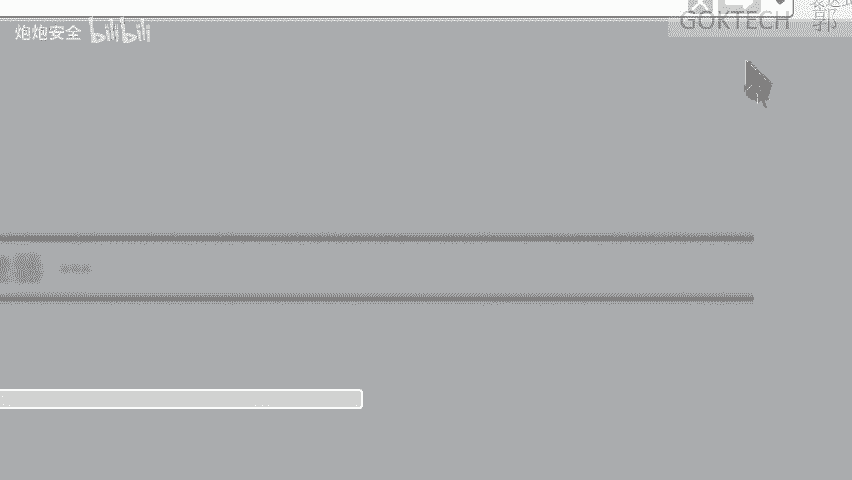

我认为铭文就是我们人眼看得懂的这种叫铭文啊。比如说我这边传的时候，你看着啊。😡，我们这房的时候再做一个登录嘛，我们不干其他的，我们看这个地方啊，我在前调一个流量怎么看了？首先看一个圆。😡。

这个大的鼠标这边。大家鼠标这边再来看一个什么啦。😊，目的没错吧啊，最后呢看这个什么它的一个协议嘛啊协议这边没有协议，但是它有一个详情详情嘛，叫什么认证的一个登录嘛。OK那底下这些是它的一个详细内容。

我点到这个包里面，底下是它的详细内容啊，比如说什么啊，它这边有一个什么。😊，SMTP这个协议啊，这里的话呢我按了一个叫什么回车啊，这个斜杠R斜杠N是回车的意思啊，然后呢，下一个包。😊，啊。O我们再往下。

这里呢我就输入了一个用户名。😊，在这里预缸，接着往下我在这边开始输入我们的一个什么啦。😊，因为数据是有去有来有回的，有来有回的。所以说我们这个你看是八0新发的。然后我接下来啊，他输完优名。

是不是要开始输密码了？😡，啊，开始输密码，密码就在这儿。😊，啊，我们现在学过密码学的，告诉我这个是什么。😡，S编嘛，那我就可以拿着它干嘛去做一转做一下转换。那这种算是比较简简单的，因为它数据量比较小嘛。

对吧？数据量非常小，所以说我们可以直接获取到。当然前提是你要对这个数流量的话，有这个流量这个结构有有一定的一个体现唉有一定的那个认识啊，我我们之前呢有讲过说怎怎么把我们的一个数据进行一个结构的划分呢。

就在这个地方哈，最常见的一个分析，就是统计。😊，啊，英文单词叫tats啊，统计这个地方哎。😊，为什么我老老是碰到？啊，统计这个地方有一个协议分级。啊，其实我们的数据哈其实说白了我们的数据其实是这样子的。

😊，就像我们寄快递一样，或者写写信一样，写信嘛。现在基本上大家都没写过信。😊，我敢保证。结过了，现在还在写啊。😊，好，B友是吧啊，B友可以，你看高雅人士就是这样子的，好吧，学着点啊。😊，来。

数据首先我写在纸上面，当然了这里的话是由软件来产生的对吧？啊，然后呢，我数据放到这边之后呢，你比如说写信的时候，你要把它放到什么，放到我们的信封里面。😡，对吧然后呢要去寄续嘛，或者说寄一个快递的时候。

是不是要叫快递员写上对方的什么地址啊，对方地址地址一般情况下分为几个。😡，一个是姓名加联系方式。第二个是什么？😡，他家庭住址嘛。😡，对吧也是说白了就是什么呀？一个叫物理地址。😡，啊，物理地址。

一个叫逻辑上的一个地址。比如说全国我已经查过了，我这个名字全国是有同名同姓的。😡，啊，什么叫没有同名通姓呢？😡，就是你去拍做那个身份证的时候啊。😡，如果你的名字是唯一的。

一般情况下那个帮你做作证的这个人做制作这个收集材料，这个人会跟你说，你的名字是全国全国唯一的。有我同桌，我以前的同桌就是他的这个名字是全全国唯一的。啊，他名字同音有可能，但是如果是三个字一模一样的。

全国没有一个啊，是什么？我就不多说了啊。😡，O。啊。好，就说我数据是塞在这一层一层的。😡，呃，壳里面啊，我发的时候呢，我要发的时候呢，首先是数据嘛，然后呢数据做一下转换嘛，对吧？

你肯定要0101的格式转换嘛，转换完它之后呢，打上各种壳，装上各种壳，最后变成0101的数据啊，0101的数据。😊，哎，这个地方要画一下，就变成这种0102数据了。哎啊好吧，大家。😊。

看一下有没有见过这种。知道吗？这种叫高低电瓶。啊，高低电瓶这个不好控制啊，高低电瓶，什么叫高低状面，知道吧？😊，它有一个高低电高低电频表示一嘛，低电频表示0嘛。

这样子就能够完美的表示一个什么0101的数据。当然了它是有间隔的。什么意思呢？你比如说我我设置一个单位嘛，比如说单位单位量为一，比如说单位量为一这么长嘛，那如果说我有一个这么长的那就说明什么。

它是经过两个间隔的什么意思呢？你比如说我原来的一个一哈，我的原来一个高电瓶一，应该是表示这么长嘛啊这么长。但是如果说我有是这样子长的那有可能它就表示一，就是连续两个一嘛，啊，okK那我们不管它，反正呢。

😡，传到对方的时候，你想。😡，你说到一个快递能够马上知道里面的内容，没错啊，因为是你买的嘛，对吧？但是假设是假设是别人给你寄信嘛，对吧？你能够一下子知道里面的内容是什么吗？不可能吧。

我只能肯定要把它拆开嘛，一层一层的拆开，然后才能知道里面的内容。😡，没错啊，除非他跟你关系非常好，对吧？啊，那你一下子就猜出他要说什么，或者说你有偷偷视眼是吧啊？😡，OK那好。😊，那大概了解一下数据啊。

那大家来了解一下数据OK。😊，好。这个就算是比较简单了，这种题目就是算是比较简单了。SMTP还有一个什么tenet这种都是铭文传输了啊，铭文传输的OK那我们接着。

来像这种的话，像这个这个这个过滤规则的话，我就不多讲了啊，过滤过过滤的一个规则就我就不多讲了。豹纹或者要流量，我们有5元组5元组。😊，主要看哪一些啊？第1个IP。圆。墓地。IP。

mark你们肯定就是看不懂的，这个叫逻辑地址啊，什么意思呢？我们任何设备想要上网都是需要有1个IP地址。😡，啊，平时你们没有注意，是因为你们上网的时候，它会自动给你分配一个。😡。

你手机要上网也是一样的啊，手机要上网也是一样，它会自动给你分配一个。但是呢你平常你肯定不会去关心这个OK。😡，第三条第四叫什么？圆和墓地的端口。这个叫端口号。呃，比如说我们去访问网站的时候。

正是因为它开放了一个端口，然后我们去访问这个端口才能够去访问它的一个应那个这个网站。正常情况下，我们HTTP嘛，正常情况下，我们HTTP它是80端口，就是默认的情况下。

如果是现在的话更多的是HTTP这个S是什么？443443啊，这个是它也是它的一个端口啊。ok还有最后一个最重要的一个叫做协议。😊，他们分别位于哪里呢？😡，比如我随便打开一个。圆。😊，圆。

原来IP等一下稍等一下。语IP。目的IP。协议。想要看原端口，目的端口必须点进来。然后底下这边去看它的原端口目端端口，这个没有，为什么是因为它是网络层的啊，没有到达输应用层。

所以说因为它不是应用层的协议啊，所以说我们。也不用看哪，看这个。这个呢就有所谓的原端口哎。原端口和。目的端口。就在这儿在这边啊，就说明了我用我的这个端口号去访问这个人的这个端口号。Okay。

一般情况下涉及到端口号了，基本上都是应用层的协议，都是一个应用，都是访问它的一个应用。你比如说。HTTB是基于什么呢？80端口tnet是基于23端口，这些都是一个应用。

反正这个过滤过过滤规则我就不多说了哈。😊，啊。这里所谓的包长度就是单条流量的一个长度。单条流量的一个长度啊。你比如说他要是上传一个文件，那肯定是比较大的嘛。相对来我们应该说相对来说比较大嘛。

那么我们就可以什么定义一下，给它过滤一下。你比如说什么大于等于7或者大或者等下等于等于等于这个94啊，就我给它匹配它的长度啊，匹配它的长度。😊，啊，还有大样的1个HTB模式的一个过渡啊啊。

这个我们今天也会稍微提一下，就是它那个HPTP协议啊，这些这些请求啊这些请求。😊，ok。我们来简单介绍几个呃呃比较常见的一个技巧哈。😊，来流量分析题这边有一个著名的一个题目叫会飞的苍蝇。啊，这个地方呢。

啊，我们进点进来看一下啊，我们不管怎样，我除除非说他这个题目给已经给你。😡，提示的很清楚，否则我们该该去正常分析的就正常分析。首先呢啊一样的统计这边点一下，点击协议分级。😊，那我们会看得到呢。

它更多的流量啊，你看着啊更多的流量是聚于在我们的1个IPV4的一个基础之上了啊，IPV4的一个基础之上。这边有看到一个。😊，百分比吧百分比啊，比如说什么呢？IPV4它占的流量比较大。

因为我们现在基本上最常用的就是IPV4。什么叫IPV4啊，就是你们熟见的熟悉的什么192。168。1。1或者0。1这种类似这种啊，就是家用的路由器一般情况下，它的一个访问地址基本上都是这个啊。😊，好。

然后里边你有什么，我再强调一遍，因为我们的应用基本上都是基要么是基于UDP的，要么是基于TCP的UDP。😡，TCP。啊，那我们看一下啊，它基本上它的一个流量都是全部集中在这个TCP里面啊。

往下这里的话呢，我们可以看得到什么呢？😊，一个什么media type啊，这个的话呢百分比就比较比较重了啊，比较重的话，这时候我们就有必要什么？就有可能它的数据就是藏在这儿。😡。

每一个流每个包含这个字段的都有可能是常有数据。那我把这些数据组合起来。啊，就有可能是我们要找的那个数据啊，当然你要找你要把它合并起来嘛，那合并还有另外的一个方法。具体的话呢，大家可以去研究一下啊。

这些read up都有啊，read up都有我这里。不详细讲这个啊这个readning up，这就是答案了啊，说白了。😊，再往下。还有一个小技巧，就是什么？我刚才这个地方嘛。😡，我不是亚巴拉。

统计的时候，我不是要把这个协议分级嘛？协议分级我看到这个media type了，我想把它选筛选出含有media type的那个数据，我就把它作为过滤器应用选中。那么接下来在这边每一个包。啊。

每一个包都是行有的嘛media type了。这里。啊，每一个包都是每一个包都是啊。也可以什么呢？也可以针对这个针对这个某一个。你比如说什么你要针对于某个字段，具体的某个字段。

不一定是刚才是通过那个那个协议的分级来看的嘛，对吧？啊，因为我要看出它数据主要主要集中在哪一个字段啊，什么意思呢？😡，呃，就好比如说我们那个。那个那个叫什么来着？比如说我们一个货货物嘛，货车嘛。

货车它可能好可能会有好几好几节货物嘛。但是呢但是呢我们要清楚一下啊，比如说货车或者或者火车这种类似这种啊，它肯定是有什么，比如说这么长的一个货车啊，你比如说数据它有很很多个箱子嘛。😊，一号箱子。

2号箱子3号箱子4号箱子，你要清楚他哪一个箱子放着你想要的数据，那你就把这个几号箱子给它选中就可以了啊，那一样的，我也可以具体去查某一个数据啊，把它我想要的一个字段给它选中就可以了。

就包含这个数据的一个包含这个的字段啊。😊，OK还有呢针对流哈来我们这里看它的一个详细的讲讲述啊，在关注的HTP数据包或者TCP数据包中选择硫汇聚。😊，这样子的目的是为了干嘛？

把我的一个流汇聚或者还原成我看得懂的语句，我看得懂的数据，或者我想要的数据啊，在谈我们来看一下啊。😡，来。这里有一个比较典型的哈。这个。这个或者说这个一句话菜刀理由中获取一个文件，或者什么呢？

先找到get gett shell，理如再找到一个flag啊，它已经跟你提提示很清楚了啊。😡，来一样的，看到啊，注意看啊，一样的。首先我对它进行统计分级，看一下它数据的话。

大概是集中在什么什么什么格式下啊。😡，啊，主要是IPV4嘛。这里有1个UDP和TCP啊，更多的时候是集中在TCP呢。TCP的话呢，这里呢就没有什么所谓的应用层了，没有说所谓的什么。😡。

HTTP这种常见的嫌疑，那有可能就是TCP流啊，那我就什么找到我们的1个TCP流啊，TCP的一个流。😊，好，来找1个TCP的啊。啊，TCP的理由啊，那我可以对它进行专门进行一个分析啊，就什么啊。😊。

给大家干嘛？最终它这个TCP的一个理由。当然了，这一题不能这样说，如果你直接这样做呢，东西太多了。😡，我们再详细看一下他的题目里面其实已经给你提示了，说的是什么？😡，先找到get shell。

什么叫sha？就是说这个Cll已经被获取了，什么意思呢？😡，就说如果说有个人呢。😡，打个比方，比如说我我随便攻破你们任何任何一个人的电脑，我可以远程连到你的CMD，你觉得会发生什么事情？😡。

首先我可以用CMD把你的电脑关机。可以用CMD上传一个文件到你的电脑上面。那这个文件就有可能造成一定的破坏。啊，OK当然这个是CMDCMD也叫C尔，因为C尔就是命令命令制符嘛啊CMD。😊，还有什么啦？

😡，网页上也有C叫做。如果说这个CR被利用了，叫做木马网页木马。网页木马网页木马很多网站都是有网网网页木马了，这是这这些叫什么挂码？😡，很多时候为什么网站为什么网站会会报爆那个危险嘛？

一般情况下就是这个网站被挂上了木马。😡，啊，不是说它内容是是什么黄赌毒之类的啊，就是这种这种网站呢，它有时候呢它就不没有设置那个安全防护嘛，容易被攻击，往往恰恰往往是这种网站容易。😡，很多人去上了。

对吧？😊，OK所以说我们首先要找到一个什么流嘛。那我们就想到了，它既然是都是TCP了嘛，那既然是基于TCP，那么就就肯定是没有没有什么没有那个HTT密嘛。我刚我在应该是这样说。

我刚才看的时候没有HTT密码，这个协议分题我没有看到HTTP那我就什么只能从CTCP来看TCP呢contents。😡，当然怎么啦？😡，啊，这个英文啊。发含什么内容啊？就是双引号啊，发什么内容。

比如说我我查的时候，我觉得我我可以来试一下CMD看一下有没有可能啊，看一下有没有可能是CMD的啊。你看我们数据点开啊。😡，随便点一个包啊随便点一个包，我们往下走。😡，我们往下走。啊。

这个数据还是蛮多的哈，我们往下走啊，这个数据可能我们看不懂什么。然后我们第二个选一下第二个包。😊，啊，往下走。有时候呢并不能看到你想要的，我们随便来你来一个来。😡，这底下这一个看一下。😡。

如果说没办法找到我们想要的数据啊，这个可能显然这个地方就没办法，就很多打非打印非打印制符嘛。什么叫非打印字符？我就不多说了。随便拿一个。如果说你你觉得是CM地点，随便拿一个，然后呢进行一个什么呢？😡。

TCP留了一个追踪，打开这个东西，你看得懂吗？😡，看不懂，那说明肯定不是这个了，肯定不是这个我们就要考虑一下，是不是我刚才敲错了TCP contents。😡，想到那个流或者要想到shall。

那就想到shall流的话，我们就要想到。😡，一般情况下，我CMD或者我的一个linux里面啊是这样子的，linux里面怎么查看它底下有哪一些哪一些文件，就是用LS嘛list简写嘛，不知道还有没有印象。

那如果是windows的话，我给大家说一下叫DIRDIR是什么的简写呢？😡，啊，目录的简写什么意思啊？啊，有些人听着懵蒙的是吧？我随便拿一个。😡，这是我的一个windows啊来DIR。

我可以看一下底下有哪一些内容，底下我这底下有哪一些数据。那如果我想要用。😊，linux呢怎么办呢？我先进一下子系统啊，稍等。😡，我就要使用这个LS这条命令，看一下我底下有哪一些东西。

这个是windows里面的，我就不多说了啊，我就不多说了。啊，也就是说他有可能会用到LS或者什么。是看一下我们筛选出来，其实我们已经筛选出来了，但是好多好多我要一个个去弄，我觉得比较比较麻烦。

甚至呢有时候你真的是真的是要一个个去去试的哈那我们来试一下有没有DIR。😊，啊，DIR这个这些地方应该就少少了啊，这个地方就是比较少啊，比较少了。我们再想一想哈，这里呢甚至我会利用这个东西来。😊。

因为打开CMD它固定开头就这个。😡，他的开头固定是这个。😡，你可以看一下你的电脑。😡，固定都是这个，那我就想到了什么呢？用这种方法。😡，好。没找到还是还是有了哈，还是有的那我们就要什么呢？一个可以去找。

当然了题目呢你看呢这里都已经已经有了啊，就是地方就是啊你进入了一个什么呢？好像是CMD的一个提示了，那我们就试一下，是用这个行不行。😊，吓。追踪理吧，TCP理由诶。进来了吗？😡，什么系统？😡。

什么隧道嘛？😡，看一下还打吗？什么系统？叉P是吧？现在很多地方还是用有叉P啊，越老的系统呢越越容易被攻击啊，因为早就已经停止了对叉P的一个维护了嘛。甚至呢我。😡，我不知道从哪里听到。😡。

这个消息还是挺可靠的，就win7马上也要很快也要被慢慢停止维护了。现在它主打winwin10啊，主打win10啊，来L啊。😊，DI啊他敲了一下命令了，我们下往下。😊，哎，他找到了一个文件。

并且打打开了它type就是长按文件的内容。😡，得到一串数据呃字符串。这这5万是什么？嗯。所以说我把这个base的一个数据干嘛拿出来粘贴去进行解密。好。其实它的数据可以体现在这儿。

其实数据已经体现在这儿了，这是这是它的一个正常的数据嘛，数据嘛我们看不懂是不是？但是它16进制数会把我转成什么了？阿克码值。😡，这里其实已经给你提示了。C盘底下的东西对吧？而且呢值就在这，是不是？😊。

值就是这样嘛，对吧？啊，就是刚才那个606贝值64的嘛，OK。😡，啊。他就是把接下来这个流哈，接下来产生的任何流，就这一堆就跟这个相关的，把这些所有的流给我显显示在一个弹窗里面。😊。

让我用户可以看得懂的一个形式来显示。因为你怎么你你给我拆，就好比如说我有一堆的货，我要分批运运过去，你是不是怎么运了？你是不是比如说有7个包，那你肯定要把7个包完整完完整整的运过去嘛，对吧？

你不能瞎搞啊。😡，有时候万0中途被人家塞进了一个什么数据，那就很尴尬了啊。你比如说我有一个数据有一堆数据啊，比较比较那个哈，就明天上班。😊，啊，对吧？明天要上班，结果中间被人插了一个布。明天不上班对。

明天不上班，那就很尴尬了。这还不好再还比如说我跟你问好。😡，你好吗？啊，万离这个传输的过程中，这个好字被它去掉了啊，自己想我就不多说了啊。😡，对吧所以说呢啊这个流啊。

当然这个流跟刚才我讲的那两个地址跟这个没什么大关系啊。但是呢你们肯定要保证它传输过程中的一个安全性嘛，对吧？😊，就可以就是说他可以通过这个理由啊，把你的数据给它抓下来。O那我们往下啊来。😊。

还有这个哈我要s啊，我要这个刘荟剂我就不多说了。再来比如说什么，它可以针对针对数据进行导出啊，这个这个是针对那个那个一句话木马的，我也不多说了啊，因为这个之前都讲过了啊。😊，奶。

这个是一个什么无线wifi流量包，无线能不能抓呢？能。😡，无线无线数据是能抓的。😡，啊，就是因为它比较好抓，空气上到处都是。都是数据包。你怎么抓？问题是你怎么抓。😡，这样子啊，肯定不是吧啊啊。😊，啊。

不是卡地上有一个有个专门的一个命令可以抓啊，那这个不是我们的目的。我们目的是说我们是目的是砸向他给我提供的这么一个流量包。没错啊，就是这么一个附件嘛，那我要进行分析。首先呢。😊，我强调一下。

因为无线是经过加密的，无线传输是经过加密的。我们最早的时候是一个加密方式，WEP。😡，后面出现的WPA乃至我们的WPAwo。这种加密越往下越安全。

但是我要简单给大家说一下简单的一个早期的时候简单的一个加密啊，早期简单的加密它是通过握手的方式啊。😡，什么叫握手？就是我。😡，手持360。啊，这是AP。AP就是无线发射器啊。

nice我要想要想要连到他wifi啊。😡，想要连到wifi怎么弄？连上去的时候呢，首先呢他要求给你发一个包哈，他给你发一个包叫握手包。😊，他就这边给你提供，这边密码肯定是存在它上面的，这个叫key。😡。

首先他发发给你一个包，叫做12341234。😡，1234发给你，然后呢，你输入密码啊，你输入密码之后，他会发1个12341234的1个key给你啊，1234的一个数据给你。然后呢，你用自己的key。😡。

把它跟我1234的这个数据啊进行一个进行一个算法。😡，啊，进行一个算法计算，算到一个值叫X1。把这个X1发给这个这台。😡，这一台。这台啊，然后这台AP呢自己呢，因为他自己也有个key嘛。

然后他跟这个1234也算算出一个只叫X2。😡，这两个值要是一样干嘛？😡，认证通过，这只这只是认证通过而已。认证通过还要干嘛呢？还要做一轮人的协商，但是这个协商不是我们的重点。

而且呢这现目前也目前也不一定是用这个，他有时候是扣户单给你办代理啊啊，都是一叉的呃这种方式啊，这这个不是我们的目的啊，我只是简单给你们说一下，他有这个呃握手的一个过程啊，甚至呢它密码是不能在上面传的啊。

😡，最早期的时候，他密码是直接在在上面传的，也有可能的啊。OK。来，如果说你们打开一个包哈，看到他这个协议是802。11的，你就应该知道这是一个无线包。😡，这个。😡，你随便打开你的无线网卡。😡，啊。

右键这个你平常你平常连连无线不是点这里吗，对吧？但是这时候我变成了右键，打开网络internet这里有个共享更改我更改啊，说错了，更改识别器的一个选项啊。😡，哎，你比如说我这个无线无线电长。我选过来。

吓。你要么是有这个什么V list的杠N杠A杠AC呢，这些其实都是802。11802。11N802。11A802。11AC。😡，啊，是这样是这个意思啊。

你只要是有这个L wirelessre wirelessre无线嘛，wi是线嘛，wire无线。😡，啊。802011也是啊。好。那我这时候呢应。要用到的是什么？要用到的是卡利系统。

这时候真的是得用卡利了啊，卡利来我们把这个。无线的这个包简单放进来一下。好，记住了哈，这条命令不要随便复制粘贴啊。😊，就像。😊，昨天那个坑啊，我为了个偷懒。😡，啊，单电级续不行。回过头啊，手敲一下好吧。

手敲一下可以。啊，有点坑啊，来把这个包哈，这个包你们要注意啊，有时候它会默认按那个图片的形式来来来来来来来那个传啊，来打开啊。所以说我们打开方式要设置一下啊，打开方式在哪？哎，我的打开方式呢，稍等一下。

😊，嗯。是我眼花啊，看到了？我要上克啊这个。啊。但是呢我们要看一下，它首先确定一下啊，它是1个802。11的一个协议啊，里面的内容我们是其实是看不懂的哈啊其实是看不懂，你甚至看不到那里面的内容哈。

怎么呢？😊，复制。粘贴到我们的卡利里面，稍等，火速开机。

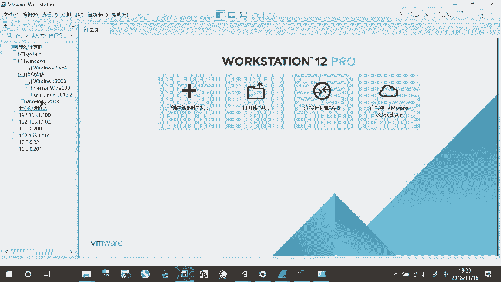

啊。火速开机开到里面之后呢，我用那个命令这条命令。😡。

哎呀。correct啊 correctrect啊，为什么是带一个A啊？因为我无线是在哪里传啊？空气嘛啊空气啊。😡，啊，它是在空气中以电磁波的方式来传的。既然是电磁波，就有可能受到一些东西的干扰。

什么意思啊？😡，嗯，最常见的一个电磁波啊，你比如说微波炉啊，你家里要是有微波炉。😡，啊，微波炉开着你在你的厨房里面开着微波炉，然后在里面连着无线上网是非常非常慢的。

因为你的信号被它的一个微波微波给它干扰了啊，这是有有的啊这是有的啊。😊，啊，甚至是噪音也会也会影响什么噪音啊。你比如说那边人家在装装那个很烦嘛，装装修，或者说人家在下面修地铁那个口的声音了。😡。

那个声音会造成空气震荡。😡，空气震胀也会造成我心跳传输的一个问题，明白吧？明白，我只是简单给你们普及一下这个东西啊。😡，啊。OK从这个地方呢，我可以看得到它是用什么这里这这这这这。😡。

它是用这个WPA也是相对比来说比较安全的一个啊比较安全的一种一种协议进行加密了啊，这里呢涉及到的两个东西，一个是要ESSID。😊，啊，这里是细分啊，我再强调一下。

细分啊所有的SSID就是我们能看得到的那个wifi的一个名称啊，wifi的那个名称啊。😡，但是这里做了一下细分，一个是ESSID，一个叫BSSID一个是嘛wifi的名称啊。

我其实wifi作为我们把无线讲成wifi其实是有偏差了。但是大家都默认了，潜移默化就认为wifi就是这个嘛，大家都懂，那我们就我就说了啊wifi这里的话呢叫mark这个叫SSID啊。

那我们要首先看一下这个这个这个wifi的名称就叫0719。😊，啊，这个wifi的名称叫0719啊，有时候呢我可以教大家一招，你你想防止那个防止别人蹭你网，你怎么做呢？

你首先你不要把你家的wifi广播出来，什么意思啊？你不要把这个wifi的名字给它广播出来。😡，你就选择不广播。隐藏，然后你怎么去连呢？手动添加，你选中你选中你那个不是搜索，就是你选中那个我们的手机啊。

那个wifiwifi这个你进去这个最底下有一个添加网络，你点击把你的无线名字收进去。😡，对，就可以了啊就可以了。嗯。呃，你要看你家的那个，首先第一点，你要你你要家里要有一个家用无家用无线路由器嘛。

第二点你要能够登录嘛，对吧？第三点，你要有这个功能嘛。😡，啊，还记得我上次跟你们说的，我拿的那一个企业级的路由器，我已经有有告诉大家，那个地方可以用网线插到它的一个管理口嘛啊。

用网网用那个浏览器可以登录上去嘛。那你比如说家里有这个，你可以登录上去，看一下有没有这个功能把它禁用掉。😡，吓。O啊。OK然后呢，这里要进行一个什么暴力破解。什么叫暴力破解呢？就是。😡，到另外一点。

我之前也跟跟大家说了，前有几个前提。第一个密码的次数没有限制。😡，对吧第二个没有图形图形校验嘛，就是没有没有任何校验。😡，啊，并且呢它只只要输入密码就可以了，对吧？那这种就比较好破了啊。

比较好破了OK它自带了一个字点哈，它这里自带了一个字典啊，自带一个字点叫什么呢？啊，它里面的呃就有一个一堆的字点。那如果说你的密码比较简单的话呢，马上就被破出来了。😊，好，那我们来看一下这个包哈。

开机完毕。啊。稍等一下啊，稍等2分钟啊，不对，2秒钟啊。

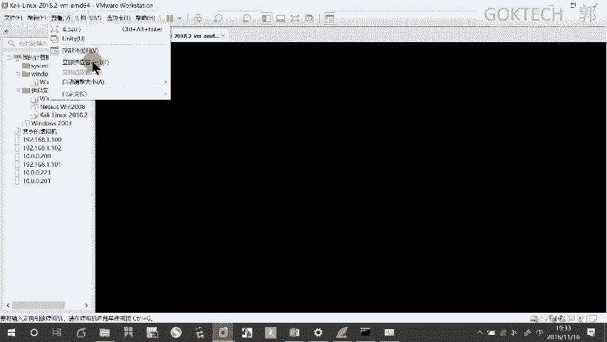

Okay。就OK这个包。这里面呢我好像没有给他发啊，这里有一个啊。就这个哈视频的这个开开盘啊，首先我右键在。😡，中端打开是吧，有个有个问题啊，大家一定要注意啊。😡，我把它放大啊。

大家一定要注意确定一下你是不是在你这个终端是不是在你的桌面下PWD我现在root下面码CD我要先进入桌面。😡，啊，里面有一个视频视频，对吧？啊，OK那我用。L。Crrect。刚NG去分析一下这个流量包。

可以确定的是它的一个什么SSID是0719嘛，对吧？OK它的一个加密方式是WPAO那我现在要把它暴力暴力破解是吧？暴力破解的话呢，需要跟上一个参数。😡，杠W。啊。对。杠W。好，进行一个暴力破解OK。😊。

嗱。哦。来。😊，破解完了。诶。😊，密码稍等一下，我没有这个这个东西是吧？稍等一下啊，我没有这个没有这个这个叫什么来着？我没有这个工具哈，来稍等啊。😊，暴力破解的时候，你首先要把密码干嘛全部携带。😡。

1个THT文本里面，我能不能手枪？😡，能不能手敲可以吧啊，我把所有的密码嗯给他敲一下，肯定人肯定是没有这种功能的是吧？啊，你只能用什么密码机器来生成这个密码。但是有一些密码的话呢比较复杂，什么意思啊？

你比如说8位。😡，八位密码啊，你要产生一个8位密码，全部是数字组成的，非常快。但是如果是由数字字母。😡，特殊制符，那你可能要几天几夜才能够生生成一个啊。那我这里看一下有没有啊，稍等一下。我这里有一个。

看到我这里有一个啊，在这。😊，在这这一堆。这一堆这个是一堆的一个。啊，密码字点我把它放进来啊，看着啊。😊，改一下名字啊。诶。稍等啊，看不清了。rename啊rename。pass。点天气。嗯。来。

再来一次。他就会跑。那为什么他跑跑的这么快呢？用时。😡，这么久为什么？因为刚好这个888888刚好就在第二个密码里面，所以说它非常快就能够。😡，能够出来什么意思啊？😡，就这个地方。他是。

第一个密码去尝试唉第一个密码去尝试一下。第二个密码尝试尝试尝试，不断的尝试的。😡，啊，但是如果说你给他限制说密码输错3次就就要等等几分钟，那肯定是这种暴力破解，肯定是破解不来的啊啊，它刚好就在第二个。

所以说它速度就比较快，明白吧？😊，啊。OK那我们继续啊。那昨天还讲到这个USB哈，USB它有一个特殊的地方，就是呢它数据是USB的数据是藏在这个地方的。你要把它显示出来，怎么显示啊？😡。

随便点1个USB的一个流量包，随便点一个底下有一个这个。这个看得到吗？😡，我过来一点。这里啊这里啊我点到什么了？这个地方啊这边点一个好，然后呢右键把它应用为列。apply啊apply啊。

呃所了呃那个单词怎么念，我不是很懂啊。那个如果是中文版的，直接应用为例，在这边。那我把这个数据干嘛啊，copy出来。😡，copy出来进行解也没问题。OK针对这个流量USB因为USB可以接很多东西。

没错吧。😊，所以说呢USB一般情况下考察这么几个，最常考的有这么几个啊，一个是什么？我们的一个。😡，键盘。当然我这里说的键盘是外接USB的键盘。不是这个啊不是这个自带的这个你要要用其他了。

这个不是USB的流量，你要自带外带一个，或者说用我的一个手写版，这些流量也可以赚得到啊，也可以赚得到。😡，ok。然后呢。它这里哈有一个映射表，每一个按键都有对应的一个值。比如说A就是表示什么04。

那这个值是在哪里来体现的呢？在这边。😡，这边刚好有8个字节啊，每一个数据流量包，一个字节，两个字节，这样以此类推，总共有8个字节。😡，八个字节第几个字节啊，第三个字节，第三个就是这里。😡，这个地方。

就表示它一个什么基腱。😡，基腱啊，不是你那T不是那个肌腱啊，不是我们的肌肉这个肌腱啊，它怎么样呢？就按键盘的一个信息啊，会放在这个第三个字节这里。😊，这里好放在这边之后呢。

我把这个数值去跟这张映射表一一对应。当然啦，不是你人去对应啊。我们刚才看到了它是FF是吧？FF那可能还要去看一下它对应的是哪一个值啊，对应的是哪一个值都在这边呢都在这边。😊，都在这边啊。这个是脚本啊。

这个是表映射表。然后这个脚本我们可以写一个映射的一个脚本啊，通过脚本把它跑出来，你按了哪一些键啊来。😊，怎么去解这个数据呢？有第一种就什怎么样了？

windows里面记住了windows里面windows里面你干嘛呢？😡，把这个什么呢？数据啊，把这个数据全部用表格的形式嘛，就它这里每一行。😡，稍等。它这里每一行不是好像跟好像跟我们的一个表格一样嘛。

这个是表头嘛，对吧？就是列嘛，每一列连列我把它变成什么啦？变成我们的一个跟表格一样的形式啊，就导出嘛，导出分组解析结果为CSV这个是一个excel用excel可以打开啊。然后呢这些数据。😊，啊。

数据复制出来复制出来之后呢，干嘛啊，复制出来之后，我们就可以做对它进行一个分析。这是windows里面的啊，那卡利里面非常人性化，他用这条命令就可以智能的帮你把数据给它分离出来，这是智能的方式啊。

把你分离出来啊，把你这个相关的字段分离出来，分离分离这里这条命令啊一定要手敲啊，这是一个过来人啊，对里面的一个告诫。😊，啊，手枪这里是你的流量包。😡，这里是你要保存的一个数据，你把那个流量包。😡。

保存到这个地方来。然后呢，怎么办？用脚本对它进行分析啊，因为它有一个映射关系嘛，我用脚本进行分进行分析就可以了。O。😊，来，我把这个盯一下啊，稍等。有时候这个命令我也不是记得很注啊，所以说适当的啊。

进行一个。好。那，我进到这个目录里面啊，稍等。哎，我出来了是吧？OK我把该删的删掉一下啊，稍等。

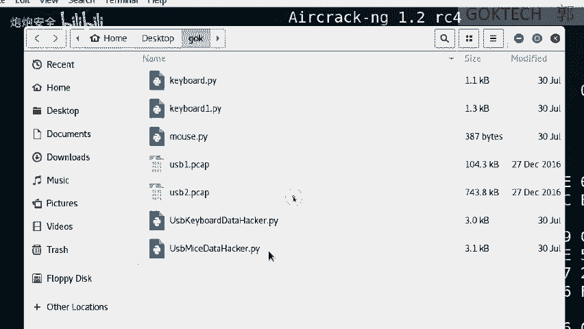

好，这以为USBE的1USBE的一个流量包啊，看着啊。😊，呃。T suck。干啊，首枪啊USB1。😡，稍等。啊，这个包干嘛了？杠T大写的T大小写要区分的。😡，Fs。杠EUSB的这个什么啊敲权了。😡。

CAP啊cap嘛。地塔。data然后把它导出啊，这是导出的意思啊，把它导出到USBdata。

一点TST这个文本里面。它这里会提示啊有一个警告，有个警告说你现在使用的是root啊啊是这种操作是很危险的啊，是很危险的，这是一个警告没关系啊，它能不能生成一个呢？😡，啊。USBda我们打开看一下。😊。

是不是就相当于我手动把它复制出来？😡，啊。一个字节、两个字节、3个、4个、5个、6个、7个、8个。没错。ok那我要对这个数据进行分析，怎么分析呢？有一种方法哈，你要是眼力眼力够好的话。😡，眼力够好的话。

第三个字节去一一比对，那肯定是太蠢了啊，那我们怎么办呢？😊，唉，稍等一下，我改到了什么东西呀。

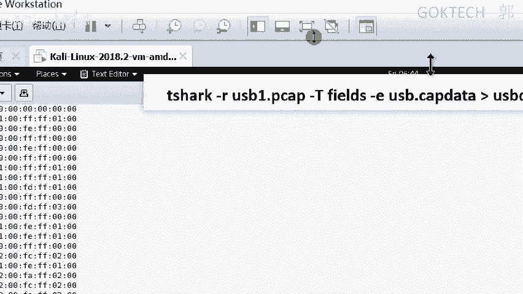

我把它关掉啊。不保存啊。

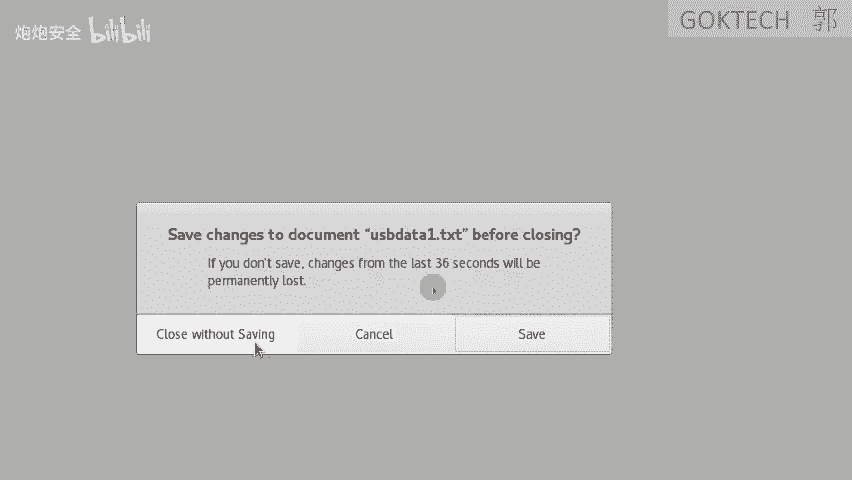

好，现在我要用这种方法啊。就要用这个数据啊就要对这个数据，用这个用这个脚本啊，这里有一个脚本啊，这里我写了好几个脚本啊，在哪里呢？接在我们这个。啊，稍等稍等一下。流量分析这边USB流量分析。

这里好几个什么。好几个脚本，python的一个脚本。OK我们用什么呢？这个keyboard就可以了。keyboard keyboardboard这个脚本就可以了。我们把它干嘛呢？运行一下就可以了。😊。

这个脚本也不需要调什么，他需要吗？不用，因为他已经写好了，它的映射关系是固定的嘛。😡，ok。运行样部脚本就可以了。python。稍等稍等一下稍等一下。命临太多了。Python。好，USB。

keyboard没有吗？稍等一下，看一下啊。USB keyboard没错啊。我们看一下。那我们用这个吧keyboard一吧，我们用一或者2都可以啊。keyboard一吧。PY运行一下。不行是吧？

那我们用这个。加本。哎呀，脚本。第三行，keyboard im。就是 data塔。来。这个脚本呢有个简单的一个问题啊，来看着啊我先编辑一下，因为。😡，来。

首先我们想一下这个脚本啊是要需要去破解哪一个破解这个数据里面的包嘛，对吧？我突然想起来，因为我这个改了哈，它里面的是什么呢？我们随便看一个都可以啊啊。😊，这里面呢因为它原来是dUSBda。

它只是这样子的。我我们现在是这个文件是一嘛，对吧？那我们把它保存一下。😡，我我我改的是keyboard1啊，keyboard1啊。😊，ok。来。可不好意，我运行一下。来。这里就有数据出来了啊。

因为它这边有基建嘛，有基建就有数据对应出来。😡，看得懂吗？😡，Hello， I am writing something important。But I don't know use。拼音。MO的。

什么意思？😡，就是我不会拼音。😡，那他那他用什么？😡，有几种情况。第一种要么我是我用。手输入嘛要么语音嘛，但既然这底下有数据，那是肯定是跟他的一个什么啊，我们一个特殊的一个书写书写的一个输入法叫什么？

😊，不比。啊，不要说粗话啊，无比。😡，好好，大家做的时候好OK欢迎大家去使用这个来验证一下啊，验证一下OK。😊，因为我没装有无比啊啊。呃，问时我。到时候研究一下5笔啊，大家随便来来来来下一个都可以啊。

这个我就不多说了，这个没什么难度啊，你就5笔按这个来DDP什么的，直接按按他这个来敲就可以了啊，我就不多说了。😡，还有啊。内容就这样了哈。大家就是他那个解析出来，就是大家注意我要开始输出fllog了啊。

很土啊，不过是用用中文的形式来输出的。你可以把下面这句话的拼音作为fllog来提交，我就是fllog，哈哈哈啊，没有哈哈。😊，吓。就这个你用拼音就可以了。我。

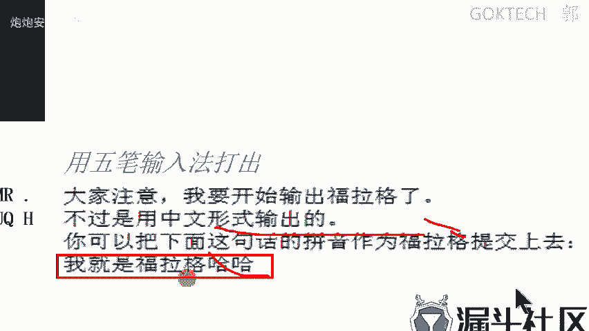

肌油。是啊。flog里面是没有空格的。好，OK再接下来鼠标鼠标的流量鼠标是不是也是USB。当然了，我这个是用的什么蓝牙啊，蓝牙，那你当然就弄不了了啊。O来我们这个鼠标的移动轨迹是有规律的，什么规律啊？

如果我们把屏幕作为横。😡，纵坐标，那是不是可以认为它的一个代码就是用我用一个二元组。X值和Y值给它替代，就可以替代出它的一个鼠标的移动轨迹。得啦。okK那这个呢也比较简单哈。来它是四个字节。

相对来说还更少了。😊，就是这个有效值啊，它是四个字节，相对来说就更早更小了啊。当取什么0X00的值，00的值的时候，就表示什么我没有按键。😡，0一表示按左键02表示什么？按右键。好，O。

第二个第二个我们就不看了。啊，第二个我们就不看了。第二个就是说左右偏移啊啊左右偏移，还有第三个上下偏移，因为我上下左右嘛，上下左右嘛，对吧？OK这里有一个值哈，必须给大家说一下。

这个是也是一个一个一个呃PY的一个脚本哈。当构构造的时候，这里要注意一下。😊。

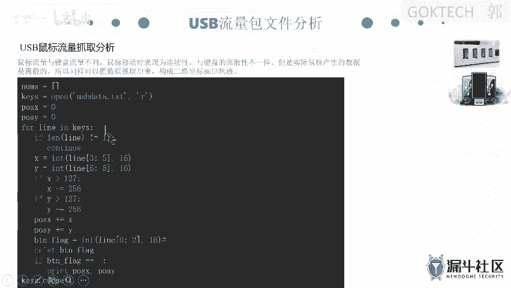

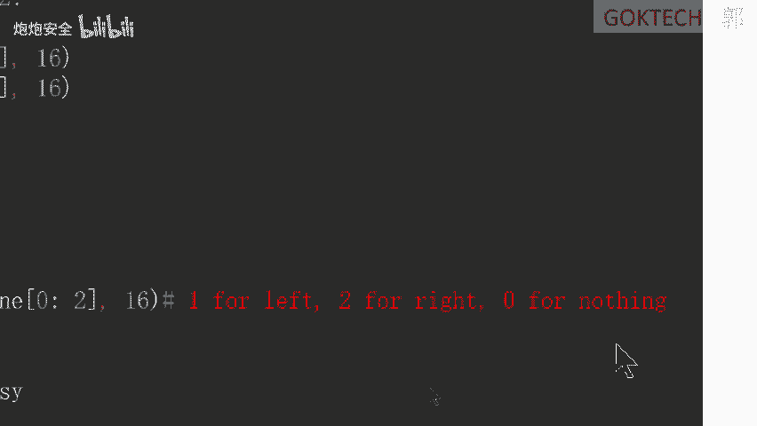

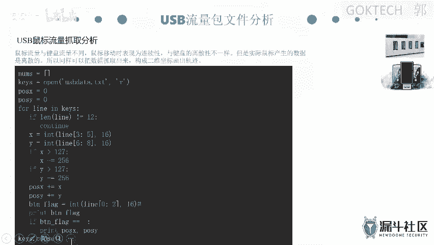

这里的时候要注意一下，就这个地方。你要改成它，要么是一。要么是2，要么是3，要么是4。啊。来。要么是一要么是2，要么是3，要么是4啊，不不没有没没有4啊，要么是一要么是2啊，要么是0，就这个地方了。

它定义的1个BTN flagag了啊。😊，就从这边选嘛，对吧？选嘛，来一表示什么left leftft是什么意思啊？左键嘛啊二呢右键嘛三呢啊没有删零呢表示没有做嘛，如果说你这边给他家选的零是什么意思啊。

只要你鼠标有移动全部给我装下来，那这个包就没什么意义了啊，那就没什么。你比如说我现在啊你看着你比如说我用这个flag。😡。

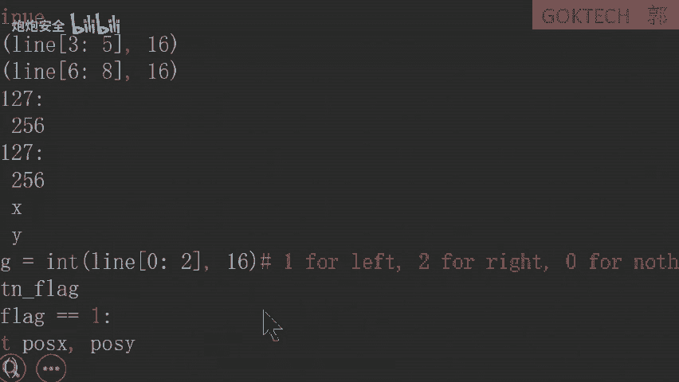

哎，写错了，不好意思。Fag。我是怎么按出来的，我肯定是按着左键嘛，然后把它敲出来的嘛。😡，然后这样子吧。Im Hanson。对，很中到，很中肯啊啊，就我按左键的时候画出了这个图形嘛。

OK那我就可以把它分析出来，把这个流量给它分析出来啊，来这个嘛if付 if付。😊。

这个嘛需要自行调整，自行调整啊，就就这个地方就这个地方。😡。

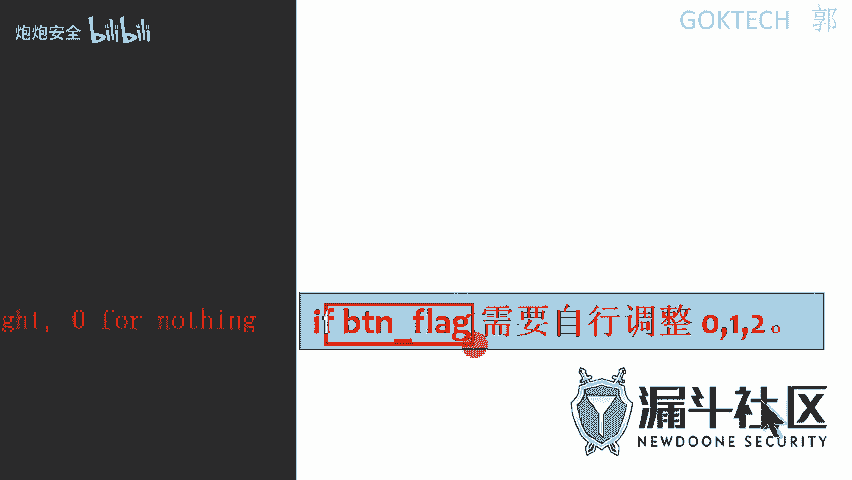

就是当我这个当我是一的时候，一是什么？left leftft左键是什么意思啊？就我按住这个左键的时候，这个轨迹嘛给我记录输出它的X和Y轴。😡。

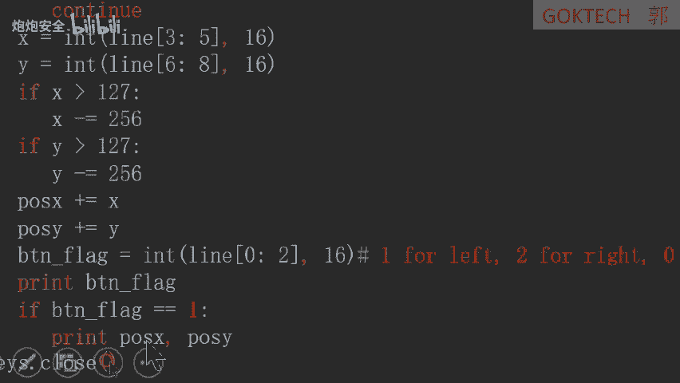

X不对，X和Y坐标啊。O这个也比较简单哈。首先呢我运行一下这个就可以了。😊。

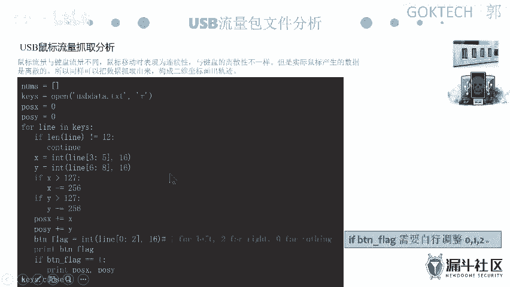

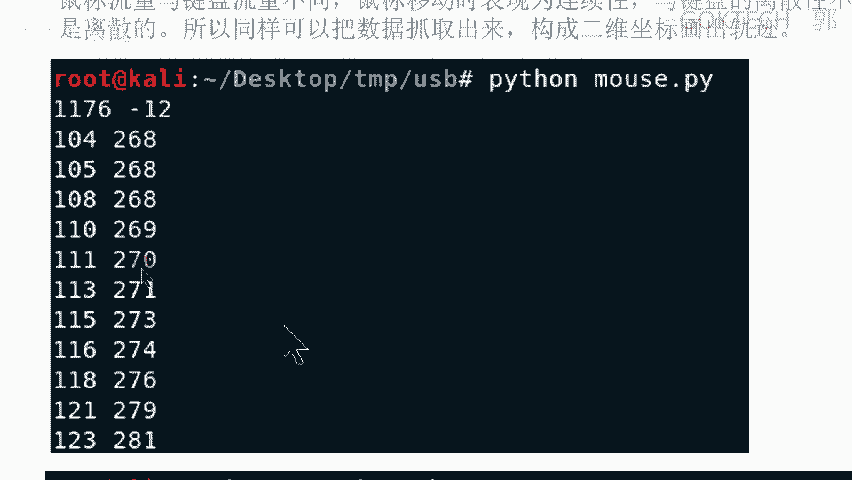

啊。运行一下这个这个是这个。这个包就可以了，等一下啊，我首先。要把它的数据抓起来，把它的数数据怎么抓？😡，我要把它的数据，这里有一个哎。稍等一下。这里有一个。USB2没错啊，这个USB2我们打开看一下。

😡。

稍等比较慢，这个是英文版的啊。

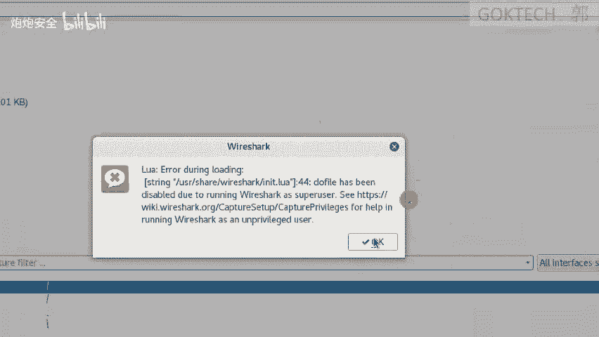

O。嗯。😊，不看他不看这些。往下。往下这几位几个字节。😡，四个字节四个字节表示键盘还鼠标。😡，不し。鼠标对吧？所以说okK是他，没错。没错。来。我偷懒一下偷懒一下。那个是复制啊。😡，来哎是吧。

蓝把输出到什么了？哎哎哎哎。😊，输知到什么？我们的1个USBdata2。OK我现在呢。是不是就有1个USB2data2这个错吧，是吧？然后现在我要这里有个鼠标的一个一个。😡。

这个东西啊我我们来改一下啊改一下啊。首先这个地方我们要改嘛，要改哪里啊？😡，我要是分运行这个二嘛，对吧？并且啊这个地方呢要么是左键，要么是右键嘛，你不要去输零啊，零的话肯定是一堆没用的数据啊。

零的话就是就是我这样移动它也会给我记录啊，所以说这肯定不是啊。😡，s保存一下，保存了保存了，保存完之后呢怎么办呢？运行一下嘛。😡。

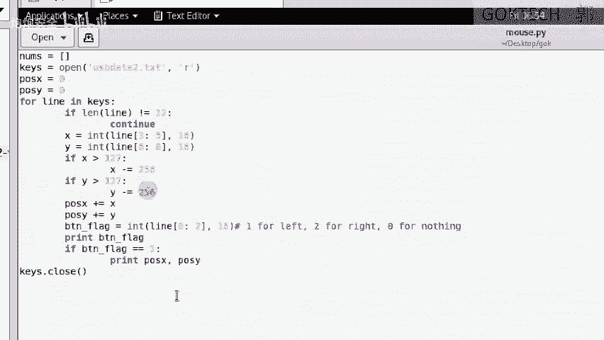

Python。啊，运行这个mouse。好。运行这个mouse啊。好，O。运行完mos之后呢，看见啊。😡。

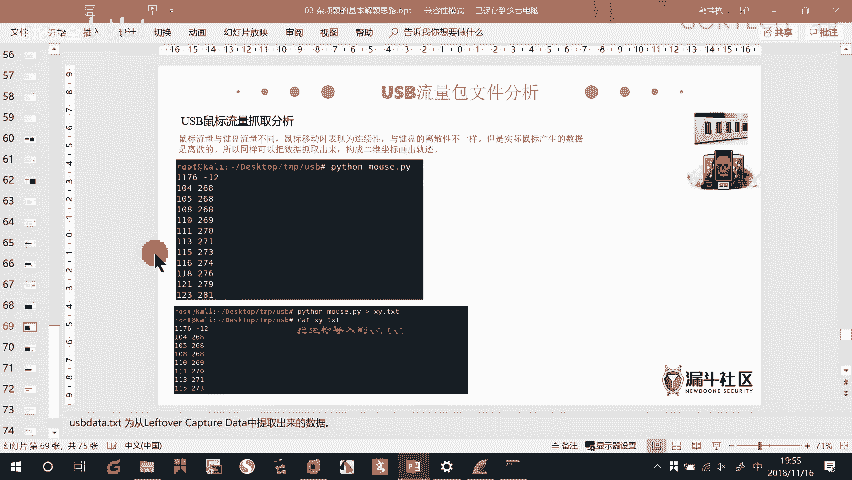

手动去复制。首动把这个横纵坐标复制出来，唉，奇怪它怎么不是横纵坐标了，稍等一下，往前面翻一下。😊。

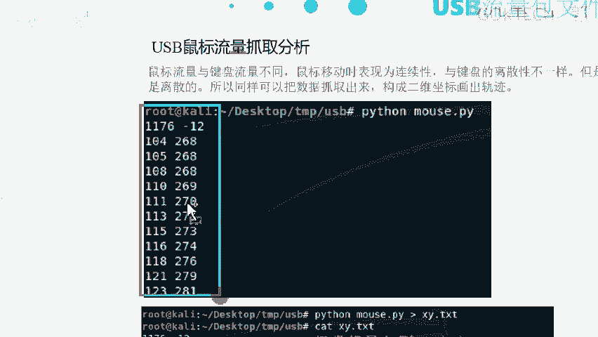

有有有还是有一定一些有效的一个横纵坐标的哈。如果说他找不到横纵坐标，那你可能就要干嘛呢？你可能就要对它进行一个呃值的一个修改，就那个flag了唉这个。😊，这个值你就要改成一或者2了哈，我就不多说了。😊。

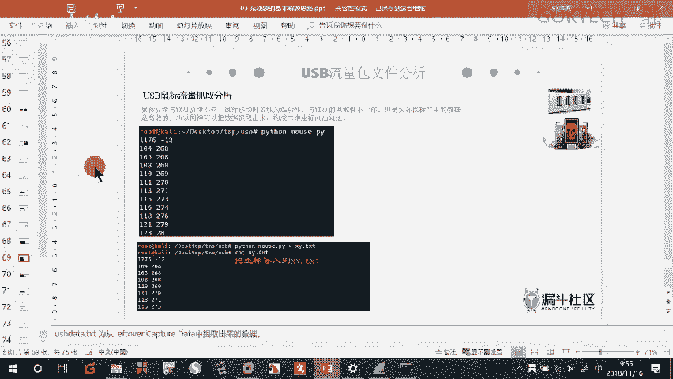

来。因为刚才这种方法呢，不利于我去，我要手动去复制粘贴，肯定是不现实的，怎么办？😡。

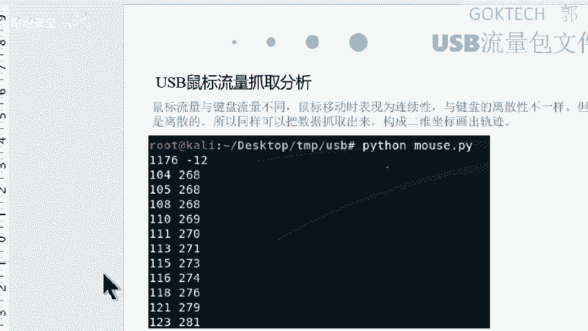

把它坐标导入到这个文本里面。啊，你看呢这么多啊，我一个个复制复制少傻掉啊，对吧？所以说怎么办？😡，啊，来。不要杠好不好？😊，来呃什么来着？😊，这个把它输出到一个什么文本里面。

这个文本你比如说叫DB逗逼啊。😡，O。ok我们看这个逗逼这个内容啊。

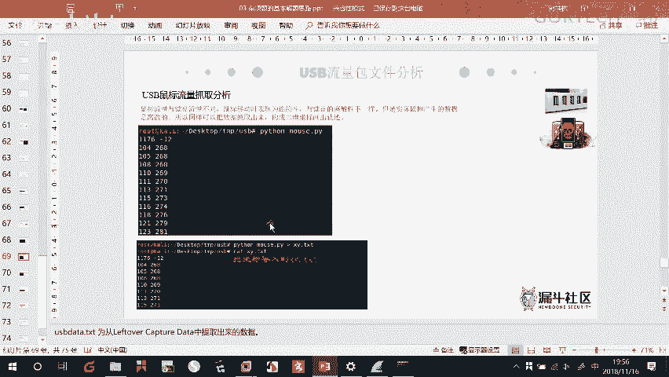

哎。😊，是它这个横纵坐标的啊，横纵坐标的OK横纵坐标的数据。行，那我现在只要把它运行一下就可以了啊，运行一下就可以了。😊。

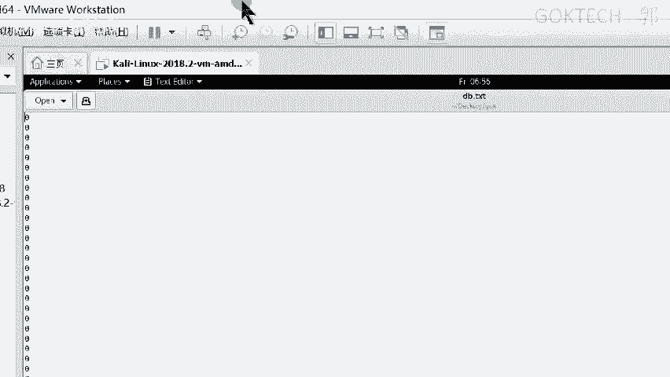

用什么命令呢？运行这条GNU。plGNU pro，然后呢，里面呢输入到我该我pl该要想要分析的那个文本就可以了。这个是什么？😡，我告诉你这个什么，这个叫图像分析工具。😡。

说白了就是他把你这些数据收集起来，做成一个图像，我色多边的图像，我看一下啊。😡，啊，诶。Gnu啊P plot啊 plot啊。来。GNU pro。啊，这里他要求你干嘛呢？用这条命令哈，用这条命令啊。

pro这条命令pro。😊，啊，然后呢。跟上我想要给他分区的DB点TST对吧？

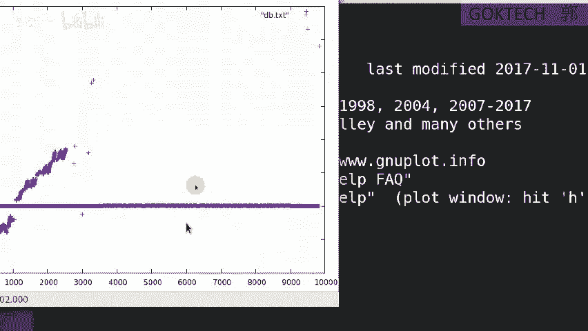

他会帮我绘制成这个图片啊。那好，我很遗憾的告诉大家啊。😡，这个呢啊。错了啊，错了OK那错错了的情况下，因为这显然是不可能构成什么图的。有些同学说，哎，你你放大一下，没有了，没有这种事情怎么办呢？😡。

这里还有一个脚本。mo子这个脚本用不了是吧？这里有一个。这叫USB keyboard嘛，这还有个USB什么鼠标的这个啊我们用这个来试一下啊。😊，退出玩一下。呃。USB。嗯，这个啊用这个来试一下。

把它放到一个。1809吧啊1806啊。okK生成1个1806的这么一个包哈。😊，啊，等一下等一下等它运行一下，等它运行一下。哦，这个这个没改，稍等一下，我又犯了一个严重的错误哈。

来这个地方呢肯定显然是要改的嘛，改什么。😊，来里面的这个值嘛，你要针对哪一个文件进行修改嘛？叫USBda。😡，电下多少？USB datata2对吧？贝塔2哎，不是这个不是这个，不好意思。是这个。

USB data2点THT文本对吧？针对它，然后进行一个值的一个更改。你看着啊，这该改的时候还是要改的这是一个什么呢？这是一个人哎，网上一个一个一个一个那个数据哈，网上的一个数据啊。😊，啊。

okK如果说我们该改的时候也是要更改的啊，它是deive hard啊，这个人叫什么来着啊？😊，这个人叫叫等一下说啊，就说我们要改一下啊，然后改完之后呢啊它可以生成一个数据哈，稍等一下啊。搞完之后。

我们保存一下。啊。给它运行一下啊。啊。还没有是吧。看一下稍等一下。我保存了吗？USB datataUSB datata2没错啊。Okay。那我们可以直接对它进行一个运行啊，那基本上呢这这个的话呢。

看一下是不是我漏了哈。PY的个脚本在这儿。Mouse要一个 keyboard。没错。我看一下是不是在这儿啊，没有没有没有。就这个脚本了就这个脚本了。没错。运行下看一下嗯。python后面跟上这个。

然后跟上我们的一个具体的一个数据包。那这个还不是这么用的啊，它这个还是这样子用的。因为我之前是针对它做一个数据的一个分离嘛，把数据分离出来，那它还不用啊，那他还不用啊。

因为我这个是我一个同事的一个脚本给我的，脚本的话是需要把这个数据分离出来，把数据分离出来。然后我针对这个文本进行一个修改。那他不是啊，那是这个人家就是直接对这个什么了啊，等会稍等一下。😡。

它是值得针针对这个什么流量包啊进行一个直接的一个直接一个分析啊，我刚才是不是还要借助那个GNU pro对吧？它不是啊，它这个不是啊，他这个不是啊，它是直接不用借助这个，它自己就自己就输了一个东西的啊。

在这边那后我要跟上什么，我使用left还是用right，就是左键还是右键，我刚才应该是左键啊，还是右键来着。😡。

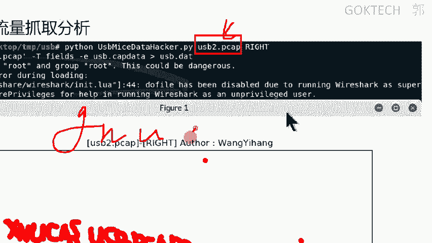

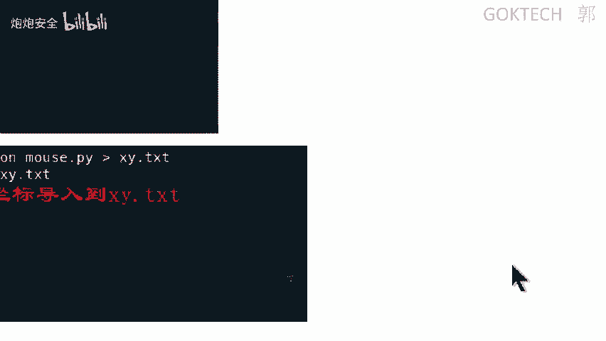

啊，这个一表示left啊，那我可能还要把它调成left。

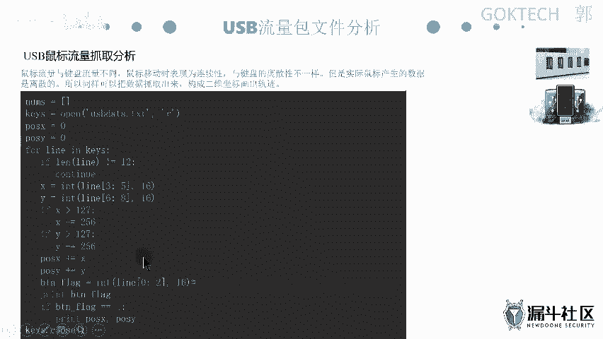

那的怎么拼来着？

行。我重新把这个东西拷进来一下，稍等一下啊，稍等我2分钟E二说错了，2秒钟啊。我把它删掉。我把这个东西给他复制一下，稍等一下啊。我现在重新来比一下啊，我们现在要用这个脚本去对这个USB2。

就是我们的这个什么鼠标的一个流量进行分析。那我现在怎么做？😡。

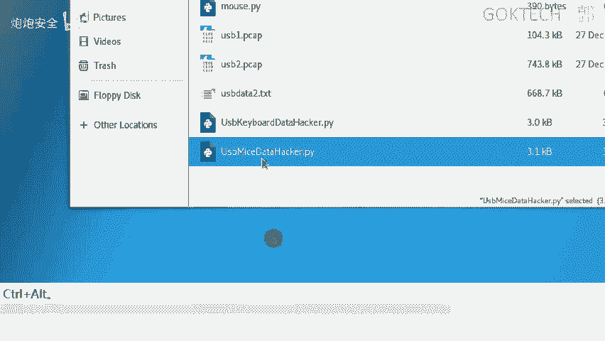

我使用这个脚本去对这个什么呢？USB2点这个文件进行分析啊。啊，我看一下。

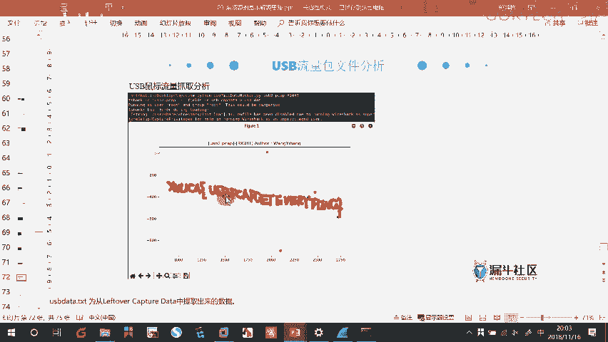

然后我现在要使用它的一个什么。😡，啊，左键呃左键没错，n。啊，进行一个分析啊，分析的结果呢，我直接回车就可以了。😊，好，来。是这种什么看不懂的语句是吧？看不懂语句，那可能left就错了。那我想要用什么？

右键？😡，这里呀。呃，点点进来。Right。😡，我下。okK有了吗？是不是这个？😡，啊，看不懂是来截图截下来一下。😊，嗯嗯嗯。快捷键冲突了。再仔细看一下。有没有一个大括号的标志？X NUCN。

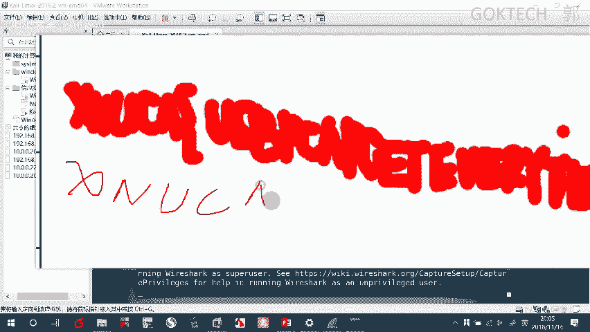

是吧。USB。诶。嗯嗯嗯。

系。这种。比较比较坑，这题确实有一定的坑度。那我大概也知道了，刚才我们这个题把这个关掉就可以了啊，关掉就可以了。刚才我们这个脚本是没有错的，什么意思呢？😊，就我这地方稍等一下。就我用自己的脚本。😡。

我用自己的脚本啊。😡，是没有任何问题的。这里的话当时我要是出错了，我看不懂的情况下，我把这个脚本里面这个一改为什么了？2。😡，啊就可以了啊，就可以了。行，那我们先下课休息一会。😊。

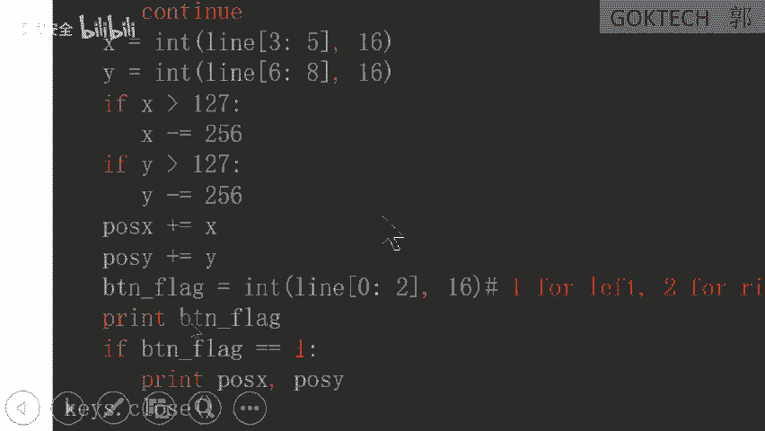

那我们继续啊。HTTB啊，讲这个呢呃是因为什么呢？我们现在这个地方啊带了一个S对吧？带这个S表示什么？HTBS它是通过一个证书的。证书协议上次我们也讲了，我就这里就不多讲了啊啊。

就说通过这个什么SSL这种这种证书啊，这种啊证书给他家干嘛了？加密的。所以说通过如果说你抓了一个HTTBS的包，你其实是看不懂的啊，是通过这种协议TLS啊。

当然你底层是SSL哈啊OKTLS我们这个协议加密过，我们需要导入一个K当然一般情况下，这种K，如果你做题目它肯定会从其他地方给你那你这个K你怎么看呢？😊。

中文版的这个呢编辑首选项这个地方啊来这里唉哎唉关了是吧？我再来打开一个啊。😊，流量分7级，我随便打开一个，我这里也没有HTTPS的啊。😊，我这边打开以后啊，我教你们怎么去路径，怎么去打啊呀，等我。😡。

默认又用这个给我打开了。打开方式啊，我要s啊。来。比如我随便打来编辑是吧啊，首选项首选项。😡，首选下。这里呢选中了一个什么协议？ical是吧，协议的话呢要选找找找找找找。😊，搞。找什么了？😡，SSL。

真的。这个。好，然后呢我要把这个key给它导进来啊，当然我这里没有key啊，你要。啊，不是不是这个啊哎我们需要从这个地方啊。这里这里叫做啊给它导入一个key啊。这里编辑的话呢也可以添加一个。

应该是上面这个啊。😊，上面这个上面这个。这个是一个debug的一个文件，我们不管它，这个是开这个才是key哈。key的话呢，我们这个编辑啊应该在这儿啊。😊，你咋在这儿啊。就我这里选选选选到SSL吧。

然后这边有一个编辑是吧？啊，然后呢给它添加一个。😊，啊，添加一个证书啊，添加一个证书就可以了啊。😊，当然我现在是没有K给你们的啊，我没有没有K给你们啊。😊，这个如果说遇到题目的话。

他肯定会哈从其他地方给你给你一个key啊。😊，啊，OK如果你导出来之后呢，导出来之后呢，看到的就是我们看这种的，看这种的协议叫HTTB。😡，HTP因为它只把它壳去掉了嘛。HTTP然后呢，我在右键干嘛呢？

追踪HTTPASSL记住啊是SSL的一个流啊啊，把我们把它干嘛呢啊，追踪出来就可以了。OK那这个呢流量题呢。😊，其实不难，难的是这大家对于流量的一个理解啊，流量的一个理解，以及说。😡，啊。

大家那个我们的一个掌握这个的一个方法啊，你比如说遇到一个流量题，我先协议分级啊，尝试一下啊，这里还有好几个小技巧啊，好几个好小技巧比较常考的这个USB的鼠标和键盘啊。

然后呢还要针对这个这个这个这个这个这个无线啊无线，还有什么啊我们几个小技巧，比如说什么。😊，把我们的一个对象导出来啊，我我我放到这里哈。😊，协议分级吧。协议分级。😡，查看一下协议分级这一块啊。

查看一下你的一个组成是怎么样子的。然后应用什么呢？过滤器。就我把这个因为我数据都包含在这里嘛，比较多嘛，那我就把它过滤出来，看一下有没有一些信息还有什么追踪啊，最终底下这个啊留了一个追踪。

比如说我连续的HTP的流，连续的TCP的流或者连续的其他的流都可以分析啊，还有什么呢？😊，还有说候我要把相关的东西给它导出来啊，比如说我我这里有个关键字嘛叫up嘛，说明正在上传某一个东西嘛啊。

但上传文件可能比较大，它就分成好几个好几个那个包流量。那我就要干嘛呢？把它导出来。😡，导出1个ITP啊，导出来之后呢，把这些这些数据呢全部干嘛全部保存一下啊。okK还有什么？

还有像这种什么数据的呃提取什么了，我就不多说了，我就不多说了。行。😊，那我们这个。

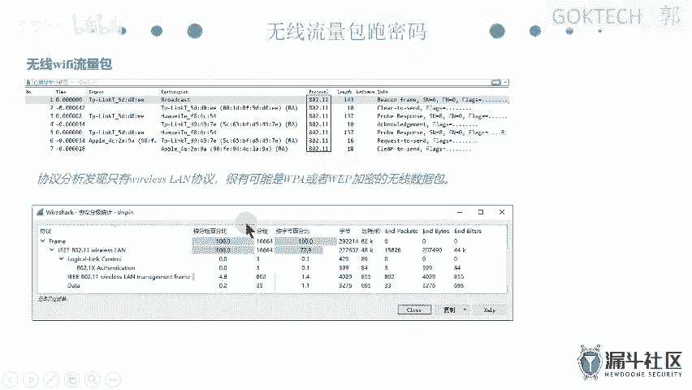