# CTF培训网络安全基础入门 - P13：（14）CTF赛前指导1809班_第二次课：密码学 - 炮炮安全 - BV1mT411q7qB

那我们。就直接开始了啊。有录有录。嗯。这个的话呢就上次课已经稍微讲了一下CTF的一个比赛形式啊。那我这里再强调一下啊嗯。

我们的1个CTF的话呢，主要如果按赛制的话呢，主要两种。

啊，一种是呃线上。呃，一种是线上的啊。线上题目就是线上的一种那个它有一个平台，然后呢那里做。那我们这边的话也搭了一个简单的一个平台。当然呢是那个自自己搭建的。这个我们在浏览器输这个IP地址就可以了啊。

注这个IP地址就可以了。10。0。2。208啊，这个先不弄啊，我到时候呢呃会教你们怎么去注册。因为你们注册完之后，那个命名要规范一点点啊，就那个到时候再说啊，然后呢，这种的话呢。

基本上就是嘛线上答题的一种形式啊，线上答题的一种形式。

协上了。还有一种是什么呢？攻防的比赛什么叫攻防呢？

攻防就说一般情况下线上是没有人无人数限制的哈，无人数限制的，反正你做多少多少题，他就拿相应的分数。那这个攻防不一样，攻防一般情况下是3到6人或者3到8人类似这种啊，就说我组队一个战队。

然后呢相互去攻击啊，只要拿攻破对方的一个系统就可以了啊。当然这个他不呃赛制根据赛制的不同嘛？他可能那个目的要求也不不太一样。okK这个什么比赛赛制，还有一种是什么呢？根据他么。😊，有一些比赛呢。

它什么呃可以在线的。呃，这个在线跟这个线上不一样啊。我说的在线是什么？它可以使用什么线上的工具，有一些工具哈是网页的形式啊，就是你可以你只要能上网就可以用的。还有一种工具是什么？你只能什么。😊，局网。

什么局域网呢？就是你不能上网，你只能用离线的工具啊，离线的工具。啊，离线你只用你只能用离线的方式来去进行操作啊，这个是他们的一个呃呃不同的赛制，它也可能有不同的规则。所以说大家一定要了解清楚了。

工具一定要备全，我给你们的工具呢，有100多种啊，你就在那个CTF的一个工具包里面。但是呢这个100多种的，不一定都有，就说不一定能够满足你的需求。所以说呃呃大家在平时也可以多收集一些工具啊。

100多种工具其实多嘛？很多了，但是有些可能有跟你的可能你用不上啊，可能你用不上。好，然后呢根据我们的一个题型哈，根据我们的题型，我再强调一遍啊，我们题型主要分为这么几种。第一种就是我们的一个什么呢？

呃比较简单的啊，也是我们得分最容易的mis杂项。😊，啊，这是我们下次课的内容啊，这是然后呢接下来那么crypto。😊，鬼斧头是什么？就是我们的加密啊，加密呢其中呢就涉及到我们的一个今天要学的密码学。😊。

密码学啊，而且呢这两个啊。这两个往往是不分家的。这两者往往是不分题，什么意思呢？就是你在杂项的题目中有可能会遇到什么呢？有可能会遇到密码学的一个题目，这个是很有可能的啊，然后呢第三个就是外部安全。😡。

啊，那这三项的话，以上这三项的话，基本上是我们可以短时间内去训练去提升的那接下来那么胖。啊，还有 want re。这两者呢就是属于一个长期积累的啊，一个是什么呢？是什么？嗯呃，那个破解了啊。

破解了做破解了破译了啊，然后呢，这个reverse是什么？是我们的一个呃逆向工程。逆向工程的意思是什么？😡，就正常情况下，我们呃程序需要源代码需要编译嘛，编译成二进制啊，可执行的文件嘛，然后我来运行。

那我就通过这个可以可执行的程序，那么逆推回去它的源代码。啊，那这个的话简显然是要针对什么？针对我们的一个代码非常熟悉了啊，那这个的话呢，我们就呃主要我们这次局训主要是。集中在这上上面这三项啊。ok。😊。

然后的话呢，我再简单回顾一下上次课给让你们装的一些安装包。首先呢需要装一个语言环境，什么意思呢？就因为它有一些工具。他是用那个java写的，或者说python这些的那你没办法。

你就只能必须装它的编译环境啊，语言环境。不然的话你装你你你不装那就没办法了，你不装就你就只能用一些其他的工具了啊。

来，首先第一个呢抓好抓了我就不多说了，记住了，我让你们装这些环境肯定不是让你们编程的啊，是让你们装一下呢，可以运行一些程序运行运行一些工具。OK那这个的话呢，装好环境的话呢啊我给大家看一下啊。😊。

主要环境就在你们的唉，主，稍等一下，工具这边CTF工具包CTF工具包。这个原我看一下。呃，我到时候传给你们吧哈，到时候传给你们了，记记得提醒我一下哈。那个在这个。😊，我记得我有船哈。

就是在那个我这边还我这是我有传上群上应该有哈。嗯，我们给大家看一下啊，就是我们这边的话呢，有一个什么有两个包，一个是ZDK。😊，为什么会老是碰到？啊，JPK的一个安装包，这个是抓好的安装包。

JDK呢它干嘛呢？你需要根据自己的系统的一个位数来选择你要装哪一个什么？比如说我们电脑是64位，一般情况下，大家现在都是64位了。啊，除非是比较早早期的电脑，早期的电脑，你怎么看自己的电脑是不是呢？

你可以怎么呢？在我的桌面上面，就我们的电脑桌面这边干嘛呢？右键我的电脑，或者说什么在这个文在这个打开这个吧在这个地方啊，这边有个我的电脑啊。😡，啊，点一下右键它属性这个地方，右键属性这个地方。啊。

可以看得到我们的一个系统的一个。啊，系统是多少位的啊，系统是多少位的啊，这边。64位了啊64位了啊，那OK你你就装64位了。如果你你是32位的啊，你用电脑又比较新的话，我建议你重装系统啊，重装系统。

因为32位的32位的一个系统的话呢，32位的系统它只能支持什么？4G的内存。如果呃32位。32位系统只能支持4G的内存，你超过44G，比如说我这个16G的是吧，它只能识别4G，剩下的12G干嘛浪费。

就让他们击灰，明白我的意思吧？啊，OK基本上现在大家都都是64位了。😡，O我我们我们装完啊，就那个软件包啊，软件包就是跟我们安装程序一样一模一样啊，就直接啊下一步下一步下一步就可以了。

当然过程中你可能要点一下呃，允许嘛之类的哈。那这个我就不多说了啊，像这种编程环境的哈，建议是装在C盘。😊，建议是装在C盘啊，默认就可以了。因为你等一下，如果你不装在C盘的话。

我这边的路径你就要具体的去改。那我觉得我我想如果说大家不是会改，不太会不太懂得这个路径在哪里的话，我建议是默认安装就可以了啊。默认情况下下它它是装在这个地方了，装在C盘这个地方了。

那如果说你C盘不干不太够用啊，我建议是这样的，我建议就是你在装的时候，他不是会让你选择安装路径嘛啊，大家不喜欢装在C盘，你怎么办啊？你把这个C改成D。😡，你其他不要动，那这样子的话。

你去改这个变量的时候，你只要把它这个地方改个D就可以了嘛。明白我的意思吧？这样就比较简单了啊。😡，OK添加环境变量的话呃，我再稍微给你们看一眼啊。添加环境变量的话在这个地方啊一样的。

右键我的电脑右键右键我的电脑啊，属性这个地方。呃，这里有一个什么高级系统设置。啊，高级系统测试在这个地方啊，点进来之后呢，里面有个选项卡叫做高级。😊，啊，高级这个地方之后呢，最底下这里有一个环境变量。

环境变量。然后我点进去我们找到这里啊，这里呢分为用户变量和环境变量，我们改的是呃系统变量，我们改的是系统变量啊。来像这一边的话，如果你们还没做的话呢，其实有一些变量它是没有的，这些组成是怎么组成的。

它那个组成是由变量。变亮名是唯一的。变量值呢可有多个。什么意思啊？就好比就说你们的一个X变量。😡，你们做过数学啊，有些同学比较烦数学是吧？但是高数的话，比如说呃像我给你们一个X变量。

你能够确定它X一定是某个值吗？肯定不是吧啊，这值可以有多个啊，那多个怎么办呢？你比如说我这个这个新建一个变环境变量，比如说DD这个这个环境肯这个变量肯定是没有了，然后呢，我给它设置一个值。

比如说是C盘下面的什么。😊，形想下面的X文件。啊，X文件夹，他就会去这个文件夹下面找下面找这些那个程序啊，相关的程序啊，比如说什么呢？我要运行一个程序，为什么这个程序能够运行？

是因为它去具体的一个环境变量去找啊。😊，然后呢，如果说。你想要添加多个，你就要加一个分号。记住了是中英文的分号要区分开啊。啊，我不知道大家能不能看得清哈。😊，像这个是英文的分号，就是比较小。

那中文的分号的话呢就比较大，间隔就比较大啊，这样能看得清吗？ok。😊。

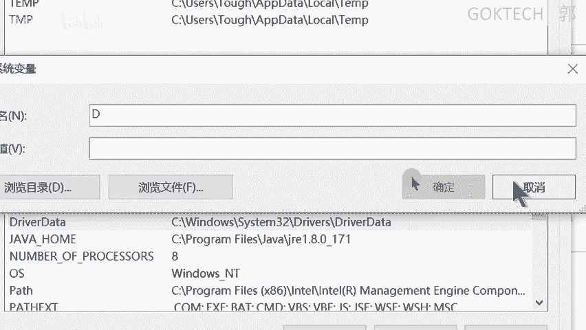

好，那如果说我们来看一下啊。这个地方他你他让你干嘛啦？😡，这个地方它让你新建，如果说你找不到这些环境变量的话呢，它就让你新建。新建完之后，你把这个值添加进去就可以了。好。那如果说这个环境变量已经有了。

环境变量已经有了怎么办呢？你就去编辑它，编辑的时候呢，在后面加上后面加上这一条就可以了。😡，然后后面加上这一条就可以了，就分号，然后后面加上复制粘贴进来就可以了啊，也比较简单。

那python的话呢也是一样的。拍等的话也是一样的，一般建议是安装这个二的啊，你你二和3的话呢，二和3可以同时装啊，但是已有有一定的那个啊需要考虑到它的东西啊，反正这个的话。

我们比如说像我这样子安装按2。7的，就是2。0的2。X的2。X的版本，这样子呢，它就是可以的嘛？编译什么呢？编译用2。0写的一个程序。那如果是3。0写的程序呢，它是不能用这个编译的啊。

所以说什么你还要装1个3。0的1个3。叉的一个版本啊，那这个没关系啊，这个遇到了再说啊，OK那添加变变量的话，也是方法，也是跟java一样的哈。

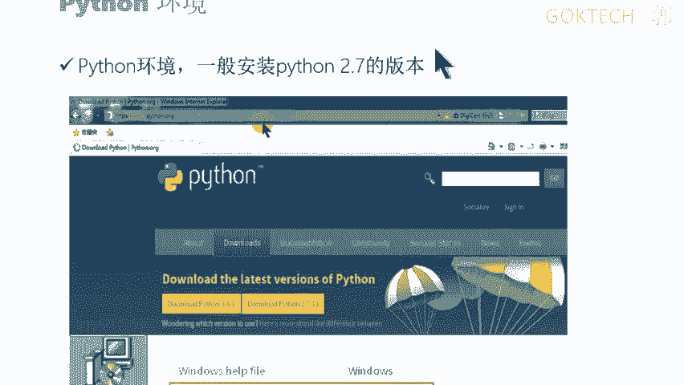

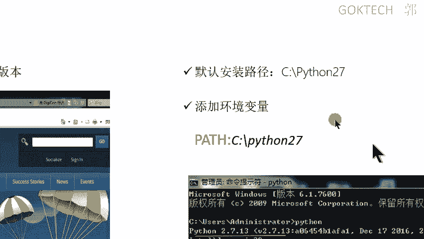

好，PHP环境的话呢，PHP环境这个呢是一个用于什么呢？这个PHP呢啊是集成了我们的一个什么呢。阿帕奇啊就是一个网页集成了一个网站啊，然后一个数据加一个数据库，加一个数据库。那这里的话呢呃有个包哈。

有个包，这个这个里面就有了啊，来等一下啊。😊，工具这边有1个CDNF工具包啊，CDF工具呃，呃不是CDF工具啊，是一个我有我这边有一个web这边有一个什么PHP study这个文件夹啊。

这个压缩包本来把它解压之后呢，里面呢有一个程序叫做PHP study20161103的这个点E文件啊，双击运行就可以了啊，双击运行之后呢。他要让你选择。英文路径啊，选择一个路径。

基因基本上基本上我们都是在C盘下面啊，你不要装在D盘，当然装在D盘也没关系，你这个地方给它改一下就可以了。这个盘古给它改一下就可以了啊啊，这呃这个投影这投在这上面有点问题啊，所以说我尽量就给它念一下啊。

给它念一下。😊，OK如果说安装完了之后啊，解压成功了之后，我就进进这个文件夹，记住了啊，进文件夹啊，进文件夹找到这个什么了。😡，进文件夹之后找到这个程序，然后给它双击运行就可以了啊双击运行就可以了。

你一定要点这个启动，点这个启动，等这两个绿了啊，就算是成功了啊，绿了啊成功了OK。

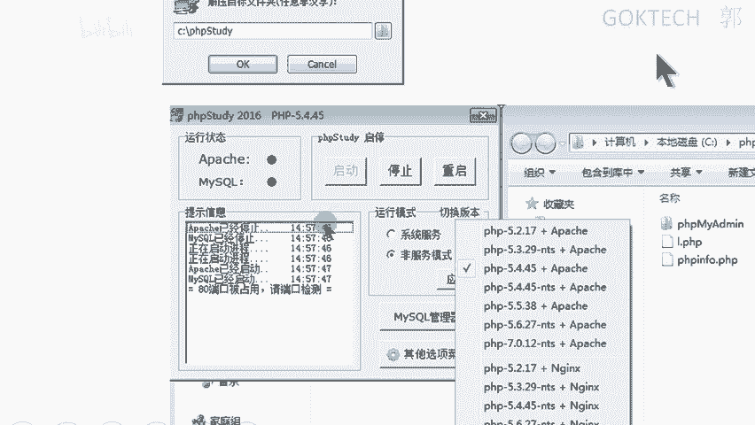

那常见的工具的介绍呢，这里我就不多说了啊，work呃如果还没装的话，线下问我一下啊。嗯，我们今天还是以我们的一个课程为主，好吧。嗯，当然接下来一个接下来有用到的话，我也会稍微提一下啊。

那今天我们直接开始讲这个密码学啊。密码学的话呢是我们的1个CTF这个题型的五大题型之一。嗯，密码学的话呢主要分为这么几个部分啊。我会讲这么一个，该记得记一下啊。😊，来。首先讲一下它的概述。啊。

密码学密码学一个概数，密码学是干嘛的？说白了啊，它的一个什么目的。😡，为了保证。数据传输的可靠性啊，我写一下吧，写一下吧，这个手写肯定比较慢啊。密码学。目的就是为了保证数据传输的。可靠性。好。

我们数据的话呢，什么叫保证可靠性呢？为什么会有会有这种可靠性？这种这种概念呢？来你数据传输嘛。数据传输了我们上网的时候，你们知道我们上网的时候，数据是怎么传输吗？啊，通过流量来传输的吗？啊。

作为一个流量的传输啊，比如说我用有线上网是吧？我用一根网线，或者说我接在无线上面，大家可能现在都是用无线的。但是无线的话最终肯定也要用线来传输啊。😡，你想。你们觉得你们在用学校的无线的时候卡不卡？对吧。

😊，卡不卡卡了，对吧？你们有没有试过凌晨5点的时候去去看一下试一下。会卡了。不外卡是吧，非常快是吧？因为。😊，嗯。呃，但是它是这样子的啊，呃无线的话呢，它是一个呃征用的过程。什么叫征用征用这两个字。😊。

自写的丑啊。征用啊，如果有学学过网络的话，有可能会听过这个是这个这个这个名词的叫hab。啊，没有也没关系，就是说征用。对对对对，征用什么叫意思呢？就是所有人来征用这个带宽。

你比如说你有你这个无线是100兆的啊，100兆的。😡，你一个人用就是100兆了，你两个人就用的话，就是每人我们最按最最最最最那个理想的状态，就每人五50兆。如果你10个人就是每人只有10兆。

就是用的人越多，它的一个网速就越卡啊，网速就越卡啊，OK那这个跟我们讲的这个有什么关系呢？来，就是说什么？比如说无线说白了就是为了让我们方便上网嘛，对吧？你最终还是要跟用线来传输线还是比较稳定的是吧？

来，网线可以从中间剪断。😡，网线可以用中间从中间转到剪断。比如说你这是一根线。我把它从中间剪断。然后呢，两边呢接接那个两边把它接成一个接成那个网线的那个头嘛，网线那个头，然后呢中间加一个设备。

中间加一个设备，然后可可以把他们两个人的传输的数据。两个人传输的数据干嘛呢？获取出来，然后呢，从导到我的黑客的电脑上面，这是完全可以实现的啊，这是网所以说局域网为什么那么不安全。当然这个只是最土的方法。

最土的方法啊，还有很多方法啊。那如果说你中间是光纤呢？大家想一下光纤怎么弄？光纤的话必须用熔接的方式，光纤是玻璃纤维嘛，光纤就是我们正常情况下，现在基本上就是用一态网线或者光纤嘛，入户。

我是说到家庭家里面的。😊，如果你用光线你剪断，你是有时候你剪都剪不断，剪断了之后呢，你还不知道怎么接，还不知道怎么接。因为它是需要涉及到一台熔接机的啊，熔接机啊，那这个我们就不管它了。

就是说反正这个呃数据有可能被截获。那我怎么保证说数据即使被截获了，即使被截获了，也不会。😡，他也看不懂了，即使被截惑了，他也看不懂，就是涉及到我们密码学啊密码学。😡，核心。系啊。

调这个同学的名字敲多了啊。核心就是吗？密码学。密码学的概念呢分为两种哈啊，也不能说分为两种嘛，就是说它用在哪哪个部分呢？用于。😊，啊，数据动态传输和静态存储。什么叫动态重复啊？你比如说我们两个人聊QQ。

😡，啊，聊QQ我有时候会用一些暗号。啊，有时候会按用一些暗号，这个就是呃传输的时候一个动态了啊，当然我这里的动态更多的是加密的过程。啊，我举一个最简单的例子啊，大家用淘宝网是吧？😊，正常情况下。

我们访问任何网站基本上都是个头头嘛，对吧？有这个头部嘛，你只要加这个S的，我不知道大家能不能看得清啊，就在这个地方加一个S的啊。😡，都是加密的，就是数据传输的时候是加密的。如果你没有这个S。

你你就应该小心一点了。如果你没有这个S，你就要小心一点了。比如说你在输入淘宝登录的时候，输入密码或者交易的时候，输入密码的时候呢，就有可能传输的过程中。因为你没有S传输的时候就没有加密，没有加密。

也就意味着人家只要一抓紧你的流量去看得懂，看得懂，就马上你把你的密码干嘛截惑下来了啊。那如果说你加了S呢就比较安全。所以说你们平时啊上网网购的时候，自己小心一点啊。😡，就大概是个这个这个意思啊。

然后静态的意思是什么？你们有没有一些文件比较隐私的放在自己的电脑上，然后呢想要加密一下。不想加密是吧？那你有有些人很奇怪。😡，什么意思啊？他就比如说这里新建一个文件夹，对吧？取一个英文名字。

别人都看不懂或者数字。然后呢这几里面呢再多新建几个文件夹啊，然后呢，在这个子文件夹里面再新建一个再新建一个，再新建一个。然后为了存一个不知道什么东西呢。😊，东西啊，对吧？我不知道干嘛啊，好。

这个是一个嗯心理学啊，这个不是我们静态静态的植入啊。呃，像我们的一个用在那个企业中的哈。😊，用在企业中。你们是那个叫什么？比如说你们的QQ的账号密码肯定是存在专门的一个地方的啊。

它这个数据库存在数据库里面，数据库里面存的用户名和密码是密文的。也就是说，即使你干嘛我们听听过一个这么一个词，叫脱库。😡，记住啊，是这个裤啊，这个这个裤啊不是裤子的裤啊。😊，脱库是什么意思啊？

就比如说他破破解了你的数据库，然后把你的用户名和密码拿下来。😡，但是如果说你你这个用户名的密码什么加密都没有，那直接一一目了然嘛。所以一般情况下是有静态存储的，所候需要加密的。但是一般情况下。

他们的加密方式是MDU。😡，啊，马上就能破解马上就能破解，直接往上一搜啊啊，在线的工具都能够直接解都能够直接解开啊。之前有一个呢有一个有一个有一个有一个简单举举个例子啊。😊，12306。之前就有一个。

然后下天任务是什么？知道吧？😊，啊，是有些同学可能是家里离得比较近啊，就没有订过票，这个也有可能啊。来12306了。正常情况下，我们去登录的时候，有可能是用QQ邮箱嘛，是不是要绑定一用QQ邮箱。

或者有类似绑定这种邮箱了，他要发短信和发邮件给你通知说你买购票成功的嘛。OK如果你这个12306的密用户名呃，你这个12306的密码。😡，有可能设置成QQ1样嘛，有没有可能。有有可能嘛。

对于所以说如果12306的数据被泄露了，就数据线泄露，他拿着这个什么密码去。😡，呃，尝试登录你的QQ，这个叫账户。就尝试去登，总有会成功的吧。对吧总会会成功的，所以怎么了？啊。

所以说大家啊奉劝的大家自己注意安全啊，密码最好是嗯南记是南记的一点哈，但是呢也不要全部都一样，是吧？OK。😊，啊，QQ丢掉，大家很很很危险的是吧？因为他呃这是QQ或者微信嘛，我们不说什么啊，是吧？OK。

😊，所以说呢如果说12306那个存储的那个数据的加密方式不够不够安全的话，那就有可能的嘛就有可能被被被攻击了啊。OK这个是它核心啊。好，那我们再再看一下它有几种啊，密码学有几种几种加密方式啊。

几种加密方式呢。第一种叫编码。编码是什么意思呢？编码大家有没有听过那个。Yeah。这个字这个字怎么写？我想想啊，有点忘了。摩斯摩式电码大家听过没有？😡，就是那个滴滴滴滴滴滴的那种，就是我们看。

看那个抗抗日战争的时候。用过吗？😡，肯定没用过是吧，看是肯定看过了是吧？啊，那种就是一种编码，什么意思啊？😡，他用点和横嘛啊点和画点画画点点画这种方式来表示一个表示就进行编码嘛，对吧？

OK这种编码方式呢，它是其实是有张有有一张表的，没错吧。😊，有一张表，所以说我个认为什么编码是什么一种映射关系。😡，您可不可以自己创建创建一个呃编码编码呢？可以，你只要什么？这个编这个表哈。

你自己清楚就可以了。然后呢，我们两个人要相互通信是吧？那我这个表我知道你也要知道这样子收到的时候，你再对应这个表就可以了吧，OK。😊，那加密可不一样，加密就不一样了。加密的话呢才是最最常见的啊。

加密的话呢。加密涉及到算法。😡，还有秘钥。这个字有人读乐啊啊，你不要去嘲笑别人，这个月是对的。你百度的话，这个字是多音字，而且他们两个的读音虽然不同，但是意思是一样的。所以说人家读蜜月是没有任何问题的。

😡，嗯。好，当然我是读密药了然后呢。😊，加密的话是这样子的，呃，密码学的话其实在那个。😊，呃，那个古罗马帝国古罗马帝国的时候，其实早就早就有了，就公元前了，已经涉及到公元前了，几千年前了啊。

当时的一个凯撒拉帝啊，创呃有了一个比较早的一个加密算法，什么意思呢？唉，他是这样子的啊。😊，比如说。我们现我以现在的26字母来作为举例哈。😊，比如说他创建一个算法。就左移。就是我只要收到。

我只要我要发出去的时候，就把这个字母干嘛左移。😡，啊，这个叫算法。然后呢，左移多少位。多少位啊，10位然后算了，等一下不好算两位吧。因为这样子我算等一下要算的时候比较麻烦啊。比如打个比方啊。

比如说什么呢？我收到了一个字母D。😡，变成这个是明文啊，变成密文的话，比如说我们来一个。带的死亡对吧？把它变这个是明文，我看得懂啊，变成密文怎么变啊？就左移嘛，左移什么意思啊？左移左移两位嘛。

D左移两位是多少？😡，哦。B。这个呢。一桌一两位置吗？这个呢。喂。这个呢。好，你看得懂吗？这个有意思吗？我们不说什么。😡，不说什么那个英文懂不懂，你当然看它。啊，BCYB都没有那个唉。

这个怎么说韵呃不是韵母啊，这个反正就是说没办法组成单词嘛，你又看不懂的对吧啊？😊，就是呃怎么说啊，这个有点忘了，但是我们大概还是知道，比如说你是比如说BFD这种这种东西，如果组合在一起肯定不行的嘛。

那如果说你是B和这个E就可以组成一个单词啊，我不知道这个怎么说啊啊，有点忘了好。😊，对对对对。没法组成一个那个啊那个那种不知道怎么说哈，就字母分为两类，我不知道怎么说哈。就是你比如说这种你比如说这个。

PB这种完全是没法组成的。如果你再加一个U就有可能组成啊，我不知道了，这个没关系啊，不管不管他啊。就说你现在原来是看得懂的，现在看不懂的嘛。然后对方收到之后，是不是要知道这个算法，除了知道算法。

还要知道什么？😡，只要密钥嘛只要密钥嘛，也就意味着什么呢？算法和密钥它两者是必须都要知道的。OK那我们来规定一下。😡，算法是公开的。算法公开了。就大家都知道了，但是这个秘钥一定要牢牢的记住。

老辑不能不能泄露了。最简单的一个例子来。呃，有时候如果你觉得无线家里的无线卡了，什么原因？有人蹭你的网对吧？有人蹭你王，为什么会有有人通蹭网？😡，对，密码太简单了，或者说什么有人把你的密码偷偷泄露出去。

你知道是谁泄露了吗？😡，就拿后置的网络这么多人连，你根本就不知道谁泄露了，对吧？是因为他的什么？他是用只是单纯的密码来来实现的。当然这个密码跟什么用户名密码跟我们这个没关系，我只是想这样说。

就说你这个密钥肯定是不能随便泄露了，对吧？啊，不能随随便泄露，如果泄露了比较麻烦啊，比较麻烦。😡，OK根据这个算法呢，大家有可能听过或者没听过的，有一个什么，或者说根据它的一个算法是一种方法嘛啊。

来它有可能它分为这这么两两种对称。😊，为什么非对称加密。什么叫对称？什么叫非对称呢？对称的意思就是说什么。😡，加密的时候，你这个密钥是两位嘛，对吧？那你等一下解密是不是也要移动两位？😡。

对吧我本来是左移两位，你大不了就右移还是两位吧。😡，加密和解密的密钥一样，就是对称的。对称的话速度非常快。如果是非对称，就是加密的时候跟解密的时候，密钥是不一样的。啊，这个就不是我们所能理解的。

因为我们人能够想得出来的肯定是非非常简单的。😡，啊，那你用算法就是用用编程的方式弄出来，肯定是比较比较难一点点啊，至少说在于我们没有在我们那种小白小白面前啊，可能就比较难是吧？啊，这个是嘛非对称的啊。

OK。😡，还有一种不算不算那个加密的一种方法叫是摘要。那这个摘要我们等一下再说了啊。😊，方法。就有这么一种啊，第一种叫什么编码？相当于有张什么。一个设表。Yeah。哎，加密呢。

需要密钥和什么算呃算法和密钥。较为复杂。还有一种摘要啊，摘要的话，我们等下就说这个映射表哈，我告诉你什么叫映射表啊。😊，我举一个例子啊。😡，哎，卡了，稍等一下。呃，举一个例子例子啊，红豆呃红豆的例子啊。

红豆的栗子什么意思呢？你比如说我有一一把红豆。一把红豆红豆知道吧？啊。来一把红豆。我给大家进行编号。肯定是闲着无聊才会给他去变号啊，对吧？它有一个一定的排排列组合，排排完了之后。😊。

我把它里面可能涉及到一些一些重要的信息啊，比如编号，你你可以不是编号嘛，你比如说用一些文字啊，看过那个。😡，酸雕家里没有那个小龙，你在哎，没有啊。😊，啊，吓死我了啊，就小龙女在那个哎，对对对。

在那个密封上面刻字嘛，是吧？啊，对吧？这也是一种哈，但是你不懂的话就不知道啊。来，那我打个比方，比如说我反正里面有信息，就红豆，每一颗红豆上面都有信息，但是呢我把这堆红豆。😊，放到一个不透明的袋子里面。

败走。哈。不透明的袋子里面，然后呢在外面贴上一层标签。啊，说他是什么？あの知。就是我在外面给他贴贴一层标签，就是说。😡，表示说这一袋这个袋子里面装的是纸。😡，就是我们打印纸或者其他一种纸。

那你看到的时候，你会认为里面是红豆吗？😡，你打个比方，你比如说你快递嘛。😡，快递外面标签嘛，对吧？比如说他说里面是鞋子，是不是里面就是鞋子？😡，啊。呃，难道不是吗？还还是说你们订的快递都是比较隐私的。

外面是没有任何个人信息的。应该不至于吧，对吧啊。我只是打个比方而已，说的是什么呢？说的是什么呢？编码相当于我在外面给他加了一层壳。😡，啊，写错别字了啊，加了一层壳。

就我从外观上是没办法看到里面是什么东西的这就是所谓的编码，你看不懂，你必须干嘛把这个袋子干嘛给它拆掉，然后才能知道里面是原来是红豆，明白我的意思吧？😡，别坏了。然后呢，我现在呢密码加密是什么意思呢？

加密哦，相当于说我有一把。😡，红豆。啊。然后呢，不我还有一把绿豆。我把它混合在一起。原来我这里是有一定的排列组合了，原来是固定的排列组合。😡，我现在用一把绿豆跟它混在一起。😡，脚脚混在一起。

混在一起之后，你还能看得出来吗？有些同学说，老师，你骗我红豆跟红红豆跟绿豆颜色不一样。😊，对吧颜色不一样是不一样啊，这里我只是举个例子而已，颜色虽然不一样，但是它红豆的排列组合已经被打上了。😡。

已经被打散了，你根本就不清楚它是怎样。比如说我原来是什么，原来比如说这里一例，然后这里有两例，这里有什么4例，这样子就可以组成一种一种密码了。有可能一种信息嘛。那我现在用绿豆给它填填满。

我管你中间是多少哎，错了。😡，我管理中间是做吧，反正我给你填嘛，给你填满，你根本就分不清楚它的一个它是什么样什么样的一个排列组合了啊，什么样的一个排组，你根本不清楚。你比如说我原我在原来的两个。

我在原来的两个两个之间加差了一个啊，或者说三个之间差了两个3个啊，你根本就不知道它排列组合是这样的好。😡，只是简单举个例子而已啊。就是说想说的是什么呢？加密的话呢，我会比我们的一个编码更加难一点点啊。

好，那我们来先来看一下密码学的概述啊。首先讲这个密码学的一个发展，为什么要讲发展呢？😡，讲发展的含义在于什么？有一时候有一些题目它就给你提示的很清楚了，什么了？😡。

他有些呃题目就明里暗里的暗示说这个是一个古典密码，或者是一个什么呢？啊近代密码，或者是一个现代密码，最打最直接的就是一个年代特征。比如说什么在战争时期那你就应该想一想，嗯。

有可能是什么近代近代的这种密码。对，有可能就是模式密码啊，或者说其他的啊，那这个呢就是什么呢？有一定的年代背景。好，那我们来先看一下，从古代到古代来说就开始的，就古典密码，古典密码相对来说是比较简单的。

😊，可以认为是秒破。我认为是秒圃。啊，最常见的一个国家密码就是凯撒密码，就是一位左一位移多少位，这个是最简单的。还有什么近代的近代的密码啊，现直到这个人出现了。😡，认识吗？😡，行。相龙认识吗？

有一个什么相龙定理啊，还是什么的？啊不认识是吧？不认识多去掌握，就多去看一下书啊，真的啊啊。😊，然后再最后看一下这个有一个公钥和密钥呃公钥和私药的一个区别。那我们后面再说了啊来。😊，再看下一个编码。

编码其实说白了就是一个分支哈，也是一样的。😊，也是一样的，为了什么呢？隐藏什么数据的一个信息内容，防止对数据的篡改啊，防止对信息篡改。这个这个没关系，我们后面都会按举几个例子来来来念过来。

反正就是你原来看得懂吧，看得懂的，我现在定一个定义一下叫铭文。铭文的英文单词一定要记住了。😊，Plan。plan啊铭文plan铭文啊啊铭文片plan啊，看得懂的啊，然后呢。加密。加密之后变成密文。

密文叫什么呢？😡，媳妇儿。CIPHER媳fer媳er啊，就类似这种，它也它也就是加密成密文。然后你拿到这个密文之后要进行解密啊，就是这个叫plan text啊。😡，C分 tax。一样的哈。

不会就加格个太s啊。😊，再来涉及到一个什么对称加密和不对称加密。这个是什么呢？呃，我们的一个密呃加密的一个算法啊，加密的一个算法。OK我们来看一下啊。😊，分为对称和什么非对称对啦？

这两个只是两种分两种方法而已。它方法里面又分为好几种算法。😡，来。加密密钥和解密密钥相同。实际上等于去从一个什么易一推呃，不要，这个比较难以理解。就说你加加密和解密的时候，用到的密钥都是一样的。

算法又是公开的啊。好，我告诉你啊，这个呢有一个特点就是什么呢？😡，优点。速度快。加密的速度快，解密的速度也快。缺点。啊呃不会，如果你是AES这种算法的话。世界上还没有能真正破解它的。太太太难了。

什么叫很难破难以破解呢？你比如说。😡，我可以解开他的密文，需要100万年。😡，这个能解开吗？可以，你等得到吗？😡，对吧就这个意思啊，缺点就是密钥。不能丢失。不能泄露。你密钥绝对不能泄露了。

你泄露就怎么样，给完蛋了啊，人家就拿着你的密钥就可以用了啊。这个AS是因为它有一个特专用的一个机器专用的机器。你你你看我比画哎专用机器这么小是吧？其实它这个专用机器啊非常精密。

而且也有可能是什么很大的那种啊用AS啊呃网上是有这么传说啊，被人被人破解了啊。这个目前的话应该还是没有一个相关的一个相关的一个案例说是这个是可以破解了。没有了。😊，有两个缺点就就就就这样啊。好。

来非盾正加密啊，非盾密码。啊，是什么加密密钥和解密密钥不同，这里一定要记住了，我给大家写一下这个地方大家可能会乱。对称加密的话就什么？😡，加解密所共用。共用同意吧。哎，对。对吧然后非正是呢。加解密啊。

使用不同的。你要是。啊，他这个钥匙分为什么呢？工钥和什么？是要。什么叫公药？什么又叫私药啊？公钥不是公药，大家都知道公药可以分给。其他人。食药干嘛？只有一把。只能自己拥有。我们这里一定要注意一个哈。

用公药。😊，加密只能吃要干啦？解密。反之。一同。啊。是。来，现在我先来看一下用公钥加密。和施钥加密什么什么区别？啊，比较小比较小，我给它放大一下，啊后看着比较难受。什么特点？公交加密只有什么。😡。

11号能干嘛接收吧，解密了。😡，也就是能保证。发给什么特定的什么对象。啊，对象这个对象不是那个对象啊。对吧。比如说有两有两个人。男生和女生。呃，关系比较暧昧。他们就约定一些暗语。最简单的就是么？

比如当我发炸弹的时候，我身边有人。😡，啊，你不要瞎发一些奇怪的东西，那这样子他就懂了，是吧？啊，只有对方才能看得懂是吧？这个是呃那个如果是要解解加密呢，只要有它的公钥就能解开。换句话说。只要。公钥解开。

就说明。一定是这个人。发的。对吧。只要。嗯，只要我用你的功钥可以解开，是不是说一定是你自己加密？😡，因为吃药只有你才有嘛啊。😡，这是两种两种两种不同的区别啊两种不同的区别。好，那我们来看它优缺点啊。

看到啊倍称加密的话呢，优点是什么？速度快了。😊，但是买密要干嘛？不能泄露。Right。泄露泄露还是泄露？哦，对不起。好吧。来这个呢速度慢。啊，中了们，就这样慢多少呢？比对称慢。100。😔。

1000倍什么概念？就是我加密十几分钟，你要加密两三天。比如说我发一个呵呵啊，要两三天才可以发完。😊，当然没问夸大取决于你的数据多长嘛，对吧？总结一下。猪。通常。是加密数据。什么是用。对称。的方式。

对称加密的加密的方式。通常传输数据吧。是通是用对称加密的方式保证可靠。啊，那这里就有涉及到一个问题啊。如何保证？如何保证密钥的？对称密钥的传输呢。嗯。我跟你们要进行啊重信，我保证我们之间传我们约定了。

我们之间就要用加密的方式。那怎么搞？我有个必要。啊，我告诉你密码是GOKTGH大家是不是都收到了，那怎么办？😡，来保证对对称密钥的传输是吧？使用什么啦？对方的公钥。进行什么？加密传输。对称密钥。啊。

这个比较拗口啊。使用对方的公钥。呃，进行。非对称。是啊。命传输对称秒。就我就把这个对称密钥当做一个数据。😡，然后我使用非对称的方式传给你用什么用你的功钥，是不是只有你才能解得开？

就能够保证我数据一定是你才能够接受得到O那这样子的话就我们保证安全了。那接下来我大家都有了一个对称密钥了，大家就可以相互传数据了。第。通常。网站。啊。通常网站哈就叫做HHTTPS的哈，为什么能够加密啊？

为什么能够保证传输的数据有一个可靠性呢？通常网站是使用就是使用什吗？使用啊证书保证哎，证书。正。😡，正啊。证书保证哎，碰到了啊，我这个。这个手写板不太好。保证。证书保证啊安全性。啊。

这些他也是用这种加密的对称加密非对称加密的方式。什么意思呢？我这个相当于额外给你们扩展一下啊，其实跟我们这个相关性不大啊。这是网站。啊，就是网站。这是我。小白。啊，我访问他的网站。

我怎么保证他传他这个网站是合合法的呢？啊，我们我们怎么验证一个人是合法的？😡，身份证为什么身份证是合宝？权威机构对吧？现在你们还觉得。身份证是派出所办的吧？应该不是吧啊，小时候我一直以为是派出所办。

结果我们只是采集一下数据是吧，他要放到国家里面，国家那个自证质证的一个专门的一个机构啊，不是智障啊质证啊。啊，在这个地方，它有一个专门的机构叫CA。😊，企业机构它怎么样呢？我就网站嘛。

我要申我要注册成HTTPS嘛，我干嘛呢？把我的一个申请信息号。😡，啊，通过邮寄的方式。把我的一个材料发给你，然后呢，CA哈这个是权威的，用它自己的C样。加密，然后形成一个什么证书发给什么了？

发给这个网站。发给这个网站。这个证书里面其实包含这个邮寄的信息，就包含的呃运营信息啊，就是各种信息，反正就是就是我的一个账号啊、密码、身份证啊，呃，什么是各种各各种各样的信息能够证明我身份的。

然后现在我用CA来做一个认证啊，CA做一个什么认证，然后颁发给你一份证书，颁发给你一份证书。😊，好，我现在要去上网了，这个是正经网站。😊，正经网站。😊，可访问的，然后呢下访问了之后，我要下载它证书下来。

😡，我要去验证这个证书的合法性嘛。那因为。我是不是要从这个事业机构里面下载一个什么？😡，供要了。对吧现在他这个GA的公钥，然后来验证这个证书的一个合法性嘛。来。😊，举个例子。买过。啊啊。买过鞋子没？呃。

不买买鞋子不太好，现在各种各种假货啊。买过药不这的就买买过商品，买商品它一般情况下有一个标志叫防伪标志，有没有？😡，防伪标志是吧，就是他那个刮绳嘛，刮起来，你去你去官网去输一下这个这个编号。

看一下是不是对的是吧？还有一种方式啊，就他那个防伪标志呢可以干嘛？像我们的一个身份证啊，我没带在身上啊，身份证话，正常情况下，我这么一晃是不是有一个彩色的什么东西出来啊，不知道了，自己回去看一下啊。

对着灯罩一下。😡，开个玩笑。像有些防伪标志它跟火烧嘛，用火用打火机烧一下会变色，或者变出什么东西来啊，当然了，你要保证保证清楚它一定是用火烧的方式啊。😡，一定是可以火烧，你别等一下烧了，直接砸掉了哈。

😊，就是就是他有各种方式来各种方式来验证，对吧？验证他的一个合法方式合合法性OK好。😊，啊，这个是网上的举个题题外的啊，就是说让家大家能够清楚，那为什么有一些。😊，你们有谷歌浏览器吗？

如果有谷歌浏览器的同学哈，你去登一下12306的网站。😡，啊，我这个不是谷歌啊。😡，如果是谷歌的浏览器的话呢，它登录的时候，这个显示的是不安全的。😡，因为他证书是自己做的。😡，你感受一下。😡。

大家身份证都是国家做的。😡，然后他的身份证是自己做的。😊，所以说它就一定会显这里就一定会显示不安全。😡，这里就一定会显示不安全。啊。当然也只有谷歌才能够这么呃，谷歌的浏览器可以识别到。

目前的话我知道是这样的，以前我也用谷歌浏览器，后面觉得。啊，不太好用啊，也不是不太好用啊，这里用不惯啊。😊，所以说怎么样了？有有些珍珠他自己做的话，肯定不太靠谱了啊。😊，怪不得天天有人攻击他是吧？OK。

😊，这个是对称加密和不非对称加密的。但是一般情况下哈考察的话不会一般情况下如果考察到这种题的话呢，一般情况下都比较难了。所以说那这个就就只能说靠积累了啊。

那我们更多的时候是靠着其其他的加密算法来来来来来取得那个呃来得分啊。😊，好，那我们再看一下摘要啊，摘药算法这个摘要算法讲完我们休息一会儿啊。😊，摘要是什么意思啊？😡，来。哎，为什么会老是写写错别字？

摘药的话有这么几种啊，呃呃有这个摘药算法，分为主要分为MD5级MD5和1个SHA。😊，听过了。没听过或者听过啊，听过了可能一般情况下都玩过游戏啊。😊，什么意思啊？你比如说你是下载一个。😡。

单机游戏游戏是大人单机游戏什么？比如说GTGTA。😡，对吧啊，解压之后把它预是吧啊。哎。呃，下载这种单机游戏的时候，它不是有好几个压缩包嘛，对吧？😊，好几个压缩包，你下载之后要给它解压嘛，解压的时候。

你只要一般情况下解压时后解压之后，它就会自动帮你合并嘛，对吧？😡，一般情况下，在这个下载的页面会提供1个MD5值。它这边同时会停位MMD5值。我们打个比方，比如说它是X1。然后你把这个文件下载下来。

解压之后啊，解压成一个呃一个安装包了。你这个安装包。😊，下载下来啊，安装包。这个啊你要去算一个值，一样的，用MD5算算出来变成1个X2。😡，这两个值你去对比一下。如果这两个值一样呢，说明什么？

OK你可以你可以安心的安装了，没有图。😡，啊，没有任何问题。如果不一样怎么办？不一样有两种可能。第一种就是下载有时候。😡，文件缺失啊。😡，缺金少两嘛是吧？缺斤少两啊，要买就另另外一种情况。

就别人给你加了一些东西。比如说什么加呃那个那个那个比如说给你加了一些后门木嘛。😡，那只要数据一变，它的值完全不一样啊。它有一个特点哈，摘要算法有个特点，我给大家写一下啊。😊，这个是加密的不一样。

两大特点。难道他也是什么？啊，血崩。效应。啊，雪崩下意是什么？而不可逆。血崩效应是什么呢？😡，哪怕。值。改变。伊比特。比特是什么意思啊？😡，比特就是位嘛，一个位一个位要么0要么一非常小。

你比如说我这这是一张图片啊，我们屏幕上是一张图片，你改改变一比特的数据会对这个图片造成影响吗？不会吧，您顶多就是一个像素点，人脸还能够识别一个像素点吗啊。😡，呃，就好比说之前那个。呃。

最强大佬是不是有个微光变水，你们有看吗？😡，对吧就一好几杯桶水，然后其中有一杯什么样子的，然后呢他去观察是吧？靠据说他是靠想象力啊，我也看不懂。😡，真的，你这个这个人他近近视力只有0。4啊。0。

4什么概念啊？基本上是瞎了嘛啊，但是它就是能够识别出，就能够变观察出他的水的不一样了。你这个人你们可以了解一下，微观变水，你搜一下都个。😡，不可逆是什么意思啊？😡，无法啊逆推。😡。

我这里的力推跟我们我跟我之前讲的那个MDU值不一样啊。😊，我们说啊。用户用户名和密码存的时候存在数据库里面嘛。一般情况下是MD5加密的。😡，你可以通过这个值逆推回来嘛。

但是我这里说的MD5值是你对这个文件进行计算。比如说你是一句的小视频。😡，你对它进行一个计算，算出一个值，128比特的值。😡，128比它的值叫X1好，然后呢这里有一个。不好意思，按错了。

这里有一个一兆的。😡，啊，不要一照一字节一字节的文本，一字节文本啊，注意听到啊，一字节文本给它计算一下，同样算出一个。😡，128比特的值叫X2。同样大家都是128比特。你你们想象一下，用想象用感受一下。

能不能通过128比特推出一个一个G的视频出来。😡，有可能吗？不可能吧，是吧？啊，即使它是一个种子，你也要下载了。对吧。为什么你们笑了啊？😊，啊，说这个。啊，对吧。即使它是一个一个下载链接。

你也要去下载才才可以嘛。这个不是你推，你不可能从1128米就只是推出一个一G的视频，这个有点神奇啊啊就有点神奇了啊。😡。

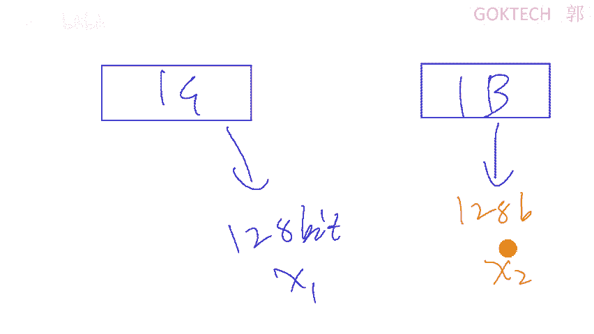

啊，那这个是这个是迟那个直播可能退出去的啊，那平时那个MD5解密那个不一样啊那个不一样。至少在我的理解里面应该是不一样的，才对啊，我拿1个MD5啊去解密，解密出一个什么呢？同样长度的。

或者说稍微长一点点的啊，那个应该是应该跟我们这边的不可能应该是不不一样的才对啊。😊，好。那来它同样分为两种算法是吧？MD5和SHA或者一或者2，这些是这这两者区别就是算法不一样而已啊啊算法的长度。😡。

就是说白了就是这个比较简单，这个比较难啊，但是呢比较难，也就意味着它更难更加可靠一点点。它长度更长了嘛啊长度更长什么意思啊？就是计算的时候更慢啊，计算的时候更慢。😡，啊。

因为我记得我第一次下载一个单机游戏的时候，就用到MD5计算。那那款游戏不知道叫什么游戏，有点忘记了啊，还挺好玩的。系。啊，包括前面这个对称对称加位这个地方啊，就有个DES和3DES哈。

这无非也是那个密钥长度呃长度的一个大小而呀。这个是如果是一倍的话，就是三倍的长度，就这样啊，没什么没什么没什么其他含义啊。😊，那行，等会我们就直接来看这个常见的一些编编码啊。

常见的编码以及什么我们的常见的一个呃密码啊啊，这个东西会比较多一点点。那我们的一个安排是这样子的这这这次课呢我简单呃这节课如果讲不完的话呢，下次课我们再讲一点点的内容。剩剩下的时间就给你们做实验啊。

就通过我们这个平台啊，通过我们这个平台啊。😊，OK行，那我们先休息一会儿啊。😊，啊，可以啊，我们继续啊。😊，我看有没有路啊。有有。那个。

我们接下来第二部分讲这个常见的一个编码啊。来首先最常见的就是我们这个什么ask码。😊，阿几克码知道吗？😡，OK知道就行。那现在的话呢，因为呢这个阿克码编码啊，其实是最早期的时候，谁呢？美国。😊，啊。

美国的互联网比我们发达近半个世纪啊。美国由美国发明出来，也就意味着。他不支持中文。这个是没办法通过它来编编码出中文的，明白我的意思吧？因为什么呢？因为它只有7位或者8位。😡。

7位和8位来表示这个字符的编码，字符的编码7到8位是什么意思啊？😡，7位多少？7个胃最多有多少种组合情况？二的平身房是多少？😡，128是吧。他的8次方呢。256是吧，砍这了是吧？😊，怎么算的？然。

就这样子给他这个是一嘛，248这样子给他算过去是吧？我就不多说了，标准的标准的阿0克码了。😊，只有128比特。😡，表呃呃错了，只有7比特表示128种可能。啊，来在这个地方啊，这个表这个标准的表啊。

来我们看一下啊，这个表怎么看呢？我告诉你们啊，来这样看。😊，分为两大部分。对。第一个部分。😡，哎呀，这么难啊。第一个部分叫不可打印字符。不可打印制符。就这个地方都叫不可打击字服。我打个呃最简单的例子。

你们用过word对吧？😡，正常情况下，我在编辑word的时候，是不是就有一个回车符？てし？没错。回车服你打印的时候，回车服会给你打印出来吗？😊，不会吧，就是这种的回热服嘛。😊，还有有印象吗？

就每一行的后面都有啊，没有用过word的，可能就不知道哈。😊，OK好，这种叫都叫不可打印字符。可打印字符是什么意思啊？就这边。😡，比如说这种能不能打印打？😡，对了，这些东西打一码具几个简简单的例子。

48是0。😡，65是A大A，97是小A。这个要记得。啊，记不住也没关系啊。😊，好， ok。所以说当你看到一。一串那个字符啊是什么？都是数字的方式，而且是间隔，而且是中间有空格的空格空格啊。

比如说什么这个是3位111。😡，111你就应该知道111是对应的是哪个啊111对应的是字母O，我给它家放大一下。即母就这个地方啊。啊，那这个是什么呢？这个是它的一个编码了哈，它正常情况下。

这个128满足26个大写字母，26个小写字母，10个阿拉伯士字数字够不够？😊，肯定够吧，绰绰有余是吧？再来一个不可打印字符，再来一些什么常见的一个标点符号，够吗？😡，过吧。最后呢扩展了一下，扩展什么。

他原来有7位嘛，其实最最高一位是8位了啊，在最高一位没有用嘛。那最后用上去了，因为它有一些符号嘛，有些符号要扩展一下嘛，对吧？😡，啊，扩扰尼亚就就变成了8位了。😊，阿比特阿比特之后呢。

就可以识别256个字符已经够了，就在那个。美国或者说英文英文国家基本上就够了，够用了啊。像有时候啊你在打的时候啊，在在打的时候，有一些字符打不出来啊，那说明你这个编码可能不太不太行啊，编码可能不太行啊。

最常见的就是。😊，中国难免有一些生僻制，没错吧。😡，有没有遇到过生僻字啊？😡，就是有些以前的人嘛或老人啊，或者其他的有些身份证上面呢，他的名字就是生僻字，非常难打啊非常难打。😊，啊。

像我奶奶的他的一个字，他的名字那个一个字就是那个生僻字，打不了，在录的时候就打不了。就各种办证的时候，比如说不是还不是身份证，就办一些证件的时候，他可能还还打不了打不了什么啊，交钱嘛。😡。

反正我家里交交了钱了就可以了，我也不知道为什么啊，可能就是想收钱啊，按自来算钱呢啊。😡，就是这么坑啊，哎阿斯克嘛啊，这个也没什么好说的，就是真的就是不是有一张表，也没有这张表，有吧？

所以说它是一个什么编码，来再来看一下个贝ase6，贝6也是非常常见的啊。😡，来。我给大家看一下，大家就知道文字大家自己看的啊，我就不多说了。比如说看着啊看到了，所看了啊，比如说我要传传三组数据。

3400A9。😡，我现在干嘛呢？把它换化成。😡，二进制。化成二进制。好，换成二进制了。来，这个是这个是几针字的数。😡，为什么？因为它有A嘛，是吧？十六进制啊。😡，来问你一下1个16进制。可以用多少个。

多少个二进子来表示？八哥确定了。4个为什么？😡，一个二进制哎，十六进制最多单位最多15嘛，表示15嘛，就F嘛，F是15嘛，对吧？四个一是多少？二进制四个一是多少？😡，怎么算呢？二的4次方减一，对不对？

二的0次方。二的1次方二的2次方二的3次方，最后这个是二的4次方嘛，二的4次方减一是不是1111，对吧？也就是说15嘛，这个没错吧，二二二二得四嘛，四四十6嘛，对吧？啊。

所以说是什么1个16进制数可以了吗？用什么四个二进制，对吧？OK三就表示成这样子，没错吧，11嘛11嘛，对吧？那四就是100嘛，对吧？😡，好，一直那一堆，然后呢3个。回主。进行处理啊，什么意思啊？😡。

啊，不要看这个不要看这个啊，你你按我这个来啊。😡，我把它分成6比特为一组。6比特为主。6比特为主，6比特为主，反正补钱了，补钱了。六比特是不是凑不够高位呀？😡，特不特巴比特马，随说我在前面补林。😡。

什么意思呢？😡，你比如说我有100万100块钱100块钱，我没有100万，我有100元。😡，我在前面加两个0有有意义吗？😡，没有是吧，或者说我在后面加两个0。😡，有意议，但是我这中间有个点。没意义是吧？

对吧？那一样的，我在前面补两个0有意义吗？😡，没有吧。好，这时候我换。😡，换算成换算成了这个8个比特了吧，来算一下多少，这个值多少。😊，把它转成转成十进制。一加。多大。😡，加哥。确定吗？0248对吧？

加在多少？32加起来多少？41来看这张表，41号。41听到没有？😡，是不是黑？这样子我从这三组数据就可以变成这样子的一个。😡，显示就是只用被子。啊，但是很多很多很多编码都有英文怎么办呢？好。

我告诉你它有个明显的特征。😡，编码后输出的文本末尾可能出现一个或两个的什么等号啊，不是这个啊，这个没有啊。😡，啊，就是等号啊。好。来啊给你们看一个题。嗯。等一下啊。爱春秋了CTF大本营这边有个训练啊。

😊，我登录了没有？我等一下。

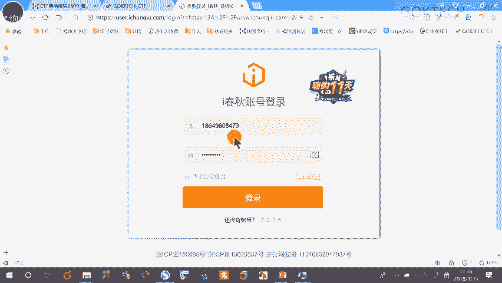

CDM大本营这边你看。😡，rever这两个都不是不是我们目标。你看mincto web这些都是我们来看一下这个m这边啊，这里有个题啊，来给大家看一下啊。😊，就这问题。那些年我们一起啊，不对。

我追过的贝斯。看题目，其实他已经提示的很清楚了哎。base贝，我爱你。😡，对吧大声循环二的6次方。啊。敏感一点二的6次方多少？再加上贝斯。所以说这应该是倍多少？有时是，而且它有一个非常典型的特征，什么？

等号，所以说这题应该怎么做？就是base base的一个编码是吧？来把这个复制。😊，哎，等一下。复制。对，就是这么简单。😡，复制啊，然后呢有几种方式啊，要么你使用在线工具。要么您使用离线工具。

你也可以去算，真的我不阻止你啊。😡，但是有一些东西确实可以算的啊，确实可以算。来工具这个地方这里有1个CTF工具包，有1个密码学，这个地方密码学点开这里有一个有多个工具，我可以简单的跟大家说一下。

第一个是小葵工具，可以用。第二个是米斯特解压之后可以用这个米斯特是要用java环境的包，所以说你一定java一定要弄好。知了知了。还有一个是什么呢？密码机器啊，密码机器这个解压一下。好，来小葵。😊。

小葵啊，我是小葵花啊。不是有个广告是吧？啊，不要不不不要脸啊。来在这个地方啊，被子这个地方，你看可以解密吧。😊，它的一个提交形式就有时候就这样flag，然后两，然后那个大括号中间这个值啊。

这些就是它的一个提交方式。一般情况下它可能有什么一般情况下，我们flag啊。K呀。这些都算是啊。好。复制。然后呢。粘贴取消。对吧回答正确，好开心OK。😊，恭喜你得到10分。简单吧。来。

我们再看一下这个啊。😊，我喜欢b。😡，但是贝斯的表妹喜欢我是吧？还给我写了一封情诗。😡，床呃床前名额啊，不是啊，不是这个啊，那肯定不是啊，密蚊的方式怎么办？😡，有时候啊能看到啊。

它不是说一个或两个等号吗？唉，四个等号原来有坑是吧？好，okK没关系啊。😡，来有时候他已经提示你是base了，但是他没有等号，他把你等号删掉了啊，那你就要加上去是吧？😡，来。干贴是吧，四哥等下。

我们先试一下解密。哎，果然跟我猜的很像。😊，是吧我使用两个师。😡，解明。Hey。😊，一个。哎，三个啦。

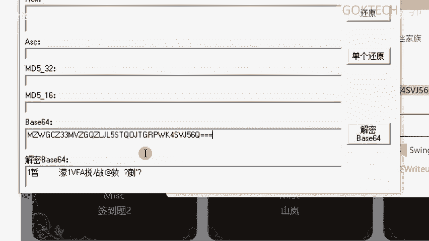

好像也不是是吧，那我再仔细一看。😡。

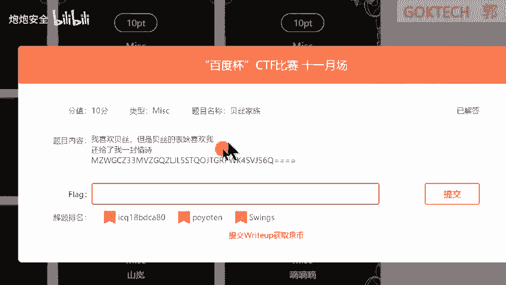

贝斯的表妹。😡，我就这样一想。啊，原来我这个贝ase64是什么意思哈？我再通过这个题，我再给你们看一下，贝ase64是可以表示多少个位，多少个数值。😊，啊，那肯定是64个嘛，对吧？

那表面是不是会比这个少一点点呢？😡，比如说我背死三杀可不可以呢？有没有可能呢？被32够不够表示完整的字母？😡，够了吧，再加上什么几个数字都够了吧啊。😡，okK所以说我就在想是不是它表表面有可能是这个嘛。

是吧？那我们就不能再用这个工具了，因为这个工具没有其他了，那我们只用什么啦？使用另外一个啊，不不一定用在线。啊，使用什么呢？米斯特米斯特这是我解压过后的。😡，打开米斯特这个非常响啊，文字非常响。

大家眼睛擦亮一点啊，粘贴到这个地方。😊，粘贴到这个地方，然后呢。进行一个base解码哎。好像还没有是吧？来，这边有个妹子啊，不是妹子的旁边插件。😊，啊。b32解码。嗯。有了吧。我来个吧。

剪切下来粘贴提交哎。可以啦，是吧，就这样的一个效果啊，然后呢，因为这些题呢。😊，部分题简单非常简单，部分题呢很难。所以说为了让你们熟悉的话，我建议大家先使用这个平台。😡，啊，先使用这个平台。

这个平台呢怎么做呢呢？来首先登录一下，整个首先注册。😊，啊，有兴趣的看一下啊。😊，就这个平台啊，你不要给我多加一个S啊，没有啊，你就10。0。2。208直个回车就可以了啊。😡，好，这里有个注册。😡。

就在这边呢大家怎么做呢？1809下划线。😡，自己的名字啊，你不要不要大家都是自己的名字啊，就是真的真的是你的名字啊，你不要瞎写啊，自己的名字给我写下去四个字。😡，啊，不是四个字，这个有几个字。哎哎。

我这手机板按到了哈。锅。激动是吧？啊，邮箱是什么？是你的邮箱。😡，密码了。😡，是你能力啊。不是邮箱的密码，你随便来1个123456都可以。😡，啊。都可以这些都可以。然后呢。😊，哎，然后呢。

我现在呢给大家看一下啊。😊，我先登录我的账号啊。那个是注册的啊，那个是用来注册的啊。😡，过啊，来。

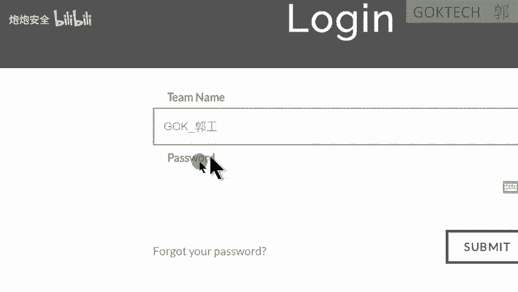

GOKTGH啊，哎，为什么你们密码跟我一样？😡。

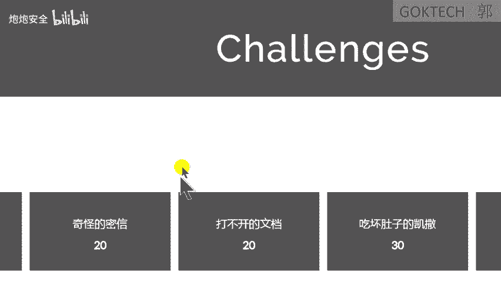

来，你比如说这边有个账栏密码，许动密码，换位音密码，大家开始慌了。哎，老师这个我怎么没听过啊，因为呢这是涉及到密码学的啊，那剩接下来加密了啊，所以说我们继续往下看啊，目前的你们这些编码还不够。

你们要做的就是CTF赛前指导。😡。

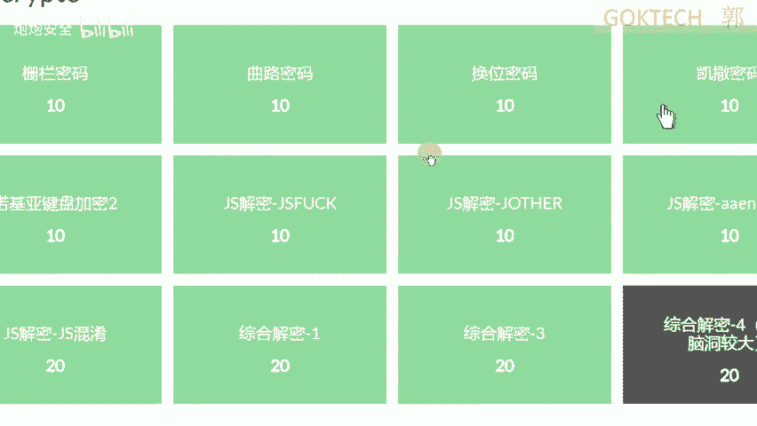

这个啊不要去做前面这个前面这个有一些有一些比较难的啊。然后呢，你学有余力的情况下，这个只解完了是吧？学有余余力的情况下去做这个进阶吧。😊。

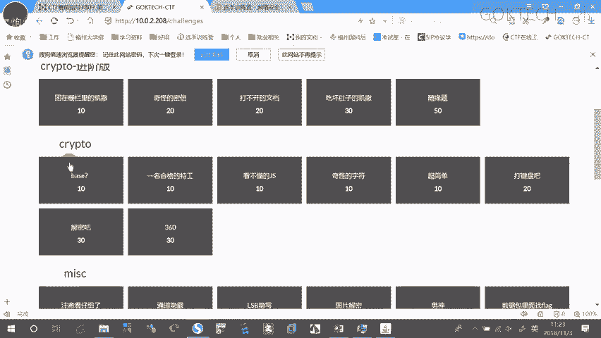

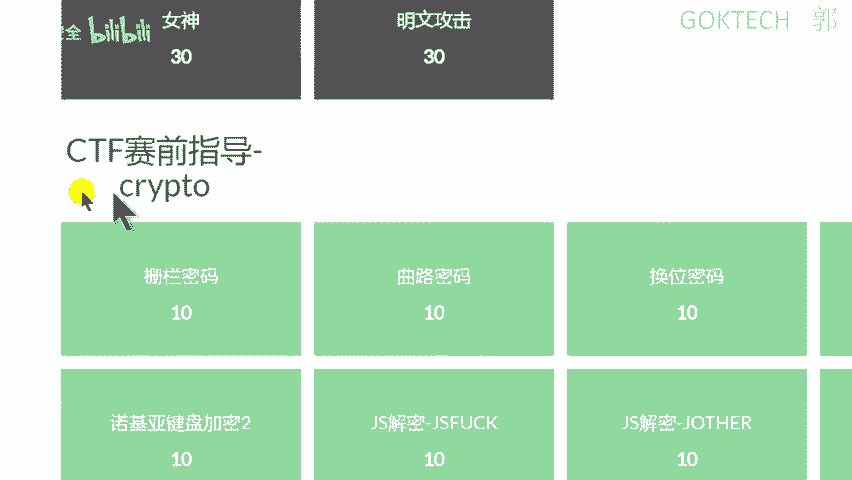

一样的是赛前指导的啊。

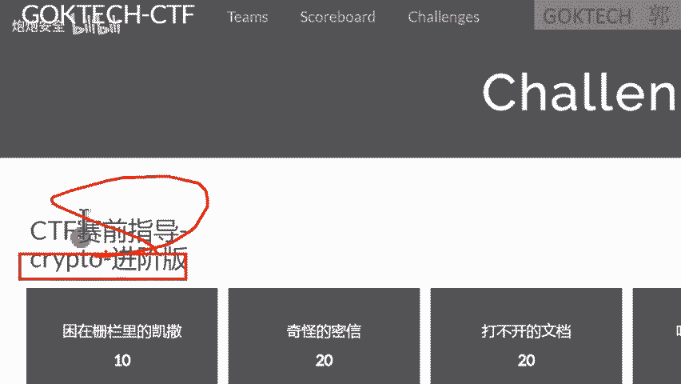

啊，像这个随缘题啊，我给大家看一下啊。😊，随缘提是什么意思啊？我有一个模式密码，对吧？我明确跟你说了模式密码了okK。😡。

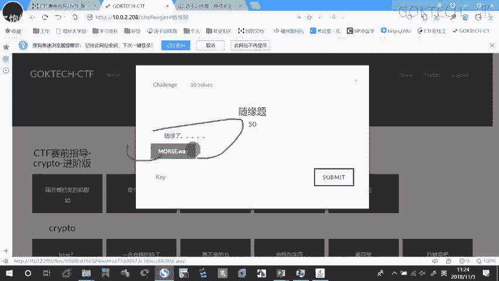

等一下我放一下。

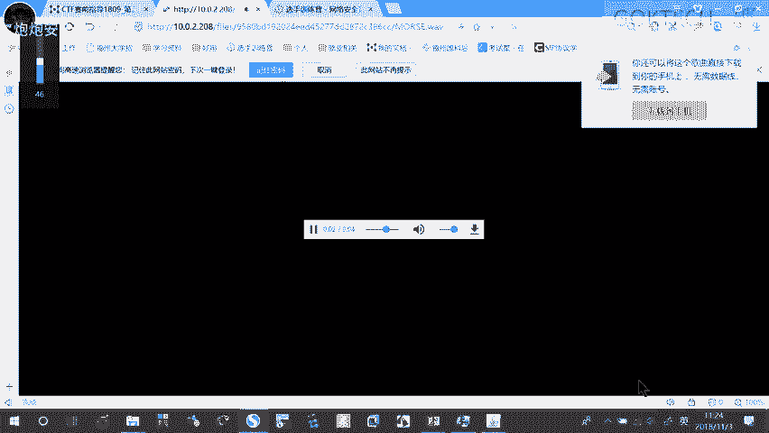

等一下。然后你就听这个模式没了，好吧，好吧。😡，啊。可以啦。听得懂吗？所以这这题只能这样了吗？😡，所以啊。好吧。😊，okK那我们往下了啊，被ase64就这样了啊。😊，好，这台URL的编码。啊。

ULL编码是怎么A置呢？😡，这里。这个通常我们可以认为就是一个意I了，看这里啊，不知不然不知道看哪里啊。😡，🤧。这东西一般情况下就是我们的UIL。😡，来，比如说我搜一个搜一个英文啊，看到ABC。😡。

这个UI我给它复制。复制粘贴到我们的文本里面，n pad加加啊，n pad就可以了。我自体调一下，稍等一下。😊，这里调一下调大一点。小益。是不是ABC。对吧O。😊，现在我输入一个中文。中文是吧，WD嘛。

😡，我再给他干嘛？复制。然后呢，这个清掉粘贴。中文变成什么？😡，你看不懂的东西的啦，这个是编码，叫URL编码。嗯。这个秒过大家啊。😡，特点大家看出来了没有？😡，百分号。

然后两个什么16进制数在百分二是吧？要到这这边复制。😡，然后呢。UL捷嘛。😡，呃，这个站场工具有点奇怪。来。😊，粘贴到这边是吧？唉，我怎么这么多东西？😡，没有吧。啊，然后。诶。应该这样。放到这边。

然后呢解码是不是能够解除中文。对吧啊这个是什么？我们的1个UI的编码非常简单。😊，UR的编码就是一个字符ask码的一个16进制的表示方式。😡，啊，来，不过稍油找。稍有变动，一般就要在前面加一个百观号。

需要在我们前面加上一个百观号啊。😡，而且他对于这个他对特殊符号会编码，但是呢对于什么呢？我们的一个英文HTTP这些可能就不会编码，知道吧？啊，一般都是对中文进行编码okK。😊，来。另外然后这个有在线的。

我们就不说了，你们到时候一定要急去去那个了哈，去分类了哈，去分类了哈。😊，总结一下了啊，ULL编码，还有unicodeunicode是什么啊？多少位啊？😊，啊，16位。知道我们的汉字有多少多少个字吗？

常用的哈常用的1万出头。是不是觉得有点少？觉得好像很有有点少是吧？😊，啊，我告诉你真的是差不多这样啊。你去搜一下汉字大全。啊。基本上他也是1万多啊1万多啊1万多啊，那肯定是不止的啊，肯定是不止的啊。

肯定是不止的。你看哈你大字典全书共多少？😡，啊。这个正常应该是这样的哈，这个应该不太不太那个哈。哦，是这样子是吧啊，共收共收楷书单是5万多啊，那这次呢一般情况下，比如说我常用的是1万出铜啊，对吧？

像有些为什么你生僻字打不进去啊？就是因为它编码没有嘛，它只有16位啊，16位是什么意思啊？大家一定要记得，一比较敏感的二的16次方多少？等一等于多少。65536啊啊65536啊。

这个应该是一个挺常见的吧。如果不常见，我们再看一下0到65535。😡，是不是比较常见啊，有学过一些涉及到存储器寄存器的寄存器值的都知道了哈，这个16位长基本上就这个啊。😊。

使得unicqode编码可以干嘛？表示世界上所有书写语言中可能用于记住了是可能而已啊，可能用于电脑通信的字源相形象形文字和其他光。来，我们的文字一般情况下分为两种。中国的文字叫什么？😡，象形类了。

象形象形文字这一类的吧，对吧？😡，那英语这种呢，像比如说古埃及的中文呢，基本上都是象形象形这个大只。😡，那如果是英语拉丁文的这种呢。肯定是符号源嘛。是吧是不是符号它有真真实的意义吗？你比如说这个字啊。

之前看看看那个综艺节目，知道这个字。😡，啊，就形容的是一个人。两只手。张开嘛，风从腋下吹过的那个对吧？那个综艺节目有看过吧？😡，没有的。就跟你们普及一下，就是个爽字，所以是人。😡，嗯，那个啊啊是吧。

你们懂的啊。😊，腋下生分啊。没错啊，真的是这样子解释啊啊。😡，🤧咳。但是呢我们知道就好了啊，不用去纠结这啊，unic口的编码也有特征，就是它有一个反斜杠，然后呢UXX啊，看着啊。😡，对啊。只要是这种的。

我们基本上就可以就马上知道这是uni口编码了，好吧？就是有特征的有特征的再来。😡，接下来是一些混混淆的啊，我们先不看啊，我先做一个总结。😊，编码，我们涉及到这少阿斯克。😡，2是个嘛编码什么。😡，え。啊。

这样。AS是吧，阿斯克啊，对对对。这样子没错啊，吓死我了啊。😊，来二杰的编码怎么样？😊，7到8位是吧？啊，最多表示多少？256个制符。对吧来还有什么被什么？😡，贝子系列啊，这时候不能再说贝64了，是吧？

啊，对吧？特征。😡，末尾上有什么？😡，有等号是吧？如果啊就说我这里就不写了。如果说没，如果是他已经暗示这个这一个被贝时边码，但是它没有等号，你要加。😡，嗯。被子每秒之后是什么？😡，URL特点是什么？😡。

百官道加什么啊，两个什么16进制数是吧？😡，还有什么？Unic扣。特点是什么？反斜啊反斜杠加一个什么U是吧，这是它特征，对吧？我看一下有没有漏。😊，没了吧。好，接下来呢是ZS混淆啊，JS混淆来看到啊。

😊，那个审查。通常情况下，我们网页是不是通过这一堆的这一堆的编码来组成的？😡，但他凭什么这个编码传到我浏览器上，就是一个这个这些框呢？😡，为什么就是这些框？😡，知道吗？啊，来现在普及一下。

我们的编程语言通常分为两种，或者按按那个位置啊，前端和什么后端后端一般情况下有什么算不算啊？😡，比如说。呃，怎么样不算前端吗？我们。😡，啊。一样的一样的add man啊H5。呃，那个那个抓vaqui。

这S吗？啊，没错啊啊。前端。前端的意思是什么呢？😡，浏览浏览器自动会帮我进行一个解码啊，进行一个解析，成为我看得懂的页面。OK吧，形成我看得懂页面。比如说为什么它是一个图片，为什么它是一个呃输入框啊。

这些浏览器都已经自带了。啊，早些年的时候，我们遇到的时候，就比如说去看付费那小说。可能我估计你们没有也没有看过。就付费那种起点那种正版的是吧？它是禁止你干嘛复制的。😡。

或者说你百度文库或者哪一些文库里面是禁止复制的。为什么就有可能就是它前端代码这边它就在编码的时候，就前端的时候给你限制啊，你只要改一下就可以了。但是如果是后端你改不了。😡，啊。

后端的话人家已经变了已经定义好了，比如PSSP嘛。😡，PHP啊对啊。啊，还有什么那个那个那个转了赚不到了。😊，走了算了啊。啊，这些都算啊这些都算。😊，呃，这个PHP更倾向于网页这一块了吧，对吧？然后呢。

java是都可以做吧啊。😊，ok。但是呢为大家你理想啊，代码我是不是可以看得懂？😡，当了你要是说我我我学编程了，是不是可以看得懂。然后呢，我就说我就不想我为了保保证保保证我的一个劳动成果。

我不想让你看到我的代码，我就干嘛呢？插入一个函数，插入一个函数进行一个混淆。就原来我编码是这样的了。😡，啊，这个是一个搅拌语言啊。就我的编码内容就是弹出1个叉SS的一个这个这个这个页窗口。

这个的意思就是弹出1个叉SS这个窗口。弹窗。弹窗啊，你要注意的，有些同学说，哎老师我弹不了窗，你自己先检查一下，有没有防防防广告弹窗的啊，自己先检查一下啊。那我通过这个evo函数进行混淆之后呢。

变成这样子的，你看得懂吗？😡，这时候就看着不懂了，那你怎么办呢？😡，通常在JS脚本中使用eil函数和functionction这种函数啊进行一个混淆就看不懂的语言语句。这个语句呢因为什么呢？

这因为这个语句呢是前端的嘛，所以这个可以直接用前端来进行解析，看着啊。😡，把这段呢复制下来，看到啊。😊，打开我的火屋浏览器嗯。八一。Foox。打开我的火物浏览器看下啊，按F12。😊，哎不是啊。

稍等稍等稍等。F12这边有个控制台，控制台这边哈控制台这底下底下哎，为什么会有红包？😊，底下这边有个输入框，粘贴回抽。😡，是不是会给我弹出一个光？😡，对吧这个就是叉SS这个功能已经实现了。啊。

如果说你做题的时候遇到这种，你一定要注意了啊。😡，这个不是flag啊。😡，他的flag是这样的啦。好了。😊，诶。呃，双赢是这样的，你要给我写全了，补齐啊，补齐了，这个才是整完整的一个flag啊。

完整的一个flag。😡，就它本身就是有这个函数嘛，这个函数的功能嘛，这个函数的功能本身就是弹出1个叉SS嘛。那你现在弹出一个窗肯定这个窗口的内容只有叉SS了，那就要怎么办？你就要把这个补全了，补齐了。

明白了？😡，还有这个我不好意思念啊，大家自己心里看一看就好了啊。😊，啊啊O吧。😊，他干嘛？他用6个字符，这个什么括号，这个中括号大括号和什么凹括号中括号小括号啊，我翻大一下，大家看不到。😡。

中括号小括号。感叹到我的加号感叹到我的加号。对，没错，那别人写嘛啊，所以说你会发现一堆的都是这样。😊，哎，等一下不好意思。一堆的都是这样的一个格式，你可以进行解码啊，可以通过在线的方式进行解码ZS啊。

这个F开头的这个啊这个是。😊，呃，也是一种编码方式啊，再来ZSR的，它就多了一个东西，多了什么？😊，啊。有时候他就会这样子啊，有时候你全文发现他没有打括，他没有中括号。有时候你全文发现它没有中括号。

只有大括号，那你就要想一想它是不是是不是被被被被那个修篡改了。什么意思呢？有时候他真的就是JS那个F的JSF的那你怎么他就是把这个中括号替换成了大括号，你解压解码是解不出来，你就要想一想啊。

是不是哪里被替换了啊，他说白了就是多了一个什么多了一个啊。😡，一个、2个、3个、4个、5个、6个、7个、8个啊，对，8个。啊，我是按一对一对来算的啊，这个这个肯定是按按它是按两个，它是按两个啊。

我再看一下啊。😡，哎。那这个几个。6个，那没错吧啊，一个、2个、3个、4个，他就是这样子算两个，你明白我的意思吧？😡，好，再来看这个编码，这个编码挺有意思的。对吧表情包还有这个。这种什么好像猪头一样的。

对吧这个叫。唉，这个我也不好不好怎么练啊，反正大家知道就好，特点已经一目了然，是吗？啊，这些特点我就不帮大不帮大家解解那个呃。😊，弄了哈。ZS系列。

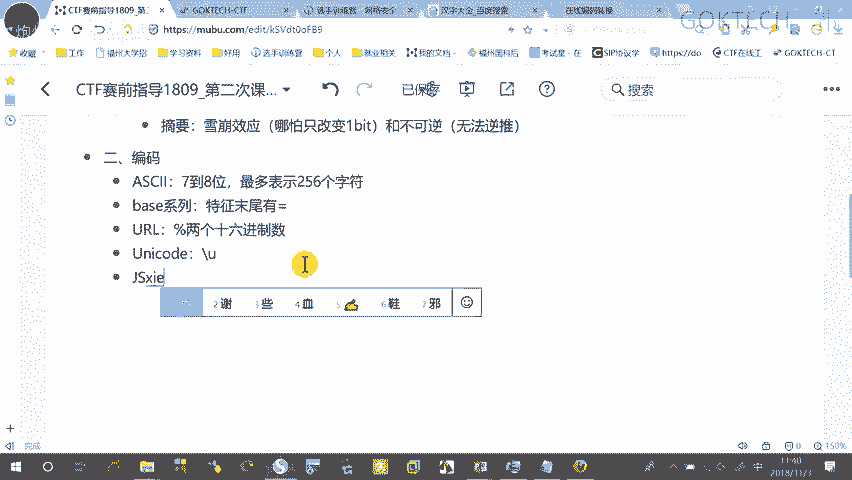

自己总结一下，好吧，可以吗？那我们接下来抓紧点时间啊，讲一讲密码学。啊，加密。加密算法才对，不是密码学。

来常见的算法只有两种。第一种叫移位。呃，没有对称的那个其实很难的，对称乘非对称其实遇到了真的很难。啊，真的很难。那还有一个是什么换位啊，呃呃替换替换置换也没错。移位或者换位换位是什么意思啊？

你比如说原来是GIF是吧呃。😡，GF用小写了，那我只不过变成了GFI这个算什么有变吗？总整体的个数和单词按那个字母量有变吗？只是什么？对，改了顺序嘛，这个叫什么化位，换位呢话分为栅栏啊，栅栏了。

不要念错了，曲路位列呃列位移列位移。还有呢。😡，替换的有什么凯撒摩斯啊，这个还有维吉尼亚培根。键盘啊。看着啊换位啊换位炸栏密码换位炸栏密码，我简单给大家说一下啊，我就按口述的方呃直接来演示。

直接来看了啊来。😊，首先平稳看着看着看着，不然不会啊。😡，首先铭文是这样的啊，大家注重理解啊，注重理解，到时候再结合呢动手。首先这个是铭文看得懂吗？😡，啊，好，来解翻译一下。先。😊。

这个la是什么意思啊？😡，啊。对啊。😊，这是什么？😡，哦，对样好，可以好好，行，大家的英语水平我已经知道啊好，他怎么做啊？首先第一步去空格。😊，所以说如果你解解解这个解密的时候啊，解密的时候。

你要注意一下它的空格哪里哪里要空。所以说对英语的要求有一定要求，但不会是非常难的。基本上单词大家都懂啊。😡，来，首先去空格，然后呢分组这个地方呢。😡，啊，有加密和加密和那个算法呃，有密密算法和密钥。

算法就是这样，这整体都是算法。然后密钥呢就是分为几组，分组分几组啊，分几组。😡，比如说我这个密钥等于2哈，它就相当于两两成为一组，看着啊，两两两两这样分开。然后第一组的意思就是什么？

第一组的数据就是TEUCBONOJ这样子下去，明白我的意思吗？就是每两位的第一个字母做成第一组，然后剩下的作为第二组，然后呢把这个第二组放在第一组的屁股后面。😊，就组成了一个什么密文。明白。O。那。

那我大家想一想，那我我我们要逆推回去怎么逆推啊。比如说我知道它是两组嘛，两组看到两组，我现在得到这个密文，我是知道要分成两组是吧？对半分。😡，前面在这。后面在这怎么做了？😡，TH。EQ。UI是不是啊？

THEQUI嘛，对不对？因为它分成两种嘛，是不两两一起啊？😡，这是第一组的第一个嘛，这是第一组的第二个嘛，那是组合起来，就是第一组的前面两个。😡，啊，解我说的是解密啊啊解密啊，逆推回去的啊。😡。

这个可以口算的。😡，啊，不可以比算。不要不要去想着用这种方法啊。刚开始多都熟熟悉一下是吧？取位。曲路曲路曲路看着啊。铭文是这样子的，现在把它填入五行序列，这个要事先约定好。这一整个都是算法。

密钥是什么呢？秘钥是下面这个啊来。😡，五行七列是什么意思啊？😡，五行系列总共有多少个制制符？😡，三这个字符填下去，按顺序来这样子填下去。不是不是知识型啊不是知识型啊，是从左往右啊。

看到我的这样我明白我的意思吗？😡，是从头往右，不是知字型这样子排啊，不是啊。😡，好，排完之后干嘛？😡，有一个加密的回路线是吧？加密的回路线只有两种。😡，就是他的必要只有两种，先上后下。

或者先下后上什么意思啊？这样算什么？😡，对你要去尝试啊，每当每一列结束之后，干嘛有一个空格GESFC空格。😡，INPHO碰克明白？OK。啊。所以说如果你发现怎么样，发现这个密文之后，你怎么做啊？

首先就是这样做啊GESFC是吧？然后呢，INP这个真的是资字型的PHO然后你去你就这样填下去，然后呢，从左往右看一下能不能组成一个单词，不能怎么办啊，不能说明你做错了，做错了怎么办呢？

你就按什么反过来从下往上这样来做O那我们先这样，这个是曲路了，还有为列位移列位移话多了一个密码密钥啊。😡，列什么叫列？来先放到五行七列里面。😡，然后列列是什么意思？我等一下再给你们解释什么叫列。

现在来看这个密钥哈，密钥是how are you是吧？😊，给我填到这边来，how are you。填完来按顺序来排列一下。这几个单这几个字母哪一个是最最先的？😡，A为什么？😡。

A是不是排在我26个字母中第一个。😡，ABCDE对吧？E在这边吧。FGH是吧，这样给我干嘛，标好之后呢，干嘛呢？来看着列位移就意味着什么呢？第一列是这个。😡，给我写下来。第二列是哪一个？😡，给我写下来。

懂吗？啊，它都是从左呃，不从上往下的，但是它是什么按列来了，按这个顺序的啊。OK这个相对来说比较简单。还有凯撒密码，凯杀密码的话呢。虽然它有表，但是我们其实不用表也可以，为什么？他首先呢有有。

他的算法是什么？😡，他们是你看哪了啊？😡，哎，向后或者向前是吧，按一定的什么位移量嘛，所以说这个位移量是不是是密啊，那算法就是左移或者什么右移吧。来，我们看一下啊，这个偏移量是一嘛，来看到啊。😡。

A偏离一位是G。😡，我这个练字呀。哪是左移还是右移？为什么？😡，A往往往左边一点就是Z嘛，对吧？那么比如说。偏移量是27。其实说白了就是偏音量唯一嘛。有没有问题？你看着往下。天亮。26就是自己嘛。

对吧然后一就是什么回回回到这了啊。😊，ok。这还算了，你比如说，我打个比方。😡，你比如说这个T。😡，移动一位，难道你不知道吗？UV哎，不对呀。😡，是我是我英语不太好吧。OPQRSHTUVW啊，对啊。

T然后U这个是右一压左一样。这就是诱文影音吧，跟这个有有一样吗？跟这个表一样吗？不一样了吧啊，O。😡，这这个不一样啊，这个规定的是右一样。😡，那这个这个表是左移啊，一样的啊，你无非就左移和右移。

你自己算一下就知道了哈。😡，什么意思？呃，这个能听得懂吗？😡，这个能听得懂吗？就左移和位右移啊，你比如说。比如说我偏一下是一号，那如果我T。😡，如果说我如果我说我移动一位变成S。😡，OBQRST。

OPQRST。所以说如果是我是这边的T变成S是左移吧。那如果右移呢就变成U嘛，哦RSTU嗯。😡，嗯，是我是我英文不好啊。😊，大家想一下啊啊，好了，我不说了啊，暴露了啊。好，再来一个模式电宝。😊。

模式代码了，这个就不不要求大家口算了，大家可以用机器啊机干嘛呢？点横横啊，大家中间不是有停顿吗？停顿怎么办呢？停顿一般情况下要么用什么？你可以用空格或者什么用斜杠二选一。😊，2选1。2选一的方式啊。

看到啊，我再强调一遍啊。😡，停顿要么用空格，要么就用斜杠2选一。好，O。简单的是这样子的，这是最简单的最直观的难的是什么呢？它有空格又有斜杠，那你就要删掉其中一种去尝试。最难的就是什么？😡，听听声音。

就刚才那个听声音，但是那个不算难，那个只是做一个合成而已啊，做一个转换而已。最难的是什么？在一首歌里面。😡，它是有一个合并的文件合并，把它合并到一个文件里面。啊，合到合并到变成一首歌。

你要把它分译出来啊，这个就比较难了。😊，也不是我们应该想的啊哎，接下来讲这个替换。这个替换呢呃概念也比较简单啊，我再讲讲一会儿啊，我们12点下课啊。😊，LT是LT531847啊。

看着五是指对数字进行编码，用当前来这里有点很有意思的啊。😡，用当前数字往前数第十第五个数字替换当前的数字。来，比如说我问你一个问题，六的66应该替换成什么？😡，嗯。对不起，他是这样子的。Yeah。嗯。

对吧很奇怪，就是他编码前是零，编码后变成5。😊，所以同的方向是跟我理解的应该是不一样的。嗯。🤢，什么意思啊？明白我的意思吗？刚才我们是按什么左移的方式了，它是什么？其实是什么右移嘛。😡。

就是它这个算法本身就是右移的，明白我的意思吧？不然的话，我问你个问题。😡，你冥王前面一怎么一样？😡，复数。还是负小数点还是怎么样啊，不太好算。所以说它这个你就认为是右移就好了啊。

0往后往后哎往前数12345。😡，第五个是吧。😡，对吧编码登录嘛，对吧？😡，有问题吗。啊，OK那1三呢就只对字母来编编码往前数十列13个字母啊，那一样的。一样的A就变成N啊，还是一样往往这样数啊。OK。

18呢是一个异类，是5加13，什么意思啊？既兑什么啊既对。😡，啊，不好意思。记队什么的？😡，就将五和35和什么十3结合在一起，既对什么数字，又对什么字母金编啊，好吧，还有1个47。

对于这常用的符号有一些行编码。来这个呢我们可以看一下，这个挺有意思的啊。😊，え。我把这个。复制一下。可以看得到吗？好，我们先来1个115好不好？😊，啊，注意看了啊。5。哪里变了？😡，数值变了吧。😡。

对吧英文有变吗？😡，符号有变吗？😡，没有。来复位一下啊。呼一下啊。复会了，来我们来1个13。数字有变吗？英文呢？😡，变了吧。好，那我们来一个直接来一个什么。😊，直接来1个47吧。完全变了吧。

连符号挂吧都变了，是不是空格有变吗？😡，空格就没有了吧。O。好，还有个替换的。替换的这个维吉尼亚密码，维吉尼亚密码相对比较难一点点。首先呢它有一个横纵横纵坐标。横坐标横是什么？横日铭文。重呢是什么呢？

秘钥来，我们这先来看这个啊。😊，首先第一个铭文是T嘛。第一个密钥是C，是不是来。灵魂是T吧。😡，密钥是什么？C相交的这个点是什么V是吧？所以说第一个密文就是什么？😡，V。明白啊，底下这个。

okK那他这个地方只有什么？😡，稍等一下。有点大啊。他这个密钥是不是只有123456？7七个怎么做呢？第一个是跟这个T嘛，第二跟跟H码，第三个跟这个E嘛，第四个跟这个Q嘛，第5个U。😡，i。

GK哎是我算错了是吧？反正。😡，我们来算呀。一个2个、3个对吧？4个。5个。6个7个到这个C嘛，到这个C之后呢，这个K怎么办呢？K就循环C明白啊，明白我意思吧？啊，循环这样子继续循环下去就可以了O。😡。

还有这个替换了这个培根密码挺有意思的。他就用这种什么，你赔个密码，到时候就看这个表就可以了啊，它有两种方表示方式。但一般情况下我们用的是第一张表，第一张表，比如说什么A就表示什么呢？AAAA啊。

这样子的方式哈，记住了。😡，这里大小姐无所谓，大小姐无所谓啊。😡，啊，还有最有意思的。键盘密码。第一种就是QWE加密法。什么叫QWE呀？你看一下你自己的键盘，我认为这个。😡。

我们原来这个地方这个我觉得是灰色，你们觉得呢？😡，那我就认为是灰色的，就是我们的键盘，好不好？😡，那意意思是什么呢？他是按什么？😡，ABCD这样子来算的，就是什么意思啊？就我从这个D排开始看到啦？

是按A的顺序来的这样子的密码，明白我的意思吗？这其实严格意义上算是加密吗？我也不算嘛。😡，啊，好更像是什么编码，是不是？但是没关系，讲反正大家知道就好了。QWE啊QWE啊，还有一种是什么？😡。

那我们先看这个。他把键盘分为三排。三排就字母的那三排看到啊三横哈，然后呢几列呢QAZ它有个有个那种下坡的方式啊，你自己看下自己键嘛，有个有个阶梯式的哈，QAG就表示第1个WSX就表示第二了。

那这样子就有横纵坐标的吧。那比如说什么呢我的横坐，我你看着啊，我的横坐标是。😊，一。纵坐标是2。横坐标是一，纵坐标是2，是不是W啊？但是他可不可以这样做，你看呢。他可不可以认为是。😡，数这样子是呃。

怎么说呢？数字是什么？😡，就是啊怎么说呢？这这边是横坐标，这边是纵坐标可不可以呢？😊，可以吧，就反过来说白了就是两种两种两种方法，对吧？OK还有这种。对我们的键盘进行一个什么编号。来这个波浪号是哪一个？

😡，拨浪号是在你键盘哪里？😡，是不是E的旁边了？对吧。你看呢。他这个还还有点不太对哈。来一应该是跟感叹号一起的吧。😡，对吧R是根艾不2，那没关系，我们按它的规则来就可以了啊。😊，诶。哦，是这个是吧？哦。

对不起，我看错了，我知道你的意思啊啊，来这个是横纵坐标，是这个意思吧？啊，OK那么我们的一个什么波浪号跟我们的顿号，就应该是顿号吧啊，是一起的吧。然后感叹号跟一是一起的吧，二跟艾是一起的。

三跟什么井号是一起的对吧？那这个样子就就算是两行啊，这样子来，那横纵坐标。那比如说什么我8787什么意思啊？😊，8。7。小M吧啊，所以说呢默认横坐标是什么？😡，啊，默认默认是什么？

横坐标是这个纵坐标是吗？这个啊像是是默它默认了okK那没关系，还有这种奇葩的。😡，诺基亚。诺基亚键盘啊有些按键也很贵啊。你比如说那个那个。😊，黑莓嘛啊但是黑莓现在也有也有也有有屏幕了哈。

也也屏幕的居多哈，还有什么一些三防呃，三防机也没有啊，三防机也是全屏的啊，比较少比较少。老业机嘛，诺基亚也有吧，诺基亚复刻版。😊，听过吧。来，我们看这个啊，来看下啊2一表示什么数字2第一个字母。😡。

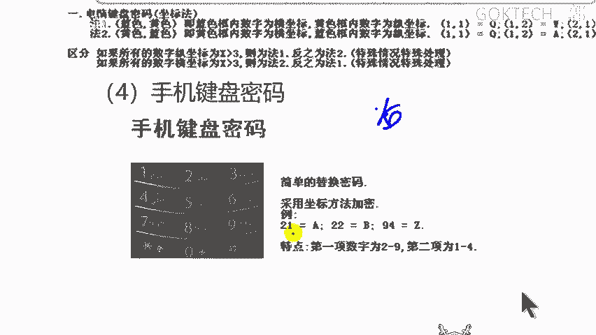

就是我们的A，比如说什么九4是吗？数字9第四个字母是吗？Z。啊，明白了，他就按这种方式。那还有更奇葩的更奇葩的不是这种方式的啊，这个靠想象力啊。

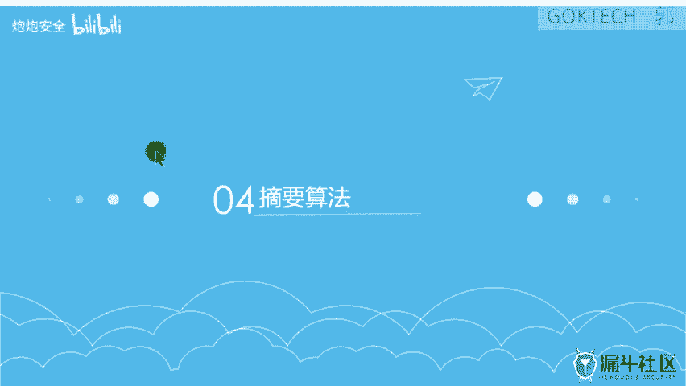

那还有一个摘要就就先这样吧哈，摘要的话我们就其提一下吧提一下内容不多啊，不然的话下这课也是差不多了啊。内容啊这个呃稍微拖一点点课啊。😊，啊，几分钟啊。哎，对，这就是所谓的摘要，就是所谓的h斯哈西算法啊。

但是呢它这个地方不是对于文件进行一个算。进行计算啊，它是干嘛的？MD5以512位分组，然后处理什么样呢？正常情况下它就分为16位和32位啊，反正呢我们就可以嘛得出你只要是看到这种一串的数值。

一串的数值哈，然后呢最高位不超过F。😡，就是说白了是16进制数啊，你就可以认为你就可以大胆的假设它就是MD5值，然后去这边计算就可以了。啊，屈原值计样就可以了。那SHA啊这个就比较难一点点啊。

东呃会比较多啊，会比较多一点点啊。当然了啊算法它比较长嘛，算法比较长嘛啊差不多就这些。😊，东西还是有的哈，尤其是这些一定要去归纳总结一下啊，归纳总结一下okK。那今天我们课程就先到这里了哈。

然后的话呢我到时候会发一份那个文档。😊，发一个实实验手册给大家，大家要自己去做一下。那个可以做题目的话，说白了就是我们这边的题目，只不过变成了word文档的形式。你先做一下，到时候在这边提交什么意思啊？

😡，就是这边有题目，有分值嘛，可以看到你的可以看到你的分数。😡，你们可以点这个team。啊，可以看得到有好几个team，但是呢你根本不知道我们的一个成绩是多少啊，我们的成绩是多少啊。

只有管理员才能看到啊。但是呢你们可以先用word文档回去自己做一下啊，自己先小小小小事扭叨一下，然后回来到时候下次课的话过来的时候再替换大家在这边提交一下就可以了啊。那下次课的话呢。

我们就是呃再简单的做一下这块啊，呃做一下时间就差不多了啊。那如果时间快的话，我们就讲新课啊，那大概就这样好吧，行，那我们今天课先到这里了啊。😊。

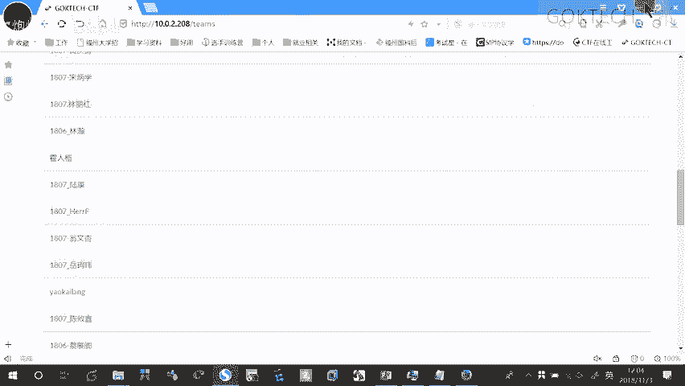