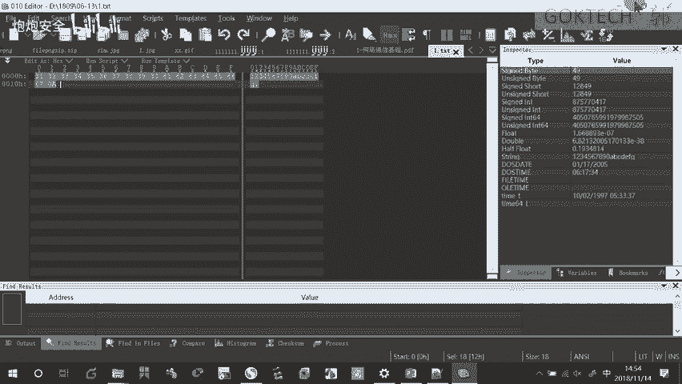
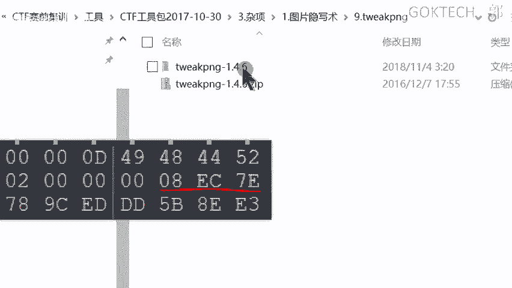
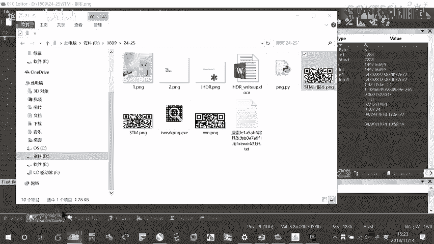
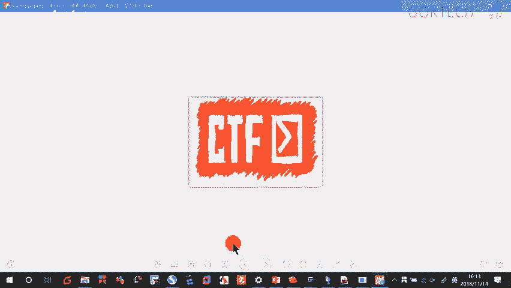
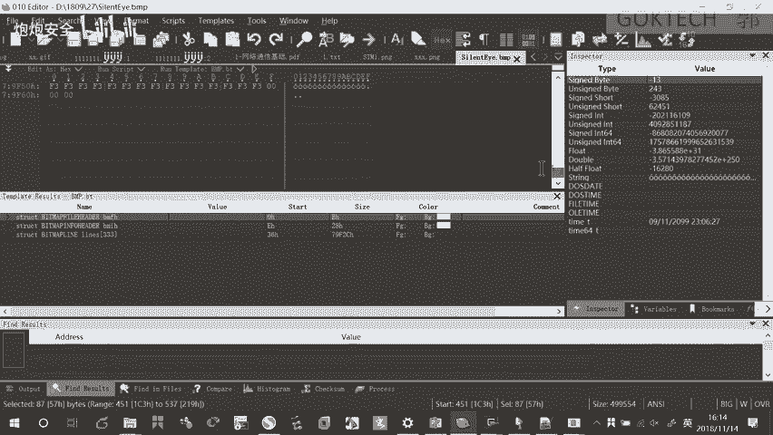
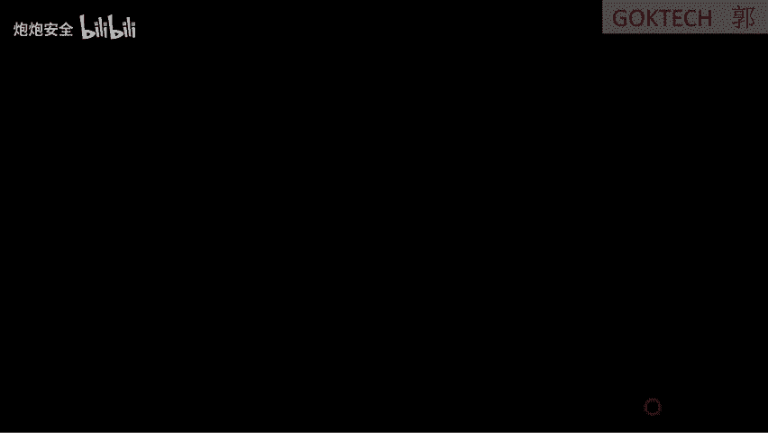
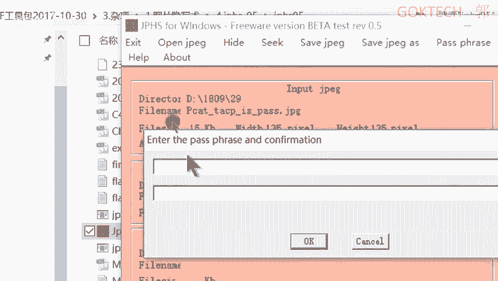
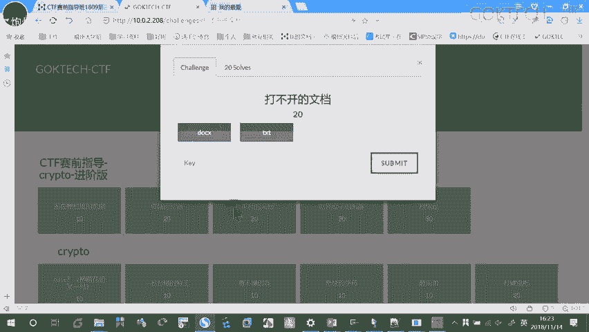
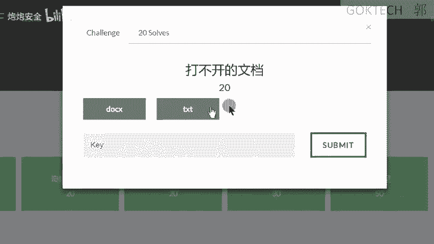
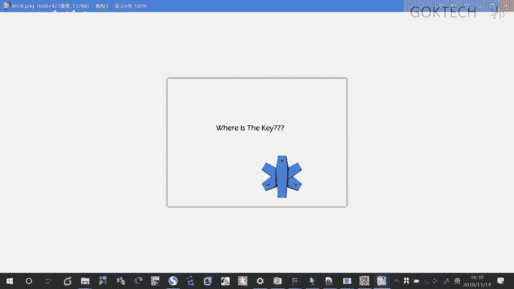

# CTF培训网络安全基础入门 - P15：（16）CTF赛前指导1809班_第三次课：杂项（中） - 炮炮安全 - BV1mT411q7qB

呃，来这里简单花个十0分钟啊，来回顾一下我们之前讲的一个内容。呃，首先呢针对杂象哈，杂象的话呢其实哈。😊，所谓的杂情我都没接啊，等一下，我手写板没接啊，稍等一下。所谓的杂相哈。😡，呃。

它的内容很复杂很多，但是呢也有非常简单的题目。你比如说啊像我们的密码学。😊，它就可以放到我们的杂相体里面，这是没有任何问题的啊，像我们的胖。😡，也有可能被我放在杂象题里面。你比如说我这边有一个什么呢？

呃呃网上的一个实实验平台，就爱春爱春秋的这里有1个CTF大本营，这边有一个呃竞赛的哈，竞赛训练训练营啊，你比如说我点到这个这里要按按我们那个呃五五大象，还有一个基础的，我们不管它啊。

比如我们点这个什么杂项。😊，这里的话呢，它有有时候我也会涉及到什么呢？我们比如说我们往下看一下，比如说它会涉及到这很多哈很多啊，我们看一下，比如说我之前呢我们涉及到了一个。😊，呃，我们往下看一下啊。

咱像有时候它会涉及到一些密码学的东西。你比如说这个。算法题。啊，算法题一啊。啊，再比如说我们的这个。那些年我追过的啊贝斯，就贝斯家族的那个之前也给大家看过啊密码。但但是呢呃通常情况对杂项来说的话呢哈。

它往往会有一些附属文件，让你下载下来。那针对这些附属文件嘛，你首先要进行分析啊，你要看看出它是什么什么文件，什么类型的文件。然后呢，如何去用对的工具去进行解析啊，这个题呢杂项题。

除非是遇到什么算法比较难的那种，不然的话，只要你用对的工具，基本上都是没有大问题的啊，基本上都是没有大问题的。OK那我们来看一下啊。😡，首先第一点，我们涉及到什么呢？

既然我下载到我通过附属文件下载到这个下载到这个文件之后，我要进行分析。分析的时候有几种方法。😡，因为什么呢？它的原理啊它的原理的话呢，就是什么呢？我们的一个每个文件它都有相应的一个结构，叫文件头啊。

这是它原理。😡，啊，我只要针对这个这个文件头固定的文件头啊，同一种类型的文件，它的文件头是一样的那我就要什么针对它进行一个分析啊。那既然是分析的话呢，那就有两种方式啊，一种是什么？用我们的手工分析。

一种是工具，手工的话就是用我们windows下的三大工具，notepa加加。😡，note pad加下载下来啊，这随便百度都有啊，这个百度都有啊，这不是不是什么好，不是什么那个收费软件啊。

notepa加加下载下来之后呢，我们进行安装，安装完之后在这个地方。😊，我也不多一点示哈，给大家过一遍就好了啊。这个地方插件哈基本上为什么它好用？就是说它有很多的插件可以用啊，很多的插件可以用。

你们稍等一下这个。😊，上次不知道打开什么东西啊。我可以什么用这边的插件啊，这边上面有一个插件，你们下中文版的就可以了。这边有个插件啊，可以用用到很多的插件。如果没有相应的插件，那怎么办呢？去下载。

就打这个点这个问号，然后获取插件它会打开一个网页，你搜一下就有了。搜完之后把它下载下来，下载完之后呢，放到它的安装路径下面啊具体的话呢啊可以去看一下我上一个录屏，它怎么操作了啊。那这里我就不多说了啊。

😊。

啊，个人比较建议用010edit这个win hack的话呢，其实。这个wint它是一个破解版的啊，在我们的CTF工具包里面。如果说现在还没有CTF工具包了，找我考一下啊。😡，这个是一个付费版本。

那我把它嗯已经把它绿绿化了哈，大家只要用一下就可以了。但是它有一个呃版呃期期限啊期限，所以说呢建议还是推荐010edit啊，这个我之前应该有发到我群上去啊，发上群消息啊，这个自行安装就可以了。

它好处在于什么呢？它可以。😊，很方便的在我们这个。注册到我们的右键这个文件夹里面啊，问右键这个菜单栏里面010edit，我可以直接针对文件啊进行分析。右键直接edit直接分析一下就可以了。OK。好。

这个是手动分析的，我需要那个么呢？需要去啊对照那个表进行那个呃对比嘛。比如说他这个文件头是怎样的，我去对比这张表什么表啊？啊，常见文件头类型表。啊，在这个地方都有啊。啊，注意啊，还有个比较特殊了。😊。

啊，PDF。我们看一下PDF是不是这样子的啊。看一下有没有GDF了。没有是吧，没有我们找一个啊。下一个第一个稍等稍等。加。找一个啊。实训班的。你比如说我这里有一个。文件头啊唉1个PDF的一个文件。

给它打开看一下。看一下能不能打开呀。这还不一定啊，因为我加了密了。25504446啊，我们看一下。25504446，而且它后面还有一堆的啊，2D312E。

2D312E也就意味着它那个文件头的长度呢跟我们不太一样。默认情况下我们是四个字节嘛，它是6个字节。啊，甚至有可能是啊七个字节，七个字节，应该是7个字节才对啊。那我们这里我们就不管它了啊。

默认情况下是四个字节嘛，一个、2个、3个、4个，为什么是为什么两个两个两个就算是一个字节啊。因为两个16进制数等于什么？8个比特嘛，对吧？有人象吗？1个16进制数等于什么4个啊，对。

所以说呢一字节的巴比特嘛，所以说怎么呀，一字节、两只节、三字节、四字节，这个五字节的也是比较特殊的啊。O。好。来，那工具分析就觉得比较方便了。它其实呢也是根据那张那个文件头类型的一个表。

但是它会自动干嘛？帮我们识别出来，直接直接显示在接口上面。这个是linux里面的工具啊，linux里面的工具。😡，好。既然我分析出来的时候呢，因为什么一些什么引写的一些问题啊。

就什么它有可能文件会藏着其他的东西，其他内容，这是很正常的那我怎么进行进行分析呢？就干嘛呢？就针对这个文件进行分析然后进行分离，分离的话呢，可以怎么做呢？😡，首先一样你要进行分析。

它的原理也是很很简单的。啊，依照什么。依照文件头呃那个类型去什么啊，去查找什么呢？1六进制。就啊，十六进制就是我们的一个按十6进制查看方式来查看，然后去找去搜索啊。当然了，搜索是比较low的人工的方式。

那我们怎么办呢？用自动化的方式，启动呢biningwork和formmost都是什么卡利里面的工具，并且它怎样的，并且beingwork可以除了可以分析，还可以分离，它是两大功能啊，两大功能。

这个分离要加什么参数啊？😡，杠一对。来会自动的吗？啊，真那个自动什么解压对吧？自动解压我们的压缩包formmost呢啊默认的情况下哈不加参数的情况下，它是就是分离，并且干嘛呢？按什么呢？😡。

按我们的一个呢文件类型嘛进行分类，对吧？啊。还有一个什么半自动化的，半自动化的就使用我们的什么BD这条命令。😡，滴滴就啥命令啊，针对。😡，啊，快啊快速啊快的数量大小和数量。进行什么分离。默认情况下。

它的快大小是多少？😡，哎，错了，默认情况下，块大小的单位是多少？😡，对，这个一个块的大小，它的单位是多少？是。😡，比呃，这个叫什么自己啊。😡，它默认情况下是几节啊，我给大家看一下啊。😊，啊，默认情况。

你比如说为什么说它这个BS等于一，为什么它是一字节就是这个道理啊，就是这个道理。当然了，它这个呢啊针对我们的一个情况不不一样，它也有可能不一样的啊。我们来看一下啊，就是之前这个题目啊。😊，不是这个。

这是我们课件上的1234567890这个ABCDEFG的这个题目啊，看到啊。😊，右键拿16进字来打开。好，我看一下按十六进制的方式来查看一下行不行啊。12345。12345。对吧。12345。12。

好像有点小插插入123451234512345123好像有点小小插曲啊。这个这个0A是不是这个小数点不可打印字符啊，各位。啊，我们看一下啊。啊，还真是啊什么意思啊？我想表达是什么？😡，一个字节了。😡。

两个字节，三个字节、四个字节，五个字节，六个字节。它的意思是什么？原来我们是按那个图文件的内容嘛，1234567890ABCDEFG对吧？我们看我们分析的时候是按这个文件的内容来分析嘛。

其实他每个字符是不是一个字节。😡，为什么我们的ask吗？还记得吗？😡，它是不是啊8位二进制可以表示一个字就可以转化化为一个字符嘛。所以说什么这一个字符就是什么啊，一个字节这个没有任何问题啊。

这个没有任何问题。所以说它的那个block size啊，这个大小啊快大小的单位其实一样的，还是字节啊，字节一字节的巴比特。😡，啊。OK啊，能不能能不能修改它的大小呢？能。😊，就我在后面加上具体的单位。

比如说一照，那这个单位就比较大了啊。😡，那它的原理啊其实就是一样的，就是进行分离啊，根据块的大小和数量进行分离啊。😊，首先呢我一样的用什么binwork去分析一下。

不然的话你根本就不知道它呃是从哪里进行一个分离的，然后进行一个呃叫什么引写啊。你比如说他可能前面是什么JPG，后面是什么GIP的那他到这个点花了多少个字节，到这个点，剩下多少字节，那你要去分析。

然后针对滴用这条滴滴这样命令去。进行分析就可以了。分析完之后也也可以分离。那这个我就不多说了啊啊，我就不多说了。😊，能不能用纯手工的方式呢？有啊当然这个呢。通过16进制数。啊，你反正那些那些文件头嘛。

一个个去套，一个个去搜索。搜索出来之后呢，如果说搜索到了就干嘛了？选中。😡，啊，选中，然后把它干嘛呢？把它导出就可以了。什么意思啊？就比如说我认为这是这一堆是一一个文件嘛，这这文件我怎么办呢？😡。

我把它导出来怎么导啊？😡，右键这边有个selection啊。选中了嘛，我干嘛啦？😡，保存选中的内容。把它保存下来。😡，啊，保存下来，那我命名的时候也是一样的。点THT。你比如说你认为它是一个点TST。

你就点THT给它保存下来就可以了。那我一样的可以把它啊把它那个当做一个单独的文件来查看。好。ok。好，你继续啊。这个是针对文件的一个引写啊。第二个呢，引写其实常最常见的还是图片的一个操作哈，图片的操作。

首先第一个涉及到我们firework的类型啊，这一般情况下是什么呢？这个图片我们用图片我们用010去分析的时候，这个开头啊。😊，图片用010去分析的时候，这个开头啊。

这个地方它有firework这几个字样的一个显示。那我可以用这个这个软件去解开。啊，但是呢我firework作为什么呢？一款图像分析工具，图片分析工具最常用最常用的就两个。

啊。处理什么呢？firework。标志的。涂血掉啊。啊，还要作为什么？作为图片解析工具，图片啊常见啊呃图片。解析啊，主要分为两大功能，一个是什么图层的一个分离，还有分解，还有一个真的分解。图层。

就好比如说一层一层把它盖住。我原来比如说我原来底下有一层。啊，是什么呢？我们的一个。一个重要的信息。然后呢，我用一层什么蓝色的给它盖住，这个蓝蓝色的刚好比第一层大。😊，刚好比第一层大就完全把它盖住了。

你根本就看不到红色的红色的部分。但假实啊看着啊这地方刚好有一个flag啊，看着啊。😡，刚好在这个地方，就是小块的，刚好是flag。我用一个蓝色的把它盖住了。😡，那你也一样看不了，那我怎么样？

只能把这个图层给它分掉。那么自然而然这个图层没掉了，自然就看到我们的flag了。啊，这个是针对图层的分解。还有什么针。你比如说我们GIF最常见的是GIF，我们对针进行一个一个个的拆解。

这样子我们能找到其中的一个啊内容啊OK。好，这个是firework啊。还有一叉一5一叉一股有时候可以插入很多信息，不一定不一定是什么？我们这里再强调一下啊，不只是。😡，GPS信息啊。

不要看我演示的演示的好像挺好玩的，不一定不一定是GPS啊。一般情况下大家都没有开那个记录信息啊。😡，啊，OK那怎么看呢？就是什么通过windows右键，然后查看这个属性查看详细信息就可以看得到。

如果是看放在卡里里面，用E的一个to进行查看就可以了。还有。最常用的什么呢？图像分析工具。啊，这个呢一定要会用了。他可干嘛呢？进行通道的分离，就是我一张图片。打开之后，在左这边有一个两个按钮嘛。

一个是哎等一下，一个是向左，一个是向右嘛啊，我可以针对不同颜色进行分离啊，那这个是最低有效位的分离，就把最低有效位给它截取下来，排列组合。这个第二跟第一完全不一样啊，不是一个概念啊，不是一个东西啊。

这个是什么？把信息藏在我们的那个颜色通道的最低位嘛。那把所有的最低位干嘛呢？给它排列组合，按不同的规则排列组我组合就可以进行一个数据的还原。😊，还有一个是什么图像的对比。

你比如说两张完全你你眼肉眼看着觉得完全一样的嘛，完全一样的，两张图片进行进行进行对比啊，进行对比。😡，我们来看一下这张。你比如说我复制一下啊，粘贴。比如这两张图片其实是完全一模一样的啊。

那我们使用我们的工具。工具。选AF工具包啊，一定是选密杂项啊。就第一个图片吧呃，第一个软件吧。open打开。哎，稍等一下。在哪里呀？18098是吧？稍等。你比如说我拿这个副本啊。跟他原来的对比。

你看像这种的话呢，其实呢因为它两张图片其实是一模一样的，所以说你根本就分分析不出有效的东西来啊，有效的东西来。但是如果是什么呢？如果是这两张图片其实是有细微差别的，只是你肉眼看不清的时候。

它就会在关键的地方显示出他想要显示的东西，你比如说最简单的啊。两张图片一模一样嘛，是吧？稍等一下，哎，跑到哪里去啊，奇怪。我找一个啊。你比如说这个XOR，因为两张图片一模一样嘛，相同为0，对不对？

所以它完全相同。所以说在这个里面它什么东西都没有啊。😡，或啊与啊相加啊，你比如相减一样的，因为它两张图片一模一样，所以说它相减完肯定是直接减光了啊，就是相同的数值相减肯定是没了，肯定什么东西都没有。

如果说他减的时候，你说。😡，对对你比如你比如说这两张图片，它就是通过相减的方式得到他的想要的内容嘛。当然有时候你数据调一下，也有可能会有会会有显示出不同的地方。对。当然还有一个问题啊。

你比如说它可能像素是一样的，但是你的长宽高你就调了嘛，就有设置过了。就算它像素点可能一样，但是长宽高不一样，它去相减相相相减的时候就有可能不一样。你比如说故意把它的啊宽度变变变变变高度变窄了或者怎样子。

这都有可能会有问题的啊。😡，再来针对引写术啊，针对引引写数，引写数是什么意思啊？因为我们的图像是什么呢？我们每一个什么像素点都是由8个比特来组成的啊，0到什么呢？7。8个比特啊。

它可以在针对最低的这个比特干嘛进行隐藏一个数据。啊，这个地方也是隐藏一个数据，第二个像素点，第三个像素点都隐藏一个数据。那这些数据比如说什么呢？00011011啊，或者怎么样或者其他数据。

像这个组合起来就是一个字符了嘛，这个字符可能是组合成其他的字母啊，你比如说我们图我们那个课件上面的。啊，我就。比如说我们课件上了，稍等一下啊。😊，比如说我们课件上的这几个数字组合起来。

就是我们的一个什么ask玛的一个A。那我有可能就是什么呢？组成组合起来就是flag。啊，flag然后大括号啊，大括号这些其他的东西都有可能啊。O那怎么去分离啊？一样的图像工分析工具。

就这个地方这个东西可以进行一个数据的分离。用这个啊JJS tag需要事先下载啊，事先下载。OK我们来看一下啊。这个工具需要首先需要你运行这条命令啊，不要这个中文英文都看不懂哈，这个是安装的意思啊。

你首先要安装这个。安装完了之后，你就可以愉快的使用这条命令了。好。用这个这个工具比较尴尬啊。😊，退不出来。😊，好，再来这个拍thon这个脚本啊，我告告诉你有两种方法可以运行。😊，第一种是什么？😡。

这个脚本的话呢啊呃这个东西给你们，你们知到时候弄一下就可以了啊。呃web这个什么来着？前面这个叫什么来着？啊，这个我就不多说了，来，你可以去，有可能是我这个工具有问题啊，可以去百度搜一下试试啊。

还有什么用脚本。😊，要用脚本去把它的最最低有效位给它弄出来啊，最低有效位给它弄出来啊，这个地方呢。可以使用什么linux和什么呢？windows呃，我写在一起吧。均可运行。来。这个地方啊这个是第几页。

23页是吧。23。针对这个这个这个这个什么BMP呢，针对这个BMP，我要我我首先要把这个图片呢这删掉。我要把图片放到这边来。放在脚本同相同的目录下面，然后脚本修改一下，脚本修改一下。

用note pad加加或者note pad都可以修改。😡，把这个什么目标改一下就可以了。这个目标的所在文件改一下。那至于这个我就不给你们分析了啊，不给你们分析了。😡，啊，那怎么去运行呢？有两种方法啊。

不要去给我这样双击运行啊，没用啊。😡，来CMD打开。啊，拍正。啊，直接跟上了吗？呃，直接跟到这个就是LSB就好了。直接运行就可以了。啊，我再强调一遍啊，python是有两两大主主要系列啊。

一个是python2，一个是python3，我让你们装的是2。7嘛，2。7那个版本就是python2。python2的话装下来之后怎么办啊？你直接你装了python2的。😡，那个这个这这个环境啊。

你只能运行用python2写的脚本。如果你装的是python三的环境，你只能运行用python三写的脚本啊，注意啊，这个不知道能不能理解啊。okK因为我装的是什么呢？😡，双双版本pyython。啊。

所以说我这边呢啊处理过嘛，所以说我这边要写一个python2，我要区别开python2和python3，这个是修改过了啊，修改过了啊后我们回车就可以运行了啊，回车就可以了。啊，这个就会弹出一个图片来啊。

那如果说有些同学可能想要跟我一样装这个linux的子系统啊，卡利的子系统啊，这个是win10的一个功能哈，你们去应用商城啊，win10的嘛，如果就说你们电脑是应win10的。

去应用商城搜这个卡利这个系统可以装，这个是子系统啊。Blash。哎，不就可以启动我们的一个卡利的一个子系统。严格意义上，卡利是可以运行这个了。严格意上它是可以运行的，但是我这边是运行不了的，为什么？

因为这个是一个字符界面，没错吧，什么叫字符界面啊？😡，对，纯文本类嘛，所以说他弹弹不出来，你看到没有？😡，打开一个X windowow啊，它那个图形化的页面就叫插window，不是windows啊。

是插window，就这样停了，不要给我加一个S啊，叉window就是它的图形化界面。所以说呢最好是用什么呢？我们的一个啊卡利的一个虚拟机直接去运行啊，这才是最稳妥稳妥的啊OK。😡。

接下来啊我接着往下讲了啊。接着往下讲了，接下来是针对什么？针对什么文件。😡，PNG的啊，针对PNG的啊O。真在编这两个头像啊来。7。we克PNG是一款简单易用的PNG图像浏览工具。

允许查看和修改一些PNG图像的一些信息啊信息OK。工具。T week。啊，PNG。这个。来。原理。因为图像头部。不只是。啊，文件类型的标识。图像的头部啊，你头部那几个字段了。

那几个字节啊不一定不只是类型。因为图像跟我们普通文件的区最大的区别就是图像有。宽度有高度，如果是3D图像，还有什么呢？它可能还有深度这种概念啊，我不知道大家怎么看它啊。😡。

一般情况下这个图像我这个地方啊我倾向于认为它是高度。这个地方啊其实长度和宽度都可以。那如果是3D，它就有一个所谓的深度。3D嘛3D图像它3D图像它不是里面。😡，啊不太会画3D图像啊。

就它里面应该是有一个深度的对吧啊。ok。啊，还包含了啊长度。或者所谓的么。或者叫。宽度。高度。啊，以及。校验和以及校验值。通常情况下。一个图像的产生。就会什么呢？被。被。赋予什么呢？各种。文件。

头部信息。啊。一般情况下。图像。刚产生的时候。啊，刚产生的时候，它图像刚产生的时候，长这些信息是正确的。啊啊，应该这样说，图像刚产生的时候。头摁那个。长宽高等等哈。等信息会被。校验。什么叫校验呢？

就我加减乘除去运算一下类似这种算法去运去给它计算一下形成。产生一个值X1。XE产生一个值。XE。如果这个图像被修改了。啊，来，我现在修改图像，我可以这样修改啊，看着啊修改校验值。

有可能啊就如果这个图像被修改了，有可能啊产生什么图像无法打开或者什么显示不全，都有可能都有可能啊。有两种情况，第一种就是校验值被修改了。😡，修改为X。啊。啊。还有一种情况是什么？校验值呃长高度。

被啊修改，比如减半。什么叫高度被减慢了？高度减慢，我告诉你非常严重。😡，啊，这个图第几第几页。え？24是吧。来。这个就是一个典型的什么？二维码，但是他二维码怎么样？是不是显示只有一半了？

其实说白了就是它高度或者说校验值什么呢，有可能被修改了。那我们不管它。😡，系。校验值被修改为X2哈。使用。使用啊接下来都是啊使用T week。去。校验的时候。算出来了值。通过什么呢？长宽刀。

算出来的值是X1跟现在的。X2不一致。产生。报错。我不知道这个能能能不能理解啊，因为它只是校验值被修改了，就现在结果被修改了，长宽高没有被修改。那这时候我使用这个什么呢？这个工具去检查的时候。

它是按现在的长宽高去去去去计算的，算出来的值是对的，但是是。😡，被修改之前的这个X1X1跟X2当然是不一样的，所以说它就会报错。还有一种是什么？你高长宽高被修改了，长宽高被修改了。

我按错误的长宽高去计算，算出来值显然是X3啊答。😡，这啊。通过错误的长过广告。算出错误的。X校验值。X3显然这个X3跟X1不一样。啊，总结一下。如果。计算出来的值。报错，那一定是被篡改过的。

这个是毋庸置疑的。啊，毋庸置疑的OK。行，那我们接下往下看啊这个工具到底怎么用，以及我们的这个头图像是怎么样子出现的啊。现大家看一下它的图像是图像的位置啊，按了啊。有点难看，我简单的给大家说一下。

首先呢第一行。我在哪里？我在这儿我在这儿。首先第一行前面四个字节是我们的图像的一个特征嘛，那我就不多说了。😡，接下来。在四个字节接下来了嘛从第三个字节呃，错了，12341234第9个字节就是从这个8嘛。

从这个八开始，这个这个四个四个字节呢是我们的一个什么长度，检查的一个长度啊，这个是检查的类型，我们都不看，不去关心第二行这里就注意了。第二行就是我们的宽。第二行前面四个字节就是我们的宽度啊。

第二个部分就是我们的高度啊，这四个字节是高度，以及什么呢？它针对前面这些内容。😡，前面这几个内容做为一个什么校验叫CRC的校验算法。CRC的这种校验算法呢非常常见，叫循环冗于校验算法，非常简单。

但是高效。反正他只要算出一个值，你跟我这个值不一样，那就是错的啊。😡，这种算法呢在很多场景都会用得到，但是记住它是从哪个位置开始的。0X。这一行是0X00嘛，第二行叫0X10，没错吧。

10111213141516。171718191到什么EDEEEF喊到这边这三个从这从这个什么ED开始，然后呢往下数四个字节。O。我们来看这个哈，我们来。稍等一下，我们来这个地方啊。这个啊。我复制一下。

把它生成一个副本啊。副本呢。用我们的010查看一下。这是它的什么宽度，这是它的高度啊，这是它一个什么校验。啊，这是他校验OK。我们使用我们这个图像获取工具来获取一下。听一下。关键的地方我给它标注一下。

对吧。啊。接下来我使用我们的工具啊。这个是吧来，我们使用我们工具，打开我们的工具。这个工具叫什么呢？是是不是图像引写啊？T week是吧，T weekPNG。把它解压一下。

里面是一个什么？根据你电脑的一个位数，你的6464位的系统，你就使用64位了。83。32位的你就使用叉86了。打开我们的图像啊，记住啊，是open啊，不要点错了，连点 new死活都打不开的啊。😡。

Open。在哪呢？地盘。180923是吧？诶。不是23吗？24。这个副本是吧？打开计算一下。他说啥？哎，没错，他说什么？这个值呢算出来是081C7EDB是吧？他说应该是什么286C213A对吧？

我们把它。画出来。

是不是08？医 c。7亿。啊，然后呢。DB。这个地方啊。啊，这个地方他说这个值是这个，但是大家知道什么应该是这个值，那也就意味着什么？意味着什么？有可能这个什么这个图像应该是校验值被篡改了。😡，啊。

那我直接告诉大家啊，这种题呢怎么做呢？你首先呢。😡，先去尝试一下校验值，给它改改到它改到它给你建立这个这个值啊，改完之后你再去看一下。改呀，稍等。从哪里开始啊？这个08这个地方开始是吧？

这时候我使用替换的方式啊，你先按随便按一个。😡，比如说我来一个怎么啦？3。啊，这个时候你看哪注意看了。😡，我不要动啊。你就看了我在淋巴这个地方啊。😡，我在这个地方。啊，来我随便点一个啊。

比如说我随便按02。这时候呢是一个什么插入呃，这是一个是一个那个呃插入的一个模式了。那如果说我按了一下insert，这时候呢，insert INS那个键。哎那是在你们一般情况下在你们右上角。😡，啊。

他有时候是全称啊全称叫inser。😡，如果是简写，有时候是INS。INS啊OK。在这个地方。那我按一下啊。银色的按里下。嗯。8。诶。奇怪。6C。21什么了？3A对吧？OK这时我们记得要保存啊。

按这里啊保存一下，保存到。好，那我们去看一下啊。折个副本是吧，再打开还是什么一样的啊，这种呢是其实是出题者比较好心呢，什么意思啊？除了理的这种题目你一看就知道它是高度被干嘛？隐藏了嘛？

这个非常非常容易啊。😡，所以说呢有可能是什么。有可能是什么呢？错了啊，有可能是长宽长宽高干嘛了，被人家干嘛霸占了。那我们的干嘛呢？撤销撤销撤销撤销撤销撤销，全部给它撤销，然后保存一下。

这时候有可能是什么？😡，宽度或者什么高度被篡改了。那这时候来看一下啊。😡，现在呢我已经已知CRC是。😡，已知CRC是什么呢？这个值是对的嘛，这个值叫什么？比如说我们认为它是一个A。A这个值。然后呢。

现在我有。宽和高对吧？宽和高，我假设是X和Y。😡，反正XY通过什么算法呢？CRC算法得到什么？我们的A对吧？那好，他现在呢就就去算他怎么算呢？😡，他首先第一步哈。假设A固定A是对的。然后通过已知的A。

已已已知的X和A应该好X假设X是对的那就通过已知的X和A算出我们的Y值。第二步。假设Y是对的。啊，算出我们的X值啊，第三个它有可能就是什么通过各种各种公式去套，反正算出正确的一个合理的一个X和Y值。好。

再去检查一下啊，看一下是不是跟这个对比一下，看下有没有对啊。一般情况下是这样子的哈，一般情况下就是什么呢？一般情况下他不会为难你了，他顶多就只改了一个位置啊，那这样子的话呢去算出来的哎长宽和高。

它有可能呢就是跟据我们这边就有点不太一样啊，有点不太一样。😊，行，那我们来看一下哈。😊，一样的用到我们的脚本。

PNG的一个pyython啊，这个脚本。啊。来。以后呢我们要更改哪个地方呢？这个地方。这个地方。啊，文件名嘛，第二个要更在哪里呀？😡，更改它正确的什么，把正确的一个什么界面值填到这边。记住了。

这个0X不要给我删掉啊，0X是什么？😡，表示接下来这个是16斤之数。我上次就是不小心把它。😡，不良删了，死纹改不出来啊。ok。它的校验值是不是这个081C看一下。081那就我们就不改了。

STISTM是吧？😡，是STM吗？好像是副本那个是吧？那我们最好用什么呢？最好用复制当贴的方式。算了，我们拿一个吧。拿一个什么一吧，省得他不支持中文啊。STM1对吧？那我们这边给他来一个一。保存一下。

使用我们的脚本。计算就可以得到它那一个值。就是25到2024到25是吧？Python。嗯，运行一下这个什么。PNG的这个点PY。啊，给它运行一下，得到一个值。稍等一下。这个是16进制数啊。啊。

我因为我把文件改了，我我是不是把文件名改了，所以说这个地方我要重新拿一下啊。我把文件名改了，所以说我要重新去算它，重新用16进制数给它打开啊。不然的话，我原我原来这个叫副本嘛，副本就没了。

无法无法进行那个。重新打开一下。太大了哈。0X118对不对？是不是尾号是不是118？接下来这个尾号是118吗？😡，这个大还是下面这个大？😡，肯定是118嘛，对吧？所以说我要改，是不是？

现在的情况我是什么替换的方式是吧？Yeah。啊没对吧。保存一下。啊，是这个STMI这个啊一哈。对吧啊，那这时候呢我在扫描是扫描的时候呢，这个扫描工具有些同学可能找不到啊。温瑞阳说一下。

这个最简单的方式就是你用微信。😡，微信是肯定可以扫。啊，那比较难的呢，你比如说呃如果他不让你用手机啊或者怎样子啊，你用这个二维码扫描神器。这里啊图片已写出这个有一个二维码扫描啊。

这里其实只有一个就是二维码扫描是什么？这个CQ啊CQ啊CQ啊CQR这个工具，你要把它打开才可以。但是如果说你想扫描图片呢。😊，小到桌面上的图片你怎么办呢？这里有一个电脑。桌面二维码扫描神器。

这个地方本来不放在这儿的哈，放在哪了，放在我们的压缩包破解工具这边注意看。压缩包破你哎，我看一下是不是这。不是这个找一下。去。这个东西。有时候老是鼠标定位不不当。找一下啊。在我们的杂酱题名面好像。

在我们的闸项平面，我到时候发给你们，我到时候发给你们啊，我到时候把这个包发给你们啊，不用我我是突然想起来给你们发的是没这个东西的啊啊。😡，我还一炒马上就有了，好吧。踩这个地方吗？这里有个压缩包啊。

你们自己再看一下，你们是没有压缩压缩文件题目的。你们只有你们只有那个前面那几个啊。这里的话有一个我们的那个这些地方分析IR压缩包文件格式，这里有个电脑二维码扫描神器。马上就有，好吧。稍等啊稍等啊。

这个地方呢是一个免安装版的一个工具啊。扫一下就可以了。你说这个图片太小，还找不到。啊，马上就查到我们的flag格。😊，啊，如果说有时候图片太小啊，他有可能扫不到。上啊。啊，他这个就少不了啊。啊。

这么大就可以上到，就是太小了，有时候少不了，你必须给它放大一下啊。啊，产量过少okK那我就不多说了啊。这个是T week啊。

还有一种是专门针对那个啊接下来是专门针对加密的那我们这个先不说不多说了哈那先先先先先先。想到这里，我们休息一会儿啊。那我再花。十几分钟的时间吧。图片已写剩下的内容全讲完哈。

然后讲完之后大家花点时间做一下实验啊，在这边做实验效果也比较比较好一点，有问题直接问，好吧。佢过都来啊嗯。来，那接下来讲的这一块呢。啊，所以我们这个这个这这个我就不多说了哈，不多说了哈。啊不多说了。

针对然后呢。接下来是针对什么呢？加密过的图片进行解密的哈。加密过的图片进行解密的。好。来，因为有时候呢这些图片呢呃像前面那些内容是直接引写，我通过工具就可以弄出来了嘛。但是在这边的话呢。

它因为有一些文件，它有可能你引写了之后，它可能会会有一个加密。就比就比如说哈。我打个比方，就比如说你压缩那个文件的时候，是不是要输入输入。有时候如果你输入密码，那你解密的时候。

你肯定要什么写入写那个解密的密码嘛啊，那一样的在这边的话呢，我们可以干嘛呢？比如说这边有一个。加密过的图片，我可以通过这个工具，这个工具叫BF toolss这个工具给它解密。解密完之后呢。

就会有相应的一个信息出来啊，相互的信息信息出来。OK还有什么呢？像比如说这个这个就是图形化的图形化的工具，上面这个是什么我们制符的一个工具。我来看一下，直大家看一下这个26哈26这个图片我们看一下。😊。

这里有这个工具呢是一个windows页面下的一个工具运行的时候我要怎么做呢？首先第一步把这个猪猪猪的这个啊放到我们这个。命令所在的地方命令所在这个地方。

然后打开CMD你们除了这样就我这个是这个CONEMU的哈，你们可以直接在这个地址栏这边啊输入CMD都可以。😊，系。啊，运行我们的一个程序啊，就BF是吧？😊，这个ESE的这文件。

然后呢啊针对这个猪猪猪进行破解。当然破解它有一些参数哈，我们需要注意一下，首先我要运行这个功能，除了可以加密，也可以解密。我要运行它的解密功能，并且跟后面要跟上什么，这个是固定参数，这个我也记不住啊来。

😊，搞一下。来。我后就针对它进行一个decode的一个解密了啊，brand这个coerco这个是固定参数啊，这个这个这个是固定参数，brandco这个是固定参数啊ok。这个图片，然后呢。

我们把它output给它输出来，output给它输出来，输出成什么了？X吧。啊，XXX点PNG这样就可以了啊，这样就可以了。我们来它生成这个啊。买车。解开之后呢，我们要进行第二步的操作啊。

运行这个文件啊，运行这个文件运行这个文件，运行生成的这个文件啊，OK。我们来运行一下哈，这个这个下面有啊这个图片下面有哈BFtos啊。😊，啊，这个文件啊run一下啊，就是我刚才这个XX这个文件啊。

它自然而然就会跑出一个什么。啊，相应的一个。啊，GTF这个文件好，那我们来具体看一下这个XXX啊。这张图片啊。啊，这个图片错误的，我们不管它。用我们010的edit来啊解析一下啊，也解析不出来。

为什么这个东西是经过加密的。这东西是经过加密的啊，你没办法去解开它啊，你看。这东西你根本就看不懂。它flag也不藏在这儿，你要通过通过什么通过这条。啊，通过这条进行一个解密啊，通过这个进行解密。

这两个是二这两个是什么一二步骤的关系啊，第一步和第二步的关系啊，不是不是二选一啊，是第一步和第二步的概念哈。还有他有些图片文件啊，这个27的是吧？它有些图片的名字它。😡，啊，就给你写的很清楚啊啊啊。

就是什么silent eye，那你肯定要用到silent eye的这个这个这个这个工具来进行解。😡，啊。这是一款可以将文件或者文文字或者文件隐藏到图片中的解密工具啊，其实是加解密工具，应该这样说才对。

啊。对。哦。或者说你把这一款可以将文件或者图片隐藏盗图。图文字或者文件隐藏到图片。或者分离的这么一个工具啊，应该这样做才对啊。来，首先呢这个这个工具呢也挺简单的，在我们的这个地方。😊。

图片已经写出这个地方有个silent eye。这个这个需要安装了，解压出来需要安装了，这个是真的需要安装了。😡，啊，安装完之后是这么一个软件。给他打开。打开完之后。打开完之后，我们去打开一个文件啊。

这里有个fiopen。我们把这个27这个文件给它打开。27站呢。这个给它打开open，这时候有一个什么。这个叫什么解密了，这个叫什么加密啊，封起来了。那我要使用它解密。😡，解密完之后会帮我生成。

我选择确定啊，选择decode。他帮我生成一个TSD文本。那么解触来就可以了。flag进期就藏在这边啊，听不懂是吧？没关系，我再解释一下。啊，针对呃这个东西的话，我们来详细来说一下哈。啊，可以将。文字。

或者怎么啦？文件。啊，存放到隐藏。到图片中。啊你这张图片中，你根本就看不出来了，根本就不看不出来了啊。你比如说这个这个我们之前这个2026哈，26还是2526这个地方，你比如说这是一张正常的一个图片。

😊，对吧啊它题目会或多或少会给你提示，这是一个加过密的一个呃文件。那你使用这个工具给它解开，生成一个什么叉叉叉点PNG的，再给它 run一下，跑一下就可以了。那如果说是针对这种27这种题目。啊。

这个图片你看着啊。这个图片的文文呃那个图片的文件名已经已经直接给你解释了，说你你就是要用silon的艾这个工具，那我就啊毫无疑问的肯定要使用了。你比如说你看着它本身就是CDF后面这跟跟上了一个数据哈。

对吧？那我们可以这样子来。

如果说我用16进制数，你看得懂吗？对吧？看不懂吗？这个这些都是不可打印字符啊。😊，往下拉。

都是看不懂的都是看不懂啊，所以说你只能尝试着去解密啊尝试着去解密。O。还有什么了？针对于什么呢？再拼一句了。也是加密解密的。呃，可以使用这个就叫叫什么呃命令的方式叫啊BF toolss。啊，对吧。

这是提用命令的方式吧。那图形化就是什么？😡，silent是吧。I啊，这个工具好，还有针对加密的时候，还要针对JPEG的加密。针对加JPEG的加密，这个我觉得完全可以拿出来戳。诶。

这里有几个工具呢，我需要说一下啊。

首先是tag。Stag director director director这个这个工具呢有两种安装包，两种安装包。不是这个。一种是用在windows下。一种是用在什么呢？我们的linux下。

linux底下你要进行编译。你newux底下是吧？进到这个文文件夹里面啊，然后编那个点斜杠confi confi先编配置一下它的一个环境，然后make编译一下，在make也是到安装。不会的情况下呢。

我告诉你非常简单。有一个边音安装是吧？好，双击打开。😡，诶嘿。都给你写好了。都可你写好了啊，这当然这个是乌班图体系。😊，一样的。啊，很多东西图形化非常好的那种系统。

比如说卡利其实都是依赖于呃都是基于物班组这种体系。啊，你比如说IPD盖啊，这些都有啊。你比如说针对于叉发6的平台进行一个安装了，也有OK你这个速度可以不加哈，对吧？你用root登root用户登录嘛。

就可以不用s度。啊，不用去度也行。好。那我肯定是用windows的。啊，windows的话呢。😊，首先你要把图片拖到这里，这里面来，图片拖到这里面来，我们来看一下啊。这里有几个图片呢。

比如说这个123456这个图片了。😡，我已经事先把123456拖到这了啊，拖到这了来，我怎么运行呢？😡，はい。这个这吧。123456这个图片啊。他可以帮我解释出来是F5加密。来针对这种加密方式。

他介绍了几种工具呢？首先第一种是分析它是什么加密方式的。ok。分析工具。叫什么这个tag。Dctor。对吧。Stta。Good actor。对吧。这种是什么分析出可以用哪一种加密方式。

那你有几种加密方式呢？我们这里简单介绍了几种。第一种叫JPhyJJP hideJP hideJP hide。这图形化的啊，还有怎么啦？😡，Out of gas。啊，是我们需要干嘛呢？进行编译。

这个编译非常简单，就这一条命令给它回撤就可以了啊。当然当然你要在这个它的一个文件夹下面。带上文件夹下面。OK还有F5啊out。Gas。还有F5。啊。啊，这个没了，这个不算。那。我来简单演示几个。哎。

比如说这里有一张有一个我挺有意思的啊，来，我们来看一下啊。第几个29。29这个。这个是比较有意思的啊。我们来看一下啊，演示一下。不是这个。算了算，直接重开一个吧。这有一张图片啊，这张图片我们看一下啊。

OK是一张正常的一个图片，扫的时候你是扫不出什么东西来了啊。OK这张图片呢，首先我要把它放到哪里了？windows的一个图，windows这个文件夹里面啊，放进来了没有？放进来了。

是不是这张是不是这张图片呢？是的。ok。P cat啊Pca这张图片啊。Okay。洗地。这个。这个是哪一个文件夹？删了。三开头的这个文件夹进入到进入到这里面来哈来，首先我要运行这个。这个文件。

然后针对Pca。这张图片进行一个分析。他说是一个什么。😡，Negative。Native显然不是我们要的加密类型。啊。可能这个图片呢隐藏比较深。隐藏比较深的情况下，我需要去调这个什么呢？😡，呃。

命令的一个敏感度。就说原来我只就好比说你们有没有见过有没有用过我们的扫描杀毒软件的扫描，有一种叫做快速扫描，还有一种叫全盘什么扫描。那显然而言，一个虽然扫的比较比较比较那个快，但是它扫的就没有那么细嘛。

对吧？😡，OK那我就调一下它，调高它的一个什么精确值。啊，这个均界值的一个呃怎么调呢？来，这里有个命令号杠S。啊，调高到灵敏度就可以了。杠S10，然后呢，针对这个什么PK。

杨明你就可以简单一单简单的看出它是一个JP hide是吧？OK那好，既然是JP hide的话，来这个图片了，29这个图片了，29这个图片了来，那我要找到我们的工具是吧？注意看了啊，这个有点不一样。

JP hide在哪里。这个嘛？哎，稍等一下，不好意思。这个来。啊，这个。最厉害的。哎，一定要点这个windows，这个你不要不要点到上面这个啊，点这个。😡，I accept。然后呢。

首先第一步哈open jPE句一定要保证它是一个JPE据的啊，这是正常正景图啊。😡，我怕你们误会。来1809的这个他是几台的？😡，27还是29是吧？这个是吧。好。然后点击s。这个是害的。啊，这个隐藏嘛。

细可。他要求你输入这个密码，因为他是加过密的嘛，密码在哪里？😡。

第一种情况，他在别的地方给你提示啊啊，给你就是你通过其他地方找到这个找到这个东西，然后把它。😡，剪啊剪弄到这边了，什么意思呢？就比如说我们这个我们这个题库上那个图图啊，来看到。哎。😊，哦。

是这样子而已是吧？比如这里有个打不开的文档，我不知道你们看到没有啊，像这里的话呢。😡。

这个文档其实呢分析一下，会发现它是1个THT文本啊，然后呢又把它hold缀名改一下，然后打开打开完之后里面有一个密码，这个密码恰好是用来打开这个什么word文档的，就什么意思啊？就是说这个的密密码呢。

就是从其他地方过来的，或者说它直接在文件上可以提示。比如说这个文文本是什么。😡，DOC插了这么一个文本啊。那好，其实呢你们可能很难想象，我一开始也是懵的啊。

就是呢他这个地方是他的密码啊。Pca点ZPG嘛，对吧？😡，TACP is。Password。也就意味着这个TACP就是他的密码。啊，这个比较奇特啊，PAATCTAPP是吧？靠。TACP。

TACPTACP。然后ok。啊，那他要他要我保存是吧，来一保存。TSP的保存完之后是不是有个111的来用什么打开啊，使后用先用npe pad加佳。虽然这个010用查看16金制比较方便。

但是呢有时候用这个查法呢可以什么找得出来什么。😊，他想要的一个。Flaag。O。这是JP它的。接下来我这边口述啊。这个F5这个我这个东西呢，大家一定要把JAVA的环境调好。ZA的环境一定要调的很好。

它才能够出成出东西。这个是用在。命令就这样，你要进入那个文件夹里面，用命令就可以了啊。😡，我现在的话也没有调好啊，之前不小心更新了一下。你不小心更新它就不行了。啊，他这里有一个图片叫什么呢？

123456，其实他已经给你提示好了，123456就是它的密码。啊，这是最厉害的是吧？哦，有1个F5的。啊，F5的啊这这个就是他123456就是它的密码啊，然后我用这个F5去解密的时候会出了一些问题啊。

因为我环境没有调好，不然的话按他这条命令去敲的话是可以的，是没有任何问题的。啊，那如果是out gas啊，如果你解开的时候，发现它的一个什么。😡，发现它的一种加密方式是outto gas。

那你就必须干嘛？😡，必须使用卡利下面的环境啊，先安装，然后再去解密。这个我就不多说了。最后呢我们有可能哈会遇到这种这种二维码啊。遇到这种二维码啊，看着。因为我们说了，他是冲过三个角了，打打个比方。

比如说他在这边给你放个狗头。你是你扫不出来，是我扫不出来，你必须给他的么。😡，填上一个定位符。这边。填上一个定位组，你就扣嘛，截图，然后粘贴到这边嘛，这是没有任何问题的。😡，啊，所以说要会会砸象。

你还会抠图啊。好吧，各位。😊，行，那我们先。先行我再给你们演示一个吧啊。看下有没有图片啊。男神女神的在哪里？之前你给我你给我们搜出来的时候，是不是这种样子的，这种图片呢肯定是要去反射了。反完射之后。

我才去进行通道的一个分离，对吧？OK那这张图呢就比较比较奇葩啊，扫出来是彩色的彩色。那你们自己想一想要怎么做了啊。OK来。稍等一下啊，通过。通过后台偷偷看一眼。嗯。得分吧。1809有没有？

1809有没有？嗯。这啊就拿这有点慢了。语音。以前。有点咩。啊。有机会先弄一下啊，行名。也就说这个东西可以弄一下去弄一下啊。行吧。开始做吧啊，还没还没注册的，注册一下，抓紧做好，来来来来。😊，啊。

我之前去CTF大本营那边搜的时候，想找一个简单的题都，找不到。所以说这样你们熟练手的时候，先这里先练一下啊。那如果说哎插进去在哪里？练手了之话，这个先讲先。这个吧我们我们不要再一直在做前面的。

今天就先把这个做完啊。密斯科杂酱哈，这里有几题不能做哈。两题不能做。就这一题，还有这一题，这一题是流量的，这一题是针对什么？针对压缩包的这两题不能做，其他都可以做了。啊。就我们把这个什么。

这个这个这个这个这个啊这个做完做完了之后。这里每道题都做一遍。啊，你比如说我这边。最简单的，你比如说我是不是只演示了这个只演示的这个二维码了，对吧？你这个题要不要去做，你看。😡。

where要 is的 key，那显然是被这个藏藏住了嘛，或者说它藏在下面嘛，就可能它的高度高度不够嘛，被砍掉了嘛。那你要去让它能够弄出来嘛啊，那这种题你要怎么去做这些例子我没有全部演示啊。😡。

这些全部都可以做啊。OK那我们先这样了啊。😊，接下来时间。