# CTF培训网络安全基础入门 - P16：（17）CTF赛前指导1809班_国科CTF平台简单使用 - 炮炮安全 - BV1mT411q7qB

来样。我先给大家讲一下这个这个我们这个平台要怎么用哈。嗯，因为CTF的话呢，或者说CTF的话本身就是一一一种什么需要不断做题的一个呃赛事啊。

我们只有通过不断的实践才能够更好的去掌握这么一个呃做题的一个思路啊，做的一个思路。那我这里简单的说一下哈，呃，可以看得到啊。然后我简单家说一下，首先这个平台是搭在我们公司内网的。

也就意味着什么在公司的话，呢。你要只要连到我们这个wifi就可以用了。那我们正常情况下呢，我们就连到啊，我们过来的时候就点连一下我们这边的wifi就可以了。你们就连这个student的就可以了啊。

连这个sdent就可以了啊。我这个可能有点问题啊。那那这两个开放呢，我们先不管它啊，先不管它，我们只连这个啊，只连这个啊。😊，连上来之后呢，打开我们的浏览器。

随便一个浏览器都可以登录我们的平台的一个网址啊，10。0。2。208回车就可以了啊。回车完之后呢，因为你上面没有账号嘛，所以说你首先要注册一个啊。首先要注册的一个啊，右上角这个地方有个注册，点一下啊。

那我们的战队名称啊或者个人的一个名称，统一名统一的格式就是1809开头啊。然后呢，你比如说我叫郭继栋啊。啊，在这边输一下OK然后邮箱就写你们的邮箱，这个也没有关系啊。

这个邮箱呢只是说为了同呃那个为了这边的一个识别而已哈，也不会说让你要求你发什么验证码把，密码设置一下就好，密码不要忘记哈。😊。

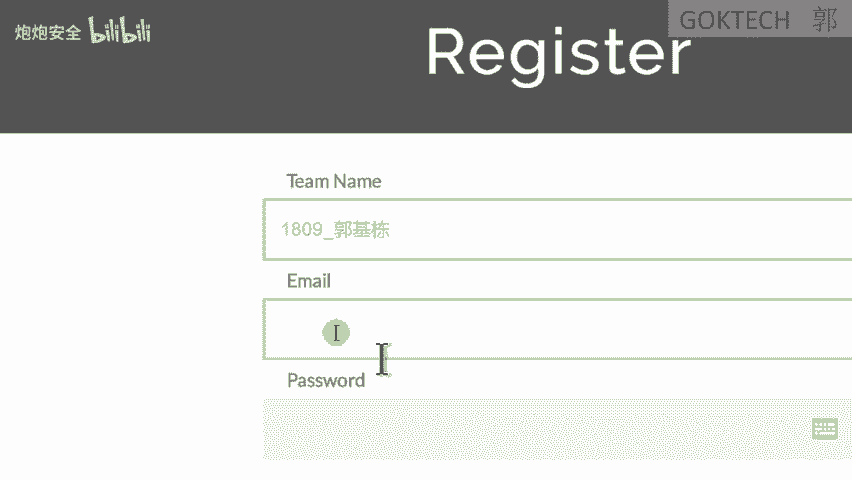

注册完了之后，我们点击点击登录就可以了啊。你稍等一下啊，我登一下我的账号。登上去了之后，如果你刚才刚才名字改过了是吧，profi这个文件的地方啊，这个地方点一下，可以更改你的一个姓名那个名称啊，邮箱啊。

还有什么密码也可以修改。OK好，那我们登上来之后怎么怎么去练习啊？首先点这个chle啊，挑战啊，挑战这个地方呢，这里有很多题目啊，针对于你们初学者的话，我我们这样子我们先找到这个CTF赛前指导。😊。

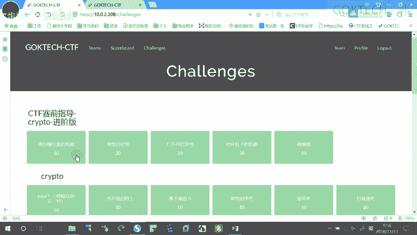

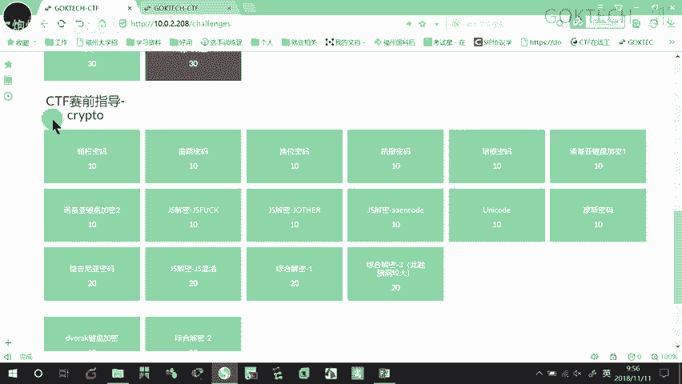

啊，密码学这一块啊，然后呢从这里开始做，做完了之后，这些题目做完了之后，学有余力的情况下，我们再去做这个三制导的一个解吧。

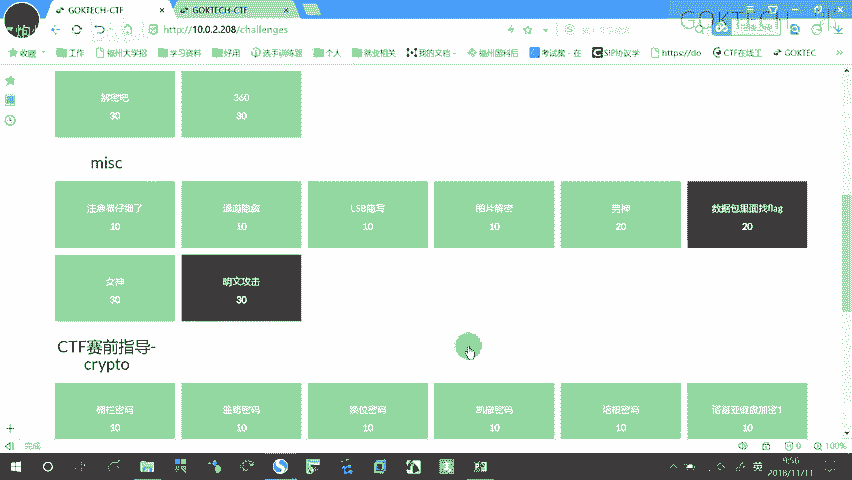

进阶版。做完了之后呢，我们再做这一些这一块其实在前面已经有涉及了啊，做完之后这个就算是基本的一个密码学，就算是这样子结束了。

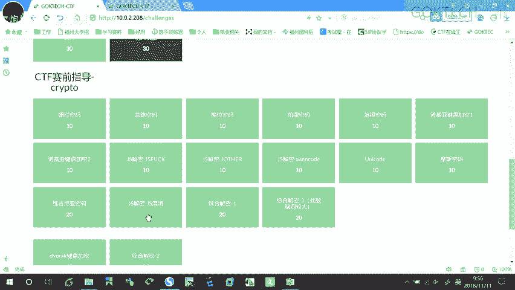

我给大家简单演示几个几个几个几个东西啊。来首先呢比如说第一题啊，第一题是一个栅栏密栅栏密码啊，那我们栅栏的话呢怎么办呢？栅栏的话我们要需要什么打开我们的PPT啊，这个其实其实是可以扩算的。

首先我们要明确啊我们的密码需分为几类啊，分为一个什么。😊，编码编码就是有一张映射表嘛，一一映射嘛。好，然后呢加密算法是有算法，有密钥这些，然后还有摘要哈。那我们先来看一下这个呃我们的一个栅栏哈。

栅栏是怎样子的，栅栏就是所谓的移位。😊，啊，因为加密的话呢有几两种嘛，一种是一位，一种是什么替换一位的意思就是什么？我字母还是这么多字母，只不过我把它换的位置。你看一下啊，我们PPT的例子是分为两栏。

什么叫两两栏了。两栏的意思就是首先去空格，这个我就不多说了。去完空格之后啊，每两个字母为一栏啊，这个叫啊两栏两栏这样子，每两个字母在一起，这个叫分两栏，然后呢怎么办呢？把每一组的。😡。

第一个字母啊分别什么归在一起形成这个第一组。然后呢，第二组就是什么每一每一个栏的什么最后一个字母啊组合在一起。OK这两个我现在分成两栏嘛，或者是两组嘛，两组之后呢，头尾相连，就什么第一组放在前面。

第二组放在什么？后面就形成我们的一个什么密码啊，形成我们的密文，密文是你看不懂的啊，全部是英文呢，你看不懂的。O它怎么怎么来解密啊，现在呢给你一段密码，你要怎么解密啊。😡。

首先他会或多或少会给你提示什么，或多少给你提示多少难。😡，啊，比如说他给你提示什么，这里提示什么？我们看一下这个提示几南呢三栏嘛，或者叫三组，那你就要平均把这个什么分成三组啊，来看着啊。😊，分成三组。

我们先看下他算一下它有几个字图啊，一个、2个、3个啊，我们来。😡，一个、2个、3个、4个、5个、6个、7个、8个、9个、10个、11、12、131415吧，15分成三组，每一组多少个，5个吧。

也就意味着什么？这5个是放在第一组，对不对？这5个是放在什么？第二组后面这5个放在第三组啊，也就意味着我们这个是什么了啊Y。AWCE。好，然后呢OREO艾。还有一个什么UELM。艾特好，怎么把它还原呢？

你比如说什么每组的第一个就放在这边嘛，也就意味着什么Y。😡，E啊YA。WC。E对吧？然后第二种呢就什么O。😡，啊。一。哦。啊 at。第三组是什么U。😡，E。诶咯。M最后有一个艾特对吧？来，因为呢。

因为原来是去掉空格的嘛，所以说我们要把自动版空格加上去，怎么加？U。啊。welcome，然后呢后面空格加上两个at。啊，所以说这一题呢可以口算的。其实如果他没有提示，你怎么办呢？没有提示。

我告诉你使用我们的工具在这边啊，之前有拷给你们吗？没有的，等一下找我。😡，啊。CTF这里有个工具啊，叫什么CTF工具包，你把它解压一下，这里呢分呢按我们的一个学科分为这么几个啊来哈。首先密码学。😊。

今天我们讲的是密码水吧。来这几个机器你们要用的。第一个是小葵。😊，第二个是什么米斯特，第三个是密码机器，小灰可以直接双击运行，密码机器解压一下运行，米斯特也解压下运行就可以了。好。

首先我们点击这个密码机器，这个是一个离线版的网页。啊，因为他告诉你的这是一个栅栏是吧？所以说我们点击栅栏。😊，啊，点击上来OK我们把刚才这个给大家复制一下，这个密文给它家复制过来。😊。

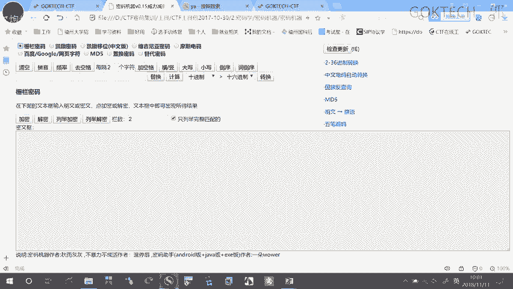

Copy。然后呢，粘贴到这边。啊，栅栏是吧？因为我们不知道多少蓝嘛，所以说我首先从一栏开始。😡，从一栏开始，他的意思就是什么？从一栏然二栏三栏给我列举啊，那我就那么列举我们的一个加密。

列列举我们的解解密，他就会根据什么三栏这个这这一整个可以分为三栏也可以分为五栏，因为三五十5嘛，对吧？你你十5十5个字母怎么分成两栏分不够分嘛。😡，原来是要什么分成两栏是什么意思啊？两个字母在一起嘛？

那十五你怎么分成两两一起，两两一起总会有一个是吗？遗漏嘛，那三行不行啊？三刚好嘛，你一栏的话能分吗？一栏分呢就是相当于是铭文的嘛。you are welcome你再怎么分也是一样的嘛，对吧？

OK那么我们分成两栏不行，分成三栏呢，三五十五好像可以分成四栏四4十六不够嘛，因为我总共才十5嘛啊，然后五栏呢行不行啊？三五十五刚好，所以说它就有三和五两个，所以说呢这个的意思是什么？你看着啊。

比如说我这边给它写成稍等一下，我把它这接删掉。😡，你比如说我写成五栏哈，那大家就为什么以五啊往上累加就是只有5。😊，啊，直接五五栏分成五栏，他有时候还不行啊，你要去看你看得懂才算是啊。

你比如说我分成三栏，它就会三五，这样往下呃往下给我给我弄啊，稍等一下。😊，啊，三栏。他就会什么按345这样子给我算下去啊，这个还是比较方便了啊方便了。只不过空格你要加在哪里，这己要去研究一下。

O我再接下来再看一个例子啊。😊，取动密码取动密码的话是怎样子的。来，我们看这个PPT。取动密码，你首先要它已经提示说，你要写在几行几列了，就把这个字母填填在这边啊，几行几列啊。你比如说有五行嘛。

五行的话，你就是什么每五个就有一个空格，每五个就有空格。这里是几个四行嘛，每四行就有一个空格。没错啊，每呃，错了，不是每四行了，每四个字母就有一个空格，那它是怎么曲路是怎么算的啊？来它现它原来是铭文的。

把它从左往右这样填嘛啊，填的五行系列这个表来，那做的时候呢是怎么做的啊。你比如说它只有两种方法，一个是先向先上后向。😡，这样的数据去看。还有一种是什么先下后上。😡，只有两种算法。好。

okK那我们来看一下这个是怎么做的哈。😊，啊，我们看一下啊。假假设我们先认为它是先下后上的，先下后上是什么？第一个是什么？先下后上先下CUTT对吧？😡，然后上马T是吧。😡，OLO没错，NAYH对不对？

然后呢，EOTG。啊阿 i u k。EG o。A。T。嗯。😊，一Y那怎么去看呢？就是这样子从左往右这样子累嘛来。😡，Congraulation。To。要吓。Get the key。

对吧所以说啊这些密钥有时候它是什么key，这是一个关键的啊，flag也是一个关键flag FLAGflag哈，flag是个关键CTF也是一个关键词。😊，这些都是关键值，还有什么两个大挂在一起的也是关键。

这些都是关键好。OK好，再看一个，这个就是可以计算了。我们来看一个啊，需要你比如说这个哈。😊。

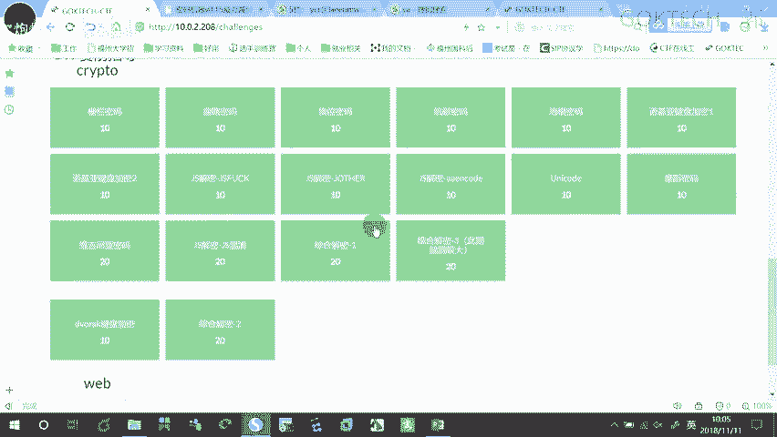

模式密码看到啊。他要求他有个文件要求我下载嘛。OK那我下载一下，没关系。😡，下载完之后，我们打开文件夹这个个TIT啊，我们右键用什么呢？啊，用我们的记事本啊，打开方式选选择使用我们的记事本就可以了。😊。

记事本打开。看到没有？他就有一串密文码，这什么模式密码嘛。哎，老有些人说问的，老师他这个模式密码怎么跟我不一样，我不是点斜杠点啊，点横点横吗？啊，点画点画嘛？啊，其实没关系，我们点击这个密码机器哈。

密码机器这个地方啊，看着啊这里有一个模式电码，对吧？😡。

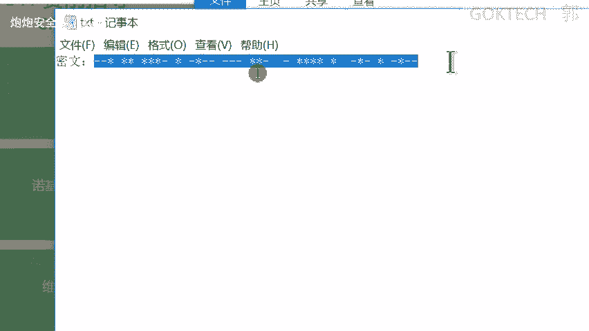

OK这里呢我们把这个东西先清空清空，然后粘贴进来。啊，我们这里的点就选择星号。如果它的它的密文点，它的密文这个点是什么？小数点，那你就写小数点。OK那我们这里星号就星号，然后话就是减号。然后呢。

那一般情况下字母间隔嘛，它你你你你发那个电报肯定是要间隔的嘛，滴滴滴滴滴滴滴滴这样子吧？对啊，那要么是使用什么斜杠来看呢划分，要么是使用空格，你就这里给它一个空格，看着啊，注意再看一遍啊。😡，空格好。

这样子就可以你嘛进行解密了。Give you the key。啊，那你复制复制进去，发现了不行，为什么你这里要多一个空格？该控还是要控的。

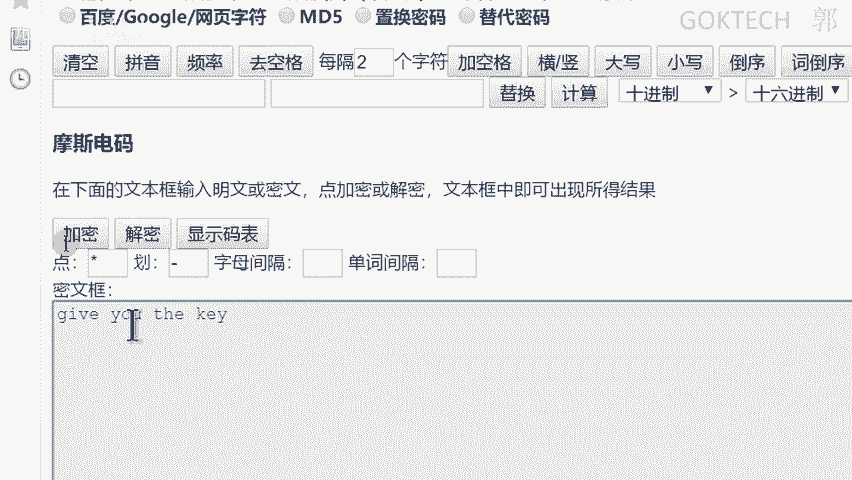

要去猜测啊要去猜测。啊，这些其实都是算是比较简单的啊。

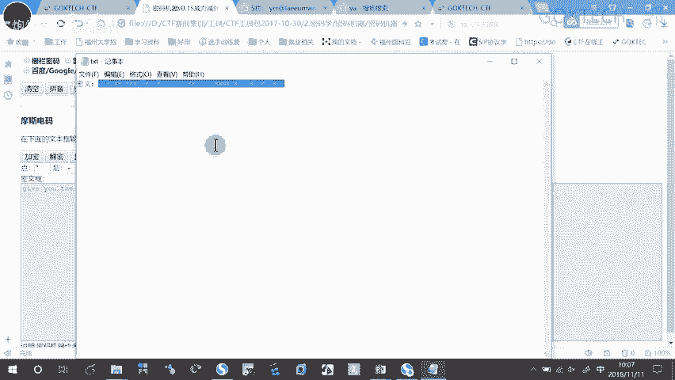

怎么说呢？就是它容易破解啊容易破解。

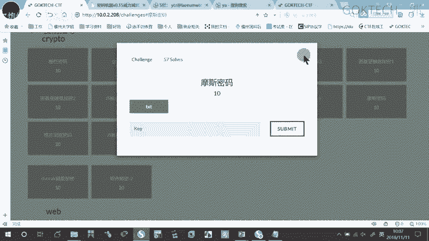

如果难的话，可能要要求你研究算法。啊。ok。那你比如说这种什么JS的哈，JS混淆的，就是它本来啊你看到。😡。

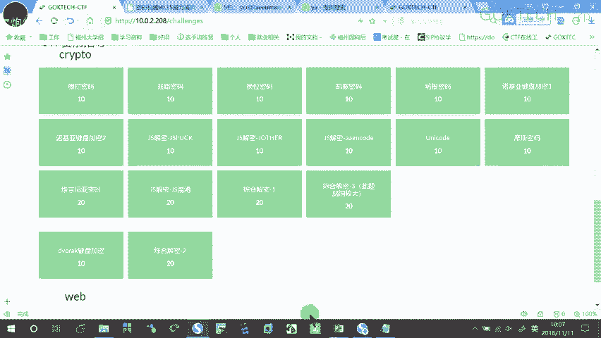

它本来这种我们是怎么显示这个页面呢？本来就是用一堆什么这种。😡，就这就这种它本来就是这种页面，就是这个用这种程序写的嘛。那它是怎么显示出这个图这个页面，就是这种图形化的页面呢？

是因为我们浏览器啊可以自动去进行编译啊，把它显示成这个图形化了。那好为有些人就为了保护它知识财产。

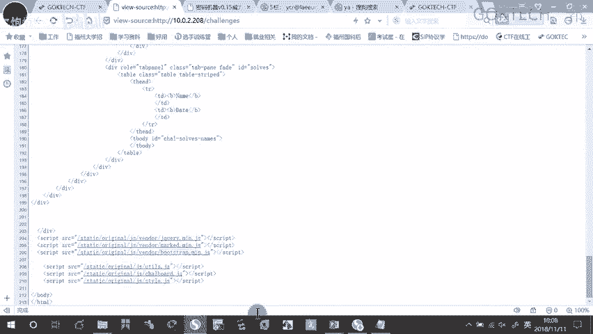

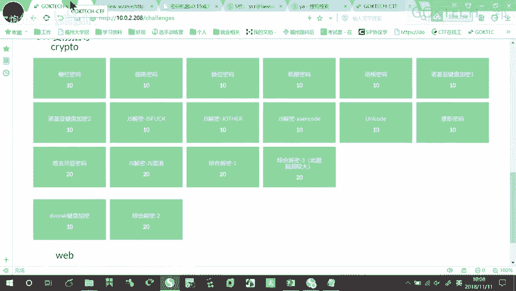

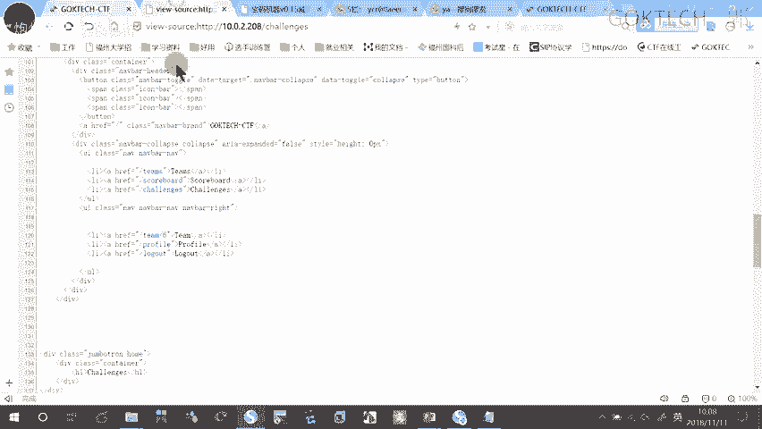

为了有些人就保保护他知识产权，不要这个你只要有代码基础都看得懂。😡，他为了保护自己的知识财产，他怎么说呢？看着啊。😡。

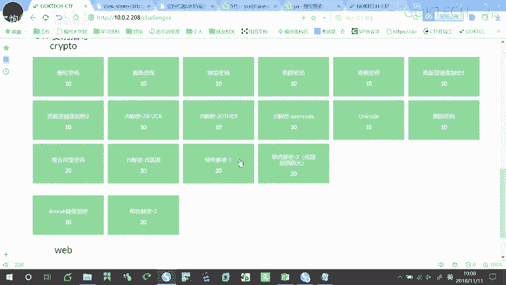

他就把自己的东西变成这样子的格式。这样的格式啊，你看不懂，但是呢浏览器一样的可以解析复制一下。跑到我们的火狐浏览器，上次可有让你们装，没有的话，你们参考一下我那个呃浏览器的一个。呃。

按这个上次呢我发了一个那个文档嘛啊。还有印象吗？上次我发了一个文档叫什么来着？找一找啊，被我拉到这个。里面的啊。稍等一下。就这个地方吗。这里有一个火狐浏览器的安装，稍等一下。你要是不带位的话。

参考一下我我我这边做了啊，我这边做了OK啊，那我就不多说了，来看一下复制一下。😊，就安装火的吧，你火狐的时候，你们可能还不太会用是吧？首先你要打开一个网页，就是你务必要保证你是打开一个网页的。

你不要在空白的地方，你不要是一个新建标签了。你首先你要保证你打开一个网页了，你就算是我们的CTF平台也可以啊，我们的一个平台也可以，只要打开一个任任意的网页就可以了。然后调用我们的调用我们的一个控制台。

我们的控制台怎么进啊，看到啊。😡，conttrol到F12F12说错了。F12。啊。F12。那我这个地方还得按那个按那个FN键哈。F12，只要你能把F12调出来就可以了。因为我们的F键。

你仔细看一下你的F键，其实每一个键都有两种功能。😡，你看一下，要要么是哎，比如说F1啊，要么是F一键的功能，要么是什么？我像我这边的话呢，我这个就是什么呢？静音，我这个按你一下是静音。

那说明我单独按一下，就是它下面这个图标的功能。那如果我要使用F1的功能，我必须加1个FN。😡，对。组合键啊，你不要连加号也会敲进去啊，这是组合键啊。😡，OK调出F12之后呢，看一下底下底下有个控制台。

我们点一下，点进这个控制台，下面有一个什么粘贴的一个栏，你看这个东西粘贴上去，回车就可以了啊，回车就可以了。😊，他就会把这个密码提示在这边。如果他不让你粘贴，他需要你敲一条alalpaing。

它会提示你的啊，这里我就不多敲了啊。😡，Okay。我再看一下啊。

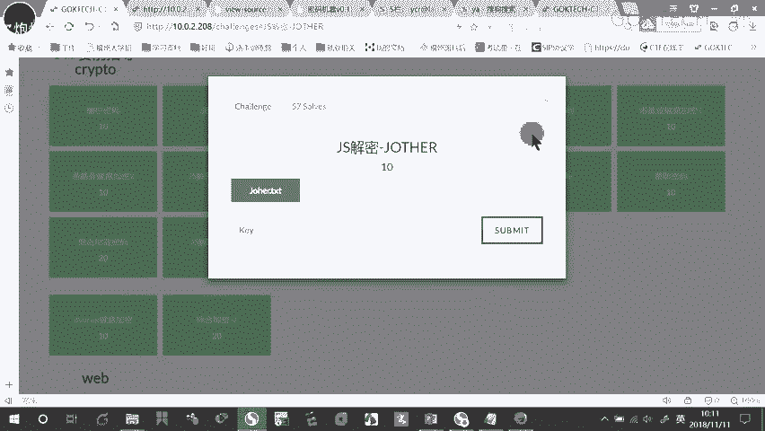

其实有部分的话，我上次课已经有稍微提了一下了啊，那接下来大家做一下实验。啊，就是接下来时间给大家做一下实验，不懂的直接问啊OK那我们先到这边。

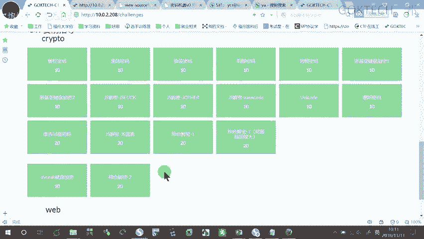