# CTF培训网络安全基础入门 - P17：（18）杂项：压缩+流量（最后命令手敲才可以） - 炮炮安全 - BV1mT411q7qB

啊，我们上课了。😊，呃，有一个我要提示一下哈。😊，呃。你们这边的话，像这一题啊，这个F5这个引写的啊，就是加密了图片加密的。然后我要去解它解密的时候，当我识别出来这个图片是是我们的1个F5加密的时候。

我用F5去解密嘛，我用去F5去解密的时候呢，它这边呢需要我调一些参数哈。

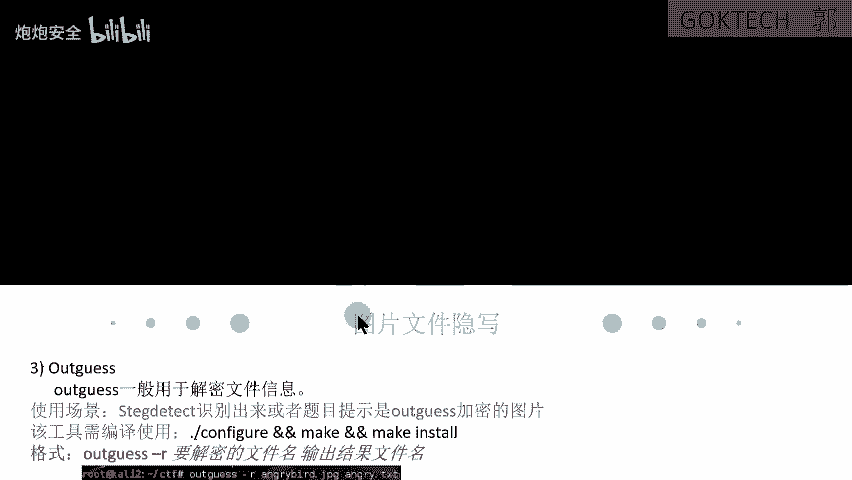

只要我的就这个嘛，F5是用我们的个java环境来做的啊，那他需要我们把这个环境面量给它调试清楚了啊，调试清楚了，就这个地方啊。😡，java这个环境啊呃有很多有有部分同学可能他做不了啊。

应该是他的一个环境变量啊，没有设置好啊，环境变量没有设置好。O我这里再强调一下啊，我之前翻的时候可能。😊，呃，不小心翻到了哈，也不是不小心啊，就是刚好就恰好就翻到了。😊，稍等一下啊。就这个。就这个啊。

就这个啊这个黄金面料呢呃我详细看了一下啊，可能还有稍微有点问题了哈。我给你们看一下啊。稍等一下。就到这里哈，首先class。😊，pass要有一个呢呃就是这个libber的嘛。

libber的这个这个这个库哈，这个库这个路径。还有一个是dva的一个home是并啊，这个bin啊，跟我们的1个PPT还是有点出入了哈。然后呢pass呢这边的话呢，我们要编辑一下。

在这边呢最底下这边应该是JDK的这个路径啊，它总共就需要有这么几个嘛，第一个就是JDKJDK这总的路径嘛，对吧？还有底下这个文件下面有一个bin，还有一个libary啊。

这个lib这个地方呢跟这里有点出入哈。😊，就这个地方啊。这个pass应该是。应该是这两个互换了哈，应该是这两个调一下才对啊啊，那这样子你调好调好之后去去做的时候就没有问题了啊，去做的时候就没有问题了。

就命令可以正常的使用了。OK。再来一个啊，就这个这个这个这个哪来着？前面这个。这个。啊。哪里来着？之前有一个退不出来的一个软件哈，退不来呃退不出来这个软件哈，那可能还要重新重新重新下载个包啊啊。

重新下载个包啊，这个地方啊暂时暂时还没有想到怎么做啊，就是它不是死活拖不出来嘛。我对啊，不是就用任务管理器就可以强制把它关掉嘛，不是强制关机啊。😊，啊。好，现，在我们讲新课了啊。

不再做复习了不再做复习了。😊，我不知道大家住了没有啊。😡，杂项的题目做了没有？如果单单是我们呃这边那个题目的话，量还是比较少的哈，就这么几题而已啊，关键是还要把这几个专针对于每1个PPT的。😊。

啊，要给大家啊好好去做一下。当然这个题这个PPT不是我设计的哈，这个是同事设计的啊，当然也是很用心弄的也好，大家一定要对对着去去去善待这一份啊。来，那我们接着再讲一下这个。😊。

讲一下这个压缩的压缩的早些年的时候，这个有一个地方叫韦加密。大早早些年的话，那韦加密考的比较多。韦加密是什么意思啊？就是说通常我们的一个压缩包是没有加密的。但是呢它把某一个某一个值哈。

某一个点的一个值把它改了一下，把它改了一下，然后改成让它变成是什么有标志的。比如说什么呢？什么叫有标志啊。😊，比如说是我们一般情况下压缩包啊，压缩文件一般情况下通常考这两个。😡，你压迪。还有一个是哎呀。

😊，一般情况下是考这两个也不会就超过这两个了啊。来OK如果是针对GIP的话呢，如果说加密的话，在每个文件的文件目录字段有一个专门用来标识文件是否加密了。如果说它本来是00啊，000就是没有加密了。

但是我这时候呢给它偷偷改了，给它改了一个非零的一个值。比如说01。😡，你那么那么这个本来没有加密的，他就要没本来没有加密的时候呢，你解压的时候没有任何问题嘛。但是你这时改了，你解密的时候呢。

他就要求你输，要求要求你把它输入密码，但是你又没有加密。然后这题的话呢，这种题呢称为伪加密。早些年的时候考的比较多啊啊，那刚才也说过了啊，为什么考的比较多为什么现在不考了呢？

因为现在我们的一个解压输入软件非常牛批。😡，它可以智能识别出来，你这边出了错。啊，然后自动帮你修复了，然后我就可以把它解压出来。啊，不知道大家还有没有印象，就之前的一道题。😊。

咱先找找找找找几两两节课前，两节课前。😊，有一个。冰work的那一道题啊。冰work的那一道题。啊，就我把一个文件要解压解压出来，解压成一个解压成一个压缩包嘛。呃，分离出来文件分离分离出来一个压缩包。

但是我要把它解解密的时候，他说要求我输入密码。但是我用第三方第三方的解压缩软件的时候，可以直接解开啊，OK。😊，所以遇到这种问题的时候呢，我们首先要尝试一下，就非常简单。这种题呢，如果说我发现了。

你看着啊，我们这边有题哈，等一下啊，稍等。😊，我把该删的该关的关掉。不是这，稍等。稍等一下。这里啊有一个伪加命啊。相比如说这个。DIP的这个包。我sh。算了一下。它这里面可以看得到一个key嘛。

但是我想把它打开的时候，它就要求我输入密码，但是密码我又不知道怎么办呢？😡，首先呢肯定要010去分析一下。怎么看了？😡。

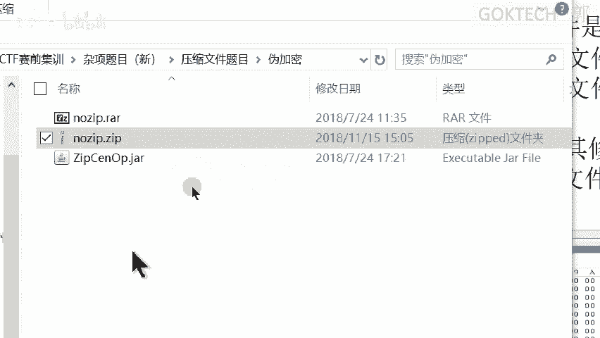

他要求我找这个什么固定的一个值，叫504B0102。记住了啊，不是这个0304啊，03004表示这是1个GIP的一个压缩包。我要找的是0102OK怎么找？😡，啊，设置fin。对，在这边。

有时候你们找的时候，你们这个选项一定要注意啊，有时候你要按看你要找什么什么东西啊，什么东西啊。😡。

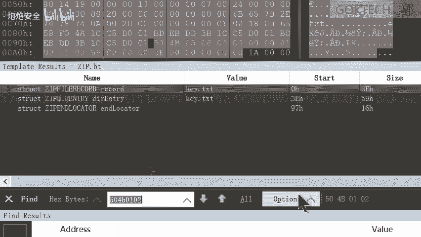

哎等下点出了。

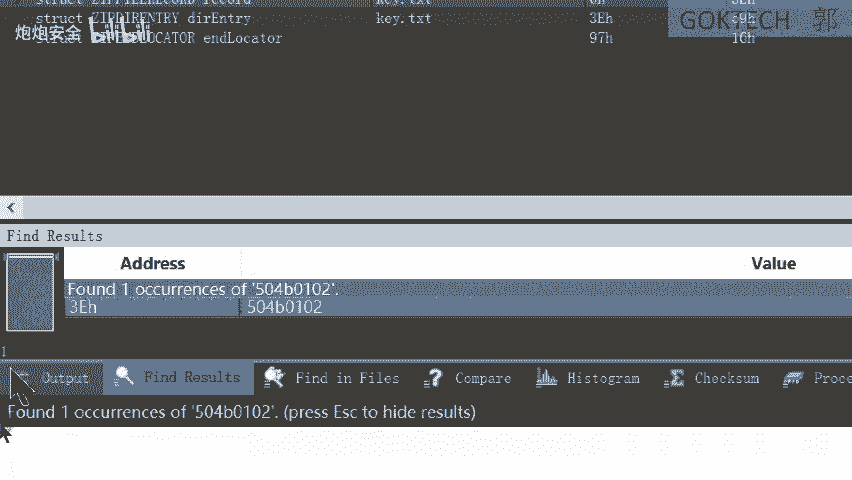

换一下504B0102啊，那对啊，对，就是这个啊，我要找他是吧？来。啊，刚才点错了，不是这个option啊，是这边这个哈我可以去查找它的一个16进制数啊，也可以去查找它ask码值。

你比如说之前我就教你们的，就比如说我遇到一个文件嘛，我先头尾看一下有没有flag嘛。那这个是出题人比较好心，就比如说在头面前面或者后面的部分给你写出flag，就算非常简单的。那如果说你想找关键字呢。

你就是在这边选中那个第三个选项嘛，就是这个ask码值嘛。然后你给它输一个flag关键字，回车看一下，或者CCTF的关键字或者key的一个，你看这个我这个。😊。

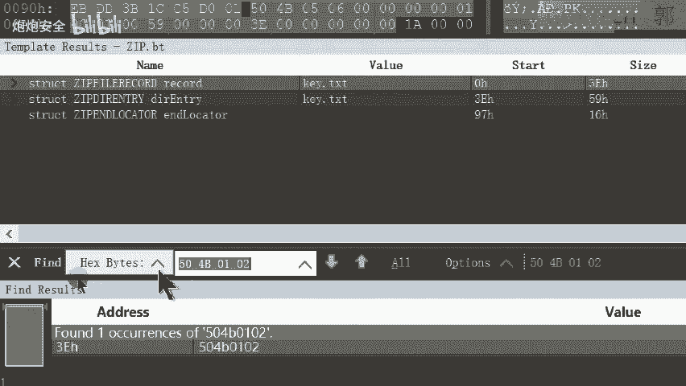

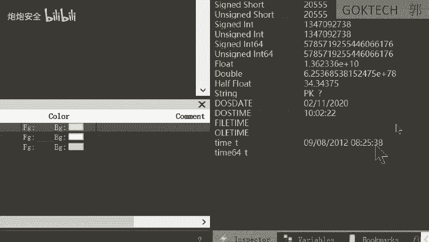

啊，或者什么啦。😊，flag啊、K啊、CTF啊这些都可以啊，反正满收一下呗啊，满收一下啊，满收一下okK然后呢，我这时候呢是收到504B030102嘛，然后从这个地方。😡。

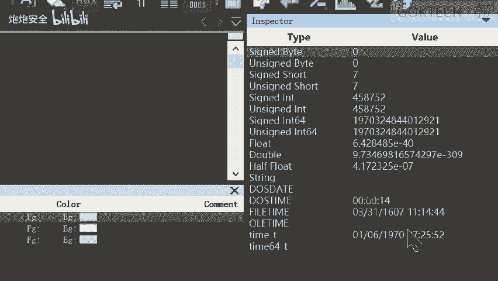

为什么我老是会动到这个？稍等一下。啊。从这个地方开始数啊。数什么呢？一个字节。两个字节。三个字节四个字节5678。只。10。九和十这两个地方啊。九和十这两个地方干嘛呢？给他的嘛修改为0。修改为0啊。

OK那我们改呗。就99的这个地方嘛，首先看一下我是可以我是插入还是替换啊。ok我是替换啊，00哎。撤销一呀。0000。啊，这样OK那我保存一下。保存。然后再去什么。针对他进行解压。解压。提取到这个地方。

啊，他会报错是吧？没关系。有没有一个key，有没有一个flag值？对吧。好，然后这里呢有一题。是什么呢？哎呀。IR具体我们来看一下啊，IR跟我们的格式可能还不太一样是吧，还不太一样。😊，他是怎样子的呢？

从。😡，哎，不是这个，这个是GIRP的。这个哎呀由于什么呢？有头部校验，所以说使用我加密打开的时候会出现报错，我们必须干嘛呢？😡，找到第24个字节，这这个IR是真的是从第一个第一个字节开始数。😡。

从这个第一字节开始数，往下数第24个字节，不用去看它具体是什么内容啊，大概是知道这个位置就可以了啊。然后呢，该字节的尾数啊，就这个地方。这个字节的尾数必须为零。什么叫尾数啊？它不是有两两个两个吗？

就是前面是那个高四位嘛和低四位嘛，对吧？就是看这个后面这个四位数，这个为零的话就表示没有加密okK这个24是怎么算的？你看到。😊，12345678，这里是8了。我是从这个第一字0表示第一个字节嘛。

12345678啊。😡，这一排是15嘛，8加15嘛呃一排是多少来着？我算对了吗？12345678941到这里是1516个嘛是吧，总共是16个嘛，0到15嘛。好，okK那这个是第八个，第八个我加16嘛。

是不是24啊？就刚好在这个什么七的。下面第二行就这个80这个地方啊，那我们来看一下这个地方啊，这个I2的对不对啊？这里啊。

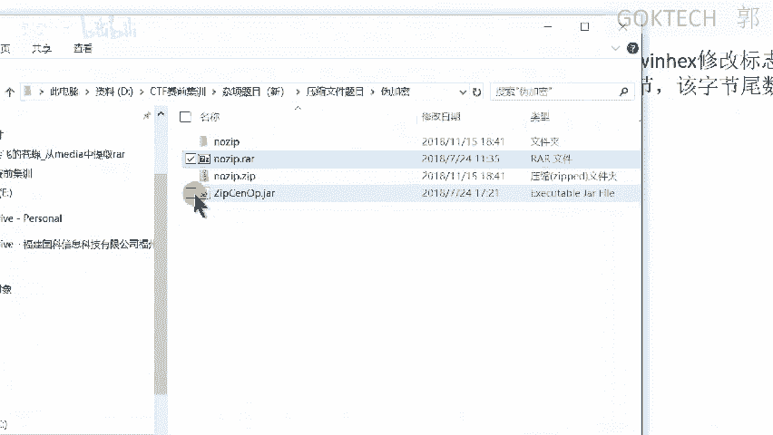

反正不管怎样子，我先干嘛给他试一下嘛。😡，在期往下这个地方，对吧？对吧那我要改把它改成零嘛，10嘛，对吧？😡，我这是替换的嘛，看得懂吗？O那我现在保存啊。😡，没什吧。

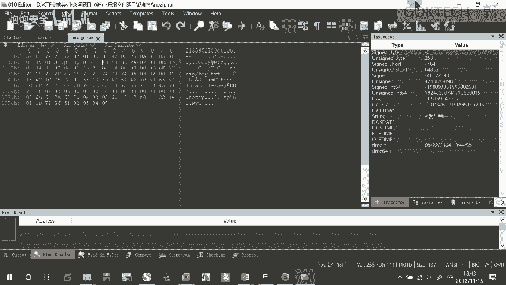

老去解密解啊。我把这个删掉一下。解压到这里。这时候他是报错了，为什么会报错？是我做错了吗？😡，好像是是吧啊，没有。如果说我改了它的值。😡，他还报错，那说明这个包是真加密，而不是伪加密。明白我意思吧？

那你就要从其他地方导到它的一个值啊，所以说这个地方啊。要改改回来嘛。OK那我们继续。啊，有些时候呢你遇到这种情况，你就必须用暴力破解的方式。啊，暴力破解方式，而且呢暴力破解的话。

它或多或少都会绝对会给你提示的。比如说这是一个什么几位的一个密码。😡，如果是10位的数字的话，非常好算。打比方，如果你密码是10位数的，而且是10个什么呢都是数字组成的。

破解的时候还是蛮快的那如果说是数字加大小写字母，再加上一些常见的特殊字符，那你可能算一天都算不出来啊，一般情况下它会干嘛呢，比如说啊他会给你提示说前面的部分，前面5个5个5个密码已经告诉你了。

他要求你算后面的5个密码，那这个也是OK的，这也是OK的。我们来看一下这个暴力破解啊。😡，来。这里有个暴力破解啊。那那我们现在把这个工具给它打开啊，稍等一下工具。在我们的CTF工具包里面。

杂项啊压缩包破解工具。这里有一个什么第1个AAR的这个啊，这个安装完安装完安装完之后呢，给它打开就可以了。ARCARCHHRHPR的这个软件。啊，首先呢打开。打开我想要去破解的暴力破解这个。😊，压缩包。

比如GIP。啊，比如说GIRPOK那我去跑，有时候呢它自动就开始帮我进行进行运行了，就自动已经帮我运行了啊，那OK那没关系，我们等它就可以了啊。那如果当它怎么样呢？当它把这个密码给它破出来之后呢。

它就会弹窗啊，它会是弹弹出来，弹到我们这个页面上就可以了啊。那这样子我们就算完成它的一个破解。😊，啊，有时候呢它比较比较比较快啊，像这种这种密码的话是非常简单的非常简单的那我们直接把它复制啊。😊。

粘贴到他该去的一个地方来解压是吧？要是输入密码啊啊，回车。啊，就可以。解压出来了，解压出我们的一个T一样的是这个啊，记住了，像这种flag中间是没有空格的。😡，这里呀这里是没有了啊。😡，啊，这是规定啊。

啊，这里这种这种是不能有空格的，你提交的时候就没有空格了，我就里面了啊里面是没有空格的啊，要注意啊。OK这个比较简单。来我我们来简单看一下这个程序有哪一些东西啊。😊，程序来简单看一下。

它有针对这种这种攻击攻击类型啊。你比如说暴力破解，暴力破解，其实说白了它是有字点的。什么叫字典的？就是我事先把一堆的密码，我比如说我知道你是数字的嘛，我知道你是数字排列组合的那我就是用写出一个什么呢？

啊，用密码机器或者其他的工具写出一个数字数字组成的一个排列组合，然后反正弄在一个TIT文本里不断不断的去破解嘛。O这个是叫暴力破解。那一般情况下呢，这个软件它是有自带的一个字典的。

如果说这个字典不够强大的话呢，我们可以自己自己手动导入一个字典，用自己的一个万能字典。比如说打个比方，自己导入一个万能字典去去给它暴力破解。这也是没有任何问题的。好，再来。😡，比如说我要选择暴力破解嘛。

来看着啊。😡，这里要勾选你暴力的一个范围。你比如说你是纯数字的那这种是最好破的啊来。😡，再来一个长度，就是口令的长度啊，口令长度就是最小的口令就三位，就是说它只有三个数字来组成的那这个是最简单的啊。

有时候我们口算都可以算得出来。😊，啊。然后呢，8位呢。它的一个范围就是3到8，你也可以什么直接8到8，就是就说你认定了这个总共有8个字符嘛，那你就按八来来来让他跑就可以了。OK。😊，啊。

字典可以自己导入。啊，有意思的是这里有一个啊叫野马的这个野马是什么意思呢？啊，我们来看PPTPT写的讲的挺好的啊。😊，比如知道密码前三位是ABC，后面三位是数字，这是前提。这是前提。

那么我们就可以在攻击类型的时候选择掩码，并且在掩码的地方写入什么ABC前面三个位三个数字，然后后面干嘛给它进行一个暴力获解？😡，啊。那这样子的话就可以进行破解了。你们有没有有没有用过那个动态令牌呀？😡。

我知道了一个令牌是这样子的哈。就是。以前在绿蒙的时候用过啊，它是怎样子的，就是登录它的一个账，登录它的一个内部系统的时候，前面是什么呢？前面是你自己的一个固定的固定的密码啊。

固定的密码要求有一定的复杂度要求了，并且两个月要换一次。😡，换完之后，你还不能换回原来的那个。但是呢这个固定密码你输进去还是登不了了，需要干嘛？需要有个动态令牌。这个令牌呢造价去说还不菲啊。

一个成本价都挺贵的那反正呢是嘛？它会不断的去产生密钥嘛，就产生比如说4个数字。😡，四个数字，这个是实时的啊，它就是说我自己有一个小的令牌嘛，就是小了一个类似那种，它就是有一个小牌子嘛。

然后上面会显示数字啊，每次时刻都在运行的。然后跟我的总部的跟总部的一个服务器呢，他们是同步的，同步的，我实时在运行这个啊，它主要贵的是密钥嘛。然后呢，比如说这一个时间我去登录的时候嘛。

它每分钟每一分钟更改一次。😊，就比如说我在这个分这一分钟内哈，我把这个我产生的数字是2348。😊，那我就把这2348放在这个固定密码后面。然后去登录，这样就OK了啊。当然了这个如果说当你呢。😊，怎么样？

当你比如说固定密码是被泄露了，然后呢，只不过想要知道主不过不知道动态密里面有令牌嘛，那你也可以暴力破解。但是呢一般情况下暴力破解最怕的是什么？😡，最怕的是限制次数。怎么样限制次数啊？

就你输出了三次之后呢，就要等等几分钟嘛，那最怕的就是这种来问你一下。😡，这种无线它有次数限制吗？😡，无线了。无限，你输密码有次数限制吗？啊，像这种的话，它是只只要密码就可以登录嘛。

那如果说你们学校可能还要输入用户名和密码。😡，对吧或者学号和密码对吧？okK那如果你想用学号来做暴力破解的话，你可能马上会被被抓了啊OK然后呢第二个就最怕的就是验证码。😊，对吧哎挺挺有意思啊。

还记得那个12306嘛，之前就为了防止别人来黄牛来那个刷票嘛，所以说他出了各种很奇很奇奇怪怪的一个验证码。然后现在现在你们可以去登一下，12306已经改版了，还挺酷的啊。😊，啊，就是我们可以看一下。

我我也还没看过啊，只是刚好想起来。前段时间再说啊。哎，1234这么贵。12306是吧？还可以吧。啊，我不知道你们有没有登过这个页面啊。😊，哎，我最早的时候是登登这个页面来买票了啊，还可以啊，还可啊。

以前是这边就丑丑的一个几个几几大新闻条啊，几个下面几个什么什么重点信消消息，现在还可以啊。😊，只要花只要花钱，没有什么搞不定的。😊，啊，来这个是野马的啊，还有一种啊。😊，叫铭文啊铭文这个地方比较有趣啊。

😡，铭文这个地方挺有趣的。😡，就是呢他。😡，这个题目给你两个两个东西，一个是压缩包。😡，一个是1个THT文本，打个比方，就THTHT文本本身就包含了。😡，本身就包含了密钥的一部分。

那你要选这里要选一个什么，你把这个压缩包选中嘛，然后呢这个地方选铭文。😡，灵文的攻击方式，并且呢把要把那个TSTTST文本给它放到这边来。😡，TST文本也是作为密钥的一部分，你放到这边来，然后进行破解。

😡，进行破解就可以了啊。ok但是呢它没有那么没有那么那么简单哈，他需要这么做哈。😊，はい。铭文攻击只知道加密的GIP中部分文件的铭文内容。啊，明文内容应该叫是明文内容哈。😊，利用这些内容推测出密钥。

并且解密。就它要有一个规律嘛，找规律嘛，怎么样子做呢啊，它是这样的。他比如说你这个是TSD文本是吧，你还是要把它干嘛呢？啊，我们来看这个例子啊，这个例子比较比较特殊啊，比别较好看了。

一个加密的压缩包中有两个文件。😡，啊，flag内容是我们需要知道的，但是它看不了。现在呢我怎么样了？read me我可以看得到，我可以看得到这个readd me我可以看得到。

那我就要用这个read me干嘛呢？😊，前压缩一下。为什么要压缩啊？😡，这个这个铭文这个铭文文件必须压缩，为什么要压缩呢？就是为了让它跟这个什么原来的压缩包，我要破解这个压缩包干嘛呢？格式一样。

什么叫格式一样。你们一般情况下，你们去压缩一个软件，你们会看什么看什么参数啊？😡，给你们看一下。你们还看什么团数？来这里有几个参数啊。😊，第一个叫什么？😡，压缩的格式。就是后缀名啊后缀名啊。

你比如说就好比如说你的那个有IRGIP的。😡，啊，还有什么TAR的这种，这个是压缩的格式。最重要的是这个它最最厉害的是这边压缩算法。😡，压缩的方法，目前已知的话呢还是这个比较牛批LGMAwo啊，当然了。

这些都不是关键，关键是在这个字地方质点的大小，质点越大，它压缩效率越高啊，你看。😡，压缩的时候需要的内存多少G啊？😡，这里7个G。也就是说我选这个字点选出选那么大。

它是需要77个距来压缩的那比如说我选小一点。😡，你看它就小了。这里就变小了。那一般情况下呢，我我的我的内存比较大，所以说我选到128都没有问题。😡，啊，那这个单单词的大小我们先不看，一按默认就可以了啊。

默认就可以了啊，主要是嘛看这个地方啊。😊，呃，主要是看我们这里有几个哈，你比如说这个压缩的等级啊，有个什么stone啊，还有什么快速的啊，80stone啊，啊，这个叫stone啊。😊，啊。

storage的那个store啊，torage的那个store还有什么快速啊，极速啊，标准啊，最大极限啊这种啊，那我就要干嘛了啊，这个例子啊，例子这个上面的例子还不是不跟啊还不是用我这个弄的哈。

我看一下有没有啊。😊，还没有啊啊，有有在这个地方在这个地方哎，看到没有？它的一个压缩算法哈，这边啊原来我是怎样子的啊，那我就要把铭文的那个东西加密成啊压缩成什么样子的一个算用什么算法给它加密。那这哎。

我都语无伦次了。😊，现在呢我是有一个压缩包，压缩包里面有一个东西是密文嘛，就flag的那个嘛，是我看不懂的嘛，我需要我需我需要去破解它嘛。现在呢我有一个什么我看得懂的readread me。😡。

readread me，我看得懂的那这个东西呢我要先把它。😡，压缩一下，跟我原来的压缩包一样的方式给它压缩一下，压缩成。比如说算法要一致嘛啊，那压缩完之后呢。

把这个这个包这个压缩包放到我那个铭文那个地方。😊，啊，这个先取消啊。放在我铭文的这个地方。然后进行开始破解啊开始破解。好，这一题呢也是什么呢？我们这个。😊，啊，群上的这一题啊，不对。

这个平台上面的这一题。但是呢这一题呢比较特殊，你用这个工具是破不了的。啊，你用这个工具是破不了了，就这个地方啊这个啊。

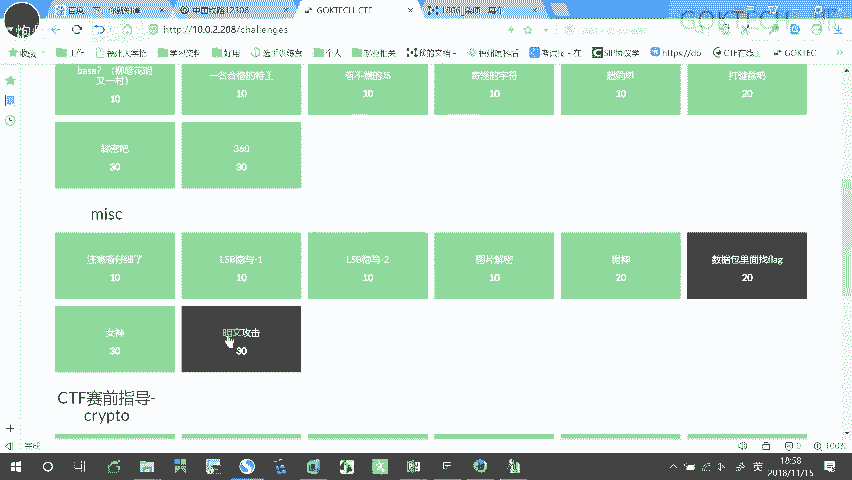

这个地方哈他已经说了，是已经明确跟你说了是铭文攻击。你用这个东西。😡，是破解不了了，必须用另外一个工具，那我到时候也会传到群上去啊，我之前不知道有没有传过啊。

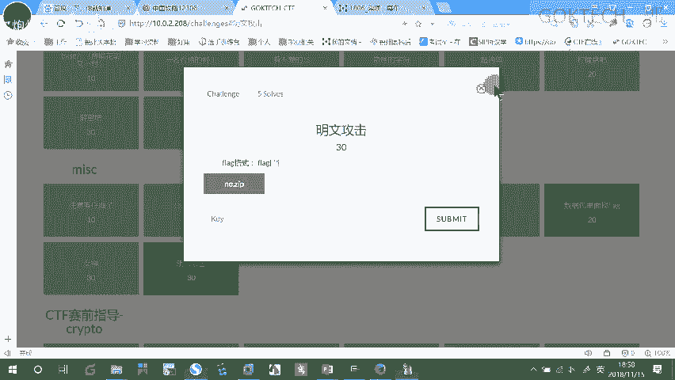

O。啊，我们来看一下。啊，铭文啊。铭文的话呢可以可以自己写啊。有时候啊你看着有时候他是不是跟你说口令没有找到啊，没有找到怎么办呢？但是他可以找到到什么加密的一个密钥，能够找到加密密钥。

可以直接将这个文件进行解密。甚至有时候这个密钥就是我们的flag。😡，啊，这是我们的flag啊，那你点击确认，有时候你可以用这个密钥可以进行解密，也有可能有时候你可以这个地方就直接是密钥，哎。

直接是我们的flag了，都有可能都有可能。😊，这天人家已经写了哈，这个是什么压缩方法哈，还有什么压缩方式啊之类的哈，那我就不多说了哈，不多说了。😊，感去铭文攻击，可以去尝试一下啊。这题啊。

就看工具用的对不对了啊。像我给你们的这些东西，全部都有一个什么r up，这什么意思啊？😡，啊。这是答案呢。答案了看不懂的时候可以看这个。啊。

并且呢嗯因为这边今天那个流今天的一个你们去看你原来那个杂项题啊，杂项题目里面呢有一个什么压缩题目啊，压缩文件题啊，流量文件题。在最早期的时候，最早期的那个发到那个压缩包里面啊都是有read up了。😊。

比如说这个流量分析题啊，今天讲的这些流量3456，从3开始全部都是有呃那个right up的啊，那主要是让你们为了让你们好好更好的去回去练习哈，回去练习。那这里我就啊不多说了哈不多说了。😊。

这个可以看一下铭文攻击的，可以去研究一下啊，分机IR，我们来看一下这个啊这种课件课件上啊。有时候给出了IR文件的头部，各个字块会故意给错，就他给你故意修改一下嘛，导致你无法识别啊。

这个地方呢非常明显就在这个地方啊，来这里有个IR的一个包嘛。😡，我们打开一个普通的压缩。压缩包进去啊，里面刚好一个flag是吧？来，我们先给它解压一下。😊，稍等。里面有一个嘛，flag嘛。

哎我们来解解压一下，看看能能不能解压啊。😊，哎，可以是吧，blag是不？没错。😊，啊。呢边。你真的该听吗？你眼睛闭着对着我点头是。来。他说什么啊？Fraly is not here。那怎么办？

有一种方法啊，你可以尝试着把它放到你的flag里面试一下。😡，啊，当然一一般情况下没那么蠢啊，一般没那没那么蠢。它是怎样的？这种情况是遇到了什么哎呀，被破坏了，导致你这个东西没办法去显示啊。

没办法去显示，那怎么办呢？😡，啊，像我们这个包里面的，它每个字段都是有自己的意义的哈自己的意义的哈。😊，来，我们来看一下啊。压缩包我告诉你，我再强调一遍了。😡。

我们文件是不是一开开头那四个字节就是表示这个文件的一个类型嘛，但是因为在压缩包里面，它可能什么不一定前不明前面这字节就是你的一个文件的类型，它有可能要需要写一些压缩包的参数。😡，啊，我打个比方。😊。

我们先用010editer来分析一下啊。😊，526172721啊，自己去对照那个表，会发现它是一个I呀那个包，这个没有任何问题啊，没有任何问题。我们往下翻啊。😡，我往下翻了。看一下啊。这个地方在哪里？

稍等一下。一般情况下，我们要怎么找呢？我们要去找这个。😡，这是这里有一个值啊，这里有个值啊。😊，哎，我找一下。There is no呃什么鬼了？哎呀。看一下阿克码值啊，稍等一下啊。我搜一下吧搜一下。来。

我这时候呢是用阿克码了直来来来来来来来来搜啊。哎哎哎等一下稍等一下，不好意思。😊，我先搜一下啊。是这个吗？Flaag is now here。flag is not here，没错吧。就到这个地方。😡。

啊，就到这个地方。就听了。就到这个地方。fllaag is not here就到这个地方，前面的内容。就是我们这个TST文本。你看这里有flag点TST嘛。😊，fllaag is not here。

O从这底下之后呢，有可能应该就是另外一个文件。因为他已经跟我说不在这了，那可能还有一个文件，可能文件头被破坏了嘛，那我们就从这个地方开始。😡，哎，稍等一下。这个E是哪一个？E国给大选中一下。

E是65是吧，那A8。从A8开始就是新的内容啊，我不知道大家能不能看得清了。如果看不清的话，给我说一下这个A8应该就表示这个双引号了，那就是应该是算其他内容了。因为我们的1个TST文本里面好像是没有。

😊，没有什么什么什么特殊符号啊啊，所以说是吸E啊就结束了，对吧？那也就意味着什么呢？开头这三个字节，我们就开从A8开始开头三个字节，前三个字节就表示我们的有一定的意义。这前面三个字节有什么意义呢？😡。

来。😊，文件块的第三个字节叫做快类型，也叫头类型。一般有这么几个曲值。72。73。7475没了。没了。没有。啊，因为我们认为哈从它应该包含的另外一个文件或者多个文件是吧？

所以说我觉得它有可能就是什么是一个新的什么文件。😡，也就意味着我认为这个值应该是74。那我这时候呢把拿了一个7，它这个第三个字节是什么？😡，7A对吧？那我就觉得我有必要把它改成什么74。

74把它改成74OK改成74，我们保存一下。这时候我再去看。😡，这个包。我先把这个删掉啊。这是解压。就有了一张。图片对吧？而且这张图片。嗯。这张图片你看得懂吗？

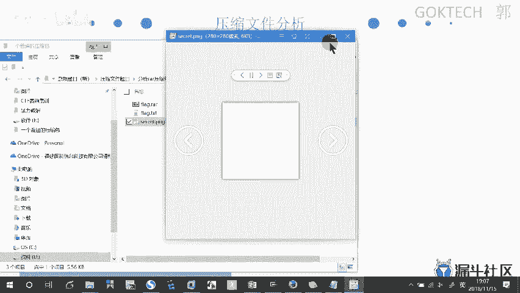

还看不懂是吧？而且我还要进行进一步的一个分析，进一步的一个分析okK。😊，来，往往有时候我再强调一遍，往往有时候呢压缩包只是题目的一个载体。他为了让不让为了不让你。😡。

就是为了说不让你更轻很轻松的得到这个这个想要的得到的那个题目啊，他有时候针对这个压缩包进行一个处理。那导致比如说给给你来个维加蜜啊或者其他的啊OK那我们要注意小心啊。OK。😊，好，接下来讲这个。啊。

流量的一个取证技术。啊，举证呢有很多啊。取证有哪一些呢？取证最简单的有什么几个啊，来内存取证。😡，硬盘取证。主证。硬盘矩证这些都是算是存储矩证啊，也是比较难的。存储举证啊。那如果说是什么？

相对流量的话呢，就相对来说比较简单一点。那上次课呢我们简单的对流量啊，之前那个课简单对流量做了一个简单的一个讲解。那我这时候再强调一遍啊，我们来看一下啊。😊，这个工具叫什么？拜呀。啊，我要上。

我要上克啊。

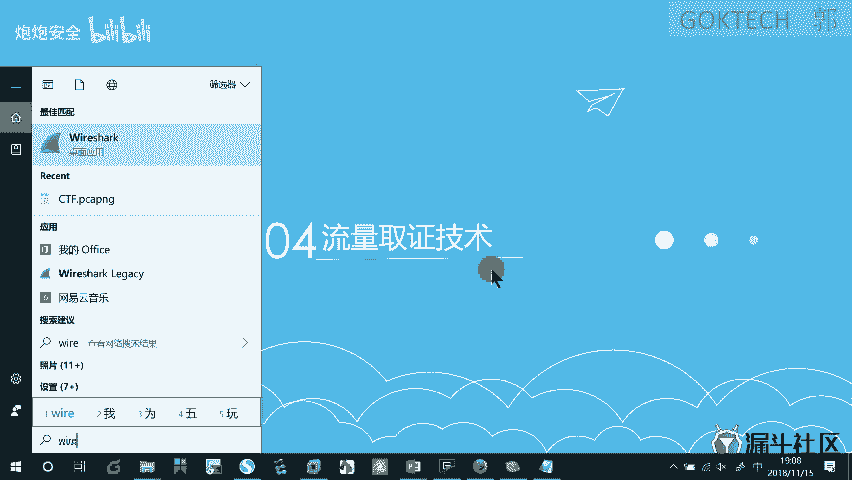

我要上课，不是firefox啊。来，这个是中文版的，我之前给大家传的也是中文版的啊。来首先这个页面呢，它这个地方哈。😊，他可以抓我们的网络。比如说我们的无线。啊啊，对我现在用无线嘛。

所以说它有流量在跑嘛？看着啊。😊，啊。OK这些全部都是哈来，还记得我们我讲我我讲过了，他是怎么看包呃，怎么看这个流量，怎么看这个包纹啊。首先第一步看什么。😊，霸纹牛5元组嘛？还记得吗？忘了是吧？

我讲一下吧，原来IP。😡，目的IP这个是原地址和目的地址啊，这里已经提示的很清楚了。原地址和目的地址，它有时候不一定是IP啊，有时候是一个什么呢？mark地址，什么叫mark？😡。

mark可不是你们那个苹果电脑哈。😡，这个是物理地址啊。😊，物理地址这个嗯可以这么说呢啊，mark地址的话是全球唯一的，你任何的设备都是要有。😡，mark地址，这个叫硬件地址。

只要你任何设备出来出厂的时候，它一定会烧录这个硬件地址，这个地方没办法改啊，这个地方没办法改，而且呢它是48位。知道是48位意味着什么吗？😡，二的48次方知道多少吗？算不过来了。穿不过来了。

如果是32位，就是我们的IP地址是32位了，二的32次方刚好是接近。40亿左右40G40亿左右啊，忘记多少了啊，我们来看一下CALC啊A。😊，是ALCLC。我们看下这是计算器啊。爱的。32次方。对吧。

这个是IP地址的啊，43亿左右啊。43例嘛。啊。OK那如果这个是IP地址的IPB4的一个范围啊。如果是二的什么。😊，48次方。对吧二的48次方，你会发现呢啊这个地方哎我们看一下一个。两个。

三个多少告诉我多少。😡，我也不知道啊我也不知道。啊，我也不知道啊我也不知道，也就意味着它肯定够用了，并且它是怎么弄的？它。😡，它前面呢是代表什么呢？前面24至24位代表公司。😡，在哪一个公司。

就是他前面比如说固定给。固定给你你这家厂家啊，你这个厂家，你比如说你生产的是什么，生产的是你比如说英特尔了，最简单英特尔，英特尔它不是生产CPU的吗？啊或者生产主板啊这些嘛啊当然它主要还是主主营业务。

还是。😡，服务器电脑的1个CPU嘛，在那个种小型小型的一个环境，它是它是没有市场了。你比如说那种就是就是什么。😊，这个叫什么来着？呃，移动端移动端他移动端，你会用英特尔的CPU吗？😡，咱们用的是什么？

😡，你要么是高筒吗？要么是用什么阿姆嘛，啊，要么用联发科嘛，要么用海思嘛，对吧？OK。😡，哎。来那一般情况下，我我呃我要s就会根据这前面24个比特识别你是哪一个厂家。然后后面这个24哎，我看一下这个啊。

😊，24应该是3824三个三个字节嘛，123三个字节没错啊，它就根据后面这个前面这三个字节是表示公司嘛，后面这三2后面这个三个字节就表示公司里面的产品。😡，啊，那你想啊二的24次方已经是非常大了。

你跟一家公司不是不可能用这么多的产品呢？😊，假设他生产出了这么多产品怎么办呢？把原来的。😡，最早的那批产生的那一批给他他嘛淘汰掉，然后我用给我新的用就可以了啊。

OK有所以说呢我们一般情况下看言和目的以及我们的一个协议。😊，协议。啊，还有什么呢？这个是长度，我们不看了，协议协议完之后呢看什么呢？😡，随便点一个包啊。

这里面每一个都是一个每一次都是一个发去发出去的一个流量啊。我们随便点一个包哈，里面呢有包含呢我们的一个什么呢源端口和目的端口。😊，端口号啊是一个端口号，端口号是识别一个服务的啊，什么叫识别一个服务啊？

😊，比如说我电脑有蓝牙。😡，我发射出来要给我这个耳机来连，我现在带着个耳机，因为我这个耳机带着是要为了收音，不然的话走我走到中间，这个录屏是收不到声音的啊。我跟他的一个通信。

其实也是要有除了有蓝牙的协议，其实也是要有端口的啊，要有端口给它打开，给它给它识识别的。OK来我随便来访问一个网站啊。现在的网站基本上安全一点的，基本上都是HTTPSS的。😡，不安全的。

比如这个这种就是不安全的。因为它传的所有的数据干嘛呢？😡，全部都会我来我来过滤一下啊，这上面是一个过滤器啊。😊，可以过滤我们的协议啊，我刚才访问了一个。2。208万，对吧？2。208嘛，对吧？O。😊。

那访问的1个HTB的啊协议啊，全部都在这儿啊，全部都在这儿啊OK。像很多现在很多网站哈。😊，百度、淘宝、京东这些全部都是HTPS如果没有S的话，你要你要小心一点，可能是假了。啊，可能这种这种是钓鱼网站。

来，我这些以前最烦的也最也也是，但觉得也挺不错的。这个软件啊，这个浏览器啊。😡，Can。谷歌浏览器。你比如说有一些网站，你访问一些网站没有带S的，他认为你有你这个东西有问题，他就会给你弹出一个警告。

高危网站。😡，啊，他就认为这个是有问题的。啊，不要随便访问。或者说什么以前那个12，因为这个点其实是其实说白了就是证书啊。😡，其实说白了就是特证书，用用那个SSL加密码，这是一个证书哈。

那这个证书肯定是要第三方机构才认可的嘛。你比如说什么呃一个权威机构，比如说CA这个不知道没关系。你比如说我们在中国它是怎么识别一个人的合法性。😊，你怎么证明你是你是你自己？😡，身份身份证是吧。

那身份证难道还是随便一个机构给你颁颁发了吗？😡，肯定不是嘛，派出所是吧，现在还这么天真的认为是派出所给你给你做了这个证是吧？😡，啊。对他只能只能开这个证明哦。他比如说你去办那个身份证。

他肯定是负责采集这个信息嘛，然后往往往往上面走往上面走啊，然后有一个质证中心。😡，质证中心啊不是智障中心啊，质证中心啊。呃，这边有一个办证大厅，那个那个全全大学生应该都在这儿都在这儿啊。

这个这个四大门口这边啊，你们谁你们想办证，比如说你们如果是省外的嘛，想要换身份证了，没问题的，在这边就可以啊。😊，就比如说身份证到期了嘛，到期了他也可以刷嘛。但是有时候你去办一些东西的话，他是办不了了。

因为他一看你这个过期了嘛，过期了，他还有那个词嘛，还有这个词可以刷嘛，那没有任何问题了。所以但是呢如果说你要办一些东西，他看你后面那个那个过期了，他就不不给你办。😡，啊。

还有呢你比如说你你那个去办完证嘛，办完新的证之后呢，就办完新的证，他下来之后，你你原来那个证要给他嘛，他会把你这个证给他剪断。😊，啊，因为你的芯片里面刚好就在那个地方嘛，呃我不知道你们有没有。😊，呃。

那个像这种的话呢，这种身份证的话都是都是要有权威机构了。那这里也是一样的，这里也是一样的。证书证书他如果说呃颁发这个证书的机构是非法的。你比如说12306哈，我我不知道现在改了没有啊。

以前我不说以前我现在不说以前的话，他是自己给自己做证书。😊，然后每次谷歌都会每次谷歌都会帮错啊。😊，现在的话，如果你们谁有谷歌的话，可以访问一下12306还行不行啊？😊，啊。

当然你要点点到那个点到那个购票那边啊，你访问网页，访问他这个网页没有任何问题啊。你访问这个网页没有任何问题啊，你只要一点这个购票啊。😡。

啊，你只要一点这个购票，购票在哪，我现在都不懂了。😡，让我看一下啊。😊，购买啊单程嘛，你比如点进来，如果是早期的话，这个要呃谷歌浏览器是可以直接识别出来，这个是有问题的。😊，用这个证书大概要这个数。啊。

小钱5000。个屁。逗啊。50天0。即真。他显示。很正常啊。这个地方可以申申诉了。啊，你是说平台是吗？啊，吓死人了。整书啊，兄弟。😡，而且这个是局域网的，没没什么好调密的。我随边我随便搞一张证书。

他反而会包包读哈。😊，我自己搭一个搭一个证书证书证书的一个环境，可以，这个没问问题。但是你首先要信任这个颁发机构嘛。😊，你就好比如说我们生下来，我们就认为啊共程那个那啥哈啊，对吧？😊。

好，我们继续往下了啊。😊，来。我们再来看一下啊。😊，这个时候有时有些时候呢，你比如说我们这个。😊，ICQ啊。诶。这个叫OICQ是吧？Yes。啊，你比如说我们这个OSICQ啊什么东西呀？😊，啊。

腾讯的一个这个是。这个是QQ啊，你比如说我们点到这个什么OSICQ这个协议里面，会看到我的一个什么。😊，这个东西。但是你放心，数据肯定是抓不到了。因为它是加密的，你怎么怎么才能看到这个数据呢？

你可能要导入一些关键的东西才能够看得到啊。啊，你不用想了啊，大家一定要写自自己心里要有点数啊，你在网上发的任何东西都有人监控你的，你别想了啊啊。😡，啊，这不是啊，这不是我的，不是我的。😡，好吧，是我的。

来。呃，我们这边可以演示一下，我访问一下，稍等一下啊。我来嗯不要这个。

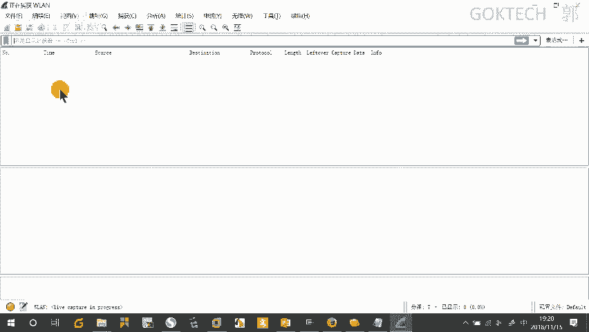

我去访问这个这个就这个。

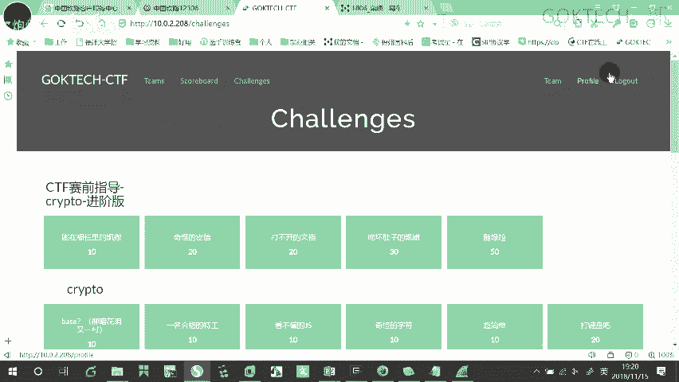

我先把它退出一下啊。刷新一下，然后我点登录啊。O。鱼。有抓到吗？有哈。你比如说我这边啊，你看我刚才是不是log out。😡，第一个包先看第一个包，我是不是刚才是不是先退出了？😡，这里是不是报告？😡。

对啦，好，退住了啊。😊，退出了，他给我返回一个退出成功嘛，他给我返回一个页面啊，给我返回一个页面，然后53是我嘛，53，然后我干嘛呢？啊，我提交了一个请求啊，这是一个pos的请求啊，是一个加过me的。

比较安全的一个请求，比较安全的一个请求啊，这底下呢是一个头部，头部之后呢，有正文，正文完了，然后呢，最后是我们的一个啊数据啊，这个是什么啊，看不懂的语言啊，看不懂的语言OK。😡，这是看不懂的啊。

我们看不懂的，这是一个提交表单哈，提交一个表单什么意思呢？😡，我刚才是不是登录了，就我要进行登录了嘛啊，我要进行登录啊，我要进行登录了啊这个。😡，1点53的我要进行登录哈，我要进行登录啊。

我用名额密码了。在这边呢，其实我看一下能不能看得到哈。好像也不行哈好像也不行哈好像也不行。😊，就是我们去访问网页的时候，有，比如说HTTP嘛，如果是HTTP嘛，它有两种，一个是get，这个也是一个请求。

有有两种请求啊，一个叫get，一个叫post。😊，一般情况下，get是比较不安全的。😡，啊，比较不安全的，它密码直接放在第一行，用户名的密码直接放在第一行啊，那pos的话相对来说就比较简单啊。

比较安全比较安全。

啊，那我这里就不多说了。O。你比如说我这个是HTTP的嘛，HTTP的话呢相当于什么呢？

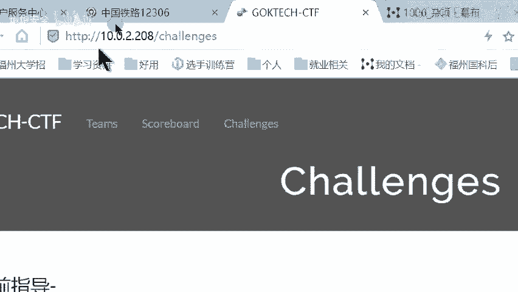

我们来强调一下，是这个10。0。2。208开放了一个什么呢？HTTP的一个应用，对吧？然后我个人电脑去登到它这个网页，没错吧，也就意味着是什么这这个什么这个2。208提供一个什么80端口，让我去连它啊。

注意啊，是这个该这个逻辑哈。😡，你看下我点第一条啊，你第一条这边有个端口号码哎。😊。

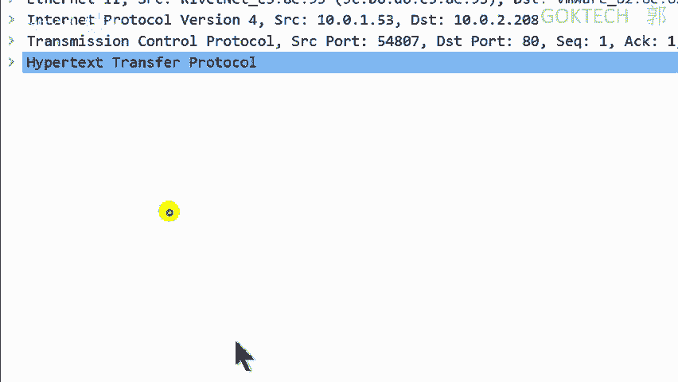

就是我使用一个随机的端口号去访问这个。哎，出了。去访问这个什么2。208的80端口，那这个是目的嘛，这个是目的。啊，这个是目的。

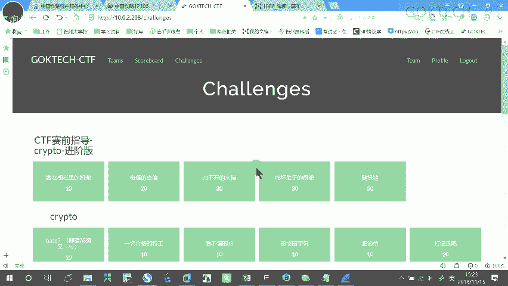

好，行。它有一些很多东西啊，它可以进行筛选了。那我们接下来往下讲哈，来VR下可的话呢，它也可以帮我们进行过滤哈过滤。比如说。😊，有一些常见的过滤方式啊，过滤方法啊看着啊。😊，如果有不生懂的地方直接提啊。

首先。我可以过滤什么呢？比如说我想看一下我发出去的包是哪一些，我想看我发出去的包是哪一些，我怎么办呢？😡，就要在那个过滤栏那一边啊，输入这条命令。就是语法。表达式啊应该说叫表达表达式或者叫语法。

也没什么问题。首先看首先制定我的一个什么IP的一个原地址是什么？😡，这个是等于的意思啊，一括 equal括哈等于什么呢？某个IP地址。比如说什么，我的IP是多少？😊，10。0。1。253嗯1。53嘛。

那我就要这样说，IP点sourcece。😡，依括。啊，什么呢？10。0。1。53，你看一下，我还没回车啊，因为这边还还会出现原置2。208的嘛，但是只要我一回车。它会自动帮我筛选什么10。

0点1点53为原IP的一个这个数据包，或者叫流量OK这个equal可以什么替换为等号。但是我告诉你不是普通的等号，而是什么？两个等号。😡，反正你只要看到它绿了就可以，不绿，它就是不行，语法就错了。😡。

啊。OK你也可以跟跟上一些逻辑算法，逻辑的语句。比如说哦。😊，比如说哦什么啦IP的一个什么啦。😡，啊，目标DST啊目标啊等于什么呢？10。0点。😡，2。208。我就要什么了啊，找出什么了。😡。

原地址是这个了，或者什么呢？目的地址是这个了。但是这样子的话呢，你会发现你看。😡，还是很没有规律。所以说我可以怎么把这个哦换成什么啦？😡，AND。这时候呢就变成了什么了？由我发起的什么访问2。208的。

😡，这个所有数据包全部都在这儿。全部都在这儿。啊。我再强调一遍哈。😊，我我打个比方。😡，比如我从网上要下载一G的小视频。😊，难道他是一次传到我这边的吗？😡，肯定是要分好几个数据包。没错啊。

我告诉你数据包呢大小是有限制的。😡，这里呢每一个数据包。😡，这里的每一个数据包的有效数字哈，有效数据说错了，这点每一个数据包有效数据都不会超过1500字节。😊，啊，我这里不给你们说什么。

加上各种什么头部哈，如果加上各种真头部，可以达到11522字节，但是这个我们没必要去算那么多啊，反正1500字节，你想啊。😊，你一个一句的小视频，你要。😡，传要传几趟。😡，对吧就好比如说我有一堆货物。

我有一堆货物，比如说100吨。100吨哈，然后我用一辆小车，这辆什么卡车什么一次只能在5吨的5吨的那个5吨的什么来？😊，知道吗？5吨的那个材料，那我是不是就要分分好几趟来能才能再玩。那打个比方。

比如说什么。😡，刚好比如说我。😡，刚好运完了，那就是刚刚好吧，比如说100吨。😡，一次能运5吨，那我总共要需要20趟嘛。但是如果我是刚好怎么了？我这边有6吨。😡，然后我这辆车能运5吨。你遇到你们。

你们会怎么做？😡，冒个险，把它装装满5吨啊，但是它这里没有啊，就是什么？你只要超过这个哪怕是超过一比特，哪怕是超过一比特，你也必须分两个包来，两个流量来发。明白我意思啊。

OK那我们在做这种流量题的时候呢，我也是把流量啊，我也是把数据这些流量干嘛呢？抓下来，然后组合起来进行分析了啊，组合起来进行分析了。OK那我们现在看一下基础的一个再再继续往下看基础的一个过滤命令啊。😊。

可以过滤端口。啊。什么叫做过滤端口啊？来我们的应用哈我们的应用我们的应用的话，一般情况下有两种，一种是要么是UDP，要么是TCP的一个应用啊。如果有学过网络，那就听得比较清楚一点啊。那没没有也没有关系。

我们做个了解。应用的话，基本上我们分为一基本上基于TCP或者UDP的我简单说一下它们的区别哈。😡，一般情况下我们去看视频。都是用这个UDP。比较快。因为TCP比较繁琐，什么意思啊？😡。

TCP之所以繁琐是什么？我要保证一个可靠性嘛。比如说我跟跟你跟你之间传数据的时候，我跟你。😡，通过电话或者做做什么，这个简单的来说叫三次握手，但是我们不管这个。😡，反正呢他要做一个前期前期准备。😡。

前期准备这个TCP比较可靠。你比如说什么超时，它可以重传。😡，超时，你比如说超时的，它可以重传的那来看到。😡，视频你们有没有遇到过我视频看着看着断了。😡，有没有，那是因为什么呢？😡。

这个UDP他不管他不管你有没有接收到，反正他只要只要能够数据能够这个命令嘛。比如说我要看一个视频嘛，我看我要看这个某一个某一个字段的一个视频嘛，那好我发过去，我发过去不不管你了。

反正你你要给我回回回那个数据回来就可以了，我反正发给你说哎，你给我发一个东西过来，那他给我发过来就可以了。他不管你说啊。😡，超时还是怎样的，他不管了，他反正只要你这个东西点进去，他就要给我送到位啊。

送不到位，你重新点一下刷新就是啊。😡，ok。😊，还有比如说啊。比如说它可以去什么锁定什么呢？我们的一个目标端口啊啊，比如说什么呢？我可以锁定什么呢？TCB端口为什么呢？😡，TCP炮。没错吧。也语。啊。

啊，少了一个小数点。没错，这个意思很好。诶。😊，80端口。对吧那就全部都是这些80端口。80档口，那你要区分出谁用的，这个是目的，目的是80，因为它是80嘛。好，到这边的话，就它就变成了原装口是80。

啊。区分开啊，因为我去访问你的80端口，你等一下，你肯定是用你的80端口来访问我吧。OK。😡，啊，这个呢比较生硬哈。来一般情况下，他可以么。😡，呃，单独过滤一个协议。

你比如说我要过滤TCP过滤UDP过滤ARP这些都可以哈。再再来讲一个哈。😊，我们常说的IP地址哈，其实如果你是这样，你IP。😊，IP等于啊，你给他家写1个IP等于什么？10。0。1。53。

这样子是收不到什么东西的。😡，为什么？因为IP是个协议。😡，IP是个协议，如果你只只是想收这个的话呢，你可以是什么IPcon。😡，包含。Containents。包含了某一个部分。

当然这个时候就不能再用啊。😊，不能再用啊，你con啊，就可以包含这个啊，1点53，对吧？你就不能再什么，你就不能再是随便拿一个瞎搞啊，因为它这个是协议。如果说你要具体先访问他的一个地址的话。

你必须点A那个呃SRC或者什么DST这些我就不多说了啊。😡，好，过滤mark那这个就比较难了，我就遇到了再说吧啊。😊，啊，还有什么长度？为什么？比如说我们从流量，我从这个流量里面要抓取什么东西啊？😡。

你比如说它有可能是传一个包嘛，传一个压缩包嘛，但是压缩包再怎么压缩，它是不是有时候都是比较大，有时候都是比较大了。所以说我要你么限定一下它的长度啊。你比如说我发我发现它是1个TCP的包。

发现它是1个UDP的包，打个比方，比如说这是TCP的包，那我就要限定它大于某个值。😡，大于某个值，那我就可以吗？把那个压缩包给它压去挤解出来啊，解出来。😡，嗯，OK啊还有一些啊。

你比如说什么最常最常用的是什么了？😊，比如说我们我刚才已经讲了HTTP是不是有一个get请求啊，一个pose的请啊，在里边。😊，get请求po的请求，你可以把它的一个什么请求的方式啊。

请求的方式给它干嘛呢啊，给它过滤出来，或者说什么，或者说你HTTP你看到。😊，我比如说来搜1个HTTP啊。我随便点一个啊随便点一个包，比如说那个HTTP里面。😊，这些数据里面它有可能就有很多东西。😡。

那我只想查找某个关键的东西，那怎么办呢？我就要用这种方式啊。😡，把包含。get或者HTDB斜杠一的这个HTD包给我显示出来啊，这个是它版本啊。😊，而且有时候呢一些HTTP啊，它就包含了这个flag。

包含了key，包含了其他的东西都有可能啊都有可能。😡，好，这个是刚才那个简单的用法啊。那我们来讲一下。😊，ok。😊，来。我们来简单讲一个题哈。😊，这个东西呢比较拗口啊。

大家没有没有网络基础的话也没关系啊。啊，简单来说一下，我们来看一下这个流量分析题啊，这里有总共有1到12题。😊，但是呢这些题。这两个是为了让你看一看就好了啊。你比如说什么这个SMTSMTP啊，说错了。

SMTTP是什么啊？😊。

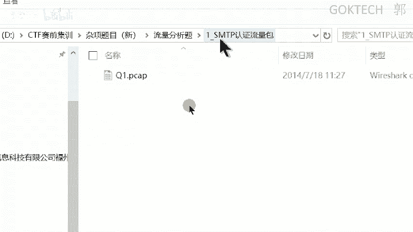

简单啊简单邮件传输协议。

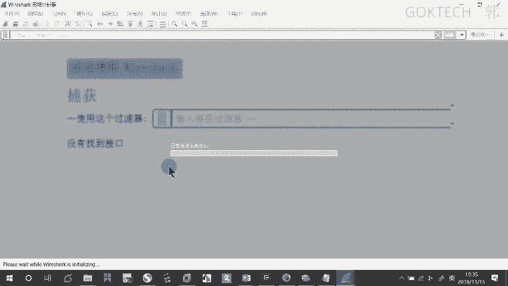

吓。这个该了解的肯定要了解一下它那个传输传输那个端口号是25啊。端括号是25啊，那你们看这个是为了什么啊？为了验证一下这个这个东西呢，其实是不安全的。SMTSMTP的话，它是不安全的。你看到。😡。

用户名和密码直接显示在这边，是不是？😡，来，你们看到这个是候会想到什么？😡，啊。对，而且底下这个包下面这行这个框的下面这行说你认证干嘛成功了嘛，那说明这个用户名的密码是干嘛是对的嘛。

那我有可能flag就在这边嘛。😡，好，再来看一个啊。😊，tnet就之前呢有稍微讲一下了，tnet也是不安全的。😡，不安全在哪了？😡，我搜一下tnet。稍等一下，我找一下啊。

你看比如说我在这边啊输的任何消息啊，CI。😡，S。C o。这些数据全部能都能够被截取下来。就是说我在里面输的任何字符都会被它截取下来。CISCOO是什么？😡，是一个关键字啊关键单词。

我想说这个是因为什么？这个东西呢都是不安全的啊，都是不安全的，都是有可能会被截获了ok。😊，来，那我们继续来随便来找一个哈。看一下啊。这里的话难度哈。是这样子往下拉。啊，这个会飞的苍蝇算是比较难的。

会飞的苍蝇算是比较难的。它里面这个流量包里面包含了一个程序。你没拿你没它抓出来。把它抓出来之后运行一下。啊，他会会会飞飞出很多的苍蝇。啊。来然后呢，这里没一题啊。😊，当然了，这每一题都有答案了哈。

我想了想还是给你们吧啊，反正呃研究一下也是不错的啊，也是不错的。OK随便打开一个啊，随便打开一个啊。😊。

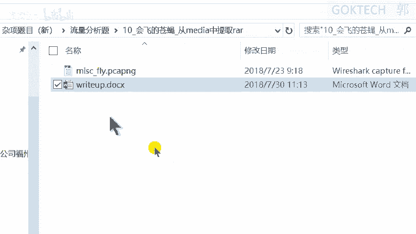

像比如说啊遇到这种流量题怎么做呢？首先第一步，不管怎样，我可以针对协议进行一个分级。针对他协议进行一个分级。啊，针对协议进行分级。比如说什么这里呢，你看到因为它协议呢是什么，它那个流嘛。

数据嘛肯定是分为不同，肯定是有分分的啊。你比如说它是。😡，网站流量比较多。😡，还是TCP流量比较多，还是UDP流量比较多，这些都可以看的啊，都是可以看的。等一下啊。嚟。

比如说我们这边有一个有一个第三题啊，先找到get share，再找到flag，对吧？😊，打开啊。

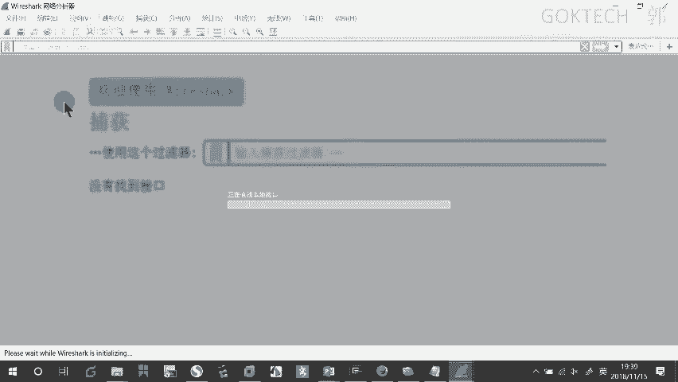

他已经给你提示了是吧？什么叫衰啊？😡，什么叫谁啊？什么叫谁啊？虽简单来说的话，就这个。这种就是一个啊。但是呢他不确定是linux的sll。😡，还是windows的Cll。

还是HTTP网页的一个sll网站的一个木马嘛。网站如果说被re要被人获取了，基本上都能干干任何事情了啊。那我现在不懂是不是不懂，我就要去研究。这里有一个哈。😊，统计。选择协议分级。

如果是英文是什么tical啊tical啊，还有什么prob呃，好吧。😊，我承认我英语不是很好啊。啊。这里有哈。statictics啊，proical啊，那啥来着？啊，嗯嗯没错，对，就是那。统计协议分级。

那我们先把它收起来哈。😊，所有的数据基本上都是什么？因为我们数据是有封装的嘛，数据你说我们在我们在往数据在传的时候，肯定是0101的数据，对吧？就是这种数据流嘛，它是怎么表示成图片、文字声音。

肯定是有需要经过一层层的一个封装解封装和解封装的过程啊。😡，OK首先是一个真嘛，基本上我们能抓的抓的数据，基本上是以太网。什么叫以太网啊？😡，这种网线这种正常的网线啊。来往，然后的话呢你看着。

我们用的比较多的是。😡，IPP6还是IIP4啊？😡，V4是吧？对，所以说我们要打开。再来看一下。用的比较多的是UDB还是TCP。😡，TCP了，所以说数据包是你想啊，它传那么少。

它传这个数据本来就传的这么少。你觉得fllaag有可能它仓放在这儿吗？不可能吧，来。😡，来，看到。😊，这里有1个TC密码，更多的一个包。😡，啊，他有时候呢放在哪里啊啊。

你比如说什么放在我们的一个data里面啊，data里面。但是呢这题的话呢啊有可能就是不是这样做了啊，这题就不是这样做了啊，那反正你要去用用东西去套它，用这东西去套它啊，套出它一个东西来啊。

这个其实呢课件上的这一题呢，它是在哪呢？就是那一张我给你们看了一张会。😊，会飞的苍蝇啊会飞的一个苍蝇啊，会飞的一个苍蝇。啊，你比如说什么我们这个数据嘛，你看下我给大家干嘛了啊，作为过滤器应用啊。

给大家干嘛选中一下。啊，这个也不是不可以啊，但是呢这个这个地方呢这个数据呢太难找了太难找了啊，不是这样，这题不是这么做了啊，这题是这个我们这个会飞的苍蝇那题啊。😊，就他这个人啊可以找到一个呃呃包啊。

找到一个包来，稍等一下，我再给他打开给你们看一下啊。

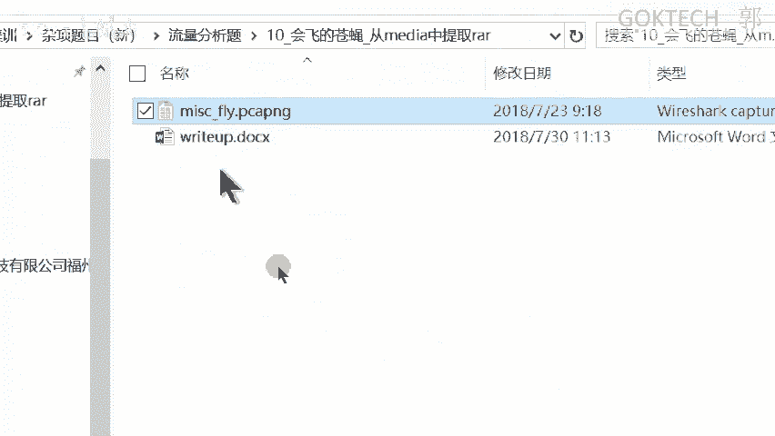

你看呢统计呀。简疑分级啊。这里的话呢我们可以快速定位到哈。😊，肯定是IP4啊，不用讲。啊，也是TCP了。啊，TCB这边有一个啊，你看到啊。😊，是一个好像是一个什么。啊，一个文件包啊，你看传的这个数据啊。

我们可以干嘛啊，给它试一下啊。😊，给它作为一个过滤器，给它啊选中一下啊，给它选中一下啊，给它选中一下啊，就是把它选中，然后我们再进行分析，进行接下来一个分析就可以了。😊，那如果说你选非选中。

就是说除了这个地方。就是说刚才这个选就是说只要包含的这个什么媒体的一个type的一个文件，流量包啊，全部给它选中，给它过滤给它过滤筛选出来。那非常非选中就是说只要包含这个东西的，全部给我剔除掉。

为什么我要选中它啊，你想啊，我如果说是一个。😡，大的一个数据包好，看到，如果我们是一个大的数据包，那我是不是要分好几个啊？😡，对吧好几个嘛，然后等一下呢要把这个什么每相关的部分。

每一个包的相关的部分给它组合成一个包嘛，那我肯定要把这个东西给他选中嘛。😡，啊，你看没有？每一个都有每个包都有这个每个包有都有这个每个包都有。啊，每个每个包都有随便点一个，每个包都有啊。

那再把这些东西组合起来啊就可以了。稍等一下。你看呢。这里也也可以用什么了，作为过滤器来应用啊，也可以啊，都可以啊，选中都可以了啊OK。讲了多久啊？那我们休息一下吧啊休息一下吧。部分同学已经懵了啊。嗯。

针对刚才这个那那只苍蝇的那一题啊，或者说针对这种题的话呢，它有几个小技巧啊。你比如说。😊，点那个统计，然后协议分级可以看得到呢。

它每一个每个数据更多的时候它是更多的数据是占用在哪一块的那我可以把它筛选出来啊，再把它这些数据进行分离就可以了。至于怎么分离的话呢，我这就不多讲了哈，我不多讲了，时间有限啊。

我们接着把往下面的一个东西抢一下哈啊，还可以针对80端口进行筛选了，进行筛选，这个我也不多说了。😊，啊，来这里有一道题啊，这个题还是挺有意思的。😡，就我们可以进行一个收留的一个什么啊留的一个呃追踪啊。

留的一个追踪。因为有时候它的一个数据数据是连续的嘛，有时候是数据是连连续的，我可以怎么针对某一个数据流进行一个分连系的一个分析分析啊啊，为什么我我讲的口音都有点怪怪了。😊，啊，来我们来看这题啊。😊。

这里有一题啊叫做。😊，第三题，先找到get share留，再找到什么我们的一个flag。啊，这里有几个挺有意思的哈。😊，先打开，先把它打开。

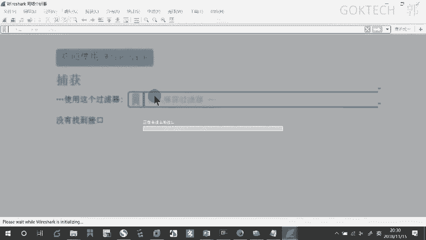

来。既然是刘是吧？谁啊就是我们的制符嘛，既然是刘，那我首先干嘛呢？先看一下是不是有HTTP码。😡，很巧的是，这题刚好就没有HTTP。😊，那我就不能用这种方式来去去弄了，我必须要什么呢？😡，来。

一般情况下，你们用CL就是制符界面。一般情况下你们会敲什么，你们会做什么？😡，首先要敲命令嘛，你比如说我要加1个LS嘛，敲一个什么L是什么，还记得吗？😡，linux里面查看这个文件底下有哪一些数据嘛？

还有一个什么？如果是放在windows里面，用什么命令啊？😡，DIRdirectory directory啊，在哪啊？在我们的CMD下面。😊，D二啊，我就看到底下有哪些，那我就可以根据这些内容啊。

根据刚才学了一条命令叫TCP的一个什么，这里都是TCP的包啊TCPcon。😡，啊，contains啊包含哪些呢？包含了我们的比如说LS回车啊，显然可以从这边看得到啊。

它很多东西都有包含LS啊和LS再来比如说我们可以看一下它包含包不包含DIR。😊，好像也有很多也有很多啊，那我们一条一条去分分析就可以了。但是呢那我也是看答案的嘛，答案给我们说什么呢，要干嘛啦？com慢。

😊，啊，这个命令的意思啊，很慢。啊，然后一条链是分析一条就分析。你看着啊这每每点一条，它底下都有信息，是不是？这是它的一个什么真的那一个数据的一个封装格式啊，就每一层啊，你看啊从底层到它什么数据层啊。

不是其实不叫数据层，叫什么应用层啊，来它底下呢是对应的什么十六进制数，十六进制数啊，这些全部都是数据啊。😊，啊，除了这个针头啊除了这个针头啊，其他都是数据啊，看到啊，我们往下翻一下啊。

我们看一下这个data啊，data这个地方啊，这里有一个数据啊，我们看一下往下拉一下啊，看这个16进制数啊。😊，好，这个地方好像看不出什么东西来啊，那我们往下。😊，其实呢我可以直接给大家说了。

就是最后这一行最后这一行，最后这行他看什么了？看这个地方。😡，这是什么啊？😡，这是什么啊？😡，来看着啊。对吧。是不是也可以认为它有可能是windows的一个sll，windows的c被它获取了嘛。啊。

其实这边有没有LS呢？有就刚包含在刚才那个地方。因为刚才那个我搜索出来的时候太多了嘛，我懒得一个个去搜，所以说我要一个个分析，一个个去分析OK找到了之后，我干嘛啊？😡，针对流进行一个什么追踪。

这时候肯定是TCP流啊，没有HTTP流。😡，因为他还没有到达那个。HTT它没有网网页的一个访问嘛，它只有1个TCB的一个交互啊。😡，那么点开。看到没有？首先他进来嘛，先敲了一下LS嘛，L没有找到。

那说明什么呀？这个应该不是linux系统，而是一个什么windows系统。我是用DI啊，是不是可以看得到啊它的信息啊，然后呢，他进到什么啊，找到一个文件叫什么？😡，这个文件啊。

然后把它打开type的意思就是查看里面的内容，查看里面的内容，发现这一串知道是什么吗？😡，知道了吧？然后他直接了一个关机。啊，并且留下一个信息，这信息是什么？我们就不多说了啊。😊，stup啊。

s stupiduppy是什么意思啊？😡，啊。OK那我们只要把这段干嘛拿下来嘛，使用我们的火狐，这地方火狐啊是可以进行解密的。😊，我之前不知道你们下安装这个哈克霸了啊，这个可以扩展了一下。

这里面有一个解密码。😊，这个什么？将加解密这个64的一个解码嘛。所以这个flag就帮我体现在这儿了。啊。是因为什么呢？

我刚好在这个地方这个留这个地方这个这里看到这个呢我就是猜测性的一个去给它啊弄一下试试哈。其实呢。😊，他这个地方有没有啊？😡，他地方有没有了？type有没有？😡，但是我不怎么看得懂嘛。

我想要让它显示出什么，它该显示的样子嘛，就这样子嘛啊就这个样子嘛，它是它该显示的位置啊。😡，okK这是我们这一题啊。😊，相对来说啊有点题目做多了还是ok的。奶。你比如说你要看到它的原理质量在关注的哎。

我用这个用笔呀。在关注的HTTB数据包中或者TCP数据包中，选择留汇聚，可以将HTP流或者TCP留汇聚或者还原成。啊，数据就是让他还还原这个数据啊，在弹出的框中可以看到信息。我告诉你为什么会这样子啊。

😡，在我们流网络中啊。😡，数据是有去有回的，什么叫有去有回啊？我发发的一个请求嘛，他要给我显示一个东西，这个叫我数据有过去有回来，明白我的意思吧？不然的话，我只过去没回来，那肯定是不行的。

什么情况下会出现只过去不回来呢？😡，啊。不不是用在我们这个环境啊，你比如说什么啦？😡，嗯。收音机用过没有或者听过没有？😡，收音机是不是是什么样子的？老板的收音机，我现在真的是科技越来越发达。

我只能说老板的收音机是不是只能他来他来讲嘛，我们来听。没错啊，那现在的一个收音机可能是智能收音机啊，是吧？啊，我跟他说啊，给我播放什么什么台，他是不是自动给我播放了啊，那这个不一样啊。

就是我只只说他收音机在播放那个电台的时候，那个那个过程是什么是一个单向的一个过程嘛，对吧？😊，就没有一个回显嘛。那你比如说我的屏幕或者我我们的一个电脑是吧，我输什么信息，它电脑上面会显示什么信息嘛。

对吧？😡，是。还有一些信息啊，还有信息比较比较比较有意思的哈。😊，一句话木马，所谓的一句话木马。😡，啊，一句话木马呢是一个就是我们利用它有一些有时候我们正常情况下，我们不是很多情况下可以上传上传文件吗？

你比如说什么。😡，随便一个网页能不能上传头像呃，好，反正你们也看不清啊。😡，随便一个地方上传一个头像了。😡，啊，对吧啊，那我可以么样给他上上传一个恶意脚本，可不可以呢？可以，如果说他没有做校验的话。

上传一个恶意恶意的木马文件上去之后，我就可以对它进行控制。这种呢叫做一句话木马可以实现啊。😊，啊，不用看了。嗯。来。啊，比如说我们这边有一个。嗯，看一下看下哎。我们看一下这个东西啊。你比如说他这边啊。

比如说我们可从这边可以看得到，看到。😊，我们从从这边是可以看得到，他是在做一个什么。😡，我们认为他有可能在做一个什么上传的东西嘛，那我来给他看一下嘛。😡，啊，追踪一下。就重加它一个什么HTTP流嘛。

这时候是HTTP嘛，对吧？😡，看到没有？有一个evo的一个关键字关键字啊关键字。我们可以把这个东西呢干嘛了？唉，这个这个这我看一下。C是吧，那好吧，保存一下吧。看着啊。我这边啊就保存在这儿。

还没办法全部保存是吧？看一下稍等一下，我看一下啊。但是这个就是另重围了，呃，不不算是保存的，看一眼啊。稍等一下。哎，我想想啊。遇到这种的话呢，一般情况下我们可以把它全部保存了啊。

我想一想是是我这个东西错了吗？没错吧。还是说我要把它。等一下啊。但也不对呀，如果说我把这个保存下来也不对呀。我想拿它导出来都不行，是吧嗯？没错啊。看一下我们看一下PPT上有没有提示啊。嗯。

这边也没有是吧？是导出对象吗？看一下，是我就没这个选项还是怎样的。导出对象有哈。把这个HTTB给它导出来啊，这里的话包含好几个好几个文件啊，什么意思啊？来等一下，我要重新讲一下啊，可能一直一直混了啊。

😊，就我首先认为啊它是在连续上传文件，但是它上传什么东西我们不知道，所以说我要去追踪一下这个流嘛啊，连续的追踪一下它这个流到底到底到底到底上传了什么东西。😡，肯定是HTTP。啊啊，我从这里的话呢。

其实如果稍微清楚的话呢，我们会知道这是一个什么啊pos的一个请求。然后这边的话它一个头部啊，然后正文啊，来我们看一下啊，我们。清楚的知道这一块之后呢，我们可以把它干嘛呢？导出这个来把那个对象导出出来啊。

比如说我导出成为一个什么把这个HTTP导出来啊，看着。会有这么几个啊。看一下是不是哈，我们试一下啊。safe2啊，我们保存所有啊，把它保存在我们这个一句一一句话这边啊。这样保存就可以了。来这什么啊？

这什么？PHP脚本文件脚本文件可不可以用我们的note pad夹加打开？😊，可以吧，显然是可以的嘛，对吧？O。😊，但是因为这些东西呢，一般情况下这么多文件你怎么去看啊？😡，等一下，我先更改一下。

打开方式为默认为那个notepa加加吧。还没有是吧。没有，下次再弄吧来。一般情况下你有这么多文件，你怎么看啊？😡，般情况下你有这么多文件，你怎么看啊？是不是首先要看一下。😡，一般情况我是这么看的来。😡。

4K1K1KK哎。有一个什么。1238K的是吧？那我先看一下它是不是有问题啊，这个啊。编辑一下。这里啊。看花野了是吧？哎，什么。什么。这地方有没有可能是一个。被是。对吧。来这个地方。

89504E47好熟悉呀。好熟啊，谁帮我看一下。😡，来这个是不是一个b呢？这是不是一个b呢？这下面是不是又是一个base呢？啊，并且我把这个东西导出来，是不是这样子给它手动导出来。

是不是又可以保存成一个文件呢？是不是flag就在这里面了？😡，对吧这种都是有可能的都是有可能的啊。啊。为什么会他是题目已经给你提示的很清楚了啊。😡，首先是一句话，菜刀，一句话木马啊，用菜刀啊。

这个涉及到一个新的东西，是一句话木马的东西啊。那我们等到。😊，外b的时候再稍微提一下，这是一个利用上传漏洞。通过工具把东西给它上传下去，然后去原我把我把木马连上传下去，是不是要连接它啊。

那要连接它要用工具，这个工具叫菜刀。😡，用这个菜刀给它连上去就可以了。啊，东西还是。有点小意思的啊。唉。啊，除了这一块呢，你也可以把固定的几个东西啊给它导出来啊，比如说这个地方点击想要的数据包。

选定什么特定的一个位置啊，特定的一个位置把它导出啊，那这里我就不多说了。😊，啊，这里啊这个位置啊这个位置就是之前我给给你们看的那个苍蝇啊，苍蝇。😡，好，无线的话呢。啊，无线这一块呢啊。😊，哎，来。

我给你们看一下。呃，我看一下。简单讲一下无线的我们先跳过了哈。😊，来。USB。我们比如说外接一个键盘啊。外接一个键盘给它接上去。这个流量也可以抓下来。那这时候抓下来。

你敲的你键盘敲的所有东西都会都会被它记录下来。😡，都会被它记录下来。一样的，如果你接的这个鼠标，你的移动轨迹也会被记录下来。😡，鼠标会用到什么左键吧。😡，右键吧啊还有什么。

还有还有你这个这个这个滑动的一个轨迹啊，都可以被它弄出来啊，弄出来再用这个。😊，在用这个看这个流量包的时候啊，USB有流量包的时候，我们首先要选中这个。😡，选中这个。我们看一下在哪。USB啊。啊。

不11号。我简单简单稍微讲一下啊。比如说我打开第二个包啊。😡，这里有一个。USB的一个流量。你看比如我点这个包，它这这底下是不是有一个capual data。😡，对啊，我看一下是不是是不是PPT这个。

开不出 datata，对吧？😊，这里呢你必须给它选。😡，应用为列。因为为列的话，它这边这个数据这个是真实的数据，有效的数据。说白了就是我USB的一个有效的数据形式就是藏在这儿。😡，躺在这儿。

正呢我要用工具把它分离出来。这个工具呢涉及到我们的。😡，脚本。啊，脚本来看一下哈。键盘数据包的数据长度一般为8个字节，什么意思啊？这每一个数据包都有8个字节嘛，一个字节。

两个字节、三个字节、四个字节、5个字节、6个字节，7个8个，对吧？他说什么啦？😊，基建什么叫基建啊？😡，按你的键盘，不是这时候不是鼠标啊，是键盘啊，按你的键盘都会产生一个什么数据啊。

主要是集中在第三个字节，就这个地方。😡，那我们看一下它有8个字节了。😊，有没有八个字节呢？😡，1234对吧？啊，那剩下我就不多说了哈，也就意味着它的一个数据主要是藏在什么第三只节里面。

说说明这个是一个键盘，对吧？键盘的一个数据，那怎么把它分离出来呢？😊，用我们的什么。用我们的一个流量啊，这里有一个有有一个。应用哈这个地方是一个说明文档哈，就说说明你这个怎么去抓一个键盘的一个包哈啊。

怎么去抓键盘的包。因为哈因为它每一个值都是有对应的一个键盘上的一个键的，看到。😊，你比如说我刚才那第三个字节，第三个字节，如果它显示的值是04嘛。😡，就保持你按到了。😡，字母。

就是你按照你那按到的那个字母这个键A这个键。但是呢不管它是大写还是小写，因为你的无论是大写和小写，你都要按这个键嘛。😡，明白我的意思吗？😡，OK啊，我大姐和小姐的键是同一个键，没错吧。😊，啊，来。

也就意味着它第三个字节呢，它对应的其实是什么？有这边映射表来对应的那你通过这个映射表呢，你可以写一个什么，你可以写一个脚本。😡，写个脚本，然后我把它运行就可以了。😊，所以说这里是怎么做的呢？首先。😡。

要把我们的一个什么啦。😡，数据哈给大家看嘛导出导出到我们的一个excel表格里面。excel表格里面这个地方CSV也是一个表格哈，表格文件啊。😊，OK保存下来之后呢，干嘛呢？😊，在得到的一个值里面。

把其实呢我们最终的目的是干嘛？是把这个数据复制下来嘛。那你要看一下。😡，你这个怎么复制啊，根本就复制不了，是不是？所以说你要把它先导出，看着啊导出。😊，导出。导出那个。结果啊为CCSV。放到这边啊。

叫做一。呃，是这个吗？啊，对。1点CSV啊，好像是这样的啊。你看一下是不是打开看一下就知道了。对吧啊，有时候呢这个东西很坑的，有时候我们输入的时候啊。😊，因为我本来要输入数字嘛。

他就认为我输的是他有时候会帮我用那个科学技术法来计算出来。因为我输入的是不是其实是一个字符串嘛？😡，因为我用的是16金制来做的嘛，他有时候认为是一个。呃，如果说你是一个正常的数字，你比如说什么。

我随便在第一行吧。第一行，如果我用这么一个长的数字啊，看着啊。他有时候又用用这个科学技术法帮我表示。科学注意做法帮我表示啊，所以说啊还是蛮坑的。那我现在呢只要把这一张纸是干嘛呢？😊，给它复制出来。啊。

复制出完，然后干嘛？😡。

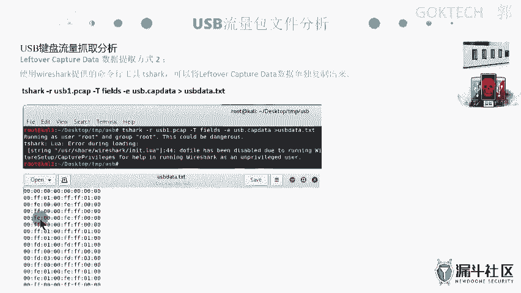

放到我的一个什么。文本里面啊放到文本里面，然后进行分析就可以了。当然也可以用什么呢？😡，也可以用我们的一个什么T shockT suck这条命令就好用对吧。T suck来注意啊，这个是固定参数啊。

它是怎样的？T suck是怎么用的？😡，把我这个数据包。😡，的。固定的数据干嘛呢？导出到1个USBda的一个文件夹里文件里面啊。OK这个就比刚才那个简单多了吗？要在卡令里面。😊，皮萨克啊。

我们等一下我这条命令得复制一下。节省点时间。在哪里在哪里在，因为这个是要用到图形化，所以说用我的子系统是用不了啊。😡，啊，没找到啊，稍等一下。来。哎，有了吗？啊，等一下稍等一下，T杠2。

我是这里是USBE啊，给它导入导出为一个什么导出为1个USBda的一个数据啊，我们看一下有没有啊哈。😊，算了，我重新来一遍了哈，把这个删掉哈。😊，我把它导出为USBdata一啊，这样子比较好看。

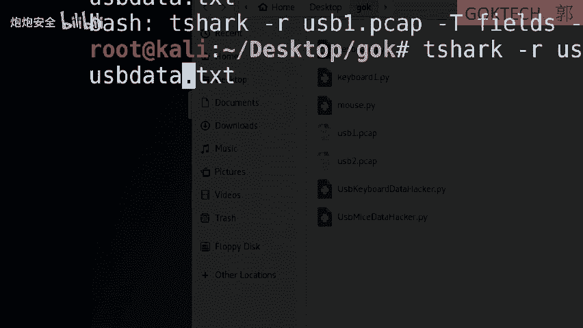

啊。OK有1个USB data仪嘛，我们看一下，打开看一下。😊。

哎，是我输错了是吧？稍等稍等。T下个。等一下啊等一下，这个要用。要用文本给它粘贴一下。什么意思啊？就嗯偷懒的方式，他可能有时候不不太行啊。T shock干了啊。USBE这个我看一下啊。谢谢啊。啊。

它是有一个这么1个USHE啊。有这么1个USB点这个文件啊，我们看一下有没有哈。USB1点PCAP。啊，有USB1点PHP给大家干嘛？导出到我们的一个什么呢？USBdaUSB data一啊。稍等一下啊。

你有我看一下。命令错了吗？T stuck。啊啊。嗯。是我没有相关的一个东西吗？那没有导出，直接导出行不行？还不行是吧。😔，对呀。等一下稍等一下。看一下这个PPT啊。

T shock杠RUSB点PHZ杠T filess杠EUSB点。capital data没有任何问题吧，我明你应该没有问题啊。点cap data对呀。然后。导出到USB点。天气是吧，没错啊。

如果这个方法不行哈，那我告诉你，你只能这样子来。我刚才不是。😡，我刚才不是把这些数据啊，我不是获取到这个数据了吗？等一下我这样做，我给他。😡，稍等一下。我把这个数据怎么做呢？我把它复制出来。

我把它复制出来。粘贴在我们的一个文本里面，当然把该去掉的去掉哈。哎呀。不行啊，他还是按按这种比较坑的方式啊，比较坑的方式啊。像这种啊看到。我回头研究一下啊这个。不应该啊，像这种哈。

它应该是要显示成那个数字的，结果它这样子复制出来，就是用科学科学方式了，你们稍等一下啊。😊，我把这个数据变成一个文本啊。哇。坑了。😔，不起。这有点疼啊有点疼啊。这给我复制出来变成11E加14就有点疼啊。

那你们看一下能不能运行啊，你们看一下能不能运行啊。我是不是扫了什么命令，还是我命令输错了？来，我们来看一下啊，T恤哎呀，我直接盯盯一下吧。还有一种方法。

就是说如果说你这这个东西没有把它没有办法把它分离出来的时候啊，没有办法把它分离出来啊，我知道什么问题了。😡，这里这里这这里。来呀来啊。这里呀。😡，先用图形画把它打开。😡，啊，把它打开VI萨卡。

当然这个VR萨卡是英文的啊。😊，把它打开，先把它打开之后，然要干嘛呢？这个地方这个地方因为我要把这个数据这个部分的数据给它导出来嘛，所以说你要先干嘛？😡，哎，显示为例。Apart。这个什么这个叫什么？

唉，我怎么移不上去啊？😊，这个地方。Apply urge子 climb。就把它应用为列。啊，应勇为力。这里要先点一下，原来我是我做的时候，原来我做的时候是外面外面做完了，给它拷贝过来了啊。

那这个是我刚刚重新拷贝了啊，重新拷贝没做这个啊，做完之后我们把它保存一下。😡。

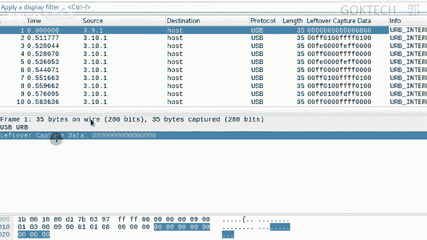

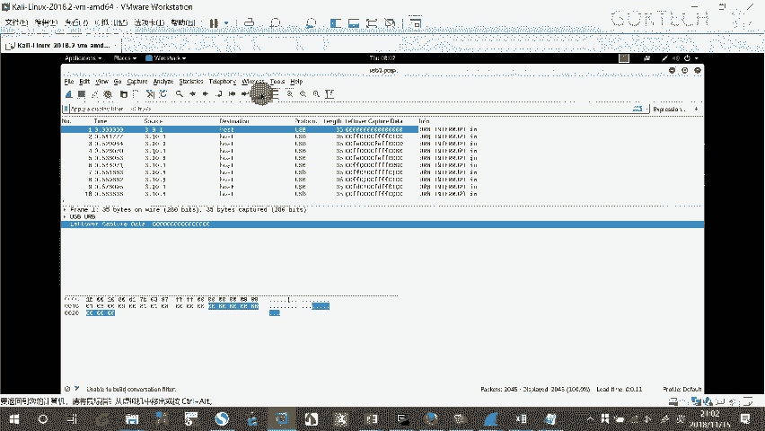

好。啊，不用保存也行啊。来行啊，那我们这时候再运行一下这条命令看一下啊，把车。😊，哎呀。有点坑啊。有点坑啊。我有错吗？

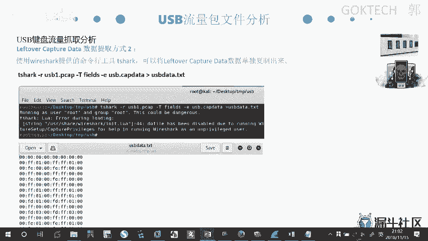

我应该是没错了。T下克杠啊。T萨克干嘛？USBE拍P。P。T fire。down意。USB data。ca个 data。然后。给它导出一个什么呢？USBdata一。这么坑。我回头研究一下。

这题不应该啊这题不应该啊。🤧嗯。哎，我简单讲一下原理吧啊，那回去的话大家实验一下啊，没准是我卡离的问题啊，当然也有可能是这个有问题啊，都不好说，不一定啊。来，我们来先讲一下，我这个讲一下时间也不多了啊。

也也也超时了啊，我我简单给大家理一下这一块啊，理完之后大家先回去休息一下啊。晚上我研究一下啊，来这样子啊，这一题的话是这样子的啊，就是首先我用这个命令把这个这个部分的数据给它分离出来。

分离完了之后怎么做了。😊，分离完了啊，我用这条命令。因为我写了个脚本嘛，写了个脚本，可以把我们这个什么键盘的值干嘛呢？给它显示出来啊。那我之前我说为什么说什么呢？它这个地方有一些我们看得懂是吧？

hello I am什么I am writing something啊， importantport啊，我要写一些重要的数据嘛啊，butI don't know use的拼音，我不懂得写拼音啊。

Im old啊，然后呢开始写。😡，啊，他说他不懂拼音嘛，对吧？好，他写了呢这个东西呢，我告诉你是5笔。😡，啊，所以说你要解这个题，你还要装一个五笔拼音输入法啊，五笔输入法O。

还有一个啊是针对USB鼠标呢一样的。但是呢USB鼠标呢比那个键盘少了几个呢，一个、2个、3个、4个，它只有4个字节，也就意味着什么？它的数据只有它的一半啊。然后呢，你看呢按键啊。

然后呢左键右键这个我就不多说了。😊，通过这个把数据分离出来一样的哈，把数据分离出来之后，用这个脚本。😊。

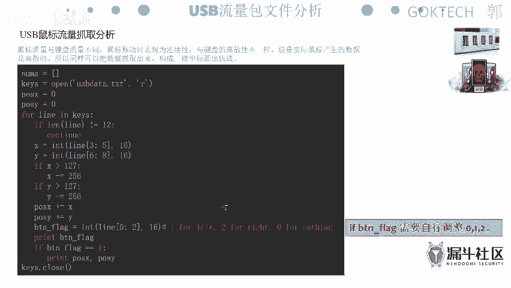

用这个脚本进行精灵什么啊，运行运行之后呢，可以干嘛呢生成这种。

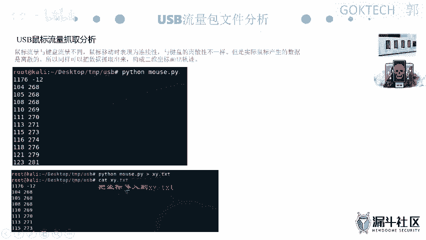

生成这种坐标啊生成这种坐标。分坐坐标，根据这个轨迹，我们可以知道它flag这个是XNUCA。😊，嗯。啊，哎什么鬼，我自有这么好看吗？是吧？USB什么鬼的啊，对吧啊？😊，对这个是根据那个那个鼠标的轨迹。

😊，当然了。😡，当然了，如果你是鼠标轨迹，如果你没有按键的时候，你鼠标去去滑动，其实它是记录记录不了了啊，你必须干嘛啦？😡，你这样子按着啊去滑的时候才才会记录。所以说有些人呢在说什么？

你比如说有些人监控，你怕你的。😡，键盘被监控的嘛，有时候会给你下一个木马嘛，那你输的任何任何东西都会被记录了，甚至有可能密码都会被被他弄到嘛。那你比如说输几个字符啊。😡，你看着。我这里都有了。

你比如说输几个字符嘛。😡，GOKTCH是吧？然后呢，我鼠标看着我鼠标偷偷移到这儿点一下。😊，2018哎，点错了。点到这儿2018。这样子的话可以它它虽然记录你的键盘。

但是它记录下来是GOKTCH2018啊，这样子能够有效防止。

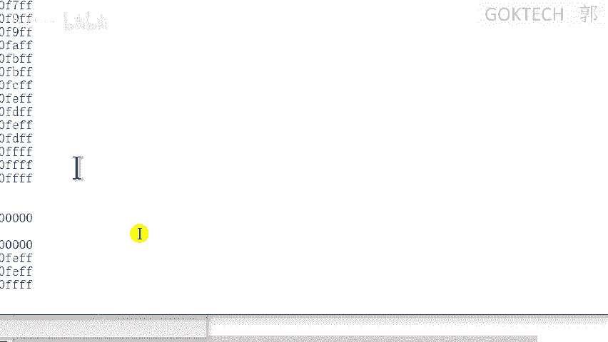

对。但是一般情况下不会有这么这么这么这么这么那个的啊。OK还有什么呢？还有HTTB呢HTTBS的是没办法看得到的哈，需要导入一些证书。当然那个导入证书，我们下次课再扫一下。

然后顺便把外的最简单的东西给大家讲一下啊。那这个周五的课我们就也下节课的内容就是把这个扫完，然后呢，把外b给大弄一下。外弄完之后差不多的话，我们的课程就差不多结束啊。

当然还会有有一次课简单对大家给给大家讲一下那个呃说白了就是做一下答疑啊，给答疑啊，差不多。😊。