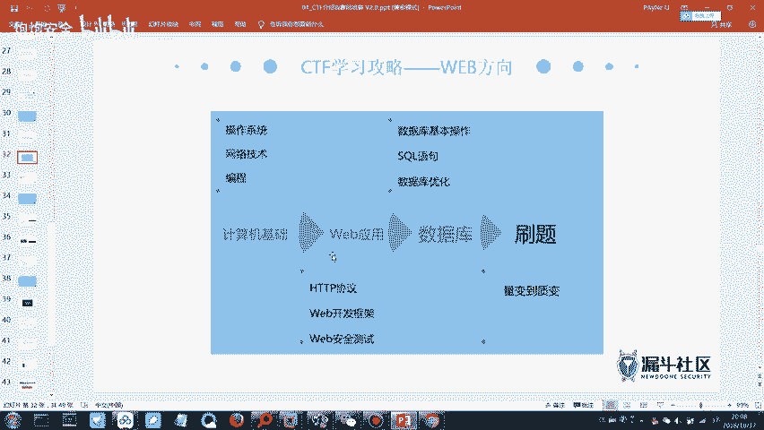
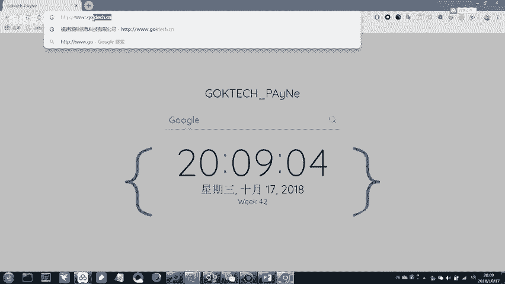
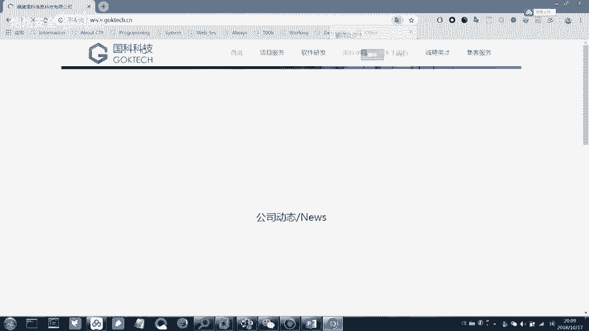
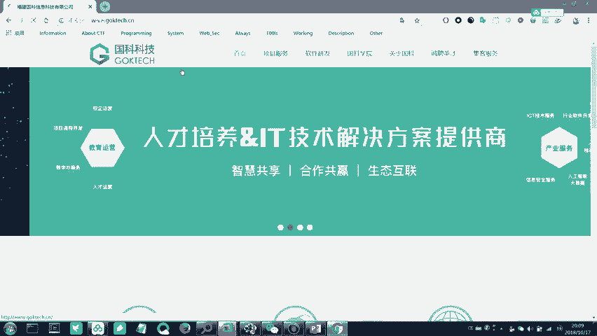
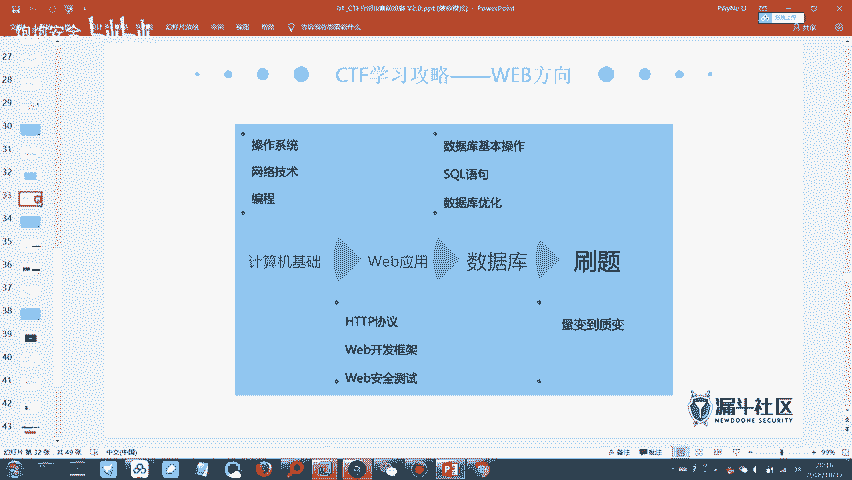
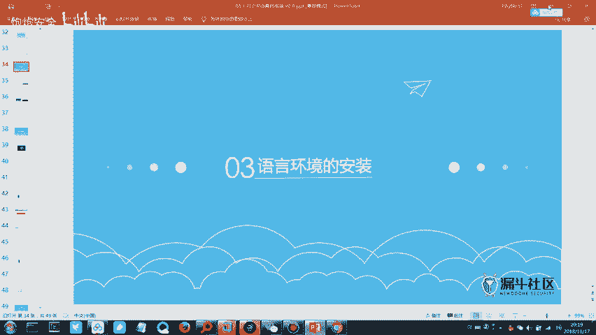
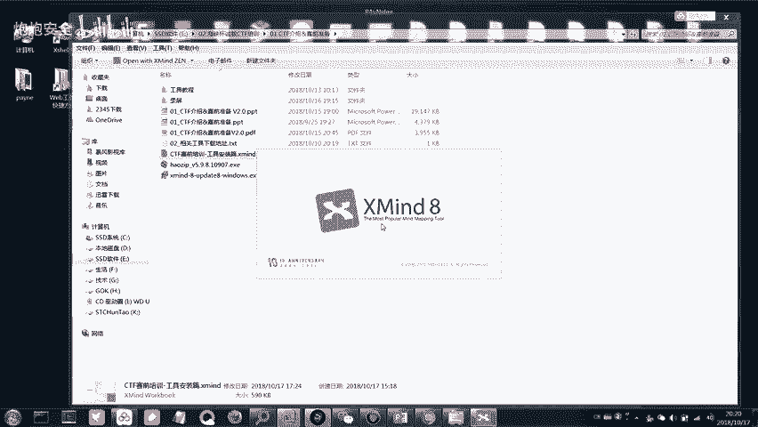
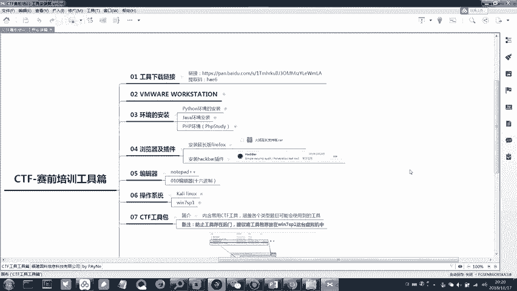

# CTF培训网络安全基础入门 - P2：（03）CTF赛制介绍&工具介绍 - 炮炮安全 - BV1mT411q7qB

刚刚我在群里面发的那个Xman那个是一个思维导图的那个软件。就是因为我给你们发了一个思维导图的一个文件，它需要用那个软件来打开。那在群里面你面下载一下，然后安装一下，待会儿可能会用到这个文件。

你们就可以用那个X来把它打开。那接下来的话，我们继续来看PPT吧。那接下来我们就开始我们的第二部分CTF它的一个备账思路。

我们刚刚讲了我们CDF它的一些基本概念，还有一些基本的模式。那么我们针对这个CDF比赛的话，我们是需要有一定的这种备账思路的。那么我们想要梳理出来属比较适合自己的一个备账思路的话。

那就需要我们对CDF需要掌握的这种技术知识，需要有一定的理解。那么关于CDF的比赛，我们需要掌握的这个知识的话，它分为两个模块。一个模块的话是我们的基础知识。那第二个模块呢是我们叫做中项的这种知识。

那基础知识的话，那基本上就是比如说linux的linux系统的一个这种基本的使用啊。第二个的话就是网络协议的一个分析。那就是说涉及到我们的网络流量数据包的这种分析。

那关于中间这个计算机组成原理和操作系统原理的话，这个看不看无所谓。那这两部分是必须得稍微知道一点的，不用去精通，但是你必须得稍微知道一点。那么我们的专项知识的话，它又分为两个方向。一个方AA方向的话。

它就是判逆向加我们的密码学。那这个方向的话可想而知，难度会稍微高一点。那第二个方向的话就是外加杂项。那就是说它涉及到的这种技术点，可能会稍微少一点。

它比较注重的是关于我们漏洞的这种一个漏洞原理的利用以及信息收集的一个能力。那么这个就是我们CDF它的一个这种方向。那具体我们要掌握哪些知识呢？他有这样的一个路线。首先操作系统的话。

我们刚刚说了linuxux。linux你是需要懂一些的，就是说基本的linux的一些命令，你不用说去精通它。但是它基本的比如说进入目录啊，或者说查看文件啊这些基本的命令，你必须得懂。那这样的话。

有时候用到lininux。我们的卡利，它其实就是一个linux的这种操作系统。那么你只有懂基本的命令，你在用卡利的这种操作系统的时候才会比较容易。不然的话。

再强大的一个工具在你手上可能也发挥不了什么作用。那么第二个的话就是网络技术。我们这里说的网络技术就是类似于说。我们的HCNA呀这种水平的，或者说CCCNA这种水平的。知道SCNACCNA这种是什么吗？

啊，对，速通嘛，就是说我们需要对速通的这种一个基础，你得有一点基础。那么有时候我们涉及到一些IP啊，一些通信啊这种过程你才会比较理解。那第三个冰层的话，那这个其实属于是。你没有的话。

你没有这个冰城的能力的话也行。但是你如果有的话，那就更好，属于是拔高的。冰层的话属于是拔高线，但它不是必须项。那么第二个第二个模块，关于外围应用的话，那HTTP协议，那这个是需要掌握的。

下面的什么外围开发框架，你可以不用懂，但是HTTP协议你必须得懂什么是HTTP协议。有人了解过HTTP协议吗？你们在上网的时候。比如说你们要上百度，肯定是百度点com或者说3W点百度点com，对吧？

那么其实如果说是正规的这种1个UIL的话，它在前面它是需要加1个HTTP的。

嗯。你比如说如果说我们想访问一个网站。比如说访问一下我们公司的网站，它其实是这样的一个架构的。前面它是有1个HTTP的，只是说公司的这个网站，它在设置这个访问的时候。

他在设置这个访问的时候，他是没有设置，他是把它设置成你输入3W点JOKtch点C安，你可以访问。然后你。不输入这个3W点，你也可以访问。所以说大家在平时在输入网址的时候，其实不会输入1个HTTP对吧？

但是这个HTTP协议它是在网络的这种我们客我们所说的客户端和我们的服务端，它通信当中必备的一个协议。只有这个协议。

起来了，然后我们的这个数据才能够正常的这种通信。刚刚有同学说这里有一个不安全，对吧？为什么有一个不安全？当然不是我这在这里加个S就能解决的。我们我们公司的这个网站，它用的是HTTP。

然后的话还有相对应的一个叫做HTTPS。这个网站。颜色比较多，看着。在这里写吧。我们所说的HTTP它是一个协议，它是外国当中通信的一个协议，专门针对我们外国网站的。

就是说你每天能够那种快速准确的点击一个网站，然后马上跳转到相应的网页，然后显示出来的网页内容可能还比较炫酷，之所以能够达到这个。第一是你的网速还不错？那第二是因为它有HTP的这种协议做支撑。

它能够传递相应的内容。那我们刚刚说的HTTP在谷歌的浏览器里面，它是显示为不安全的。为什么？谷歌想谷歌它属于是一个这种。比较有人文情怀的这种公司。所以说它的产品在谷歌浏览器上面，它就是有点想强行帮大家。

就是把这种信息安全的意识提高。你如果没有使用HTTPS那我就在我的这个浏览器上给你标注是一个不安全的？

他就是希望通过这种一个改动能够督促你把最好把你自己网站的这种访问方式都混成HTPS的那我们的HTTVPS为什么说。它会更安全的。其实HTTPS它不是一个新的协议。HTTTPS你可以理解为它是HTTP。

然后加上1个TL的一个叫做套阶层。既然说HTTPS它这么安全，那为什么有的网站？他都他还是不会用HTPS呢。因为你如果想用HTTPS，你需要CA证书，那这个证书它是收费的那所以说就涉及到费用的问题。

而且有的企业就是它其实啊就是不会特别重视说哎我用HTPS我用HTP好像也没什么问题，对吧？那所以说我也就一直用着，如果我要改成HTTPS除了说在金钱方面，你要有所投入之外，你在其他的这种网站一些改造。

你也要投入一部分的功夫。所以说为了节省麻烦很多，你说访问的这种网站都是用HTTP的。但是是百度、京东，比如说你在登录腾讯的一个网页的这种QQ邮箱的时候。

你会发现它都是HTTPS因为这种大公司它是非常注重这种信息安全的，并且它的这种产品的用户基数特别大。所以说它每一个环节它都非常注重。这就是为什么？如果说你去刷SRRC，你提交的漏洞是这种大厂商的。

它的奖励也会非常高。那么这个就是HTP和我们的HTTPS它的一个区别。那么第二个技能就是刚刚说的HTP协议。那第三个的话就是我们刚刚所说的数据库的一个查询语句SQL的查询语句。

那数据库基本操作或者说SKL查询语句，那基本上数据库的一个增商查改。是需要稍微了解一下的。增山查改。就是其他的数据库的一些语法，你可以不知道，但是真商查改这几条其实没有特别多的语法。

你花个你玩游戏玩累的时候，花个二十来分钟稍微浏览一下，其实也大概就能够掌握它的这种真商查改的一个语法。因为为什么要学习数据库。因为如果你数据库不理解的话，你在后面你想理解SQL注入的这个漏洞的话。

非常难。你压根不知道我们构造出来的那个语句，它是什么意思。所以说SQL的这种查询语句也需要掌握一部分。那么前面的这种基础知识。都掌握了之后，那后面就是所说的一个量变到质变的过程，就是刷新。

说很多很多的题，然后慢慢的你会积累到很多的这种一些思路。有时候你积累的思路多了之后，你看到某一个题目，你看到甚至看到他题目名称，你大概就知道他想考察的是哪个点。但是这里我们好像看到了好多好多的知识。

对吧？随便一个知识，比如说lin，我学金的或者说网络技术编城，我随便一个学金的，我们毕业之后是不是都能找到一份很好的工作。但是CDF的话，你会发现它居然这些他都要求你要去学。

那所以说我们CTF它注重的是一个广度，就是不是特别注重那个精度。当你如果说你死磕想要把某一个学精一点，那肯定是可以的，我丝毫不会拦着你是吧？那就是说可能大家的时间和精力有限。

那么我们每一个部分我们去稍微了解一下，然后能够入一个门。然后接下来在。大量的做一些题，然后从题目当中获取到一些知识，形成一定的这种做题的思路。然后题目当中你如果说。做到了某一个题目。

然后题目当中出现了你不认识的这种知识点。那么你再相应的去百度一下，或者说google一下就可以了。如果说想用google的话，那么需要用1个VPN没有的话，可以私聊我一下，我发给你们。因为在我们大清朝。

大家都知道有一堵很厚的墙，对吧？外面的世界可能看不到。但是百度的话大家都懂的，有时候就是一个感冒，可能受了百度之后，感觉自己自己好像得的是绝症。那么有的东西比如说国外的一些资料。

你在百度上它可能是搜索不出来的。但是google可以。那所以说。反正我自从用了酷狗浏览器之后，就有点感觉回不去的，挺好用的。但是就是需要用1个VPN到时候我给你们发一个。那么就是说这几个方面。

我们大家都可以去稍微了解一下每个方面的一些基本的知识，稍微学习一下。那么如果说你在学习的过程中，发现你在学习的过程中发现哎好像其中的某一个方面，我还更感兴趣。那么这时候那你也相当于说找到自己一个方向。

那也挺好的。比如说网络技术，其实呃我们这里面也有我们公司的老学员，应该知道我们公司其实也有这种网络技术数通方面的一个培训。你哪怕说你只要精通这个网络技术，或者说都不用到精通。

你毕业之后也能找一份很好的工作。那所以说你如果全部都很精通。那你现在可能就是在大厂商里面坐着，那大概就是这样。那所以说大家也不要觉得害怕，看到好像这么多知识，怎么学的文呢，我好像不吃不睡。

好像也学不完是吧？那其实我们只是说广度比较大，要求大家掌握的并不是那么多。首先心里面不要产生恐惧，不然后面是没法学的那刚刚说刷题。

量变到质变的一个过程就是刷题。那么这里也帮大家总结了很多的这种题目的平台。不要担心题目不够做，好吧，每个平台上面超多的题目。这边的话是题目的一些平台啊，其实我给你们课件里面都有。

你们复制一下进去就可以了。然后这个左边的话是题目，然后右边的话就是我们刚刚所说的WP是吧，就是相应的答案。如果说你做实验吧的话，那么它这个网址里面它有全部的这种答案。你不会做的时候，你可以看一下答案。

然后来做一下。嗯，一开始的话，我推荐大家做的平台，做这两个。做实验吧的。然后还有8个库CTF这两个平台的，因为这两个平台的题目相对来说友好一些。因为你如果一开始你去撸爱春秋这个CTF大本营的话。

你会发现好像有点难度。为什么？因为CDF大本营里面的题目，它全部是以前以往的这种比赛的原题。大家都知道比赛的题目它肯定是。具备一定的这种难度的，而且它又是原T。所以说爱春秋上面的题目可能稍微难一点。

那大家就先去试一下，试试水，去试一下实验吧的。然后还有这个8个酷CDF的这两个平台的题目可能难度会适中一点。比较适合一开始去做。那么你到后面。感觉做着做着好像题目都会了，感觉心里面有点膨胀。

那么就爱春秋打开，然后来试一下里面有超多的云题，各种百度杯的，我们福建省的百悦杯的，然后广州的这种什么抢网杯啊，各种各样的比赛，它上面都有云题，而且也有其他人写的答案，你可以做一下，然后对着着看一下。

那么爱全球上面也不是说每道题都是难的，如果每道题都是难的，那么它那个比赛的那个难度比例它就失衡了，它上面也有紧张的，只是说大部分还是稍微具备一定的这种难度。那么这个就是刷题给大家的一些网址。

大家可以像我这样。就是你可以把那些网址用一个书签，然后里面全部把它保存在里面。那么你在做题的时候就心情好，想点哪个点哪个是吧？点进去都可以做大把的题目给你点，不要担心题目做完了，你题目做完了，没事。

到时候来找我。上万道的题目标化很多的。那么大概题目练习的话，就是大家参考这里面的网址，还有档案的一个read up就可以了。那接下来就到了我们今天晚上的。一个实践操作的部分就是关于一些工具的安装。

把你们的X man打开。

然后群里面下载的那个文件也把它打开。

