# CTF培训网络安全基础入门 - P7：（08）CTF赛前指导1806班_Linux基础&网络基础 - 炮炮安全 - BV1mT411q7qB

好，那我们开始啊。呃，针对一部分同学可能还没接触到linux这一块。所以说呢我在这边的话呢，简单再介绍一下。我们的一个linux的一个操作。呃，然后呢并且让大家能够熟悉一下这一块的一个。呃。

就接触一下了解一下。因为毕竟的话安全很多，还是要依赖linux的环境了啊，依赖一个windowwindowslinux的环境来。我讲这个主要是说让大家能够更好的去。😡，操作我们的一个工具啊。

不然的话有些人从连最简单的命令都不是很懂啊。你比如说CD这种命令可能说不是很懂。所以说我在这边的话详细的给大家介绍一下这一块啊，并且我这块这边的话也会录个屏。大家如果说不是听得很懂的话。

也可以回去回去来做这一块的一个复习啊，可以吗？O啊，OK那我们开始啊。😊。

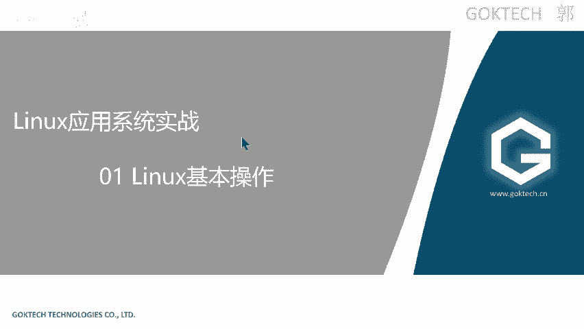

首先来讲一下啊我们的一个系统的一个发展哈。😊，其实呢最早时候我们的我们的一个电脑或者我们的计算器或者计算机嘛，生产出来的时后，应该是1945年左右，46年45年这个左右。当时世界上第一台什么计算机。

计算机后就计算器诞生了呃当时呢呃它这个比较大嘛。呃，基本上有好几个教师这么大啊，然后他用的时候也不是用的时候是那种呃也不算是晶体管，那时候呢，那个成本比较高啊，呃。😡，当时还没有集成电路出现的时候。

什么叫集成电路啊？当时它用的是那种有点类似晶体管哈，但是它不不算，它就只有一个亮面量和面两种状态。什么意思啊？就是只有0101两种变化。所以说为什么我们会用到二进制也是这个也是一个很大的原因。

为早期的时候，他算他在做这个做计算的时候，它根本原因还是通过计呃晶体管，它那个。😊，那个量和灭的一共两种状态来表示的啊。OK那直到什么呢？直到60年代末才出现世界上第一个操作系统。😡，啊。

真正意义上的一个操作系统啊，这个呢就是我们所谓的一个unux。这是世界上第一个操作系统。那么作为世界上第一个真正真正有意义的操作系统，后面出现的系统都或多或少都会受它的影响了。你比如说windows。

windows在还没有普普及之前，什么叫还没有普及之前呢？在。😡，我们那个。95年之前嘛95年之前95年之前windows全部都是字符界面，什么叫字符界面啊？😡，就是我们这个。哎，对，CMD。啊。

就这种页面。啊，就这种终端页面，它只能通过这种操作啊，那后面是随着什么鼠标的发明。😡，啊，应该说是什么图形化的发明，以及加上鼠标的发明，才能让我们的图形化走进到真正的走进到我们的一个生活之中。

但是呢因为什么呢？最开始的时候unux是字符界面的。😡，或者叫命令界面了。所以说windows其实或多或少都会受到影响。当时的那个叫什么dos。😡，当时在windows系统上告。啊，就dos，然后呢。

当时呢他是什么推正在大力推行一个dos3啊，dos3。然后呢，后面是因为什么呢？后面因为种种原因嘛啊偷偷的退出了windowswindow95嘛。😡，啊，这个应该或多或少都听过吧啊。

windows95啊。O。😊，unux，然后linux是什么呢？linux也是一种类似类似这个unux的一个系统。但是呢因为种种原因，他们有有点不一样。那我先介绍一下他们取源啊。

来给大家讲一下那一个它的一个学习的准备哈。linux作为一个开源免费的一个操作系统。什么叫开源啊。😊，开源就是开放源代码，什么什么意思啊？最简单你下载1个QQ软件。😡，你用1个QQ软件。

他会你说腾讯会把他的源代码发给你吗？😡，肯定不可能吧，因为QQ本身是一个闭源的软件。😡，当然他是不是纯碧原的，我们不知道，反正他不卖钱嘛，对吧？啊，但是呢你想你用它的，你用它的软件。

你的隐私是不是被他知道了？😡，这有理有弊嘛，免免费的他可能收集你一些信息也有可能嘛，对吧？你比如说你在上面聊一些聊一些东西，其实很很容易被发现了啊很容易被发现了。😡，啊，来免费啊。

就是说它是一种一款免费的，大家在用windows哈唉。😊，有些人说唉，老师，我windows也是免费了，其实不是啊哈，你的windows的钱已经包含在你买电脑的钱里面了。😊。

而且你用的windows是家庭版的。对吧家电板的意思是什么？就是啊功能比较low，功能比较lowok。😊，来。但是linux作为一个开源免费的操作系统，它稳定性非常强。😡，平常你们的。😡。

inux作为那个这个免费的操市充啊，它稳定性比较强。什么意思呢？你比如说我们家用的windows。😡，来给它开着，你一天你一天用多少多长的时间，你用多电脑用多长的时间。你一天有用12个小时吗？😡。

没有用12个小时。😡，嗯，没有用超过12小时，基本上都是不打游戏啊。😡，对吧还有说像我这样子的办公的嘛，对吧？OK正常情况下，我们的windows啊或者我们笔记本的话，应常一般情况下运行的时候。😊。

一般情况下我不会连续给他用，一整天都不会不会一整天都运行。但是呢linux作为一种呃这种服务器操作系统呢，基本上呢是7乘24小时。乘以365。什么意思啊？就全年无休。全年无休安全性。啊。

因为linux上的一些啊跟windows比较不一样的地方，所以它安全性比较重要。什么意思啊？😡，比如说有一些病毒啊，有一些病毒在windowswindows里面活的很好，但是在linux里面无法存活。

就是最简单的例子啊。来OK还有处理多并发了，多并发这个windows当然也有了啊，当然也有了很多什么呢？中型大型矩型项目全部都是使用的linux。😊，啊，windows是根本就派不上用场啊。

你想啊你平时用着用着电脑都蓝屏了。😡，啊，我自己在用的时候都能蓝屏。那你想一下，更不用说更不就是这种大型环境了啊，最简单的比如说像这样这类的厂商啊。😡，啊，最简单的这些都是什么？

比如说什么生心服安全厂商什么就生产那些安全设备的防火墙。😡，上网行为管理AC嘛。😡，真信不聊上网行为管理。什么叫上网行为管理，知道吗？😊，啊，不知道是吧，就是你你在你就是你在学校里面浏览任何网页。

人家都知道，你明白我意思吗？嗯，人家会记录啊这个。😡，不是不是。😡，现在国家已经规定了，你只要是呃符合一定的条件，都必须装。😡，这种上访行为管理。日志或者叫日志审计。😡，我分三啊。你可以上试试。

对吧不要跟我干，好吧。你学校你去删，你破不能了那个系统，你就删嘛，是吧？啊，只要你在用它的网络，一定一定一定是有这种日志审计的啊，这是必须的啊，这是必须的。😡，你看国际国家就这么规定的啊来。

还有什么绿盟啊，绿盟这家也是一家啊业内有名的安全厂商，像这种公司的都可以都可以去尝试一下啊，都挺不错的啊，都挺不错的。还有什么更不用说互联网公司的，你想带上一个淘宝，马上双十一就到了，各位。😡。

各位购物车已经满了没有没啊，没满，赶紧赶紧在加，反正。😊，差不多了就好了啊，是吧？😊，啊，淘宝你想双十一的时候几亿人对吧？在访问你的网站，为什么它不崩？😡。

对吧就是因为它后台呢大部分都是linux的服务器啊，装的linux的服务器，还有什么三代运商，这全部都是什么都是我们使用的这个。那你比如说什么什么什么岗位会用到linux呢，你比如说主机工程师。

系统工程师、运维工程师、安全工程师，这些全部都是要接触上linux会懂一点点。那我这里的话只要给他入一下门啊，linux的话比较难，但是呢很多时候呢，我们正常情况下，就像我这边标红的这句话。

你有时候适当的囫囫囵吞枣啊，比如说什么。😊，一定要去动手才能够学到哈，给大家推荐一本书啊，老比较老的书就是鸟哥的new史诗房太。😊，这是比较老的。鸟哥。这是比较老的，有些人也不想用这个啊，你百度一搜啊。

有时候人家不是推荐这一块，这款是这款是比较老的，比较老的，比较早期的一个11一本书，还有一个比较新的啊，linux都有哈，都有图书馆也可以借啊，图书馆也可以AG啊，拿来研究一下都没问题啊。

来我们来看一下它的发展的哈。其实最早的时候unux哈，最早的时候在6。😊，65年的时候，1965年的时候，刚好呢，他有一个计划，就是说想要什么呢？想要生产出多任路多用户的一个操作系统。

多任路就是我可以同时运行好几个程序，什么意思啊？你windows在windows在用的时候，有没有打开QQQQ打开的时候，同时在听歌，同时在。😡，浏览网页是不是可以同时运行，这个是多任务。😡。

多个用户是什么？同时有多个用户可以登录啊，windows里面需要打开一个功能，不然的话，windows你如果一个用户登就远程登上来的时候，会把原来的踢掉啊，会把原来的踢掉。好。

就反正有这么一个这么一个计划。当时呢是有三个什么三个机构在参加。😡，第一个是麻省理工。第二个是居域电通用电器啊，通用电器公司呢这一家居域这家公司呢，它的创始人之一是我们著名的发明家发明大王爱迪生。啊。

好，ADNT呢是一个什么呢？它底下有一个实验室叫诺贝尔实验室。😡，啊，不是不是贝尔实间室。记错了哈，很多贝尔就有点夸张了。贝尔实验室就发明电话的那个人啊，贝尔实验室啊里面的有。😡，几十项的。

发明专利啊几十项的发明专利获有几十个几十个诺贝尔奖的获得者啊。😊，69年的时候啊，就反正后面因为种种原因的啊，什么前没搞给到位啊之类，种种原因反正瘫痪了。最后直到这个69年的时候。

诞诞生了诞生的真正意义上的系统就是un啊，当时有这两个人发明出来了啊，这两个人呢叫肯汤普森和丹尼尔丹尼斯李奇啊，这两个人。😡，当时这个系统是用什么是用什么写的呢？汇编语言听过吗？😡，会编已也写了。

然后后面他们觉得麻烦。啊，换成了另外一种系统，或者说发明出了一种语言，写这个linux。啊，写这个unix，你们知道是什么语言吗？😊，就是你们必学的每个功课必学的C。😊，也就说这两个人。啊。

只是1元支付。就说你们现在学的这么辛苦的，都是这两个人。😊，当时为什么会发明出这个unic呢？是因为什么他玩那个玩游戏啊，呃其实也不让玩游戏啊，他有一款小程序叫做星球争霸。😊，啊。

当时他玩的时候觉得卡觉得卡。你一般情况下，我们觉得玩游戏觉得卡是干嘛？😡，换电脑嘛加呃不不要换电脑，太奢侈了是吧？加个内存条嘛，换个固态嘛，是吧是？😊，没错啊，人家直接发行出一个系统来。😡，啊，当时呢。

当时这个69年是一个特殊的时期。69是什么时候？😡，美族冷战。美苏冷战的时候，当时出现世界上第一个实验型的网络啊，叫做A。阿帕网。啊，app帕网啊是世界上第一个啊，没事啊。

第一世界上第一个实验型网络就在这边。当时呢上面运行的系统是什么？哎，错了，上面是运行的，就是我们的unix，然后它的一个网络协议是什么？它运行的网络协议刚开始的时候是那个NCP。😡。

就反正就是可以控制网络网络一个控制协议，就是了，他觉得不好用，后面变成了什么，后面给他改了，改了什么TCPIP。😡，TCPIRP也就是说TCPIP协议是最早的时候是诞诞生在哪里啊？诞生unixux里面。

所以说unix的一个系统功能非常强大，网络功能非常强大。什么叫TCPIP啊？😊，啊，正常情况下，我们上网的时候是需要网卡的对吧？啊，你们电脑有几张网卡？😊，两张一般情况下就两张，除非你的电脑比较薄。

像我这样子的超薄本就一张。😡，一般情况下，你们电脑应该有两张网卡，一张就是有线网卡。😡，什么样有线网卡，你你瞅一瞅你的电脑里面有没有个接网线的口。😡，它里面其其实是一一个芯片啊，里面是一张芯片。

我们来看一下网卡是长什么样子啊。😊，稍等。这是一个台式机的网卡，笔记本呢当然比这个小。😡，它里面这个什么。😡，里面这些是一个电路板，上面有芯片。😡，插在我们的主板上面，然后呢。

在外面只露出了一个只露出了一个网线的接口，这个就是网卡，有线网卡。😡，好，O。还有一种叫什么？😡，不要走谁啊，我要打瞌睡呀。😡，还有一种叫无线无线网卡，无线网卡其实做白了是一个小芯片。😡。

一张非常小的芯片，它可以发射无限。可以去连我们的无线啊，就是我wifi嘛，我通俗易懂的来讲就是wifi。😡，还有一种就是什么玛呀。blueooth，blueooth。好。

如果说你的电脑是有需你的电脑没有蓝牙，但是你有需要你想要用到牙蓝牙怎么办呢？你可以换把这张无线网卡给它换掉。😡，换成一张可以集可以集成什么？😡，连wifi了又可以什么连蓝牙了可以的，这个是可以实现的啊。

就把你把那张无线网卡换掉就可以。非常小的一个啊。当然你要你要匹配你的主板啊，你不要拿一个不匹配你的主板的那肯定不行了啊，可以肯定要考虑到兼容系统问题。😊，好，那我说这个干嘛？😡，在我这边呢。

我是用无线的。😡，无线的网卡来看着。😊，这边这张无线网卡，我们看一下这个属性这边呢。在这个地方呢？😡，它有一个什么TCPIPV4的啊，这个就是我们配置IP地址的地方。一般情况它是自动获取的。

什么叫配置IP地址啊？一切呢如只要你能要想要联网，就必须要有IP地址。😡，就必须要有IP地址。包括以后你你们什么现在我们不是都宣传什么物联网时代吗？物联网想要普及必须也要用到什么IPVIP的技术。

但是它是IPV6。😡，IPP6啊IPP6这种技术，那这个呢就比较久呃比较比较早了啊，比较早了哈。以前说什么？因为想要普及这种什么物联网等各种高新技术，你首先要确保它安全性。😊，以前勒索病毒吧。

去年的时候勒索病毒刚刚出来的时候。😡，就是那个。红色病毒那个勒索病毒嘛，当出来时候当时出现出了一个状况，出了一张有趣的图嘛，就我的我使用当我使用我想要使用物物联网的时候，不是。😡。

到时候大家用的都是人工的智能家居嘛，智能这是最最简最简单的一个体现嘛，就是智能家居。你比如说啊。😡，打开冰箱嘛，或者说什么想要想要上厕所，或者想想要怎样，你只要喊一句句话就可以了嘛。

或者说给他下达一个指令就可以了。那如果你们有没有想过，如果他中病毒会怎么了？😊，当你快快憋不住的时候。啊，打开厕所门，结果这个门被劫持了，你感受一下。😡，他说跟你说什么，想使用厕所请支付。45比特比。

能感受一下啊啊，想出去请支付多少个钱啊，所以说安全中安全肯定是非常重要的。但是我们这种网络我们肯定要了解一下，清楚一下啊，这些原理其实都有啊。来再来我们看一下啊。😊，啊，这个最早的时候，它配置啊好。😊。

69年代的到70年代的时候呢，叫unic元年呢。😡，unux元年了。就是什么呢？70年的时候正式的诞生unixux。

正式使用我们的时间哈我们的时间很多系我们系统的时间是其实其实有时候就是从1970年1月1日0。0分开始计算的。😊，我们电脑上面不是有主板吗？主板上面不是有个电池吗？😡，呃，不知道是吧？我给大家普及一下。

比如说我电脑关机了，没有接电，没有接电，电源给它抠掉。为什么说我开机的时候，它时间是对的？就是因为我们主板上面有一个电池。如果我们我把那个电池给它抠掉。😡，那么你你开机的时候。

你的时间是1970年1月1号0点0分。啊，或者说什么当你开机的时候，你发现你的时间是1970年，那说明你的电池没电了，你要给他换一个就可以了。但是这种电池的话，一般情况下能够使用7年呃，777怎么比。

😡，啊，77年啊。7年不是这样比的吗啊。😡，这是8了。😡，这8嘛，这7嘛，对吧啊。😡，一般情况下这种一般情况下，这种电池。😡，电池的话可以使用7年。如果当你发现你开机的时候是1970年，那说明什么呀？

😡，那说明你的电池没电了，你换一个就好了啊。😊，好，71年的时候正式开始发展了啊，来再来看一下lininux啊。😊，这个人啊不是比亚盖茨啊，我要看错了啊。😡，长得有点像发胖版的，比较干。

这个人现在还活着。😡，啊，前一段时间F火。😊，火了一段时间呢，他就对对着媒体诉了终指嘛，我不知道为什么什么原因竖了终止啊，你们可以去研究一下这个这这这这个这个新闻啊，这个叫米娜斯。😡，这个人呢？你。

纳斯。明白我的意思吧？😡，啊，懂吗？啊，当时他不知道什么原因啊，这个很老了啊，包括比尔盖茨，你去看他们最新的照片，因为你们以前。😡，以前接收到了比尔开茨的信息，其实都是很年轻的，都是这样你你现在去一搜。

现在基本上都已经很老了哈。比尔盖茨啊呃这个尼纳斯啊这些都很老了。😡，啊，当时这个人想要学习OS操作啊系统的一个设计。但是因为一些种种原因嘛，资源不够啊之类的啊，资源不够的，他就去买呀，他就去买。

因为你没没有设备给你做操作系统的实验了，怎么办？他花钱去买，当时他是怎么花钱的，分期付款。😡，分期买了一款迷你这种什么minux系统，这个也是一个unux unux的一个分支。😡，啊，minux系统。

但是因为它功能比较简单，性能不足啊，这个系统就是很low的那种啊很low的那种。所以说大家直接针对什么呢？底层做一个什么直接开发，直接从从底层开始开发啊，就是类似这种单片机啊啊，没有学过单片机也没关系。

它反正就是重新开发，它不要用你的系统，重新开发，开发出了一款呃，具有什么终端功能啊，可以可以反正可以联网嘛，可以联网，可以登录到学校的系统里面啊，可以干嘛呢？收发电子邮件，可以干嘛呢？

参加一些讨论组之类的啊，还可以干嘛了，它要下载一些驱动，什么叫驱动啊。😡，你们知道什么叫驱动吗？😡，比如说你们第一次插U盘到你的电脑的时候，它会不会显示正在加载驱动？对吧。驱动所要驱动就是什么？😡。

让系统可以更好的去使用硬件，这个叫驱动。啊。所以说呢他就是在这种情况下发明了一个系统，就是什么？linux虽然呢它跟它的页面跟unux很像，但是实际上它底层完全不一样啊完全不一样，代码完全不一样。

这个人很很有意思啊。😡，我们看中间这段话，尽管当时托尔斯啊托尔斯里亚斯嘛啊，他全称嘛已经欠了大约5000美金。😡，在什么时候啊？1990年90年代欠欠了5000美金。😡，5000美金什么概念？😡。

你们现在可以想象，500000美金放在我们现在多吗？😡，一定是外上。3万吧。😡，3万多吧，对吧？有些有些有些同学可能。😊，呃，一个大学可能就不止花了一个3万了吧啊，可能啊可能更多，是不是啊？😊，他。

发明了这个系统之后，坚持什么开源。😡，任何人都可以免费使用，并且呢你都可以对他修改。因为我代码开放给你嘛，但是你修改的之后必接公布出来。如果你不你。😡，不遵守呢，那你就不要用了，说白了就是说什么。😡。

我免费给你。😡，啊，我们免免费给你给你用啊。😊，嚟。这个东西呢就好比什么刚开始的时候，因为大家都是开源的嘛，他吸引了什么当时真正的黑客。😡，吸引了当时真正的黑客，吸引了当时真正的黑客啊，多几百位啊。

百来位黑客。但是呢因为什么呢？因为他没有钱嘛，你本本身就不是一个盈利的一个工具。😡，本身就不是一个，就好换句话中了。😡，我让你来帮我干活。😡，不给钱，你愿意吗？有时候人人情关系走一走嘛，是吧。

免费帮我一次没关系嘛。那我如果我让你免费帮我干半年呢。😡，肯定是有有些人就不愿意了嘛，是吧？有些人就不愿意了，因为你没有任何没有没有获利的事情，他怎么可能会去做呢？对吧？所以说怎么呢？

后面呢他是什么加入一个组织啊，这个组织呢大家有兴趣了解一下就好了哈，这是一个什么呢？😡，你卖的时你可以卖来钱卖钱啊，你可以卖钱。😡，你可以卖钱，你可以把这个系统拿来卖，但是你不能藏着掖着。😡。

什么意思啊？就你卖的时候，你不你要全部卖给他什么意思啊？就比如说QQ这个软这个软件你可以拿来卖。但是呢卖卖给我之后，你必须把源代码给我。😡，明白我意思吧？😡，好，从此呢就走上了一个康庄大道啊来。😊。

我给大家理一下这些呃linux的一个常见的发行版本啊。因为linux其实有很多种版本了啊来。😊，这里一个这里这两个都是宏贸公司的。😡，啊，了解一下就好了啊。大家如果说有lininux系统。

我给大家理一下它为什么说东为什么linux这么多啊，因为它免费的嘛，免费谁都谁都可以对你那是那个提出来那个linux进行二次开发嘛。它自己二次开发就是自己的啊，明白我的意思吧？来首先第一点。

红帽刚开始的时候推行的时候，红帽红帽这个系统哈，其实它也是免费的。后面因为他想走高端路线。😡，所以说这个红帽什么企业版就是所谓的标收费版本。同时呢它这个是针对于企业的，同时做针对于个人用户的。

它就免费的版本，就这个。😡，飞到了。这个是免费的。但因为什么呢？企业版功能比较多嘛，你想你知道吗？家庭版和企业版功能肯定是有差的啊，家庭版就所谓的阉割吧，就把功功能给阉割了。好OK。😡。

后面呢出了这个汕头OS。😡，三头OS是红帽。😡，红帽这个什么收费版本的克隆版本免费的，克隆版本是免费的，功能没有功能都有。但是呢你比如说我发明了呃我我开发了一个程序叫做。😡，某Q开头的啊某Q开头的程序。

😡，这个程序呢是新的嘛，可能有bug嘛。没关系，我先给你放到这个社区里面。😡，让你免费用。啊，那我偷偷偷偷收收集那个呃偷偷收集bug嘛，然后收集完bug之后呢，干嘛？😡，我把它修复了，修复完之后呢。

变成到时候他bug很少的时候，或者几乎没有bug的时候，我再给它放到这个。😡，企业版中拿拿来卖。所以说有人认为我人说什么s斗OS是红帽的实验场。😡，啊，时间长啊，就是就是这个道理。

OK这些都是哄帽体系的，命令体系基本上都是差不多了。好，接下来说一点不一样了，就是。😡，Depend。😡，dependd体系它是一个什么？唯一由非商业组织维护的linuxux发行版本功能比较强大。😡。

啊，像前面这几个都是免费的，前在前面几个都是免费的，都是可以免费安装，免费使用的。但是呢。😡，你只要使用它部分的功能，它部分的功能是收费的，你下载没有任何关系，你下载都可以用。

但是如果你要使用它部分的功能，它就收费了。😡，最简单的道理嘛。😡，你QQ是不是免费的？😡，超级会员。😡，是不是要充钱啊，而且充完钱它是功能是不是更多啊？难道？😡，难道他QQ本身没有这个功能吗？肯定有吗？

只是你充完钱之后，那个功能才对你开放嘛，是不是这个道理？难道你充完超Q啊，错了，不是超Q啊，超Q是好早之前啊，难道你充完超级会员之后还要重新下载QQ吗？肯定不用嘛，就是那些功能本来就有了嘛。

它只是对你开放了嘛。那这里也是一样的，收费版面也是这种道理。好OK那我们来看一下一个真的是非盈利组织的啊，非盈利组织啊，就是这个denddependbd，你可能不懂，是不是？

来再来看一下欧班图欧班图可能就听过了吧？我告诉你欧班图跟那个dependbend是什么意思啊。😡，乌班图是基于dependbdunstableable的版本加强而来的，它的图形化功能非常强大。

它们的一个体系都是一样的。这两个的体系命令体系是基本上差不多了啊差不多了啊。😡，ok。在。😡，还有欧洲体系的叫苏悉。啊，苏喜这个也是收费版本，还有open su喜。

这是就是就是在那个那个那个那个欧洲那边比较流行了啊，欧洲比较流行了。好，那我们的卡利呢？😊，卡利西乌班图开发而来的。是乌判主习体系。5般都是题。来如果说你要使用linkux，我给大家介绍。

我给大家分一下类。😡，如果你是用来作为常用的系统。就是你真的要拿来日常办公，日常使用的，我推荐你使用误办助体器。😡，乌斑图体系就图形化比较功能比较强大。乌斑图体系的话呢，其实呢很多啊像国产的 deep。

😡，麒麟。麒麟。啊，麒麟。啊，麒麟啊，像这些是国产的，你拿来用没关系。如果你是想要学，你要想要学这inows版本，ok我推荐你使用红帽。😡，只要你学完红帽了，基本上操作卡利啊，这种都没有任何问题啊。😡。

ok。linux跟winunux的区别是什么呢？😡，unux历比较早哈，linux思想来源unux好，我再告诉大家一下，unux基本上是跟我们的服务是一种商业商业软件，是闭源的，闭源的闭源是什么意思啊？

就是不开放源代码。所以说你不知道它里面是什么东西啊，你不知道它里面是什么东西OK那linux呢是开放的啊，开放的。😊，好，这是他吉祥物。啊。据说是李那师被小时候被企鹅咬过。TUX tubes啊tes。

其要是早早期。啊。早期那个那个那个被企鹅咬咬咬过哈，所以说什么因阴恨深爱啊，所以说哪些啊设置为它的吉祥物这个可以查到啊，这个叫TUX啊ts啊。😊，这是他吉祥物啊。okK那我们废话不多说，来介再介绍一下。

😊，基本上我们内我们的系统基本上也组成这么几个部分啊，了解一下作为常识啊，其实这些都是常识啊。好，OK我们的系统一盘组成有这么几个啊，不仅是这个linux啊，很多系统都是这样，首先内核。😡。

命令界面需要我们的这个是什么系统的用户界面了，像windows的用户界面是什么？是我们的图形化界面嘛啊，它是什么这种字符界面，还有文件系统。😡，文件系统的意思是什么？

文件存放在磁盘等存储设备上的组织方法。什么什么叫组织方法？😡，这个东西就好比就存文件。你比如说你有个档光档案柜哈，你平时的习惯是从上到下这样子存嘛。那你那你如果要想要想要去读一个文件的时候。

你是不是也要从上往下来读？😡，啊，一样的道理。那它也是一样的。你比如说是从上往下这样子排的那你取的时候也是要从上往下。如果你是从左往右这样子来排的话呢啊，那你肯定取的时候就要按按从左往右的顺序啊。😡。

大家用过格式化没有？😡，你你用过那个U盘格式化过没有？😡，啊，其实格式化不是把所有的数据敲销毁了啊，它是把格式转了一遍。😡，变得你找看不懂他原来的排序，看不懂原来的排序，你是自然而然，它就显示为0。😡。

自然而然就显示为0了好，格式化其实并不是并不会有什么影响。格式化之所以很快，它就是什么原来的数据其实是还在的。你想为什么我我们。😡，有数据恢复这种概念。为什么这个数据恢复这种这种行业这么兴兴盛？

就是因为什么？如果你电脑不小心格式化了啊，或者不小心删除了，你不要动，马上让人家用数据恢复还可以找得回来。因为这些数据，你在你在这你这个盘里面的存放数据是一定的。就你的存放数据，你比如说这张盘。😡。

比如这是你U盘了，它存放的数据是这样了，它的一个顺序是这样子了。😡，你比如说他原来存放在这里嘛。😡，你不小心把它删了。😡，你不小心把它杀了，你不要去动，马上去恢复，还是可以找找回来。

因为这个地方没有写数据啊。😡，这个地方虽然删了它，但他有写数据吗？没有就可以恢复了回来。但是如果你这时候不小心写了数据，因为它删的是这个地方嘛，有很大的概率会写的时候，你继续往里面写东西的时候。

有很大的概率会写到这边，写到这边的意思就正式把原来的覆盖掉，这个叫覆盖写。😡，呃，写错了啊，覆盖啊是这个哈。😊，就真的这个就所谓的覆盖性，就把原来的给它覆盖掉了。😡，覆盖掉，你就真的基本上找不回来了。

😡，还有一种还有一种是恢复不了了。就是你硬盘损坏，物理损坏。我不知道之前有没有给你们讲过。😡，就有一个认识的，我不说他是谁，你们也不认识，就有一个认识的。😡，啊，是吧。对对对。😊。

这不小心把把自己的笔记本做烂了嘛。😡，然后去恢复的时候花了2000块钱啊，恢复不到几个G的内容啊，说的就这个。😊，啊。ok。好。系。还有一个就是应用系统，我就不多说了，就是应用。

说白了就是我们的APP好，内核是什么意思啊？来，我们打开我们的C盘。😊，比如说我系统是装在C盘里面的吧。😡，难道我的。😡，我的系统就真的这么大吗？其实并没有吧。😡，这里涉及到一个内核的概念。😡。

这里是这样一个内核的概念，内核是系统的核心啊。😊，好，这个是大家理解一下就好了啊。😊，有没有有没有试过win7升升win10啊？前几年winwinwin7升win10的时候比较热热门嘛，你升级完之后。

你的程序还在吗？还在吧还在了，为什么？因为它升的就是内核，它没有把你完全没有把你整个系统全部替换掉，它只升级你的内核。内核的话，一般情况下只有几百兆几百兆只有几百兆不大啊不大。😡，啊，内核版本怎么看呢？

就我们打开CMD。😊，这是内核的版本。CMT就能够看得到我们的内核版本。还有啊那这里有张图啊。😡，看得清吗？首先中间是我的硬件，什么叫硬件知道了，我就不多说了，然后里面呢。😡，运行呢说白了就是我的内核。

现在给你们普及一个概念啊，我们我们系统为什么能够运行起来？是因为我把C盘里面的内核内核的文件嘛加载到我的运行内存里面。😡，加载到我的内存里面了，好吧？加载我的内存里面，然后呢才可以正式正式运行啊OK。

😡，但是呢内核的话我们基本上是看不了了，怎么办呢？啊？它就有一个什么Cll界面，就通过这种字符哈，通过这种命令可以干嘛呢？通过这些字符界面啊，通这个这个字符啊。

这种Cll可以将我用户的用户的命令转成什么呢？系统可以识别的命令。😡，好，你比如说你要存一个文件，为什么能存呢？就是因为中间这一层C啊，看着啊，我我们看一下它官方的说法。😡，是系统的用户界面。

提供的用户和内核进行交互操作的一个接口。啊，我我能够把用户这个能够把用户的。程序转成什么内核可以看得懂的命令啊，内核呢可以将内核的一个操作啊显示给我用户来看。你比如说我双击为什么它能够运行。

是因为双击这个命令被解释成了，可以解释成了内核可以看得懂的语言嘛。然后呢，它给我反馈一个什么弹窗嘛，就是我们内核给我反馈出来啊。OK。😊，来，这是我们linux的一般结构啊。😡，来。😊。

跟windows有什么不一样的地方？😡，windows有好CDEF盘好好几个盘嘛。😡，来，我告诉你。😡，它不一样，你想要就比如说这边有个文件啊。😡，你只能通过这个。这个叫根分区。😡。

你只能从唯唯一的入口，唯一的入口。这样子进进进进才能够访问这个文件，明白我意思吧？那你这个不一样，你windows不一样。😡，你比如说在C盘，你就从C盘进，你在D盘，你就从D盘进，明白吧？OK。😡。

这是它的一般结构。一般结构。但是他这个是逻辑的，你看得懂吗？😡，你你这个是它的一个逻辑的逻辑的一个呃结构图嘛，你必须给它挂一个什么硬盘。😡，比如说我你归根到底，是不是要存在硬盘里面？😡。

那我拿一个硬盘给它挂载，然挂在这边。这样子的话，我进到这个跟风区，其实说白了就是相当于进入到这个硬盘里面。😡，我所有的东西都放在这个硬盘里面。啊。好。这时候呢啊这个是之前的老老图了哈。来。

这里我想讲的是什么？首先你们装装完BVR，因为我们我们做实验的时候是在我们BVR的一个系统里面嘛，对吧？所以说首先呢你这两个服务器必须给我打开。😡，好，这时候我给大家讲一点难的东西啊，难的东西。来。

打个字啊。啊打个字啊。但不是这个。没有。清楚。这个我也讲过吗？😡，调节NAT。和紧主机模式我有讲过吗？OK好，那行，那我们来讲一下啊。😊，来。你又可是跟我。英军，我要我要打瞌睡啊。来。

6格的一个上网方式或者vi微亚的一个上网虚拟机的上网方式啊。其实呢它主要分为这三类。第一种就是什么呀啊调节。😡，第二种就是紧主机。第三种叫NAT。来调接的意思是什么呢？😡，好。比如说我们的电脑是什么？

现在我的电脑现在是无线嘛，无线上网嘛，那我干嘛呢？这是我的虚拟机嘛。😡。

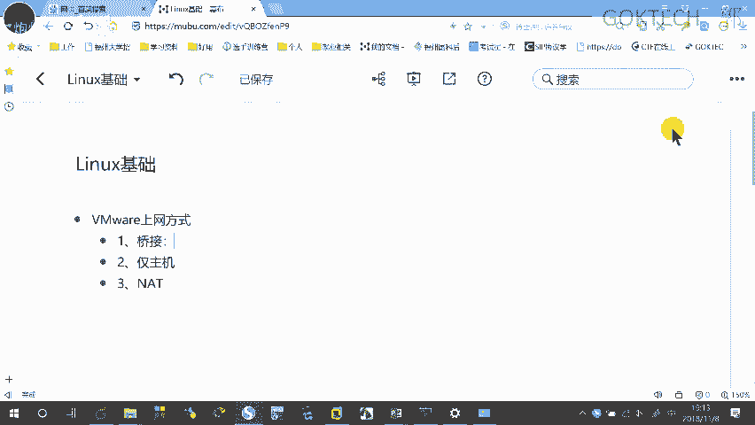

好，来，我右键虚拟机啊，这边有个设置嘛，注意看啊，右键虚拟机这边有个设置啊。😊，设置完之后呢，我们打点一下哈，点一下它会弹出这么一个窗。那这里有一个什么网络适配信码，我们把它选择一下。

选择使用什么调节方式。😊。

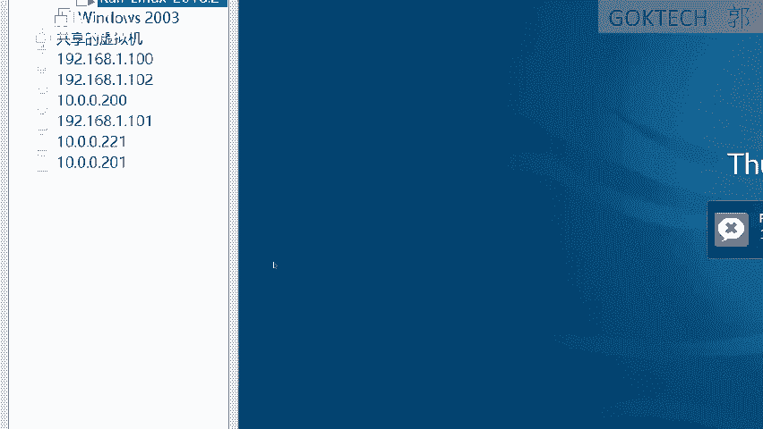

确认。调节方式是什么意思啊？选择桥接方式，相当于上网方式与什么呢？上网方式与。物理机相同。啊，物理级相同知道吧？什么意思啊？你比如说我能上网吗，他也能上网，我不能上网，他也上不了网。😡，啊。

IP地址是由。IP是由是由什么呢啊？😡，环境分配了啊。网络公司网络分配的。可以吗？什么意思啊？我这台电脑。😡，上网是连着公司的wifi嘛。😡，那这个虚拟机也是一样了，就跟我这个一样OK。😡，选择如果。

物理机有什么呢？😡，啊，使用无线和有线。同时上网。啊，这怕是。啊。连着无线又连着有线来上网，什么意思啊？插的网线又连着无线，明白我的意思吧？好，那此时就要选择此时需要选择桥接。😡，到什么网络？

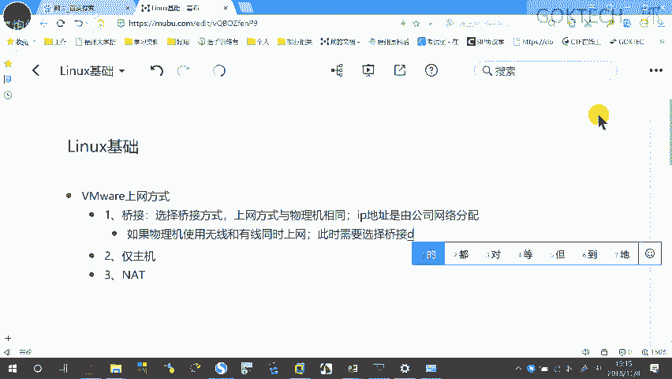

怎么选择啊？看下啊，虚拟机这边有一个编辑。😡，虚拟网络编辑器。

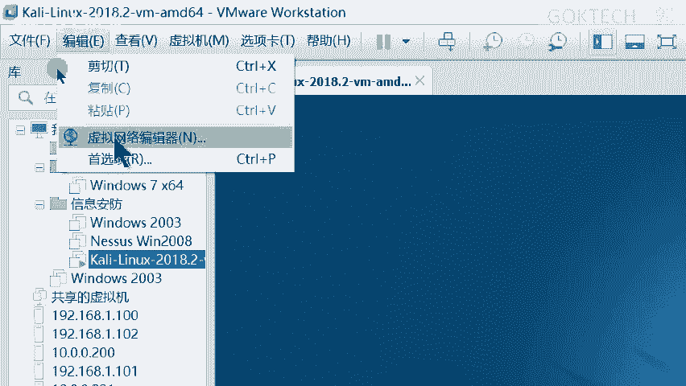

好，如果你们这边只显的只显示了两个哈，只显示了两个，你这底下这种这这里这个大概这个地方会显示说啊以管理员身份运行，你点一下更改就可以了啊。OK来，现在我要选择调接嘛，我要设置调接嘛。

调节点一下这里有个调节到哪里。你可以选择调节到有线，你可以调节到无线，最好不要点自动，点自动会有问题的啊，你最好点到啊，相关的一个，比如说我是无线上网嘛，那你一定要你选择的那个网卡一定是这样的。

一定是有这个标志的。😡，VRD是无限的标志。或者怎么啦？😡，802。11这种标志。有这些标志的一定是无限。啊，那如果是有线的，有线的，比如说什么GBE。😡，千兆的嘛，GBE这种千兆以太网嘛。

GBE的这种类似字典的就是有线。😡，那其他的都是虚拟的啊，其他的都虚拟的好。Okay。停主机模式是什么意思啊？😡，警主席非常好理解，只能跟。😡，虚拟机只能。与物理机同行无法上网。啊。

你没法上网了没法上网啊NAT呢？😡，可以上网。首先呢明确一下，可以上网。但是呢与。物理机网络不同。想要访问啊想要啊，就这样就好了啊，就说这个NAT呢你可以上网，但是与物理网络不同，什么意思啊？😡，呃。

我想一下啊，来。😊，虚拟机可以访问。啊，公司网络。全网络的就大概是这样啊，这个NAT的功能，所以你就可以访问公司的网络。但是。😡，公司。网络的。其他人。是无法访问这台虚拟机的。他现在做了一个隔离。

相当于。啊，内外网。嗰り。什么叫内网隔离啊？现在是内外网啊。😊，说白了就什么内网。😡，可以访问外网。外网。不能。访问。内网。什么意思啊？比如说我电脑，我现在电脑我连的网络就是内网，我想要我能不能去上网。

😡，我能不能访问百度？😡，我能访问百度，这个就是什么内网访问外网。那你说百度能不能来访问我？😡，不可能的吧，所。😡，要是百度能够时时不时的来访问我我这台电脑早早就已经崩溃了啊啊，明白我意思啊。😡，好。

这这里有画了一张图哈。😊，调件啊，这是公司的网络，这个中间这台大的哈，看到啊中间这台大的叫公司的网络啊，叫局域网啊，公司的网络我们知道一下就好了。😊，调节方式是什么意思啊？这台是我的win10。😡。

注意看啊。就我的电脑嘛，然后呢，这两台是我的虚拟机一虚拟机2。😡，他们相相当于调节，就相当于连到一台虚拟的交换机上。😡，然后呢。一起去上网，就相当于什么？这一台是真的一台虚拟真的一台电脑，真的一台电脑。

我可以跟你吗？😡，你看着啊。假设假设这是我吧，这是一名嘛，一名的电脑。那我这种上网方式相当于什么呢？我这台电脑可以访问一名的电脑，一名的电脑也可以访问我的虚拟机。😡，明白我思吧？

相当于调节就相当于公司网络的一台电脑。😡，那来我们这个只是举一个例子嘛，那么我们换到换到你们的学校是不是也是一样的，相当于学校里面的一台真实的电脑一样的。但是有一个比较坑的地方。😡。

就是你们学校啊不允许你们使用桥接。😡，为什么？😡，我这台win10是不是要获取1个IP地址啊？😡，就从从这个公司的网络里面获取1个IP地址，打个比方嘛，来。😡，那我如果开了一台虚拟机是条件的。

我也要从你那边获取1个IP地址。😡，那你说你你你你在你们在学校的网络啊，你们学校的网络可以允许你们电脑，你们是无线还是有线上网？😡，无线上网是吧？无线上网那就无所谓。如果是早期的用有线的哈。

有线早期有线是通过那个客户端嘛。😡，像比如说一些锐捷客户端或者其他的客户端嘛啊，它是会做限制的，就是就什么意思啊？你有些连上来嘛，它是不允许你发射wifi的。😡，就我们的电脑可以往外发射wifi知道吧？

啊，就比如说呃那个什么wifi共享大师。😡，呃，360大师啊，共享大师还有什么猎豹wifi好像是这样，以前我们各种我们疯了一样，各种各种研究啊，说研究哪一个wifi不会不会被识别掉啊，不会被识识别到。

O那如果说你如果你学校有这个限制嘛，就相当于你就就其实说白了就是什么他只允许你获取一个IP地址，你如果再获几个，就说明他你这个你比如说说白了就是你花一花钱嘛，你不是要连那个有些你不是要花钱的嘛。

要买套餐嘛。那如果我如果我我用一个账号，我比如比如说我嘛比如说我花钱去可以用的嘛，我接到他网络里面嘛，然后我发这一个共共享wifi给你们十几个人来用，是二0个人来用二十几个人来用。

是不是相来我用一分钱买来二十几个人可以上网，真但是他它是亏的嘛，对吧？它是亏的。所以说有这种限制嘛。那如果说在学校里面没问题的话，那我们ok啊，但是我最好我劝你们你以后如果。😡，做相应的安全实验。

最好是用你们手机热点。😡，啊，否则很容易记大过处分一次啊。😡，好，O。😊，啊啊，就曾经有人。😡，曾经有人那个用扫描器嘛。😡，去扫描自自己学校内网。😡，啊。然后第二天就是处分一次。懂我意思吧？啊。

学在网络里一家一抓一个稳。😡，啊，你屁股没擦干净的话，一抓一个吻啊啊，不不说这个。😊，仅主机模式是什么意思啊？就是相当于它原来我们是你看下，原来我们条件是。😡。

都可以往都可以往这个去往外外面的这条链路可都可以走吧，但现在不一样啊，看着啊。😡，是不是我这样子能只能自己一个人来相互通信了，我自己的电脑就是我自己的电脑可以上网。

但是在虚拟机之间可到只能跟虚拟机之间只能跟我自进通信，它就没办法上网。OK来我们再看这个哈。😡，NAT是什么意思啊？NAT相当于在外面加了一个什么防火墙。😡，你可以认为是一个防火墙，没有任何关系。😡。

防火墙什么意思啊？😡，你想访问外面没有任何问题。😡，别人想要保问你必须经过我的这个NAD防火墙。😡，那默认情况下是拒绝的。😡，别人想主动访问你的话，你是不行那？不允许的，防火墙给你拒绝掉了。

那你怎么办呢？啊，你就怎么样？相当于这个是一个内部网络。😡，内部网络。我来访问你，偷偷给你发一个。😡，链接啊，我偷偷给你发一个链接，病毒链接啊，然后你你你不小心点进去了，中毒了。

然后你要找我找我的时候打不进来啊，看。😡，唉。嚟。好。这是简单的一个过程啊简单的过程。啊，这张过程了解一下就好了啊。家解，好玩笑啊。接下真的来讲一下它的一个linux的一个操作了啊，5块下时间。😊。

OK差不多啊，那我这里稍微提一下。第一点。linux一定是区分大小写了。windows会区分大小节吗？😡，不会非常简单，容易操作的。你比如说我在这边新建一个哈，新建一个文档叫做A。😊，啊。

那我再新建一个文档。TST文本。对吧叫大A，它一定会提示什么？好了啊，知道都了解啊，都知道，我们不要理他啊。😡，O还有什么隐藏文件，比如说你有些。😡，我就不想让人看到了。😡，啊。

不想让人家看到你怎么办呢？😡，你可以把它隐藏起来嘛？右键属性。😡，啊，这里有一个什么隐藏。给它勾起来。确定。啊。他都没了是吧，怎么看呢？怎么看呢？这里有个查看是吧，这里有个什么隐藏的项目是吧？

你给他点一下，哎，我点了吗？😡，啊点了啊是不是隐藏了？来，我新建一个，你看一下它们的区别啊。😡，好像。😊，好像看的不是很清楚啊。😡，对，这个地方比较淡，这个地方比较什么深。啊，比较深。ok。

那有些人呢是不是学到一招了？我平时的时候把它隐藏起来。那我想要看的时候，我再把它勾上啊，有些人心里肯定是这么想的，是吧？😡，好，来，我们来看往下看了。你比如说在线下研究啊。

你比如说什么在lininux里面是怎么做的呢？来，我给大家看一下啊。😡，然后看一下，稍等一下啊。我touch啊touch是第一条命令，创建一个文本。touch。😡，创建一个什么小A在这个地方看得到吗？

我放大一下可以吗？😡，好，touch一个大A可以吗？那我想要查看它，我想用命令的方式查看它叫什么LSLS等于list。😡，list史上就是列出。😡，列出把这些信息列出来，明白我的意思吗？SS看一下。😡。

有没有一个大A有没有个小A，有没有一个大A呀？😊，有吧？还有一个什么呢？是因为它不识别中文嘛，所以说这个地方有一些乱码啊，我们不不管它不管它啊，再来。😡，我创建一个注意啊点小B。有吗？有吗？

看不到是是LS。😡，看得到吗？看不到，现在我用一条。参数用一个参数。什么叫参数啊？参数的功能就是为了。😡，让命令更加的好用。😡，啊，增强他命令的一个功能。这是参数的作用。回家。能不能看到一个点？小B呀。

在这个地方可以吗？依为，你干嘛眼睛眯成这样？😡，没戴眼镜是吧？😡，啊。先听一下啊，先听没关系，到时候。拿回去看啊。录屏拿回去看就是了啊来。这个可以看得出来了。okK还有一条命令啊，你比如说你打个比方啊。

比如说你看到touch。😡，C。D。大家注意看我想创建一个文件，叫做C空格D。😡，有没有可能？在windows里面怎么做？😡，C空格D嘛。有没有问题？😡，没有啊，但是在这个地方呢。😡。

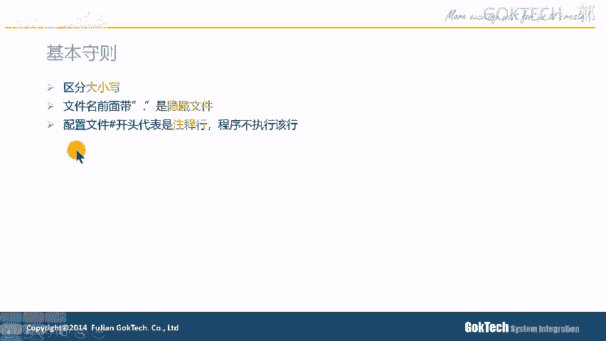

他怎么做了？😡，就这样了。😡，你回车的时候，你会发现什么啊？它是创建出两个文件，因为空格在这里面是有特殊含义的。啊，特殊行义的啊，你必须。啊，把这个。空格让它变成普通的。制符就是在这边加一个反斜杠。

我一般认我一般是这样。😡，这样规定的这个是斜杠。这个是反斜杠，这个是横杠或者是减号。因为它是一个8嘛，八是先撇嘛，所以就叫斜杠。那另外一个就是反斜杠嘛啊。😡，我只是这样规定而已啊，我喜欢习惯这样子。

如果这样子的话呢，反斜看啊，我们回车就会真的是创建一个C空格D的一个文件。😊，这是因为它这个空格本身是有特殊含义的，就是连续创建多个文件啊。😡，好，那你来看一下，我想显示嘛，查看LS嘛，是不是？😊，哎。

你看到没有？这就是一整个文件。好，我有这么一个命令啊，我有这么一个参数啊。😡，哎，稍等一下啊。

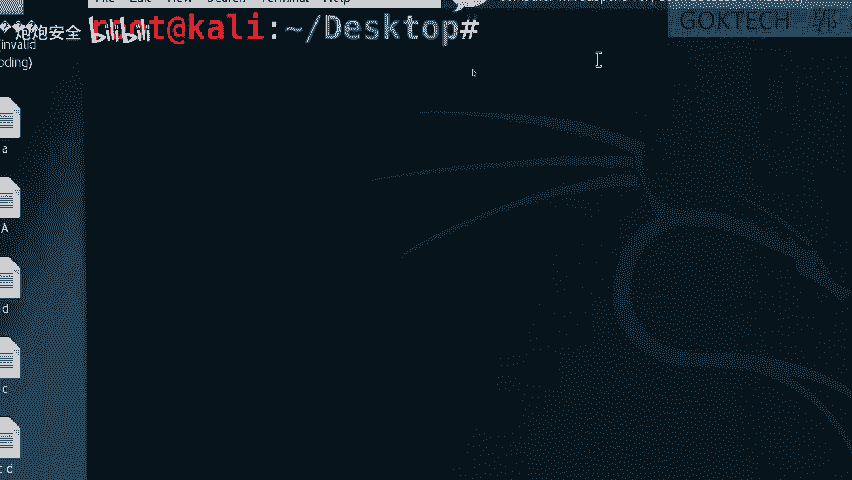

我有这么一个命例，LIS哎LIS杠L是每一行显示一个文件，看着啊。😊，A小AD这样子就也也会比较好看一点。而且呢你看到这个是那一个什么大小啊，大小啊，就是它大小。😊，还有包含的文件。

你比如说这个目录里面有21个文件啊，你比如说这个目录里面大小是这么大啊，大小是这么大，这是它的一个什么容量啊，创建的时间，创建的时间都可以看得到啊。😡，O来。比如说有一些文件哈是。什么叫注视行，知道吗？

😡，朱思涵知道吗？你比如说你解C语言的时候，是不是就有斜杠双斜杠来或者说斜杠星号在星号斜杠。😊，是吧作为注释嘛，那一样的，它这边的注释是什么？用井号开头。前开就表示斜杠。还有怎么了？

它的斜杠这里的斜杠表示什么？doss里面的反斜杠就是路径，就是我们路径。dos就是我们windows啊，你看一下，我随便打开一个路径。😡，你看着。是是反斜杠。啊，我再放大一点点。哎，这个还没法放大。啊。

那凑合着看啊，OK那它的路径就是斜杠来开始的斜杠明白吗？来。反斜杠的话呢，既然它斜杠是表示什么路径，那么反斜杠肯定有去很多意义的。比如说什么刚刚开始的什么将特殊制符转换成普通字符，这是一种功能。

第二个就什么放在命令的最后，说明下面的命令比较接在这边呢，这边的后面什么意思啊？你比如说有些命令比较长。你比如说有些命令比较长。那我想接着写什么办啊？😡，反斜抗了呃反斜抗的你要拿一下。😊。

再来接接着往下去。好，如果还没没写完，再再来一次，再往下写，这样回车就可以了啊。😊，OK那我来看一下录几个基础的命令哈，这几个基础的命令你们都要稍微记一下。第1个PWD。😊，显示当前所在的路径。

就是看一下你在哪里。😡，啊，就这样啊。啊，你要是学过了没关系啊，就当过复习一下就好了啊。没学过的记一下啊。P点DD显示当前的路径。😊，就你你在哪里嘛？说白了啊，来CD就是更改路径。

更改路径呢单词怎么写啊？😡，Chrench。で。Rectory。Direy。chant directory就修更改它的一个什么目录。😡，本案的路径。既然是路径或者目录，它后面一定是跟着目录的。

你不能跟其他地方，你不能瞎跟啊，你不能瞎跟。你比如说什么呢？CD后面跟上一个目录，它就表示什么进入到一个目录里面。😡，CD点呢就是当前目录，CD点点就切换到上一级，就是你的副目录。

那如果是点点斜杠点点呢，就是父亲的父亲。😡，就上一级的上一级。😡，啊，不知道是吧？来，我给大看一下。😊，没关系啊，父目录这种不懂很正常啊。没接触电脑肯定不懂。你比如说我当前路径是不是在这个地方？😡。

CTM这边你码吗。😡，这个实现班就相当于我的什么父目录，这个就是父目录的复目录，复目录的复目录的复目录就这个那我平时想要切换到复目录怎么办？是不是在这面点一下就可以了。😡，这个表示我当前录音哪里点嘛。

点嘛都不动嘛，就是我当前的目录就这个嘛，不懂是吧？来，我们切换到副目录里面，是不是这个5啊，我进来是不是这些内容啊，那我想要回到上一级的目录，上一级目录就是副目录嘛。😡，在在网上是不是授课啊。

在网上在网上是不是这些啊啊。😡。

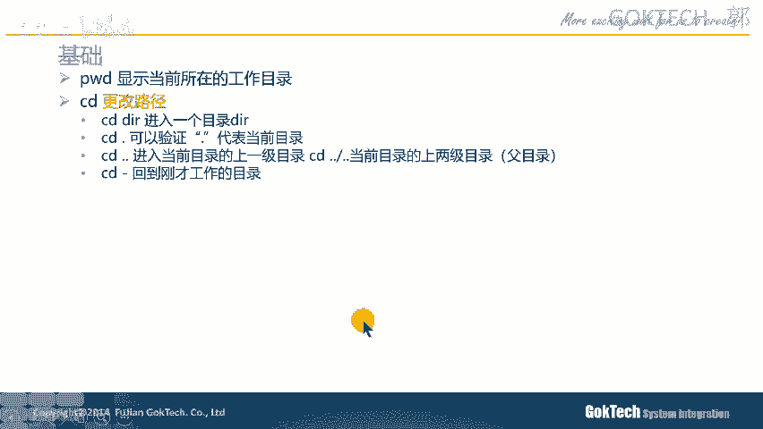

那如果我用我用这种路径的方式怎么看呢？来，你看什么PWD是首先我知道我在桌面底下对吧？啊，那我如果我想先切换到上一级，是不是是不是就是root了？😡。

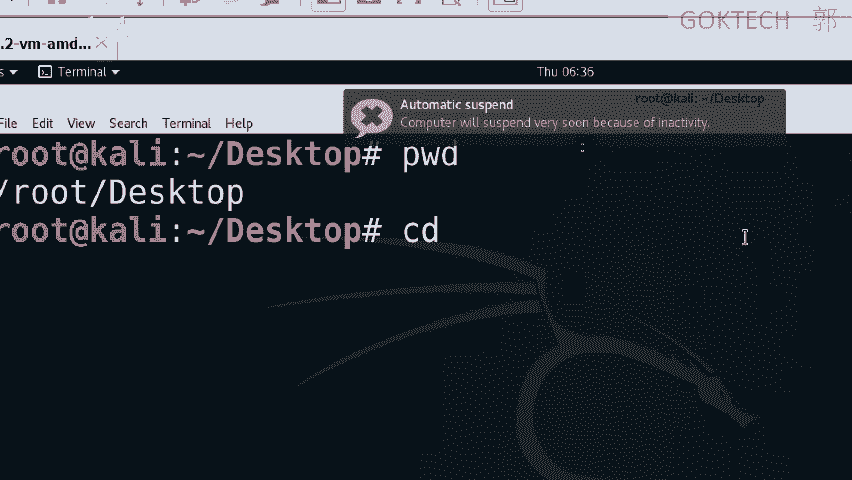

点点，你看一下。回车PWD是不是斜杠路ot？😡，Okay。这个减号这个减号是什么意思啊？就切换切换回刚才的工作路径。😊，你们有没有用过这个这个这个东西啊？电视键电视有一个返回键，知道吗？😡。

就是你比如说你你你你你在一个电视剧，一个台一个台的节目里面看电视电视剧嘛。然后接下来他进入了广告时间。😡，一般情况下，你要去另外一个节目，电视节目嘛。比如刚才那个电视节目叫X1，你现在切进入到X2。

那你如果想回到刚才路径，是不是可以按返回键了？😡，或者叫切换键啊，或者叫兑换键之类的，这个也是一样的啊，看着啊，是不是又回到了刚才桌面了，CD点点斜杠点点是不是应该进入到什么？你看这个叫根分区嘛。😊。

对，上级就上级吧。跟分区啊，你不要看小看它斜杠啊，这个也是跟分区啊。😊，okKLS就显示啊，显示我就不多说了啊，大家聊看一下就知道了。来接下来讲几个命令啊，我简单过一遍就好了，我不会再演示啊啊。

第一个创建文件就是touch。😡，你你创建一个文件叫touch啊，你touch后面跟上一个文件，比如touch A嘛，它就会生成一个文件。好，我问你一下。😡，如果你创建一个同名的文件。

在windows里面。😡，是不是会提示重复啊？那这这在这边呢，你看着啊。😡，系lo。😊，LS杠L哈，我们看一下这个。😊，这个小A的时间是6点28分是吧？6点28分啊，你看下touch a。

6点38分看到没有？是不是变了？有变吗？好像没变是吧？😡，我卡了是吗？稍等一下。原来是6点是28分嘛，现在我刷新了它的时间戳嘛。😡，这是6点38分。就好比如说你一个文件保存下来。

它的修改的时间要不要变啊？😡，O。创建目录呢一样的。它的阅读性非常好啊，什么叫阅读性啊？创建一个目录叫make。😡，Directy。创建一个目录，然你后面跟上目录名就可以了。目录名OK那删除怎么删了？

RM。😡，Remove。删除的时候一定要注意的哈，删除加上杠I就说问你说是否要删除。😡，一般情况下，我们的路程用户啊，这是我的路程用户。😡，一般情况下这是root用户，我登录的时候就是root用户。

一般情况下。我删除的时候，他要问我说是否删除。😡，有时候他直接不问了，直接删掉了，直接删掉了。如果你加一个F就直接删掉。😡，如果你加一个R是删除目录，因为目录里面你看到啊。😡。

目录里面是不是有好几个文件啊？😡，好，他会什么呢？你如果删除一个目录的时候，他会问你说是否进入目录。然后呢，首先问你是否删除文件一ES是否删除文件2，Ees是否删除文件3Ees是否删除文件是ES。😡。

等这些全部删完之后，这个文件夹啊或者目录是不是空的。然后最后他就问你说是否删除什么了，扣目录，它是这样的一个流程，明白吧？就是说他删除目录必须跟上这个杠啊。😡，啊。来，我们看一下啊。我来演示。

总体演是遍。Make。稍等一下。稍微有点卡。MakeakeDIRGOK。TECCH去，我创建一个目录。LS。看到没有？目录的颜色是跟普通文件不一样的吧。😡，CD，你看CDA呢它就是说什么。

你这不是一个什么目录，你必须CD什么GOKTCG没错啊，OK然后呢，LS这里什么都没有嘛。来，我看下，你看下touchAB。😡，CD是不是创建4个4个文件？对吧？好，我现在退出来，退到上一级目录。

就回到桌面嘛，回到桌面之后怎么办？😡，来，我现在拿RM什么了GOKTECH这个可以按t键，你们的大写上面的那个键t键可以补全。😊，啊。他说怎么了，你。😡，这是一个目录，你没办法删。

但是如果你是嘛加上什么GOKT下去，他就问你说。😡，呃，杠R哈忘记了哈。啊，这个就直接删掉了啊，这有点。😊，有点问题啊。啊，有点问题啊，这个不应该不应该哈。它的一个应该是这样子的啊。

必须要有一个确认的才行哈。它可能还需要还需要那个改加这个杠I啊，稍。😊，他uch呃m DIR，我快速刷一遍啊，GOKCDGOKtouch1234。LS4个文件啊。

CD点点remove杠I是说你你你你删除的时候要要确认嘛。你比如说杠IA，他说问你说是否删除这个空的文件A，你就说呢yes，你回车直接就是不删除啊，yes。😡，啊，那这样子的话，A就没了，小A就没了。

那好，我们现在呢RM杠I杠F啊杠R啊删除这个什么GOK就他说问你说是否进入目录目录GOK嘛？哎，你如果不按Ees就默认就是否yes，他问你是否删除空文键3yes是否删除空中键一yes。😡。

PSS然后是否删除目录PSS。明白我的意思啊，刚才我讲了一个流程可以吗？😡，啊，一般情况下呢，我是这么做的。😡，RM。杠RF什么意思啊？😡，强制删除不提示啊，然后后面跟上跟上你想要删的东西。

直接删掉就可以了。少废话少废话啊，幕夫呢有意思啊，幕府幕府除了可以吗？移动还可以重命名。😡，我直接演示给大家看了。😊，LS。我直接就用这个小C啊，小C。幕C变成了CC。啊。维车。看到没有？啊，好。

这是它最简单的重命名的功能。还有一种是什么？😡，如果你后面跟的是你先文件。😡，先拿一个文件。然后后面跟上一个什么目录。你看呢这个是文件嘛，这个就是目标。如果是一个目录。

它就是可以把多个相当于把文件移动到什么啊目录里面。😡，啊。还有一个移动并且重命名啊，我给你看一下啊。😊，我一样的这这个地方哈创建一个目录makeDIR。😡，GOK创建一个这么一个目录，你看到啊。

我把这个A大A啊，大AC幕大A移动到这个GOK里面。😊，啊，我们看一下这个GOK里面有没有大A。有吗？有吗？O。好，现在我做这玩意就是移动并且重命名move我这里还有个D。😡，这来了个D哈。

mo地到我GOK下面的滴D。😊，或者逗逼啊逗逼了啊，我车没了，我们今天看一下。😡，哎。双击双击。卡试啊是不是变成了DDDB呀，而不是D，刚才是D嘛，对吧？这叫移动并且重命名。😡。

OK再来看一下复制我就不多说了，复制一样的，跟这个移动移动有点像啊，有点像。😊，OK再来看一下，我们把这个讲完就休息一会啊，休息休息一点啊。😊，比如说我我有文件嘛。😡，比如说我有文件。

我有这么一个文件码叫CC嘛，我想看它的内容怎么看啊？你如果是图形的话，是不是可以先双击打开啊？😡，对吧啊，并且我还可以还可以编辑，是不是啊，编辑完了之后怎么办保存一下sep保存是吧，关掉就可以了。

是不对？但是如果我用字符界面怎么办啊？😡，开上。啊，查看CC啊，这是我刚才打的是吧，还可以用什么命令？😊，没用帽。查看文件的内容，但是只能往下看。说白就是你的鼠标，你这个鼠标的滚轮只能往下滑。

你不能往上滑啊。😡，来再来一个less，最常见的就是lessless可以分页显示什么意思呢？😡，lessice哈看一下，我看我等一下稍等一下。😊，Nice。ETC下面的pasword。我可以上下。😊。

上呃这个往下给往上都可以移动。那如果我想推出来怎么办呢？Q。😡，Q啊这个Q。这个Q可以直接退出来。啊，应该电脑都用过，Q知道哈。😊，headhead就是查看前面的几行。😡，他好就查了你后后面几行。😡。

你比如说你你你在你要在一堆试卷里面找到自己的卷子，你怎么看呢？😡，难道一份拿起来。😡，翻翻翻嗯，不是，好像不是我做的。然后第二份翻翻翻这样子嘛，肯定不是吧。

肯定是靠看第一页那个第一行那个写名字的那个地方嘛，是不是写自己的名字嘛？如果不是，那怎么办？肯定不是你的嘛，对吧？OK或者说你看最后面嘛，最后一般情况下我们的文件嘛，一般情况下盖章嘛。

比如说合同要盖章嘛，你看最后面是不是有人盖有没有盖章，或者有没有人签字嘛，就是看最后面那几行嘛，就可以了。😡，除非你没写名字嘛，除非你事间没写名字了，然后上面有好几好几份没写名字。

你是不是要仔细核对是不是自己的字迹嘛？😡，可能大家写的字迹差不多，大家都很丑。😡，很丑，你这样可能就记不看不清楚了哈。😊，O。嗯那你会看的能不能写啊，能不能编辑啊，可以用VIVI编辑器。

也有同学说什么呢？哎，老师我听过VIM一样的哈，VIM也是一样的哈。😊，这个VI跟这个VIM是一样的啊，差不了多少啊，差不了多少。😡，我编辑就可以了啊，你看着我想编辑一个文文本怎么看啊？

我想编辑这个CC哈，看着啊。😡，vi i。跟上CC。是不是改编辑啊，是不是进入到这个页面了？😡，这个页面。但是呢我在这个地方敲任何的数据都无法敲。😡，都都无法抢，我怎么办呢？我必须在这个地方。😡。

输这个是嘛？我的命令模式，我只能在这边移动鼠标。😡，那怎么办才能编辑呢？我要你比如说我按一个I哈，字字母I。😡，哎，这底下变成什么？😡，插入模式，然后我就可以开开始编辑了。明白了？我们可以开始编辑啊。

懂吗？😡，等会okK如果我想退出来怎么办呢？先按一下ESC。😡，左上角那个ESC左上角在哪里呀？左上角那个ESC。😡，好，先又进入到刚才那个不能编辑的页面，然后按冒号键。平时你们怎么按冒号。

是不是先shift按住，然后再按那个冒号键。😡，然后呢，Q就是退出来，就QIT的简写。😡，W就是保存right。😡，Right。WWQ就是保存并且退出。😡，啊，我们再去查看一下。是不是文件变多呃。

这个内容变多了。啊，O那好我们看一下PPT啊。😊，当我启动VI的时候，进入的是命令模式。命令模式输入文本插入命令之后，可以进入插入模式。插入模式你编辑完了之后，ESC退出来。

然后按冒号键啊退出我的一个什么啊，按了冒号键之后呢，干嘛写一下保存并且退出就退出了我这个页面了。看到啊这里有一个。😡，命令。😡，进入插入模式有好几种，但我觉得你们只要记住这个I就可以了，光标不变嘛。😡。

就在光标那个地方干嘛进入插入模式就可以了。还有呢扩展模式就是保存退出，保存命的退出，强制保存退出，强制这些有强制加感叹号就是强制啊，还有什么命令模式。命令模式的话，其实并不是说不能输入命令。

只不过他有些含义，你比如说滴滴。😡，滴弟就是把那一行删掉。😡，看到我这个有什么好处呢？😡，比如说我想把这行删掉哈，你看下我是怎么操作的啊。😡，VICC比如说我要把这行删掉是吧？

光标光标的地方是不是删移动到最右边，然后I进入插入模式，往右再移动一点，是不是这样删删删删删删删删删。😡，三这样三是吧？很麻烦，是不是？那我现在进入我是我用命令模式看着啊。😡，滴弟。

我就双击点下滴滴就可以了。😡，啊，双击两下D双击两下D就可以把整行删掉。😊，删除当田啊。OK那我就不多说了啊。那这个网络的话呢。啊，我们先休息一会儿吧，好吧，先休息一会儿，休息10分钟，然后我们来继续。

😊，ok。好，那我们继续啊。😊，来讲一下这个网络地址哈，网络管理啊。😊，说白了这个网络管理员，因为我们呃很多东西都离不开我们的1个IP地址。😊，啊，ID键是用来管理啊，或者说标识一个。

标识一台设备的一个网络位置的那好，在这个地方哈，如何查看linux的，或者我们的卡利哈，卡利里面的IP地址呢。😊，被个这个用这条命令。

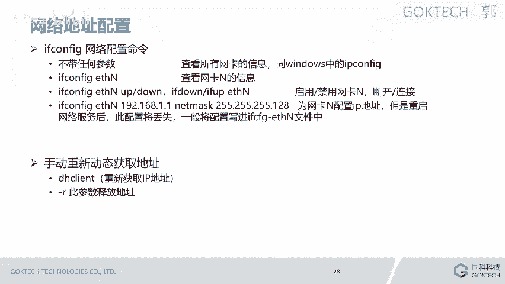

啊，稍等一下，来进到我们的。

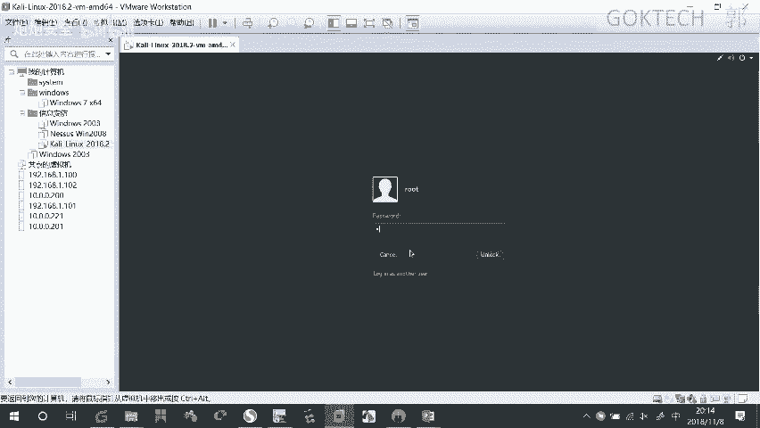

这里也没来。啊，这个地方先给它退掉。来。有有些同学不是很懂这个页面怎么打开呢哈。😊，右键桌面空白的地方。open terminal打开终端，在终端打开啊。ok。IF空这个。啊。

interface的一个配置，就查看我们IP的配置来往上拉一点点。我们一般情况下是看什么ETH0这个IP地址这里。😊，啊，这个就是我的IP地址。

IP地址一般情况下是用什么点来分开的一栏、两栏、三栏、四栏，就跟我们的一个学号一样。只要前面这几个相同，那我就认为什么你是处于同一个同一个网络里面的。😡。

就相当于什么我们一个班级的一个班级的同学学号前面是不是一模一样，只有座座位那个地方不一样。😡，你们有观察过自己的学号吗？😡，啊。okK吧，就只有这个座位那个地方不一样是吧？啊，那这个也是一样的。

这个就是他地址O。😊，这里哈if不空这个就是查看所有网卡的信息，你也可以查看具体某一张网卡。😊，还有啊这里可以把网卡禁用和启用，什么意思啊？😊，什么叫断开和连接呢？

就后面这个嘛IF档IIF up是断开和连接啊，看着啊断开和连接就好，比如这里。😡，我这里给它断开，再给它连接，断开之后，这这些网络是不是还能够看得到？那如果说是禁用和启用是什么意思啊？看着啊。

我给你们看一下禁用和启用是什么样子的。😡，禁用的意思，现在把这样无线啊看着啊禁用掉。啊，金融掉之后，这边还能看到。😡，呃，点错了。这边还能看到网络吗？不行吗？啊，ok这个是它区别啊。啊。

这个是手动配1个IP地址，我就不多说了。如果你想重新获取1个IP啊，DH client重新获取1个IPDH client空格杠2空格杠2就是什么释放地址，把你的地址释放掉，就我不要这个地址。😡，啊。

那我这个地方有没有地址呢？有吧，有我就不需要配置了。如果你想要获取一个地址，DH clientient。😡，这样就可以了。如果你想把这个地址释放掉就不要了嘛，就直接这样明白我的意思啊。😡，好。

接下来我讲文件传输，为什么？因为部分同学反馈说我跟卡利无法复制粘贴嘛，那我来简单演示一下这个怎么做呢哈。首先你要有一个卡利。😊，我这个地方先把它给可以。啊，可以给大家。稍等一下稍等一下，稍等稍等。

稍等稍等，在哪里在这里是吧？哎，我网络是不是可以先连上啊，稍等一下啊。😡，我网络现在还上啊。来，首先你们要有一个软件，这个软件我可以直接给你们啊，这个软件在哪里呢？软件安装包这个地方有一个课程软件这里。

😡，啊，不不，我要直接给你们，我我我我不用讲这个啊，这里有一个你们把解压嘛，解压解压之后呢，里边有一个什么呢？文件解压打开之后，这里有个用注册表导入嘛。先双击运行，运行完了之后呢。

这里有一个sQCP的这么一个程序就有一个一CQCRT这个程序嘛，你双击运行就可以打开了，就不需要安装，这个不需要安装了，解压之后就可以了。O我把这个东西给你们。😡，好。呃，这个打开之后呢，是这样子的。

我重新关掉，打开一下。打开之后就这样子的。这个是我的一个列表，就我有保存的标签嘛，说相相相当于我们浏览器的标签。现在我要连接嘛，我直播间要我要选择一个快速连接。😡，快速连接呢。

我要选择我现在要连到linux里面嘛，选择这个SSHR。😡，啊，就是按照别传输的一个协议。SSH2。输入我刚才查看到的IP地址，0。2。95是吧？我们看一下，确认一下。是不是2点95啊？😡。

O那么我只要在这个地方输入2点95。啊，这个地方不变，用户名就root。回车就可以了。就是他会问你说啊，是否这个只要接受并保存就可以了。TOO啊。😡，怎么进来啊？😡，可以吧啊，IF是不是都可以看了。

对吧？怎么传输文件啊，点击最右边这边有一个什么。😡，这个地方就问号的旁边这个地方问号的旁边这个地方这里。这里。啊。双机运行。点双击点一啊。好，这里还会再让你进行一个连唉，我们先关掉一个就好了。

这里还会让你进行一次连接嘛，我在一样的快速连接啊，用这里不用动哈，这个协议不用动哈，主机名就是我们的1个10。0。2。95。😡，好。用户名就是我们的路ot。啊，密码就是我们的TOOR。这样子的话。

这边就是我们的一个root，就是这就是我们的一个什么。😡，就是是就是那个这个就是我们啊那一样的啊一样的，我看一下之前的话，我不知道被我点到了什么啊，就本来的话我的一个视图应该是有一个。😡。

本地窗口了哈啊本地窗口啊，这样才对啊，这样才对哈。😊，相当左边是我的电脑windows吗？😡，看到了吗？啊，左边是我的windows是吧？OK啊，右边是我的什么？右边是我的linux，我可以在这边啊。

你看着啊，比如说我进入我的桌面啊。😊，啊，比如说我进入了我桌面啊，我这里面有这么多东西，我可以把这个杂项题目拖到这边来啊，拖到这个地方拖拖到这个地方来啊。😊，等下大家传二进数啊。始终。他就认船。啊。

他就是在这边传啊，我们来看一下它到底有没有哈啊，你看是不是有个杂项题目啊，就在这边传，这个就相当于相当于比较有就是为了解决什么呢？我们无法在linux和windows里面复制粘贴的一个方式啊。

这是一个工具啊，也比较方便的去弄我们这个啊可以在我们之间进行传输。ok我把它关掉了。没关系啊，来，我再回顾一下，首先你必须用这个sqCRT这种工具或者叉c这种工具，刚才也发给你们了。然后呢。

我现在呢要使用这个linux，我linux需要。😊，启动这个这个工序，你们平时用过远程连接没有？😡，啊，用过QQ的远远程控制没有？😡，啊，可以控可以用一下，你会发现啊这么卡。😊，你们就吐槽这个比较卡。

😡，但是我可以真的可以用嘛，是吧？那比如说之前原生发在你们群上呢，有一个绿色版的一个软件嘛啊，绿色版的一个软件，就是那个软件叫叫叫叫叫叫那个叫什么来着？

team viewerteam viewer也是一种远程的一个控制的一个team viewer远程控制的一个一个一个工具。但是我这里呢只要什么linux默认就安的这个软件叫SSHD。但是呢你必须这样子。

你必须修改一些文件，修改一个配置文件。😡，什么修改呀？😡，在你们的那个文件夹里面，在你们的那个控制台里面啊，VI编辑这个文件，然后在里面添加这一条两条命令，这样应该可以吧。😡，啊，什么意思啊？

我给大家简单看一下哈。😊，啊，我这个是改过的，所以说才可以用啊VIETC。😊，啊啊，这个地方我也得看一眼啊，ETC的一个什么SHH里面有个配置啊，就这个目录里价有一个什么配置。😡。

有一个空fi的一个配置。好，编辑哈来我在空白的地方。😊，空白的地方哈插入一下。😡，啊，你看着啊。我在空白的地方。好，给它插入这条这两条命令。😊，哎，这两栏命你保存并且退出就可以了。可以吗？OK啊。

然后呢按这条命令来重启一下SHH的命令就可以了。这样子的话呢，在最后呢再输入这条命令，其实都有哈，这个不是图片啊，这个地方。😊，这个地方不是图片了，这个地方可以复制的哈。😊。

我给你们的我给你们转的PDF其实都可以复制。如果你们复制不了，我建议你们换一款嗯那PTF的阅读器啊，换一款啊，肯定可以的哈。😡，OK那我刚才给你们看的是图形化了，这个也还有一个命令命令形式啊。

那这里我就不多说了，我就不多说了，还有软件管理啊。😊，你们安装的时候，一般情况下。😡，Lux里面有两种安装方式，一种是源码安装，一种是什么？通过APT那个APD的安装方式。

就APT空格instore就可以连。😡，然后跟上你的软件就就可以联网安装了。这个东西好比如说用过软件管家没有。😡，软件管家。电脑软件管家没用过是吗？360。😡，腾讯管家都没用过是吧？很好啊啊。

你们是裸机啊啊，在这个网络中裸奔的啊。😡，软件管家比较好用的地方在于它也可以搜索嘛，可以搜索搜索，比如QQ嘛，然后呢点击它就可以帮你完成下载并且安装。没错吧。

OK那这里的话呢APDge然后空格insstore，然后呢跟上你想要安装的软件，也可以达到自动安装的效果啊，还有呢原码安装也可以原版安装就说白了就是源代码嘛，你需要编译一下，需要用这条命令编译啊。

用这条命令进进行配置，然后编译，然后呢安装啊，然后安装啊，我这里就不多说了，只是简单说一下而已啊，说一下了做个了解就好了啊，这个是我们的一个linux的这一块啊，linux这一块。

那linux的就先简单的讲到这里哈。😊，讲这么多，只是想让你们了解一下基本的概念就够了。给大家推荐的书呢。😡，大家有兴趣去了解一下就好了啊啊，不不，有兴趣的时候要去研究一下鸟哥。😊，的linux私房菜。

基础片好，算了，我直接发一部分电子档给你们吧。你们爱看的话可以看啊，不看的话呢可以去鸟哥那个图书馆借一啊，基础学习篇没错。我有发过吗？好像没有是吧？😡，这边基础基础学习片啊。O。来。

我们来来看一下我们的一个接下来要上的一一门课，现接下来要上的流量啊。

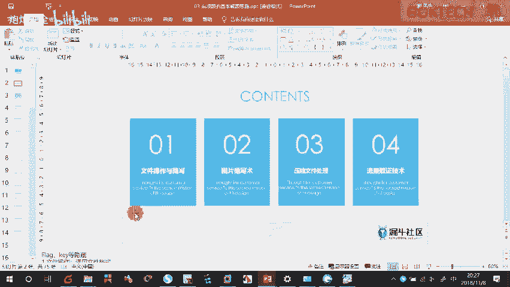

压缩我们先不讲啊，来我们来简单看一下这个流量取证哈。😊。

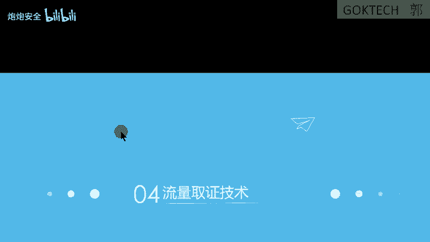

来流量取证现在要接触到一个工具，就这个工具we aresuck。😡，V要上这个工具啊，这个工具呢。😊，你需要去。看这种东西来看得懂吗？😡，看得懂吗？我先问大家看得懂吗？😡，这种这种东西看得懂吗？

看不懂是吧？😡，所以说简单给大家介绍一下网络方面的知识，网络方面的知识啊，网络跟我们的安全呢啊其实是2块大方向。但是呢这两个又有很大的关联啊有很大的关联。你比如说网络是基础，安全的话。

维维护着网络的一个安全。这其实啊关关系还是很很很有关系的。来，我们先来看一下这个这个软件安装包哈，在这个地方我找一找啊。😊，鬼呀，傻。如果你你自己的一个。你自己的一个东西也比较多的话。

可以找我要一下这个搜索软件哈，就直直接在那面可以搜索一个。😊，软件的东西啊也可以。

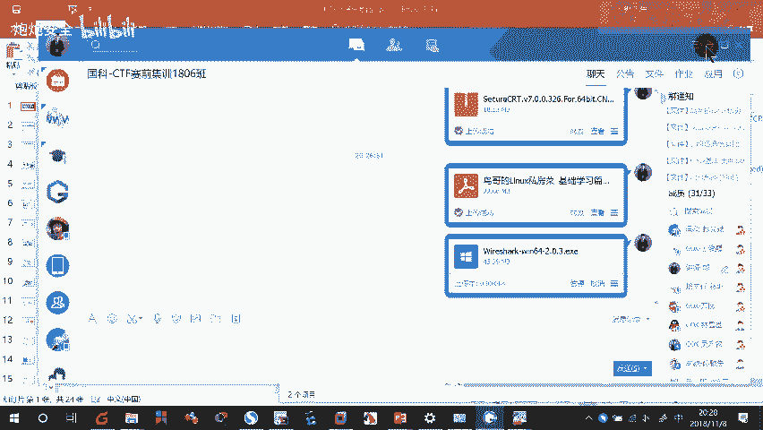

我都有，我基本上很很多工具我都有啊。来这个VR下载安装完之后呢。😡。

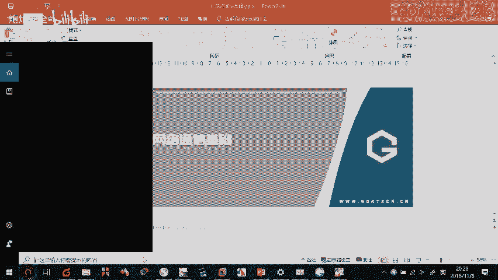

我们运行一下啊。因为我给你们传的那个版本，好像是中文版的哈，没有中文版啊，再找我要一下啊，应该是这个版本，没错吧。😊，2。4。3应该没错。啊，啊传错了是吧？啊，没关系，我再来一下。2。4。3是吧。

那传错了是吧？传都没关系，我再传一下，主要是话我们怕你们是英文版的，刚开始不习惯啊。😡，2。4。3的是中文版。O啊。来打开之后呢，这里就有网卡。你看哪一个有流量在发生。😡，那么网络传输的数据叫做流量嘛。

哪个地方有流量来发生的，是不是这张网卡？因为我现在连着什么无线嘛。好，OK我们点击给它运行一下，是不是很多东西都在跑了？O我们来看一下，我们随便打开一个网址哈啊，这个网址我非常喜欢啊。😊。

因为这个4399是没有加密的嘛。😡，HTTP嘛？没有加密了嘛。OK好。😡，这个叫什么知道吗？😡，ICQ知道吗？你你们知道QQ是模仿谁的吗？😡，早期的时候就是模仿这个ICQ了。😊。

ICQ的QQ是早期就是模仿ICQ了及时通软及时通讯的软件来，我们打开啊。😡，这地方这个是啥么？😡，这个是原IP目的IP等会我们来讲哈，协议协议完了之后呢，我双击打开。😡，双击打开这边呢。

最最底下OICK的哦OIICQ的这个来。😡，最底下这个地方。可以看得到我的1个QQ号码。😊，这个是就是QQ啊来。好，QQ的端口号，QQ用到的端口就是8000。😊，啊，这个等会给你们解释。

但是你能够用这个软件去抓他的聊天记录吗？不行。😡，因为聊天记录是。啊啊，被封禁了啊，被被被加密了，所以说你看不到了啊，聊天记录你看不到，但是你可以看得到这个确确实实确确实实是我登的1个QQ啊。😊。

Okay。你能不能你们你也可以在你比如说啊两个人啊看到。😡，如果你你设友的嘛，设友的是通过有些来连接的嘛，来上网的嘛啊，然后呢它通过一张通过一个什么就家里的个猫嘛进行上网嘛。

你可以把你可以在中间加一个什么设备，加一个设备，然后呢，把它的流量偷偷起来偷起来看一下它上网上上的哪些网站啊，我说的是正经网站啊，当然啊OK啊，比如说HTTP是吧？HTTP。😡。

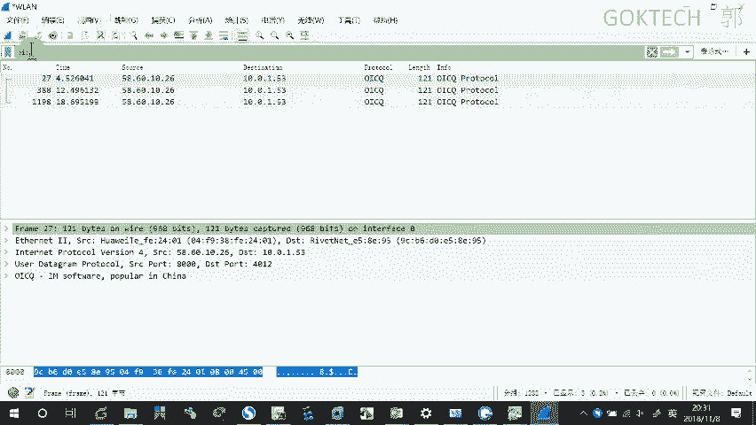

啊，看着啊。你比如说我之前访问的这个网站叫什么网站？😡，正品网站这个网站是什么？啊。啊，这个就是啊这个就是正常的一个网站哈，正常的一个网站啊，来，我我们随便刷一个哈。😊。

比如说你看这边会加载一些图片什么的，我们来刷新一下，来这个4399小游戏刷新一下。😊，啊，好像也没有什么动静啊，好像没什么动静。那不管他不管他不管他啊不管它。😡，好，了，我们看这个PPT啊。

我简单给大家过一下啊简单给大家过一下这个。有录哈，我还又没录啊，来简单过一下这个网络的一个基础啊来。😊。

网络的起源其实非常早，但是网络现在的技术呢啊也是比较缺人的啊啊这个IT嘛IT这块肯定是缺人的。来最早的时候我们是怎么传输数数据的？😊，最早的时候我们是怎么传信息的，传数据的。😡，或者说我怎么怎么通过。

最早说没有文字的时候，怎么了？画画嘛，通过一些壁画嘛，可以留承载一些信息嘛，对吧？还有鼓声。😡，有上上场打仗的咚咚咚咚咚那种是吧？烽火蓝烟算不算啊？但是烽火蓝烟传达的信息很有限嘛，所以说怎么样呢。

才有烽火系诸侯的这种这种曲目嘛，是吧？啊，因为他点燃了可能是有战士嘛，所以所以很多诸侯就赶过来了嘛。😡，再来。😡，通过有了语言之后，我们可以交流吧，对吧？可以通过书写的方式，还有什么飞歌传输嘛。好。

但是这里啊有一些可靠性的问题，你比如说下雨的时候，你还能发，你还能点狼烟吗？😡，下雨的时候，你有狼烟吗？😡，再打个比方，比如说飞哥。😡，飞根都被打下来了，你怎么那个？就比如说我们看的电视剧很多吧。😡。

鸽子刚刚飞起飞起来的时候，被人轻功一飞，给他抓下来了，有没有对吧？或者用剑给他打下来嘛，有没有啊，所以说这种都是不可靠的，直到后面发明的电。😡，电之后呢发明了这个什么，知道这种是什么啦。😡，啊。

最早的什么电池式电报机。还有我再问你一下，大家，就知道这个是什么吗？😡，你们猜。😡，你们猜。那你们猜你们都猜出来，这是世界上第一个。😡，电话机。贝尔电话机。

贝尔电话啊电话机贝尔电话机贝尔那时候的第一个啊电报啊这些都可以传输数据吧。OK在我刚才讲的时候，就已经说了，60年代之后呢，出现出现了世界上第一个实验型网络，就这个网络。当时呢只有几个节点呢。

只有4个节点。😊，一台你可以认为是一台路由器，两台路由器、三台路由器、四台路由器。😡，啊，来，你们家里有没有用过光猫啊？😡，你们家里用的是光猫还是电猫？😡，光猫是吧，光猫你怎么怎么去管理呀？😡，啊。

说明书它有说明书有一个默认的地址嘛，你只要网线接入，然后浏览器打开这个网址就可以了吧。O我们的店，我们的企业用的这种路由器也是这样子的。😡，你比如说我手头拿的这个是一个华为的路由器，只不过有点大。😡。

这个比较大，然后呢，它里面的一个接口也会比较多啊，功能也会比较强，你也可以拿到家里面啊，接接上去也可以上网的，这个没有任何问题了。OK它这个地方呢刚好也有1个IP地址，这里有一个默认的IP地址。😡，啊。

我们给它接过来哈，接过来它的1个IP地址就是192。168。1。1。这个一般情况下，你们的家里人也是一样的，要么你们家里人要么是192。168。1。1或者0。1啊啊，基本上套路都是一样的哈。

我们来打开一下看一下啊。😡，啊。192。168。1。1。前提是什么？你跟它处于同一个网络是吧？我现在用网线跟它连在一起，用网线跟它连在一起，也就意味着什么呢？我的这张这张网网卡必须跟它处于同一个网络。

😡，属性这边。IPP4是吧？啊这里哈。😊，192。198。1跟它处于同一个网络。啊。确认确认，然后我这时候再刷新一下。啊。无法网无法是吧，那我就要把无线断开。访问一下。刷新一下。是。啊，这个就是什么？

它的一个管理平台ad的面。啊，要我输入密码啊。A的 me。啊，稍等一下啊。😊，来你们的页面啊，你看着，这是它主板啊，你看着，就是它背后后屁股那边啊，屁股那边有1个2个USB接口，可以接U盘啊。

可以接U盘扩展它的容量，扩展它的容量，就是屁股那边呢，就是那个啊就是那个内台的，后面那边就是前面的板，前面的板呢有这么几个啊，首先这里呢就是管理接口，这个地方是管理接口，不用管它啊。

那这些都是它的一个正常的一个接口，以太网的接口。OK你们可以通过这些来配置，你可以配置它的一个什么局域网的接入，你可以配置它上网的一个方式。这些都可以配置，OK。😡，啊，也就是意味着什么呢？

企业级别用到的路由器，甚至是交换机，其实只是比我们家用的更加强大而已。就好比这服务器服务器是称为什么强大的计算机啊，强大的计算机。😡，OK那正常情况下呢。

以后我们的你们学校里面的网络啊啊时间啊时间比较有限啊哈，我就简单讲一下你们学校的网络是怎样子的哈啊，你比如说你现在用的是无线是吧，你现在用的无线的，看着啊无线，一般情况下，这里面的走廊。😊。

走廊的头顶那边会有水滴，水滴，有个类似水滴的这种。水滴形的这种无线发射无线，或者说类似这种墙壁这种贴着这种无线发射器啊，一般情况下在里们走廊，或者说甚至有可能在你们的宿舍里面。😡，啊。

甚至有可能在你们书舍里面OK但是呢如果是有有线的话，它是墙壁里面嘛，它是线是在墙壁里面的，这个叫暗线。😡，如果线走在外面，比如说什么像这根线这样子走在外面了，或者这样子的都叫明线。😡，按键是一般情况下。

你装修之前就已经考虑好了，就把你装在里面嘛，就样子比较美美观嘛。你看不到嘛。那如果明显的话就比较不美观，比如说这边这个就比较不美观啊，稍微差一点点啊OK。😡，那正常情况下呢，你比如说什么。

我们的一间宿舍，你们几个人。😡，6个是吧，OK6个111层楼多少个人？😡，一层楼我们打设，比如说。😡，いざです。20斤好不好？20斤有没有？😡，三哦，这么多啊，那比如说打个比方，比如说96个人肯定有吧。

😡，96个人来，你看一下。😡，用这种用我刚才给你们看的这种路由器够接吗？肯定是要用什么交换机交换机。😡，有一个最大的特点就是它口多。😡，接口多，一台就是4十几个，2024个或者48个。

90多个、100多个都有。它口呢就是为了给你们连线的。你一层楼，一台交换机，两层楼就两台，三层楼就三台啊，就全部呢放在这边了。这个叫接入层，就是为了给你们接入了。然后你想要上网怎么办呢？

需要连到往上面连到什么汇聚城。😡，你看一栋楼是吧，一层两层三层、四层、五层是吧，两栋楼、一层、两层、三层、四层、五层、六层是吧？你好几栋楼宿舍起码202十几栋嘛，30栋、40栋、50栋都有可能嘛。来。

那一栋楼是不是要出来？一栋楼是不是要出来？是如果你去上网，你看哪。😡，如果我上网的时候是一台方一台路由器，你路由器的口够吗？你三十几栋根本就不够接嘛，所以呢在这边还要放一台什么啊？😡。

交换机所有人都连到这里边来，然后呢再往外连连一台路由器上网。当然这是这是最简单的最简单的方式。一般情况下他可能还要啊种冗鱼嘛。😡，冗余的设计，就你这台坏的时候是吧，另外一台还可以用上。

你比如说这台坏了是吧？走不了嘛，那我走这边嘛，明白我的意思吧？它是网络啊，网络歪啊，来，那我们看一下啊，网络组成，一般情况下有什么？我们的一个啊终端设备，终端。比如说我们的电脑手机pad这些都是终端。

那我们的互联设备就是什么呀？交换机路由器，这些都有哈，那我用来连接设备的叫线哈，叫什么同轴电缆双绞线光纤无线，通常情况下，你们用的是无线上网，对吧？😡，能不能用有线上啊，网线叫双绞线。😡，啊，双脚线啊。

来简单说一下网络里面的巨头，网络里面的巨头，国产的国产叫华为。😡，大家心里想，哎，华为不是卖机吗？啊，手机只是它一块的业务，手机只是它其中一小块的业务。OK来啊，大家看一下啊啊。

现在呢我们啊有专门的一个课码，就是网络这一块了，网络速通这一块了啊啊业内有一个证书啊，大家可能还可能货多少会会接触到叫什么西嘻。😊，IE嘛对吧？啊，这本书呢也是业内比较有名了嘛。

甚至啊班级里面已经有人拿到ID或或者在学过IE了啊，叫CCIE嘛啊，这本书还是挺有含金量的啊，挺有含金量的。还有什么呢？华为里面的国产的嘛？国产叫HCIE华为IE。😊，啊，这个呢面试这个是需要面试的哈。

就是要需要面试的。只要能够通过HCIE基本上都不是不是都不是水货哈，都不是水货，拒绝水货。你考考1个CCIE都有可能你可以可以说有可能是水的，为什么它只要背，只要练就可以了，但是这个水不了。

华为是水不了，因为它需要面试。😊，啊，目前的话呢就是啊打个小广告啊，目前的话呢啊只有啊福建只有我们能做能做这一块的一个培训。因为你们现在不知道有没有看到啊，前几天我们刚刚拿到了一个瑞捷的一个。😊。

瑞杰呢也是做这块啊，瑞杰的一个授权合作伙培训伙培训伙伴嘛。然后呢，我们也是华为在福建唯一的一个授权培训的一个合作伙伴啊。那比如说这一块啊打个小广告而已啊。😊，啊，然后它的一个认证也是比较多的啊。

比如说什么呢？我们的一个路就是我刚才说的数路由交换，还有无线的SDN这些都可以了解一下啊，了解一下。并且呢如果说呃呃呃我们这个门门口这个地方就是一些一堆证书了啊，就是我们的一个证书啊。

基本上还是比较有含金量的啊，比较含金量OK啊，这是这样的一个全景图哈，全景图，比如说什么初级网络工程师，高级网络工程师互联网专家。😊，这是互联网专家啊。O。来那我们来看一下啊，简单给大家介绍一下啊。

因为时间有限哈。😊，来。嗯。你们有没有想过这么想过这么一个一个东西，就是我的一个安卓手机啊。😡，跟苹果手机啊，为什么能够打电话，相互打电话，有没有想过这个问题？😡，早期的时候啊早期的时候一些设备嘛。

你比如说早期的时候。😡，电脑或者说其他的一些设备它是没有标准的，它就自己造自己的。😡，就自己造自己的一个设备，然后导致他们两两个厂家之间不同的设备，他是没办法通信的。😡，你打个最比最简单的比方。😡。

刷过pos机没有？😡，或者说见过pos机没有，或者说什么电视上经常演了来刷卡是吧？那我打个比方，如果pos机没有一个标准，每个厂家都有自己的标准，那我刷这款我刷这家的一个pos机可以用。

刷另外一家不可以，那不搞笑吗？对吧？啊，所以说怎么样呢？他肯定是要有标准的，就好比如说。😡，我跟你们聊天的时候，你们听得懂，对吧？是因为我们都是用国语，是不是？😡，但是我比如说。😡，啊。

Do you understand。😡，大家也听得懂为什么，因为大家学过嘛，知道这种这门语言嘛，所以说大家都懂。如果就是一门完全不懂的语言，你看得懂吗？肯定看不懂嘛，对吧？所以说怎么样啊？为了什么呢？

为了我们的一个什么兼容性问题哈。因为什么？你看兼容性问题，我们推出的一个协议标准或者是叫什么模型。你看协议协议在我们这边就是约定就是什么？就是我们的一个呃格呃呃规范啊。

规范或者叫什么标准都是说的同一样东西。😡，O。因为我们有了这个规范之后呢，我的苹果跟我的安卓是可以相互通通通电话的啊，来看着啊。那这个是所谓的1个OSI7能模型，我简单给大家介绍一下，过一遍就好了。

这个也没必要那个来。😊，首先我是不是有1个QQ啊，对吧？我想用QQ。😡，发给哈某个学员。😊，啊，说明天要上上课是吧？我发1个QQ的消息。😡，这个是不是应用层的东西呀？我发1个QQ的消息，是不是最重要？

我在。😡，我的网线里面传的时候是不是0101的数据啊？😡，来，我这台电脑。😡，怎么把这个数据变成零1的数据，从我的网线里面发出去呢？😡，首先我是不是要做一个格式转换？😡，为什么要做格式转换呢？😡。

为什么我01同样是0101的数据？为什么有些0101的数据能够表示图片，有些能够表示成视频，有些能够表示成语音呢，或者有些能够表示成文字呢，就是因为表示层来做一个格式转换。😡，啊。

那甚至有时候QQ需要加密，他不想让QQ消息被人获取嘛啊，经过那个匿名匿名匿名吗？😡，之前不是有个匿名匿名吗，匿匿名发言嘛，还有一个是悄悄话嘛，这种悄悄话功能是不是被被被被下线了哈，然后呢。😊。

咱俩打个比方，绘画成是区分不同的绘画的，什么意思啊？你比如说我要发给。😡，我要发给一鸣的消息。😡，绝对不会发给另外一个人。😡，明白吧，这个就是绘画的一个功能。如果如果说对方收到了。

那我又那可能是我点错了，可能是我点错了O。😡，传输层的意思是什么？建立一个我们建之间建立一个连接。比如说我要发给你发一个消息啊，或者我给你寄一个快递。😡，最简单最典型的就是寄一个快递。

我给你我先跟你说一下，我有个快递发给你啊，你自己查收一下，记得查收啊，大概是这样子的啊，就我数据经过层层的一个封装啊，层层的一个呃维护之后呢。😡，啊，这两个地方啊，网络层的数据链路中就好比说是寻址。

什么叫寻址啊，寄过去快递都知道我首先要写对方的一个联系方式是吧？收件人是不是要写啊，收件地址要不要写啊？😡，收件人呢收件地址这两个加起来是不是就可以就可以找到一个人了啊。

邮编这个当然是也是算是地址里面了，对吧？那这样子的话呢。😡，你想我有一份文邮件呃，一封文件啊，弄弄弄弄弄，比如说什么要放到放到我们的文件袋里面，然后呢写上标签，然后呢写上地址之后。

我是不是就可以开始叫快递员来收件了？😡，快递员收件之后呢。😡，你比如说近的地方，他就用什么，就用正常的陆运嘛。😡，对吧如果你要寄寄到台湾呢。😡，你是不是有可能要海运或者空运了，或者说比较远的地方。

是不是叫空运呢，决定决定这种运输方式，肯定是因为你的距离嘛。那来我想一下，我问你一下。😡，你比如说你要从这里发出去的时候，你首先要看一下你是什么上网方式嘛，你要是无线，它是不是要转成电磁波啊？😡，对吧。

😡，你要是用网线呢，你是不是要转化成数字信号啊？0101的数据嘛，对吧？那如果说你是通过光纤，那是不是转转换成光信号，这些都是取决于你的方式的啊。O记住了哈，OSI是决定你一个数据的一个建定过程了哈。

也可以也是一个解读的过程啊，是在同一台机器里面了。那另外一台机器也严格遵遵循这种规则。你发过来的，你这样子发下来的，我收到的时候，我也这样子搜啊，我也这样子搜一样的哈，你怎么你打个比方啊。😡。

快递我是不是要。😡，先放放进去，然后呢用那个数那个那个什么。😡，呃，那个叫什么那个那个那个年年的那个叫什么？胶带你是不是要透明胶带给它包起来，那我要拆的时候，是不是先把透明胶带拆掉。

然后把包装拆开才能看到里面的东西。难道我能够一下子就看到里面的东西吗？不可能吧，所以说一样的道理哈，在这个地方呢，它是经过一个什么包装的啊，一个包装的啊，数据有一个包装的。

就是把数据放到各种各种头部里面，然后变成1个0101的数据啊，0101的数据好，了解一下就好了啊。😡，O这里呢简单说一下，我们这个是OSI7层模型是吧？七层是有时候呢，他认为什么呢？

我认为这个七层模型是不是比较多啊？😡，很多吧，这个有时候我就认为它就应该是我们的1个APP帮我做好了。那我就把它归为什么了？我们的个应用层，然后呢，传输层就是是就什么做一个什么端到端的连接就可以了。

然后呢，网络层啊网络接入层，这个叫标准模型，四层模型。😡，只有四层吗？那后面呢其实我们现在用的时候更多的是五层模型，物理层和数据链路层都没有变啊都没有变，网络层传输层应用层这样子啊。好。

那我们再简单说一下啊。😊，这个应用者说白了就是我们的APP。啊，算了，拿这个图吧。这个应用层说白了就是我们的APP。传输墙呢。😡，你比如说你你是QQ发下来消息呀。😡，还是浏览器发出来消息要。

我要怎么识别他们的消息呢？你比如说我刚刚这个地方啊看着啊。😡，好爱是Q是吧？你比如说为什么我能够识别出这个QQ消息呢？就是因为它的他的什么这个端口，它通过这个端口哈来识别。😡。

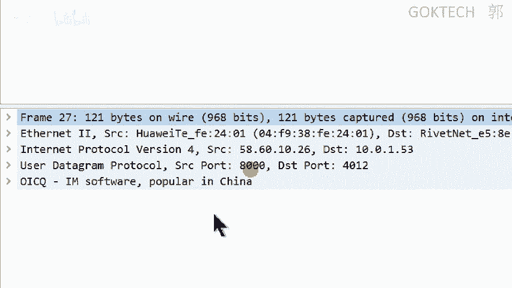

端款8000就是我们的QQ。表示我们的QQ啊。端口号呢最典型的应用就是应用在我们的这个web浏览器上面看着啊。😊。

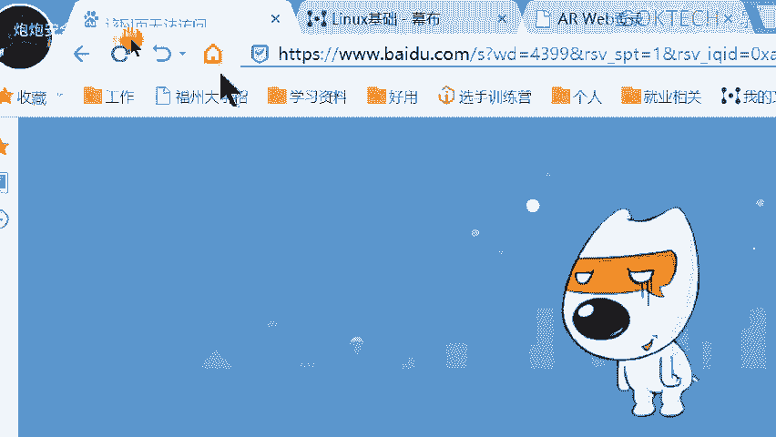

啊，我上网一下啊。稍等。我把网络连接上来。稍等一下啊。你比如说我们访问百度是吧，它是HTTBS的嘛，像这种网站的HTTBS的一个端口号是多少呢？它的端口号是43。😡，冒号443。

你看哪看到回车能不能跑那不到宝就百度。是因为它的端块号默认就是43，所以说我可以正常访问O。啊，我给简单给大家说一下啊。应用层。啊，是我们的数据啊我们的数据。APP。产生数据对吧？有用的数据吧。

我传的时候肯定是有用的数据吧，表示什么呢？做什么？😡，格式什么转换等。啊，然后呢绘化成了是吗？😊，区分。不同绘画。来。这三个呢都可以称之为应用层。来，我们来往下传输层是干嘛？端到端连接。

通过什么端口号识别。😡，上层协议。上传协议啊，比如443识别什么HTPS。80啊表示什么HTTP就比如说我那个什么4399的那个就是HHTTP的。😡，那比如说什么啊，8000的表示什么QQ啊。

那一般情况下这个端口啊。😡，我给大家普及一下就好了啊，对，了解一下就可以了。😊，大小鱼。1023的是知名端口。一些。APP就是使用呃一些协议应用成。协议都是默认为。非呃知名窗口。

那大于这个就是非知名端口。你比如说80啊80是非常出名的，80端口是非常出名的，43也是非常出名的。8080是人工设定了。😡，只要是非知名的，都是人工人为的设置的。你比如说为什么说我我访问这个百度。

为什么不需要加，我有加端口号吗？我也在后面加端口号，没有嘛，就是因为HTPSS默认就是443。如果我把它人工改成了8080，你必须在后面干嘛？😡，冒号8080，你必须这样子才可以访问。

那但是现在显然是访问不了啊啊，访问不了。😡，来，这是传输成合，网络成合什么？😡，网络层的数据链路层。啊，都是为了寻址啊，这个叫IP寻址。这个叫mark寻址，mark就是我们的一个物理地址啊。😡。

物理剂什么叫物理质啊？😡，每台设备都有唯一的地址啊，就是这个马er地址，还有应用啊物理层啊。啊，就比如说什么啊物理啊物理的一个，比如说什么决定啊。数据在不同。戒指的。传输方式。啊。

决定数据在不同的介质的一个传传输方置。什么叫介质啊？你比如说无限的介质是空气嘛。😡，对吧网线的呃有线的介质是就是我们网线嘛。OK。😊，啊，为什么要讲这个啊？除了说网给你们介绍一下。

网络也是一个一大块方向之外呢，也是要给你们讲一下那个数据是怎么抓包呢。我演示一下这个抓包哈，看着啊。😊，我这里呢我们可能要稍微拖一点点啊，拖一点点啊。你比如说我访问一个网站啊。我们访问一个网站。

简单来按检啊。这是我电脑的，我的无线的1个IP地址。😡，我无限连1个IP地址。😡，啊，这是什么？啊，我访问那个网站的一个地址啊，我访问网站的一个地址，看着啊。😊，首先呢。😡，这个是一个数据啊。

我要对它进行一个封装嘛。首先数据在这边嘛，HTTB数据嘛，然后我是不是要来我们我我们截一下这个图啊，稍等一下。😡，我把这个图盯一下啊。差不了多少，我把这个缩小一下吧。看得到吗？

你比如说我应用城现在是1个HTTV啊。😡，我应用层产生数据要往下嘛，对吧？往下走，封装什么传输层的协议嘛，传输层用的是什么，是不是要有端口号啊？😡，对吧断括号了，在这边。😡。

有一个原端口嘛和一个什么目的端口嘛，有吗？有吧？好，这个叫什么？这个传输层叫TCP还有另外一个了解一下就好了，叫UDP。😡，啊，这个了解一下就可以了啊，然后呢往下是什么传输层往下是网络层嘛，对吧？

叫网际互联城嘛，网络层这一块叫什么网络城是不是啊IP啊？你看着啊这里是不是有1个IP。😡，IPV4嘛，你看下是不是有1个NID啊目的ID。😡，原IP和目的IP优霸OK接下来往下是不是一个什么？

这里的话呢没显示出来，叫数据链路层里面点开呃，里面这边可以看得到什么原mark和什么目的mark都可以看得出来。接下来呢我要演示一个哈。😊，演示一个操作啊，抓包的哈抓包的。我们来看一下这个图哈。

我先给大家说一下这个图的环境是怎样子的。我画一个图啊，稍等一下啊。啊，稍等一下稍等一下。我要打架。哎呀。我现在是我的电脑哈，我的电脑连着我的一个华为的路由器啊。😊，华为路由器啊，这个的IP地址是一。0。

1。1。1哈，那我这边呢是10。1。1。100。

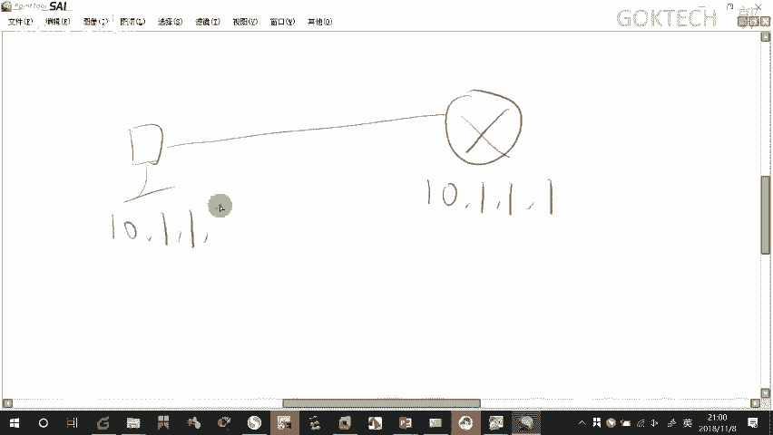

啊，我是这样子的哈，我的地址是这样的啊。😊。

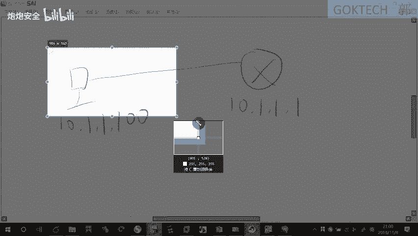

我刚才是不是可以原是不是可以配置这个路由器了？通过我们的个web嘛，通过我这个浏览器的方式可以登录吧。好，接下来呢我还可以用什么呢？字符界面，因为我用惯了字符界面怎么做呢？😡，我们字服界边你看着啊。

我把这个无线退掉啊。我把我的电脑配1个IP地址啊，10。1。1。100。10点。1。1。100啊。okK确定。确定。好，现在呢我打开VR萨来抓了啊。weR萨抓牢一下，抓这时候不是抓无线的。

无线已经被我断掉了。这时候抓的是什么呢？以台网的已台网哎，点错了。😡，稍等一下。一台网。哎。😊，为什么突然冒出来，我点的时候都没有。😡，稍等一下啊。好，我要耐心的。你看我点一下啊。

你看它还往往往上移一下。啊，就这个啊O啊。😊，看着啊我用我的电脑啊啊用这个V啊快速连接这边啊来用这个CRT啊，看着我要去远程登录嘛，使用的是天天net这个协议啊OK。😊，10。1。1。1啊。

这个端口号不变。确认。稍等一下。啊，就网线接错了口稍等一下，接错了。口接错了，当然不行了，是吧？重新连接，那这里要求我输入一个密码，对啊？啊，我输一下密码GOKTCH艾特。2018。啊，登录进来了。

看着啊，那我现在给它退掉啊。😊，调啊剂。呃，QI。退掉啊，这掉就可以了啊。ok我们来看一下这这个抓到的包哈。😊，怎么看呢？豹纹怎么看呢？豹纹有5元组啊，我怎么把这个关掉啊？豹纹有5元组啊。

豹纹哪五元组啊。😡，我必须给你们写一下，不然的话回去你们会乱。豹纹有五元组第一原mark原IP啊，mark我们不用看啊mark看不懂了。原IP目的IP协议，还有什么原装口和目的端口。好。

那我们来看一下啊。😡，稍等一下啊。今天稍微拖了一点课。抓包。豹文武元祖。拿5元呢？原IP。😡，目的IP多少协议，还有什么原端口啊，目的端口。点IP和目的IP都是什么？😡，网络层。得吧协议呢应用成。吓。

还有中间有一个什么传输层啊。😡，啊，传输层啊OK好，其中呢尤其是这个什么。应用成合怎么啦？😡，网络层都是可以在外面最上面看得到嘛，传输层的原端口和目的端口必须打开。😡，必须打开它的一个。

页面才可以看什么意思啊？😡，是不是我这台电脑主动去连接它了？😡，所以说原是我吧，然后目标是不是它对吧？然后呢用的是什么？刚才我用的协议，我告诉大家叫tnet端口，tnet的一个协议。好。

那我如果想要看那个原装口和目的端口，点一下，点一下底下有。😡，你看到没有？这个是t协议嘛，这个是IP嘛，对吧？中间这一层夹的什么？原端口和什么目的端口，因为是我自己主动去发的嘛。

所以说我使用一个非知名端口。为什么要使用非知名端口啊？因为知名端口已经被一些程序默认使用的嘛，所以说我必须使用一个非知名端口，其实就是大于1023的。😡，大于1023。

我使用的端口是大于1023的这是必须大于1023。我使用了1个662048的哈，可能可能这个是比较空闲的。然后访问的是谁？😡，访问的是目标的23端口嘛，对吧？2端口啊，那这个流量啊包就这么抓了。

你比如说我这个是筛选一个某个协议嘛，这是最简单的，最简单直接跳下来的回车就可以了。好，那我们看一下，我们再看一下流量取证的要怎么做哈。😡，过滤IP。一条命令。过滤端口一条命你，三条命你4条命你好。

来过滤协议啊啊，这个就简单了TCP回车就可以了，对吧？那还有过定mark了啊，还有什么包长度的。所以说我想要的做的，我今天想要做的就是让你们先了解linux的基本操作之后呢，再了解一下网络这一块了。

并且说啊简单啊网络的话相对来说的会稍微简单一点，就比如安全。因为你要懂的东西比较多嘛啊，所以说我们先把这块给大家找啊，了解一下啊，这个抓包该怎么抓，它包含几个部分啊，这包含几个部分肯定要了解了啊。

肯定要去详细了解了O那我们今天课就先到这里啊啊，行啊，我们先下课了啊。😊。

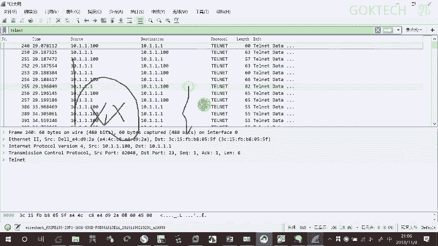