# CTF培训网络安全基础入门 - P8：（09）CTF赛前指导1806班_web基础+sql注入 - 炮炮安全 - BV1mT411q7qB

早上我们就把外边的给他扫完啊哎。嗯，在我们讲这个外板呢，肯定要了解一下外版应用的一个基本架构啊。基本架构这一些呢其实呢我们要求的话呢就是说大家要了解这个架构嘛啊怎么了解啊？首先呢我们必须分清楚什么呀。

客户端这边。啊，客户端这边的话呢。我这没接啊，有啊，有机啊。是没电了吗？稍等一下。呃。手写板可能没电了。昨电板可能没电了。我笔可能没电了，别可能没电了。你直接这样讲吧。鼠标就比较慢了一点，就是来。呃。

首先我们要分清楚这个架构嘛，它这边的话呢，首先呢第一点就是它首先要有东西可以来可以过来嘛。因为我们的一个呃应用层的话，才是真正有意义的数据啊，像学过网络的话呢，可能已经测试连联通性，就是拼过来拼过去。

其实并没有任何意义啊，它只是测试连通性，根本就没有说传真正的一个应用数据。那在这边的话呢，它是有一个什么呢啊外b的一个什么应用，就是说这个有一个什么外b应用，比如说微软的。

IS或者其他的什么阿巴奇啊tmonca这种外的应用呢可以把我应用成上面的所数据。啊，给大家了嘛通过外表的形式来发布出来。所谓的数据呢，其实说白了就是把我们电脑上的。啊。

固定的路路径下面的东西给它显示出来而已啊，把它显示出来而已。啊，来。嗯，比如说什么呢？比如说我们可以么把我的一个目录啊，把我的C盘给大什么通过外表的形式，等下显示出来是没有任何问题的。

但是呢因为我们的一个C盘，它有很多路径嘛，所以说你要访问某个固定的路径的话呢，你必须干嘛，必须手动给它指定那个它完整的1个URI啊，就是完整的1个UII啊，等会我们来看了，还有呢这个。

这是这一块这是块应用服务器这一块。并且呢如果你数据足够大的时候啊，你肯定不可能单独放在同一台服务器上。你必须把这个多余的数据放在什么专门的数据库服务器上，也就意味着什么呢？

你这个HTHTTB的协议还要转成什么了？HQL的一个语句。😡，啊，做一个转化做一个转化啊，在这边好，那这个是什么呢？服务端的，那么我们客户端呢客户端怎么办呢？你首先要有浏要有个浏览器嘛，对吧？

早期的时候呢，早期的时候还没有浏览器出现的时候，它上网还是比较麻烦的啊，通过命令的方式啊啊，那后面呢出了一款浏览器叫网警。😊，网警网景浏览器出来之后呢，也是挺火爆的。

因为当时针对于单调的一个上网方式的话，这个浏览器的话显然是更加舒服啊。但是因为呃当时那个微软就。呃，比较炎热嘛，然后就偷偷就开发了个IE啊，internet explore。但是呢以前呢因为微软被被反。

因为它已经出出初装，已经构成了一个垄断嘛。所以说呃美国的话呢其实是给大说什么呢？呃，美国是给微软限制了，说你的windows不能捆绑任何商业软件。啊，当时他耍了一个花招嘛。

就是说IE是他的windows的必须的必备的一个构建。那并且它是作为免费的一个浏览器嘛，所以说王景就直接直接就退出退出了舞台啊。Yeah。啊，我们继续往下啊。

那当然了它这个浏览器也有也有自己的一个语言啊，它可以进行解析。那通过他们通过传输的协议，就是HTTPHTPP的话就是这个超文本传输协议啊啊，是将什么呢？大鼠标这边啊，黑色的鼠标这边。

用于从外呃那个外b服务器传输超文本到本地浏览器的一个传送协议啊传送协议。并且呢它是由什么呢？请求和响应构成的，就是我有请求就必须要有响应啊。来请求的话呢，分三个部分呢。请求分三个部分。第一个叫请求行。

啊，就第一行就叫请求行，它包含的什么了啊，请求的类型。😊，请求类型类型的话，我们主要学两种，一个是post，一个是get。啊，下一页我们来讲啊，这里的话会显示出为什么我这个当前的1个HTT的一个版本。

那底下这个是至关重要的消息的一个头部。因为这个消息爆头呢，是我们是可以修改了啊，比如怎么修改啊，就我们上次课讲的，你看这样子一个什么。这样一个过程是吧？那我中间加一个什么BYP有个代理。

中新加一个代理啊，或者说本来他是这样子的，然后我现在呢必须把它分流出来。😡，啊，把它分流出来，现在我只能这样走。啊，先到这个BURP进来，再从这个BURP出去。啊，中间这根就没了。啊。

那BUIRP就可以对它进行修改，对它进行个正文的一个修改。修改完了之后干嘛啊，不是正文啊，消息爆头啊啊，消息爆头是系统修改啊，然后呢再发过去，发过去的时候呢，对方要干嘛呢？进行回报也是一样的这样子。😊。

啊，当然了，如果说你没有。如果说你没有开启那个响应包的请求啊，默认呃响应包的拦截默认响应包的拦截是没有开起来了，就那个。就这个地方啊，这个栏这个是代理嘛，对吧？啊。

代理这边有一个office选项这边啊这个第一个问号这边是说什么啊不对，第一个问号是设置那个代理的一个配置啊，第二个问号是这边是什么客户端的请求嘛，然话它默认没有勾的。这里没有勾了，你要给它勾上。

这样子你才能拦截它的一个什么响应包嘛。😊，OK那相信报头呢有很多，等一下我们再详详细来看啊，那请求正文就没有没什么好说的啊。😊，来请求行，就刚才那个请求的类型啊，一般情况下主要分为这两种，一个叫get。

一个叫post啊。来出于安全考虑空难，只允许get和post啊。任何地方啊像我们这个区别就是什么post可以将主要数据放在我们的请求正文中提交通常用于提交比较复杂的数据。比如说什么。

我要登录这种呢登录的登录的一个呃过程也是其实也是一个提交表单的一个过程啊。那针对这种的话呢，我需要使用比较安全的post这个请求。那平常的话用get也没有任何问题。当然了。

如果你用get去提交用户名的密码，可不可以呢？可以这样子的话呢。如果你用你用那个get啊，这里用get去呃上那个去登录的时候，用户名的密码就会体现在这儿。啊，就会体现到这儿，但是也显然是比较不安全的。

OK来消息爆头啊，这里有几个啊消息爆头就是这个地方。😊，这些这些字段这些字段呢挺多的，但是呢其实呢也是蛮好理解的啊。首先第一个叫accept，就说明什么客户端能够接受的内容类型。比如说我只接收图片啊。

不不，我只接收文本。😊，那这样子的话呢，我去我去访问任何网页，就好比如说我在访问无图，我我就好比如说我使用无图模式来访问一下，就它那个图片完全是看不懂的啊，类似这种啊，当然你每次都去改也是蛮麻烦的啊。

他要改也可以改啊accept。就直接在里面添加就可以accept，然后冒号干嘛呢？t啊，plan，这个是文本啊，这个是at的形式，at什么都什么都能传的啊。😊，好。

来还有底下这个le浏览器可以接受的语言。啊，连浏览器可以接受了语言OK这里这里这里都可以啊。ENGH都是我们中文的啊，对吧？还有什么了？还要底下这个。呃，refer啊，通常情况下呢。

我们去访问网页的时候，肯定是通过跳转的。什么意思啊？比如说我要收一个搜一个东西的时候，是不是首先要通过百度，然后百度有结果页嘛，结果页你点任何一个链接，是不是从百度这个地方跳过去了？😡，啊。

那这样子的话，他这里其实就会记录说什么表示当前是从哪个页面上的链接触发出来的。啊。写法也很简单。Refer。马号。HTB啊这样子啊，你去跟上就可以了。好，再来一个。😊。

user agent因为它内容包含了请发出请求的一个用户信息。你比如说用户用什么系统。啊，使用什么浏览器，这个可以识别。最后一个。啊按错了。这个怎么了？

叉 for for或者clientIP这两个2选1。再强一加遍，2选一。用户通过代理服务器访问网站的时候，会添自动添加该该字段用于标识用户的真实IP。也就是说可以识别出用用户使用哪个IP来访问的啊。

你可能不能改呢？可以。根据实际需求。响应豹纹的。包含的什么状态行。案到了吗？下低头以及正文啊以及正文。来这边呢你看下想状态行的话，包含了一个什么。😊，协议嘛状态码状态码很多啊，状态码很多啊。

比如说404no放这个了解一下还是要有有必要的啊，200就是okK300的话就什么呀？请求支源临时从不同的UII响应请求引导用户向其他UIL请求支援。你比如说你访问一些莫名其怪的网站啊。

访问进去说该域名已停止啊，让你基于另外一个域名，有没有遇到过。😊，啊，嗯点头的都是老司机啊。好，OK那包括这个啊这个什么一开头的二开头三开头的这里都有了哈，我就不多说了，我就不多说了。

200一般情况下都是成功的啊。😊，啊，那这个呢响应爆头我就不多说了啊，响应爆头。你比如说cont type啊，就是一个能够接受的一个字符字符类型，我就不多说了，这里我不多说了。好呃。

这个火头浏览器必装啊，BURP也必装。当然在装BURP之前，你的抓va环境是要正确的啊。OK抓完之后呢就可以用了啊，接下来呢我们简单过几道题啊，这个其实都做过了啊。首先呢外表题呢会分为这么几个啊。

第一个是什么呢？现金信息收集类。😊。

信息收集也主要是干嘛了？一般是收集关于目标网站的一个信息。你比如说他提供他那个页面给你提供个网址，你点进去跳到一个网址里面。好，OK。😡，呃，前端。

前端页面提示与什么HTTB源码、返回包、请求包信息、网站路径等啊。就是呢你点这个网站嘛，它给你提供一个页面嘛。页面完之后呢，你根据这些信息分析，得到一个flag。啊，那比较简单的就像这题一样。啊。

这是相对来说比较简单了。来。我再演示一遍，其实大家都已经做过了。他说让你输入密码，对吧？这种情况下，我们第一第一原则肯定是分析源代码。

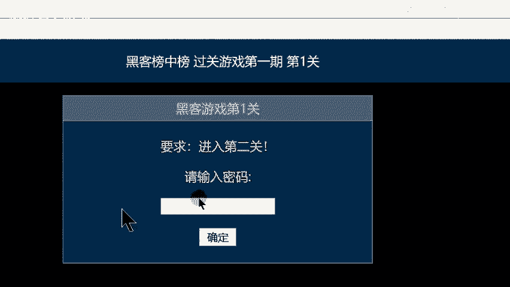

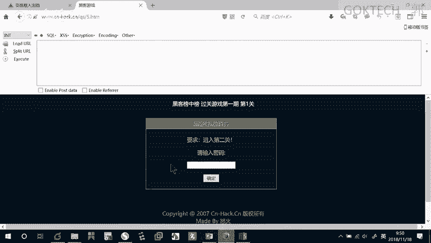

啊，右键右键不了是吧？那我就要打开它一个控制台F12这边有一个查看器。

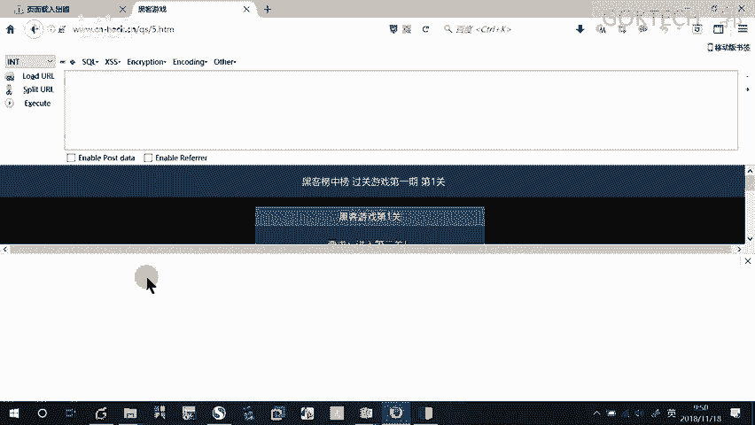

点开可以看到它的一个源代码。

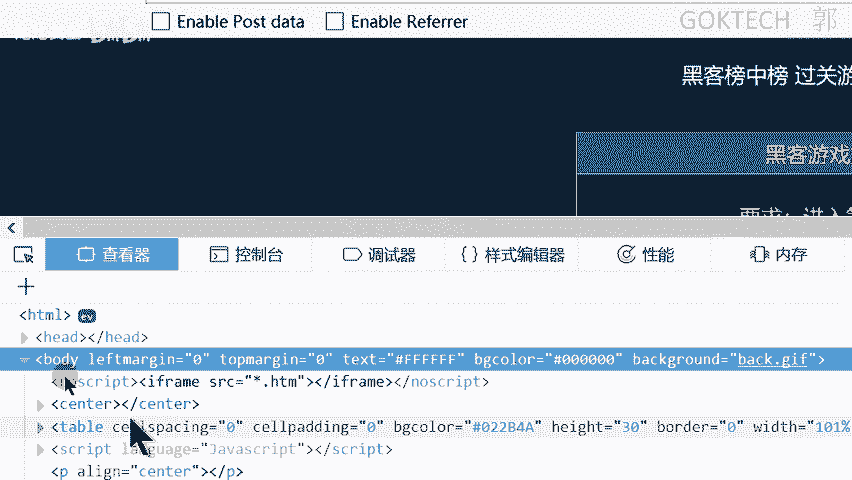

因为什么我随便来尝试一下吧，拿一个回车。😡。

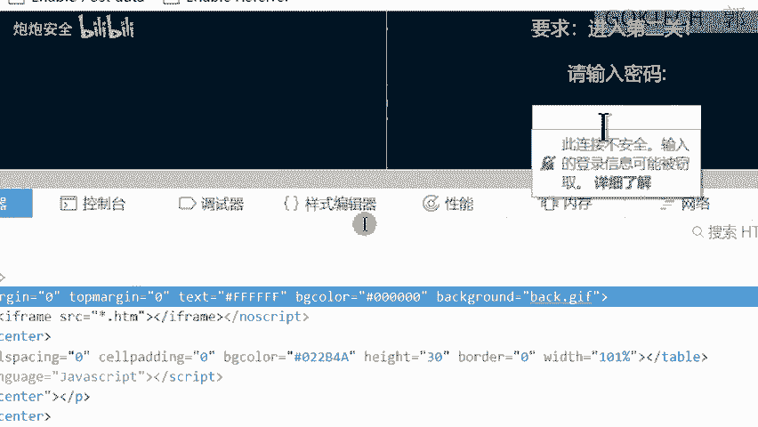

他告诉我干嘛啦？😡。

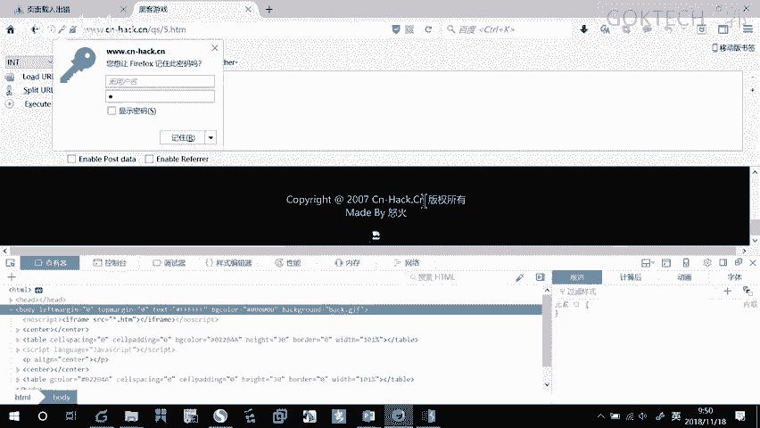

嗯，他什么都没告诉我。随便拿一个啊。他说别灰心，再试一次是吧？啊，O。😊。

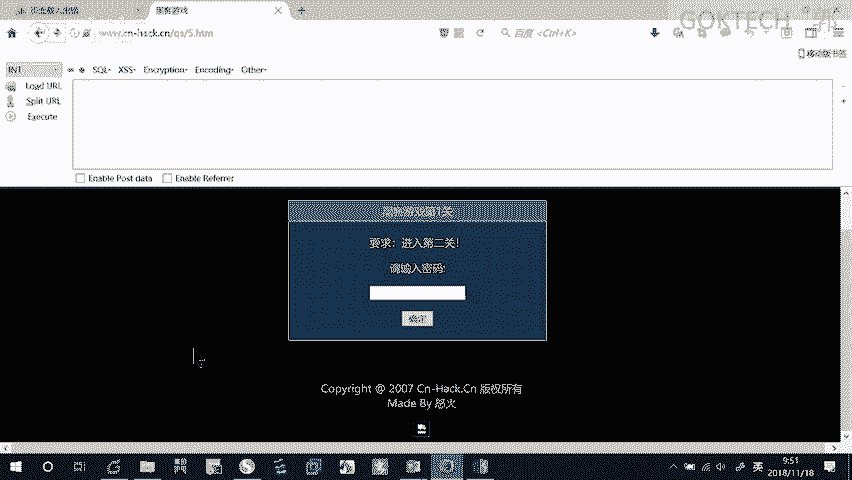

别灰心，再来一次，那我就再来一次吧。也就意味着什么呢？我们这个什么源代码，你看到是有一个是一个atomimate的一个格式嘛，有个atomimate的头部，还有一个什么呢？😊。

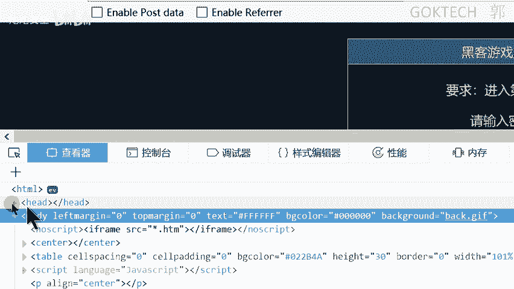

尾部啊，然后呢中间是它的实体嘛，中间是它的实体。这个。OK那我根据刚才的报错嘛，我就去找找了，找到这里有一个什么啊。😡，打印啊screen啊，来这里呢刚好就有一个什么别灰心，再来一次是吧？

那什么时情情况下会答对呢？就在这个边地方吧，说ifX它就定义了一个什么X呢VR定义了一个X，那这个值啊，那这个值就刚好呢可能是什么呢？你看着allet是什么意思啊？还记得吗？这个。😊，对。弹出。

那也就意味着什么我这个X里面填的这个什么go，然后有个空格就可以了。那这个呢。

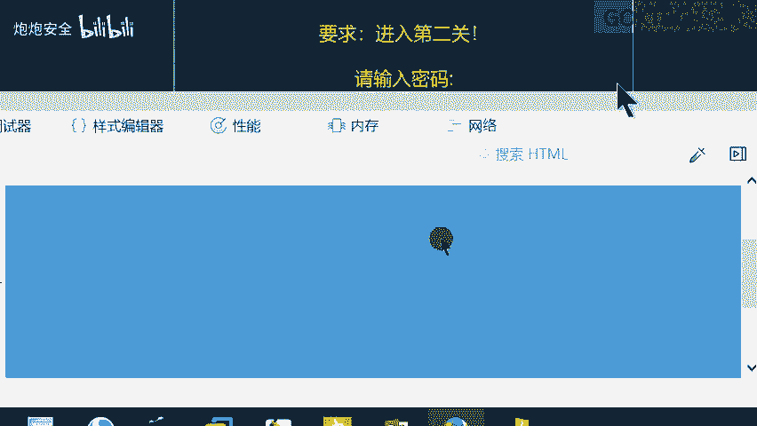

啊，虽然不是在源代码里面找到了flag，但是呢它。

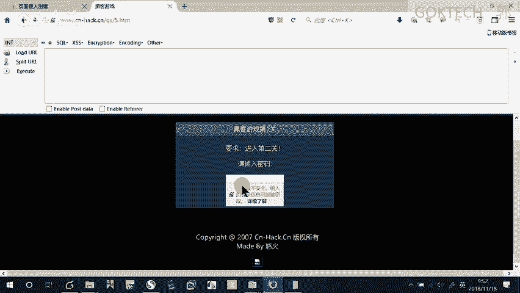

啊，也能够让我进入下一题啊。这是一个游戏啊。对。就像我之前发在群上了哈。😊，我应该有发吧啊。来。那比如说针对这种题啊，什么都没有的题啊，看着啊，这时候我们需要做一个操作，就是设置它的一个什么代理啊。

代理的时候在哪里设置啊？首先这里有个三道杠，我放大一下。😡，火狐浏览器啊在火狐浏览器上，这里有个三道杠，三道杠选择选项高级部分啊，在这个网络这里边哈，干嘛呢给它设置一个代理。😊，必须注意的是。

设置代理的这个端口号必须跟BYRP设置的端口号一致，也就意味着什么两边都要设。来这里哈这里一般情况下有一些内容，你把它清空就可以了。好，然后在BUP里你面怎么怎么去操作呢？首先选中这个什么了？代理。

选择什么呢？😡，办理这个模块嘛，选择这个选项选项给它设置一下。首先呢第一个啊端括号你肯定要一致。比如说8080，那你就统意8080，记住了啊，这个怎么去编辑啊，必须先点一下这里。😊，这个地方注意啊。

这个地方必须先点一下，然后你才能去编辑，不然的话你编辑不了了，手按不了，按烂了都不行啊。啊，然后呢你就可以开始去抓包了。😡，ok。有些同学呢如果说是。你要是。这个地方开的代理好，但是BYRP没有开。

那你就是不行了。啊，那就是不行了。好，有一个很大的问题。爱本色那呀。来。我现在其实没有拦我没有开启拦截嘛，我我是没有开启拦截的。但是呢如如果我访问HTBS，它就认为是一个什么不安全的链接，高级。😡，啊。

只能只能通过这种添加例外的方式，把百度哈这个网址干嘛呢？确认安全例外，这样子的话就可以正常访问了。但是只要你每一次干嘛呢？S的，你都要添加一次例外，麻烦吗？所以说我必须干嘛呢？手动给他添加一个什么证书。

在这里。一样的在option选择这个这个的下面一点点设置这个代理的下面一点点，这里有一个什么inport或者什么export，就导入导出的这个CA证书啊，那我干嘛呢我把它导入出来。

导导出啊exportexport啊，导出一个什么呢key。

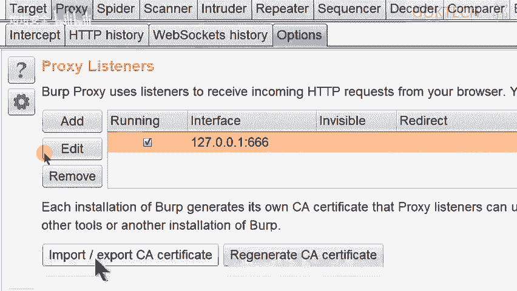

打个T。给它打出来。哎，我是导出还是导入啊，也点错了。导出没错。给它命名一下，保存在我的E盘里面。不用设置密码啊，下一步哎呀。嗯。123456。佢。啊，这有一个一这么一个这么一个文件哈。这么一个文件。

然后我要把它导入到我的一个什么了，导入到我的一个浏览器里面。啊，导入到我的火物浏览器里面。选项。啊，高级。证书。啊。查看证书，这里有一个证书机构啊，证书机构啊给大家干嘛啦？要选这个证书机构啊。

给它导入一个。给它导入一个。要等唉，这个页面怎么这么奇怪？啊，给它导入一个就可以了。我们看一下刚才那个有没有导进来啊。

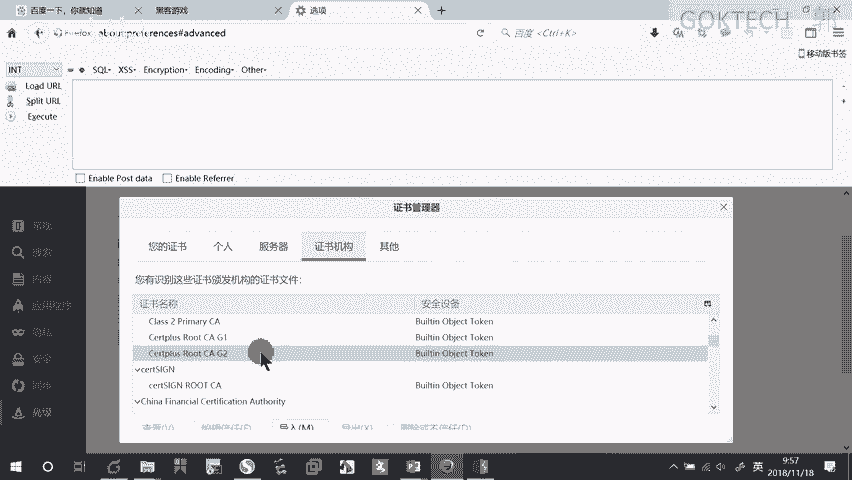

点多啊。反正一般情况下按这个来这个来导入就可以了啊，这个来导入就可以了。我就不多说了啊，哎，应该看到了。啊，反正正常情况下，唉找不到了找不到了，应该取一个比较特殊一点的名字啊，取一个长一点的是吧？

一目了然。啊，正常这样子操作就可以了啊，正常情况下就这样操作就可以了啊。😊，那这个这个情况这个网站呢是我刚才干嘛了啊，就我刚才进行一个呃添加例外的，添加例外的哈。😊。

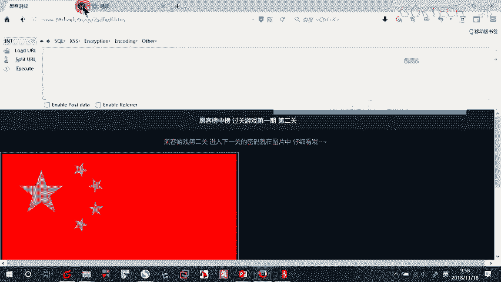

看一点。重新启动一下啊。哎，是我。做错了嘛，是吧？等一下再看了，这个不是我们的一个重点哈，等一下再看了，这个显然是刚才没有做好，应该是我导出的时候导错了啊啊。我再看一下，导出这个没错。啊，那等会再看了。

等会再看了啊。等会再看，那我们等会再看了啊，这个无关重要重要。主要是说什么呢？有这么一个问题，大家也不用担心，就是下载这个证书就可以了。等会我再研究一下。行，那这里呢有一题啊。

就是说这题我必须开启这个使用这个拦截的功能啊，才能够去对它进行更改，或者说什么才能够访问它才能知道它返回的是什么内容。因为呢比如说我这题啊。放到我的一个火物浏览器里面。粘贴。

这里直接给我提示什么都没有是吧？那我右键。😡，查看页面源代码。啊。有吗？没有吧，因为刚给我返回的这个at的一个正文嘛，对吧？OK那我怎么办呢？我只能呢先去尝试的拦截一下。😡，啊。

拦截在这个在这个地方代理这个拦截这个地方给它打开。那么on打开。OK然后这个地方啊刷新一下。刷新到这边来，这边来之后呢，我没办法分析啊，我想分析它的一个响应包怎么办呢？先把它放到什么呢？

repeat模块。其实这边的话呢forward。😡，啊，也能够什么啊也能够去去去去去让他弄。但是呢正常情况下呢，这样子效果不是很好啊来。在这边。只要我不断的服服是什么意思啊？

接下来下一个下一个下一个就是把它发出去就可以了。但是呢这样子的话，我没有办法在一个页面同时观察请求包和什么响应包。因为等一下如果你要改嘛，因为如果说涉及到改的那种题目的话，你肯定要还要返回去改。

那你反回可改，像这个题目，我怎么改啊，所以说怎么办呢？我只能什么？😡，再俯卧一下啊，再俯卧一下，把它丢掉啊。O先给它丢弃一下。重新拿一次啊。刷新一下。就我如果就被改给它给它放到repeater模块嘛。

啊。点这里。这样子我就能够在你同一个页面上观察到请求和什么响应。如果说我想改的话，直接在那面改，改完之后呢，再购一下试试。如果不行，再再改啊。够一下。这边就有flag。

但是这个flag为什么不会显示在我的前台？😡，因为它显示的是什么？是这一段at了，对吧？这一段会显示吗？肯定不会呀啊。😡，看一下。错了。那再来看一下前端代码的一个解题啊。前端代码。

就说我涉要涉及到怎么样的一个代码，我ZS或者其他的，我需要进行修改啊。那修改的话呢，相对来说呢，你就要使用到一个浏览器啊啊，火狐浏览器来，首先我们来看这题啊。😊，啊，代理要给它关掉。来多少？143是吧。

14。43。哎，紫允许干嘛输入一个。只允许输入一个怎么办？这肯定是前端代码受到受到阻限阻碍了。什么样前端代码受到阻碍？你比如说有一些。有一些那个那个那个那个叫什么，有一些网站它不让你复制。

有时候就是在前端代码的时候设置的这个限制啊，那我怎么办呢？那肯定是查看页面那个代码呗。而且上次我们做啊上次我实验了这个。😊，这样子查到页面的源代码是没办法去没办法去修改的，怎么办呢？必须用控制台。啊。

按F12。一样的找他的巴dy是吧，他的一个实体是吧？实体这边我们看一下找找啊，来这里有一个什么。😊，input嘛。铺的关键字了。OK这里有个什么。😊，我相信他那样的英语还是有一定基础的哈。😊。

markax是什么意思啊？😡，最大的一个什么长度为一啊，类型就是什么？你只能用文本啊，你不能输入图片啊，那我这个地方干嘛双击一下，把它改为什么十让它大一点。14。2213。验证一下。

back是不是直接过来啊？2。行，那我们继续。还有这道题啊。😊，这个你恰好就是我们啊平台上的一个体验。GSbox的这个是吧？😡，什么叫JS bug？😡，包含了几个几个信息。用几几个符号来表示。啊。

不是6个吧。😡，还是这个。感男儿在不在？😡，加号算不算？😡，括二算不算，这算两个。😡，这个算不算？😡，那这s阿。多出来什么。😡，是我说错了吗？😡，应该没错啊。来，那我们要打开它，既然他他说的这S放了。

那肯定是什么？这里面有个嘛？这边有。有吗？有了吧，这边干嘛给它复制。哎呀，还不让我复制是。我双击啊，还是说我还没双击。我双击了，不然不让我复制啊。啊，对呀，你是对的。然后点到这个旁边这个控制台嘛。

这个旁边这个控制台啊。粘贴进来伪车一下。是吧。What。啊，然后复制。啊，粘贴到我们的一个平台上就可以了啊。平台上刚好有这么一个提议。呃，应该是这个。啊，你算出来值是回头要粘贴到这儿啊，你不要瞎粘贴啊。

它那个地方又没有又不像我们这个这。又不不是要不是我们有没有跟他连在一起啊。还有啊这个就是前端前端的啊前端代码分析啊，以及我们的一个协议分析。好来。😊，HTTB协议这个比较常见的考点。

常见的考点是修改HTTB头。😡，符合某种条件，达到成功访问目标的一个目的。常见的方法就修改什么？这个叉 for的 for叉 for for是什么意思啊？😡，就标识什么自己是从哪里来的啊呃。

他他是用通过哪1个IP或者哪个主机来访问的。第二个是什么呀？😡，修改什么refer是从哪一个链接跳转过来的？第三个就是什么你接受哪一国的语言啊，一般情况下有这么几个来看下第一种。😡。

要求从某个IP或主机访问，一般是修改这个好。第二个要求从某个国家一般要修改这一个一第三个情况就是什么，要求某个访问页面访问就修改什么了。啊，要求是从哪一个页面跳转过来的啊，那你要改这个值好。

这个就是它的一个什么三个三大情况啊。来，我们来看一下啊，这题啊挺典型了。I you from Google。啊。yes，唉，没地方那你输是吧？没地方那里输符合哪个条件？你要求什么？😡，从某个哎。

谷歌不是国家啊，谷歌不是国家，是从哪，那肯定是从哪个页面呢。那我们只能干嘛修改是吧？修改只是必须开启拦截。😡，来刷新一下。好，OK把它发送到VP的模块。因为我要不断的去尝试，不然等一下你会哭的。

既然是什么了，要求从某个网页跳转过来refer是吧？唉，要用英文啊。😡。

马哈谷歌的网网页是网址是多少？

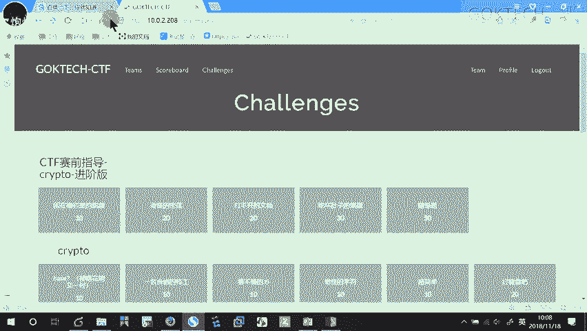

谷歌。啊，风控肯定不对的哈。😊，西烟你也不要瞎想了啊。😡，肯定点com了。哎呀。系呀。这点红控。点红控，你不能复制，你只能复制到这。啊。对吧。来。😊，逗我一下。那。他说什么？

are you from Googlegle不是。好，那改一下。点风控。告一下哎，也不行，是吧？那真的是点C烟吗？😡，够一下也不行。其实这一题呢。只要这样子就可以了，就不要再加一个斜杠了。啊。勾一下。

差点打脸是吧？black来。这个地方。啊，这是啥出来的？有些同学已经懵了。来再来看一题啊，没了是吧？没了没关系，哥有的是题啊。来。现在哈。我开一个环境给你们做，每个人呢动手一下啊。系呀。这个是综合。

这个是外包线对。看一下够不够啊。应该也够啊。我的。😔，配置多少？4G的那卷应该够了。稍等一下啊。几个小同小题目大家练习一下啊。

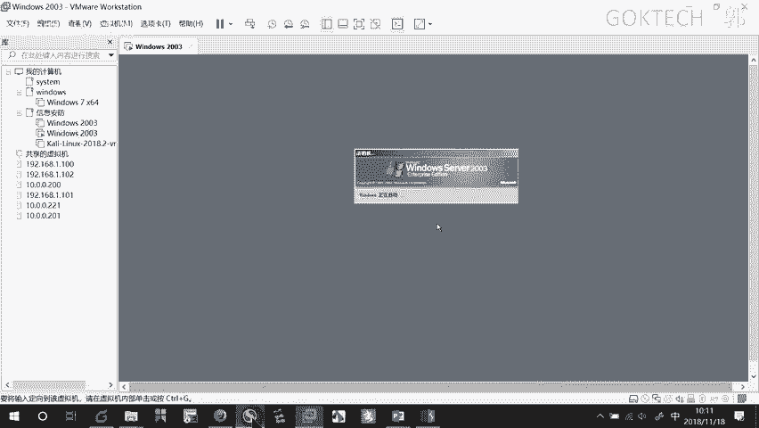

我把这个最新的PPT给大家发一下。等一下啊等一下。来看一下。嗯。没有IP吗。稍等稍等啊，我调一下啊。我看一下他的网址是多，他这个IP。调节自动没错，确定。编辑虚拟网络编辑器。啊，乔件啊乔件不能选。

不能选自动啊。看一下我的无线。10。0。3。143，大家登这个网页网页。按错了。10。0。3。143。这里有三个网址。三个场景。啊，大家去做一下。啊，当然你首先得看一下它是什么样的模式啊，那我们先做啊。

来，我把这个讲一下啊。来，遇到这种这个呢只是一个练习啊只是一个练习啊来。😊，在这边遇到这种场景啊，你首先先点一下，看一下它长出什么。😡，这个是什么说什么错误只能在本地访问嘛。好。

OK我们这边符合哪个场景呢？他说什么？😡，要求从某个IP嘛，或者什么主机访问，是不是？那是不是他要求从本机本机，也就说什么从我这个IP里面嘛，OK那现在返回来有了。😡，有了思路之后呢，我们再试一下啊。

这里给大家们呢拦截一下，勾上啊，这个软件如果还打不开，就就应该反思一下了啊。来场景一点一下啊，它拦截到这边了。那我们怎么做呢？如果你知道的话，你知道怎么做，直接在那面做，做完之后呢。

直接直接给它放行就可以了。如果你不知道怎么做的时候，你就放到repeat里面啊，这里呢干嘛呢？弄一下来，他说什么？😡，可以使用这条命令啊，叉for叉 forward word啊啊 for是吧？唉。插。

服务。的。For。啊，本地IP本地呢本地有一个本地IP啊，叫什么呢？127。0。0。1，这个代表自己，然后你够一下。访问成功。但是如果你想让这边访问成功，或者说想让这边进入下一关啊，你怎么做呢？

你把这个。复制一下。然后跑到刚才这个拦截页面。放到这边粘贴。然后这个什么关掉拦截看着啊。关掉拦截，它就自然而然就跳到访问成功的页面。明白啊。OK第二个场景是什么呢？😊，他说什么错误只能在什么因国访问。

😡，我们对应到这个场景来。什么。要求从某个国家访问一般修改这个accept language是吧？😡，开启拦截。点击场景2okK。他这边是不是本身就有leguage啊？😡，因为他肯定要有设置一些嘛。

那我怎么办？只要在后面补上就可以了。这个是什么哪一国的。😡，美国啊前面这个才是中国，对吧？OK怎么办呢？EN杠什么GB这个是英国的，搜一下都有。没关系。对吧。再来长景3。他什么错误只能用什么IE吧。

是不是怎么办呢？😡，勾选拦截点击场景3好。我目前我说了。😡，啊，有一个字段是可以带可以什么包含我的一个用户的个人信息嘛，就这个地方它可以标识出你是用用手机还是安卓啊啊，出来。

它可以标记出你是用手机还是电脑访问的。你比如说我们同样是访问百度，百度这个网页，你说用手机和用电脑访问的页面能一样吗？😡，肯定不一样吧。所以说么这里已经提示了啊。😡，这里我用的是什么firefox是吧？

他要求我用什么？😡，微软的怎么了？micsoft嘛IE多少8。0。😡，如果你不不确定的话，你就放到repeat里面去尝试一下，尝试完了在这边。放行访问成功。好，来，我这里再补充一点。

刚才啊我不是说了有个证书的问题吗？如果我没有证书，你看着啊，我随便我关掉一下啊。😡，我昨天反官一个网页，这个网页说什么不安全的对吧？只要是SS的，带S的都是不安全，我必须干嘛给它添加到。😡。

高级这边添加到例外，那我怎么做呢？刚才那个地方点错了啊。😡，这里。代理这个地方选项这里哈一样的，同样是这个导出。但是呢我们点的不是第三个啊，是第一个就可以了。刚才也查了一下，查了一下之前的一个笔记啊。

来点第一个。下一步。这里呢选一个吧。选一个存放的位置，存放的位置，比如说存在一盘叫什么？1806。保存。保存完之后呢，下一步导出就可以了。导出完之后呢，我肯定要安装嘛，安装怎么办呢？

在火屋浏览器这边三道杠这里。选项。进入选项之后打开选项，然后呢选择高级。证书查看证书导入。啊。所有所有文件有1个1806的是吧，打开打开之后，它会弹出这么一个窗了，信任使用此CEA标识的一个网站。

信任使用此CEA全部给它勾上。啊，然我确定。你可以查看一下这个证书啊。谈看这个证书。导入完之后。啊。我们找找啊我找找。然后8理论上他数字应该在最前面啊。啊，关掉，重开一下啊。可以吗？可以吗？

可以正常访问吗？有还还有谈广。弹一个什么窗户吗？还要有弹窗吗？没了吧？而且这里方我们刚才添加例外，我百度那个地方，百度嘛上百度3W点百度的时候，那个地方填的这这里的是有一个问号还是感叹号的啊。

就有个证书的一个问题啊，那现在已经完全O了，没有任何问题了。当然我前提是你不要开代理啊，你代理这个拦截，拦截不要给我打开啊，这个拦截，这个拦截不要打开。😡，那么他就会以正常访问OK啊。行。

还有这些题目啊，自己看一下，不懂的再问啊，那我。

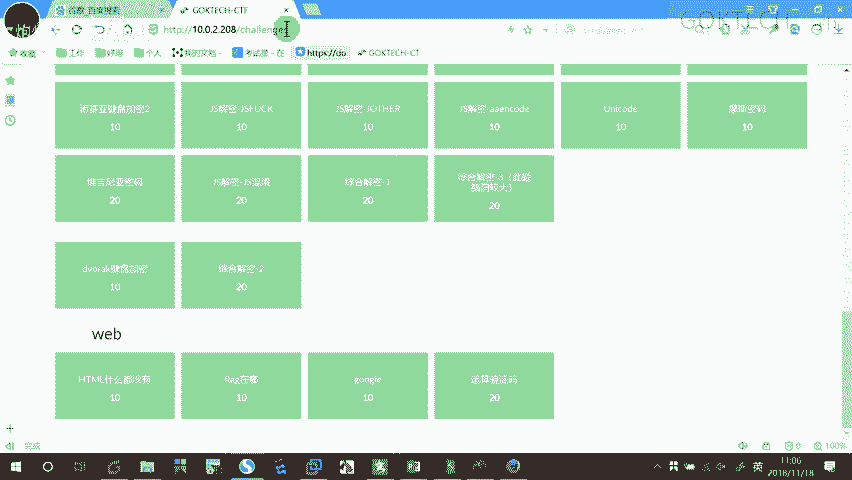

再来讲一点点内容吧啊。我们讲一下。讲一点点的SQL注入了一个原理。稍等啊。点热。

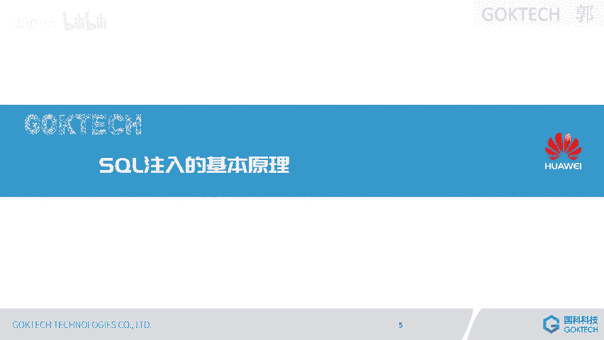

来这里普及两个概念哈，一个叫数据库，一个叫什么DBMS数据库呢是存放数据的集合。啊，那这个毫无疑问。啊。DBMS叫什么数据库管理系统是一种操作和管理数据库的一个大型软件。像咱们平常说的什么啦？

circle servermy circlercle啊acle db two的这些全部你平时我们都叫数据库，其实它是错的，它叫数据库管理系统DBMS它是为了来管理我们的一个数据库的啊。

就好比如说我们图书馆里面的书是按有序存放的对吧？你要去找书的话，你要去借书的话，就要去去找那个呃呃那个叫什么搜索了一个网网址去去查一下你这个数放在哪里，编号是多少，你这样子才能去查书嘛。去过图书馆吗？

多阅读啊。阅读还是有好处的啊。OK来这里面呢涉及到一个概念叫关系型数据库和非关系型数据库。关系型数据库是什么意思啊？就是我们任何的数据都可以用横纵坐标的方式来，就是用表格的方式来体现。

就是可有什么横X轴和Y轴来表示什么意思啊？你比如说什么啊，我的一个什么呃那个有一些数字数据好我想想啊，有一些数据，你比如说。😊，呃。最普通的最普通的来来最普通的，比如说我们的人的信息啊。

来这边呢他可以什么有一个什么姓名。😊，姓名啊，联系方式啊，这里呢底下呢可以是什么学号啊，各种方各种方式的一个呃东西。你比如说这边有个姓名，然后呢性别啊，那我每一行是不是都就是一个人的数据。

每一行就是一个人的数据啊，那如果说是一个图片。如果是一个图片，你能够用横横纵坐标的方式来体现的啊，或者什么视频，你肯定不可能用这种嘛啊，那这些都叫非关系型啊，那这个叫关系型啊，具体的话我也不多讲啊。

因为这个还是蛮复杂的。好，O。好，接下来讲这个SQL的一个什么了语句。😊，HQL它的语句呢语法呢分为增商改查。最典型的就是比如说在银行里面，最典型的就是用到经常用到SQL语句。

当然它它不一定是用circle啊，cicle circlecle或者么circle它可能是其他，但是它的这个语言基本上差不多了啊，都是用啊中山改查就可以嘛完成一个动作，完成一个动作。

但我这边的话呢只会介绍一个叫什么查询。中山改查我们只想查询。因为80%的操作都是查询。😊，都是查询语句啊，那那个真三改的话呢，一般是刚开始管理员或者怎样其他的啊。好，OK我们来看这个语句哈。

这个还是蛮简单的。😊，首先有一个关键字叫select的查询。这个是字段，查询某个地段，从某一张表里面查询字段。从这张表查询字段。从这张表查询一个字段啊，然后呢我们来看一下啊。这底下有几个啊。😊。

这个就表示我要查询这张表的所有内容。有问题吗？心就是通费所有。心就是通沛所有。啊，然后后面是加上条件语句，比如说我要选出某一个人。并且他用户名的密码是这样子的。那这个呢中间要加and。

and如果查询得到，如果查询得到的话，说明这个用户名和密码是正确的。最典型的一个就是什么样啊？我们这边来。最典型的就是哎，我看一下。啊，最简型的就是一个系统登录。我提交一个po的请求嘛。

我我这边输入用户名和密码嘛，我是不是要构构建一个我网页嘛？因为我要提交表单，是不是要有一个请求啊，然后对方给我响应嘛。那我提交的请求，要么是post，要么是get嘛。那我说过了。

post是不是比较安全呢？😡，所以说这里用pos的pos的话呢，username等于themin and password等于什么？123456，这是它的一个什么请求包转到这个web服务器这边嘛。

他要跟数，因为我用户名的密码一般情况下是放在数据库里面的。所以说他要把这个东西转成什么SQ后语居。select星号fromaddmin，就是我用户名和密码可能都存在这个addmin这张表里面。

这是一张表，就是那个横纵坐标，横纵坐标的表OK。其中我要筛选。😡。

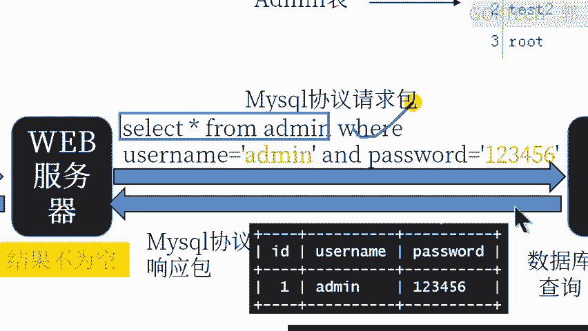

用户名等于什么？admin，并且password等1234456，它就会开始选，这个是一个语的关系。与意思就是说什么你要两个都匹配。匹配上了怎么样子啊？😡，如果这边有，那就是返回一个什么一嘛。

就是正确的。如果没有就返回一个零，那就是错误的那我根据这个结果呢给你返回。😡，登录成功的响应包或者什么登录失败的响应包。啊。OK这个是1个SQL一个简单的一个查询过程啊。

那如果说我要具体再具体具体深一点呢，比如说我这边还有什么逻辑语的一个运算啊，那我这里就不多说了啊。😊，哎，我打开一个网址，打开网页，稍等一下。把这个网站打开一下。我简单。简单弄个网页串啊。稍等。

我之前要有让你们装过这个PHP study嘛，对吧？我快速装一下啊。给他解压。检压完之后安装一下。安装到吸盘。它正在解压，解压完之后呢，会啊正给我运行就可以了。好，而且我们来看一下啊。我们来看这个啊。

它有一些查询语句啊，看到。来，我们看这个查询一据啊。select星号from person就这张表，这张表叫person，我要ID等于一会找出哪一条呢？就找出我ID这个选项值为一的这一条会给我显示出来。

就在这边。啊，一个被找到了。来，我们再来看一下啊。😊，刚才我们是不是都是新号了？新号其实说白了就是他把它的一个什么每一个项。😡，都给我列出来。但是呢如果说有时候我只想查什么，我只想看用户名。和密码。

那我就可以干嘛具体的一点。Slack。s比如说sack username passwordword就可以了。就是我只要这两这几项，我只要这几项就可以了。就说我只要列每一行我只要列出一项，两项。

三项就可以了。但如果说默认是信号，它要列出几项呢。😡。

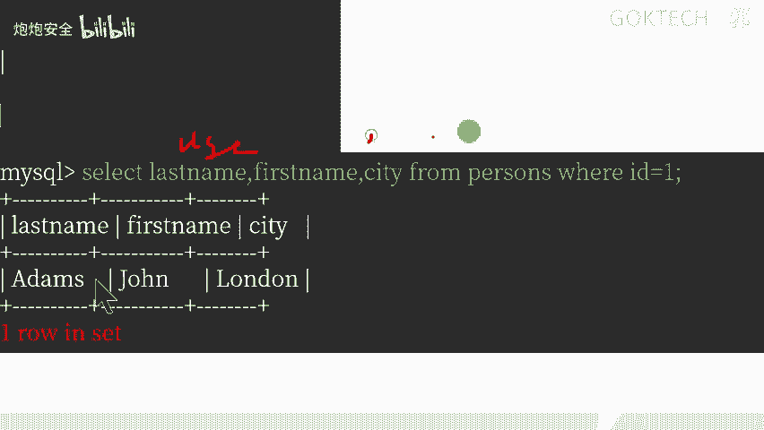

一项两准确来严格来说，ID不算了，一项、两项、三项、四项、五项。那我不许不想看这么多，我只想看三项，三项就这边。Forong person。啊，如果我后面没有跟这个，他也会把所有的东西给我显示出来。

只不过它是什么呢？只只查看这三项。好，那现在呢我VR isID那我VRID等于多少？那我就只显示了一个什么第一条。好。它会涉及到雨和什么呢？或来我们来看这个。😡，选哪几项要显示哪几项项目啊？

last name在哪？这里还有什么first name在这儿是吧？😡，city在这是吧？😊，我要lastest name于卡特。last name等于卡特。and first name等于托马斯。

对吗？😡，carter这一条跟托马斯那条是不是同一条，是不是能够与得上，那就什么选出一条来。😡，啊，这条。如果是这样子的。稍等。

t last name妹first name citylast name ，first name city。对吧从这张per程表，we are拿 name gate。😡，拿起那边盖子对要。

and什么啊奥奥的什么first name等于托马斯。😡，这两个的关系是雨还是祸？货吧。货嘛货的意思就是这两条全部都什么可以，也就意味着什么，因为这两条都有找到嘛，所以说两条。😡，呃，是我看错了是吧？

35为什么？啊，托马斯是吧，那就是嘛三条。唉，没错，眼睛比我好。所以说他就有什么三条选中。当 and合货。and我同时运行的时候呢。先先与后后货先与后货，这里我就不多说了。

okK这里还涉及到一个静态和动态的页面，我就不多说了啊。动态的话要查询那个要查询那个数据库的啊。😊，好，那我们来看一下这个HQL一个注入攻击。好。因为呢只要我这个网页哈是有调用什么数据库的。

那么就有可能会发生就可以发生什么了？我们这个数据库的1个SQL1个注入攻击注入攻击。那我们先来看一下这个SQL的一个语句啊。我先把这个东西然后给他。这个东西已经弄好了啊。旗舰店。えい？

我在这台虚拟机装了一个PHP study嘛，因为它因为它是本地嘛，所以说是127。0。0。1嘛，对吧？OK这是它一个探征啊，是因为它有这张网页啊，看着啊它有这张网页在哪呢？在这边。这里呀有一个什么呢？

其他选项和菜单，这里有一个什么网站跟目录。就是因为他访问到这个网页的跟目录里面，访问到的这个啊。这个访问到这个啊访问到这一张啊，这张我们可以看一下打开用什么打开啊。用我们的1个TATT文本就可以打开。

稍等。好。找不到探针是吧，那说明不是这个。啊。这个PHP音付我们看一下啊。PHP study的一个探针啊，探针我们收探针最好。最好说探真啊。这。

title嘛title就是head titleitle就是头部的一个什么标题PHP探针就刚好是么。😡，刚好是我这个PHP探争for the什么PHP study2014。啊。

是吧2014嘛啊2014OK他是访问到这个网页我这个这个这个这个这个这个。PHP的一个什么文件啊，PHP文件OK这里有一个，如果说我想默认情况下，因为是网站跟目录嘛。

所以说我默认情况下就访问到这个跟目录底下的文件啊，按顺序来访问。如果我想访问这个PHPinfer，我要干嘛呢？在后面加上指定的内容。😡，PHP infofer。啊，如果说没找到。

那这个东西呢就有点问题啊。我们看一下这个PHP inPHP infer。PHP音付。我们看一下它里面有没有内容啊啊，那里面没有内容，那显然是找不到的啊。如果我我想访问到这这个目录底下了，我要干嘛呢？

也是要跟上这个具体的目录，PHPmy命。😡，P，HP， my amin。啊。这里有一个网址啊。这个叫root rootot。这是一个。数据库管理系统。

circle circlecle server的一个数据库的管理mysql的一个数据库管理系统啊，数据库管理系统。我可以导我可以针对这个来进行一个导入啊，我可以创建一个表数据库啊。稍等啊。

数据库数据库点击数据库。我可以新建一个数据库啊，新建一个创建一个。啊，我我我要我要把数据库文件放进来啊。稍等。我看一下。找一找啊，还真的得找一找啊。我把一个数据库导进来。稍等一下。你要么是从这里啊。

数据库这边新建，我放大一下。你要么是从这边新建，要么是从这边一个导入。啊，这里有一个导路，稍等。导入一个数据库是吧，浏览一下。我的桌面桌面在哪？做咩。OK这底下有一个什么？HQL test的一个什么？

HQL。啊。O。执行。HQ testest。呃，错误是吧？哦，来。等下等下，我返回一下。你们稍等一下。哎，我登一下啊，root rootot。稍等稍等稍等。数据库。啊。新建一个数据库叫SQLtest啊。

创建一下。啊，创建完了这边会有1个SQL testest的一个数据库，但是里面什么东西都没有啊，什么东西都没有啊。里面是没有数据的，没有数据的话，我要。给他一个什么了？给他一个新建一个数据库啊。

新建一个数据库表啊，或者说什么呢？用SQL啊，给它导入1个SQL这个也可以啊。我刚才应该是这样做才可以啊，就我要新建一个数据库，叫SQLtest，然后呢再导入一个什么了啊SQL的一个什么文件啊。

这样才可以啊。😊，然，把这个文件放到我们的。啊，这个文件不用管了。我们先往下讲吧啊。😊，啊，现往下讲来。SQR注入攻击可以造成这么几个危害啊。首先呢可以绕过登录密码。啊，可以获取到敏感信息。

可以对文件进行操作，可以对自助车表进行操作，可以执行一些系统命令啊，这些都可以。但是呢我这里要先演示一个万能密码，然后呢教你们怎么去用工具去怎么啦获取一个获取一个进行1个SQ然后注入攻击。这个。

弄上来没有这么办？卡啦。啊，成功啊导入成功啊。到时有了。刚才是卡了，来。看着啊，稍等稍等。这个地方啊来我们看一下这个表啊，我们快速编辑一下。这里有一家一条命令，这个是什么意思啊？😡。

snck信号符通add密码就这张表是通配所有嘛。那我执行一下，它就把我所有的内容列出来，有什么123是吧？那比如说addmin123456，我可以这么做啊。😡，快速编辑。我要。怎么啦？

user name。等于什么啦？😡，啊，等 me。执行一下。我就把什么用户名等addmin这一条干嘛给我列出来，有吗？这里说什么显示几行显示一个嘛，有吗？有吧，那雨雨后什么的那些我就不演示了啊。

那接下来我演示一个万能密码的一个原理啊，来。😡，我们这里有一个典型的一个万能密码啊，典型的一个万能密码。打个比方。😡，因为我如果打个比方啊，如果我现在是在做那个做用户名和密码的登录的时候。

他是不是要帮我把那个用户名和密码转成转成那个HQL语句。那这样子的话，我是不是构建出来的，是不是and password word。😡，等于。123456这样子还可以吗？来执行一下。啊。是不是可以啊？

可以，然后我现在怎么做呢？你看花呗花费这么这么少时间来快速编辑一下。如果说我是这样子的。😡，12345。执行一下，有点慢啊，怎么这么卡？😡，稍等啊。你看他做什么。😡，结果为什么？结果为空。

是不是要返回一个失败啊？就我登录登录的时候啊，记住了，我这里是两个东西啊。😡，这是我去访问这个服务器的时候，他要把我这个我用的是用的是那个HTTB的协议嘛。那么该有的一个什么。

比如说他用的是PHP语言或者什么其他语言，但他要把我转成SQL语句嘛。😡，SQL句我这边给它显示一个空，那么返回来的就是什么了？登录失败嘛，对吧？我要是密码用名额密码找不到，那肯定是登录失败的嘛啊。😡。

但是打个比方，如果我的用户名是这样子的。打个比方，如果我用户名是这样子，我本身我本身用户名就是这个。啊，什么呢？addmin的撇O2撇一撇等于什么一什么意思呢？😡，好啊。等号啊。看着啊。我等下试一下啊。

我的用户名啊。😡，呃，另取一行啊。我的用户名是啊等稍等。A的 mean的。OR。一。等于一。好。哎，我把这个。用我名和密码放到这儿。哎，用户用用户放到这儿。它就构成了一个这个东西。注意看。

好的命是不是一个？😡，啊的名是不是这一个？😡，一是不是一个一是不是一个and。😡，pass word等于这个嘛，对吧？好，那我问你这个这个题先算什么，先算语嘛。😡，一and12345是对的还是错的？😡。

啊。错的吧。😡，错错怎么写？错是吧，然后呢，一等于零是对的还是错的？😡，这里有个等号吧，首先我错是不是零啊，一等于零是不是错的，这个就不相当于0二等命是不是对的二等命对了，一哦0对还是错？😡，对。

所以者怎么样？执询一下。是不是能够查得到啊？是不是能够能够返回登录成功啊？嗯，好，我们再来试一个哈。😊，我不想那么麻烦，我怎么做呢？我的用户名和密码，我的用户名是什么呢？😡，A的命。撇井号。

就这个地方这个这个是我的这是我的用名，这是我的用名，就这样，然后呢密码随便输。😡，他他他。能不能登呢？执行一下。也能为什么看到没有什么颜色？😡，土黄色啊，什么色我也看不懂哈。说的是什么？说的是井号呢。

把后面的东西干嘛呢？全部注释掉了。😡，明白吧？OK这种是什么手动的方式啊，就利用它的一个什么验证的一个问题啊啊，这里有三好几个。😡，我这里就不多说了，自己一看，就通过这种方式呢可以返回，结果不为空。

我就可以绕过它的一个密码啊。😡，啊，那我这里就不多说了，我们看一下有没有环境啊。嗯，我看一下这个环境行不行啊。这个环境我记得可以绕过啊。稍等一下，我的活物量去大在这。呃的命。P。井号没错，密码了吗？😡。

他他他。这个还没有还。这个还没有环境啊，没有环境算啊。Ad命。pass word。进来就进来吧啊。这里呢有一个什么呢？这里有1个XQL注入了一个环境啊，注入了一个环境。当然了，我们不是用来登录哈。

我们不是用来登录这个东东西我们不管它。奇怪我记得这个东西可以可以可以注入的。😊，可以可以可以绕过了，稍等一下，我试一下这种行不行啊，PA。好啊。撇OR一嘛。等于。一对吧我刚才应该是用这个嘛。这样子的话。

我在我添构造成SQY语句的时候，是不是在这边干嘛添加一个撇，就你么呃的命给它弄出来了，对吧？okK我看一下试一下啊。😊，哎，还还真的可以啊。如果说是刚才不行的话，他有可能啊有可能这个井号被你干嘛了。

被我干掉了，就是被他干掉了，他就不允许你输入井号，也有可能明白我的意思啊。啊，所以说一般情况下，为什么说有时候你是输密码的时候或者用户语音的时候，为什么他不让你用特殊字符号，比如说井号或者什么单顶号。

就是因为它有时候可以绕过啊，你要么是前端。😡，你要么是不让他输这个，那你就没有这种问题啊。😡，OK还是这个还是有环境可以可以弄出来的啊。现在呢我不用这个手工的，我觉得我比较累，我不想用这种方法。

我干嘛呢？用用这种什么呢？注入工具有吗？有这种注入工具，然是耶束。😡，这种工工具叫耶束啊，稍等一下，这个可以直接运行啊，放心，无毒无害。反正我是不怕死的。来，首先在这个URIL这边呢输入10。0。3。

点143。哎，没错啊。要示那没做。右边一点。右边一点，这里有个这个地方。打开网址。这啲。啊，用户名和密码是吧？Admin。哎。😊，ad的命对吧？password。登录进来，这里有一个什么SQL的一个。

注入场景。

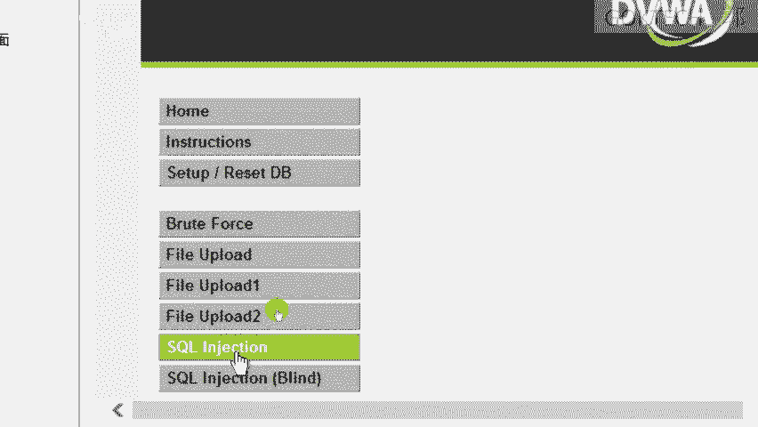

好， ok。就在这个页面这个页面有一个注入的嘛，对吧？注入的话我怎么办呢？这里有一个怎么啦？

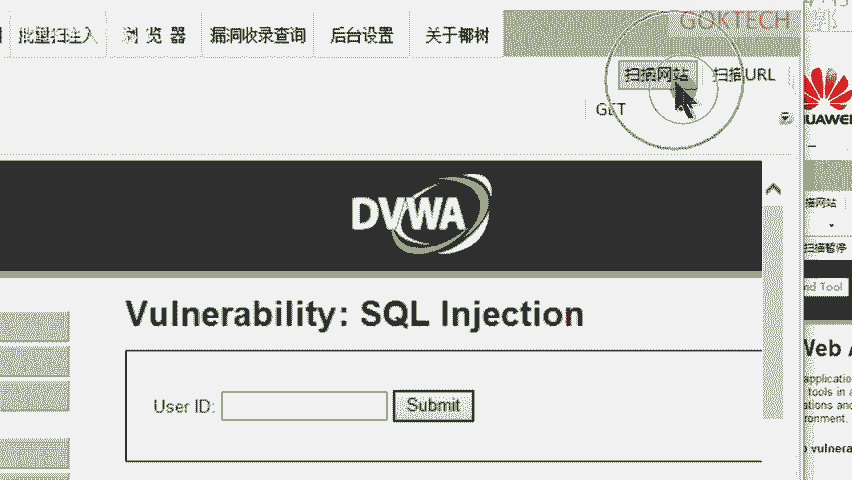

扫描网址网站。或者扫描URL，我们来扫描这个URL。😊，扫描即将开始是否确定。好，我就开始让扫它扫它啊扫它啊，这里呢马上有一个爆托了，就是有1个UIUSQL一个注入SQL就injection啊。

injection这是一个注入的一个攻击。右键啊SQL一个注入。😊，注入完了之后呢，它就会有弹出这个页面来。弹出这个页面之后呢，我首先在这里呢可以获取它的外b环境，可以获取它的数据库，可以获取它的命令。

可以获取取很多东西。我怎么做呢？看着啊，我首先通过它来获取一个信息。😡，这里呢全部给它勾上。刚才是没有这些的，我再点一下获取信息。稍等。他用的什么呢？用的什么版本啊？阿帕奇呀，加上什么啦？加上PHP啊。

加上windows啊，这个是一个windows32位的啊，很多这些信息全部DVWA的这些数据库我都可以看得到。接下来我要用它用这个注入的方式，我来获取它的数据库啊。首先点这个数据库。😊，啊。

获取一个数据库啊，数据库它本身就有了，我们不管它了，获取它的一个表单，因为它里面有很多表嘛，就好比如说我刚才新建的一个数据库叫SQL testest是吧？😊，然后我要导入一个数据库嘛，对吧？啊。

里面有guest book啊有可能还有其他的就取决于你这个速度够不够快啊，够不够快。因为它这个版本是一个什么32位的一个系统。所以说呢有时候呢相对来说会比较慢一点点啊，相对来说会比较慢一点。

如果你不是很喜欢的话呢？你怎么办呢？你可以重新再获取一下数据库，重新获取就可以了。😊，啊，重新获取一个数据库啊，DVWA的。啊，然后获取表明啊表明我们可以看得到有一个users有两个users的。

其实一般情况下，我们看到users，我们就要有敏感度，要有敏感度users是吧？获取它的一个字段。啊，你可能可能它里面就有什么user name passwordword。

你看user ID passwordword看到啊，显示在这边的啊，就是横了啊来，然后呢，我可能还有 firstrst name看一下，因为IT只是1234，有可能只是123456嘛。

OK然后我调一下它的顺序。啊，ID first passwordword，然后我要获取信息是吧？获取信息，但是注意了，你这里要调，因为这里默认是1到2行，也就意味着你只能获取两个数据。

你给它调到100行。😡，点击获取数据。啊，他默认就有5个账号。5个账号来。这个页面有一个addmmin，还有一个什么password是吧，把它复制出来。😡，粘贴。

这个地方我以前就说过了这个东西是不是我已经就说过了，我们密码存放在数据库里面是经过加密的。这个加密方法是什么？对。好，就他了。哎呀。MD5。在线加密。查询一下。是不是pass word。啊。

那我们来我刚才做了哪一些哈？第一步，首先我用什么呢？😊，绕过的方式呢，我用万能密码是不是登录了我这个网站，登录完网站之后，我去扫描这个网站，发现它有1个SQL注入漏洞嘛。

那我就是什么通过状库的啊状库的啊，不是状库啊，我通过那个SQL注入的方式呢获取到它数据库的信息，提取出了这个密码，密码给他做一下MD5的解密之后呢，发现是M是password。

那我就真的可以什么为所欲为了。😡。

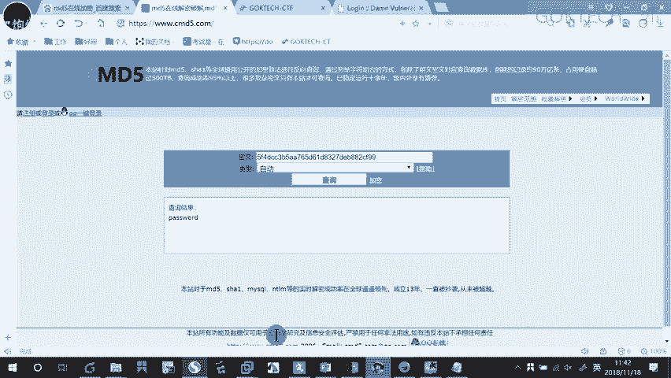

我就知道他的密码，用户名和密码了啊，那我就可以在那偷改。😡，因为有时候你即使能绕过密码，你能够把它密码改掉吗？不行吧，你要改密码，是不是要有原始密码？我虽然可以万能密码可以给它绕过嘛。绕过之后。

我还用工具嘛，我手工注入也可以。但是我一般情况下还是用呃用工具比较快，用工具可以给它获取到它的数据库的密码，就是原始的密码，原始的密码，我就可以通过这原始的密码把这个就可以可以给它改一个新的密码了。

这个是所谓的一个SQ来注入。😡，OK内容还是有的哈内容还是有的啊，回去好好消化一下啊，那我们就先到这儿，早上课就先到这儿啊，该订外卖了，该去吃饭的，先去吃饭啊。下午的话呢我们就呃让大家做一下实验。

然后呢，我这里的话呢就简单的。😊，简单的做一下答疑啊，好吧，可以。