# CTF培训网络安全基础入门 - P9：（10）CTF赛前指导1806班_答疑 - 炮炮安全 - BV1mT411q7qB

Yeah。

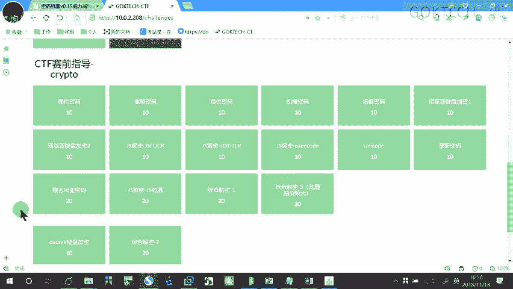

简单看一下。

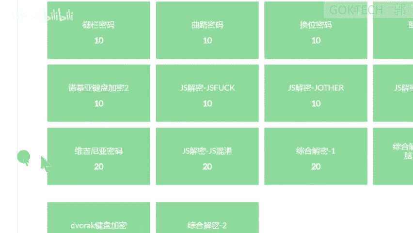

做一下那个我们说一下那个平台的这个赛前指导加密密码学的这个播做完。现在你们打开那个有没有问题？嗯。

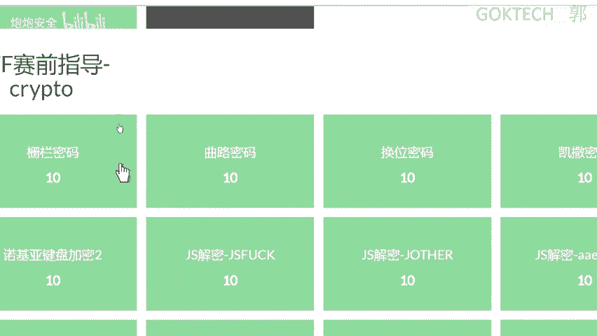

这里有没有问题？我放大爷。哎呀，这么棒。

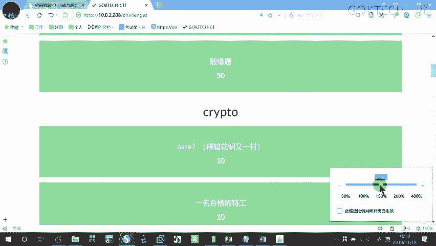

啊。科翻。那地。啊可可可接埋。嗯嗯。佢啊。好。我都唔大。

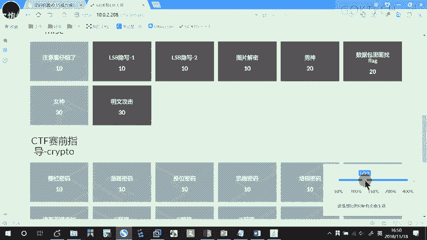

是。啊。

这里啊来这个反正前面肯定都是没问题的吧，对吧？😡。

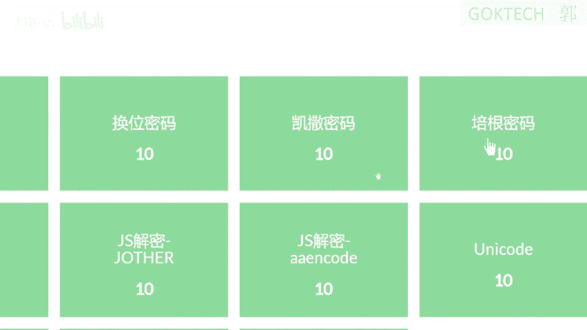

诺基亚加密的话呢，我改了一下，反正就是零就代表一个空格嘛，两个零就代表两个空格，这样子大家也比较好记啊。诺基亚立啊啊，但是那是这里个基本上都没问题啊，像这个模式密码也没问题啊。

维及尼亚维基尼亚这个地方啊。😡。

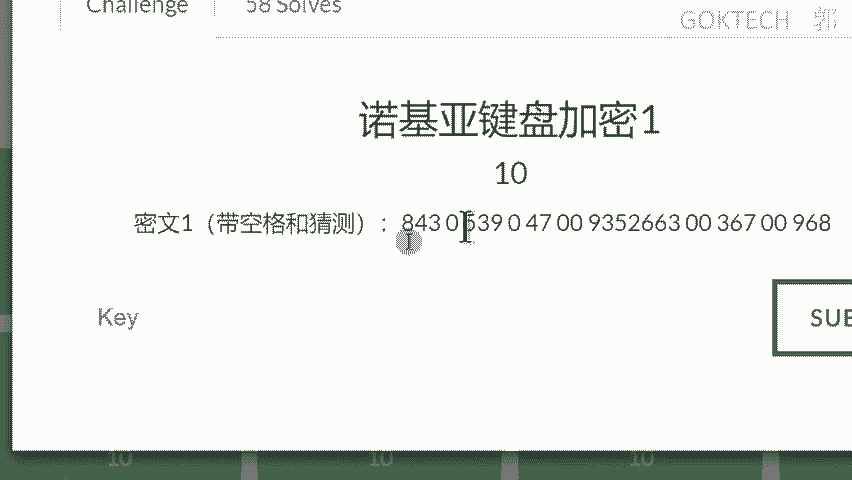

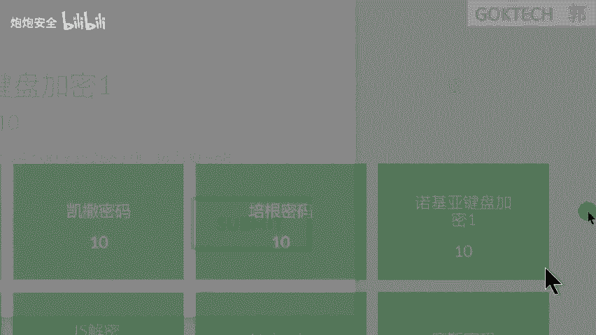

这个地方我们要去力推他的密钥，因为维今利亚需要有一个铭文。还有一个什么密码啊，循环利用的一个密码，然后再退出一个密文，对吧？它有一张表，那我现在因为它的提交格式是什么样子的，s么样。😡。

买号ZLflag。这样子他的提交包是这样子，也就意味着什么？其实他已经提示的很清楚了这几个。😡，都是铭文，那我就要有铭文，有密文就可以推出他的一个什么密钥出来啊。

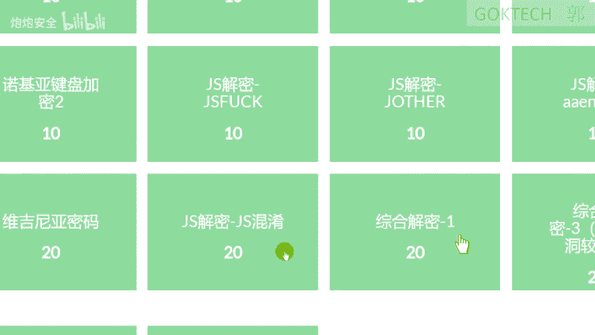

这个地方啊这里我附了一张图。啊，这种键盘跟我们目前的QWER这种键盘是不一样的，这种键盘是不一样的。它布局呢我们打打开在新链接打开就这张图。😡。

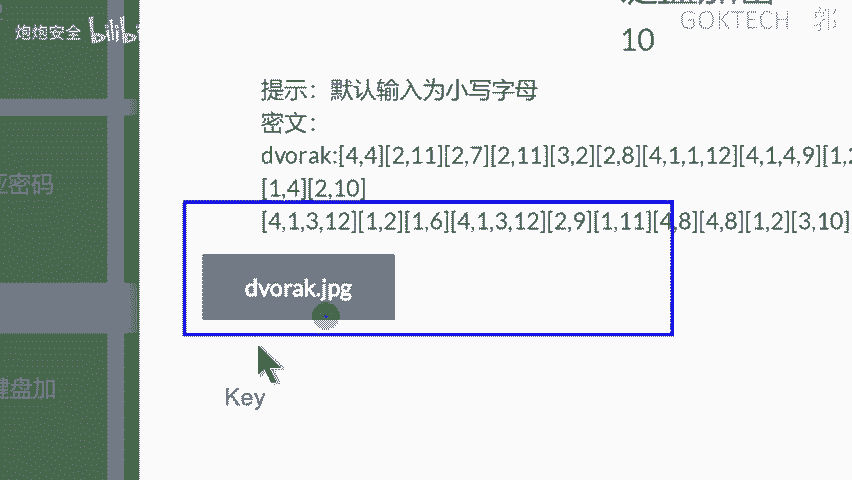

的布局跟我们是不一样。好了没友。但不局跟我们是录呛的。啊。okK你跟着这跟着他来算就好了。如果说他遇到这种什么四个数字的是吧，我告诉你这种是组合键，4一其实就是马戏福的键。😡。

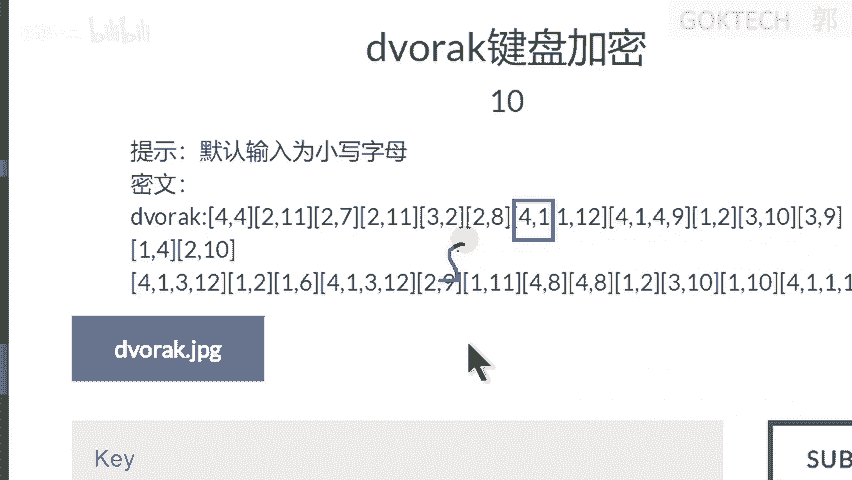

啊，那你看一下是否的按照这个键是什么功能啊，仔细看啊。

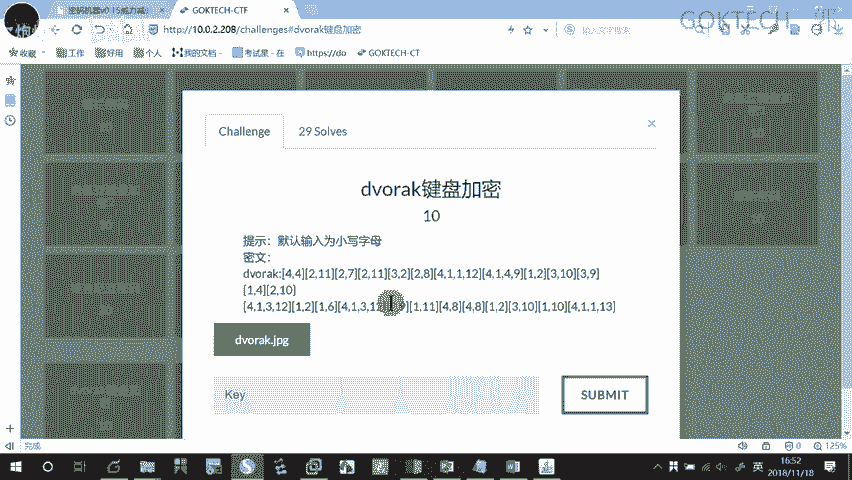

哎。

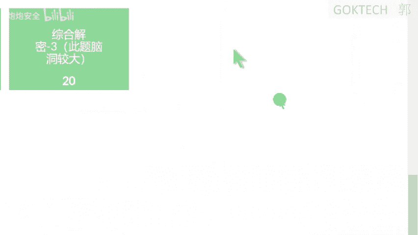

他为怎么复过去？嗯。看了吗啊看了是吧。这不是1234吗？没错，你这种你怎么打印出来，FFJ你怎么打印出来？😡，Yeah。是吧哎我这你怎么答答出来，就一的空格，你怎么答出来？并且你让刚发现这个是什么？😡。

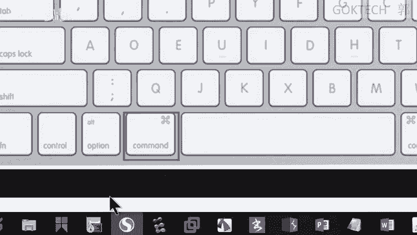

慢的。这个明你对。他们就没有所有的菜单界了。没有windows插件键看到没有？我比较早。哦。苹果的是不是这样mark克的是不是这种啊啊，不是很懂啊。来。这里我也不多说了，就把数字。

把这这个美这个是做培根嘛，对吧？然后呢培根完之后。数字结合的去做M6解密就可以了。啊。那至于有些人在讲这个脑洞比较大这题啊，脑洞体是怎么做的啊？😡，あ。好，话不多说，直接开卡。嗯。好，这一题的话呢。

因为它的一个密文铭文什么啊？这些啊是每8位，你看每8个位，8个位的话可以组组合成一个字符嘛。那我们就联想到了1个20克码值。所以说我也可以通过这个什么JPK。😊，好，我们那个密码的一个工具。

大吧对它进行解密啊，二进制转是什么ask码ask码啊，如果说我们人工的话，如果用小回的话。啊，或者其他的人工的话，你只能一个个来写一个个来加那个做一个编码转换吧啊，那这边的话呢不用。

他就直接什么你每一行写一个8位8位是数就可以了。中间不能有空格，也不能有什么空场。啊，仔。哎有有有。啊，转成这个之后呢。转成这个之后啊，我们再去对密钥进行一个解密啊，密钥把它解出来一样的。

密钥也是转成密钥在哪？密钥密钥密钥密钥密钥一样的用什么？这个解码给它解除这个，然后我们我们就开始去计算，用这个工具去算，你发现不行。你会发现不行，我们再仔细看一下DES有几种方式啊，有16进制的方式。

对吧？有什么二进制的方式，还有什么原始字符串原始字符串。但是显然呢刚才得到的这个密文。😡。

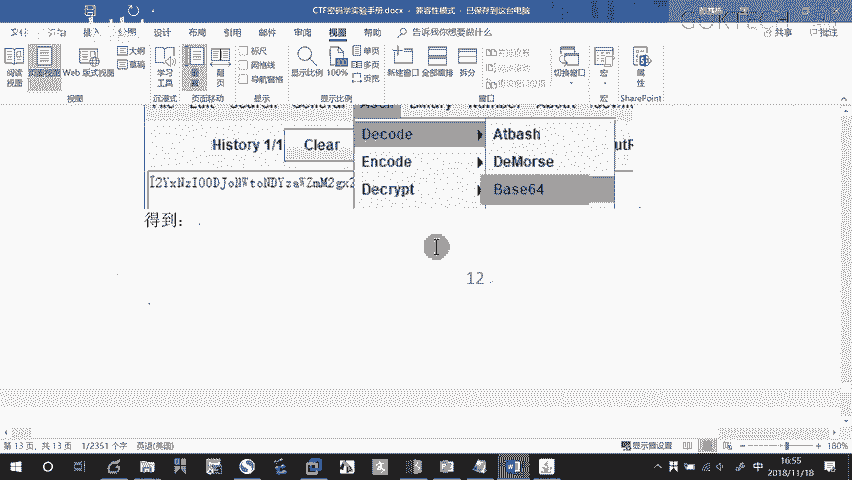

刚才我们用ask玛得到这个密文，它不是一个字符串，那我们就要换句话来说，就各种尝试啊，先用什么贝贝都实是解一下密，得到一个值啊这串值。啊，因为这串直的啊都是抛抛不开那个数字和什么抛不开那个字母啊。

数字我们反正不管吧。字母数字的话呢，如果说字母的话呢，我们可以做一个卡撒卡撒决定。因为数字的话，在卡上里面是不会不会变的嘛啊，所以说我把字母全部什么做一下卡莎位移之后啊。

我们会找到一个什么其中一项是什么呢？密码不超过F的。😡，为什么？😡，我们要找出不是MD5，我们要找出什么16进制数。我们的目的是要找出十6进制数，就这一串16进制数啊，因为什么这个工具呢可以密文。

你可以以什么十6进制的方式来显示。那么显然没有那么那么那么那么可怕就用二进制啊。这个。得到这个直径啊，这个脑洞比较大，你想想是想不出很难想出用这种方法。这个确实是啊没有什么提示啊，他什么提示都没有啊。

OK然后我们来转头看这个密码是密码的一个进阶啊。😊，困在栅栏里的海上，那既然是困在太栅栏里面，那首先我要进行一个栅栅栏嘛，想想看吧，他这什么发现一个什么。😡，系六。那就是意味着我要分成六栏。再来啊。

我要分成六栏，六栏怎么弄啊？首先我们的密码机器。😡，啊。ちら？在完是吧，情况一下。分成什么对了。啊。就这个东西。这个东西然后他对对他进行吗。进行位移一下位移啊，位移就是什么我们的卡商用码。啊。

我们的卡通密码啊，记住了，列出所有的组合，列出所有的组合，找一个客去找找到我们对应我们熟悉的那个字符叫。比如说flag，要么是flag，要么是什么呢？CTF。😡。

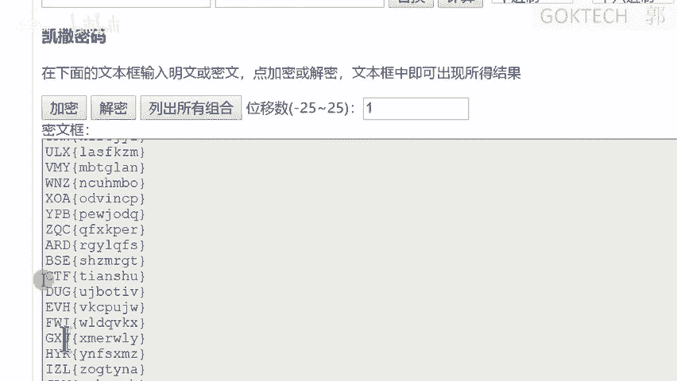

啊CTF。Okay。但是如果说针对栅栏密码，你不是很懂的话，没关系。你不是很懂是吧？你不知道他要分几栏的时候，你复制一下。把这个地方这个栏数调成最低最最低了，你一栏不可能吗？一栏就是原原原来的吧。好。

那我把它干把它列举揭密，它就会按两栏三栏四蓝、五蓝六篮，然后你一个个去尝试就可以了啊啊，记住了这边的一个。呃，都是不断的去尝试的啊不断的去尝试的不断的去尝试O。

第二个奇怪的密信，奇怪的密信里面放什么？😡，再来一个吧。啊，我这里呢后面呢放了一张图啊，这张图应该是有的啊。系呀。好。夹子图60夹子双气管。就知啦冇击杯啊什么啦。把它这几个对应的年份的数字给它写下来。

它背面啊新的背面还加还写有加夹子，一个夹子等于多少？6060。所以说你要把每个数字都加60。😊，交完这子干嘛？😡，广告说吗。因为即使他60加60会超过他那个。255吗？256首先来说是256啊。

原来它是0到225就是啊，如果超过了，那就量就。这一个什么阿克码编码。那我剩下我就不多说了啊，这题我就不多说了，自己先去先去弄一下啊，先去弄一下，弄完了好，阿斯克编编吧呃，编完了啊，那你还还要干嘛啊？

还要。

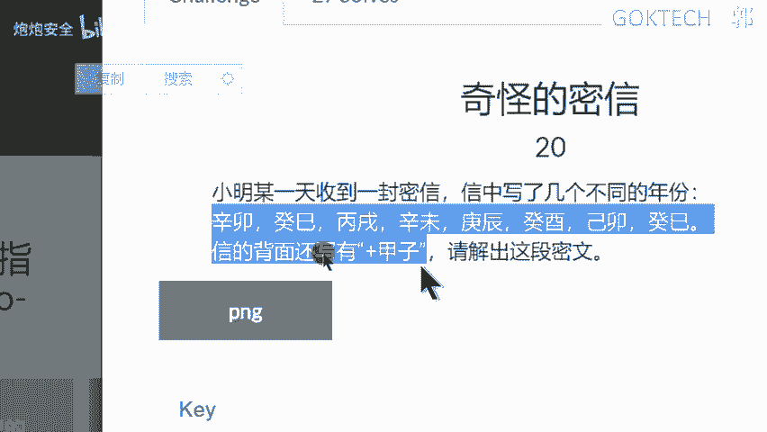

做进一步的操作啊，这里我不多说了。

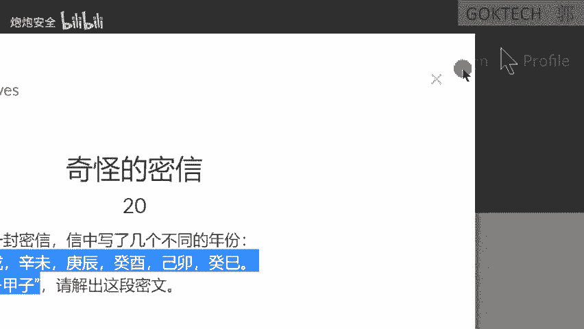

啊，他最后还要做一个。呃，凯啥。不一样来。广大。

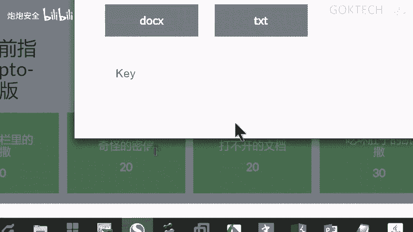

首先呢这个地方啊我们下载下来的时候是没有后就明的，我给它加上，这个可以打开拍，这个可以打开开。😡，啊，然后呢去解密一下，得到1个123456的一个密码，去打开这个dos的时候。

我们发现也是一个什么也是一个JS的一个呃编码。JS的一个密码，我又我要去去解的说解不开。为什么？我们会发现了么？我们现在要区分一个什么呢？😊，GSbo。没。他那边符号是什么，赶叹。😊，加号没错。

小鸭哎不错。😊，小酷啊，老子们。😊，中华。那今找我。就多了一个什么。😡，大括号好，来，我们来试一下啊。😊。

DOC的我没下载是吧，那我下载一个。我们这个怎么知道他密码，我就不多说了。😡，说这个没什么意思啊。123456。打开之让我们仔细看。有没有感？有没有改啊？我么要加啊？懂么样小花。😊，我中话。有中话吗？

直直接大括号了，那我们就应该想到他有可能是什么这个干嘛被替换了，那我们又要给他什么修改回来，替换的快捷键加cttrol加H。😡，当然你这样听话对吗？😡，你这样听话对吗？要么先左边的。对，替换成是吧。

这个。在右边的替换一个另外一边，然后替换完之后啊再去解密就可以了。啊，不多说了。吃坏肚子的凯扇。😡，手先看。首先他的一个就诊记录是什么？在干嘛你看得懂吗？😡，嗯。但是谁看得懂？

所以说我认为医生是不是一个秘药，所以都对他做一什么？😡，维吉尼亚嘛维吉尼亚解出来之后发现是什么？😡，他现示。这同知哎。复制完。维吉尼亚在哪里？清空。みは。打个彩是吧。姐。谁霍根是谁？😡。

培根嘛让培根做一下计算。😡，美的在哪里？你干才要去找话。培跟那跟那工具包用。用不了，为什么？赔根为什么用不了？12345。我看下我现在12345。12345。12345。

123451个、2个、3个、4个、5个一个、2个、3个、4个5个为为什么解不了？我现在每地用他他路之前是一个。就可以的啊，然后解完了之后干嘛？谁谁中谁赚的中得高了。😡，谁中的招中凯撒，谁中。

我肯定要最后抓他。😡，一问一下吧，发现是什么谁惹人话。😡，ちらが。培根好像这个了哈，给培根的联话了是吧，是我拼错了，不知道啊，好，孙言迪啊。😊，对不起，我也听不出来。密码是什么？告诉你们TMADH。好。

这里加密了来看着。😊，这机是吧嗯。无限循环就可以了。啊，柳爱花明又一春啊。OK这个我不多说了，但是我必须是。😡，必须说的是这个。😡，我再强调一遍，其实以前强调过模式被码的时候，你干嘛？😡，情况一下。

首先他的点是什么点？是心话吗？所以说我要你妈把他听信来。😊，解了。好像一样，这个什么基本电台是框还是斜上？😡，空头打后一起明白了，那这个我就不多说了。来停灯啦。

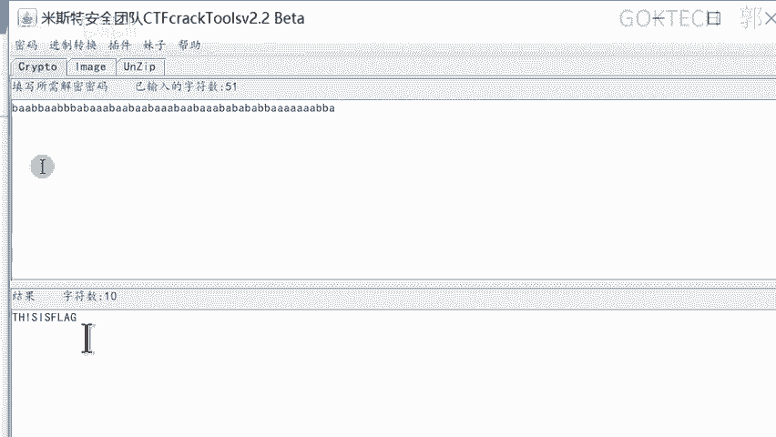

啊，This is flag。ok。他们的GS人不多了。😡，奇怪记录也不多说。😡。

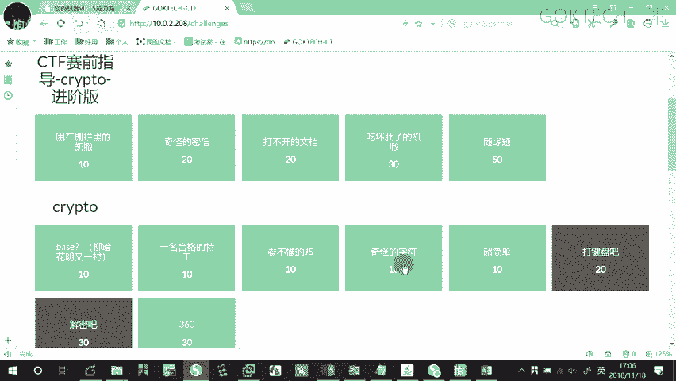

超简单的这一题，我告诉你这真的不行了。😡，啊。12345。1234512345是吧，应该有三个字符是吧？😊，我们来这里看一下。餐厅。行吧起来。有两个为什么？

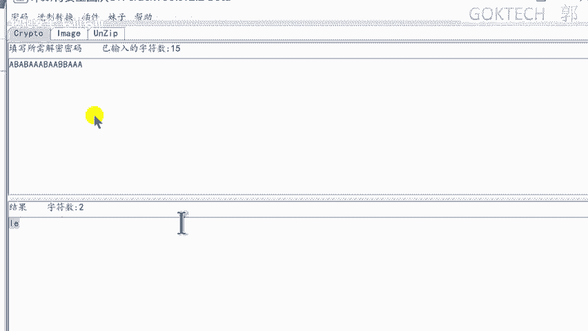

为什么？不知道大家还记不记得课件那一边。😡。

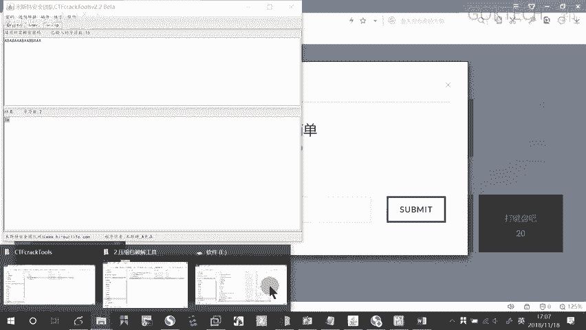

课见课见课见。培根培根培根的应该是密码学的，是吧？广告片小品不是。这个不关大小姐。不知道大家还记不记得他有两种表示方式。一种是这个一种是什么这种的。啊，你比如说什么呢BAP啊。

你看他们的这边的BAPP跟这边的BAPP就不一样了。😡，所以说你要去对照了，他那个我们的一个工具默认是按这张表来的那你怎么办呢？你只能用在线工具或者11个一个去对，或者说你使用其他的在线工具啊。

打键盘吧一样的啊，是这就那个那种键盘的解密吧，这个我就不多说了，逆推啊。

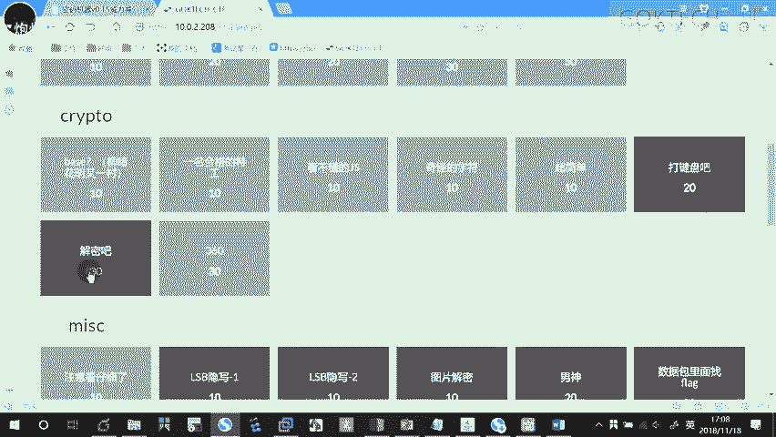

啊这个简密码不行啊，这样写的不行啊，这样写的他你要是没有提，没有那个提示完全不懂的。就是那个阿里的那道题嘛，flag冒号什么JL flagag，你要是没有那个提示，这个死我弄不出来的。啊。

360我也不多说了。来查下来有没有问题。用。铭文光击为什么不行？这个讲起来要10分钟。

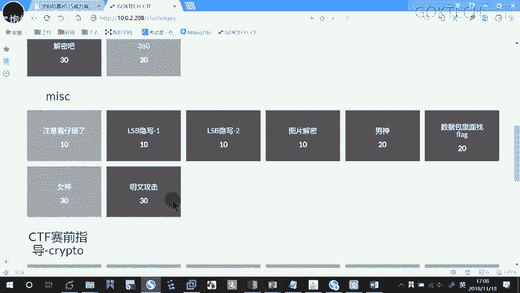

那么我们现谢大家。啊。

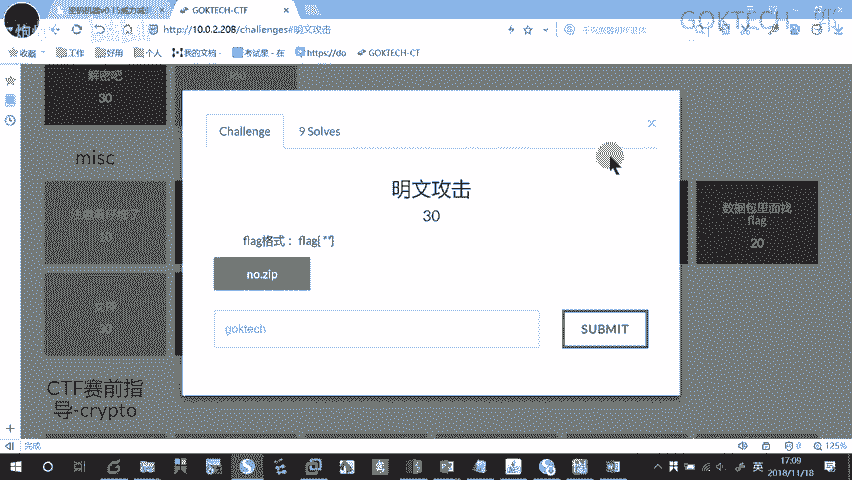

再讲起来20分钟啊，因为他做民工工击做完就20分钟嗯啊。可以给你看一下啊，是不是，就是那那个检的时候，要10分钟，5分钟，我的十0分钟啊，可能是我在虚拟机里面跑。😡，他这个是砸向的是吧？这里其实都有。

我这边都有。灵魂攻击。首先我给R解压发现一个slash加一个什么铭文的嘛，对吧？然后我用这个把它打开，用压缩软件3235好牙给它打开，发现它有一个教验值跟一个一个压缩算法那。😡，遇到这个问题。

其实我们就可以知道他可能是一个一个一个民文攻击。所以说我把这个什么tips这个压缩一下，发现他的一个校验值也是。跟其中一个一样，8B的。跟其中一个很像啊一样。啊，那我就认为它是一个铭文攻击。

那首先我要装这个这个英文版的这个解压工解压工，对那个前面的个工具啊，选择什么铭文攻击。手玩灵魂攻击。卡铭文攻击，并且呢你打开的时候，你用用这个打不开。😡，你用这个。点这里给它打开就可以了。铭文攻击啊。

一个是放的是什么？加密过的一个不要，这是铭文的呃加密过的一个压缩包，这下面这个是什么？铭文的一个压缩包。啊，拿开直接解就可以了啊。反正我的要十分钟了啊。

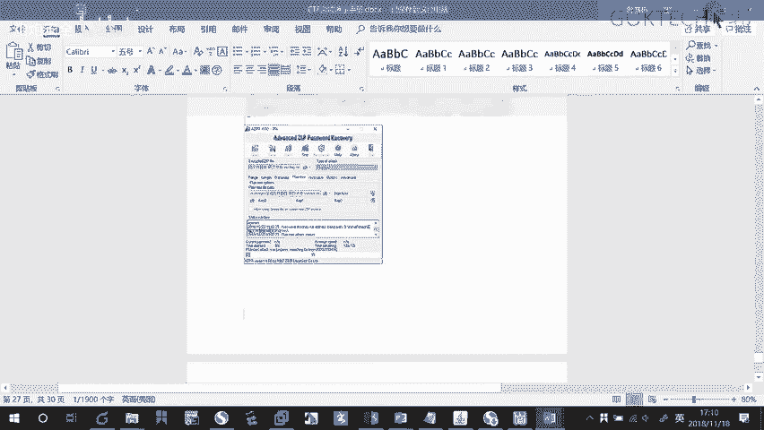

点完之后就密码都弹出来了。当前提是你安装的时候，那个密钥要输输了啊，没输不行，还有吗？就是你安装那个包，安装到最后以后，他要求你输入密钥。命钥在哪？😡，你要在在在在在在在在这个地方。

你这个安装包这边有一个注册吗？他是那个软件的纯纯软件问题啊，你要注册码要给他写上去，还有吗？这这个查销码要去，还有问题吗？😡。

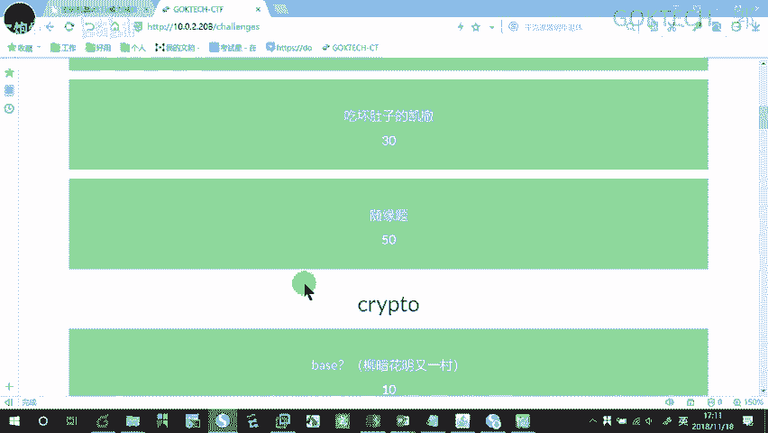

没有我就过了啊。

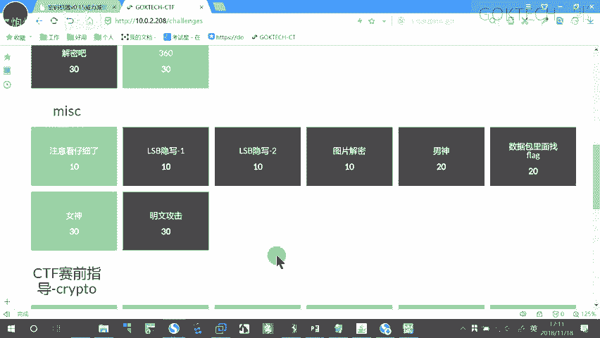

没有我就过呀。叫一个外爸。不我们看一下这题啊。😊，这个我也讲过了啊。呃。分享过来，那我这个就不多说了啊。

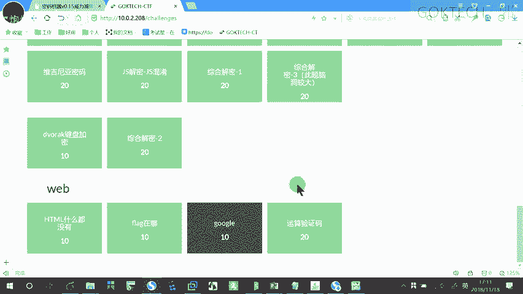

行吧。