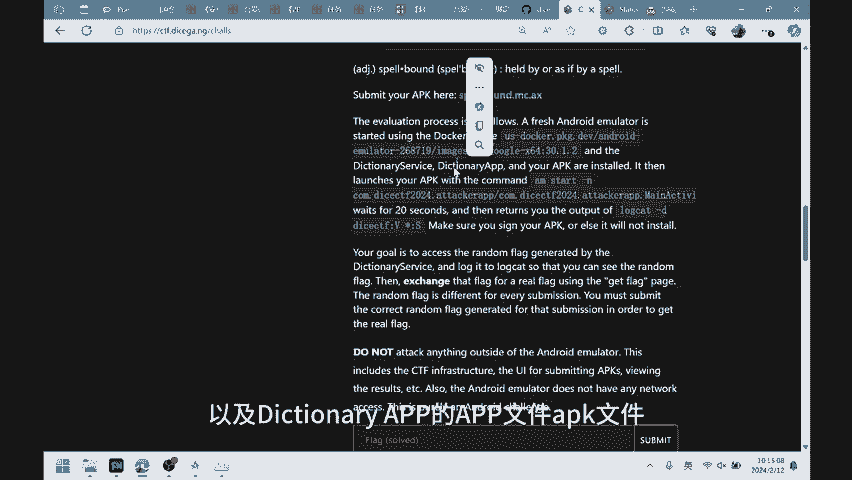
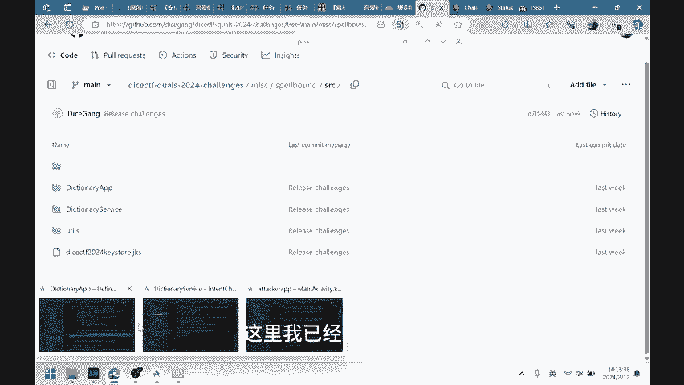
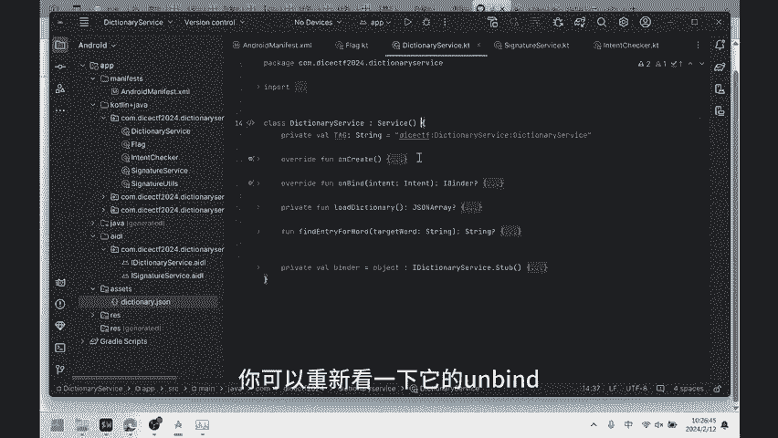
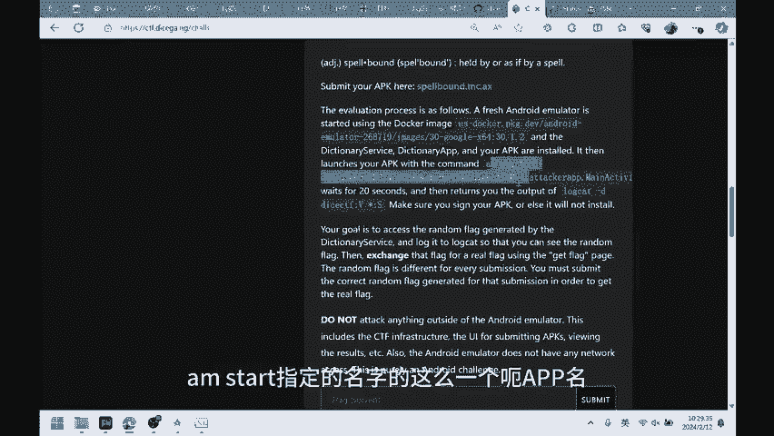
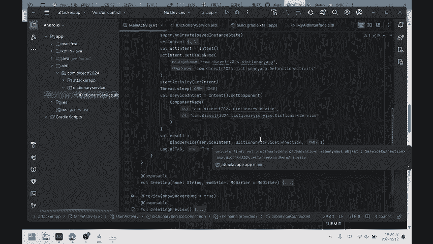
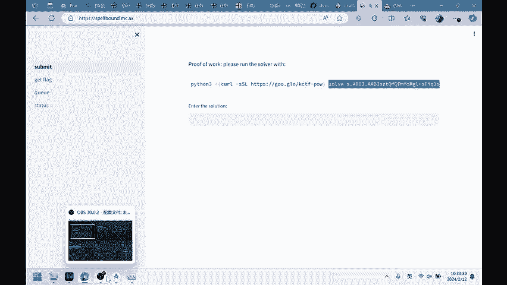
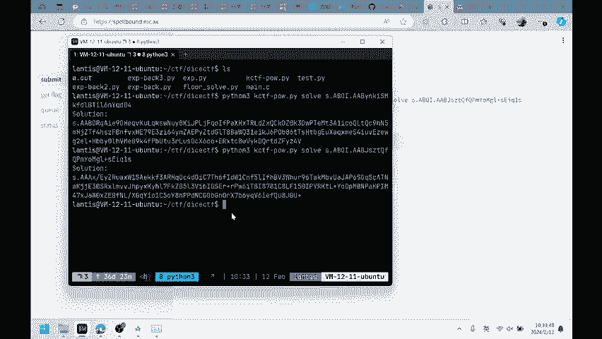
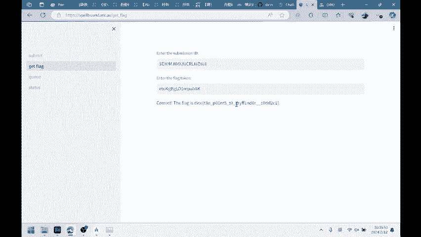

# CTF复盘 DiceCTF 2023 MISC Android spellbound - P1 - ainevsia - BV1Jv421k7bo

呃，好，今天我们想来复盘一下这个dicCTF的一道miss题。关于啊安卓的一个fin service的这么一个啊不算特别复杂的这么一个题目叫做pellbound啊。对，然后我们就开始看一下这个题目。嗯。

首先名字的话呃不太重要，然后他会给我们2个APP。呃，安卓的APK然后呢他会在服务端去做一个模拟。它用的是docker的这个image。然后呢。

他会把他给他所题目所提供的2个APPdictionary service点APK然后dictionary点APP点APK以及我们所提交的APK这3个APK都安装到这个docker容器，就是模拟环境中。

然后会运行我们啊提供的这个啊APP然后这个APP的报名是指定的。啊，然后跃行20秒之后呢，会把这个呃对应的这个单CTF这个tag，它所对应的所有的logcan给啊打印出来。啊，然后整个流程就是这样。

然后呢，我们就是需要在这个l中把我们想要的这个flag给啊。打印出来，这个是我们啊这个题目的简单的一个逻辑。啊，然后他会给我们一个压缩包。

压缩包就是里面就是会有他所提供的这个dictionary service一diction appAPP文件APK文件。

那么比赛的时候呢，是要去逆向的。然后当时我是比赛结束，比赛结束之后做的，所以说啊是直接呃可以看到源码的。那么我们就直接看一下吧，因为他啊具体的考点也并不是在逆向上。那么这个这个是仓库，这个是官方的仓库。

然后里面会有两个呃。APK的你来吗？这里我已经事先打开了。

那我们这个是用coly写的这么1个APK，然后呢逻辑也比较简单，我们可以直接呃在这分析一下。嗯。首先是这个dictionary app的这个APP啊，直接看它uncre，然后se content。啊。

这些都是java的哦，这些都是coly的这个composeer这整个UI界面的这么一个框架，大呃都是一样的，都是差不多的。只要看主体的逻辑就可以这个调用的manactivity content。

我在这里面有一个buttton点uncl。主要就是按下这个 button碳之后会做操作，是这个launch activity。这里面呢就是包装了一个intent。呃。

inten的目标是这个finition activity，然后呢去发送star activity。所以说其实man activity里面主要功能就是去启动这个definition activity。

可以看一下这个带飞地线对不起。嗯。可以直接看它的uncreate。create之后，它这又又有一个intent包装了一个intent，然后目标是这个ddictionary service。

就是另外1个APK的。这个现在的是dictionary app。然后他这个目标这个intent的目标是dictionary service点signature service。啊，对。

然后去bu这个service，然后给出的这个。呃，课外函数是在这里的，当 servicecon是在这。那么在呃bu这个sign service结束之后呢，他会去呃调用这个random world。

看一下random world，这里是load words。wordword里面会去open这个呃s里面的word点jason，然后去把里面的内容给读出来。可以看一下Ss。我 been接son。

里面可以看到，就是一个单词的列表。那么把这个列表读出来之后，再从中其中随机的选择一个，然后返回这个str。这是get random函数。我写了这个word之后呢。

他会就会去定义这个service connection，精神类service connection的模板函数啊，这个回调函数可以看这在这。这个是一个later in这么一个啊。点亮。

这是因为主要是因为他在这个on service connect中，他会用到了一个这个word这个。嗯。是在这儿定义里的每个word，所以说要在之后使名啊初始化它。嗯。

所以说这个APPdictionary dictionAPP的流程，大概就是去先后绑定了两个服务。这两个服务都是在另外一个serviceAPP中啊定义的。你可以再去看一下service aV的这么一个。

逻辑。首先就是他定义了哪两个服务呢？一个是dictionary service，一个是signature service。啊。

APP首先是去绑定这个signature service之后呢会去绑定dictionary service。啊，对。那们就来看一下。呃，看一下这个signature service。

那s service的 onbin里面没有内容，out create onbin里面主要是这个biner返回的biner就是返回了一个带有s函数啊带有s接口的那个啊biner对象。那么sign的话。

它主要就是可以点进去看这个signature u点sign啊，是在做。主要就是给我一个data，一个str，我对我会去用我自己的那个这个serviceAPP。他自己的。是要去对他做一个签名。

然后wifi也是同样的，这是一个比较基础的一个签名的功能。那么diction再来看另外一个service，就是dictionary service。那么我们看这个unb，然后c里面没有内容。

band里面的话，它首先会去做一个intent check点SQ这么一个检查。那么首先会检查呃你 bind我的这个intent它是不是满足一定的条件。那我们可以看一下这个ACQ。

我车里面呢就是有一些呃很多都检查的逻辑了，我们可以看一下。首先呢就是把这inten中的ex字段中的啊某一些这个它指定的字段，包括这个CIS把它给提取出来，这两个必须得有。

然后嗯去请去检查这个嗯对应的签名是不是一致。所以说这个签名就必须得是先前的这个sign service所有啊生成的签名才可才可以通过这边校验。之后呢。

会把这个identity中的一些就是这个签名的内容的字段去做一个比较。那么主要的内容就是两个。第一个是我限制我调用这个inend的发送者啊，他必须得是这个。呃，这个好吧。

就是那个我指定的那个APP就是之前的dictionary app点APK。然后这个是pack那time time就是说签名的时间必须得是在一个时间窗口之内的。好吧。嗯，对，首先是这两个不为空。

随后呢就是呃必须得是我我幸运的这个APP，特别是写死的是这个呃带CTF的到diction app。之后呢是这个时间，就是必须得是在一定的时间范围之内的，这里是呃1万秒1万毫秒。

最后呢就是去做一些呃呃额外的这是检查。这这个点还呢包括从这开始是啊去询问这个packaging manager所有获取的这个bu signatureign service。这个就是说这个权限的APP。

那么这个白那些service我们可以看一下。这个是在这边呃。😔，定义的就是说在service里面定义的，然后这个权限，然后在APP中呢是啊使用了。在这。

所以说就是说嗯呃获得了这个权限的APP在这儿要检查一下。检查的方式是通过。请问PM manager去呃查列出所有的inststore PMMin packages，然后呢去查找所有。

嗯啊就是获取这个权新的APP那么这个APP的个图必须是一。就只能有一个。然后呢，这个APP之后呢，会检查他的签名，要检查这个APP它的签名只能是我给他就是说带CTF的给给出的签名。

这边是一个也是一个写死的这么一个啊。Just a signature hash。应该写子还是。所以说这就是这个呃intect的校验，就是说SCQ的这个校验。这个校验是在这个呃。

unban的 unban操作中去检查这个办谁要ban的我，那么谁就必须通过他的intend，就是它的intend就必须通过这个校验。之后呢，我就会呃如果通过的话，会返复我版的，版的是定义在这的。

那这里有一个get data，有一个get data的这么一个功能。我们可以看一下跟data里面的啊具体做的内容啊，就在service中实际的内容是。

去把这个through word去做经过这个find entry for word的那个函数。然后呢，会先判断一下这个他给的我是不是一个呃特殊的值，就是说他给我是不是flack。我可以看一下。

如果是flag的话。啊，就会 reflect in kiss。就是说会获取一个真实的flag，这个是呃这个就是我们想要的内容，就是想要达到的效果。呃，如果不是的话，就会去load diction。

我也是可以看一下load dictionary。也从定ction点节层中，我看一下它的 assetss。所以说和刚刚对应的单词列表所对应的这么一个嗯就是解释吧，就是说一个字典的解释。

之后呢会从中选出我的这个对应的word这么一个解释，然后去返回。这后面做的就是这些内容。所以说我们要实现的目标就是这个。走走过这个逻辑，就是说我要们我们要是他给我的输入是flag。

之后的话我们就可以得到就是相应的fag。那么这个就是整个呃两个逻辑，它嗯最关键的一些啊2个APP它最关键的一些嗯逻辑了。啊，当然比赛的时候，这些是要行李向的对。但是啊。Yeah。那么看完这两个呃函数的。

那么看完这2个APK的逻辑之后呢，我们主要的目标就是怎么样去绕过这个嗯。inend check中的这么一个execure这么一个校验。就是说虽然每个人都可以去bu的这个sign service。

但是呢因为由于这边的SQ叫XSQ这个校验啊是要校验签名的，以及校验APP的个数。所以说再写1个APP去申请这个权限的话，嗯，是这边肯定是绕不过的。那么这道题的关键在于啊在一点就是。Yeah。

Dictionary service。你可以重新看一下。

它的unbin这么一个呃就是isQ is就检查的位置，它是在这个unbin这个函数中。那我们可以看一下谷歌的官方文档。

就是这个绑定服务，然后他这有一句话，他说。多个客户端都可以同时搬联到一个service中。但是呢系统会缓存这个Iband的服务这个呃通信呃通信通道。换句话说。

只有在第一个客户端绑定时才会调用on buy，已生成I班之后呢，会将这个I班的嗯传递到每一个绑定到我这个服务端上的呃APP中，无需再次样。所以说如果按照生命周期来理解的话，其这个unb其实只会调用一次。

就是说在第1个APP调用这个underband的时候，它才会去生成这个就是执行这里面的逻辑，生成一个abband。就是说在这儿返回的这个ibandband。This就说这个的一个 objectject。

呃，这个对象。那么在这之后呢，就是说即便会有后续的这些啊。呃，其他的APP来绑定我的这个。这个这个dictionaryserv。我这个onband也不会再执行了，我只会去执行啊。

我会直接把这个baner给返馈回去。所以说其实这个SQ只运行了一次。我只需要就是攻击者只需要让这个去唤起这个符合条件这个dictionary app去正常的去调用一次这个service。

就是说正常的让这个service嗯dictionary app去把它的功能先走一遍之后呢，攻击者就可以再次去主动去保案的这个service。比如说dictionary service。然后呢，去啊。

获取呃正常的执行一些恶意的功能。这个就是呃这道题的考察的地方。所以说主要考察的内容就是这个检查ACQ检查这个所在的函数on。它实际上并不是每次都会执行，只是在第一次方案的时候去执行一次。所以说啊这个。

AQ其实是你只需要正常操作，就是说攻击者你需要正常操作，就可以去绕过这个AQ脚验。

那我们可以来看一下这个呃攻击APP是怎么写的。就是说呃我在写的这个过程中啊，也是。那么这个APP的名字是固定的，就是说因为他之后会去使用这样的方法，AMstar指定的名字的这么一个呃APP名。

所以说在这。

之后呢，由于我们要去调用这个dinctionary service，所以说我们要在AID里面去把这个定ction service。就是说他的interface给呃拷贝过来。

最后我们可以来看一下整体的逻辑。啊，这些都是模板生成的，所以说主要是在这里面。表示我定义了这三个呃变量，这个是tag，就是说啊它只会显示呃打印出这个加CTF。所以说这个tag必须得正确。

之后呢去定义一个呃回调函数。这个是un connectedect，然后这边呢是一个ladate，你看一下unc里面的这体的逻辑。嗯，首先呢我会去生成一个intent。

这intent的话是调用这个APPdictionAPP去再用它的deation activity。如果正常的调用，就是让它正常的去绑绑定两个服务，啊，正常的签名，正常的获取一个单词。啊，对。

这是一个正常的操作呃，start activity。最后呢就是等待一段时间之后，我会去调用一个就我我会我工作为攻击者。

我就会自己去调用这个啊dictionary service里面的dictionary service了。所我会去正常去调用这个呃字典服务，然后去查询这个flag的值。那我们可以看一下。

就是说bd service之后，如果正常运行的话，它会它的回调是什么样的。就是在这个on service connectedect中。

就是我们会去把这个班的嗯转化成我们通过通过这个ID文件转化成可以调用这么一个形式，然后去让get data。如果成功的话，就把这个reult给放下来。那么。

那么这就是整个APP的atAPP的这么一个啊逻辑了。对，其实还是一个正常的这么一个调用的操操作。对。啊，这是一个比较正常的buer远程服务，然后去调用它的服务的这么一个操所。啊，对，然后。

现在的话服务器还没关，我们可以去。提交一下。

呃，先算出他的这个。嗯，POW。

然后这边我把这个编译好的这个APP。拨上去了。然后他会给我们一个token。然后我们去。嗯嗯。现在这s里面。就查看我们的。就是日志。然后呃。这样就会把它认识给打印出来了。那么这我们是嗯你可以看一下。

就是在APP里面，我们是在这变 datatasuccess without。把这个flag的内容给打打出来。不是这个这个复制一下，我们还得去在这get flag里面去。就获得实劲的上来。

那我们要在这把他需要的。两个头肯给不指定样。呃，所以说这个就是最后的flag了。那么好，今天的就是这道题的话，复盘的话就到这了。嗯，从操作上来说，就是从最后APP的攻击APP的边界来说啊，不是特别复杂。

主要是这个啊这考察点就在于这个band service以及unb以及啊它的调用的周期，就是说它什么时候会调用，以及这个band的缓存。

啊，就是说一个向我们展示的一种错误的这类一个啊校验的方法，就是说在onband里面去校验这个对象的intent。啊，这是不够的。

呃，所以说这道题目的话就偷盘到这啊，谢谢大家。😊。