# CTF夺旗全套视频教程-网络安全 - P10：10.CTF夺旗-sql注入(post) - YiWorld-奕 - BV1FN411U7Cv

大家好，我们今天来学习CTF训练当中的万般全circle注入。通过对post参数的注入，最终root主机获得主机的最高权限。下面我们来介绍一下circle注入。

circle注入攻击是指用用户构造特殊的输入作为参数，传入web应用程序，通过执行对应的srcle语句，进而执行攻击者所要的操作。其主要原因是因为程序没有细致的过滤或者过滤不严格用户输入的数据。

致使非法数据侵入系统。其实呢任何一个用户可以输入的位置都有可能成为注入点。比如，在URL当中传递的参数以及HTPT报文中post传递的参数。下面我们来介绍一下今天的实验环境。首先。

公积机使用卡利linux，它的IP地址是192。168。1。11靶场机器。使用的是wo班图系统，它的IB地址是192。168。1。104。那么咱们拿到这样一个实验环境之后，该如何进行操作呢？

咱们抱着这样的目的，挖掘对应的漏洞，获得主机最高权限root权限，最终取得对应的flag值。咱们拿到靶场IP地址，首先要进行第一步信息探测。首先咱们探测主机开放的全部端口。

使用N map这个扫描工具之后，加上它的参数杠大T4，表示使用N map全部现程最快的速度来进行扫描，并且杠P杠表示扫描全部开放端口，最后加上靶场IP地址。下面我们在卡利当中实践。首先我们打开一个终端。

右键桌面open他们的。之后我们把它放大，使用M map。杠S杠P杠。T杠杠T4使用最快速度之后，加上靶场的IP地址192。168。1。104回车。那么咱们这时候n map使用最快的速度，扫描192。

168。1。104的所有开放的端口号。因为是扫描所有的端口号，所以说它的速度是比较缓慢的，我们只需要耐心的等待。当然我们也可以。探测哎是否和该靶场连通可以使用。P然后执行192。168。1。104。

可以发现这时候返回对应的数据包，哎，我们是跟该靶场连通的。如果我们不能收到对应的返回包，那么表示我们与该靶场是不连通的。大家需要修改对应的环境配置。使我们对应的网络连通按controrl C结束。

我们看到这时候已经扫描完毕。当然我们这里只是扫描了该靶场机器上开放的端口以及对应的服务。我们除了可以扫描该靶场机器的开放端口，也可以使用。N map来扫描该靶场机器的全部信息。

这里使用N map将杠大T4使用最快速度杠大A表示加载N map所有扫描模块之后，加上杠小微表示对。返回的信息进行详细输出之后，加上靶场IP地址，我们来操作。N map杠大T4杠大A。杠小卫。

之后加上我们靶场IP地址点104回撤。我们这时候开始加载M map的所有模块，使用最快速度以及最详细输出，对我们该靶场进行对应的探测，扫描，来挖掘上面存在的一些信息。当然，该扫描过程依旧可能比较缓慢。

我们只需要耐心等待。我们在这里可以看到扫描结束。并且返回了很多该靶场上面的详细信息。当然我们在这里如果说我们看到开放了HTTP服务。以及我们上面443HTTPS以及80端口的HTTP服务。

这时候我们就可以使用HTTP服务对应的探测工具，对HTTP开放的服务上面存在的敏感信息进行对应的探测。这里。😡，我们使用到m two和DIIB来进行敏感信息探测。

m two可以探测该靶场机器上的敏感文件，以及它存在的一些敏感目录。我们也可以使用DRIB来暴力破解该靶场。上的目录和文件。当然在这里，如果说我们HTTP服务使用的端口号是默认80端口。

那么这里的端口是可以省略。如果不是默认的80端口，那么该端口是无法进行省略的。下面我们使用link two来探索该靶场上的敏感文件。

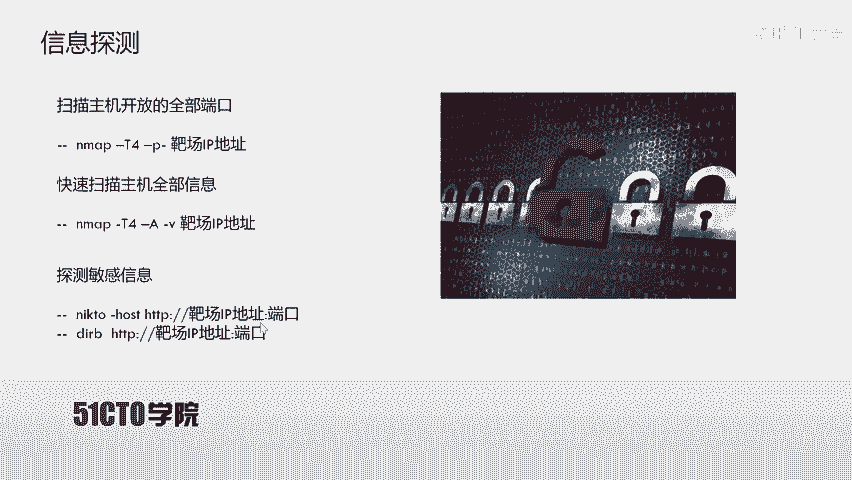

使用nick two。Ghot HTTP。192。168。1。104。我们可以看到80端口有默认的HTTP符。那我们探测。可以发现neig two开始探测，我们在尼 two探测该靶场。

80端口的HTT付辅的同时，我们也可以打开一个新的终端。使用DRIB来探测80端口上的一些敏感文件。我们打开一个虚的终端。之后使用DRIB。HTTP。192。168。1点。104。回车来探测。

该80端口的目录文件。我们这时候两个工具都不断的来进行发包，来探测对应的信息。这个过程哎肯定是需要一些时间，我们只需要耐心等待。可以看到哎，这里我们DIB探测出一个文件。那我们可以右键。

open link在浏览器当中查看一下该文件的内容，点击查看。我们的浏览器就会打开该页面。如果说哎对于CTF比赛当中，哎，我们可以右键来查看一下它的源代码是否具有可利用的信息。

可以发现这里只是有个图片的。链接哎并没有任何对应的信息可值得利用。我们关闭。我们再回到扫描目录当中。会发现这时候少见javascript的这样一个目录，我们右键。open link打开查看。

发现forbidden哎并不能。打开该目录，浏览该目录的文件列表，所以说把没有任何用处关闭。我们继续看。这里又扫描到了PHPmy amin这样一个。目录我们现在打开该目录open link。

发现他是一个。my circle的管理这样一个系统。我们如果有对应的用户名和密码，那我们就可以登录后台之后操作数据库。这里我们暂时留下。当然，他在不断扫描过程当中。我们在扫描80端口的时候，哎。

我们也可以看一看。这个我们到底还有哪几个端口开放HTP副服务？可以看到8080端口也是开放HTTP服务的那我们接下来再在该终端下使用n to对8080端口进行探测。nick two。

G host HTTP。192。168。1。104之后，冒号加上咱们的端口号8080。回车，那咱们开始探测80端口。我们打开另一个中端。可发现啊我们依然在探测着。呃，这个80端口的目录信息。

我们同样可以打开另外一个终端来探测一下8080端口的目录信息。DIB。之后。后HDTP。咱们把厂的IP地址192。168。1。104之后，加上咱们端口号。咱们这里哎先让它进行来对应探测。

我们回到课程当中。我们这里进行了大量信息收集之后，我们需要哎对信息进行下一步操作，那就是分析信息。分析信息之后，我们对于80端口哎就可以使用对应的扫描器进行对应的探测。这里我们使用到漏洞扫描器 VIP。

一款比较功能强大的这样一个专注于万部安全的漏洞扫描器来进行对应的漏洞探测。我们回到卡利当中使用awp。对我们80端口和8080端口进行对应探测。可以在这里。打开OAP。我们在打开OAP的同时。

OSAP会加载很多的信息。很多的这样一个模块信息。加载成功之后啊，那我们这个扫描器就有了这些模块的扫描功能。哎，点击start之后哎输入咱们靶厂的IP地址192。168。1。104之后。

我们先对80端口进行探测，点击attack。那么这时候哎，我们当前的。AP开始对咱们该靶场的80端口开放的HTTP服务进行漏洞扫描。可发现在这里并没有扫描到。

高危漏洞下面我们再对8080端口进行对应探测。点击atack。啊，这里我多输了一个点。Attack。这时候开始探测8080端口。首先，使用蜘蛛爬虫对该站点下载站点。文件进行爬取。

排取之后使用主动扫描来扫描这些爬取到的文件是否具有对应的漏洞。我们先把它最小化。查看一下刚才所扫描到的一些结果，对其进行分析。首先哎这是咱们看一下80端口的信息。使用n two。

我们可以看到这里扫描到哎这个服务器没有启动哎一些保护头，比如说防止点击截止，以及防止叉SS的这样一些头。并且它所允许的啊一些HTTP方法，以及它的这样一个插 power的 by，也就是使用。

语言版本以及linux内核系统。之后哎，这里又有一个阿帕奇的默认文件。在这里我们也看到有一个login点PHP，我们打开这个login点PHP来查看一下login点PHP。192点。104哎之后是。

login点PPP。回撤我会发现是一个登录界面。我们继续向下看，刚才也打开了PHPmy amin这样一个目录。之后我们对。8080端口探测。会发现啊这里也是有一些统一设置。

并且发现了啊一些敏感文件image以及它的叉port by。这里我们来访问一下8080端口的image。首先，192。168。1。104之后是。8080端口之后是IMG回撤。

会发现在这里我们查看了啊对应的图片。但是我们查看对应图片的名字，没有发现一些特别敏感的这样一个名字。所以说我们继续。来查看。对应的扫描结果，挖掘对应的信息。我们继续向下看，会发现。

8080端当中有这样一个目录，也就是word price可以暂时推测。该端口运行的HTTP服务上的站点是使用wordpress这个CMS搭建的。我们copy一下。我们来使用。浏览器打开一下该站点。

首先输入。8080端口之后是word。Pres。回去了。我们打开之后发现啊是这样一个。站点。😡，是一个。购物网站。Shop， old candy shop。啊，并且应该是一个个人的啊这样一个网站。

那我们现在已经对信息哎挖掘到一些。并且知道了80端口和8080端口上面运行的一些服务，以及它的一些敏感文件。之后我们打开对应的哎这些扫描结果。我们在刚才会看到。80端口上没有一些高危漏洞。

但是我们发现了。一个login。点PHP这样一个。文件哎，并且它是一个登录界面。对于这样一个登录界面，我们可以尝试一下是否存在对应的弱口令。3密update我们发现并没有对应的。这个绕口令。

我们并且查看一下它的源代码。会发现。这里。只是提交给本页面。并且进行对应的处理。我们会想到该页面是否具有对应的circle注入，可以使我们注入到速系统库当中获取对应的数据。

下面我们来使用circle map对其进行测试。在circle map当中。我们可以。使用。对应的哎这些。参数对其进行注入检测。这里我们使用到杠小R。

然后加上request点状这样一个抓取到的HTTP爆头之后，加上杠li之后加上杠瑞3表示使用最大限度最高水平的srcle map进行检测以及最高风险的发送数据包之后检测对应的数据库名之后。

我们指定DBMS是mycicle以及杠杠bach表示我们不再询问。一些内容，如果询问，我们自动补齐。首先我们要抓起对应的数据包。这里我们使用N map来抓取。

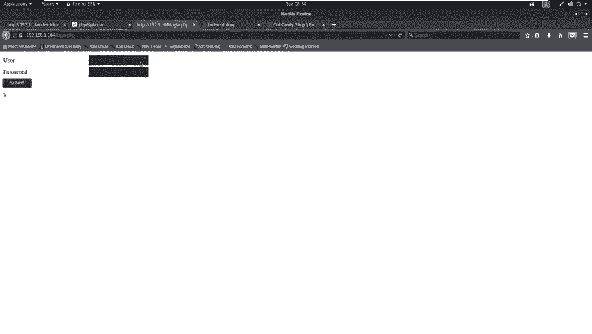

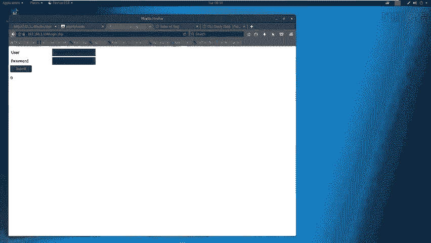

首先打开N map。哎，不对，是boptrippedb shoot。打开。close哎，点击cancel。点击nexest。Starttup BYP。我们再打开。该软件之后。

首先要在浏览器当中设置对应的代理。At once。3庭。使用80。81这样一个端口来进行截断。之后我们在BURP哎当中打开结段代理。option还可以看到。这里我们edit it。把它改为8081哎。

点击不K。把它点击r哎之后我们回到哎这个阶段当中。我们输入对应的用户名，addmin输入对应的弱口令123456。之后还点击登录。

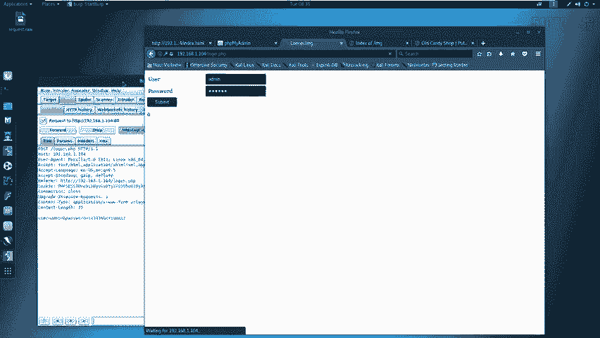

会发现当前哎我们这个。bo suit当中返回了对应的数据包，我们把它copy出来。

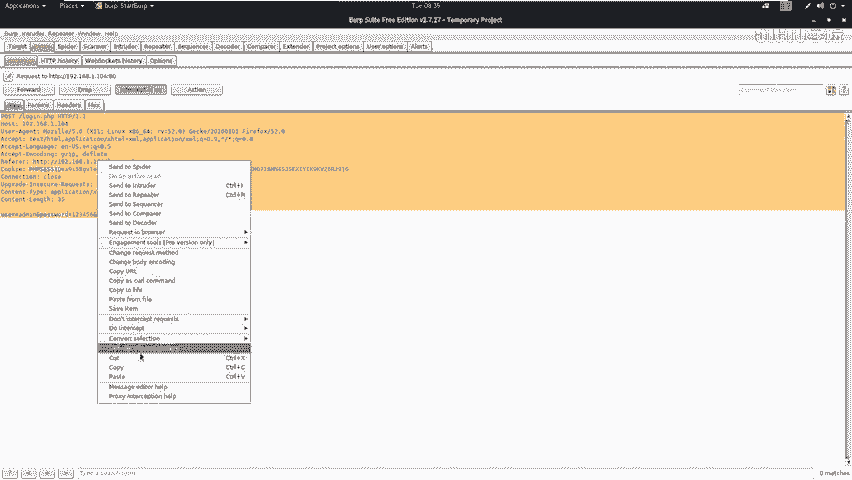

copy出来之后啊，我们在桌面打开一个request点ron。呃，我们这里使用GDIT来打开对应的。

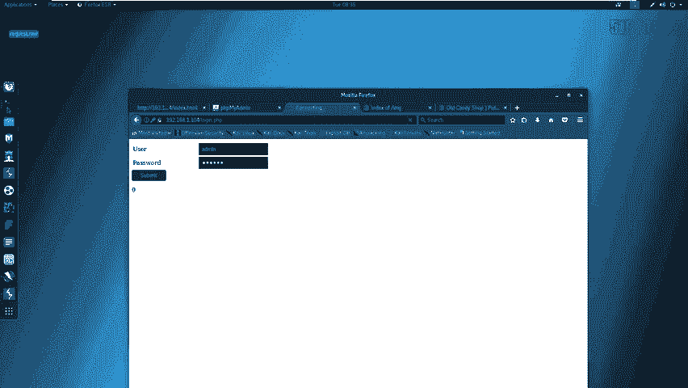

这个对应的这个文件CD啊，首先切换到桌面。之后使用GEDIT。Request。我们可以看到，哎这里有些内容。哎，这是我之前使用的这样一个数据包，我们继续来使用该数据包进行注入。

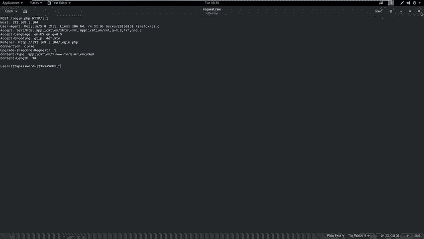

首先啊我们使用circle map。我们打开另一个中端。我先把它暂停了。呃，关闭。这里我们也暂停了。首先我们使用circle map对其进行探测。这里我们circle map加杠R。

因为该request点ron在桌面文件下。所以说我们直接。runquest点run之后使用。这个最大限度也就是最高水平的扫描，并且使用最大速度进行探测之后探测对应的数据库。

然后哎指定对应的DBMSS是这个my circlecle之后。指定自动补全。回撤。我们这时候开始探测。这里探测出了对应的数据库。我们在这里。会想到刚才我们发现了一个wordpress呃这样一个。

使用8080端口。搭建的这样一个网站。那下面我们就来探测一下wordpress哎这个。数据库当中的内容来挖掘一下是否该数据库当中保存的是wordpress。对应的信息。那如果我们探测过程当中。可以发现。

的确是我们8080端口的wordpress这样一个数据库，那我们就可以探测出里边的用户名和密码之后，就可以使用该用户名和密码，登录wordpress后台进行对应的操作。

这时候哎我们首先来探测一下该数据库当中的表。可以看到我们在探测发现该数据库当中只有一个ususer表。我们继续来探测。探测表之后，我们来探测一下对应的字段回撤。

可以看到我们当前数据表当中只有user name和password这两个字段。接下来我们来探测一下该字段的值。回撤。那我们这时候哎就得到了。该。数据表当中的user name字段对应的值是它的me。

它的密码password是superscript password。我们这时候把该。数据。复制出来之后，咱们来登录一下。Wpress系统。首先我们关闭哎当前前段。

之后呃，我们回到这个8080端口。在worddpress当中。他的登录。一般情况下是默认的WP横杠roing点PHP回撤。这时候我们来到了。

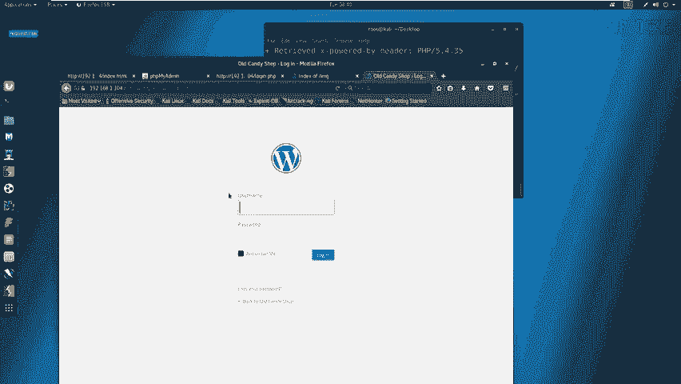

该wordpress登录界面，我们输入对应的密码和用户名control V。Rememberber log。这时候我们成功的登录了该系统的后台。

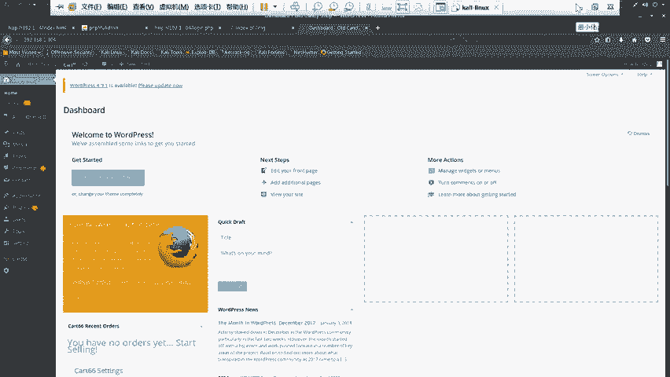

我们在利用scle注入漏洞之后，会拿到对应的用户名和密码，利用该用户名和密码登录系统后台。我们在登录系统后台之后，我们就可以利用该系统后台来上传对应的web shell。

最终获得反弹 shell取得服务器的控制权。首先呢在word price当中，我们可以在主题当中找到404点PHP，利用404唉可以上传对应的web shell。

那么咱们web shop在卡利当中如何获取？我们可以在userwhat shares点PHP这样一个目录中获取。下面我们来查看。

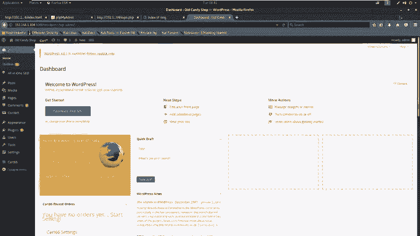

首先我们打开一终端。这里启动了一个，我们点击no。你打开终端之后SCD。Uual sell web share。Alice。之后切换到PP。LS我们可以看到有。这几个啊这个web shell。

我们今天使用PHP反弹 shell。首先我们把它copyPHP。revo拷贝到桌面。之后切换到桌面。桌面现在哎具有了对应的web效。那我们下面首先要对web shell进行对应的修改。

使我们该反弹的wep shell可以反弹到咱们该公积机当中。我们使用GDIT。来进行修改PHP。re下点PHP。那我们这里只需要修改。对应反弹的IP地址和对应的端口号。

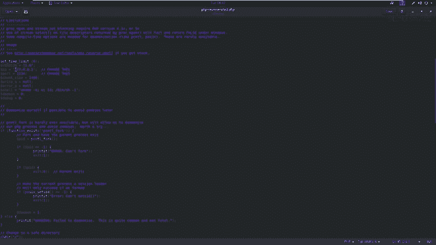

我们当前卡利的IP地址可以使用。IFconfi来查看192。168。1。11，我们改IP复制出来。之后我们粘贴到这里。controlV我们反它的端口号给它指定为444这样一个端口control S。

并且把它全选controrl C啊，把它接。复制出来之后，我们打到wordpress，对其进行对应上传。我们可以看到appearanceshame I data。

这里I data shame我们可以看到twenty thirteen哎这样一个主题，我们之后打到404。这样一个tlate之后，我们control a，把它按bank space退格。

把它全部删除之后，把咱们web shell粘贴进来。粘贴进来之后，我们点击upload fan上传该we shell。这时候我们就把404当中的代码替换成我们反弹 shell这样一个代码。

我们在上传完web shell之后，是需要启动定金监听。这里我们使用NC。加上杠NLVP。P。表示监听的端口号一定要放在最后，加上对应的端口号。我们刚才设置的。web shell当中的端口号是404。

那么我们启动监听的端口号也一定要是404。

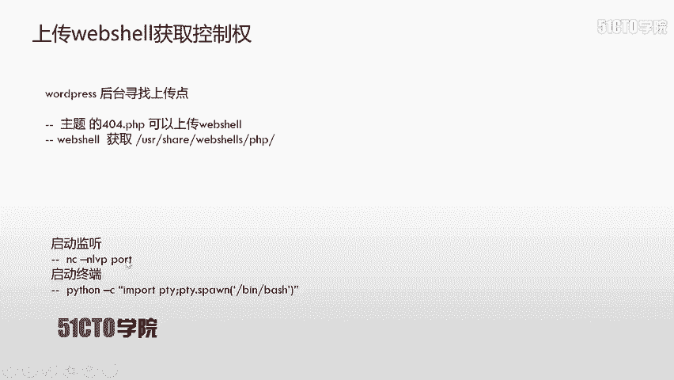

接下来我们回到终端。使用NC杠。NLVP4444。我们启动这样一个监听。我们ctrlC一下。NLAP4444。呃，这里呃因为我们之前啊上传了对应的web shell。

这时候已经给我们返回了啊对应的这样一个结果。当然啊我们在上传web shell之后，一定要访问其web shell才能反弹回这样一个web shell。

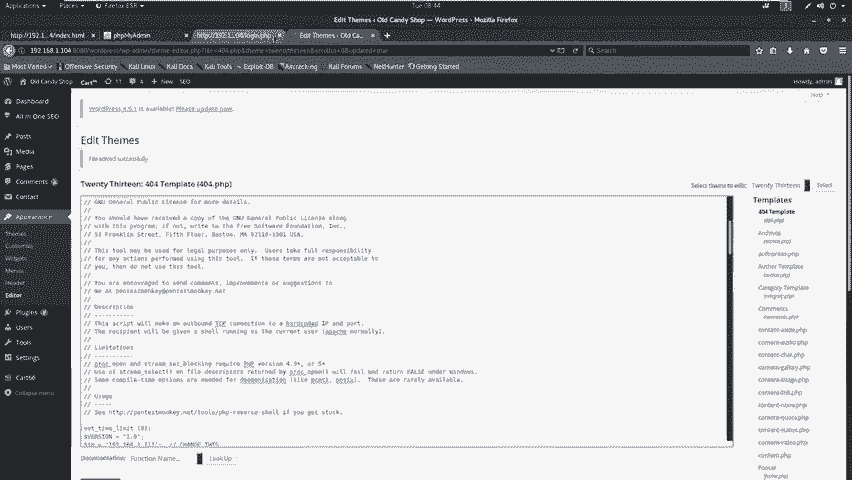

这时候我们执行wep shell可以使用HTP靶场地址，加上我们今天的8080端口之后，加上对应的目录。然后哎加上对应的主题哎，主题名之后加上404THP。

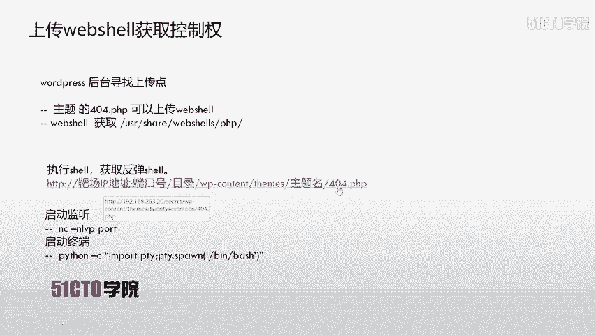

192。168。1。104之后。8080。

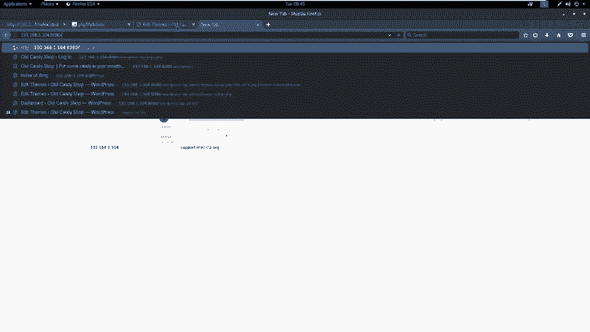

之后加上咱们对应的。目录。当前目录哎是wapress。玩着。Pss。之后是W contentent。sme啊，我们对应的seems。之后哎这里咱们使用的主题是。全体一。13。我们复制出来。粘贴到这里。

之后我们把404留下。之后我们把所有的大写改为小写，并且把退格去掉。回车。啊，因为我们当前已经执行了反弹的web shell，并且刚才我们已经返回了对应的wep shell。我们可以看这里。

因为我们之前来进行对应操作，哎，并且该we shop。写的时候内容是不断的返回对应的。这个反弹是要。所以说我们继续上传之后执行会出现报错的。因为我们已经开启了对应的连接，所以说该端口是不能进行连接了。

所以说大家在实验的时候，如果说反弹了一次cel，那么它是不能继续反弹的。也就是说哎，你当前。反弹了该webshop，并且启动了监听。你已经和靶机进行了对应连接，你再进行。执行该we shell的话。

那么该 shell是执行错误的，因为它不能继续。连接咱们攻击机。咱们在打开笑之后。会发现反弹的只是一个命令行，一个标准输入，并不能执行终端的命令。那我们使用pathon杠C使用对应的模块PTY。

当中的SPAWN返回咱们对应的sell。启动对应的终端。首先我们使用嗯pay。杠C双引号import。PTYPTY点pain。之后哎并。B。回撤我们这时候反弹会啊这样一个终端。在反弹回终端之后，哎。

我们要执行下一步操作，也就是root权限来获得咱们该系统的最高权限。在这里哎，咱们首先使用cat ETC saddle以及cat ETC password来查看一下该敏感文件。cat杠ETC。

Sddle。回车我们会发现哎这里有很多的信息，我们再来查看一下ETC。passWD会发现啊又有很多对应的信息。在这里我们会发现啊他给了我们对应的提示。你已经得到了哎我的这个密码文件。呃。

这里的这个信息就是没有。人啊已经进到这里。以及没有人可以出去这里。接下来我们使用SU之后，加上杠来提升一下root权限回撤。在我们提升root权限的时候，我们发现是需要输入对应的密码。

我们首先来尝试一下空密码。发现空密码是不能直接提升root权限的。那我们这时候会想到，在之前我们登录该系统的时候，我们是有。对应的一个密码。那我们会想到该密码是否跟我们该用户的密码相同呢？我们来尝试。

我们来打找到对应的密码。在这里supersscript password复制。之后我们粘贴。回车，这时候我们会发现。当下已经。得到了肉的权限。我们使用ID来查看电义权限，可以看到该用户的UID等于0。

代表root权限。GID等于0，表示该用户属于root用户组。这时候我们可以切换到root目录像。来查看右图目录下的一个文件。L杠ALH。CD点点LS。City home。Al莱斯。CD点点L。

CD wrote。当然是。L4杠1L。可以查看啊，我们当下root。目录中的一些信息。那我们这时候啊已经获得了该主机的最高权限。已经完全的拿下了该主机的所有信息。下面我们进行总结。在这节课当中。

我们要明白，只要是用户可以输入的位置，都是有可能存在注意点的。比如说我们今天输入用户名和密码的位置。有可能就存在对应的注入点。当然我们还有一点需要注意。如果说漏洞扫描器扫描的结果。

表示我们该站点是没有任何漏洞的。我们也需要手工测试一些对应的敏感页面。因为漏洞扫描器扫描结果也不一定准确，希望大家以后注意。这样一个问题。那么咱们这节课就到这里，再见。

