# CTF夺旗全套视频教程-网络安全 - P14：14.WEB安全暴力破解 - YiWorld-奕 - BV1FN411U7Cv

大家今天我们来学习一下晚盘安全当中的暴力破解。我们通过对web应用程序的用户名和密码进行对应的暴力拆解，最终获得具体的值。通过该用户和密码登录主机，最终获得主机的sll。在sell。中提升对主机的权限。

获得root权限，最终取得对应的flag值。下面我们来介绍一下暴力破解。首先，暴力破解，我们可以用群聚法的基本思想来概括。群体法的基本思想是根据题目的部分条件确定答案的大致范围。

并在此范围内对所有可能的情况逐一验证，直到全部情况验证完毕。若某个情况验证符合题目的全部条件，则为本问题的一个解。若全部情况验证后都不符合题目的全部条件，则本题无解。群举法也称枚举法。

它是咱们暴力破解的一个基本思想。我们在进行web中的暴力破解时，我们利用尝试哎所有可能性最终获得正确的结果。如果说我们并不能获取最终的结果，那么我们可以采取更大范围的破解。最终取得我们想要的具体值。

下面我们介绍一下今天的实验环境。今天实验环境公积机采取卡利linux。它的IP地址是192。168。253。12靶场机器来使用乌班图linux。它的IP地址是192。168。253。20。

咱们拿到这样一1个靶场实验环境，该如何进行操作呢？首先我们要报有一个目的性，就是获取靶场机器上的flag值。在获取该flash同时，取得靶场机器的root权限。下面我们进行一下靶场的信息探测。

我们刚才只是拿到了靶场机器的IP地址，并不知道靶场上哎究竟开放了哪些服务以及服务的版本。那我们就使用M map杠小写S大V之后，加上靶场IP地址对靶场所开放的服务以及服务的版本进行对应探测。

下面我们回到卡例当中。

首先，使用N map杠小S大V192。168点。253。20靶场IP地址，我们回撤，这时候N map开始对该IP地址的靶场进行服务探测。

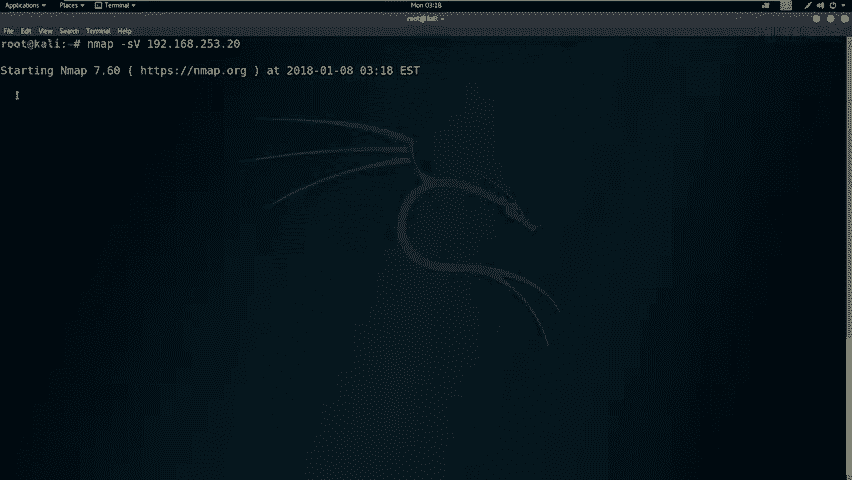

探测结果会返回到咱们Nva的标准输出当中。这里我们扫描到哎对应的。服务以及服务的版本信息。我们除此之外，还可以使用N map来探测一下靶场的全部信息，其中就包括了咱们刚才的服务信息以及服务版本信息。

也包含着路由信息以及该靶场的操作系统信息。这里我们使用N map加杠大T4将杠大A加上杠小V之后加上靶场IP地址，对其进行全部信息探测。这里的杠大T4代表使用N map最大线程数进行对靶场的扫描。

也就是以最快的速度对靶场进行探测，这里的大A代表使用M map的全部模块，对靶场IP地址进行对应探测。而这里杠小微表示，我们在探测的过程中，会把探测的数据包以及响应的数据包全部返回到对应的标准输出当中。

下面我们就使用M map对主机的全部信息进行对应探测。首先我们回到卡利linux。使用N map杠T4。杠大A杠小A之后是我们靶场IP地址168。253。20之后，我们回车。

那么这时候n map会以最快速度，并且加载全部扫描模框，对我们靶场IP地址进行信息探测。我们可以看到这里很快返回了对应的信息。我们在探测靶场信息的时候。

我们也会发现靶场可能开放了80端口或者是其他端口的HTTP服务。我们接下来回到fin当中来查看一下是否开放了80端口。在这里我们可以看到开放了80端口。并且80端口上运行的服务是HTTP服务。

那我们哎就很有必要去探索一下HTTP服务下，究竟有哪些敏感的信息。那么接下来我们就使用nic two加host之后，加上HTTP之后加上靶场IP地址冒号端口号，来对靶场的HTTP服务进行对应的探测。

在这里我们需要注意端口号，如果是80的话，那么这端口号可以省略。如果端口号不是80端口的话，那么这个端口是必须加上的。我们下面回到卡列linux对我们该靶场机器的HTTP服务进行敏感信息探测。

首先输入nicick to之后，加上host之后加上HTTP。192。168。253。20，因为我们是80端口，所以说后面不需要加80端口回车。那么这时候n个 two对该靶场进行对应探测。

可以看到这里已经返回了很多的信息。并且依旧在探测着。那我们这里就让link to先在这里扫描，我们继续来向下看。我们已经哎探测完主机的全部信息以及尼克 two正在探测对应的敏感信息。

那我们探测完这些信息，就需要对信息进行深入挖掘。分析 map和尼wo的扫描结果，并对结果进行分析，挖掘咱们可利用的信息之后，通过该信息来逐步渗透该机器拿到靶场机器的全部权限。对于开放HTTP服务的。

靶场机器如果我们扫描到对应的敏感页面，可以使用浏览器，打开该页面进行查看，并找到可以利用的位置。下面我们回到卡ininux当中来查看是否扫描到一些结果。我们可以看到，在nic two当中。

哎使用了各种扫描技术，对靶场机器进行了对应扫描，并且返回了该机器使用的阿帕奇的版本以及该操作系统实无斑图。并且这里也有一些。HTTP爆头没有被设置，会造成哪些漏洞利用？

我们在这里也看到他在探测CGI的目录。并且HTTP method也就用HTTP方法所允许。Options， get hand post。以及这里啊有一些死量。一个uncom link found的。

也就是没有任何链接信息的这样一链接发现了。之后我们会看到secret是一个比较敏感的目录。之后，icical是阿巴奇的默认目录。在这里我们就会探测到secret呃是一个比较敏感的目录。

那我们下面就使用浏览器来访问该目录。这里我们打开火狐浏览器之后，火狐浏览器会访问对应的靶场机器的80端口。可以看到哎，这里我们打开了该机器。That。

这个根目录下面我们使用刚才扫描到的这个sker react。来查看。更深一步的把这个信息来挖掘。我们在打开secret目录之后，会发现。这是一个呃隐藏的一个博客。

并且是另外一个这个wordpress站点。我们点击一下，会看到发现很多。这里我们继续向下看。他说，欢迎来到wordpress，哎，并且这是你第一次。呃，打开这样一个界面，你可以探索以及编辑以及删除。

我们继续向下看呃，这里有个。最近提交上来的文章，并且这里有个最新的评论，并且这里是咱们这里的日期。我们这里会看到mattter有一个登录，下面我们就来登录城市。我们点击登录之后。

发现我们当前并没有找到该站点文件。并且没有找到该server文件。如果说我们把该站点给它改为我们的IP地址，192。168点。253。20回车。咱们这时候来查看一下是否可以打开咱们这样的一个登录界面。

我们会发现这时候已经打开了该界面。我们发现通过这样方式可以把刚才的一个死链接。变为一个活链接，我们继续回到刚才的登录界面。会发现依然没有。我们回到这里来查看一下对应的源代码。ホs。

这里我们来审查一下元素。首先哎我们来查看点击这里之后，点击login会发现我们这个登录界面哎，这里有一个链接哎，并且这个链接是对应的哎这样一个链接。在这里我们如果直接使用该链接，是无法打开该网页的。

那么如果是这样的情况下，我们可以设置对应的站点，在这里把它设置对应的IP地址。那我们接下来就可以访问了。其实我们还有一种方法就是在卡利当中编辑我们本地的host文件，使host可以识别该站点。

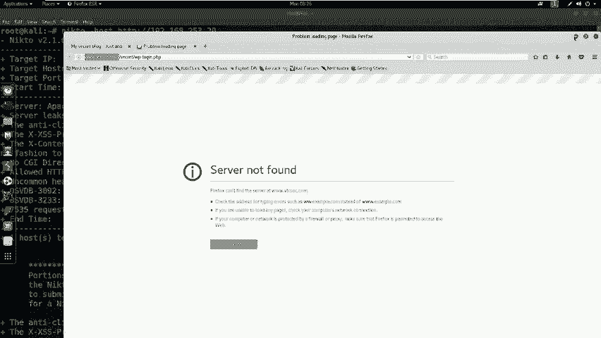

GEDITETCho回撤。那么咱们这时候打开了一个ho啊文件。好文件维成。那么接下来啊我们就输入我们想要对应的这样一个主机名。

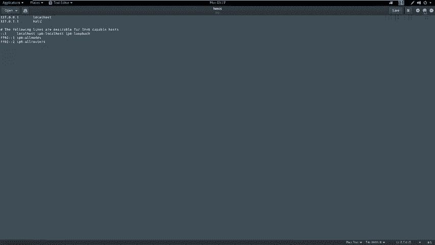

站点首先我们把站点复制出来。好评。之后在这里，我们首先输入我们的IP地址192。168点。253。20之后，我们把我们的这个站点说到这里。共穿安。在controrl S之后，我们来重新刷新。

会发现我们这时候还正确的识别了该站点。对于这样一个站点，并且是waterpress这样一站点，我们该如何进行进一步挖掘呢？这时候我们可以使用到mattterpo这样一个工具对它进行暴力破解。

破解该站点是否存在对应的弱口令。那么我们在破解过程当中，可以直接使用mattterpot对其进行破解。并且加载对应的这个模块进行。登录的枚举，并且使用user name为admin。

并且设置对应的pass file。然后设置对应字典文件的目录之后，我们设置目标的哎这个目录。并且设置按远程储机之后，我们点击ro，然后这时候开始破解admin的目录。

但是我们又不知道我们这个站点是否具ad命这样一个。用户名呢？那么我们首先使用WPS干对该站点进行用户名枚举。这里使用W scan之后，我们回车来查看一下究竟怎样枚举对应的用户名。

这里我们会看到这样一条命令，那我们复制出来之后粘贴这条命令就是枚举simple站点的用户名。那我们接下来修改对应的用户密码。3W，然后我们在这里。把该站掉复制出来。首先我们把这里复制出来hopy。

之后我们在这里paste。最后我们依次来删除对应的目录。我们在这里把这条删掉之后，我们点击回车。来进行探测。初次使用WP scan的时候，还是需要更新WP scan的。那么这过程是相当缓慢的。

我们先暂停。我们可以看到刚才经过哎短暂时间的更新。已经把该WP干进行了。升级之后，我们WP干开始。对该W wordpress啊这样1个CMS进行对应探测。在探测结果中。

我们会探测该wordpress的主题以及该wordpress的插件，以及它的用户名。在这里我们发现了一个用户名，使用addmin。那我们接下来就使用该用户名，破解该用户名对应的。

密码首先我们打开mattterportcon这样一个接口。回车。这个过程可能是比较缓慢，因为mataxbo是一个集渗透测试所有过程的这样一个安全框架。这时候我们打开了该框架。

那我们接下来啊就使用对应的模块来对。该wordpress进行用户名破解。

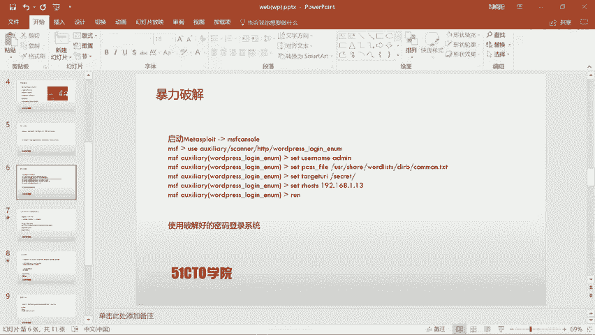

首先回到卡列当中，我们使用ysia。之后HTTP。我们继续来查看一下对应的命令。scanner HTTP。scanner HTTPWP。抓紧。嗯，之后我们在这里继续来查看。W price罗ging。

你南。

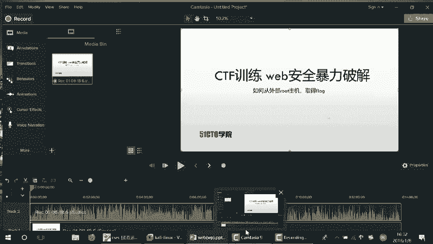

我整。Wordpress。老紧你哪。我们设置完这样一条命令之后，我们还需要使用。这个set命令设置对应用户名，以及对应的part file以及它的tart以及它的are host之后，点击ro。

我们下面回到，首先show option来查看一下该模块下需要设置的参数。之后我们来设置一下。该参数。比如说我们设置一下set。R host192。168。253。20，设置下该站点的位置。

以及设置该站点的pass file，以及它的password。这里咱们需要设置pas file。Set past file。我们设置杠user share。

word list我们来查看一下我们设置的sell。what the list是DB。W list a DIB。What least。DRIBI。我们这里设置common点TST回撤。

我们除了设置完这些，还需要设置user name。我们setuser name之后，设置addmin。我们继续使用s options，查看是否设置成功。设置完这些之后，我们还需要设置一下该站点的。

目录set。Target URLL。Sick rate。RET。我们来查看secret。我们也可以来向上来翻。查找刚才我们WP scan以及n two来扫描到的这个。secret来这样一个目录。花瓶。

secret啊，我们点击回车。那接下来我们就使用rung来开始对wordpress进行密码的破解。那么咱们这时候。Matter bullet。加载该模块，并且还对该模块进行用户名密码的破解。啊。

因为我们这里没有设置这个U到 name，我们来继续设置一下。So， options。Set user name。熊我的命。Show options。这时候我们设置了对应的Uer name。

U到 pass file pass file啊，我们来查看一下。设置的是pass file。我们点击。Rrong。可看到这时候开始进行对应的暴力破解。并且他的速度还是比较快的。

那我们只需要等待该破解的结束。这时候我们会发现，该word press呃经过暴力破解，破解出它的用户名为addmin，它对应的密码也是addmin。那我们下面就使用addmin来登录。

改 wordpress。Remember吧，老见。这时候啊我们又没有对应的这个。设置，那我们需要。对它进行对应的设置。那我们继续使用。打开一个终端IGEDIT。来设置ETC。之后ho死。我撤。

那我们设置。Contro位。之后哎设置。192。168。253。20。ctrolS保存之后，哎，我们来继续访问。看是否哎能正常对其进行访问。那我们这时候哎。打开了对应word press之后。

按使用addmin来进行登录。我的命。老建。就忙吧。我把这个关掉。在这里，他正在哎进行请求访问，并且等待对应的响应。这时候哎我们登录成功，打开了wordpress的这样一个后台。

那我们接下来啊就需要利用该后台对wordpress来上传web shell，通过web shell来获得哎咱们这个站点的 shell，也就是该扶务器的 shellll。

通过获得 shellll使用s in four来获取一下该系统的系统信息之后，使用ID来查看一下。该用户的权限。咱们在上传该we shell之前，需要制作该web shell。

我们回到公击机当中来制作这样一个web shell。在这里，我们依然使用mattterpo里边的一个工具来制作web shell。首先MSF。V1NM之后。杠P使用对应的payload使用PHP。

Matter， printerer。Reverse。TCP之后areho。Aello host。等于。我们来查看一下咱们本地的IP地址。192。16825312copy。

我们给它copy出来pasist来之后，low port等于。4444之后，我们设置输出格式为ro输出对应的源代码回撤。那么咱们这时候就生成了一个返回。

1921682531IP地址80端口的这样1个web shell。那我们下面把这个web shell给它复制到。我们w past后台。在。appre这里有一个edator。打开该页面之后。

我们寻找404模板这样一个页面。在该页面当中，我们把刚才复制出来的web shell粘贴到这里之后，点击upload file。那么咱们这时候404t。lateate呃这样一个模板文件。

保存的就是咱们该外效。咱们在上传web shell之后，哎，需要监听ge shell之后访问404这样一个文件执行咱们的 shell。

那么咱们这时候mattter bullet就会得到咱们该反弹的 shellll。下面咱们打开mattter bullet。来使用监听back。这时候哎咱们使用usee。Mael handler。

设置thatet payload PhHP。没车。Prier。Reverse。TCP回车so options查看对应的选项thatet low host192。168点。253点。

这里咱们监听的啊是咱们本机的IP地址，我们来查看一下。要。要回车。那么咱们在设置结束之后使用rung。来开启监听。那么咱们接下来需要使用浏览器来访问该站点的404文件。这里哎咱们把该目录啊拷贝出来。

打了。P content theme。接下来我们输入。八场IP是192。点168。253。20之后，water pricetwenty fourteen。

我们来查看一下该主题是twenty seventeen。2017 S E为EN。404维车啊，这时候没有找到这样一个目录，我们来继续查看。呃，17。Can seem。买执行。寻找这样一个目录。

先把这里复制出来。2017。17。之后404。点PP回撤，我们依然没有找到。呃，接下来我们使用以下的这样一个链接来访问对应的404web shell之后。

在我们mattterpo监听端口获得对应的 shellll。下面呃我们来访问该 shell。在这里哎，我们复制出来。复制之后粘贴到我们对应的浏览器当中。

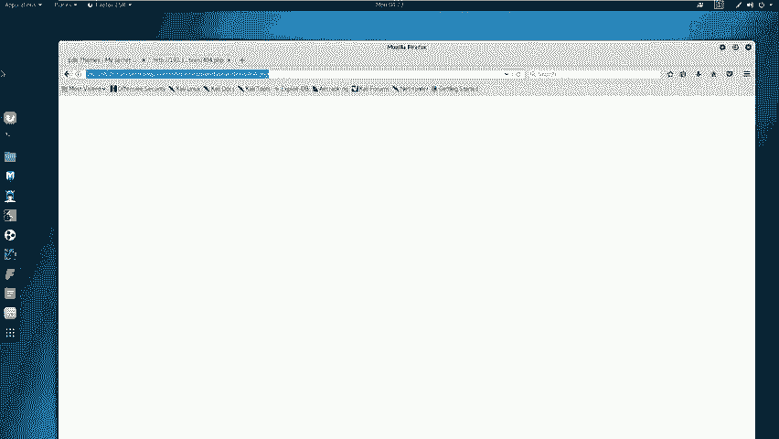

回车，咱们回到对应的监听界面。

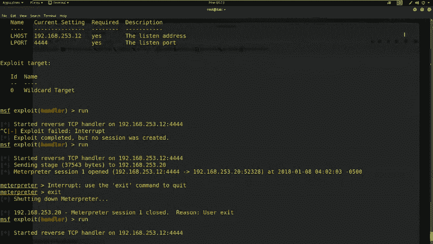

会发现这时候把场机器返回来一个mattropo shell，我们之后使用对应的命令来查看咱们该系统的信息，使用s in four来查看该系统信息，使用SYSINFO回撤。

可以看到这时候咱们返回了系统的一些信息。

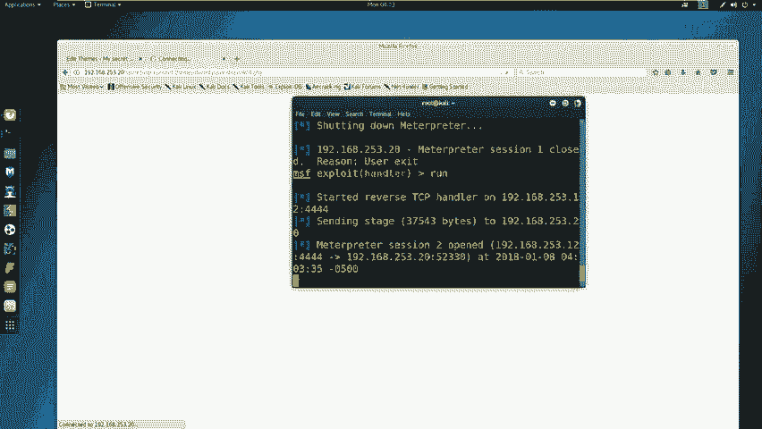

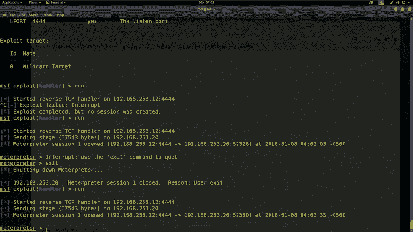

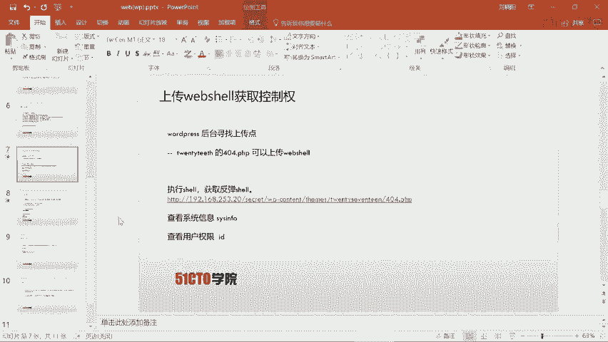

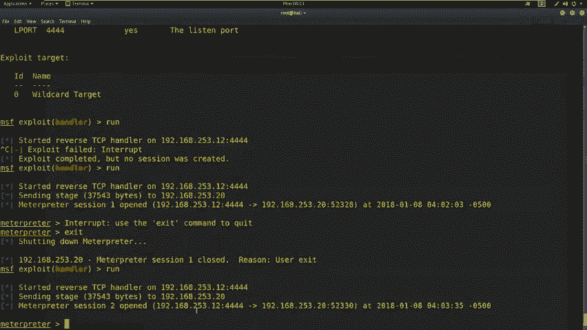

以及可以使用像ll来加载。该系统也就是该靶场的 shell要之后，输入ID来查看咱们当前的用户名以及用户名所运的用户组回车。那么咱们这时候可以看到，该用户是3W date。

以及他的用户组是3W date。那么咱们这时候并没有拿到对应的root权限。对于没有获取root权限的这个 shell。咱们需要来利用matport返回的是shall来获取对应的权限。

也就是获取靶场的最高权限root权限。那么咱们一定要想尽办法去达到这样一个目的。今天咱们使用pass以及sle这样两个文件。

之后用ensadddle passwordsle之后把它转换成draw可识别的一个破解文件，之后使用draw来破解。该靶场机器上存在的用户名和对应的密码之后，咱们对它进行提全操作。咱们回到排场机器当中。

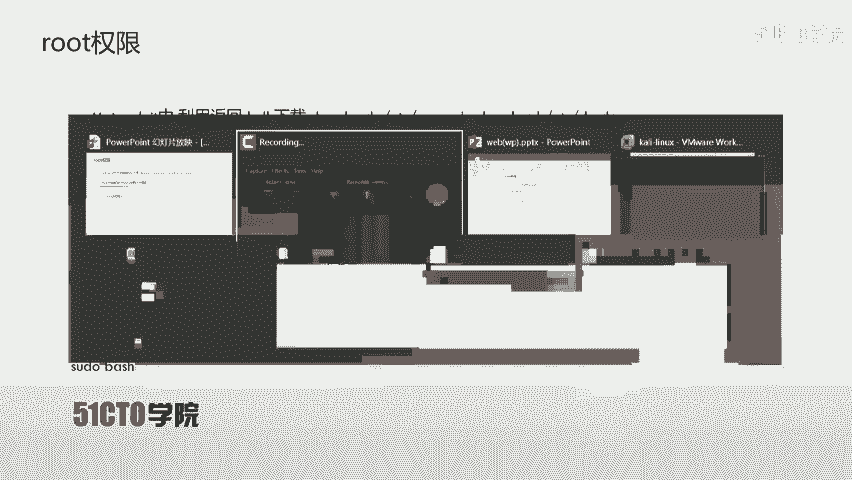

之后。咱们输入哎对应的命令。首先咱们要download。ETC。之后pass。WD回车，咱们之后再下载downloadETC。s回车，咱们这时候下载完毕，回到哎咱们的目录下来查看是否下载成功LS。

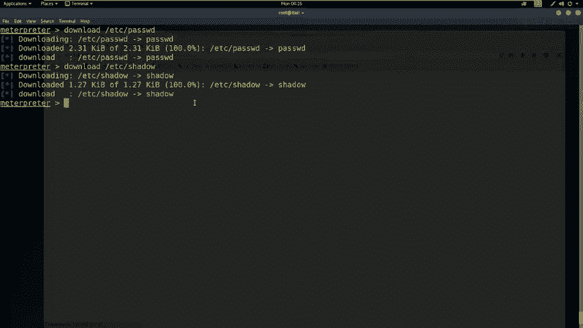

在该目录下可以看到password和shale这两个文件。接下来咱们使用unt。3周之后还是咱们pass。word之后是sle之后，咱把它重定向ced这样文件。之后咱们来查看是否重进向成功。

在这里咱们可以看到有一个quick文件。之后咱们使用dwn之后，cick回车，咱来破解一下。该。把机上存在的用户名和和密码在这里。

咱们发现了marin spike和marin spike这样一个哎这样一个用户名和密码。那么咱们接下来哎就使用该用户和用户名密码来提取对应的权限。

首先咱们要进入hell在mental spot输入hell之后，SU杠marin spike。

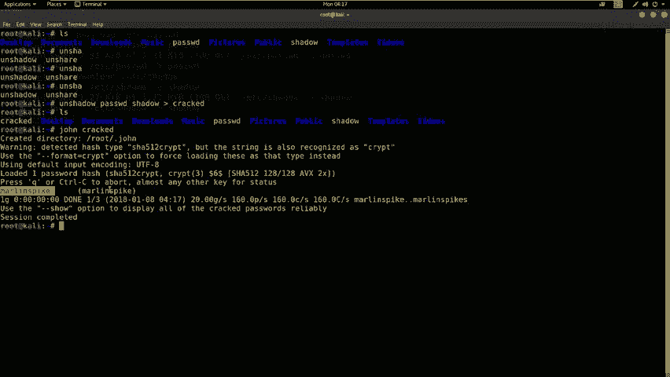

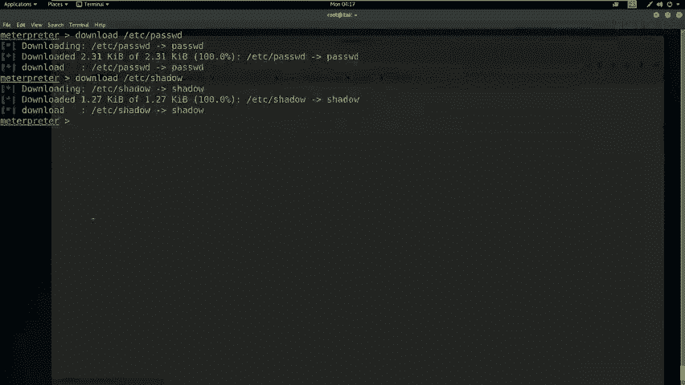

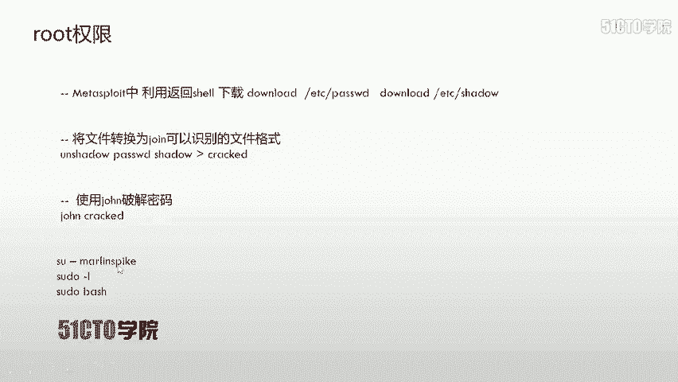

来执行提选操作。Shell。之后哎，咱们输入。SU讲。咱把刚才所得到的哎这个用户名和密码复制出来。用户名和密码都是哎这样一个字符串。

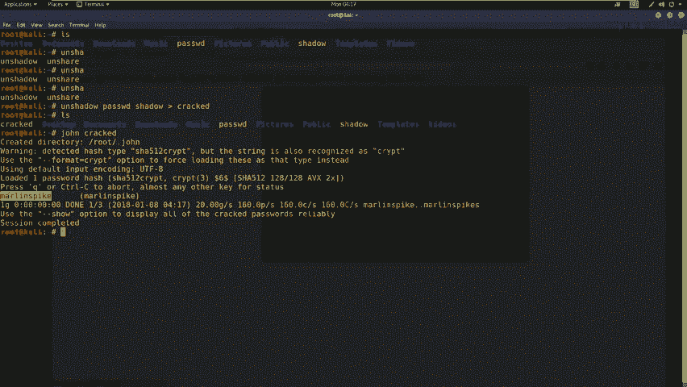

之后咱们点击右键paste回车。他说哎这个SU must哎必须跑到一个终端里。那么咱们这时候哎就之前哎学过的这个终端启动使用python哎这样一个操作import PTYPTY叫SPAAWN。

单引号之后是beb。之后双引号回车，咱们启到这样一个终端之后，SU来继续进行提全之后哎，咱们把它粘贴进了paste回车。接下来啊咱们再输入对应的密码，paste回车输入之后啊。

我们会看到它并没有直接变成一个root权限，而是使用markel登录了这样一个系统之后，咱们输入SU。

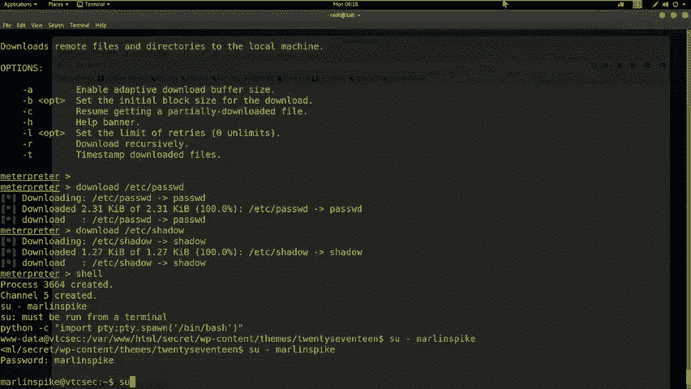

SU杠L之后，SU do base来进行root权限的提升。

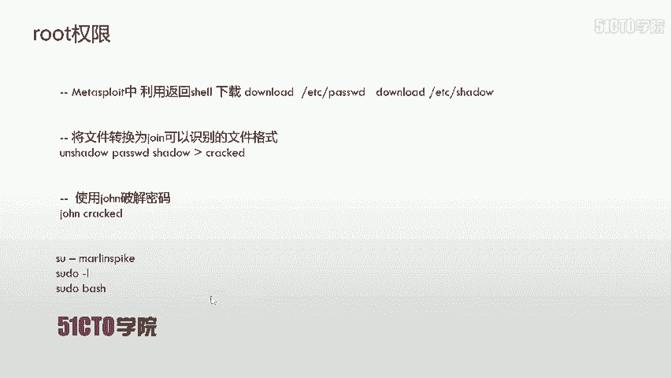

有多讲了回去了。之后咱们把对应的密码输进去回车。接下来我们输入SU do face可以看到哎在这里。呃，匹配到了啊一些这个。具有root M权限的目录，我们来启动这个权限。

这时候我们会发现提升到了这样一个。ro权项。那么接下来我们就要做最后一步操作。

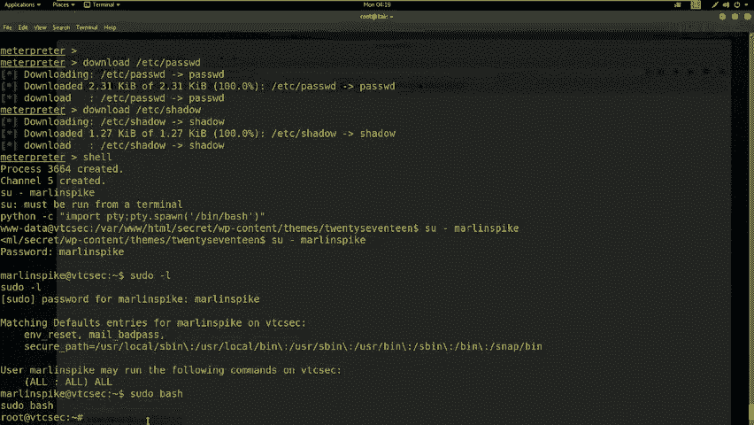

也就是啊我们提升root权限之后，来查找fag。一般情况下，把厂机械的fag是重放在服务器的根目录下。咱们需要切换的目录之后来使用cat查看fag值。在这些过程都结束之后，哎，咱们需要写rite up。

也就是咱们实验文档，或者说是测试文档。如果对于有经历以及想更深入的去挖掘性信息，大家可以写对应的总结文档。下面我们来获取一下对应的flag值。

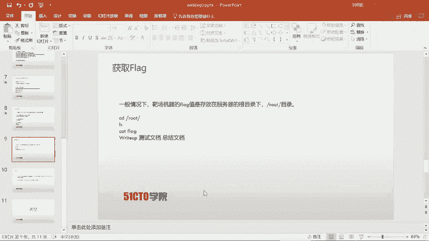

首先切换到根目录CDroot。LLS来查看，看到有对应的f。之后我们使用cat。Flash。来查看对应的flash。在这里我们返回到。

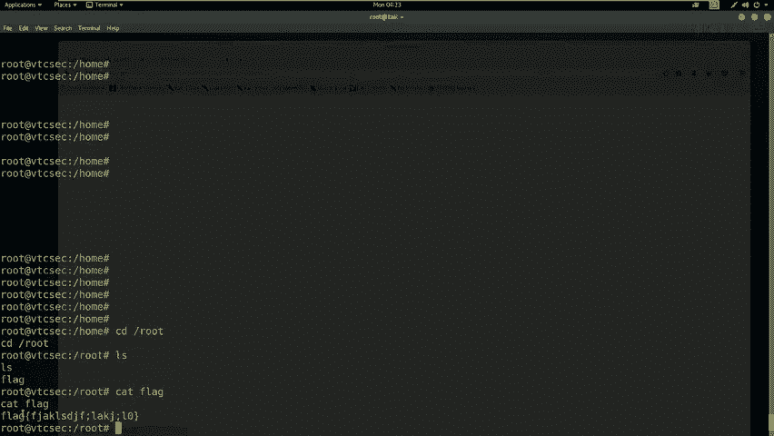

对应的flag值。那么这时候哎我们该靶场就测试完毕，下面我们进行总结。我们在提全时可以抓取哎ETC以及password这个文件，以TCsle这个文件之后。

使用unsle将两个文件合并成状可识别的这样一个文件。之后装这个文件就可以得到对应的用户名和密码，使用该用户名和密码，登录该系统。那么这时候就可以。继续使用该用户的用户名来提升root权限。

那么最后一点就是对于WP，也就是wordpress的渗透中。启动对应的主题，然后在404页面上传对应的shall。那么mattterport监听端就会获得对应的hell。那么这节课就到这里，再见。

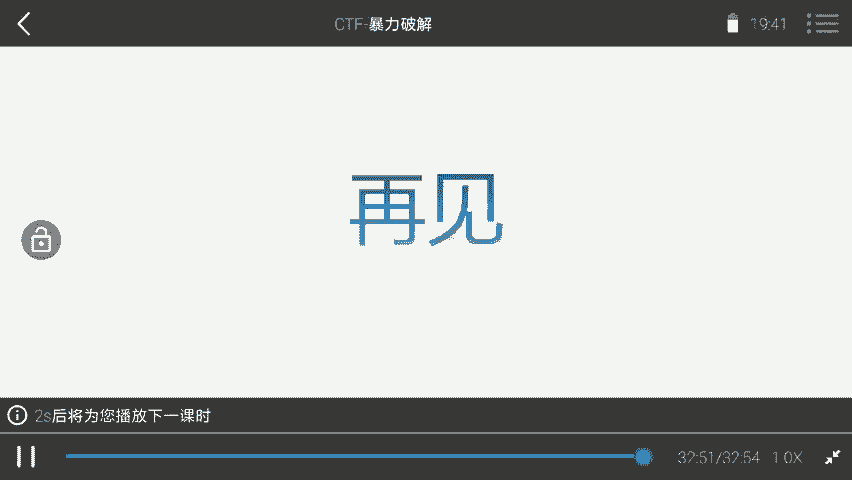