# CTF夺旗全套视频教程-网络安全 - P18：18.PUT上传漏洞 - YiWorld-奕 - BV1FN411U7Cv

我们提一下CTF训练当中的中间键put漏洞。通过该漏洞，我们可以从外部root主机获得主机的最高权限，最终得到对应flag值。下面我们首先来介绍一下中间键put特漏洞。

中间键包括app帕奇tomcatIS weblog这样一些程序，这些中间键可以设置支持HTTP方法。当然，HTTP方法包括get post hand delete put option等等。

咱们每1个HTTP方法都有其对应的功能。在这些方法中，put可以直接从客户机上传文件到服务器。那么咱们恶意攻击者就可以利用中间键开放的put方法，直接上传web shell到服务器指定的目录。

咱们如果可以直接上传sell，也可以从侧面反映出put漏洞的严重性。下面咱们来介绍一下今天的实验环境。首先，公积机使用卡利linux。他的IP地址是192。168。1。111。

而我们靶场机器使用linux系统，它的IP地址是192。168。1。102。那么咱们现在拿到了这样一个实验环境，该如何进行操作呢？咱们再进行任何操作，都需要抱有一个目的。

那就是获取靶场机器的root权限，得到对应的flash值。现在咱们已经拿到了对应的实验环境。首先要进行第一步探测信息收集。首先咱们可以扫描主机开放的全部端口，这里使用N map。之后加上杠P。

之后加上一个横杠，表示扫描该机器的所有端口。这里我们应该是。杠T4使用最快速度。使用最快速度进行探测。因为我们扫描的是所有的端口，所以说它需要发送大量数据包。那么咱们这时候可以使用最快速度。

避免等待它的时间过长。下面咱们进行操作。

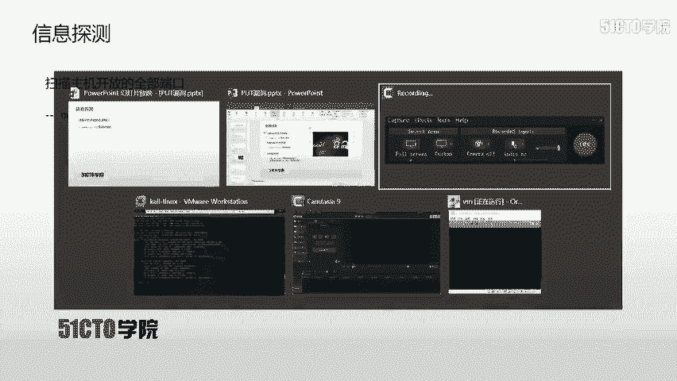

A map。杠。T4使用最快速度杠P。杠之后是靶场IP192。168。1。102。不撤。这时候咱们N map开始探测该靶场机器上开放的所有端口。因为是探测所有的端口，所以他发送的数据包比较多。

咱们只需要耐心等待。咱们先让他在这里进行扫描。咱们除了扫描这样一个端口号，还可以扫描它的其他信息。扫描主机上全部的哎这样一些个信息情况，这里依然使用M map之后加上杠大T4，表示使用最快速度之后。

加上杠大A表示加载所有M map扫描模块，对其进行扫描之后加上杠小V表示详细输出扫描结果之后，加上靶场IP来进行扫描。下面我们再开启一个新的终端对其进行探测。

A map。杠T4最快速度杠大A，所有模块杠小V之后是靶场IP地址192。168。1。102回撤。

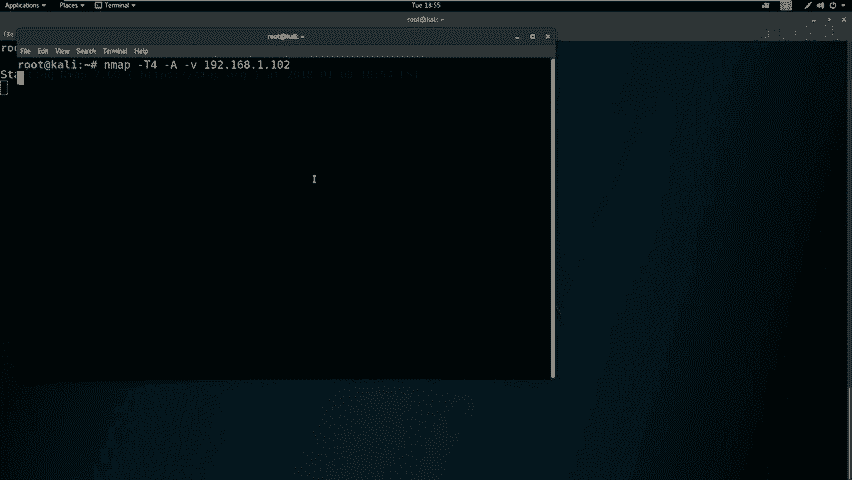

这时候哎咱们也加载所有扫描模块，对靶场进行对应的信息探测。可以看到咱们很快的哎就对靶场所有模块探测完毕。我们也可以看到这里哎也对所有端口号来进行了一个探测，并且返回对应结果。咱们对于扫描结果当中。

如果开放了HTTP服务。那我们就可以使用其他工具，对HTTP服务进行对应探测。这里我们使用到。nicick two和DRIB对靶场机器进行敏感信息的探测。

n two加上杠ho之后是HTTP之后是靶场IP地址之后这里要输入端口号。端口号的话，如果是默认的80端口，那我们端口号可以省略。如果不是默认的80端口，是必须加上对应端口。

否则ne个 two无法进行探测。我们来使用ni two进行探测。Nick two。Host。杠ho之后是HTTP。之后是8场IP。因为咱们HTTP服。所用的端口号是80端口。

所以说咱们这里不需要加对应的端口号。回撤使用n two来对其进行探测。咱们先让他在这里来进行探测。我们也可以使用目录探测哎，这样一个工具。对靶场。上对应的敏感目录信息进行对应探测。下面我们来进行。操作。

首先哎我们输入。DIB之后输入HTTP。八成IP。回撤这时候DRIB也对该靶场进行对应探测。我们在探测完毕之后，就需要对我们当前探测得到的信息进行深入挖掘。分析n map和mwo的扫描结果。

从中挖掘到可以利用的信息。比如说咱们如果有HTTP服务，就可以使用浏览器，打开对应的敏感页面，查看敏感信息，找到咱们可以利用的位置。这里哎咱们一个wo。已经扫描完毕，以及哎咱们DRIB已经扫描完毕。

咱们来分析一下A map。以及n two和DIIB的扫描结果并分析。可以看到咱们一开始执行的扫描全部端口的命令在这里，并且它的扫描结果已经输出到这里。我们可以看到该靶场机器上开放了22号端口和80端口。

并且对应的服务是SSH以及HTTP服务。我们继续来查看一下扫描的全部信息。这里我们找到了N map全部信息扫描的这样一条命令。我们向下看会发现。该靶场开放了22号端口，以及它对应的软件。

以及版本以及操作系统。以及协议的版本号。之后我们看到。80端口以及他度。对应的中间件的类型。这里我们也看到了它所支持的HTP方法。以及它的title。以及该靶场机器的mark地址，以及它网卡类型。

之后我们可以看到它的操作系统linux的内核版本。这里以及一些呃录由信息。我们在这里通过N map可以发现把场机器上开放了22号端口和80端口。之后我们再来分析一下n two的扫描结果。会发现。

ne个 to给我们扫描结果当中。表明。当前有一些HTTP的爆头没有被设置，那就会造成一些攻击方式。并且哎这里已经探测出当前使用的PHP版本是5。3。1。那么咱们这时候发现。

尼 two并没有扫描出任何敏感的信息。我们继续来查看DRIB扫描的结果。我们在第2IB会发现。扫描处摆两个。敏感的位置。比如说这里我们扫描出1个URL，下面我们打开该URL。复制之后打开浏览器。

陈创威回撤。会发现哎这时候打到了一个页面。并且出现了一张图片。对于哎这样的信息来说，在CTF比赛当中，我们可以右键查看源代码。发现并没有任何值得利用的信息，我们关闭。

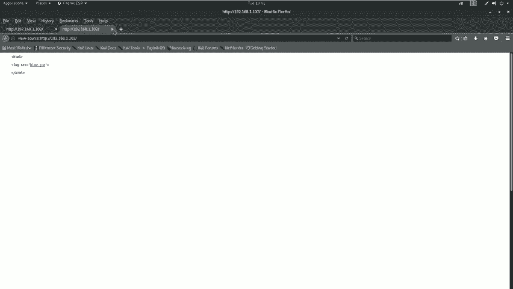

之后我们来查看一下下个页面，会发现扫描到1个TEST这样一个目录，我们copy出来之后在浏览器当中打开。会发现。

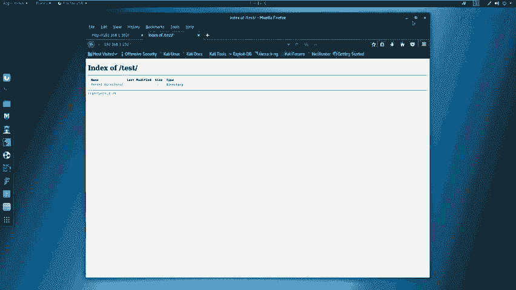

是一个空目录，并且内部没有任何信息。我们在返回的时候，哎返回了上级目录，我们就去打开。这时候啊我们发现并没有找到任何可以利用的位置。那么我们对于开放的HTTP服务，就可以使用对应的。

漏洞扫描器对其进行扫描。今天咱们使用O upZAP这样一个web漏洞式扫描器，自动挖掘webb程序中的漏洞。这是他的一个界面截图。下面咱们就使用。卡利当中。the oasp VIP对其进行扫描。

在这里options。完毕。我们先啊在终端里也可以打开OwaZP回车。我们开启了哎这样一个界面，点击。Accept。之后我们sZAP加载很多扫描模块。可以看到哎，这是他的进度条。嗯。

这时候我们打开了OSOS V选择第三个start。最大化哎之后我们在这里输入靶场IP192点。168。1。102，点击attack对其进行漏洞扫描。首先哎我们要对靶场机器上来进行自助爬虫。

之后啊对靶场爬到的这些页面进行漏洞扫描。因为我们站点比较小，所以说没有扫描到。任何漏洞，而且它扫描速度也比较快。可以看到我们这里哎有一个。叉 frame开的notad啊这样一个。中微漏洞哎。

它只是一个哎避免文件包含或点击截持的这样一个。HTTB爆头。并且有一些低位漏洞。我们刚才也探测了TST这样一个目录。我们下面把TST放进去来查看一下是否能扫描到对应的漏洞。

我们会发现哎也没有扫描到哎高危漏洞，只是扫描到哎一些中微漏洞。啊，只是扫描到一个目录便利漏洞，目录浏览这样一个漏洞。所以说哎在扫描器当中，我们并没有找到值得利用的地方。难道我们这时候就没有。

任何漏洞了吗？没有任何方法去攻击该web服务器了吗？那肯定是不行的。这里我们还需要测试一下该页面是否存在put漏洞。通过put漏洞，我们可以直接上传对应的。web shell获取靶场机器的shll。

我们对该test目录进行。对应的探测，这里使用到CURL这样一个工具之后，杠位表示输出详细信息，杠大S表示加载HTTP豹纹头Os表示查看一下该靶场机器上所支持的HTTP方法之后。

加上咱们靶场以及对应的目录。下面咱们来对该敏感目录进行对应的探测。没关闭，该终端。之后哎使用CURL之后杠小V杠大S。Options。之后加上咱们对应的目录，192。168。1。

102之后是test回撤。我们可以看到，哎，当前发送了对应的数据包之后。我们该服务器返回了对应的响应报文。这里会发现。当前。目录允许的HTP。方法。具有这些。我们在。这些内容当中筛选出了put方法。

会发现该目录是存在put漏洞的那我们下面就要利用该漏洞进行上传web shell。我们利用put漏洞获取shall的思路，哎，就是上传一个V shell到服务器之后。

咱们通过目录便利路径访问该we shell执行we shell。那么咱们在卡例当中监听该we shell，最终获取靶场机器反弹回来的shall。下面咱们来查看具体的方法。上传web shell。

首先咱们要在cast目录下直接使用浏览器插件post上传一个we shell。而咱们当前的web shell该如何寻找呢？

咱们今天使用user sell webb shellsphP下的web shell。下面咱们来上传we shell。

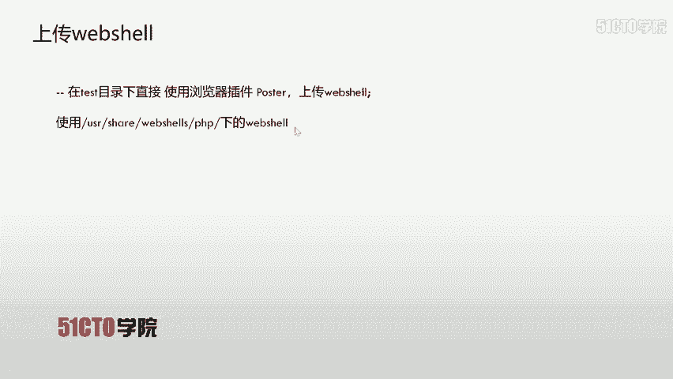

首先哎我切换到桌面。LSCD desktop， which LS。窗L哎表示清空哎这样一个界面。之后哎，咱把。对应的web设拷贝到当前的桌面。PHP。之后哎咱们tab两下来查看一下，可以使用到事项。

咱们今天哎使用反弹的事项。之后哎咱们在桌面把它保存为。呃，这个shall点PHP回撤，咱们下面来查看一下桌面是否拷贝了这样一个sllLS可以看到这时候咱们桌面有这样一个sell。

当然咱们有这样一个反弹 shellll之后，是需要编辑其中内容的。GDIT。需要在PHP回撤，咱们来编辑对应内容。这里我们需要编辑反弹回来的IP地址以及反弹回来的端口号。我们来查看一下本机的端口号。

使用IFconfig192。168。1。11。我们把它复制出来。拷py哎之后关闭哎之后，咱们打开刚才的这个GDIT在这里哎，咱们把127。0。0。1来给它替换。之后哎，咱们这里。端口爱克始任意端口。

咱们现在先设置为443controrlS。

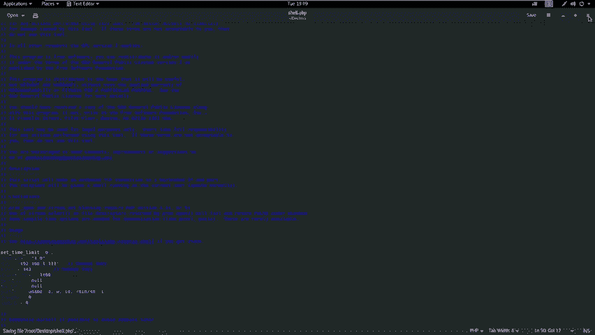

关闭。这时候哎咱们就编辑好了这样一个。是要，那么咱们接下来就可以对其进行上传。首先打开浏览器之后，哎，咱们安装了po这样一个插件。点击post。之后哎，咱们对应的UIL。是在test呃目录下。

我们所以啊把该目录复制出来。

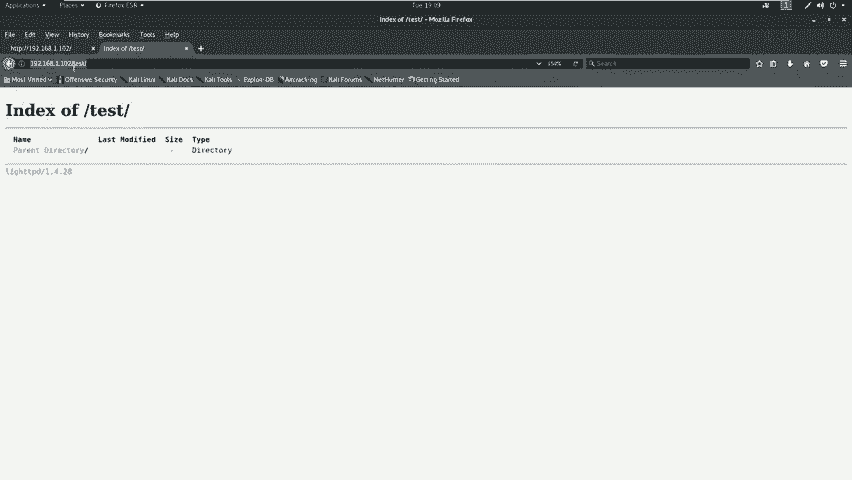

咱们肯朝威。上传哎，之后让咱们保存到。阿点PHP。之后哎咱们选择哎对应的文件，也就是咱们sell点PHP之后点击post啊这样一个请求pot。这时候哎咱们已经上传成功。

咱们接下来在test目录下来查看该文件是否上传成功，关闭。

咱们来刷新。会发现这时候哎咱们就在该目录下有一个。阿点PHP。咱们现在上传完map shell之后，可以执行weap shell。执行we shell要返回给咱们当前的卡利。

那么咱们卡利当中就需要设置对应的监听，这里咱们使用。NC哎这样一个工具来开启监听。NC加杠NLVP之后加上对应端口号。因为咱们今天的靶场机器开启了对应的防火墙。所以说咱为了绕过防火墙的措施，哎。

就使用了端口号443，也跟咱们之前。这里设置web shop的端口号是一样的。因为咱们web shop是要连接到咱们远程的443端口，所以说咱们在web shell里反弹的端口号也设置为443。

下面咱们来开启监听。

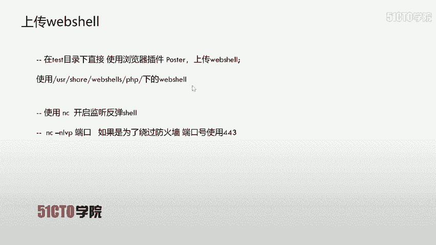

首先打开一个终端之后，NC杠NLVP之后，443回撤开启监听。开启监听之后，我们需要执行对应的we shell来反弹回靶场机器的事。点击。

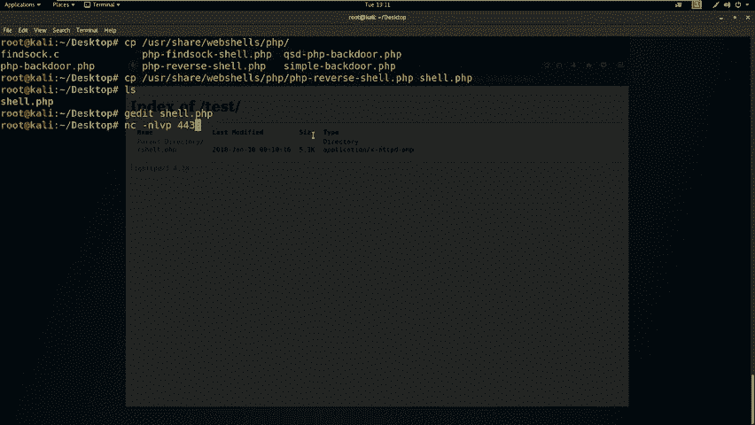

点击执行之后，咱们NC当中就会返回对应的sll。这时候咱们反弹回来的哎是我们该靶场机器上的一个标准输入。而对于这样的标准输入是可能无法执行有些命令的。比如说SU do这样一些命令。

那么咱们这时候就可以使用pathon模块来开启对应的终端。首先，使用ecoimport PTYPTY然后对应的方法返回base，把它从定向到TMPASDYASDF点PY这样一个pathon文件之后。

使用pathon执行该pathon文件。我们下面要来操作。当然大家也可以直接python杠C。Import P TY。PTY调。SPAWN。之后并。Base。回撤我们来执行也是可以的。

当然也可以根据PPT上的这样一个操作来执行。咱们上传完web shell之后。可以执行其他命令来查看一下当前咱们所登录的用户以及对应的权限。可以使用ID来查看当前的用户权限。

以及使用who am I来查看当前登录用户。我们在使用该命令之后，会发现它并不是具有最高权限的root用户，而是具有低权限的3Wd。那我们就需要提升对应的权限。我们下节课将介绍如何提升对应权限。

我们这节课先到这里。

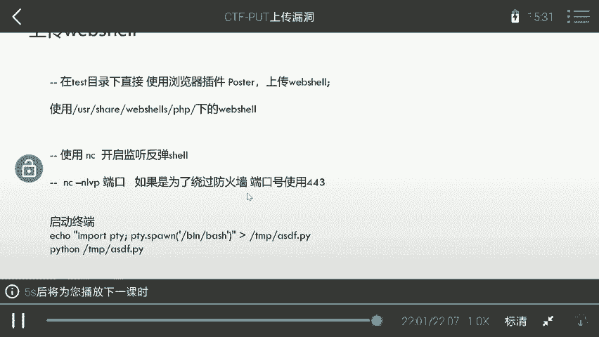

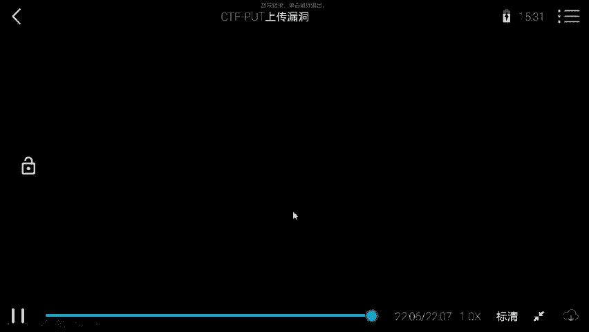

大家好，我们今天继续来学习万部安强当中的命令注入漏洞。如何通过万b引程序哎，从外部。来运行主机的设要命令，最终获得主机的访问权限，提升root权限，取得对应的flag值。

下面哎咱们介绍一下今天的实验环境。公积机是卡利linux，它的IP地址是192。168点。1。1。106靶场机器打P地址是192。168。1。104。那么咱们拿到这样一个实验，哎，该做什么呢？

在CTF比赛当中，大家一定要注意，哎，咱们主要的目的是要获取靶场机器上的flan值。并且咱们在整个过程当中一直以这样。一个目标哎为这个指向，让咱们所有的操作都是要来获取flag值以及root靶场机器。

下面咱们进行第一步，也就是在外围哎，然后对靶场机器进行信息探测。首先咱们使用M map来扫描一下靶场机器的服务信息以及服务的版本。使用M map哎，然后杠小S大V加上靶场IP地址。点168。1。

104回车。这时候咱们map开始对靶场机器进行一定的扫描。在过程当中哎，他会发量发送大量数据包给靶厂机器，靶场机器会返回对应的响应。哎之后根据响应。返回对应的结果。咱们除了可以扫描版本信息之外。

还可以使用N map。杠T杠A杠V，然后把上IP地址来扫描主机的全部信息。

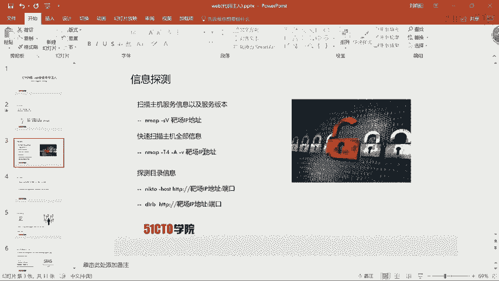

A map杠。A杠V杠T4。可能之前哎我们课程当中哎扫描全部信息，直接使用杠A，然后加上杠V之后加上靶场的。IP地址。并没有加咱们今天这个参数杠T4杠T4哎，是这样一个含义。咱们之前哎不加杠T4。

它的扫描速度是比较缓慢的。如果咱们加了杠T4，哎，表示N map以最大的哎这个效率来发送数据包给对应的靶场IP地址。那么咱们扫描的结果哎也是最快出现的。下面咱们尝试一下。

这时候哎咱们会看到很快哎就出现了很多信息。并且哎咱们这个一直在扫描哎，速度是非常快，哎，这里哎就出现了对应的结果。

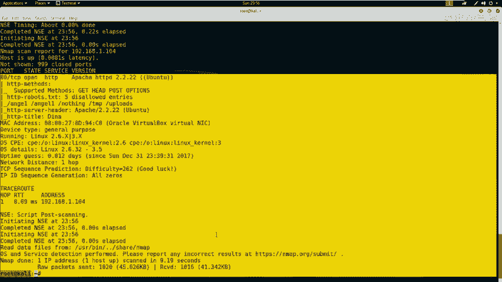

咱们再探测完这个主机的啊一些信息之后，还可以探测一下。哎，咱们如果开放了哎HTTP服务，就可以使用n two和DRIB来扫描一下哎这个靶场的。HTTP服务开放的目录信息。下面哎咱们尝试一下。

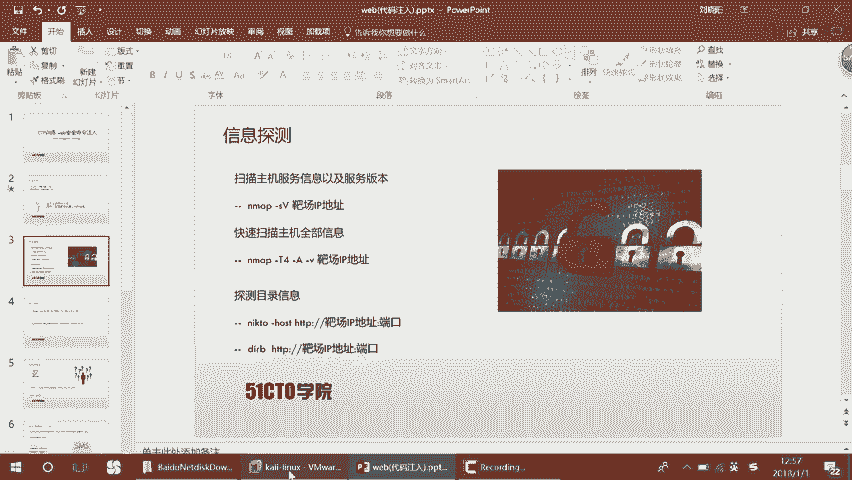

首先使用n克 to。杠ho，然后HTTP。192。168。1。104回撤。这时候咱们尼克 to哎开始对靶场的机器哎发送数据包，然后接受对应的响应，然后分析出对应的这个扫描结果。咱们在这里可以看到哎。

他发现了很多这个目录，哎，发现了呃这样一个目录，又发现了upload这样一个目录，并且他发现了robots点TST。呃，并且包含5个入口哎。咱们可以看到是哪5个入口。呃，这里有sute temp哎。

这些一些目录。哎，咱们这个扫描器哎还是比较哎强大的，它可以扫描出哎很多这个服务器上的文件信息，并且哎又给了咱们一些注释信息。哎，咱们可以看到tamp，哎，然后后面给注释信息是什么？

这个有可能哎是比较有趣的一个这样一个目录，哎，可能会有一些敏感的信。