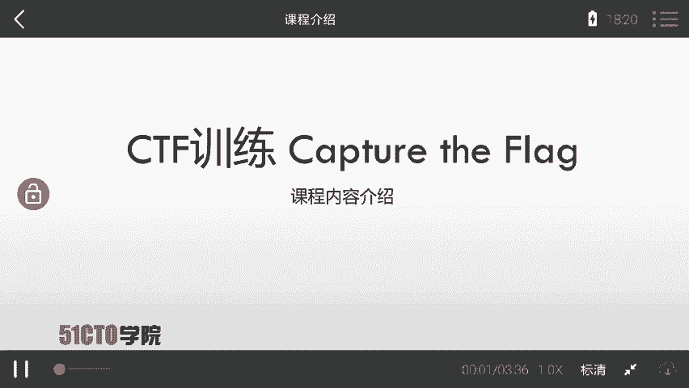
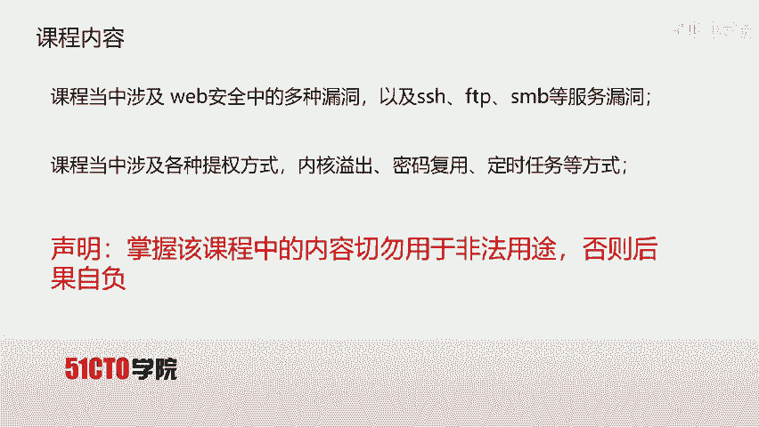
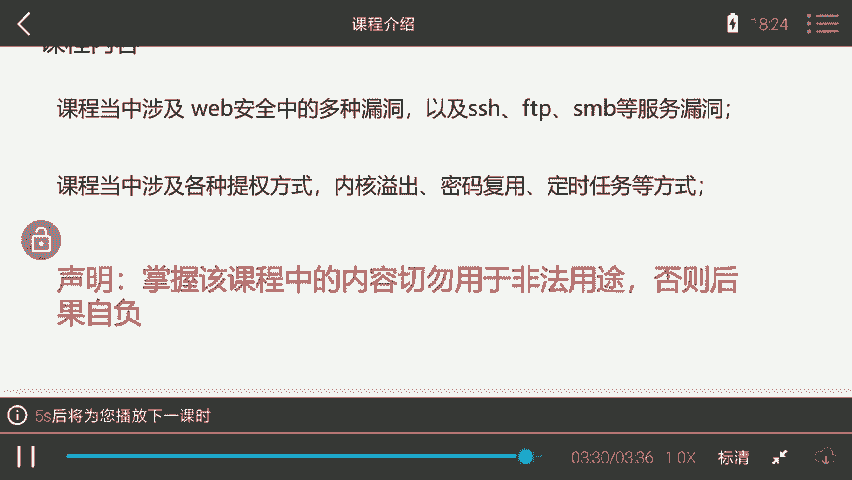
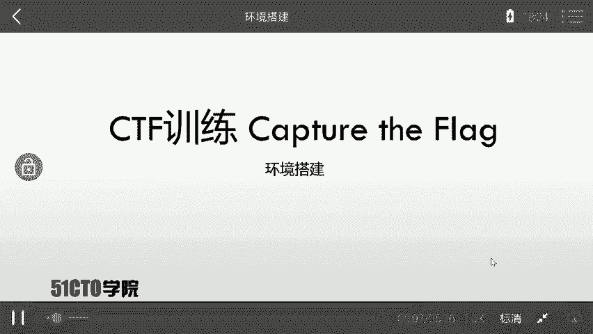
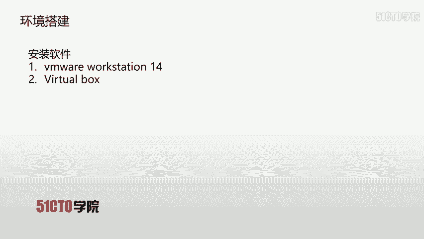
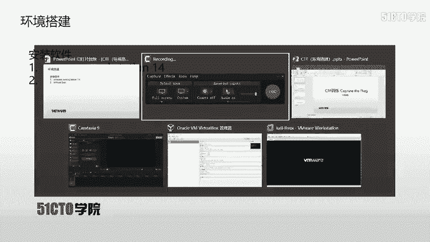

# CTF夺旗全套视频教程-网络安全 - P1：1.课程介绍 - YiWorld-奕 - BV1FN411U7Cv

很高兴呢呃我们能来到这门课程CTF训练capture flag。下面我们对课程进行一个内容的介绍。在介绍之前，我们首先来对CTF进行对应的介绍。CTF是当下一种比较流行的信息安全竞赛形式。

其英文名可置译为do flag。也可意义为夺旗赛。其大致流程是参赛团队之间通过攻防对抗程序分析等形式。率先从主办方给出的比赛环境中得到一串具有一定格式的字符串或其他内容，并将其提交给主办方。

从而得得对定分数，为了方便称呼，我们把这样的内容称之为fack。当然，在CTF比赛当中，涉及内容比较繁杂，我们需要利用所有可以利用的方法获得对应的fack。以上就是咱们CTF这样一个比赛形式。

下面哎咱们介绍一下我们本门课程所用的实验环境。每节课当中我们都会提供对应的公积机卡lilinux和对应的靶场机器linux。但是，学员需要下载下载攻击机和靶场机器之后，自行搭建测试环境。

并对靶场机器进行对应的渗透测试，取得对应的fag值。那么咱们在拿到实验环境之后，大家需要做的是什么呢？大家需要搭建完成之后，抱有这样一个目的，要获取靶场机器上的flag值。咱本门课程面向的对象。

本课程定位在一个中等难度的程度上，需要咱们的学员具备一定基础。比如了解HTTP协议，以及会使用一些基本的安全工具。

其中就包括b suitcircle map以及mattterpot这样一些基本的安全工具。当然，对于课程中内容，无论是想要入门的CTF小白，或者是具备一定经验的CTF选手以及网络爱好者。

都是一门不错的学习资料。咱们本门课程内容涉及了这样几个方面。首先，课程当中涉及了万般安全当中的多种漏洞，以及SSHFTPSMB等服务的漏洞。咱们通过以上的漏洞可以。得到靶场机器的shall。

但是该 shellll并不是root权限。那我们这时候就需要涉及到各种提全方式。其中我们讲解了内核溢出密码复用以及定时任务等方式，对靶场机器进行对应的提权。当然。

我们本门课程完全是以实战的方式对靶场进行渗透测试，获取对应flan值。学员在掌握该课程当中的内容，切勿用于非法用途，否则后果自负。

那么咱们就开启对应的CTF之旅吧。

。Yeah。그。Okay。Yeah。

Yeah。

Yeah。Yeah。Yeah。