# CTF夺旗全套视频教程-网络安全 - P22：22.CTF综合测试(高难度)WEB安全初级入侵 - YiWorld-奕 - BV1FN411U7Cv

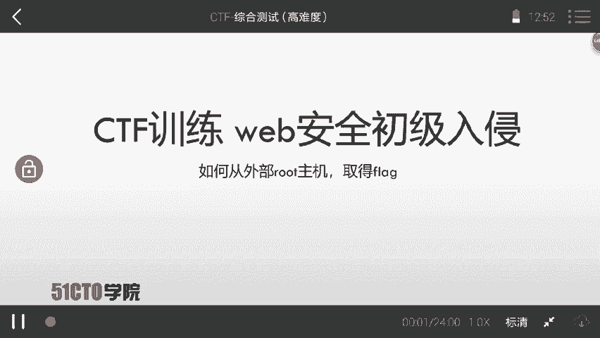

大家好，今天我们来学习一下，哎，通过web in程序。对它的安全漏洞进行测试，达到入侵的这样一个效果。最终，root主机获得主机的最高权限，取得对应的flash值。咱们在开始之前。

首先来介绍一下外部安全。随着Y82。0、社交网络、微博等一系列新型的互联网产品的诞生，居于外部环境的互联网应用越来越广泛了。咱们企业的信息化过程当中，哎，各种各样的应用都架设在web平台之上。

web业务也迅速发展为。黑客哎的强烈关注，接踵而至的哎就是咱们万般安全危险的凸显。黑客利用网站操作系统的漏洞和web应用程序的sr科注入漏洞等得到万部服务起的控制权限。轻则篡感网页内容挂黑页。

重则哎通过这个外部漏洞获取咱们企业内部重要的数据信息。更为严重的哎，就是在网页当中植入恶意代码。今年比较火的就是在网页当中植入恶意代码，实现挖矿的这样一个操作。比如说挖比特币、挖能罗币这样一些虚拟币。

使得咱们网址。的访问者受到极大的侵害。下面咱们介绍一下今天的实验环境。首先，公积机的IP地址是192。168。253。12靶场机器的IP地址是192。168。253。13。咱们拿到这样一个实验环境之后。

该怎么办呢？大家在进行渗透测试的时候，一定要有一个目标，就是获取靶场机器的root权限。如果是在CTF比赛当中，大家要明确啊，我们是要达到靶场机式上的flash值。咱们在拿到这些信息之后。

可以使用攻击机对靶机进行测试。测试的第一步是要对靶场机器。进行信息探测，对他的信息来进行深入的了解。咱们可以使用M map来扫描一下对应靶场IP地址所开放的服务以及服务的版本信息。下面咱们进行操作。

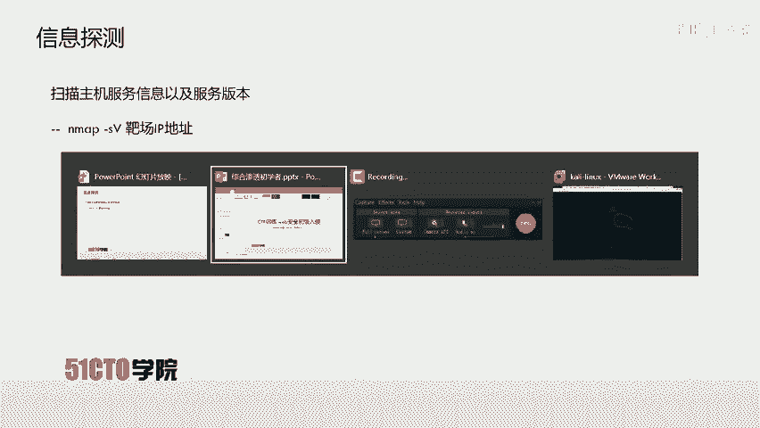

首先使用M map。之后加上它的参数杠SV靶场的IP地址253。13回撤。咱们这时候n map哎就会执行这条命令，发送大量数据包给咱们对应的这个。IP地址也是靶场的IP地址。

然后靶场会给咱们返回是任何很多信息，这些信息就会被im map处理，哎，显示到im map的标准输出当中。咱们除了可以扫描主机的服务信息以及服务版本信息，还可以使用。Am哎全部功能来扫描靶场。

获得靶厂的全部信息。这里咱们使用T4来使用M map的最快速度扫描靶成IP。之后是杠A使用M map的全部功能来扫描靶场。之后是小微来表示我要显示所有的这样一个扫描信息。使用M map打A打V杠T。

T4靶场IP。在这里啊可以看到我们使用。map杠大A杠小V杠T4和咱们PPT上面的这个顺序还是不一样的。这里大家需要注意这个顺序是可以改变的。咱们下面来点击回撤来进行扫描。

会发现这个N map依旧哎把它的扫描结果给咱们返回到这个N map的标准输出当中。这时候哎咱们扫描完了哎这样一个靶场的全部信息，并且把信息给咱们返回到的这个标准输出当中。

咱们除了可以使用M map来探测主机开放的哎服务信息，以及这个主机的全部信息。也可以使用其他工具，对主机的HTTP服务进行对应的扫描。下面哎咱们就使用另外两个工具。

对靶场的目录信息以及它的文件信息来进行扫描。首先，地一工具使用link to，然后告hos。

然后使用HTTP来之后是靶场IP以及加上冒号，加上端口号。这里咱们端口号如果是默认的80端口，哎，咱们可以省略。如果不是80端口，咱们就必须加上。咱们下面来使用n to来扫描。Onho HTTP。

192点168点253点。13。回撤。咱们这时候I need to哎就会扫描咱们这个靶场的80端口开放的HTTP服务。这里会给咱们返回很多信息。并且会返回一些敏感的文件信息。

咱们除了可以使用neick to哎来扫描。靶场的这个信息也可以使用DRIB来探测靶场的目录信息和文件信息。使用DIB然后HTTP。然后是靶场地址。回撤哎，这时候哎。

咱们这个DRIB会探测一下咱们靶场所存在的哎目录以及它对应的文件信息。咱们在进行完信息探测之后，更多的是想。从这些信息中挖掘到哎咱们可以利用的一些信息。下面咱们就对这些信息进行深入的挖掘。

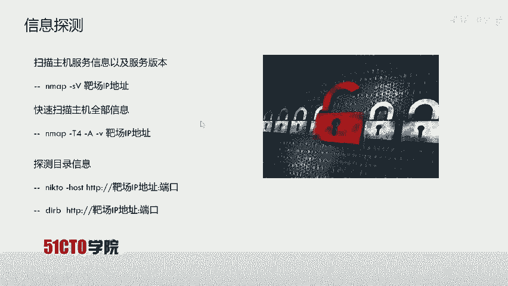

首先咱们分析 map ni toDRIB等工具的扫描结果，并对结果来进行深入挖掘。找到可以利用的信息。比如说咱们如果挖掘到哎某个敏感页面可以使用浏览器，打开查看敏感信息之后，找到可以利用的位置。

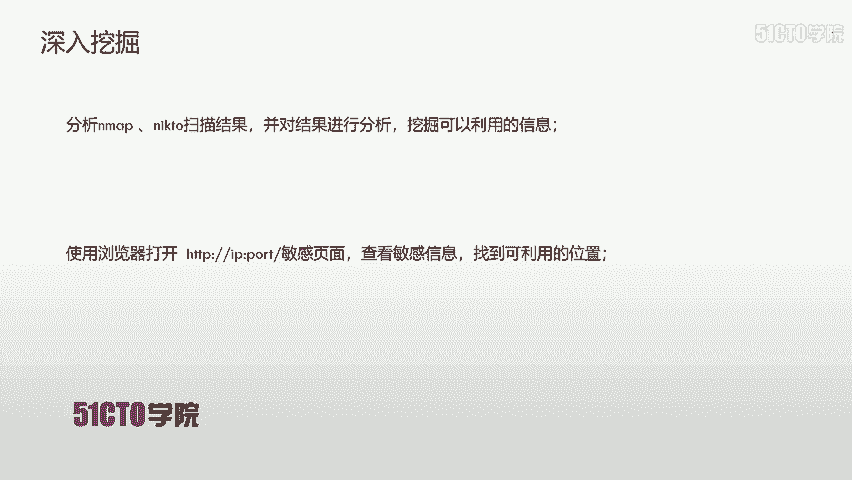

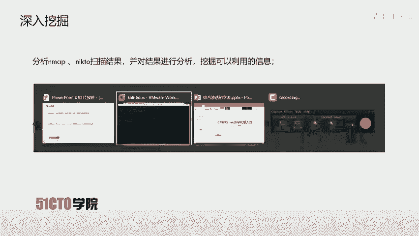

下面咱们就来分析一下刚才的扫描结果。首先哎咱们回到M map啊这样一个扫描。信息。当中哎会看到开放了21号端口，哎，并且它是这个对应的这个软件，哎，并且它的版本号之后开放22端口SIH服务。

然后是80端口，是咱默认的HTTP服务的端口号。之后哎咱们再来看一下这个其他信息。会发现哎，这里也给咱们详细介绍了这个21号端口，22号端口80端口的一些其他信息。咱们今天是以万部入手。哎。

首先对80端口进行对应探测，使用nick two扫描这个。外部服务下的哎敏感文件和敏感信息。首先来在这里看到了一个config点PHP，这是1个PHP的配置文件，并且包含了数据库的认证用户名和密码。

在这里又看到了哎这样一个文件，它是阿帕奇中间键的默认文件。然后继续往下看，会看到 log in点PHP，它是把用户登录的这样一个界面。这里啊我们掘到三条信息。再往下看，看DRID挖掘到的信息。

会看到哎这里挖掘到一个目录，是一个资源目录，这里哎是它默认的主页。然后有吧截到了GS啊这样一个目录。在这里哎，我们有看到它是servva studio，这服务器状态一个目录。

在这里我们看到了一个比较敏感的目录，哎，就是一个上传目录。然后其他信息哎也是具有一些可以利用的地方。但是在这里我们并没有发现哎任何。更加可以深入探测的一些信息。但是我们在之前。

的ne to扫描结果当中发现了log in的PHP。那我们就来访问一下login点PHP哎，有没有我们可以使用的地方呢？

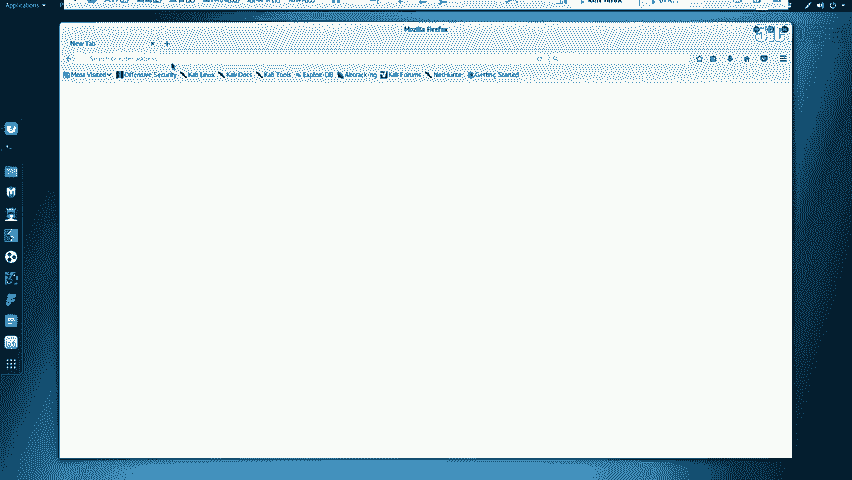

首先输入对应的IP地址。点253。13。

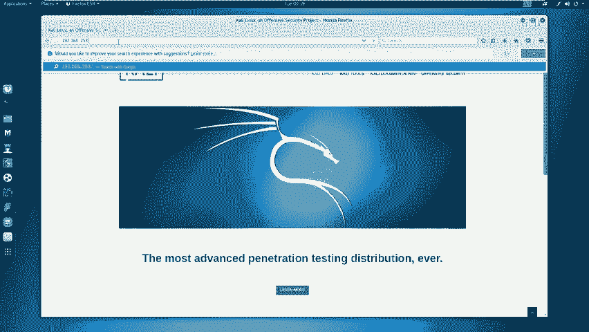

罗静的PPP回撤。呃，咱们这里多树立一个点。

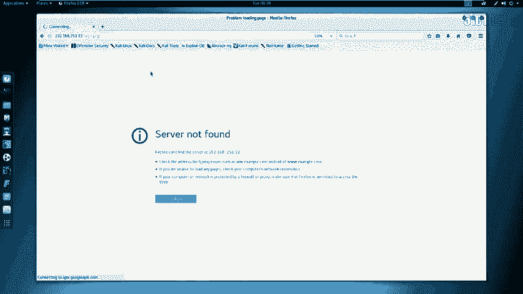

哎，咱们这个正在打开。咱们在哎进行深入分析之后，哎，挖掘到了哎很多这个有可能会被利用的信息。咱们这些哎可能利用的信息。究竟是如何发现呢呢？首先哎咱们会想到哎这样一些个结果。

比如说登录界面是否存在srcle注入，咱们直接可以通过srQ注入。来进入系统，然后在系统的后台当中发现更多的安全弱点。其次呢也可以看一看是否有敏感信息泄露。比如说咱们刚才看到的confidPHP。

是否可以直接访问发现。很多敏感信息呢。第三呢，也要查看一下当前这个web站点是否是使用了已知的CMS等框架所搭建的这些框架是否有已知漏洞，可以直接利用获取。外b应用程序的最高权限。

再然后呢也要注意一下备份文件。备份文件往往。有很多值得咱们利用的地方，比如说里边有对应的配置文件以及其他PHP文件，可利用代码审计分析出程序运行的状态，在状态当中寻找对应的弱点。当然。

哎咱们在这个实际当中以及CTF比赛当中，一定要对每个文件和每个目录都要有敏锐的。观察力。发现内部可以利用的信息。尤其是CTF。大家一定要哎具有很大的脑洞。

下面我们来看一下是否打开。这里啊我们打开了这样一个界面，打开界面之后，我们就需要对它进行对应的测试。对它首先这是一个登录界面。哎，我们可以尝试一下是否有若口令。我们登录一下。我们发现哎，并不能登录。

这时候哎我们就来想想如何来。

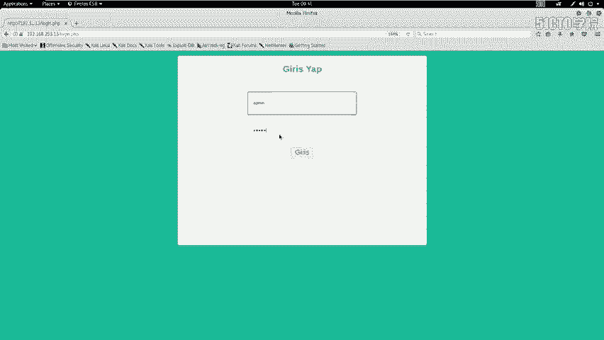

绕果他这种登录的机制呢。我们进行下一步绕过登录认证机制。首先呢咱们可以查看一下页面源代码是否哎有咱们想要利用的一些信息。之后再利用BUIRP来进行发的测试。测试一下这个页面是否可以被我们绕过。

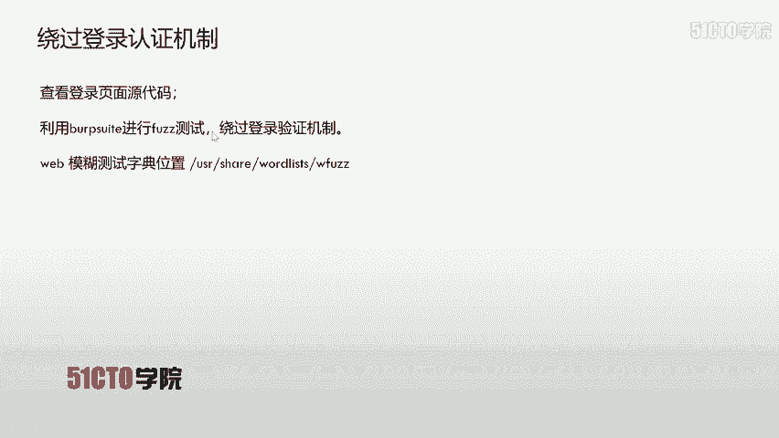

接下来我们就来查看一下源代码。

右键查看一下源代码。源代码当中，大家一定要注意它的注释文件。你向下看，没有注释。在这里。我们看到了一个javascript的代码，并且写在最下边。大家也需要值得注意。

这时候我们就来分析一下这个GS代码的作用。首先呢它定义了函数，并且获得了这个user的值。也就是在这里，user是我们的用户名，用户名的值被赋值给javascript这个代码当中的user变量。

并且把PW点well，也就是这个PWD哎，这个表单中中的密码给它复制给。GS代码当中的。PWD变量。之后声明一个字符串。字符串等于咱们用户名。的子句，也就是子字符串。从。user也就这个用户名。

最后一个出现and符号加一开始，然后一直到这个user的结束。也就是从我们这个用户名当中最后一个哎这个艾符号之后的所有内容都被复制给STR这个变量。这时候哎咱们看一下它下面的语句，这是一个选择结构。

如果PWD。如果等于单引号，那么就弹出黑客攻击。如果哎PWD哎不是这个单引号。并且哎这个STR不等于哎这样一个字符串。那么就哎弹出一个哎这样一个对话框。最后呢，这些上面的都不满足，那么就开始登录。

对于哎很多有经验的哎以及。做过很多测试的啊这个。渗透测试者和这个CTF哎学习者会发现密码如果还存在单引号，就弹出了黑客进攻。那么这时候我们直接会想到，有可能这个密码这里是存在srcle注入的。

并且哎他这个用户名它是要以BTRt点com结尾的。那么咱们这时候哎就来测试一下。咱们这个密码是否可以通过sQ输入绕过呢？对它进行一个发的测试。

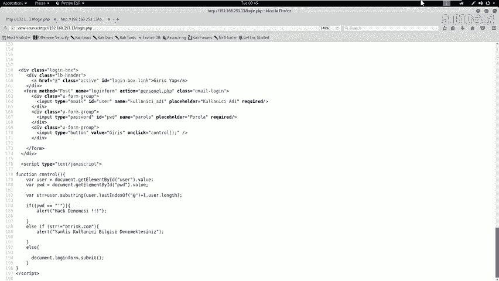

咱们发德测试哎，是什么一个情况呢？发德测试就是通过不断的尝试。正确和错误的结果。那么这时候啊这个服务器会给咱们返回不同的结果。在不同结果当中，咱们寻找。这个不同的哎字节程度，对字节程度进行分析。

分析之后得出哎，我们可以利用的地方。比如说咱们今天所使用的BOIRP哎当中的音出的模块，根据音出的模块当中返回长度不同，区分不同的这个响应。当然大家也可以这样想。

咱们在登录哎一个系统或一个web应用的时候。如果说咱们登录成功，哎，返回来一个页面，那么咱们登录失败，肯定是返回另一个页面。那么咱们返回页面的这个字节数。都是不同的。

所以说哎通过这一点就可以判断咱们是否登录成功。下面咱们就来尝试一下这个发热测试。

嗯。这里点击最小化。咱们打开啊一个book。这样一个程序。呃，点击close next。start up哎，对它开启。这时候哎咱们开启了这样一个程序。

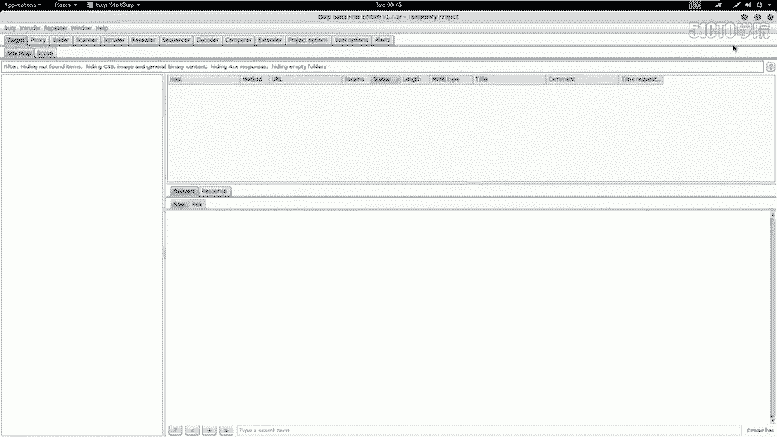

然后咱们把这个源代码关掉，哎，源代码继续打开。

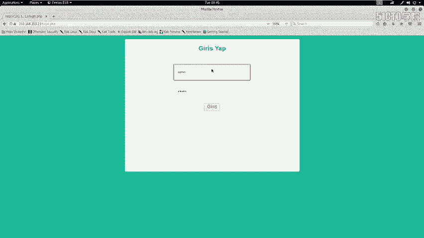

咱们因为哎一会需要使用到哎这个。BT risk点com这样一个字符串。

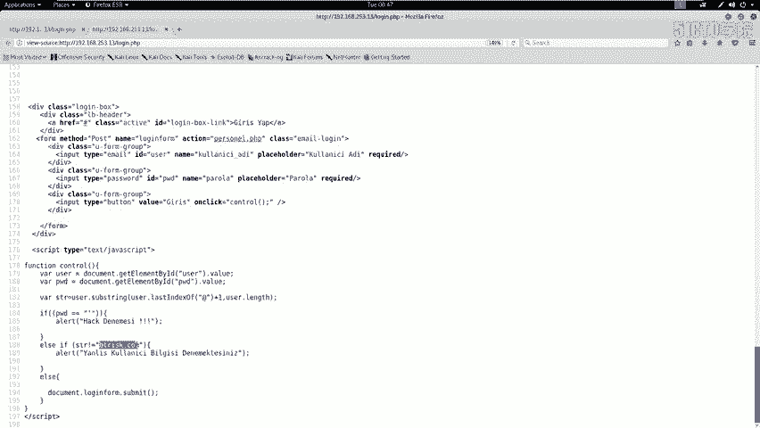

接下来呢哎咱们就需要寻找一个发的测试字典。很多这个初次学习啊，或者是。没有很多经验的这个测试者很难找到这个合适的发的字典。那么咱们这里就来推荐一下卡利当中的啊测试机字典。

它是在CDU上shall word list。然后咱就发。LS会看到有很多这样不同类型的测试。的数据可以进行方案测试。咱们今天用到的是circle测试数据。

首先把这个srcle点TST哎 copypy到桌面，复制到桌面。circle点TST之后是root desktop。Circle点TH回撤LS。CD哎切换到桌面。

会发现在咱们桌面就有个circle点TST。那么咱们这时候哎就对这个user name哎进行一个发个测试。首先哎咱们打开这个代理。

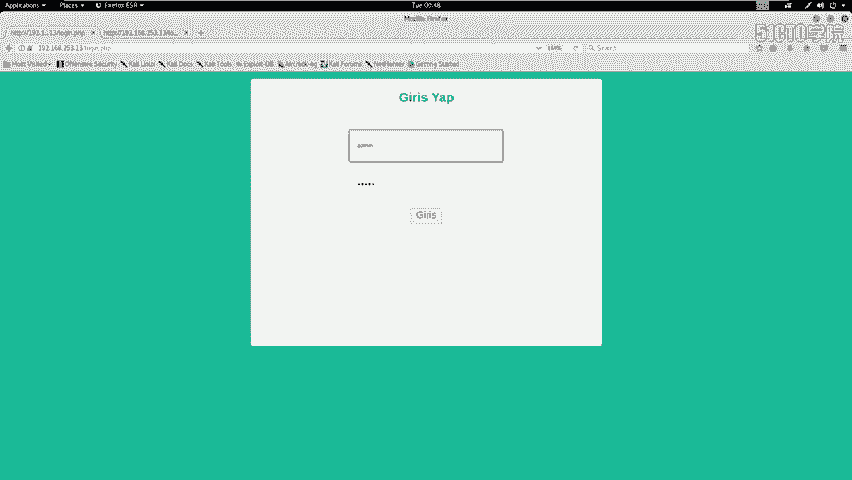

在这里呃点击network setting。

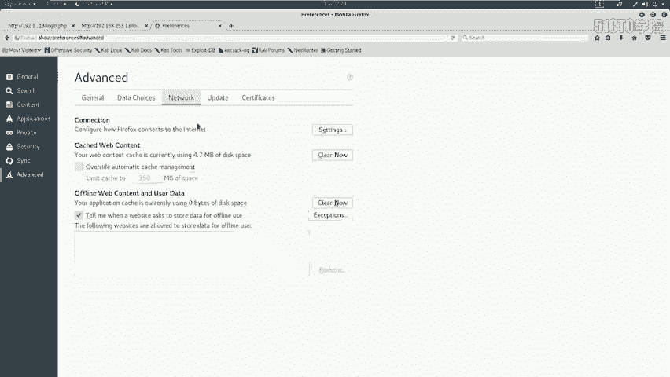

之后开启代理，点击OK。

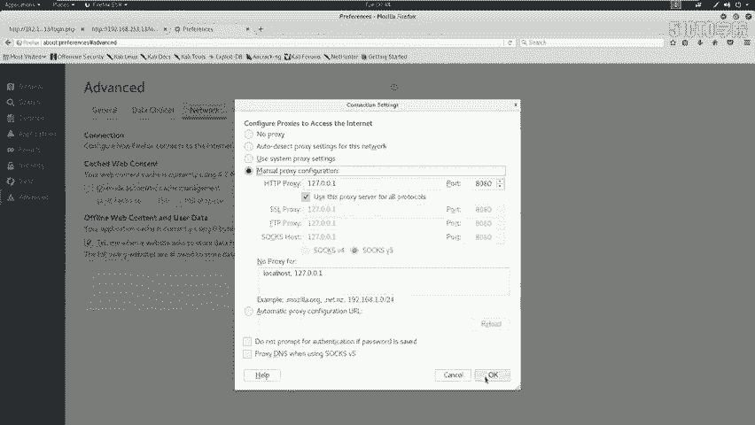

然后把这个。回到登录界面，咱们这里来给它输入。

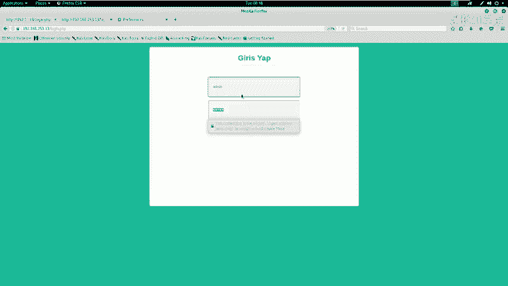

咱们想要的这个用户名。BT。rissk然后加一个at符号。可py。

然后加一个at符号，加BTcom之后，哎咱们输入123456。咱们这时候哎看看。

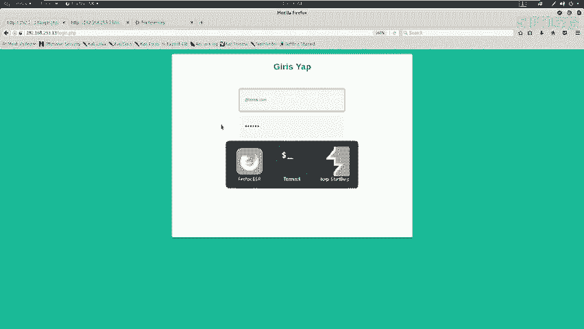

book是否给咱们开启代理啊，这里已经开启。那么咱们这时候啊只需要点击登录。哎，咱们这个数据包就被发送到BUIP当中。这时候啊大家看到这样一个数据包。可以看到这是咱们输入的用户名，这是咱们输入的密码。

点击action repeatpe对它进行测试。呃，点击。应出的模块啊，咱们再应出的进行一个发射测试。咱们在这里测试的是。这个。他是 what。咱们就把所有的变量去掉，在这里双击，然后点击and变量。

那么咱这时。这个password就相当于一个变量，可以被咱们替换。payload哎，咱们选择对应的这个circle file。在这个都选完之后，咱们点击上面的音出的哎，开始测试啊，点击OK。

这时候哎咱们就开始进行了个发热测试。咱们可以看到哎这个。不断的哎有这个数据报发出，哎，并且回报。回包当中哎这有个lesss来表示数据包的长度。在这里哎，咱们会看到不同数据包。

首先哎第一个数据包是一个哎没有发送任何信息的这样一个数据包。咱们可以想象，如果没有密码。肯定哎是不能登录正确的。那么接下来这个2044哎，这这些数据包都是不正确的。还有1个2203。

我们之前啊在代码审计的时候会发现，如果密码是一个单引号，那么就会弹出黑客攻击了，那么它也是不正确的。所以说这时候我们已经排除了哎两个这个长度类型，也就是2044和2203。除了哎这两个数据包之外。

我们还有1个2900。并没有哎，我们刚才尝试的内容。那么下面我们就来在浏览器当中查看一下是否哎这个2900是我们想要的结果。我们可以先点击report。呃，点击哎。认的。

会发现readow当中哎有这样一个界面。这里并且有一个上传的界面。可以想象到，哎，这里是可以上传一些文件的。那么咱们这时候哎就来浏览器当中哎查看一下这样一个界面。首先我们点击copy哎，然后把这个。

关掉，然后把这个。截段给它关掉。之后哎我们把刚才copy的这个目录。给他粘贴进来。之后哎登录哎，可以看到。这里返回来这样一个界面。

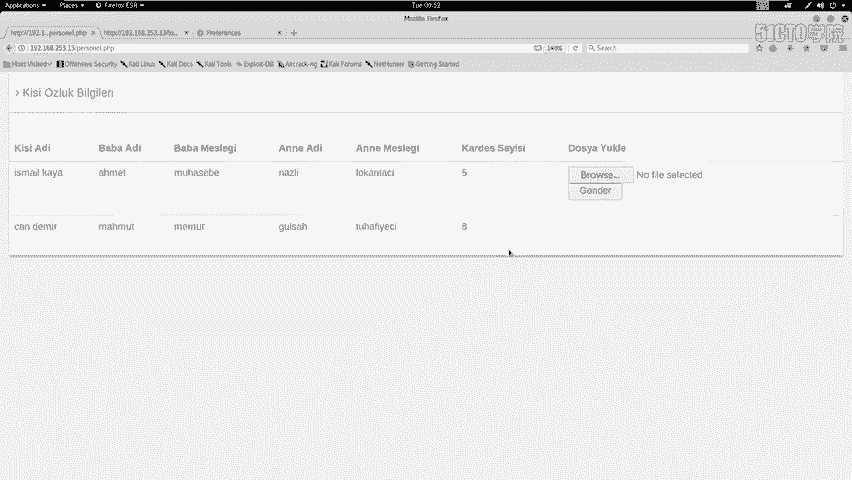

会发现哎，他是具有。这个上传功能的让咱们选择一个文件。那么咱们这时候哎就在桌面新建哎两个文件。

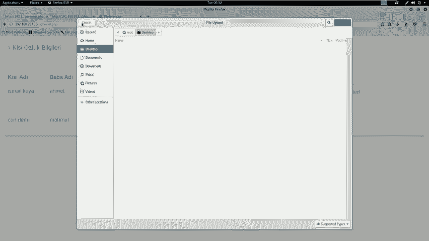

来上传。一般情况下，哎，大家可以知道上传是让咱们上传了一些这个图片或者是。这个其他文件。咱们更多的想上传的是PP文件。回去了。这时候哎咱们来上传一下。点击不用来之后。把这个图片先上传啊。

这个图片是可以上传成功的。

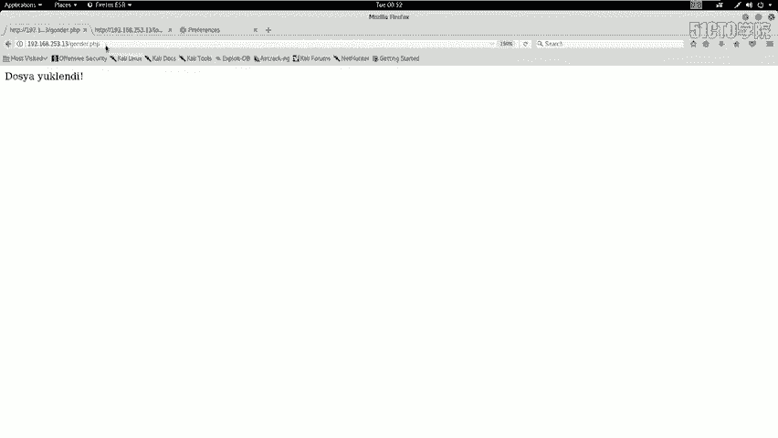

那么咱们接下来上传一个这个PHP文件。

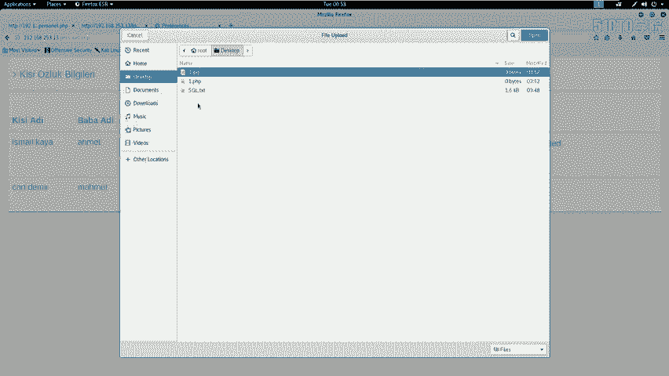

这的哎，他并不能上传。

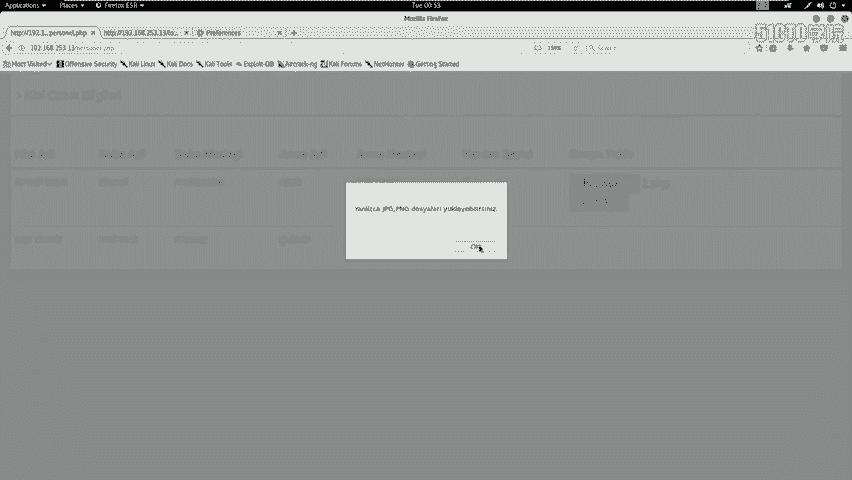

发现哎这个应用哎只能上传。PHP啊这个GPG呃图片文件并不能上传咱们PHP文件。那么咱们如何来绕过这样一个。机制呢如何绕过这个上传检测机制呢？咱们下节课来对这个上传机制来进行对应的绕过。咱们这节。

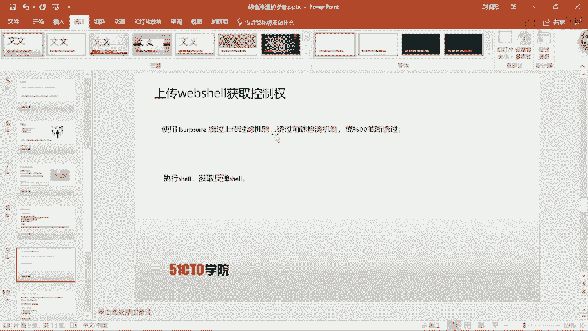

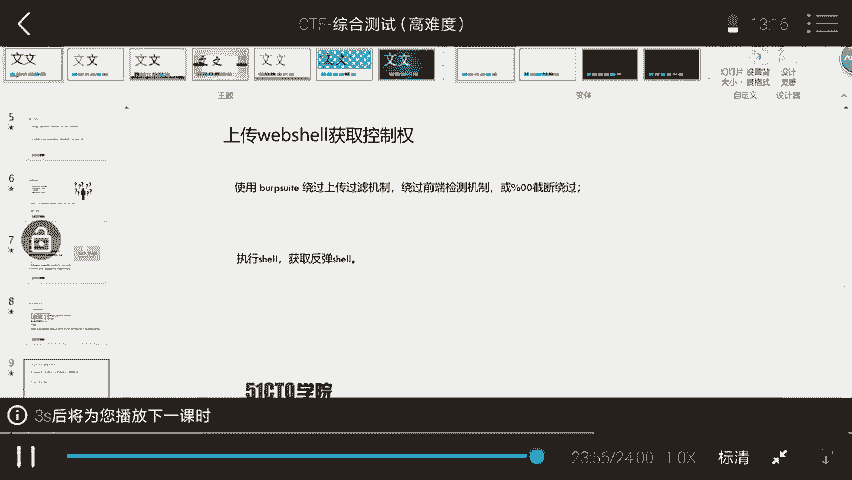