# CTF夺旗全套视频教程-网络安全 - P3：3.CTF-SSH私钥泄露 - YiWorld-奕 - BV1FN411U7Cv

大家好，我们今天来学习一下CTF训练当中的SSH是要泄露的问题。我们并且通过这个泄露的私钥，哎，最终从靶场主机的外部进入到靶场主机，并且哎最终得到靶场主机的root权限。

在靶场主机上哎取得对应的flag。在课前呢哎我们先介绍一下CTF比赛当中的哎比赛环境。首先，比赛环境哎大致分为两种。第一种哎是给予在同一局域网中的攻击机和靶场机器。通过web方式来访问公积机。

通过哎公积机来测试靶厂机器。最终获得对应的flag值。在这里特别给大家强调一点。一般情况下给予的哎这个公积机是卡利linux。并且哎咱们个人是不需要携带任何电脑的。

举办方会给我们提供哎一切哎这个电子设备。比如说咱们需要用到的计算机。第二种哎，这个方式就是给予一个网线接口。这里哎咱们参赛选手哎，用户需要自备工具，包括个人的PC以及各种比赛过程当中需要使用的工具。

当然哎，在整个工作程当中，咱们选手的笔记本哎，或者是个人的其他PC了，电子设备是可以接入到互联网当中查询对应资料。当然啊咱们最终目的也是进行哎这个渗透靶场机器。而咱们这个把厂机启的IP地址。

这个举办方会给予我们，我们直接使用哎自己的公击机来攻击靶场机器，哎，取得对应的权限，获取对应的flash值。以上哎就是CTF比赛当中比较常见的两种比赛环境。下面哎我们看一下今天课程的实验环境。

首先呢哎我们的卡利linux啊打IP地址是192。168。253。12靶场机器的IP地址是192。168。253。10。我们想一想，我们拿到这样一个实验环境，我们该怎么做呢？

首先啊无论参加任何CTF比赛，在靶场攻击的过程当中，我们一定要抱有一种目的性。就是获取爬场机器的上的flag值。然后哎提交上去获取对应的分值。首先第一步哎，我们需要进行一个信息探测。

举办方给我我们IP地址之后。我们需要哎对这个IP地址进行对应的扫描测试，探测这个靶场机器上开放的服务。其实呢哎在咱们日常工作当中，渗透测试哎其实是对靶场机器上的服务进行漏洞探测。

然后再进行对应的数据包发送。通过构造机型数据包来取得异常的回应。这时候哎，通过这种异常来获取机器上的最高权限。接下来哎咱们就使用公击机来探测一下靶场机器的哎这个服务信息。这里我们使用M map加杠SV。

也就是探测服务信息，然后加上靶场的IP地址。

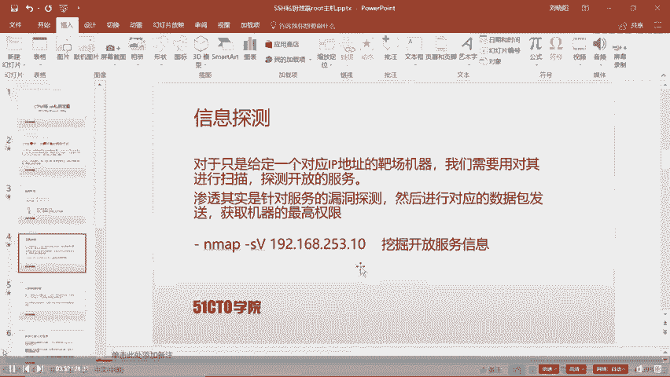

下面我们回到卡利linux进行探测。首先呢，N map杠SV192。168点。

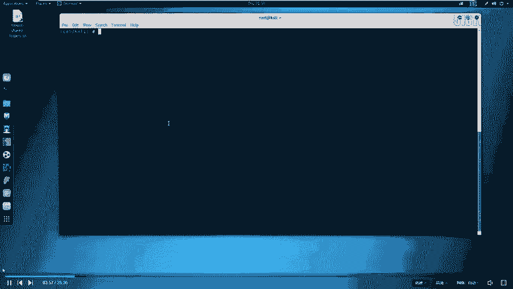

253。10回撤。这时候哎我们把场机器。就被我们这卡利inux正在探测。

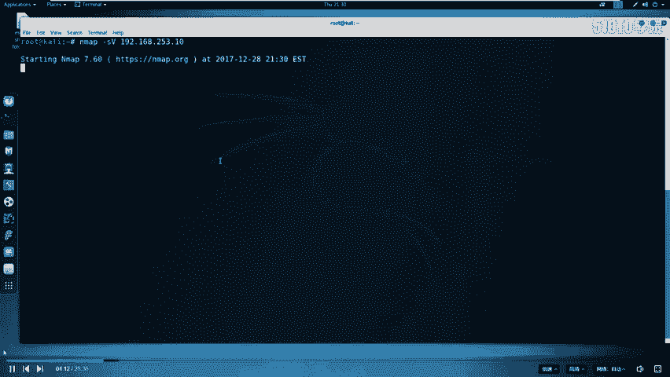

探测还是比较快的。这里我们看到哎他开放了啊一些。这个服务哎，比如说SSH服务哎，以及HTTP服务开放了2个HTTP服务。这时候我们探测完毕，在探测结束之后，哎，我们需要对探测结果进行分析。

这里啊我们提前给大家说一个知识点。就是每一个哎服务对应计算机的一个端口。我们在计算机当中，哎，可以说是有很多服务的。我们计算机实现资源共享和信息通信，是通过每个服务来进行的。

而计算机上多个服务哎都对应着不同的端口。通过不同端口之间的通信，实现一台计算机上可以拥有多个服务。那么常用的端口有0到1023。这些端口已经被化为已知的啊一些个服务。

其实还有很多其他类型的这个服务使用的并不是这里的端口。比如说3306mys数据库的。端口号。我们通过哎这个扫描可以查看这个扫描结果当中是否具有特殊的端口。然后针对哎这个特殊的端口进行哎更进一步的探测。

尤其哎对于咱们今天这个靶场环境来说，开放大端口的HTTP服部进行一个深入的哎测试排查。首先哎我们要探测大端口的信息。怎么探测呢？对于HTTP服务，我们可以使用浏览器来浏览对应的信息。

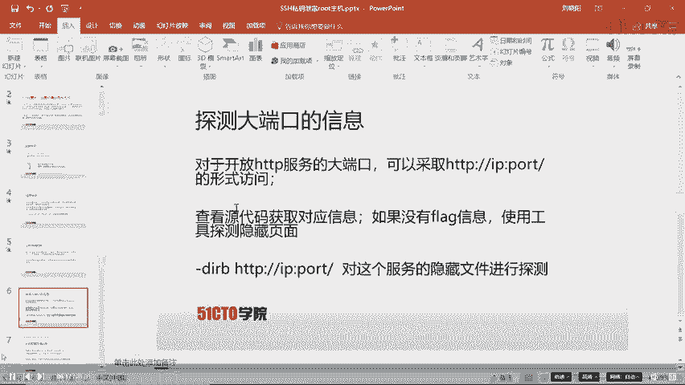

下面我们回到公积机当中。打开浏览器。copy。我们的大端口号是31337。

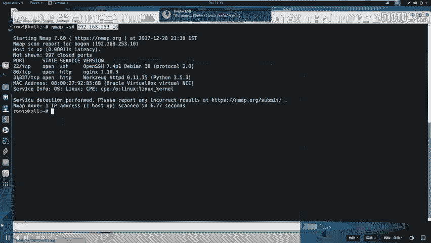

我们打开浏览器。加冒号31337回撤。我们会看到哎，他返回了对应的界面。

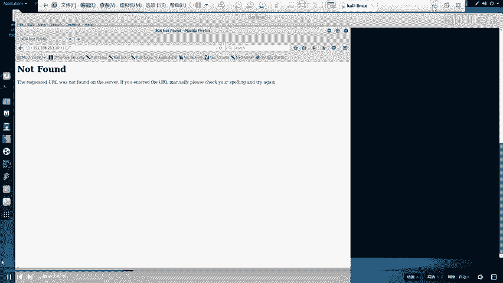

返回对应界面之后，我们并没有看到哎任何我们想要的这个flag值。这时候我们就需要更进一步的探测。首先。

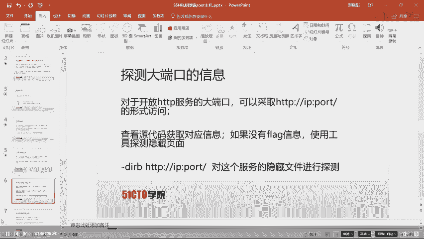

我们在CTF当中，信息很大一部分是引才在。HTM语源代码当中。这时候哎我们对于今天的这8场，我们也探测一下它的源代码具体是什么内容。右键。查看。页面源代码。这里我们就查看了页面的源代码。

但是页面源代码也没有暴露任何我们想要的信息。这时候我们需要哎执行下一步操作。

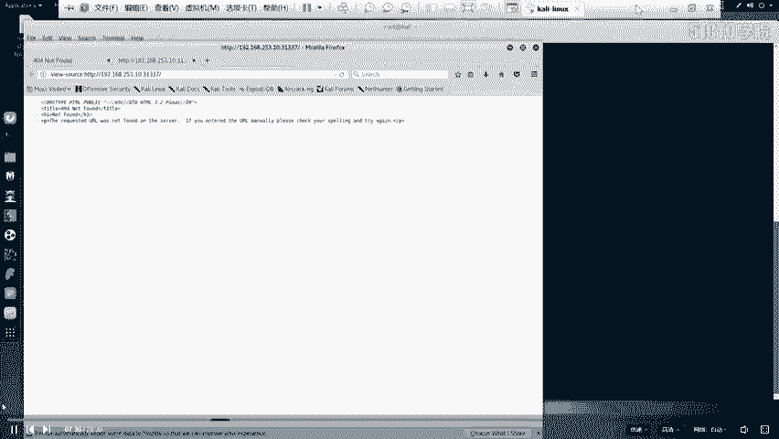

因为我们查看源言代码没有获得flag信息，就需要探测下这个。服务下是否还有其他隐藏的文件呢？对于探测隐藏文件，我们使用到另外一种工具。DIRB来探测。

加上HTTP冒号双斜杠IP然后冒号端口号斜杠来对这个服务的隐藏文件进行探测。我们回到公击机当中。DRIB。HTTP。192。168点。253。10。31337。然后点击回撤。

这时候哎我们这个工具会对我们当前这个服务哎进行对应的探测。是。可以看到哎，我们这时候探测完毕。这里哎我们有5个探测结果。我们可以看到这5个探测结构当中。我们发现两个探测结果哎比较醒目。

比如说SSH以及robots的TST。首先啊我们签。对他一个进行深入分析。分析一下我们如何来挖掘。

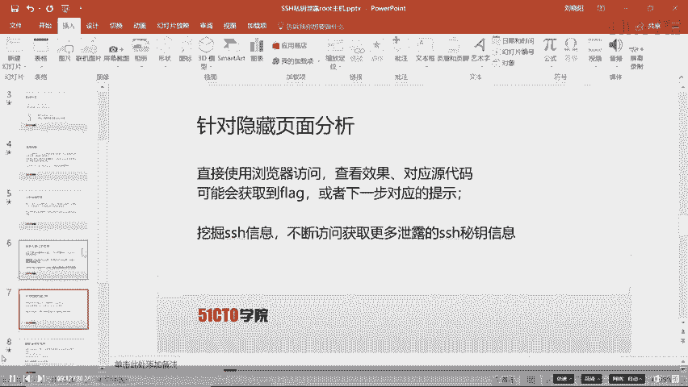

这里给大家介绍一下robots点TST的作用。我们搜索引擎在探索一个网站页面时候，首先会探索网站页面下的跟目录下的robots点TST。robots点TST文件当中存放着哎。

这个不允许搜索引擎所探测文件名。以及允许被探测的文件名。下面哎我们打开这个robots点TST。通过哎，这里。右键。open link使用浏览器打开。这时候我们就会发现。我们这里。

不允许探测点base点RC以及点profile这个文件，以及不允许探测。TAXEX文件。这时候哎我们就发现了一个敏感文件。TAXES文件。我们在浏览器当中浏览TAXES回撤。

我们在浏览同事忽然发现啊眼前一亮，发现了一个flag值。哎，这就是我们找到的第一个flag值。在进行完哎这样探测之后，我们发现robots哎已经没有任何哎利用价值。我们已经找到了对应的de一fl。

这时候我们向上看看到了点SSH哎这样一个文件。那我们哎也同样的方法来对它进行打开操作，来查看对应内容。在打开之后，我们会发现哎这些这样一些信息。对于这样一些信息，我们也要进入行深入的探测。

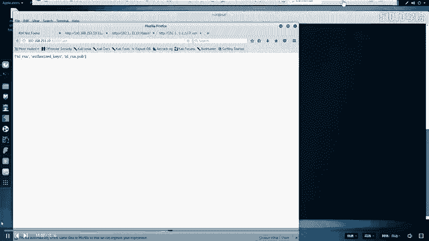

这时候呢哎我们就开始探测。在这里哎给大家说一点SSH的作用。SSH的作用哎，就是可以使远程计算机通过SSHH客户端登录到这个我们本地服务器的SSH服务上，然后实现远程计算机对服务器的远程操作。

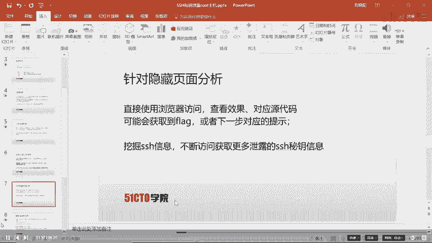

对于SSH的认证方式是这样的。首先呢我们要有1个IDRRSA这样一个私钥。之后与服务器上IDRSA点PUB这公样进行对比。这样一种。

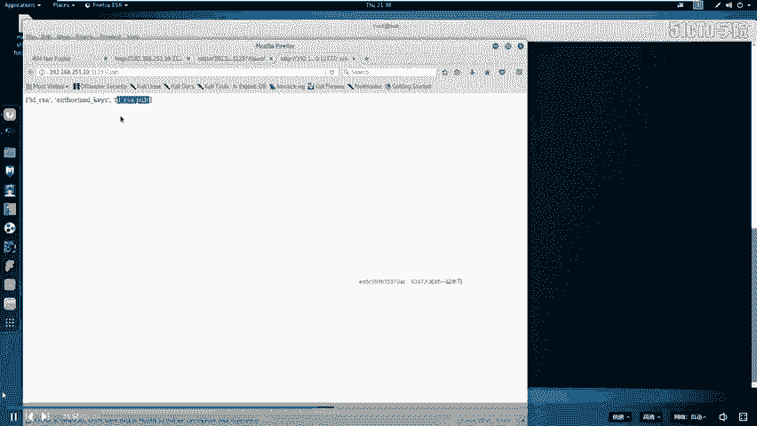

加解密操作。