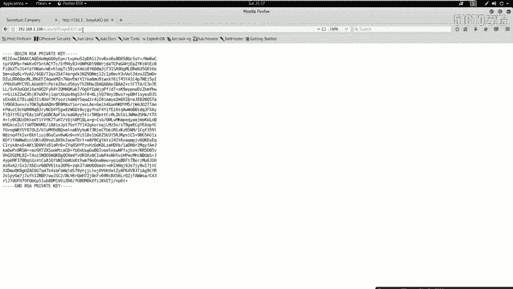
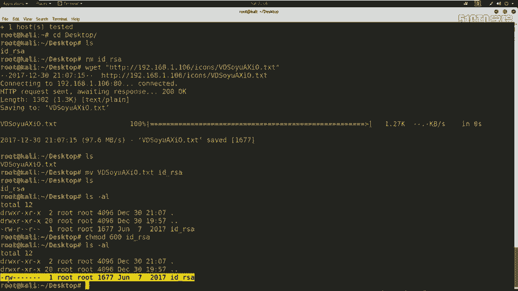
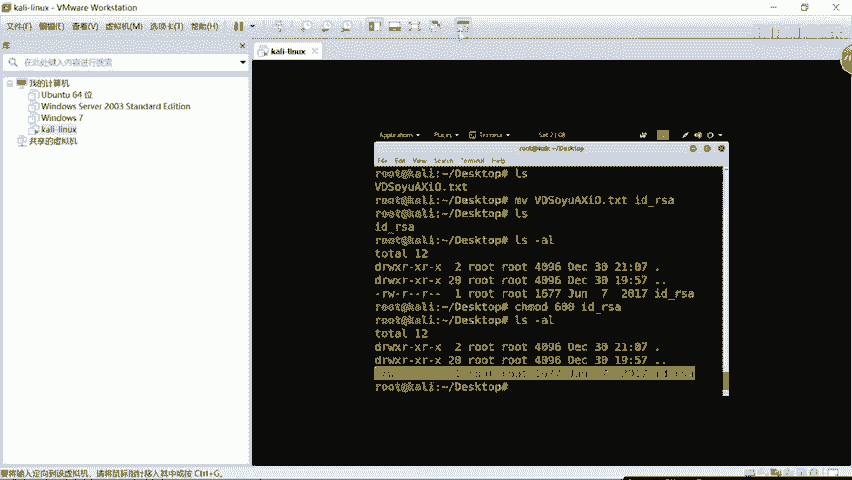
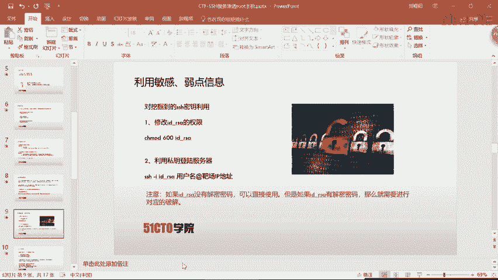
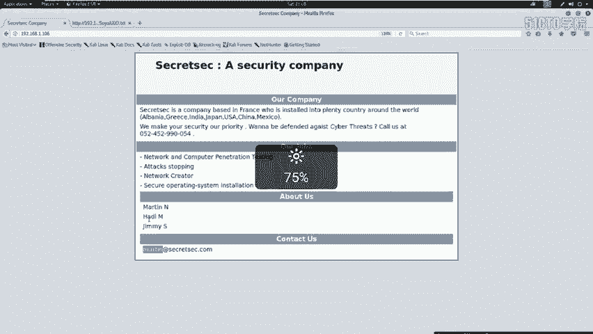
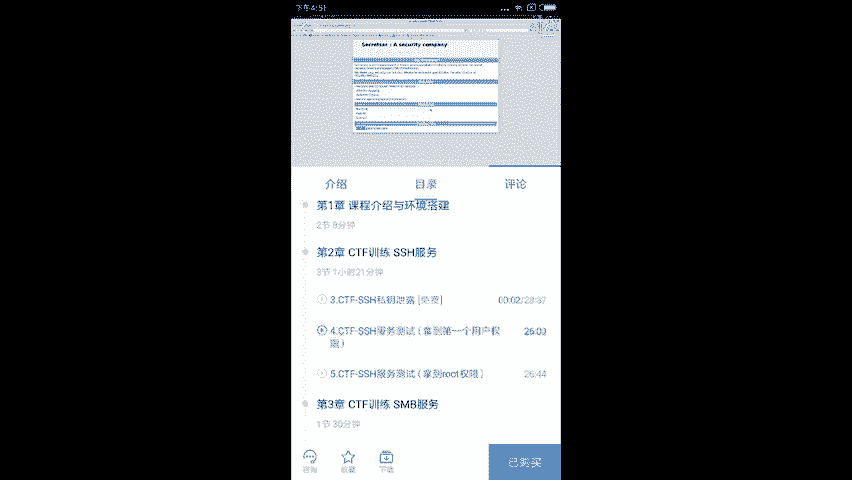
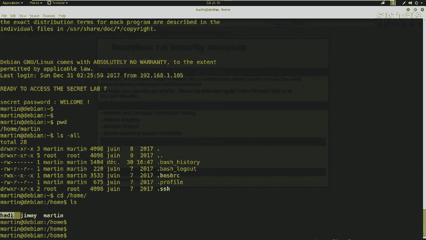
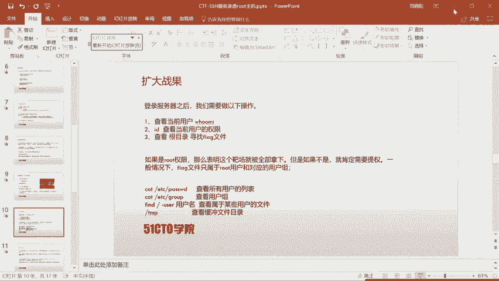
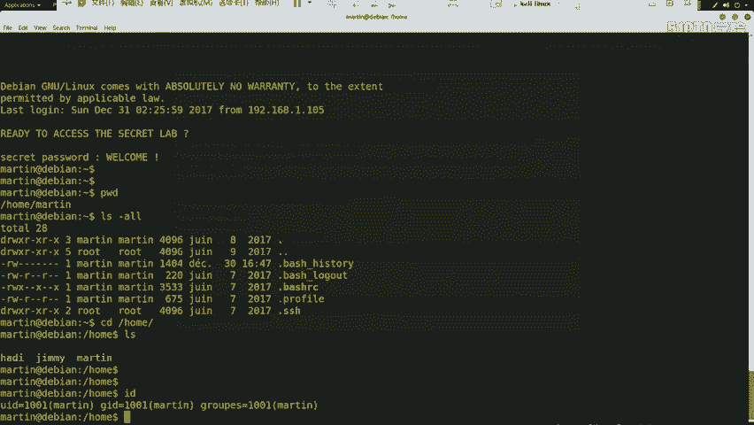
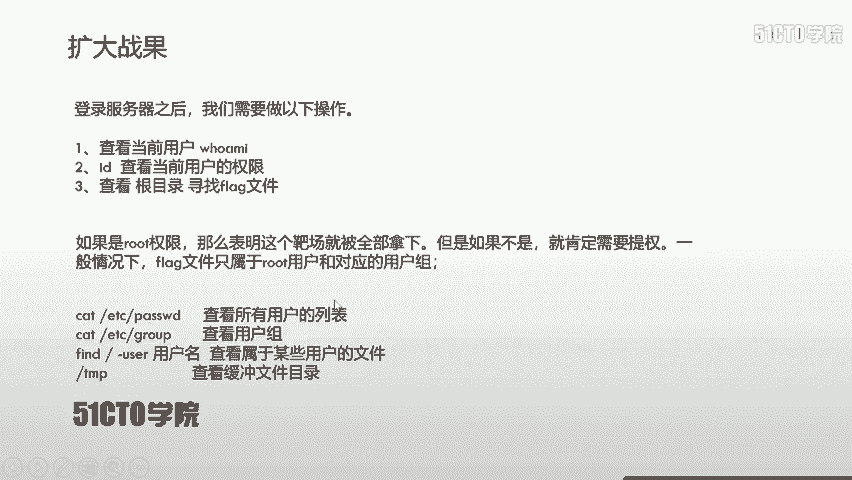

# CTF夺旗全套视频教程-网络安全 - P4：4.CTF夺旗-SSH服务渗透(拿到第一个用户权限) - YiWorld-奕 - BV1FN411U7Cv

SSH服务的渗透测试哎以及他的测试。来最终挖掘对应的弱点信息。哎，从主机外部哎进入到我们对应的靶场机器。最终获得对应的root权限。并取得对应的fllanage。首先呢哎我们介绍一下SSH协议。

SSS协议哎是circle cell的缩写，是由哎这样一个网络小组所制定的。他的目标哎是建立。在运营基础上的安全协议。目前，SSH哎广泛运用于哎远程登录哎这样一个操作。提供安全性的协议。当然，哎。

这个安全是因为SSA协议哎对咱们哎用户名和密码以及发送到远程服务器的信息都经过对应加密。所以说哎在一定程度上避免了哎信息泄露这样一个问题。当然，SSA协议哎最初是linux上的一个程序。

后来因为功能强大，哎，又被移植到其他的平台上边。在windows哎以及各种发行版本linux哎，都具有哎这个运行SHH的唉支持。这里给大家说一下这个SSH的端口号，它是基于TCP22端口的这样一个服务。

下面我们来介绍一下SS协议的认证机制。首先哎是基于口令的安全验证。只要你知道自己的账户和对应的密码，就可以使用SHH客户端来登录到远程哎这个开放SH服务的主机。在这个过程当中，哎。

你所发送的哎这个用户名和密码以及所有的数据都是被进行加密的。所以说哎从一定程度上避免了哎中间人攻击，哎，来嗅探你的用户名和密码以及对应的操作。当然，哎，这种验证机制，哎。

并不能避免哎这个别的服务器冒充你的服务器这样一种中间人攻击的方式。除此之外，哎，这个还具有密钥的这样一个安全验证。他是需要依靠密钥的。首先你需要自己去创建哎一对密钥，并且啊把这个公开。

也就是公用密钥放在你需要访问的夫器上。通过哎你自己的私钥来和远程服务器的公钥进行比较。如果哎比较匹配了，那么就登录服务器，哎，获取对应权限。如果说哎不匹配，那么就登录失败。这里哎给大家强调一点。

大部分这个CTF比赛当中，以ID下划线RSA来命名为你的私钥。而ID下划线RSA点PUB哎，这是你的公钥。当然这也是我们使用密钥生成工具唉生成密钥的命名规则。希望哎这里大家一定要注意。

以上我们已经对SS协议哎认证机制有了初步认识。下面我们来看一看这两种认证机制具有哪些安全弱点。首先是基于口令的安全验证。基于口令和密码的安全验证，肯定是逃不脱而暴力破解这样一种攻击方式的。

如果说哎我们对应的用户名具有弱口令。那么哎我们通过对应的安全工具，可以对密码进行很快速的破解。之后我们通过SSH客户端连接到SHH服务器。实现对服务器的啊一定控制。给大家强调一点。

就是通过这样方式哎获取服取权限，不一定直接获取到root权限。如果不是，我们可能需要来进行进一步提升权限，直到提升到root为。为止。我们下面哎再来看一下基于密钥的安全验证。首先啊我们需要推工过哎。

对主机。进行大量的信息收集。如果说我们可以获取到泄露的用户名和该用户名对应的密钥，那我们就可以使用。该用户名和密钥进行。远程登录。当然在这个过程中，哎，我们可能是不需要哎这个用户的对应的密码的。

只是哎我们通过密钥来登录。我们这样一个过程。是这样完成的。首先我们需要哎修改这个密钥，也就是这个我们用户名的私钥的权限，修改为可读。和谐哎，这样一个权限使用600来表示。

之后我们使用SSH这个客户端软件。加上一个参数杠I，然后它的私钥文件，然后该私钥对应的用户名，然后按符号，哎加上主机地址来登录服务器。同样，我们通过此方式登录服务器获得权限，也不一定哎就是root权限。

如果不是root，啊我们可能需要进一步提升权限，直到提升到root权限为止。下面呢哎我们介绍一下今天这个CTF的实验环境。首先啊我们的公积机是卡利，哎，他的IP地址是192。168。1。105。

靶场机器是linux的机器，是192。168。1。106。我们现在知道哎，这样两台机器之后。我想问一下大家，我们该做什么呢？可能哎这句话问的哎，大家都若有所思。但是哎我给大家强调一点。

就是哎咱们在做CTF哎比赛当中，哎攻击他的靶场的时候，我们一定要注意一点就是它的目的性。我们一定要注意到，我们是要获取靶场机器上的flag值。提升root权限。我们通过这样的操作。

以及这样的目的来执行所有的操作。哎，那么你这个有目的性的进行对应的操作，哎，就更有可能哎快速的拿下靶场机器哎取得对应的flag值。首先哎我们需要进行第一步，也就是信息探测。

这里哎对应给定IP地址的靶场机器，哎，对其进行渗透。啊，我们首先要考虑哎靶场开放的服务。这里我们使用M map哎对靶场进行信息探测。首先呢哎我们需要探测一下靶场开放的服务及该服务的版本。

使用M map杠SV加上靶场IP地址。之后也可以使用哎这个另外一条命令探索靶场的全部信息。N map杠A杠V，然后靶场IP地址。通过这些以上的信息收集，哎，很有可能已经收集到靶场的这个完整的一些信息。

当然我们也可以使用M map杠O靶场IP地址哎来探测一下靶场所使用的操作系统类型以及对应的版本号。接下来我们就来。对该靶场进行一个信息探测。这里我使用到卡利linux。我这里。打开。我这里。

首先我打开一个终端open。接下来我调整一下字体。呃，这里color我把它调整为。黄色的这样比较看的舒服。首先呢我使用M map来探测一下该靶场开放的服务。106不撤哎，这个过程Mm会发送大量数据包。

哎，到我们该靶场上，该靶场会返回我们很多信息。通过这样的信息，我们来探测开放的服务。首先我们可以看到开放了22号端口SSA服务以及它对应的版本号以及协议的版本12。0这样一个协议。

我们有看到80端口HTTP服以及它使用的这个呃中间键阿帕奇的版本号2。4。10。又开放了111端口。哎，这样一些信息。我们在使用M map。杠A。港位。192。168。1。

106不撤探测一下该靶场的全部信息。呃，这个速度还是比较快的，因为我们是。自己搭建的哎这个直连的方式，我们可以看到啊他有很多信息。之后我们再使用M map。讲大欧。对应待批地址。

探测一下哎该靶场的操作系统版本。以及它的内核。数。我们这里哎对靶场进行了服务探测。接下来我们在。对收集到的信息要进行一个分析，分析处内部存在的一些矮敏感信息以及安全弱点。首先我给大家介绍一下。

我们对于SS服务22号端口的靶场，首先可以考虑两点。第一点，我们是否可以通过暴力破解来破解对应的用户名和密码，直接使用SSH客户端。通过破解的用户名和密码，远程登录到靶厂机器上，获得对应的权限。

那么第二点我们可以考虑到。该服务器是否存在次要泄露的问题？如果哎具有私钥泄露，那么们就可以通过对应私钥来登录对应的服务器，哎，然后获得对应的权限。这时候我们就需要考虑哎这个私钥当中是否有相应的密码。

对私钥进行了加密。如果进行了加密，我们就需要对私钥进行破解。破解出密码哎才可以进行登录。其次呢，我们还需要考虑到。是否可以找到该私钥的用户名？因为我们登录的情况下是必须要使用用户名的。

所以说必须要找到该私要的用户名。同时呃，对于开放HTTP服务哎80端口或者其他端口的靶场，我们也可以考虑哎以下两点。第一点是通过浏览器访问哎。对应的服务，然后获取哎内部的展示信息。第二点。

我们可以使用哎探测工具，探测HTT目录，哎，然后获取对应的敏感信息。这里给大家特别强调一点，就是我们要注意哎特殊端口，也就是大于1024端口。因为我们日常用到的。

常见端口是0到1023啊大于1024的哎，基本上是可以用户自行支配的这样一些端口。比如说哎我们经常看到的8080端口，哎，它有可能就是一个特别敏感端口。

我们可以通过哎浏览器访问一下它是否开放HTTP服务。接下来啊我们就对刚才的一些哎扫描结果哎进行挖掘。挖掘癌内部的敏感信息。首先呢啊我们使用浏览器哎对靶场哎这个HTTP服务来进行探测。

来探测内部是否具有我们可利用的一些信息。比如说哎我们SSH啊的用户名信息等等等等。首先呢哎我们回到卡利当中。我们使用哎火狐浏览器。在这里。我们输入我们可以看到哎，打开了这样一个页面。我们逐步来看。

首先哎这是一个公司介绍，以及他安全公司的这个名称。以及他的这个传真号。以及他们的这个职责。以及他们about us，哎about us，哎，这应该是一些人名。哎，有可能就是咱们需要找到的用户名。

这里啊又有一个邮箱，我们可以看到这里。他marttting跟上面这个marting是对应的。我们可以想象它。绝对哎是一个哎这样一个用户名，有可能就是咱们SSH。里边的一个用户名。通过这样挖掘之后，哎。

我们可以。挖掘到对应的用户名。这里啊我们就挖掘为止。接下来我们继续哎来挖掘信息。我们可以使用DRIB来扫描哎目录页面，哎，然后访问对应的目录页面，挖掘对应的信息。

尤其是对robots点TST按占一文件以及一些其他类型的目录。进行访问，看内部是否具有一些敏感信息。比如说对目录进行挖掘的时候，我们要查看里边是否具有一些奇形怪状命名的文件。如果有。

我们就需要对这个文件进行对应的分析。直到挖掘具备利用价值体系。尤其是对于开放SHH服务的靶场，大家务必要注意是否可以寻找到哎SSH私要信息。接下来哎我们就使用哎这个靶场，哎，这个攻击机对靶场进行探测。

DRIBHTTP。192。168。1。106。回车我们开始探测。我们这时候哎开始挖掘对应的信息。我们会发现。呃，接下来我们暂停了。会发现按men啊，这是一个参考的东西。哎。

这里可能并没有我们需要挖掘的信息。呃，我们继续看哎，这ics files啊已及向上看。首先呃我们挖掘到一个目录信息。挖掘这个目录信息啊，我们fis啊可能存在敏感信息。我们右键open link。哎。

打开这个链接。会发现哎他是这样一个目录。我们点击哎会发现它回到了我们之前的页面。哎，所以说它并没有任何利用价值。我们继续看下1个689L的一个目录信息，我们右键open link。

会发现它出现这样一个目录，在目录时候，我们逐条阅读啊，这是一个readme，哎，会发现它没有任何利用价值。这里有一个七形怪状的。文件我们打开。哎，这时候我们仔细阅读，会发现RSA。

这应该是咱们这这个SSH的资钥private key。这时候我们就挖掘到SSH的私钥信息。挖掘到私钥信息之后，我们需要把这个私钥信息哎给他进一步哎。利用啊利用起来这个私料信息来进行登录。

这时候啊我们探测到了啊一些敏感信息。并且挖掘到了次要信息。其实哎对于哎某些靶场也可以以使用n to哎这个扫描器来挖掘敏感信息。我们使用到nick two杠host，然后靶场IP地址。在挖掘敏感信息时候。

大家一定要特别注意config啊这样配置文件的敏感信息，以及它后边具有interesting file啊，以及各种fild这样一些文件。然后细读扫描结果，哎，有可能就能挖掘到一些敏感信息。

下面我们在攻击机当中来测试一下。使用I need to来挖掘一下对应的信息。neick。two杠host192。168。1。106回撤。这时候哎我们就那个图开始扫描。扫描结果也可以给我们返回。哎。

很多的这个目录啊，以及它这个robots哎，这个文件信息以及它的呃服务器版本。也就是中间键的版本。以及他允许的这个HTTP的这样一个方法。的类型可以允许optionsget hand post。

这里哎又给我们列举出来了一些这个参数。this might be interesting，也就是这个比较有有敏感信息。那我们刚才访问了，哎，并没有敏感信息。啊 menu正是我们这个服务器的参考手册，哎。

并没有任何利用价值。icical哎，这是我们刚才利用到的这个目录。以及他这些其他目录。当然，我们今天的靶场哎并没有哎直接一些这个config文件。

我们之后的靶场当中会遇到哎我们刚才说到这个config的敏感文件。我们在。挖掘到敏感信息之后，哎，我们就可以利用敏感或者弱点信息来进行哎这个靶场渗透。首先呢我们刚才挖掘到SHH私钥的信息。

我们就可以利用该私钥来远程登录到服务器上。首先呢我们介绍一下哎如何来操作呢？第一步，哎修改这个私钥的权限，称之modode600，然后私钥文件名之后，利用私钥来登录服务器SSH杠I。

然后加上这个私钥文件名，然后用户名，然后再艾符号靶厂的IP地址。当然这里需要特别注意一点，就是如果IDRSA没有解密密码，哎，大家可以直接使用。如果是有解密密码，我们就需要使用SS初状。

然后转换为状可以识别的文件，然后使用状哎进行解密，按这个私钥。最终哎使用私钥和对应的密码进行登录。这里我们以后的课程当中会涉及到。接下来我们就在卡例当中。来操作一下。如何使用私钥来登录哎对应的这个靶场？

首先我们切换到桌面。呃，方便大家操作。LS会发现哎，这里是我之前下载好的这个IDRSA哎，我把它删除掉。首先我需要下载一下。这个对应的私钥信息，我使用Wge。呃，冒号，然后HTTP。192。168。

1点。呃，我把它复制过来。呃，在这里。

复制。把这个删掉。然后是粘贴。回车。这时候我们就下载完了这个文件，我们LS一下，查看一下是否具有这样一个文件。我们下载完之后呃，我把它重命名一下。VD哎，为了方便我们跟我们之前的课件来对应ID杠RSA。

不撤LS这时候我们就把这个文件名从命名为IDRSA我们查看一下对应的权限。它并不是600这样一个权限啊应该是644这样一个权限。我们把它修改成600权限600IDIC回撤LS杠AL查看对应的权限。

这时候我们就把这个私要文件修改为哎对应的这个600权限。

大家可以看到，我们利用私钥登录的时候，是需要私钥的用户名的。这时候我们就会想到，在之前我们。收集HTTB信息的时候，发现了一个marin用户。

我们这里。在这里有个martin用户以及hing用户以及jime用户。我们下面就尝试一下，使用martin来登录下服务器。

首先SSH杠IIDSRCSL，然后是marin。然后是艾符号，然后是靶场IP。不错。哎，这时候我们就把私要发送过去，哎，开始登录这个服务器，这个过程可能比较缓慢。哎，我们来。え。嗯，哎。

这时候哎我们就登录到哎这个服务器当中。我们可以看到哎，martin哎正是我们该用户名。接下来我们PWD1下，查看一下是否哎当前的哎工作目录。L杠AL查看所有文件。哎，可以看到啊一些文件信息。

接下来我们切换到home目录。LS查看一下有哪些用户名。哎，这个呃比较慢，延迟有限。会发现哎有handingjimarin哎，这三个用户名跟我们之前收集的这样一些信息是类似的，哎，相似同的是。

handyjiim，martin哎，都是对应的用户名。这时候哎我们就需要哎扩大战果。也就是寻找分量值。首先呢哎咱们登录之后，哎可以做一下操作，哎，就是查看当前登录这个用户是否是我们SSH这个用户。

以及使用ID来查看当前用户的权限，是否是root权限。之后I可以切换到根目录，查看根目录下的flag文件。当然哎，这里如果我们登录的这个用户哎，具有root权限，那么表明这个靶场我们就已经全部拿下了。

如果不是哎，那就肯定需要提全。一般情况下，哎，这个flag文件只属于root用户和对应的用户组。以及可以进行哎对应的操作。我们下面来查看一下我们是否已经把拔草全部拿下。

这时候使用ID。不错。呃，这个是比较缓慢的。哎，因为咱们这个登录之后，哎，需要一个发送过程。我们可以看到，哎，他并不具有哎这个。root用户的权限，而只是一个普通用户。所以说我们需要进一步提全。

呃，那咱们哎就可以呃执行很多操作进行听全。

呃，咱们这节课就到这里。下节课给大家介绍如何提升权限。