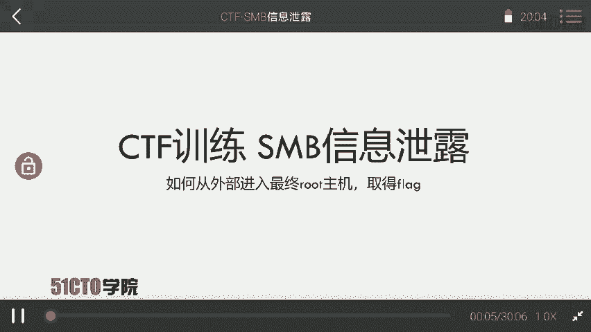
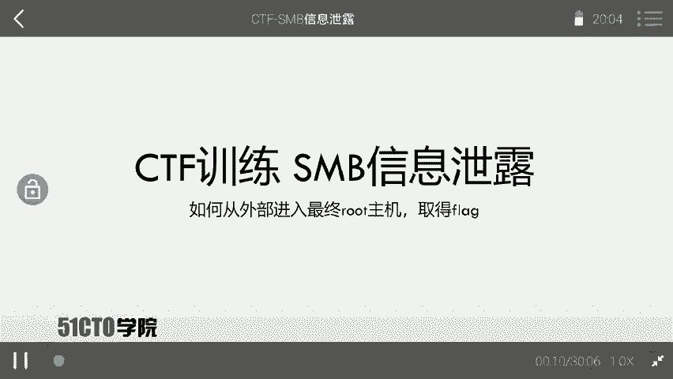
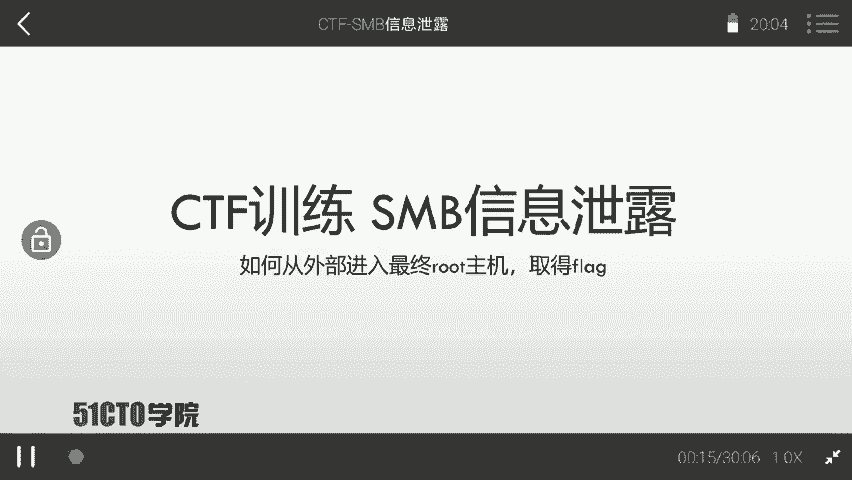
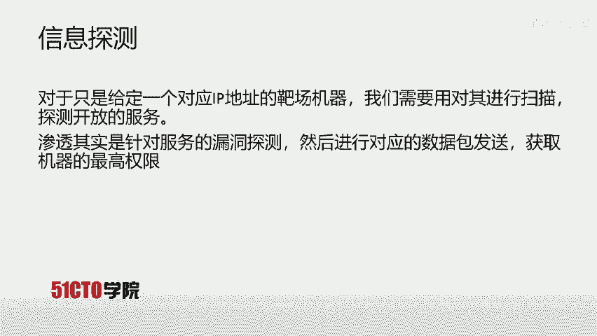

# CTF夺旗全套视频教程-网络安全 - P6：6.CTF夺旗-SMB信息泄露 - YiWorld-奕 - BV1FN411U7Cv

今天我们来学习SMB信息泄露哎最终通过SMB的新露信息获得主机的权限，最后提升主机的权限为root权限，取得对应的flag值。

那么咱们下面来介绍一下SMBSMB哎是servver message block的简写。它是呃一个通信协议，是由微软和英特啊，公司在1987年制定的呃一个网络协议，主要是作为微软网络的通信协议。后来呃。

linux移植了SMB协议，哎，并且改换名称为SAMBA。那么咱们MSMB协议呃是基于TCPnet BIOS下的，一般哎使用的端口号是139和445。咱们SMB哎协议是用来访问计算机资源的。

可以通过哎这个咱们分享对应的文件夹，打开SMB协议。远程计算机就可以通过该协议来下载对应的资源。也可以看到这里这张图哎，就表示咱们比如说有这样一个网络top扑。现在啊咱们这台计算机开放了SMB协议哎。

并且开放了对应的共享。那么咱们另一台机器就可以通过哎这个网络哎来连接这台计算机，最后下载这台机上的资源。下面咱们来介绍一下今天的实验环境。首先呃是公积机使用卡利linuxIP地址是192。168。

253。12。咱靶厂机器哎使用的是linux系统，并且它的IP地址是192。168。253。17。那么咱们拿到这样样一一个实验环境，该如何操作呢？首先哎咱们一定要想到。

咱们最终的目的是为了获取拔唱机器上flag值。也就是说，咱们要不择手段去获取拔唱权限，得到flag值。咱们拿到这样一个靶场IP之后，咱们首先第一步要进行对应的信息探测。

也就是哎对这个靶场机器进行对应的扫描，探测靶场机器上所开放的服务寻找。机器上的弱点。其实咱们渗透哎就是针对靶场机器上开放的服务进行漏洞探测，然后来发送对应的数据包，获取靶场机器的最高权限。

