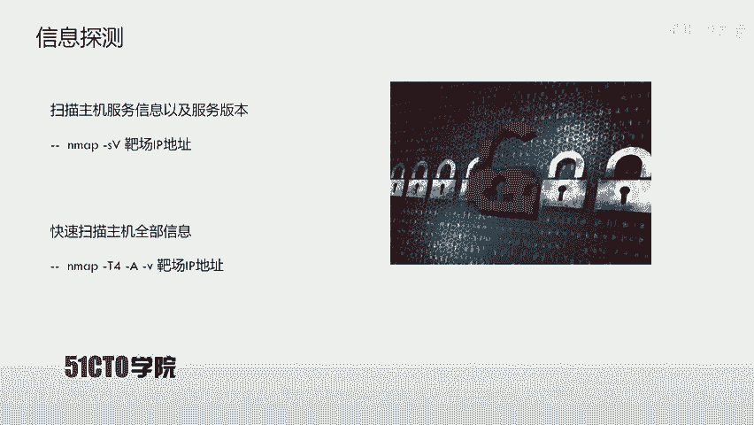
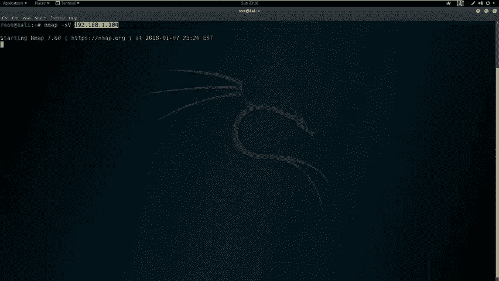
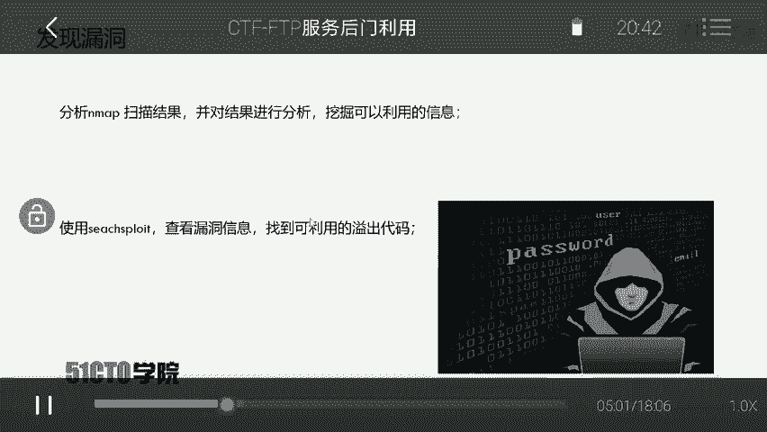
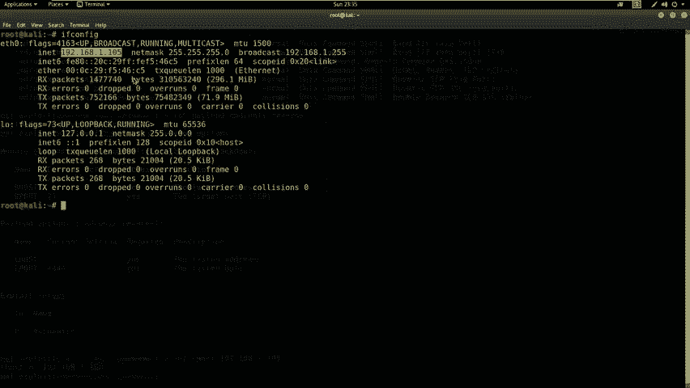
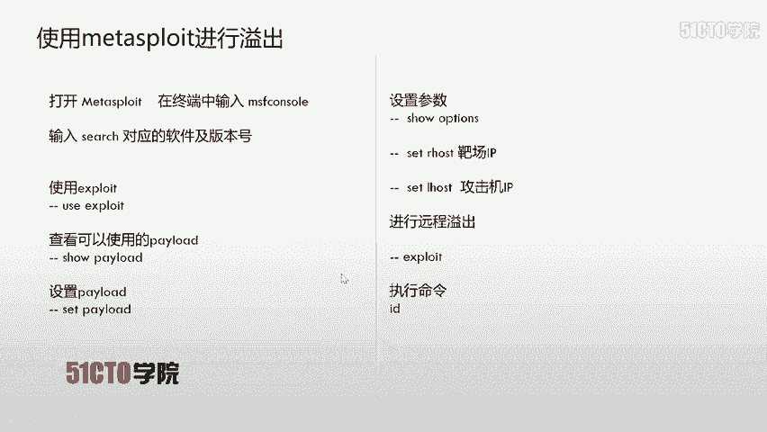
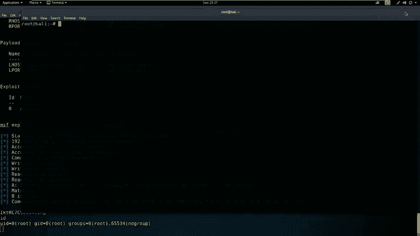
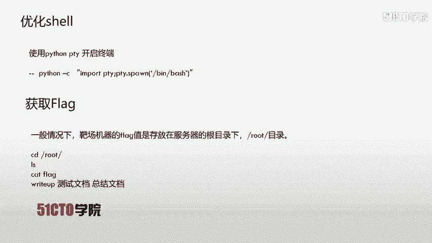
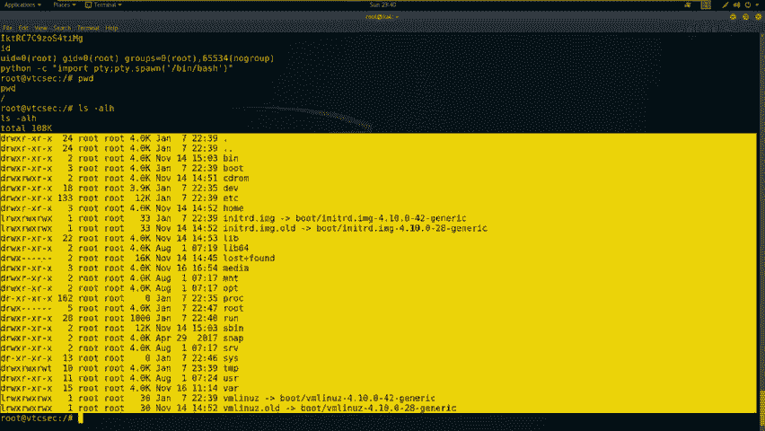

# CTF夺旗全套视频教程-网络安全 - P7：7.CTF夺旗-FTP服务后门利用 - YiWorld-奕 - BV1FN411U7Cv

今天我们继续来学习哎CTF训练当中的服务安全中的FTP服务。咱们通过FTP服务，哎，最终获得主机的root权限，取得啊对应的flag值。那么咱们下面啊来介绍一下FTPFTP哎是文件传输协议的英文简称。

而中文简称为文件协议，用于internet上的控制文件的双向传输。同时它也是一个应用程序。基于不同操作系统有不同的FTP服务。而所有这些应程序都遵守同一种协议，以传输文件。在FTP的使用当中。

用户经常遇到两个概念下载和上传，下载文件就是从远程主机拷贝文件哎到咱们自己的计算机当中，上传文件，哎，就是指将文件从咱们自己的计算机拷贝到远程的计算机上。用英他语言来说。

用户可以通过客户机程序从远程主机上传或下载文件。我们也可以得知FTP哎就是这种文件传输的规定或者是法则。那么咱们下面来介绍一下今天的实验环境，公积机采用卡利linuxIP地址是192。168。1。

105靶场机器哎使用乌班图系统，它的IP地址是192。168。1。100。那么咱们现在获得了对应的实验环境，该如何操作呢？咱们哎一定要抱有一种目的性进行对应的操作。

我们的目的一定是获取靶场机器上的flag值，取得靶场机器的对应权限。那么咱们首先要进行第一步，也就是探测我们靶场机器上开放的服务以及对应的版本。使用咱们N map进行对应探测。

使用杠小写S大写V来表示扫描对应的服务版本之后，加上咱们靶场的IP地址。

下面我们在卡利当中来实践该命令。首先是N map。杠小写S大写位输入咱们靶场的IP地址，192。168。1。100回车。那么咱们这时候n map开始向咱们对应的这个靶场发送大量的数据包。

数据包啊会返还给N map。

N map来应用它标准输出输出到哎咱们这个对应的终端中。咱们现在哎扫描完成。除了可以使用杠小写S大写位来扫描咱们靶场的信息，也可以使用哎咱们这种快速扫描的方式，扫描靶场主机的全部信息。

其中就包括了哎咱们上面杠小写S大写位扫描的主机服务信息以及服务版本信息。同时它也包括了哎咱们操作系统的版本以及哎路由信息等等等等。下面哎咱们来看一下对应的参数。

首先N map表示使用N map哎这个工具之后，杠大T4表示哎使用N map的最快速度进行对应的扫描。之后哎使用杠大A表示按所有的按加载。对应的哎这个扫描模块，对靶场机器进行对应扫描过程。杠小微表示。

返回哎所有这种探测的详细信息，包括哎咱们这个发送数据包和靶场响应的这个数据包。下面咱们在卡例当中实现该命令。使用n map。杠T4。杠大A杠小V之后是咱们靶场IP地址，192。168。1。100回撤。

那么咱们这时候N map加载所有的扫描模块，对咱们哎今天的靶场IP进行对应探测。我们可以看到这里哎已经快速的哎进行扫描完成。我们首先哎看到了对应这些哎扫描的一些服务版本，哎，和咱们上面还是有很大差别的。

这里啊只是给出了一个简单的信息，而下面给出了哎所有这种详细的信息。咱们现在哎已经使用M map扫描到靶场开放的服务，哎，以及对应的一些操作系统信息以及路由信息。那么咱们下面哎需要使用哎这个扫描到的结果。

并对这个结果进行对应的分析，挖掘其中可以利用的信息之后哎利用这些信息来查找漏洞，找到哎对应的漏洞信息，来对今天的FTP服务进行对应的溢出。

首先我们回到哎扫描结果当中，会发现哎我们这里首先来分析一下开放的端口，开放了21端口，22端口和80端口。而我们21端口哎就是FTP服务。我们今天就是针对FTP来进行对应测试。

这里我们发现了啊对应的敏感信息，也就是FTP的软件以及该软件的版本。我们先把哎该软件的版本哎给它复制出来。我们继续向下看，在这里啊我们也可以看到加载所有模块之后。

它的FTP哎仍然是pro FTPD哎这样一个。软件以及它对应的版本。下面啊我们就来查找一下该版本的软件是否存在对应漏洞，我们就要使用到searchpot来查找。SERt键哎直接补全之后，哎。

咱们把刚才复制的这个信息给它粘贴进来，点击哎之后咱们回车。这时候哎 search哎给咱们返回了哎对应的一些信息。我们这些信息哎可以看到。

compose source back door a remote code exceptionception。我们也可以发现啊它是一个远程代码执行，通过哎它源代码当中的一个后门。

这里啊也是通过后门执行命令，可以看到，在这里它集成到matters bullet当中。以及我们向后面看，看到它的pa，哎也就是我们该漏洞文件重储的哎根目录，以及它的分类目录下。

可以看到我们现在来查看一下哎第一个哎这个TST哎这个文件。首先，catguser。我们把这个目录哎，直接给他复制过来。快点哎之后我们把前面输入的删掉。之后点击paste来粘贴来查看。啊。

我们没有输入哎该文件名，哎，在这里，我们把这个文件名再给它复制过来。点击Ipas回撤，这时候哎我们就可以看到哎该。源代码哎的内容，这里我们就需要哎修改对应的啊一些。

参数按之后而执行对应的远程一出而执行对应的代码。当然哎我们这样使用这个。TRG文件当中的代码还是比较复杂的。我们也可以看到，刚才在对应的search当中。

我们也可以看到哎mattterpo也集成了这样一个漏洞，并且有对应的源代码。那我们哎现在哎就来使用更方便一种方式，就是使用mattterpo进行对应的溢出。我们刚才也看到了哎这个FTPpro d1。

133C存在对应的远程漏充，并且哎集成到mattterpo。现在我们就使用mattterpo来进行远程溢出。在进行远程溢出的时候，哎。

我们可以使用MSF control来打开哎对应的这个mattterpo终端的这样一个界面之后使用search，然后加上咱们刚才对应的软件及版本号。来探索哎该模块所存在的位置。

我们下面啊来启动mattter split，首先MSFcon回撤。这时候哎我们开始启动MSF control哎这样一个接口，因为它是一个哎集成了渗透测试过程当中哎，所有工具哎的这样一个大型安全框架。

所以说它的启动速度啊还是比较慢。下面我们就使用search。search哎，然后把软件和版本号粘贴进来。我们来向上看，来找到对应的软件和版本号。我们把这个哎复制出来，靠背。之后哎点击paste粘贴。

回撤哎，这时候哎咱们这个metal bullet哎就开始哎对它这个软件。对应的版本对应的漏洞哎进行搜索哎，搜索是否存在。对应的漏洞利用模块。可以看到。

现在咱们并没有初始化mattter spot哎这样一个数据库缓冲。所以说哎这个使用了最慢的这样一种搜索。我们也可以看到，哎，这里已经搜索到哎对应的这个后门信息，哎，以及这个expo这样一个漏洞。

我们在搜索完之后，哎，就可以使用use exploitpolate。也就咱们搜索到这个expolate来进行使用该模块之后，我们使用该模块一出之后，还需要设置对应的payload。

而我们并不知道哎我们究竟该使用哪些payload呢。这时候使用so payload来查看要使用哪些payload以及可用的payload。在查看完之后，我们就可以set哎来查看设设置的哎这个。

对应的payload使用set。之后我们设置哎这个export和payload对应的参数。这里我们设置aho哎盘长IP以及low host，也就咱们公积机哎的这个IP。

公积机IP之后哎执行expolate。哎，然后我们这时候来进行远程溢出，远程溢出之后会给我们返回一个对应的事项。那我们就可以执行对应的命令。

我们首首先使用uses来使用。该利漏洞利用模块copy，哎，然后点击paste来粘贴。这个时候哎我们就来查看一下该 exploitpo啊下面可以使用的啊这个payloadso option so payload。

拍漏的回去。哎，这时候我们返回对应的payload。我们今天啊使用这个remse啊这样一个payload。后贝哎，我们接下来呃使用sent payload。然后点击右键按paste粘贴回撤。

我们在设置完expo和payload之后，需要查看一下。这个payload和expo里边究竟需要设置哪些参数？这时候我们使用到so options。来查看我们需要设置的啊这个参数。

这里我们需要设置一下目标的IP地址s。RH。posts呃，我们这里也可以看到，我们需要设置Iho之后啊使用靶场IP192。168。11。100回撤。我们设置完这个参数之后。

我们还需要设置payload的参数，可以看到这是我们监听的IP地址。我们需要设置监听IP地址，也就是我们本机，也就是卡利的啊这个IP地址，我们来查看一下。IF confi回撤。

我们看到哎他的IP地址是192。168。1。105，把它。

复制出来，哎，然后我们开始设置set low host来之后，我们右键来点击paste粘贴。我们设置啊这些参数结束之后，我们也可以按使用对应的命令来查看一下该参数是否设置成功。

我们依然使用so options，回撤我们会查看到哎，我们这里已经设置完对应的参数。那我们设置完之后，哎，就需要执行远程溢出命令，使用exspolate回车。我们这时候哎开始。远程一出而该福气。

最终获得对应的权限。可以看到现在正在发送呃后门的命令。哎，这时候我们已经执行了对应的溢出。我们接下来使用ID来查看一下我们当前用户哎所得到的权限回撤。我们会发现我们直接获得了哎对应的root权限。

我们在获得Iroot权限之后啊，我们可以哎看到我们该终端哎是存在一些问题的。比如说我们现在打开一个卡利的终端来查看一下我们这个终端哎到底。

和我们现在终端有什么区别？我们可以看到卡利终端下，我们是以root用户登录，并且它的主机名啊是卡利，并且它的目录是在加目录下面，并且它对应的权限是root权限。

但是我们返回的哎这个seel并没有哎对应的我们刚才那样美观的。

这个笑的前端界面。接下来哎我们就需要使用哎对应的哎这些模块来构成我们这个优化美化的这样一个终端。我们这时候哎就使用到pathon当中的PTY模块之后执行PTY点sp这样一个命令。

然后获得我们并下的base啊，来开启我们这个对应的终端。我们下面啊来回到卡利当中来执行这样一段操作。首先是pathon杠C双引号import pTY分号PTY。打 Spain。之后爱是B。贝死。

这是咱们辈子的目。路径之后。单括号，然后是双引号回撤。我们在执行完哎这样一条命令之后，会发现我们返回了啊我们想要的哎这样一个笑。我们这时候还可以看到我们是以root用户登录的，哎。

就不需要提升对应的权限。那我们在CTF比赛当中，哎，在提升到root权限之后，我们还需要执行下一包操作，就是获取对应的flag值。一般情况下，咱们把场机器的哎这个flag值是存放在服务器的根目录下。

也就是root目录下。那么咱们这时候哎就需要切换到对应的root目录之后，哎查看该目录是否哎有这个flag值。如果有，我们就可以哎使用cat命令来查看对应的flag值。在结束了查看flag值之后。

我们需要写对应的r up，也就是咱们渗透该靶场机器的过程文档以及测测试文档，以及咱们自己如果需要总结该CTF比赛，咱们也可以写一下对应的总结文档。下面咱们来寻找一下对应的flag值。

首先咱们来查看一下我们当前的工作目录PWD回撤。这时候我们会发现我们之间是在根目录下工作的那我们使用LS杠ALH来查看一下该目录下的所有文件，并且以长格式输出。

并且以人类可以美化查看的呃这样一个文件大小的格式来显示。回车我们这时候啊会发现我们确实哎具有很多的啊这个文件信息。下面我们就切换到root目录来查看一下。

是否能寻找到对应的flash值回车。这好熊用LS杠alH回车。我们会发现，哎在这里也就是root目录下，我们找到了对应的啊flag这样一个文件。

下面我们就使用cat哎这个工具来查看一下对应的flag值CATFLAG回撤。我们这时候哎查看到flag值是该flag值。那么这时候哎我们就提交对应的flag值获得对应的分值。通过哎获得flag值之后。

啊，我们就可以啊拿到一定分数。那么呃我们下面进行总结。对于I开放FTP以及SSHtelnet等服务的系统，咱们可以尝试使用sport来尝试一下，查看一下对应服务啊版本的这个漏洞代码。如果有该漏洞代码。

哎，咱们直接使用。来直接获得主机的哎访问权限，尤其还是要对哎这个系统一定要注意哎利用现成的E叉P来root主机。不要哎说是我要使用，一定要使用web啊这样一个方攻击面来渗透主机。其实它的攻击面有很多。

它上面开放的啊每个端口，每一个服务哎，以及对应的版本信息都是哎我们值得利用的地方。那么哎咱们今天的课程就到这里，再见。

