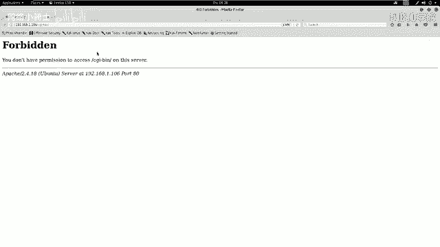
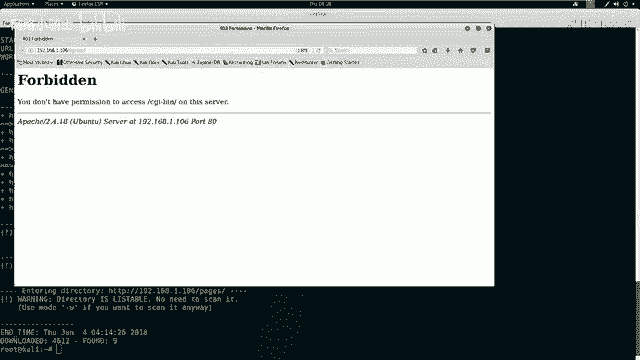
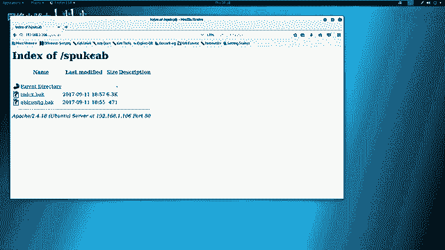
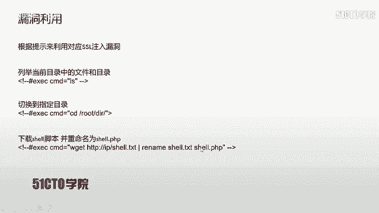
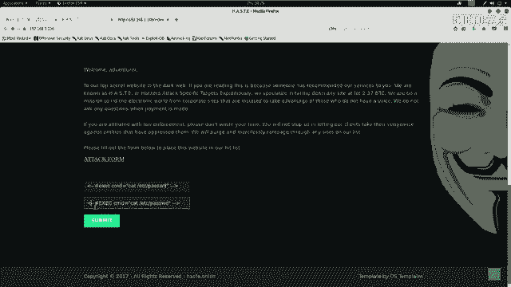
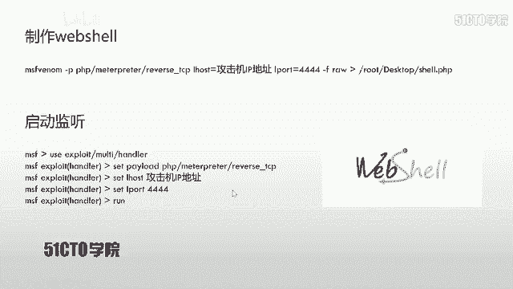
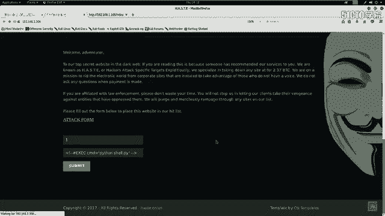
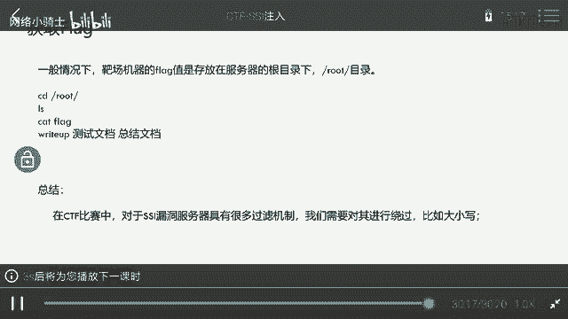

# CTF夺旗赛教程100集（全）从零基础入门到CTF竞赛大神看这套视频就够了！ - P15：17.CTF夺旗-ssl注入 - CTF入门教学 - BV1MBiuexEmh

今天我们来学习一下保养权当中的SSI注入。我们可以通过这样一个注入漏洞，最终从外部来进入到主机当中获得对应的权限。下面我们来介绍一下SSI这种注入攻击。SSI代表servside inject。

服务端注入。SSI的出现哎是为了赋予HTML这样静态页面动态的效果。在没有出现这个动态页面的时候，SSI和CGI被广泛应用于HTML静态页面。为HTM了静态页面提供动态的效果。

通过SSI与CGI来执行系统命令。再返还给页面对应的结果，实现了一种交互的模式，仿佛哎出现了一种动态页面的效果。那么咱们是在网站目录当中，如果发现了STMSHTM以及SHTML这样的文件后缀名。

那么表示该网站在一定程度上使用了SSI这样的技术来实现一种动态效果。如果说该网站对于SSI的输入没有做严格过滤，哎，或者是过滤不充分。那么就会造成SSI注入，使得用户输入的。

指令被系统执行并返回对应的结果。下面我们来看一下今天的实验环境。公积机采用卡利，它的IP地址是192。168。1。103，把场机器使用linux，它的IP地址是192。168。1。106。

那么我们拿到这样一个实验环境，该如何操作呢？大家啊一定要有一个目标，那就是获取靶场机器上的flag值。首先我们要取得对应的权限，才能查看对应的flag值。这里我们已经知道靶厂机器的IP地址。

那么我们下面进行第一步就是信息探测。首先要探测机器的服务信息以及服务版本。咱们使用N map加杠小S大V之后加靶场IP地址来扫描一下靶场所开放的服务信息。

在卡利当中哎输入N map杠小S大V之后是8场IP。106啊，不撤。那么咱们这时候n map哎开始对服务器发送大量数据报，哎，并且服务器会给咱们返回对应的数据包。返回之后N map。

根据哎这个返回的值之后，以标准的格式输出到这个控制台当中。咱们除了可以扫描靶场的服务信息，也可以哎使用N map。其他命密。来扫描这个靶场的全部信息。比如说哎包括它的操作系统信息。

那么咱们这条命令是N map。杠大T4。这里杠大T4代表。使用N map最大线程数，也就是Nm的最快速度。对靶场，也就是这个主机发送大量数据包，之后是杠大A表示使用N map的全部扫描模块。

然后加上杠小V表示使用哎这个详细输出。最后加上8场IP地址。我们使用N map杠大A杠V杠T4。192。168点1。106。我们可以看到，哎，在这里我们颠倒了对应的顺序。在M map当中。

颠倒参数顺序是不影响M map的扫描的。这时候我们回撤。当前Nm就加载所有的这个扫描模块，并且使用最快的速度哎，对靶场机器进行扫描。并且最终把对应的扫描结果全部详细的显示出来。

我们现在可以看到我们这个N mapap已经扫描完成。那么下面哎我们就使用nic two来探测一下开放的HTTP服务。在探测之前，我们需要哎查看一下靶场哎是否开放HTTP服务。我们可以看到，哎。

在这里它只开放了这个80端口，并且80端口运行的是HTTP服务。以及HTTP服务的详细信息。我们下面就使用n two。杠hotHTTP之后，加上咱们靶场IP地址。1。10。6。回撤。

那么咱们这时候ne two哎对咱们这个靶场哎进行。深入的探测对咱们对应的HTTP服务探测。可以看到它返回了哎大量这个探测信息。哎，我们这里哎它是要我们更新，哎，我们想no这时候哎我们的探测结果结束。

可以发现哎里边有很多值得利用的信息。除此之外，哎，我们这里还给大家介绍一下另外一个探测工具，也就是扫描一下咱们当前HTTP所开放的哎这个页面DRIB啊，然后HTTP。然后加上IP地址，192。168。

1。106回撤。那么咱们这时候哎探测一下该靶场。所有的目录以及它对应的文件。我们在探测结束之后，哎，就需要对咱们当前的探测结果进行对应的分析，找到哎里边可以利用的分析。因为我们靶场只开放了。

80端口并且运行的是HTTP服务。那么咱们哎就对HTTP服务进行深入的分析。对于HTP服务，哎，咱们如果找到敏感的页面，可以在浏览器当中打开对应的页面，查看该页面中是否有敏感的信息，并找到可利用的位置。

我们下面回到卡例当中。来查看一下咱们当前扫描的信息。首先我们来查看一下nic two的这个扫描结果。会发现哎，这里我们返回了哎这个靶场的这个IP地址以及hose name以及它的端口，也就是80端口。

会发现它的服务器哎是使用的是乌班图，并且它的中间键是使用的阿帕奇2。4。18这样一个版本。这里哎表示这个。点击截持呃，这个叉 frame options，这个ATT爆头没有被设置。

并且哎这里这个爆头也没有被设置。不能有效的来防止一些表单的叉SS。这里也有一个这样的爆头，哎，没有设置，哎，表示咱们可以哎用不同的这个fashion。来。做这个userag重定向。

以及哎这里哎缺少了一些这样的参数。以及咱们这里发现了一个哎这个索引目录。哎，这个比较敏感，啊，咱们一会儿来重看一下。可以看到呃，这里是咱们这个。robots文件当中哎，有这个目录的记载，不允许咱们爬取。

这里robots文件来发现。呃，这里以及发现了index SHMO这样一个文件，以及发现了index点ADHP这样一个文件。之后哎逐步向下。我们会当看到哎一些这样的结果，并且看到了一些。呃。

这个比较敏感的这样一些目录，哎，这里也看到了一些敏感的这个目录。可看到呃这里哎咱们就看完了这样一个结果。在这里哎我们发现了robots啊，以及这个隐藏的目录以及一些比较敏感的目录，并且这里也发现了一个。

很多啊这个不同的index的文件，比如说index点。SHTML以及indesex点PHP。我们下面再来看一下DRIB哎的扫描结果。哎，我们会发现哎，这里他发现了啊一些目录，这个目录哎执行了重定项。

并且呃这个目录哎，当前也有这个文件哎，以及这个另外一个目录哎，这些目录。以及发现了啊robots啊这样一个目录，以及robot点TST这样一个文件。已经发现了SSI这样一个。目录哎，那我们下面哎就来。

逐一来排查一下是否可以找到对应的利用点。下面哎我们首先在下面打开1个CGIopen link。会发现哎这个浏览器对当前这个目录哎执行了403，不允许哎用户访问。

那我们下面啊再来访问一下robots啊点TST啊这个敏感文件。Robots。可以发现robots我没有加TSD啊返回这样一个文件，加TST也是返回了这样一个文件，不允许我们爬取这样一个目录。哎。

我们就来查看一下，它不让我们爬取哎这个目录里具体的内容。反问一下，我们会发现哎这里有一些这个备份啊，以及这个临时哎备份文件。

我们点击下载。okK哎，之后我们点击okK来下载这里我们下载了两个敏感文件。之后哎我们来继续查看。在这里唉我们又看到了1个SSI这样一个文件，我们点击打开。我们在这里看到呃一些信息会发现。

这里啊有一些这个文件，它的所属组啊以及它的文件大小。这样一些信息。并且它返回了我们的IP地址。我们会唉想象到这里哎这个靶扯可能更多存在的是哎一个这个命令注入或者是其他类型的漏洞。跟注入有关的一些漏动。

根据这个提示，啊，咱们在CTF比赛当中可以很明确咱们的这个目标就是要通过。当前站点执行命令注入。最终拿到靶场的对应权限。下面哎咱们也来看一看咱们刚才下载的文件内容。

download回去L咱来查看一下哎这个index。点BAK。的信息。我们这里来逐步向上翻，主要查看哎它这里面的一些链件，以及对应的哎这个注释。我们会发现，哎并没有我们想要的信息。

我们再来查看一下old confi点ba。就是按这个配置文件的备份来查看。我们会发现哎这里的配置信息哎是一些这个服务器的信息。这里哎暴露出哎我们当前的这个。站点跟目录哎是在这里。以及哎它这个aror啊。

也就是错误信息的日志，以及呃用户登录的一些日志，就访问服务器来记录的一些信息。以及这里还是它的真点跟目录，以及它设置对应的权限。在这里哎，我们已经拿到了站点的这个根目录。通过这里啊。

我们并没有哎任何操作去对这个服务器哎进行。攻击和渗透。那我们刚才哎也看到了这样一个文件，SSI文件。并在浏览器当中哎浏览看到。SSI回撤看到了啊一些对应的信息，哎，类似于LS命令执行之后的一些信息。

我们除了啊看这些信息，我们继续来查看一下是否还有值得利用的位置。你继续向上。我们来向上看。这里。我们下面哎先来访问一下哎，这样一个链接copy出来。哎，我们打开了对应的网站。SSI啊这样一个信息。

以及我们继续查看。这里我们复制出来。以及这里index啊以及inex啊，这里有个文件，我们来查看一下当前index这个文件。用control位回撤。我们会发现哎在这里有一条提示信息。

而是我们这样一种格式。哎，之后这里是咱们对应的哎这个liing命令。可以发现通过这条命令，我们有可能会获得。这个当前哎这个系统当中的呃用户名以及它的密码。那我们刚才啊也看到SSI这样一个信息。

并且哎找到了哎另外的一些敏感信息。比如说哎咱们一开始的nic two当中。发现了这个SHTML哎，对于这个有丰富经验的。人来说哎，这个可以发现它是哎这个静态页面当中。具有SSI这样一个技术。

通过它来完成静态页面的动态效果执行。那我们下面就使用SSI来注入一下呃当前的这个。web应用程序。首先哎我们看一下对应的命令。我们刚才也有对应的这个注释，哎，并且给出了我们。类似的这样一条命令。

这里我们看到哎直接执行LS哎，这里直接执行CD啊root指定目录，这里啊执行下载脚本，下载脚本啊为一一个shall点TST之后把它重命名。为这个PHP。

下面哎我们就来打开一下web这个程序来寻找哎对应用户可输入的位置。我们向下拉会在这里哎发现。一个哎这个表带。通过这个表单提交，哎，我们查看一下是否能执行对应的命令。我们把这条命令给它复制进来。

给他把这个复制进来，点击执行。执行之后啊，我们会出现对应效果。我们发现哎这个刚才的这里tart。我们返回来这里呃是一个输，这里是一个输入来点击。会发现哎这个taret哎第一条注释了咱们对应的这个间括号。

第二条哎注释了ESEC。那么咱们哎知道它过滤掉ESEC，咱们就就要想到如何让这个ESEC来保留呢？那么咱们这里就用到一个技巧，就是把EXEC改为对应大写的ESEC来尝试。点一。

并且哎这里并没有返回对应结果。实际上哎咱们给的提示哎并不是完全的。那么咱们这里啊对于SSI注入哎，需要加一个感叹号，哎，点击这时候哎。

咱们会发现在这里的界面返回了哎咱们这个ETCPASSWD哎这样一个文件的效果。

以及它的内容。那么咱们接下来啊就使用下面这一条来是靶场机器下载对应的shall啊，并且把它重命名。咱们可以执行的shall。在下载啊这个shall的时候，哎，咱们需要首先生成一个we shell。

生成m shell啊，咱们使用到MSVENOM来生成对应的 shellll之后，咱们把它重定一下到咱们的桌面。之后，哎，咱们在公击机当中启动对应的监听，监听咱们靶场机器返回的这个shall。

咱们来生成笑。今天呢哎我们首先切换到桌面。Al莱斯。今天我们不使用PHPI的笑，我们使用pasthon项来尝试。首先MSF。之后杠PIpathon。mattter printer之后是reverse。

TCP老ho。也就是咱们靶厂IP地址来，我们来查看一下靶厂的IP地址。192。168。1。103啊，把它copy出来。paste来之后lower port。等于4445。设置444哎之后杠F。

rung之后重定向到哎，这个root a。啊，咱们重新输入MSFVENOF呃，咱们之后是杠P表示它对应的平台的小tthon。Matter，没。Worse。TCP。Law host。等于9。168。1。

103lawport。表示它监听端口等于4444。生成的哎是一个源代码rung重定向的。root目录下的desktop。然后那咱们需要。点PY回撤。

咱们这时候哎通过这个MSFVENOM哎生成了一个基于python的呃这样一个sell，并且它返回的哎这个地址是192。168。1。103，它监听的端口啊是444啊这样一个端口。

咱们在生成这样一个cel之后，哎，需要打开mettterpo启动监听。首先输MSF control来打开mattaport。因为metalport啊是一个比较大的安全框架。

里边集成了渗透测试所有哎的这样一个过程的工具。所以说打开速度是比较慢的，因为它需要加载很多的模块。打开之后，哎，我们。来启动监庆。首先use export it。之后来是MULTI。开着了，回去了。

然后设置payload set payload。最后哎我们因为这里使用的是pathon metal printer，我们把这个复制过来。花费哎之后我们。paste回去了。

设置完这些呃那个export和payload之后，我们需要来设置对应的参数。首先使用show options，查看一下我们需要设置哪些参数回撤。

我们在这里啊可以看到需要设置啊咱们监听的啊这个主机以及对应端口，这里是跟咱们生成这个。web上啊是。一样的需要设置对应的参数。law host我们设置。卡利的这个IP地址。使用st。

law host哎之后空格，哎之后粘贴进来。回去。咱们设置啊完成之后，需要查看一下是否设置成功，依然使用受。Opts回撤。这时候哎咱们设置成功。设置完之后，使用装来开启监听回车。咱们下面哎就来靶场上。

也就是通过SSI这个漏洞来下载咱们对应啊这个脚本，并且执行反弹效。这里哎咱们输一个一，然后哎这里咱们输入对应的CMD。首先哎咱们这里要使用下载的功能。通过什么下载呢？

通过1个HTTP来这样一个写站点进行下载，192。168。1。103哎之后是咱们shall点PY。咱们会想到，咱们当前哎卡利linux并没有开启HTTP哎这样一个服务器，也就是阿帕奇服务器。

那么咱们就需要哎开启对应的服务器，并且把sell移移送到哎咱们这个阿帕奇服务器跟目录。下面咱们在终端当中操作。打开一个新的终端。之后哎，咱们切换到桌面，哎，桌面上。有一个。

需要的PY咱们把当前的sha要PY。一到阿帕奇的哎这个根目录下。HTML哎，回车LS。L杠ALH哎之后是咱们查看一下阿帕奇站点跟目录是否有hell点PY。咱们可以看到，哎，这里出现了hell点PY。

咱们再把hell点PY移到ar帕奇目录之下，需要开启ar帕奇。阿帕奇呃tostar。不撤。咱们来查看一下这个阿帕奇服务器是否启动。回撤哎，可以看到这个按卡器已经处于活动状态，哎，并且正在运行。

那我们下面哎就来执行这条命令。咱们哎先把当前的哎这个。sell下载到哎这个服务器的站点上点击这时候哎，咱们应该是下载成功。下载完之后，哎，咱们需要给当前这个hell赋值对应的权限。

可以使用chan mode。777啊，然后是shall点PY之后点击回撤，咱们复值执行权限。之后哎，咱们设置完毕哎，开始运行。使用ippathon来运行这样一个小pay。点击回撤。咱们在点击过，哎。

这里出现了卡顿，咱们来看一看是否返回了对应的shall。

我们会发现这里出现了mettter printer哎这样一个。命令会发现哎，我们是返回了这个shall，并且来使用咱们本地和靶场机器的58950这样一个端口建立了连接。我们在获取shall之后，哎。

刚才也使用了大小写绕过。获取shall之后，咱们可以使用six in查看系统的信息，以及使用shall进入系统的真正sell。我们下面啊来操作，首先使用ss in four回撤。

会看到我们当前哎的这个靶场机器。的名字呃叫做con one plus，并且它只采用的操作系统。linux它的内核版本。以及它使用的是发行版时使用的乌斑图，并且这里探测出它所这个使用的这个架构是I686。

接下来我们就进入哎真正的笑来查看一下咱们当前。登录的这个用户哎具有的权限，需要之后来执行ID回撤。我们可以看到，我们是以3Wd把用户登录的，并不具有root权限。我们在这样一个se当中会发现。

并不是和咱们卡利当中的这个hell类似，而是简简单单的一个命令行。我们来查看区别。首先我们在卡利当中打开一个命令行。会发现。跟我们下面的这样shall对比，我们这里啊有对应的用户名以及主机名。

以及哎当前的目录路径，以及当前的啊这个用户权限。但是我们在matpre啊这个sell，也就是sell终端当中会发现只是一个简简单单的多了。那我们怎么优化呢？

下面哎就我们使用pathon的功能来优化一下当前的这个事。首先输入pathon杠C执行对应的命令。首先导入1个PTY。分号来之后，PTY调用SP。AW n。哎，我们我撤一下。哎。

这里我们contlC一下需要。之后哎我们把对应的命令复制进来。PTYSPAAWN之后是base。呃，我们来继续。首先哎是一个pathon杠C。之后按引号 import。PTY。分号PTY点SPAAWN。

括号之后是单引号杠。Bing刚。BASH。单引号括号。双引号回撤。咱们这时候哎执行了这样一段python代码，执行完这段python代码之后，咱们这里哎出现了跟咱们卡利当中比较一致的哎这样一个终端。

可以看到这里用户名，并且它的主机名，并且当前的目录哎是咱们之前所挖掘的这个站点跟目录。这时候哎咱们可以执写LS来查看一下当前哎这个路径下所拥有的这个文件名。以及他的目录。

这时候哎我们就取得了哎这个比较好看的一个。用户终端对应的项。实际上哎在CTF比赛当中，哎，咱们获得了对应的权限，还需要哎进行最后一次步操作，也就是获取对应的flag值。一般情况下。

咱们把场机器的flag值是存放在服务器的根目录下。咱们可以CD啊root LS然后catflag值。最终哎咱们查看到对应的flag值。在完成这些所有步骤之后，哎，咱们可以写对应的r up。

也就是咱们操作文档。当然今天咱们这个靶场。并没有哎准备flag。当然，在我们CTF比赛当中，对于具有SSI漏洞的服务器。肯定是有很多过滤机制的。那么我们就需要采取对应的措施来将其绕过。

获得扶务起执行的权限。执行对应的命令。绕过机制啊，我们可以采取大小写切换。比如说今天我们所使用大写字母替换小写字母，绕过了对应的过滤机制。来实现我们想要执行命令的操作。最终拿到服务器的权限。

那我们这节课就到这里。