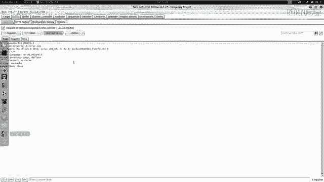
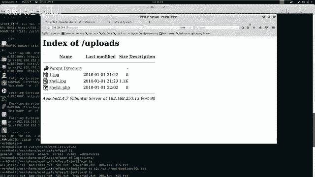
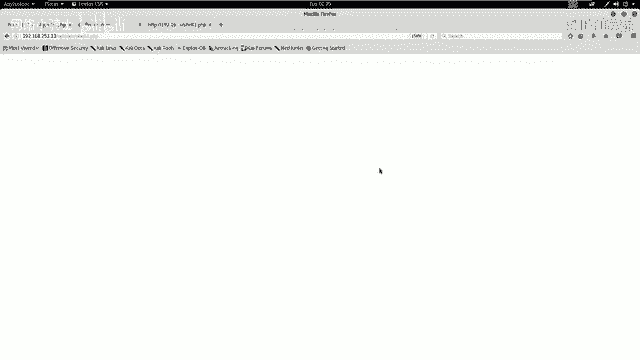
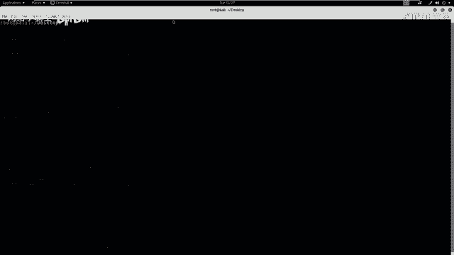
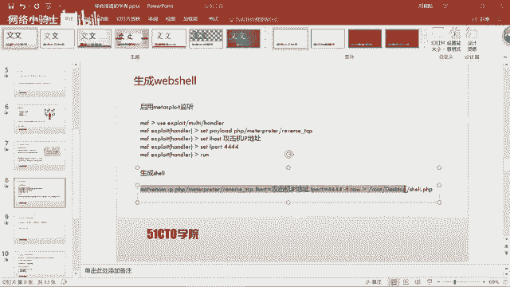
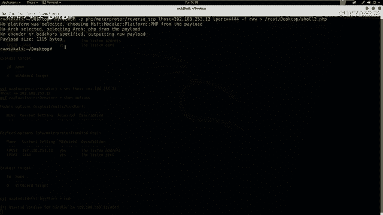
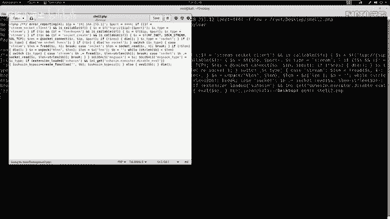
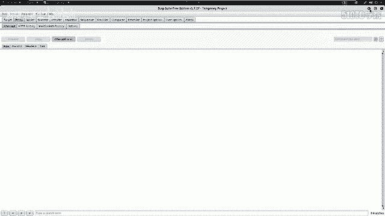

# CTF夺旗赛教程100集（全）从零基础入门到CTF竞赛大神看这套视频就够了！ - P24：26.CTF综合测试 - CTF入门教学 - BV1MBiuexEmh

然好哎，我们今天继续。接着上节课改的内容。我们上节课已经通过Is模糊测试来登录到哎系统的后台，并且找到了哎一个对应的上传点。咱们通过哎上传1点GPG和1点PHP哎，发现我们可以直接上传图片文件，哎。

并不能直接上传。PP文件。那咱们如果哎想上传PH文文件。那么咱们就需要哎绕过上传过滤机制。之后哎，咱们执行咱们上传的效。获得服务器反弹的时效，最终取得系统的控制权。

那么咱们下面就来使用BURP来绕过这个系统的上传过滤机制。咱们哎进入公积机当中。首先哎咱们回到浏览器当中，打开这个代理。点击adancenet settings。之后哎，这里代理已经开启，点击OK。

这时候哎咱们。把这个1点PHP来给它重命名。命名称。Shell点GPG。G小一点GPG。点击rename，哎，把它首先保存一个文件。表层哎图片文件。之后哎咱们。选择它来进行上传。在上传之前，哎。

咱们把代理打开。对他进行截断。点击哎上传，这时候哎咱们上传的数据报就被发到哎咱们这个。BIP当中。我们会发现哎在这里哎有咱们这个文件名，咱们把对应的文件给它改为。P是P。啊P是P。

会发现哎咱们内文件里并没有内容，咱们只做一个测试。点击呃forward来对它进行发送。咱们回到哎浏览器当中。会发现返回来，哎，咱们上传成功。那么咱们这时候哎就会发现，咱们通过啊上传1个GPG文件之后。

在BUIP当中截断将文件名改为咱们想要的哎这个PHP文件就实现了哎咱们这个上传功能，就可以上传1个PHP文件。那么咱们接下来就来查看一下是否上传成功。咱们在上节课哎探测的过程当中发现了哎一个这样的目录。

我们在这里看到一个uploads目录，也就是上传目录。我们点击打开。我们会发现哎这个过程还是比较缓慢的啊，因为它要进行一些连接。啊，因为我们这里哎打开了bo stripped，我们点击for。

对他进行不进行任何操作。

我们在这里会发现我们上传的一些文件。这两个文件是我们上节课上传的一些文件。这是哎我们这节课上传的一个GPC文件之后，哎通过。BRP修改为哎，这个hell1点P1P，我们点击一下，因为并没有任何内容。

我们把它。关掉之后，我们来查看一下浏览器。会发现哎并没有执行任何内容。我们这时候哎就会想，如果我们现在这个shall1点PHP当中有我们想要执行的恶意代码。那么哎就会。给我们这个服务器哎，这个靶场机器。

造成那个反弹效这样一种操作。下面呢啊我们就来。生成一个V效。这里我们生成we shell，首先要具有哎两个。终端第一呢就是咱们公积机当中要启动一个监听，监听咱们反弹回来的时。然后是要生成excel。

咱们通过它刚才的上传绕过机制来绕过服务器的上传验证机制。来达到上传一个web shop的目的。下面哎咱们就来执行这两步操作。首先哎在咱们卡例当中。

启动哎监听。很肉，你撤。咱们这个mattter bullet哎是一个。集成了渗透测试要使用的所有功能的这样一个框架。它具有漏洞挖掘。以及漏洞利用。的所有功能以及我们后期的报告哎这样一些功能。

所以说它启动的过程还是比较缓慢的。现在启动了，哎，我们使用。对应的啊这个监听的这样一个功能。设置它的配load，我们选择PHP。之后按t键啊，它会出现一个延迟。因为配漏的哎具有很多，哎。

所以说它的这个反应还是比较慢的。Your matter printerer。然后是invo TCP。之后我们需要设置对应参数，我们先来查看一下需要设置哪些参数，使用s options这一条命令。

之后我们会发现需要设置。low host也就我们这个公积机的IP地址。192。168。253，我们来查看一下我们攻击机的IP地址。Config。一253点1样。

回撤这时候哎我们设置完成来查看一下是否设置成功，还是使用stion。之后哎。执行run开始监听。执行完这条命令之后，哎，我们需要生成一个web shell。这时候啊我们把刚产的命令给它复制进来。

把这样一条命令来复制进来。

我复知到这里。pa哎P1P。小二我们取平没。之后我们把。这个公积机的IP地址。给他改为192。168。253。1213。我们再来查看一下。呃，11。

这时候哎咱们生成1个PHP将反弹exel以及它的IP地址，反弹的IP地址以及反弹端口号，以及它的文件格式类型是一个原文件，并且把它重定向到这里。呃，这个过程也是比较缓慢的，还需要稍微。等三四秒钟。好。

我们现在生成完成。我们来查看一下这个文件的内容。

我们会发现这源代码当中就有一条注释符。我们需要把这条朱师符去掉。使用到GEDIT这样编辑工具。之后哎咱们打开这样一个文件。咱们把这个注释符给它去掉。然后点击sve哎，点击关闭。

现在呢哎咱们就开始哎刚才的上传步骤来上传这样一个we shell。首先呢咱们要把这个PHP给它重命名为。sh to点G皮G。这时候啊咱们从命名之后开始，然后点开BUIRP。然后找到咱们上传的界面。

首先哎给他拉近一点PP，他登录。之后哎，咱们选择咱们要上传的112点GPG。打开哎结段代理。打开之后，哎，咱们点击上传。这时候啊咱们上传的这个数据包就发送到这个b stripped。然后哎咱们开始修改。

对应的这个文件名改为PHP哎，点击forward。这时候哎咱们回到浏览器当中查看是否上传成功。这时候哎咱们上传成功了。那么咱们接下来来查看一下。

这个upload。这样一个文件夹当中，是否有咱们想要的s要？

这时候哎咱们消图。就上传到这个目录，咱们点击一下，执行一下这excel。这时候哎咱们再回到监听的这个端口。会发现啊他给咱们反弹回来一个sell，咱们使用哎对应的命令来查看一下。您错。

这时候我们查看到靶机的哎操作系统的一些信息。这时候哎我们已经。获得了啊这个靶场的这个反弹效。接下来啊我们就需要。查看一下我们是否完全拿下了这个靶场，并且深入的挖掘获取这个机器上的敏感信息。

首先我们可以执行对应的这个命令。然后查看一下是否哎取得了root权限。接下来我们回到卡例当中。笑。ID会发现我们是以3W。杠date来登录的。胡。啊，确实是这样一个用户。那我们接下来啊想要使用的方式。

哎就是。把这个权限提升为root权限。我们首先来操作一下是否具有SW do哎这样一个。权限。会发现我们并没有这样一个权限，并不会给我们返回任何结果。

那么咱们接下来哎就来看一看我们之前的另一个挖掘到的敏感信息，就是在我们站点根目录下有一个config点PHP。C来给它关掉之后，哎，咱们LS来查看一下站点的这个跟目录。

我们在这里啊看到了有一个configured的PHP下面我们就来查看一下config。点PHP来是否有我们想要的内容。我们在这里会发现。有一条这个my circle的这个数据库连接的信息。

这里还是它对应的数据库的IP地址，还是本地的数据库之后还是它的用户名、密码以及它的数据库名。下面我们就来使用hell来连接一下数据库，查看数据库的敏感信息。my circle杠Uro杠P回撤。

接下来输入TOOR。So。Tables。我车哎这时。首先我们show database。这时候哎我们并没有哎发现任何这个效果。并且这个终端是不太友好的那我们下面来执行这样一条命令。Passing。

PYTH passing杠C。Import。哎，我把它关掉。我首先是要。Passing杠 C。Import。PTY。然后是PTY点SP。AWN。然后是括号，然后是单引号。冰。是SH。之后啊是双业号回撤。

这时候还给咱们返回来这样一个结果，一个比较友好的结果。接下来咱们连接数据库。My circlecle杠 u。root杠P输入对应的密码。这时候哎咱们进入数据库。首先哎查看一下数据库的内容。

so DATABASES回撤。这里哎咱们查看一下哎这个数据库，首先要使用这个数据库DENEM1。我去。然后查看一下有哪些表。tables，然后查看一下这个数据表当中的内容。呃，查看一下新。U长。呃。

这里这条语句出错C。L Xing from user。不撤。这时候哎咱们会发现。这个user当中哎有对应的密码。咱们会想到我们现在这个密码是否哎是咱们。咱们当前哎这个用户。的linux密码呢。

那么咱们接下来哎就来。通过这个挖掘到的敏感信息。对服务器来进行提权。首先哎咱们使用SU杠root，然后输入对应的用户名来提升对应的权限。首先退出来ESIT。呃，1SIT。接下来啊咱们使用SU杠root。

接下来输入密码ASD123星星星回撤。咱们忽然发现哎，咱们这里出现了这个井号，已经成为了root权限。who am I回车ID。那么咱们这时候啊已经到达了这个root权限。Al莱。

会发现咱们在root里面可以看到很多文件。那么咱们这时候。就已经拿到了这个靶场的全部权限，就可以执行cat flag。这样一种操作来在根目录下或者其他目录下找到这个flag值。

那么咱们哎这节课哎就是完整的拿到了这个服务器的root权限。通过哎本小节的讲解，哎，咱们需要哎以后在学习当中。要总结哎，明白这两点。第一呢要熟练掌握各种安全工注意使用以及常见漏洞的利用方式。比如说。

模糊测试s可注入漏洞。以及绕过文件上传的这样一个漏洞。逐步哎深入探测目标。测试目标渗透目标最终通过敏感信息。获取哎这个root权限。大家哎千万要注意，在CTF比赛当中一定要明白。

目的是为了获取root权限，最终取得对应的flag值。这就是哎咱们以后需要注意的啊两点。好了，这节课就到这里，哎，再见。大家好，今天我们来学习一下，哎，通过web in程序哎。对它的安全漏洞进行测试。

达到入侵的这样一个效果。最终，root主机获得主机的最高权限，取得对应的fag值。咱们在开始之前，首先来介绍一下外部安全。随着Y8。0社交网络、微博等一系列新型的互联网产品的诞生。

居于外部环境的互联网应用越来越广泛了。咱们企业的信息化过程当中，哎，各种各样的应用都架设在web平台之上。web业务也迅速发展为。黑客哎的强烈关注，接踵而至的哎就是咱们we部安全危险的凸显。

黑客利用网站操作系统的漏洞和web应用程序的srcle注入漏洞等得到web服务器的控制权限。轻则篡感网页内容挂黑页，重则哎通过这个外部漏洞获取。咱们企业内部重要的数据信息。更为严重的哎。

就是在网页当中植入恶意代码。今年比较火的就是在网页当中植入恶意代码，实现挖矿的这样一个操作。比如说挖比特币，挖能罗币这样一些虚拟币。使得咱们网之。的访问者受到极大的侵害。下面咱们介绍一下今天的实验环境。

首先，公积机的IP地址是192。168。253。12。靶场机器的IP地址是192。168。253。13。咱们拿到这样一个实验环境之后，该怎么办呢？大家在进行渗透测试的时候，一定要有一个目标。

就是获取靶场机器的root权限。如果是在CTF比赛当中，大家要明确啊，我们是要达到靶场机制上的flash值。咱们在拿到这些信息之后，可以使用攻击机对靶机进行测试。测试的第一步是要对靶场机器。

进行信息探测，对他的信息来进行深入的了解。咱们可以使用M map来扫描一下对应靶场IP地址所开放的服务以及服务的版本信息。下面咱们进行操作。首先使用M map之后。

加上它的参数杠SV把厂的IP地址253。13回撤。咱们这时候M map哎就会执行这条命令，发送大量数据包给咱们对应的这个。IP地址也是靶场的IP地址。然后靶场会给咱们返回是任何很多信息。

这些信息就会被N map处理，哎，显示到N map的标准输出当中。咱们除了可以扫描主机的服务信息以及服务版本信息，还可以使用。Am哎全部功能来扫描靶场。获得靶厂的全部信息。

这里咱们使用T4来使用n map的。最快速度扫描8成IP。之后是杠A使用M map的全部功能来扫描靶场。之后是小微来表示我要显示所有的这样一个扫描信息。

使用A map打A打V杠T。T4靶场IP。在这里啊可以看到我们使用。map杠大A杠小A杠T4和咱们PPT上面的这个顺序还是不一样的。

