# CTF夺旗赛教程100集（全）从零基础入门到CTF竞赛大神看这套视频就够了！ - P37：39.40.sql查询 - CTF入门教学 - BV1MBiuexEmh

大家好，下面呢我们进行mysql数据库安全第三部分的内容。

Ccle查询及首住执行。

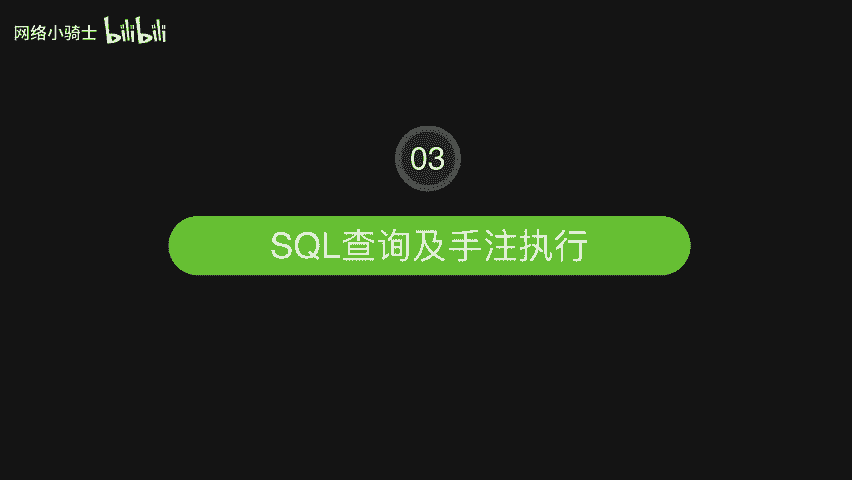

啊，首先呢我们去熟悉一下我们mys数据库的一个数据表的一个结构。嗯，在这张图中啊，我们采用的是PHP my amin这样一个网页的工具去登录到我们的my这数据库。

然后右边这张图看到的就是我们当前数据库下的一些数据库名。在这里有12345呃，有6个数据库。嗯，我们重点看information scheme这样一个数据库。呃，点击这个数据库开始以后呢。

我们去在这个数据库中去找一1个s matter这样一张表，就是我左边列出来的这个。数据库表。然后看这张表中的第二列，第二列的列名是smme name。我们可以看一下呃，比较熟悉。

s根的内幕下的具体信息比较熟悉，它就对应到了我们当前买测狗中所有数据库的名字。所以我们就可以在information scheme这样一个数据呃库中的呃s matter这样一张表中去查看到我们当前数据库下的所有数据库名。

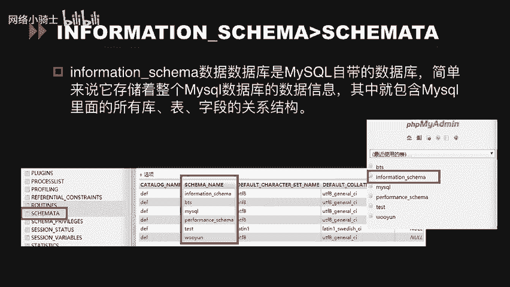

那当然我们也可以采用命令去查看，直接搜dabbase，也可以看到我们当前数据没这个数据库下的所有数据库名。

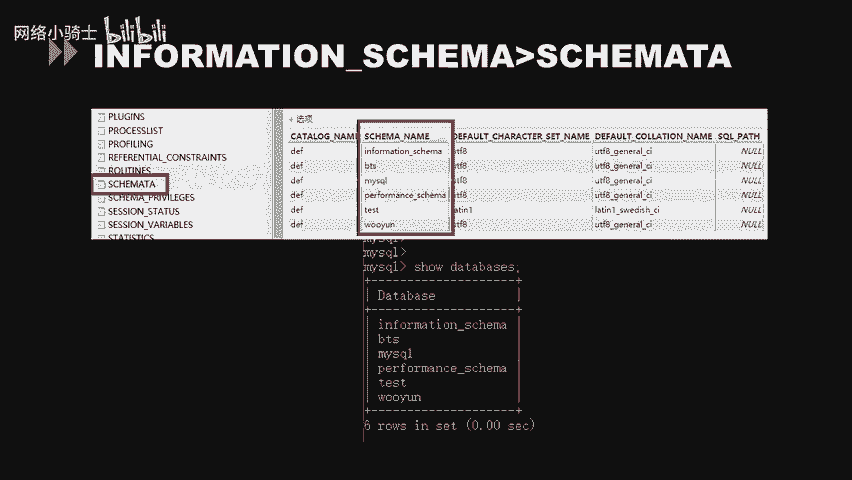

嗯，然后通过还是通过我们命令的形式去查看selects name from information s点s。这个命令呢就是把我们刚才那张图中的数据库的名称是显示出来。

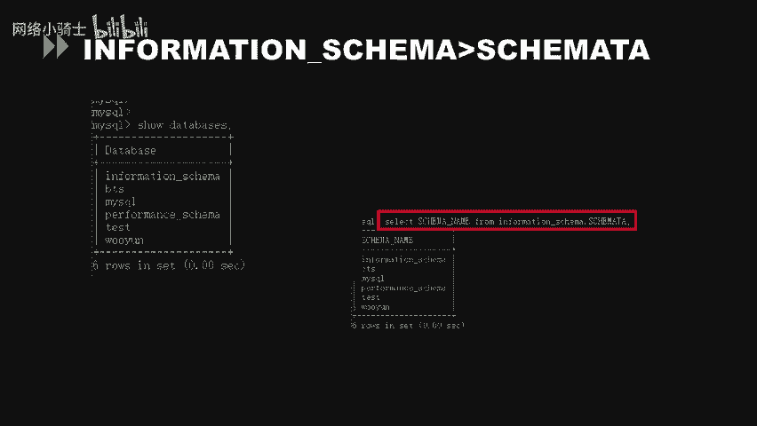

啊，接下来我们再去看呃information scheme中这个数据库中的另一张表叫tableables。以下这张图呢，我们就是点击table这持呃之后的一个table表的具体内容。看呃第三列。

第三列的列名是呃table names。呃，可以看到呃这一列呢指的就是我们的information scheme中的这个数据库表中的数据库中的呢所有的数据表明。

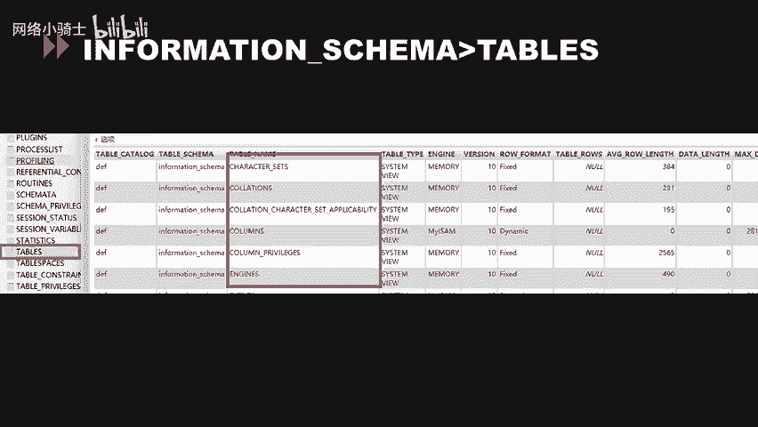

呃，我们依然可以通过select命令去查看select table name from information scheme点tableswhen tables scheme等于mysical。呃。

这条命令呢就是去列举出我们当前mateag狗数据库中的所有数据表。

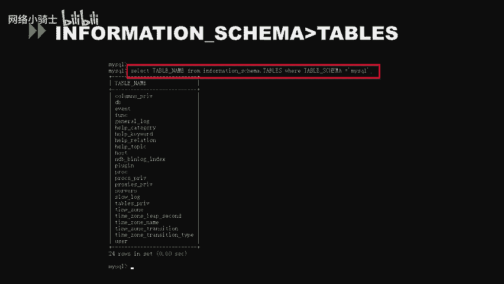

嗯，然后我们再往后看。那，这个时候呢我们接着看information scheme这个数据库中的另一张表叫cols。然后看它的第四列，第四列的名字叫collins name。呃。

这个呢就是列举出我们当前数据库下。呃，当前某一数据库表中的所有的列的名称。

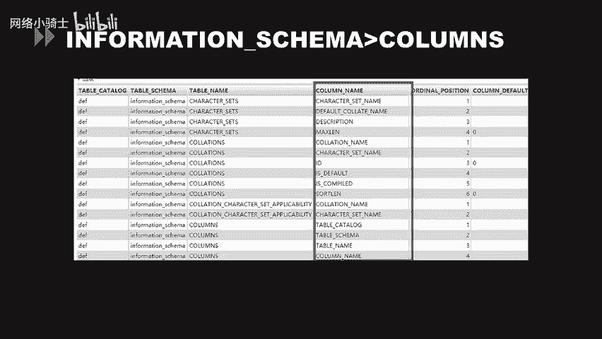

嗯，当然也可以采用 selectlect columns name from information scheme点cols whentable name等于U人。

那这条语句的意义呢就是我们把usus这个数据表中的所有列名列出出来。

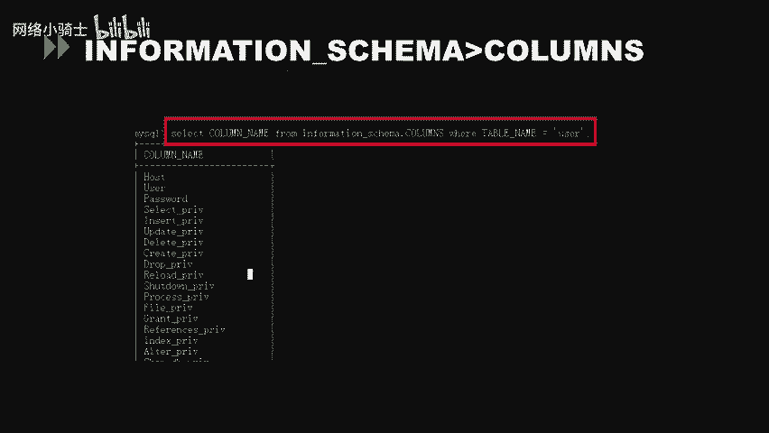

呃，下面呢我们做一个总结。在information杠s这样一个数据库中呢，有3张表是我们关注的。第一个叫skimma。smma呢去它这张表中呢记录了我们当前所有数据库名。第二张表tables。

tableable这张表呢，它记录了当前我们呃埋测中所有数据库名对应的数据表。第三个collons。collins呢这张表中记录了我们当前数据库下所有的数据库表表明对应的列名。

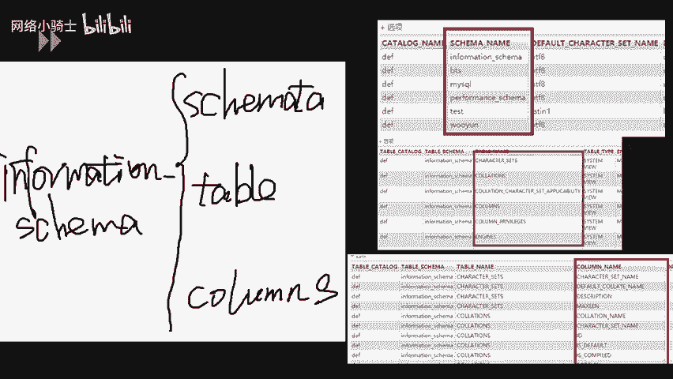

呃，了解了完那个呃我们mys数据库的一个基本结构之后，我们以呃基础的这个ciQ语句去继续向下去做。呃，第一条我们呃在数据库中列了这样一个数据表，呃select信号 from students这样一张表。

我们就是可以列看到sdentence这张表的所有内容。接下来我们用well语句去限定，单独列举出其中一行select信号 from student when name等于韩寒。这样的话。

我们直接举出数据库中韩寒这一行。然后我们在呃where字句后面去添加逻辑语句。当添入2一等于1呢，这是一个很成立的。逻辑一据，所以此时数据库返回了我们这张表中所有内容。

然后我们把逻辑语一改成2一等于二的时候呢。数据库仅仅反回了韩寒这一行内容。嗯，当我们把后面逻辑语改成and一等于2的话，此时这个逻辑语句呢是一个很不成立的呃逻辑。所以最终我们数据库不返回任何值。

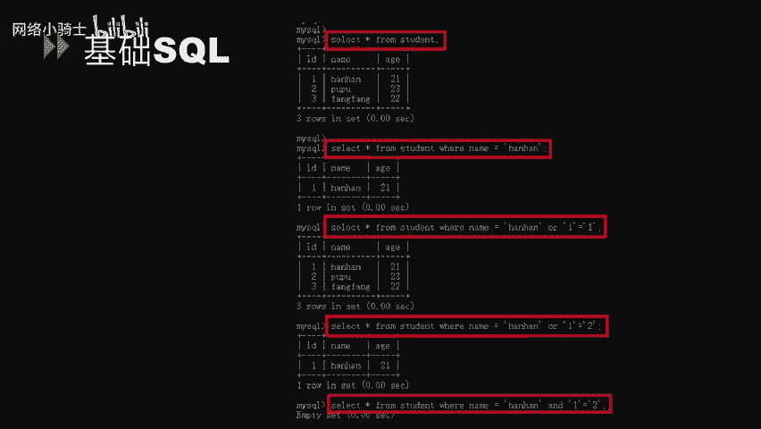

嗯，看下一个。然后我们这次时候引入al by语句。呃，我们之前说过我的外语呢不后面不光可以增加列名，也可以增加列的序序号。呃，当我们呃在那个呃语句后面添加al by等于4的时候，数据库报错了。呃。

说明这个当前的查询呢结果呢并没有4列。当我们把这个al buy改成三列之后，数据库正常返回，可以说明我们当前的数据库的个查询的一共有3列。呃，我们out buy呢显示的是那个。

那么当前查询这个slack语句中，我们所要列举出来的数据库列数。而，并不是指的是当前数据库的总列数。通过这个呢可以呃看到。我们select仅仅select name edge的时候呢，我们返通过ad呢。

仅仅是用al才可以返回正常结果。

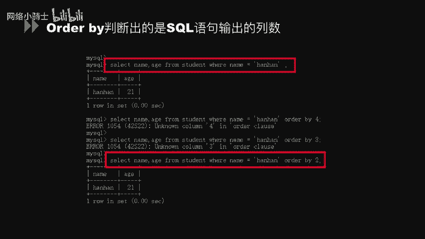

好，下面加入我们的联合查询。啊，在这里还是把联合查询的两个要求呢写在了上面。呃，第一条我们仅仅是用un优尼un尼。然后在这张两张表中呢，我们有重复的行，仅仅是用un纽元的话，它就会不会把重复的行删去。

当我们使用union2的话，它会就会把我们数据库就会把这些所有的行全部列举出来，重复的一页重复列举。

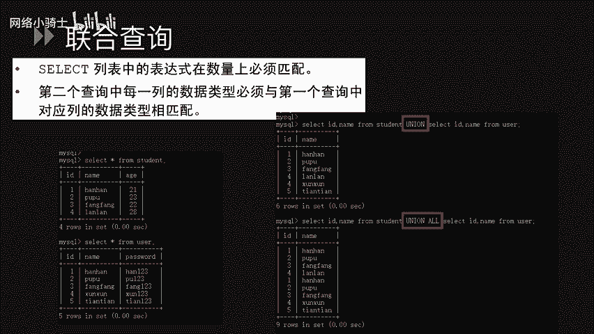

呃，下面呢我们去看一下数据库中的一些常用函数。呃，直接看select database。数据库就会返回我们当前数据库的名称。呃，这边的话是test数据库。s the version。

这次就返回了我们当前数据库的版本。嗯，select user这个时候就反回了嘛？当年数据库的用户。A select at Wilsonson complain。

呃呃OOS这个时候就返回了我们当前数据库的一个系统。操作系统。

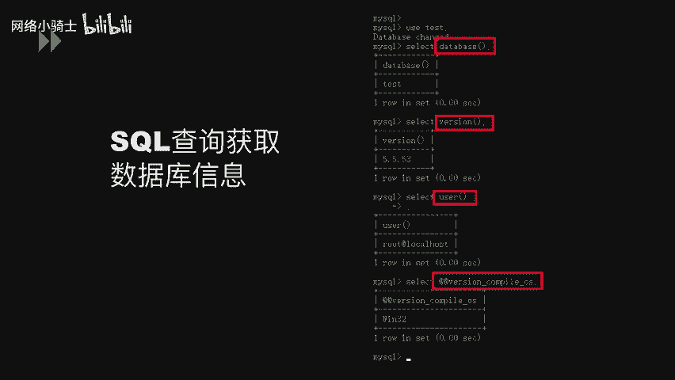

呃，接下来我们采用联合查询去呃查询我们的数据库。呃，依然易。我们students这张表进行展示。呃select name and age from students when name等于韩寒 unionselect一和2。

呃，因为数据库呢有一个隐性的那个字符体呃，字符类型的转换，它会把默认把我们的。呃，整形会转化成字符串型。所以在这里呢我们当我们s一和的时候。数据估计会把我们返回的内容去集合到一张表中。

可以看到他返回了韩寒21和一和2都返回了出回来。呃，第二条我们去。嗯，去把s点和我们的优着这两张表呢去做一个联合查询。呃，可以看到呢。

它啊在第二这个返回结果中已经把我们第二个联合查询中的name幕和password从这个user数据库这种user这张表中呢去提取了出来。呃，接下来我们可以在slaag呢后面呢去具体添加我们的参数。

我们在呃union stack后面直接添加daatabbasewa anduser，它就会在这个联合查询的表中去返回我们的。数据库名呃数据库版本和当前用户。

呃，下面我们再看呃out by注入。嗯，al呢我们代表的是我们要使使用哪一列对当前的参与结构进行排序。只有我们输入的列的序号是呃小于等于我们查询结果中的列的数呃，叙述的时候，我们呃数据库才会正常返回。

在这个表中呢，我们分别以outY123进行排序。因为我们当前查询是三列，所以它都可以正常返回。

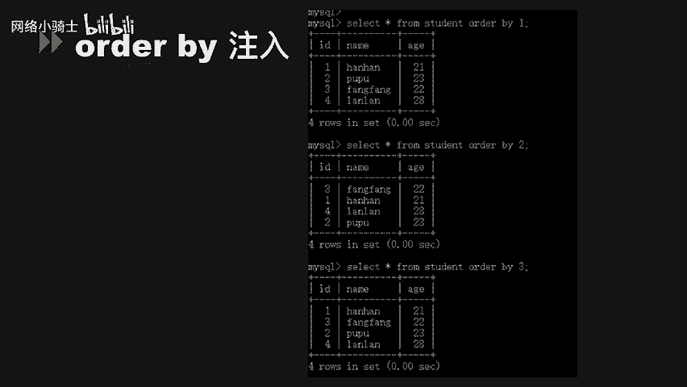

呃，下面呢我们做一个。这样的操作去丰富我们al by后面的一个呃逻辑语句的判断。首先我们在al特曼后面添加if副语句，if符括号一等于一逗号name幕逗号H这条语句的判断就是如果一等于一这个逻辑成立。

那我们就以内幕排序。如果一等于一这个逻辑不成立，那我们就以A值排序。可以看第一个查询结果呃，一等于一是成立的那我们就数据库动返回结果就与内部进行排选。

看第二条if一等于2逻辑结果是错误的那这个返回结果就以A进行培训。呃，再往下我们去丰富我们的od value语后面的逻辑语句。使用ifn。呃，指的是一嗯。括号no和name。代表的是如果。呃。

第一个呃字符是n的话，我们就以。呃，内幕排序。呃，如果呃第一个是n的话，我们第二条语句就是以age进行排序。所以这两个结果就是我们分别是以name and那个age进行排序的。

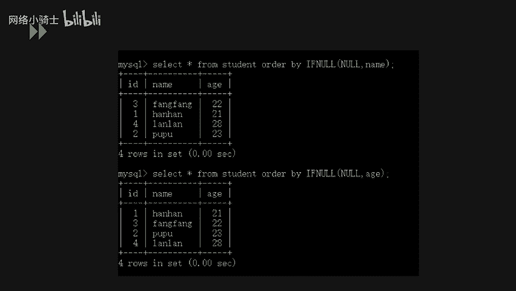

呃，再往下看，我们继续去丰富我们的逻辑判断语句。此时我们在word web后面添加if括号一等于一逗号一呃，括号se一uion select2括号。呃，我们看s一 unions2。

我们数据库的返回结果应该是两行一和2。而返回结果如果是一行两行的话，我们是在接在奥d曼后面的时候，数据库是不能正常执行的，所以就是只有。呃，因为后面这个判断语句一等于一成立的时候，我们以第一列进行排序。

我们的数据库才会正常返回。当我们在衣服后面输入的语句是一等于二的时候，我们呃。呃，aly后面就最终添加的就是一和二两行去进行排序。所以这个时候数据库会报出一个错误。然后继续丰富我们的逻辑语句。

此时我们把呃。把逻辑语对句的第二个嗯指南，我们改成seect一 from information scheme点tables。这种情况呢，这个呢就是呃我们这条鱼会返回。呃。

所有的呃一的行数呢是整和我们inform scheme table这个呃表中的行数是相同的，它会返回啊一列一列都是一的一个呃数据库数据表。所以如果是返回个一列的一个一的话，它接在al外语句之后。

同样执行也会报错。所以这条语句是，只有我们在一等于这个逻辑语句成立的时候，我们以第一列进行排序。然后这个逻辑语句可以正常执行，然后数据库会返回出正常结果。如果是if后面添一等于二的时候。

数据库会进行报错。呃，下面继续吩咐我们的呃语句，我们把奥曼后面换成slect一呃，reEXPif一等于一逗号一呃，逗号呃，0差00，这个是代表16进制的0。呃，一辅一等于一的时候。

我们就会呃这个if服语句就得到的最终结果是一slect一呃，re eXPE的话，我们最终正则匹配的代表的是一。所以我们最终的out by后面更加的是一个一以第一列进行排序。所以这个。呃。

数据库会正常返回。看第二个命令。第二个命令，衣服后面接着是一等于2。所以我们会 if附语句得最终得到的结果是一个00呃slect一呃，reg eXP0据正点表达的话，最终得到的结果是一个0。

所以ald by后面我们添加零以第零页进行排序，这个数据库就会进行报错。

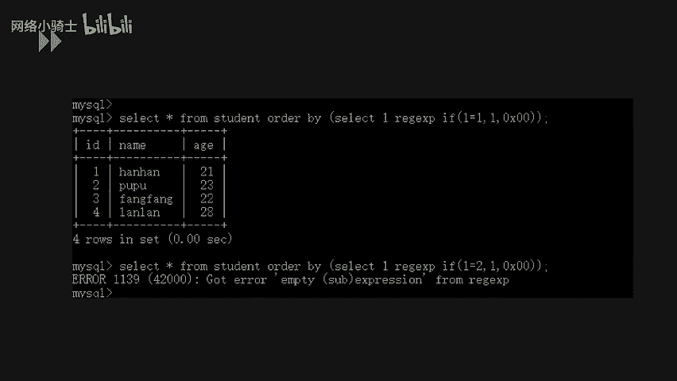

呃，下面我们继续呃看我们这个呃reEXP这样一个操作。

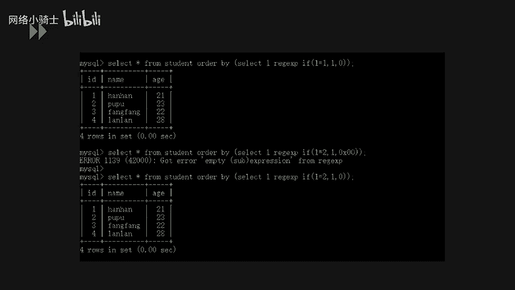

呃，下面我们看一个基于时间的忙作。这个时候我们在ady语句后面添入if一等于2逗号一，逗号sleep22秒。嗯，当呃衣服后面增加的是一等于二的时候，我们就会最终得到的结果就是al后面添加的是sleep。

2就是每做一次查询我们数据库休眠2秒。所以最终查询出来结果呢，我们数据库一共用了8秒。如果我们接的是if一等于一。那等话我们最终得到的结果就是ad外后面是添加的是一底第一列进行排序。此时嗯。

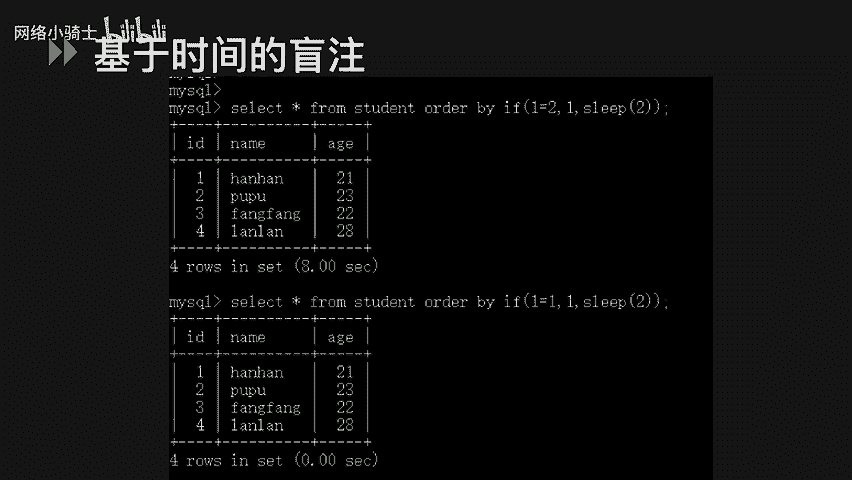

呃，数据库返回结果呢不做延时。呃，下面我们看一下刚才提到的呃regEXP这样一个正则表达的返回结果。select一呃reg eXP一的话，我们返回的结果正则表达结果是一。

slect一呃re eEXP的话呃，零的话，我们最终讲返回结果是0。呃，s一reESP4的话，最终返回结果也是0。所以只有我们的sack一呃，s后面的数字和ragEP后面的数字相同的时候。

我们最终返回结果才是一，这个是一个正则表达的一个结果。

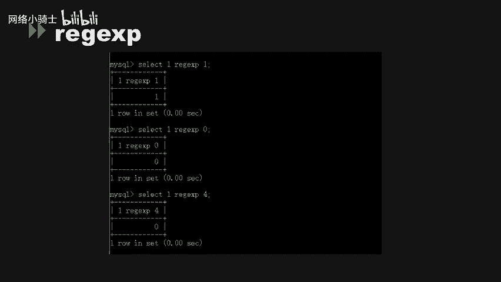

呃，下面呢我们继续去丰富我们的逻辑判断语句。我们直接看。我们直接看呃if后面的这个语句。我们刚才提到了user呢会我们希用优er函数会数据库会返回我们当前的数据库用户。呃。

s郡呢是一个对字符串的一个处理函数。呃，就比如说嗯。在这里，我们ss卷优er这个函数优er等我们换成当前数据库的一个用户。呃，然后逗号一逗号一，这个代表的就是我们去分割当前的一个用户名。从第一位开始。

我们取一位。然后去和我们后面的这个。等号后面的一个字母去进行判断。在这里呢，我们呃假设知道我们当前。数据库的用户是root。呃，所以就是当我们。呃，去对这个root进行分割。从它第一位开始，我们取一位。

它的第一个字母应该是R。所以呃对于这种情况，就是看我们第四条语句，s斯优人呃，一逗号一等于R的时候，我们这条呃逻迂辅的这个逻辑语句是成立的，所以它就应该以。if附语句呢就应该返回一返回一的时候。

我们再看这个slect就是slect一rEXP等于一。最终我们al by后面跟的就是一个E以第一列排序。所以这个时候数据库返回正常的结果。而，当我们看前三条，我们。呃。

去通过三步试卷去切割我们数据库名的时候，我们得到的逻辑语句其实都是错误的。所以最终一复语句的结果是一个零呃。一和零呢做一个正则匹配，最终得到结果也是0。

所以当我们在wordbe后面增加的是一个添加的是一个零排序的话，数据库会报错。我们可以通过这种方式去不断的便利我们数据库当前用户名的一个字母，然后最终可以得到我们当前数据库的用户名。

这是一种暴力拆解的方式，也是一种便利。就是直接对我们对数据库中的每一个字母的位数进行一个便利，最终得到了我们的数据库名。呃，接下来我们拆解到了我们的第一数据库用户。呃。

名的第一个字母是R之后我们继续对进行便利。我们去便利一下数据库呃，用户名的呃，第二个字母是什么？那我们就采用s doing嗯括号user呃2-1。

然后就是我们取取出我们当前数据库用户名的第二个字母和我们呃去。呃，便利我们从呃A开始变历，直到遍异到O的时候，发现我们数据库正常返回，这个代表的就是我们当前数据库用户名的第二个字母是O。

这也就对应了我们刚才我们呃知道的那个我们当前的数据库用户名是root。所以当我们配别到O的时候，它数据库正常返回了。然后呃按照这个方法，我们再去便利呃数据库用户名的第三个字母，第四个字母。

然后最终把我们整个数据库用户名的呃。用户名对暴力破解出来。

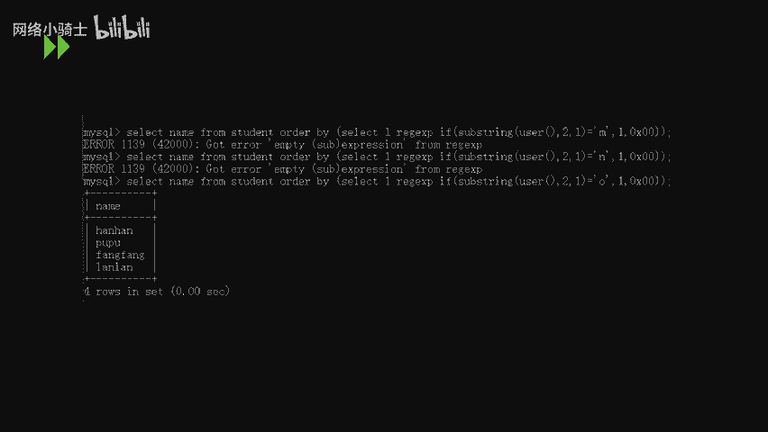

呃，下面我们再往后看。呃，这个时候呢就用到了我们刚才呃在开始的时候说到了那个数据库的一个mysl数据库的一个结构。

我们采用select table name from information scheme点tables whentable scheme等于table baselimit01。我们列举出来。

当前数据库。名下面的数据库的第一个表明，在这里可以看到的是一个呃sdent。就代表如果我们当年数据库的名称是test的。那我们对应的test的数据库下的第一个数据库，数据表明是sdent。

可以在三上面的那张图中看到。如果我们列举出两行来的话，就采用limit。呃，0逗号2，这样的话我们把。呃，当前数据库下test的数据库下的呃两个表明都全部列举出来，分别是student和user。

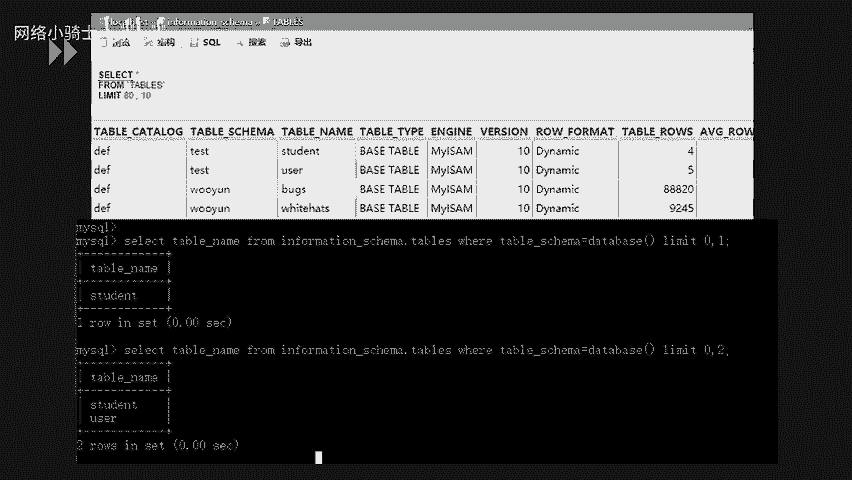

呃，下面呢依然我们通过刚才使用到的这个便利方法去。便利我们呃当前的一个数据表明。呃，这个时候呢我们把刚才。呃，sub后面的那个呃优er这个。呃。

函数呢替换成select table name from information scheme tape点tables。one table呃杠s等于dabbaselimit01。

我们刚才呃通过在数据库中执行直接执行这条命令的时候，显示出来我们的。当前的数据表示student。所以我们通过这个命令是s斯卷去分割我们的这个1点的时候，呃，我们取第一位的时候。

只有在我们取第一位的第一个字母，我们后面等于S的时候，数据库才会正常返回结果。就好比我们图中的第二条语句。我们便历出了当前数据呃表的那个。第一个字母是S之后，我们再去遍历第二个字母。

直接在三分0元后面呃跟2一就可以了。通过这种方式呢，我们可以去变译出来当前数据表的一个表明。

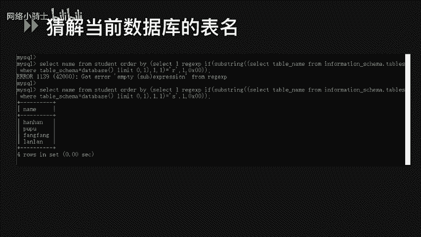

呃，再往后看，我们拆解出了当前数据表的一个表名之后，我们就可以去拆解当前数据表下的一个列。列明呢我们采用同样的方法。在这里大家可以去详细看一下这条数据库执行矩因为比较长，但是它的逻辑关系还是比较清楚。

我们依然去。呃，用命令去显示出我们当前数据库下的某一列名，然后通过sus去对这个列。去进行分割，然后对列的每一个字母去进行便利，最终得到我们当前数据表下的列明。呃。

以上呢我们可以理解为通过mys数据库的一个基本结构。还还有就是我们利用myac数据库的一些函数，去便利出我们的当前数据库当前数据表和当前数据表的每一个列名的方式。

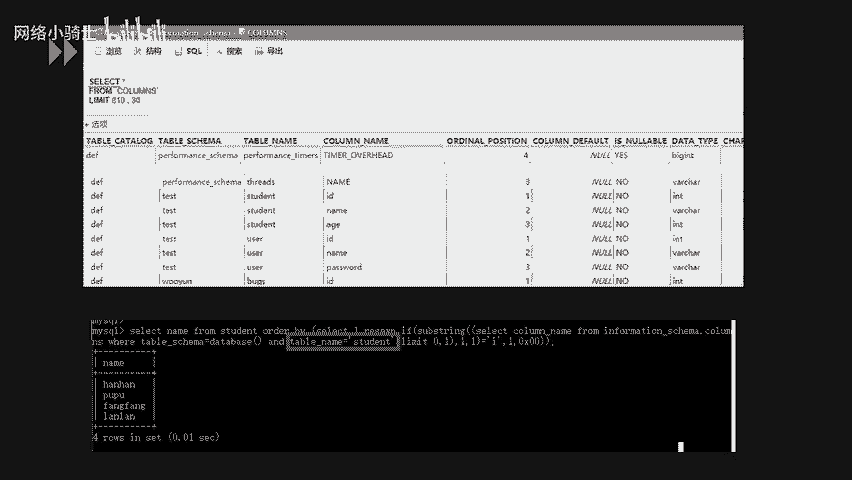

下面呢我们做一个简单的应用。呃，可以看到我们这个时候呢是对这个URL下面的1个ID做一个sr注入。正常情况下，ID后面跟的是一个整数是14。呃，当ID等于14的时候。

这边返回的一个结果可以看到右边这张图。当我们在ID后面添加end啊，一等于一的时候。我们。返回结果正常，因为我们此时出的逻辑语句是一个成立语句，所以反回结果正常。呃，下面我们在后面添加end一等于2。

因为这个时候逻辑局已经是判断错误了。我们预期数据库应该不会返回结果。可以看到这张图中，数据库也确实没有返回结果。啊，接下来我们通过嗯and这样一个逻辑符去大致确认了这一点存在注入的时候。

我们就要通过outd外语去去判断我们当前这个呃数据库查询的具体列数。嗯，当我们在后面添加al by等于5的时候，数据库没有返回结果，说明我们当前的列数小于5列。然后我们改成我的Y等于4。

此时返回结果相同了。这样的话就可以肯定我们当前这条语句在数据库中执行的时候返回的列数有4例。

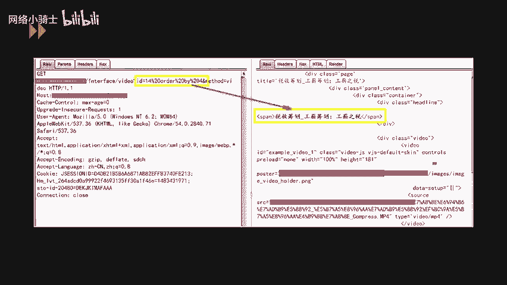

呃，当我们呃知道了这个具体返回的列数的时候，我们就可以采用联合查询去进行呃呃返回去进行注入了。此时我们在联合查询后面，直接在ID后面添加呃uions1234。然后我们关注反馈结果。

反馈结果这边列举的是一个3。这个就代表我们的。通过联合查询判断，我们的第二条查询语句中的第三列是会回显到我们。呃，符客户端的。所以我们想查到的具体信息，我们就需要在第三列这个地方做文档了。

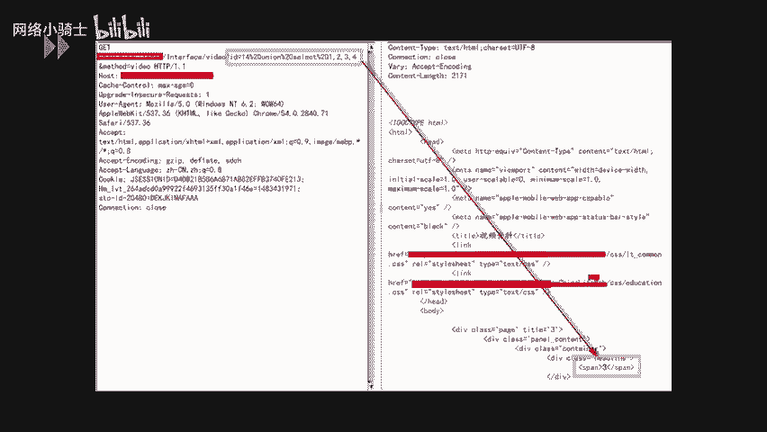

呃，再往下看，我们呃得到了第三列是会返回结果的，我们就做凭经验。这边的话我是凭经验作用了一个联合查询，直接select12后面跟name哎，逗号4from amin。这个我是凭经验做出来。

所以它也正好有这样一张表，这个表中还有一个内幕这样一个字段。所以它最终返回了addmin表中的一个用户名，就是在这边显示的addaddmin22。然后我们猜测了它有name之后。

我们去猜测它是不是有password呢啊，结果呢也很惊奇的啊存在。我们这个通过这个联合查询去返回了呃admin这张表中的一个password字段，可以看到是以下的一个呃MD5字符串。

我通过验证之后是MD5字符串。呃，再往下看，我们就是在刚才所说的我们第三列返回，我们就可以在第三列去添加我们呃数据库的一个函数。在这边添加了呃atad wsoncomp杠OS返回了linux。

然后我们在后面把第三页只要换成atad wasn的时候，它返回了5。6。25杠log。通过这些信息呢，基本就判断了我们后台数据库呢是一个卖测ical数据库。并且我们得到了呃当前的一个呃用户名和密码。

以上呢就是我们。呃，搜第三部分cicle查询和首度执行的一个全部内容。呃，在这一个部分呢，我就通过我们数据库。呃，直接的一个回显输入我们的平常的一个手工测试语句。

可以看到我们这个具体的测试语句在数据库中的直接执行和直接回显，从而去让我们去更好的理解s个注入这样一个原理。

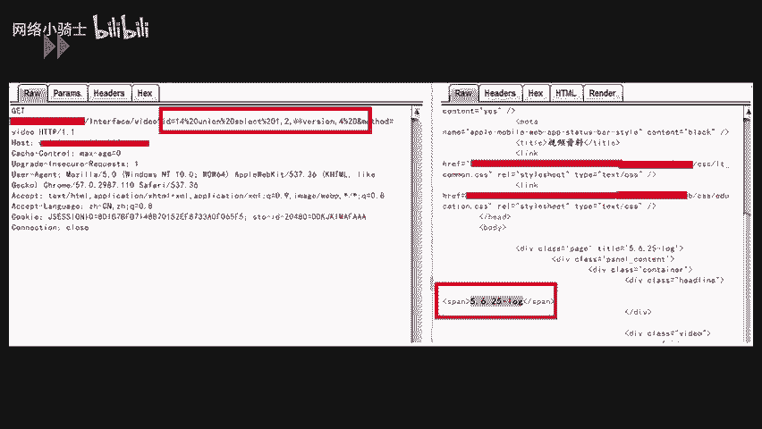

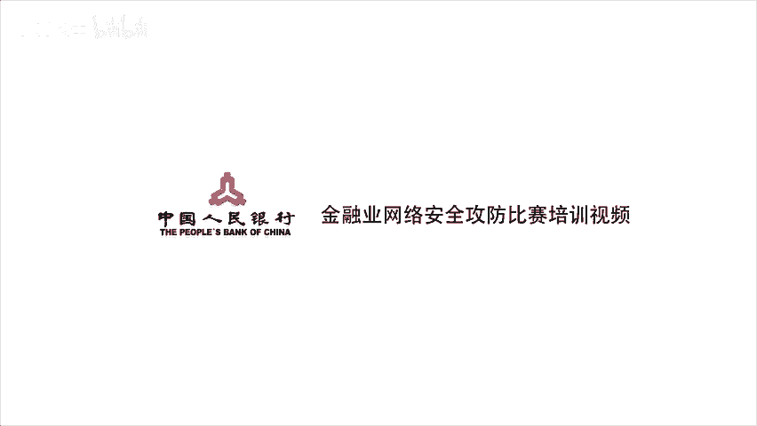