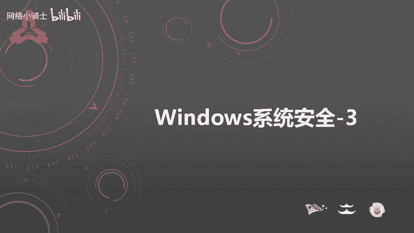
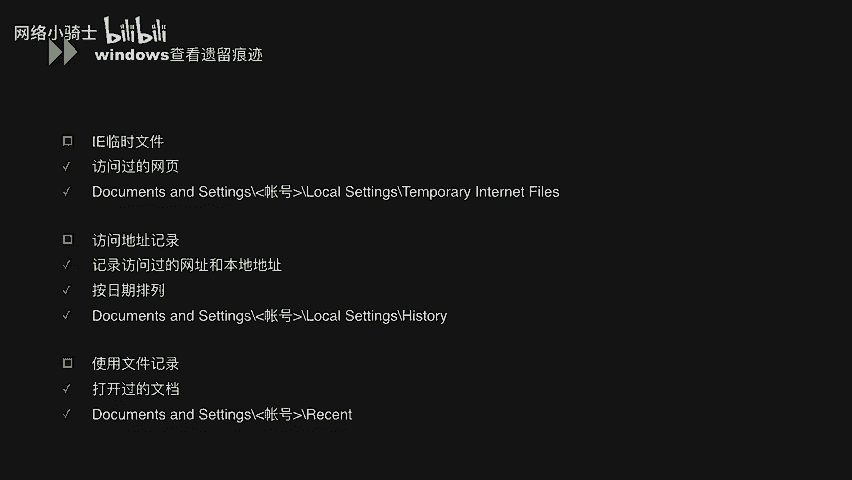
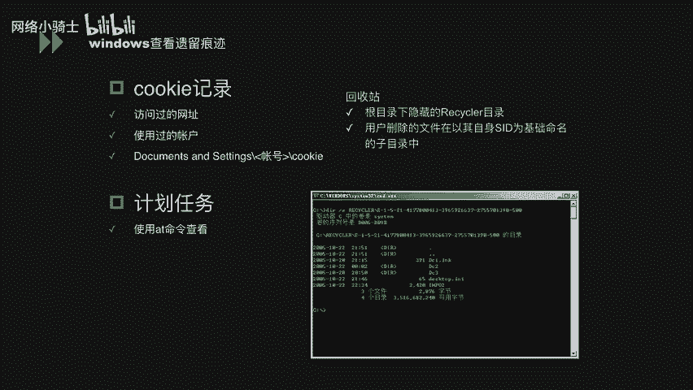
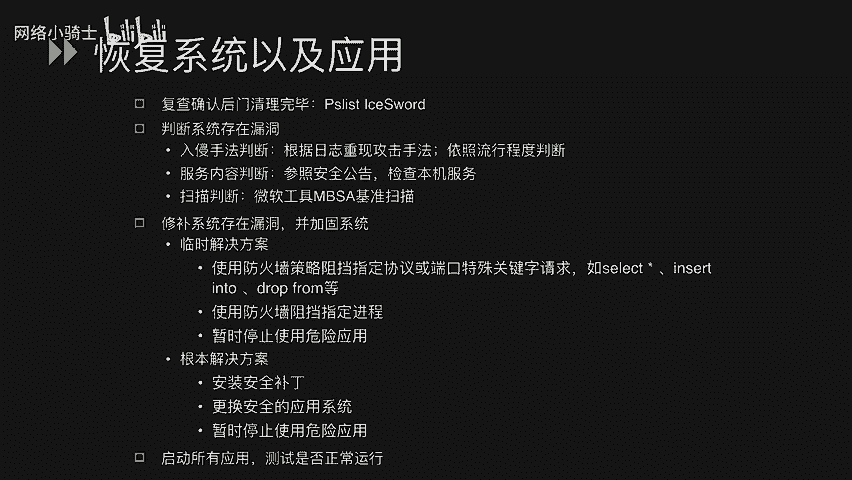

# CTF夺旗赛教程100集（全）从零基础入门到CTF竞赛大神看这套视频就够了！ - P40：42.43.Windows系统安全_3 - CTF入门教学 - BV1MBiuexEmh

大家好，呃，这节课呢我们来学习windows系统安全。下面呢我们来进行windows系统安全的第三个方面的内容。windows入侵调查。在这一部分中呢，我把它分为了三个小节，分别是A及早的发现系统异常。

呃，B查看日志分析入侵情况啊，C恢复系统以及我们的应用程序。呃，首先我们看第一小节是及早的发现系统异常。呃，我在这里列举出来，我们可以通过哪些方式去尽早的发现我们的系统的异常呢？

首先看第一个是我们的系统启动的方面，就比如说我们这里列举了几点，比如说系统日志记录，我们系统的已经运行的时间，包括网络的一个连接时间。这些都是系统给我们比较直观的一些信息。我们可以判断它这。

根据这些信据判断这段时间系统有没有重新启动等等的一些记录。呃，第二第二部分是系统资源。呃，如果我们出现这样的一些异常的话，可能有这方面的一些不同。比如说我们的进程占用了大批量CPU空间是。呃。

进程消耗了大量的物理内存，包括我们的磁盘在不断的呃磁盘的空间在不断的减小，不断的增加一些垃圾文件。第三个是网络流量的异常。比如我们的系统收到了大量的SYN的一些数据包，包括SMP数据包。

还有可能其他的一些嗯比如说ddo这样一些流量的攻击数据包。这个三部分呢是直接从我们系统方面去发现我们系统的异常。当然我们也可以从其他方面，比如说我们边界部署的一些安全产品，包括我们的IPS。

还有wa这样一些防火墙呢去发现我们的一这些系统遭受攻击的一些异常。呃最后一个呢我涉及到是其他途径。就比如说我们可能其他的管理员像我们这个安全人员说哎我哪个系统出现什么异常了。

使用功能上出现了一些功能上出现了一些问题。这个呢也是我们发现系统异常的一个途径。呃，下面呢就是我们如果发现了呃系统异常的话，我们可以去呃搜集一些windows上的一些遗留的一些痕迹。

这些呢可能就是无论是攻击者或者是我们的正常管理员在使用系统上都会留下的一些痕迹。我们去看一下哪些痕迹可以作为我们的一些那些排查的一些根据呢。首先看第一个就是IE临时文件。呃。

这个文件中呢就会记录着你所访问过的一些网页信息。嗯，第二个呃访问地址的记录。呃，这些呢就可以记录到我们一些访问的一些访问过的网址，包括我们访问到本地的地址，就是我们的资源管理权等一些文件夹。

这些信息都可以呃都可以记录下来。包括它可以按日期进行排序进行，让我们去更方便的查看。呃，下一个呃使用过的文档记录，就比如说我们嗯登录过系统之后，打开了哪些文档，修改了哪些文档，呃，删除或者移动哪些文档。

这些都可以在给这个文件夹文件夹下记录。

嗯，酷给信息酷给记录信息呢主要是在我们的浏览器中会在我们访问网站的时候，登录之后会保存在浏览器本地。它可以记录到我们访问过的网址，还有这个使用的账户。嗯，再往下计划任务。

计划任务就是我们可以直接就接通过艾命令进行查看，它可能就是有。我们管理员或者工击组在登录系统之后做呃列出的一个呃定时任务，可以让他定时执行，然后完成我们一系列的操作。呃，当然了还可以查看我们的回收站。

回收站呢跟目录下隐藏的这个呃隐藏的这个目录，包括可能有我们的这种回收站中呃，有没有及时清理到的一些文件都可以在回收站中看到。

呃，再往下看，我们可以再往看那个注册表。注册表中呢可以查看我们曾经存在的账户，包括我们之前说过的，我们在注册表中可以看到一个完全隐藏的账号。还有就是注册本中可以看到我们曾经安装过的软件。呃，作为工击者。

可能我安装完一个软件之后，我用过之后对它进行了一个删除操作。在注册表中是可以看到的。呃，再往下检查文交换文件。我们检查windows这个目录下，如果账号存在以该账号命名的子目录，如不存在。呃。

则该账号还没有登录过系统。如果我们的用户目录存在，而该账号不在用户列表中呢，说明用户ID曾经存在，而且已经被删除。呃，以上呢就是我们及早的去发现这个系统被的异常的一些方法。呃。

再往下我们看一下查看日志分析的一些路径情况。呃，分析入侵情况。我们首先查看我们的审核日志，审核日志的话，在这里列举出来比较急的呀，包括系统日志、应用日志、安全性日志啊web日志FTP日志。

还有我们可能安装的数据库的应用日志。嗯，是看完日子之后，我们可以按刚才所说的那个我们看攻击者可能遗留下的痕迹，通过这些痕迹去分析我们被入侵的原因，然后弥补我们的漏洞。那。

这个呢是我们一个分期入侵的一个基本流程。啊，下面呢我们也单独拿出那个windows呃登录类型以及安全日志的中的一个解析。这个呢就是。windows的登录在我们安全日志中的一个记录。

可以看到在这边列举出来的123456个不同的登录类型。每个登录类型呢就是。记录着我们不同的登录方式。登录类型时，远程交互。当你使用终端服务，远程桌面或远程协助访问计算机时windows将其标志为类型时。

就是我们可以根据这个类型去判断。如果一个攻击者登录到我们的服务器上了，我们可以根据这个登录日志中所记录的登录类型来判断它是以怎样一种方式去登录到我们服务器上的。好，下面看一下我们审核日志。

具体看一下我们审核日志应该看哪些方面。呃，首先是我们如果有这个呃完备的审核日志的一个首要条件。首先是我们要第一点就是我们要日志要开启这个记录这个审核的功能。这是第一点呃，第二点就是我们的日志保存能力。

呃，我们的windows上默认的日志保存时间会比较短，我们需要可能就是自己去行设置一个保存时间，或者是我们要单独的用一台远程服务器来做日志服务器，才能完整的记录一下我们当前服务器中的日志信息。好。

下面我们看一下一系统日志。呃，系统日呢记录了设备的我们的驱动状态，系统的进程、服务状态的改变，以及我们补丁的安安装情况。嗯，可能能够获取被攻击的时间及方法的有下面几种时刻。呃。

第一就是某时刻呢我们系统重启了。呃，某时某刻，我们系统服务出错呃重启了。呃，某时某刻，我们的系统弹出对话框，就比如说你的呃终端连接人超过限制，那我就不能再次登录了。呃，下面看应用程序。

我们在应用程序日志中可以获取到哪些信息呢？比如说我们记录用户应用程序的活动情况。那可能能够获取我们会攻击者的时间以及方法有哪些呢？就比如说我们某时刻防火墙被关闭了。我们杀毒软件自动防护功能被禁止了。

某时刻杀毒软件警告发现病毒。某时刻安装或者删除了软件。嗯，下面是安全性日证。安全性日证呢记录了系统使用的登录进程、特权使用、安全审核以及审核结果。呃，那安全日子可能和获取的时间和方法有哪些呢？

比如某时某刻，某某用户登录了系统成功。某时某刻，登录藏试系统失败。而且还有某时某刻用户更改了我们的审核策略。呃，下面我们看web日志呃web日志呢，这里主要以IIS的日志为主。

因为我们windows的话，ISOS主要装在我们的windows操作系统下面。我们ISIS可以去查看它的呃特定请求。特定请求呢就是记录在我们请求的UIL里面。

比如在这里有比较明显的特征的有呃上传下载请求，它可能就涉及到一些up file点AP呃，up点APdownload点AP这样一些比较呃关键的一些字符中。呃，第二个是特殊关键字的请求。

如呃select呃insert into呃d form这些可能就是数据库的一些呃circle语句。呃，下面是异常请求的参数，如我们的单引号啊那个呃。嗯。

斜个呃那个横杠呃1等1101这些呢就是攻击者在在测试我们系统中可能存在注入的问题时候用到的测试语句。这些如果我们的呃web日中可能出现这种情况呢，可能就是攻击者正在尝试去攻击我们的服务器。啊。

除了特略请求，我们下面还列举了一种叫服务器代码。呃，服务器代码呢就是我们的HTT的一个返回请求的一个代码。呃，这个代码代表了我们比如说我们200到290代表我们呃用户请求成功呃。

400到4009这种带货表的客户端错误。啊，500到599呢就代表了服务器端的错误。我们通过这些呃错误呢，也可以去呃简单的去判断这个用户是一个正常的用户访问呢是一个攻击者的一个访问。呃。

当我们通过这些痕迹和日志去发现我们的。呃，这个呃操作系统被入侵的痕迹之后，我们怎样去。🎼进进行那个呃攻击行为的一个。嗯，当我们去发现我们通过。呃，当我们通过日志，还有一些各种各样的呃遗留痕迹等信息。

发现我们系统被攻击之后，我们应该怎样去把它的那个呃具体的攻击者的攻击方式找到，并最终让我们的系统正常运行呢？我们再看下一个恢复系统以及应用。呃，恢复系统的应用啊，我列出了以下4点。呃，第一个就是我们。

我们找到了攻击者的这个攻击行为之后，他有没有在我们系统上安装后门。我们通过复查，我们确认后门已经删除完毕了。呃，第二个就是判断我们系统存限漏洞。我们通过日入侵手法的判断。

根据日志啊、工具手日志啊去判断我们是否有可能存在注入，或者是我们的系统存在漏洞这样方式。呃，服务内容判断，参照我们的安全公告和也检查我们本金的服务是否存在漏洞。嗯，扫描判断。

根据我们微软的一些呃工具啊去进行基准扫描。呃，第三个呃，我们发现了这个系统的漏洞之后，我们应该怎样去修补存在的漏洞，并且加固我们现有呃已有系统呢？呃，第一个采用的就是临时解决方案，这个是呃。呃。

最初的一个解决方案，包括可以使用防火墙这些呃去阻止我们的这样一些敏感字符，阻挡我们的指间进程。还有就是阻止我们使用应用这几个方面。呃，当然临时解决方案是不安全的，我们还是要采用那个根本解决方案。

根本解决方案这里列出来几点呢，包括安装我们的呃系统服务的安装补丁，更换安全的应用系统，或者是暂时停止掉我们所使用的这些危险应用。呃，最后就是当我们这些启动了这些输入应用之后。

测试我们这些系统是否还这个安全的正常的运行。

嗯，下面呢我们回顾一下。在第三部分内容就是windows。呃，入侵检查这方面呢，我们一共说了这个及早的发现我们的系统异常。呃，查看日志分析我们的入线情况，还有就是恢复系统以及我们的应用，让他们继续。

本地的运行。嗯，好，这一节的内容呢就到这里。好，感谢大家。

