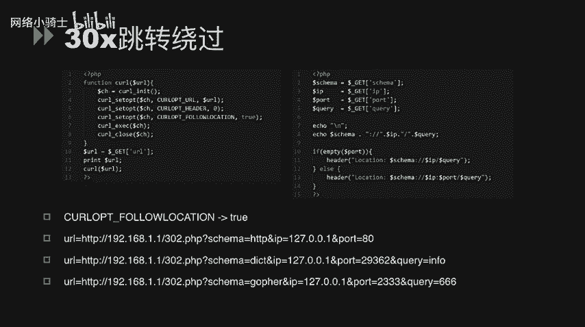
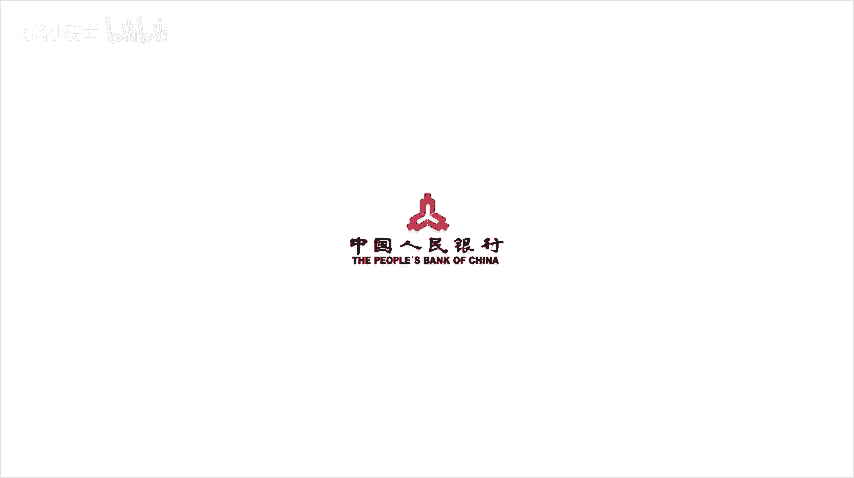

# CTF夺旗赛教程100集（全）从零基础入门到CTF竞赛大神看这套视频就够了！ - P48：51.51.SSRF - CTF入门教学 - BV1MBiuexEmh

今天我们讲述一下在CTF当中SSF漏洞的利用。

SSF漏洞，也就是服务端请求伪造漏洞。这是一种由攻击者构造，形成一由服务端发起请求的一个安全漏洞。一般情况下，SSF攻击的目标是从外网无法访问的内部系统。而大部分word服务框架当中。

wordvo服务器自身都可以访问互联网和服务器所在的内网网站。MSSRF形成的原因大多数是由于服务端提供了从其他服务器应用获取数据的功能。且没有对目标地址做过滤和限制。

而且这个目标地址是可以由用户输入可控的。比如从指定URU地址获取网页文本内容，加载指定地址的图片下载等等。那么在CTF当中，有这几个函数，往往可能会引起SSF漏洞。那么我们从代码审计的角度来看。

这个问题的话，一般有这三个函数。第一个是fi get contents，这是一个去读取文本文文本文件的一个函数。在这个demo当中，我们可以看到。Fge contents。

他获取了一个从post数据提交当中的UIL地址。在PS视P官方手册当中，我们可以知道fire get content不仅可以去读取文本文件的内容，而且还可以将URL当做一个文本文件来进行读取。

所以说它可以进行远程的URL连接。那么这边我们就可以通过。对URL这个参数输入一个内网地址，获取一个。可控的内网地址的服务器的服务提供内容。那么接下来还有一个if so open这个函数。

f so open函数主要用于实现获取用户定制的这个URL的数据。它可能是文件或者HTML这个函数会使用socket跟服务器建立TCP连接，传输原始数据。我们可以看到在这个demo当中。

我们在get file这个函数当中使用了ifso open这个。进行set的远程连接的函数。那也就是说我们将get file的三个参数。中的host和port参数传入给ifso open这个函数。

那么我们就可以通过这个函数。与内网的一些。服务器进行scket的连接，同时获取服务器上面的资源内容。造成了SSRlogo。呃，第三个函数。Ky， BXEC。

那么这个函数它可以使用cur这个命令进行数据获取。在这个demo当中，我们可以看到kerEXEC对变量cur objectject进行了。函数执行。那这个co objectject实际上是。

初始化了1个URL地址。那么我们可以通过这样的方式提交一个URL的po参数。那这个URL参数可以是一个内网的地址。那我们通过这样的方式去获取内网的一个服务器的数据资源。那么针对SSR漏洞还有很多种。

对防御的绕过方式。其中，针对IP，我们可以通过IP编码绕过以及XIP点IO这个特殊的域名。来照顾。那么XIP点IO这个域名，实际上呃它是一个特殊的域名。我们在XIP点IO前面加入任何的。IP地址。

那么直接访问的就是这个IP地址。举一个例子，我们去访问1个3W点百度点com。点192。168。1。1点XIP点IO这么一长串的。域名。那么实际上最后访问解析得到的是谁呢？

实际上是访问到离XIP点IO最近的那个IP地址，也就是192。168。1。1，从而绕过了一些IP限制IP绕。防御。那么我还我们还可以通过将IP地址转化为。十进制方式来进行绕果。协议变换。

除了我们平时用的HTTP协议，HTTPS协议，我们还可以使用dt协议graphffer协议以及fi协议，对内网的一些资源进行读取。那么这边重点讲一下gofer型。高fer协议它是在HTTP协议出现之前。

在internet上常见且常用的一个协议。但goer协议并没有完全消失。goer协议可以做很多事情，特别是在SSF当中可以发挥很多重要的作用。我们可以利用这个协议来攻击内网的一些脆弱的服务。

比如说我们在信息泄露当中提到的一些未授权访问服务。STP Tnet radius， never cash。momgoDB这些也可以进行get post的请求。

那这些因素在一定程度上决定了goffer在SSF当中的重要作用。那我们下面以。攻击内网redius为例，看一下如何使用goffer这么一个协议。我们看这个de。在redus任意文件写入。

现在已经成为了一个非常常见的一个漏洞。一般内网中会存在root权限运行的redius。那，利用goffer协议攻击内网上的redius，的无一说可以是隔栅打牛直杀内网。

那所以需要先了解一下通常攻击redius的命令。在之前我们信息泄露的课程当中，我们有提到过关于如果通过reds微授权漏洞来get share。我们常常使用的一些。命令包括有set mini和get命。

在这里我们只需要将这些redius mini转化为goffer可用的协议即可。我们看这个demo，我们使用curXEC执行了。CH这个变量也就是执行了一个。URL地址的变量。

然后我们又列出了如何使用readder get share的一些readers的命。然后我们将这些命令可以直接转化为goer协议。那通过这样的grapher协议，我们直接去访问它，那么就可以。

达到一键化。拿下内网redius shirt。效果。那针对一些防御措施，比如说一些函数防御，我们也有一些白pass的手段。比如说针对filterva这么一个函数。

feerva它实际上是对URL进行一个check。而pass uURL它会获取URL的host，然后针对host进行智能匹配。判断是否以sky sick点top来结尾。这是我们。PPT里面所展示的这个。

PHP demo的。一个业务逻辑过程。那如何去攻击这一个。点望啊。我们可以看到我们在PPT下面给出了一个payload。我们使用协议为0这个特殊的协议方式来去访问。这个页面。

那零协议其实是对PHP当中filterva这个函数的一个完美绕过。通过这样子的访问，我们既可以绕过振则匹配，必须以skys点top为结尾。而且达到了可以去获取192。168。1。1这么一个服务器的。

网页文件内容。那接下来我们看一下，在URU定制规范当中。完整的URL应该是这么一个形式。首先它有一个协议头。其次，他有一个用户密码的输入。然后他会有一个。必不可少的主机域名。和它的端口。啊。

接下来是他的路径。以及它的参数。和最后他的一个哈希片段。也就是哈西毛。那我们举个例子那。协议对应的是HTPS，然后用户密密码就是root123456。那主机域名就是example点com端口是80。

路径是test点PHP。参数是P，参数值是B。那么哈希毛是哈希。就是一个这是一个完整的UL。我们可以通过这种完整的URL来绕过一些。缺陷的这个匹配。在PSV当中。有一个函数叫pase uL。

这个pase uL是匹配的at。这个后面符合格式的host，而且需要注意的是，它匹配的是最后一个at特后面所符合格式的host。

而li curllicur实际上就是我们那个linux下面的 curl命令，它匹配的是第一个at后面的符合格式的host。当这两个。东西结合在一起使用的时候，由于他们的解析位置不同，会导致一些。

很奇怪的现象发生。我们把刚刚的那些文字化描述用简单的。命令把它表述一下。比如说这么有这么一个。URL协议是HTPP用户名密码是user pass。然后他艾A点com艾B点com。

那这边到底真正的用户密码是什么呢？我们将这个URL放到浏览器里面去访问，实际上浏览器只会解析到B点com。也就是说真正的用户密码应该是用户名是user，密码是pass atA点com。

那我们看一下lip克和。passURL这两个东西它解析到最后实际上比较符合浏览器解析的结果的，应该是passURL。而利伯克它属于一种错误的解析方式。所以说由于这种解析不一致。

可能会导致一系列的安全问题存在。那还有一个最后我们需要讲到的SSRro，就是通过302或者301的跳转ro。在这边我们在demo里面设置了一个kiport follow location。

这么一个选项为te。然后我们通过这么一个脚本去攻击我们的de保。我们可以看得到，我们可以直接。通过。跳转到302。跳转页面，并给它赋予一些内网的IP地址和端口的参数。从而可以获取到内网的。

服务器上的资源。所以说我们不能将302或者301跳转的PHE文件。的重要参数开放给用户进行输入。因为用户可以通过这样的方式去攻击内网的一些服务器，获取内网服务器的一些资源。

