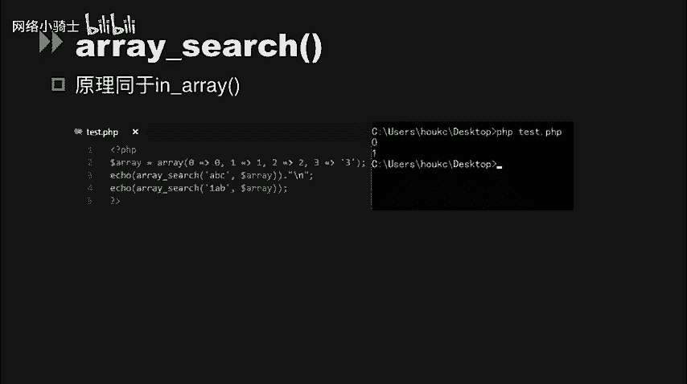
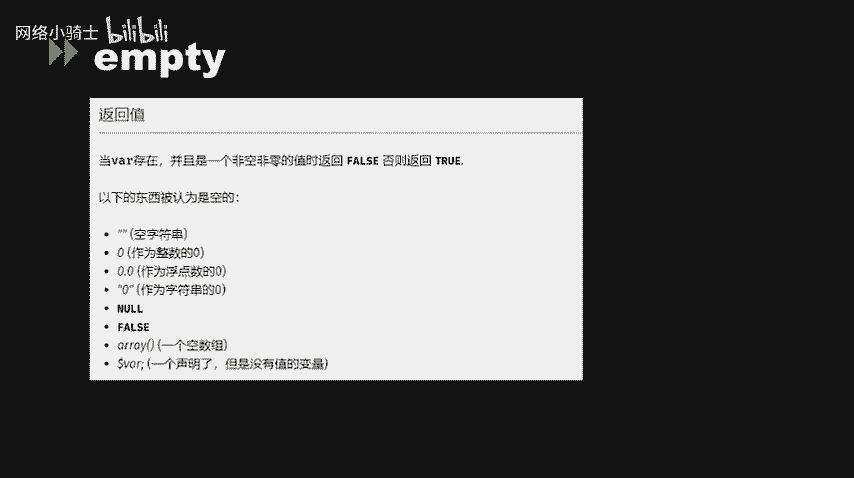
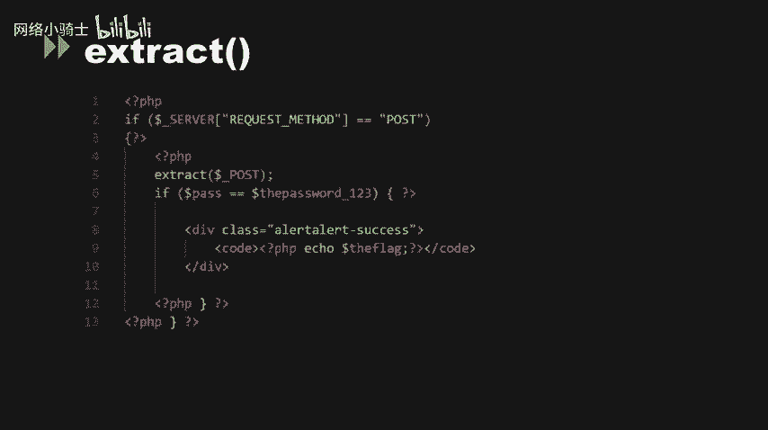
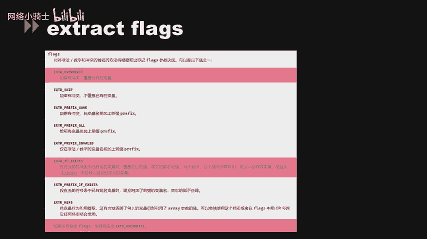
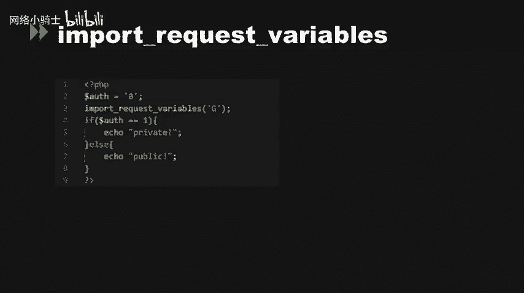
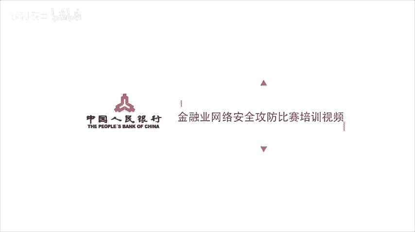

# CTF夺旗赛教程100集（全）从零基础入门到CTF竞赛大神看这套视频就够了！ - P50：53.53.代码审计_2 - CTF入门教学 - BV1MBiuexEmh

大家好，今天来给大家讲一下在CTF当中的一些PHP代码审计的应用。

在前几周的千吻杯web签到题当中，我们可以看到这道题。首先它的第一环节是两个参数是否相等。然后再做MD5处理是否相等，都是用松散比较。我们这边实际上可以直直接用。哈心缺陷来绕过这么一个环节。

那第二个环节也是通过松南比较来判断。我们这边其实可以通过刚刚讲到的MD5在输入了数组值以后，会无法正确处理，导致最后结果维持这么一个原理来绕过这么一个环节。那么到第三个环节的时候，我们会发现。

我们无法通过松散比较和MD5的缺陷来绕过。这个时候其实就用到了MD5的碰撞。我们可以通过2个MD5输出值为一样的不同的。输入值。来做这道题，也就是通过深日攻击的方法来做这道题。我们可以在网上搜到两个。

嗯现成的字符串这两个字符串在做MDD5运算以后，它的输出结果是一样的那我们就可以用这两个字符串来做我们的这个。参数一和参数二的输入值。从而。绕过这个环节，做完这道题。switch函数。C是函数。

比较典型。那，我们可以看得到switch函数，实际上就是switch函数接收的参数值。接收到哪个参数值就会跳到哪个分支里面去。我们可以看到这个test点HV的demo当中。

switch函数接收到一个参数值为。2ABC的。那进行强转以后，它就会变成2，那自然就会进入了K2。那这个地方实际上也用到了一个字符串向数值进行强转的过程。isnumeric在做判断的时候。

如果攻击者将推露的改成16进制，就是零差什么什么的时候，isnumeric会先对十六进制做类型判断。十6进制会被判断为数字型。为真就会进入条件语。如果再把这个带入进SQ语句进入到myQ的数据库当中。

myq数据库会对s进行解析成字符串，再存入到数据库当中。如果这个字段再被取出来进行二次6，就可能造成二次注入漏洞。那么这个test我们就可以看得出来，它就进行了一个ID值的输入，然后再提取出来。

做一个输出，成功执行了我们的SQ语句。in area这个函数，它的解释是bore in area这么一个。函数。如果它的可选项参数就是strict这么个一些参数没有进行。提供设置的话。

那么in area就会使用松散比较来判断。needle是否在hist这个变量当中。当strict值为 true的时候，in error就会比较needle的类型和hastack的类型是否相同。

那一般啊程序员可能就会不去设置这个sstrreet的参数。就是像test在点PV这个demo当中。它只设置了第一个参数和第二个参数的必选参数。那么这边。我们在。

这个数组012和3字符占这个数组当中我们去。找是否存在ABC这个组织。会发现给出的结果就是去。因为ABC会强转为零，那么零在这个数字当当中就会转为去。ABC会强转为一，那么一在这个数字当中就会返回去。

Arra search原理其实和in error是一样的，也会做一个强转。

empty啲。我们在官方手册当中，我们可以看到MT并它实际上是对。当前的输入。是否为空做一个判断。但是如果当前输入为0的话，也就是说数值0或者数值0。0或者字符串0。那实际上它也会返回去。这边。

很多程序员就会由于没有认识到他对您。判断也为处导致。一些条件判断的绕果。同样存在这种问题的，还有eet函数，sstrops函数，还有relam函数。

接下来讲一下变量覆盖问题。非常覆盖问题。首先讲一下双doller服务。我们看一下这个demo当中。我们使用forage来辨利数组中的值。然后再将获取到的数据件名作为变量。数组中的间值作为变量的值。

因此就产生了变量覆盖。当我们去请求liam这个参数的值为test的时候，我们会将liam这个变量进行覆盖，变为test。所以说我们的变量T。它的值就会变为量。

那么我们的do了 dollar了 key就会变成do量就会变成think体。那多了 value就变成test。extract也是比较典型的变量覆盖函数。

extract函数是从数组中将变量导入到当前的符号表。这个函数使用了数组键名作为变量，使用数组键池作为变量值。针对数组中的每个元素，将在当前符表中创建一个变量对应的变量。我们可以看到这边的de保。

我们看一下这个demo。在test点PSP当中，我们可以看到extra获取了一个数组键名va area。以及一个字符串就是WDDX。并且给他配置了一个。模式就是。给它加上一个前缀这么一个模式。

我们可以看得到。在最后输出的时候，输出color变量。就是对应blue没有错，输出size变长会变成latch，而不是medu。实上这边就是因为medum这个。值被变量覆盖了。因为我们在。

WDDX会对应比上WDDX下划线size。然后会把medum赋予给WDDX下划线size这个变量。所以说WDDX下划线size的变量的值就会被覆盖，生成一个medum。而size就会自行变成large。

因为我们当前全局变量里面有一个size变量，就是在第二行。那这个lush就会直接赋予给这个size变量就会变成。size的变量的值就会变成large。我们再看一个比较典型的extract函数变量覆盖。

thetra获取了一个。get的参数。那么这个get参数实际上我们就可以直接。通过get参数来绕过下面的条件判断。下面条件判案是判断gi参数是否和cont参数一样。本参数是做了处理的flag变量值。

那么直接我们去覆盖gi，也就是说。题目中使用了extract。dollarget接收了get请求中的数据，并将界名和键值转换为变量名和变量的值，然后再进行两个if的条件判断。

所以可以使用get提交参数和值，利用extract对变量进行覆盖，从而满足各个条件。所以说我们的payload的就是问号flag等于空，然后和gift这个参数等于空。

那么extract这个函数变函数就会将flag变量和gift变量的值都给覆盖了，将变量的值设置为空或者不存在的文件就满足。那么从而gi变量和cont的变量就一样。

那最终的plllow就是我们通过变量覆盖的方式，直接将flag变量和gift变量都置为空。这道题也是一样，只不过我们将这个输入值改成了用posts提交的参数。

我们这边通过用pos提交一个pass参数和一个thepa word123参数，将这两个参数都置为空，从而绕过下面的条件判断。然后输出我们的flag。变亮。

这边值得一提的是extract里面有个flex。标记位当flex为。extract overr和extract if exist这两个的时候才会存在extract变量覆盖。那如果没有去指定flex的话。

那会假定它默认为extract over right。所以说默认情况下，它就是存在变量覆盖漏洞的。

pas string pass string函数是将字符串解析为变量。啊。str是可是必须要输入的值，然后ara是可选值。如果没有设置er参数的话，那么函数设置的变量将会覆盖同名变量。

PHB中的一个配置项，就是在PHB点INI中的magic codeGPC会影响该函数的输出。如果启用的话，pas string在几析之间，变量会被at slashes这个函数进行转换。我们看一下这道题。

如果要满足dollar A。诶。第0个。字符不等于QNKCDZO。并且MD5这个do落AD0个字符要松散比较等于这个MD5QNKCDZ。这个时候就要利用这个PS1。弱类型的这个特性。

010E123会被当做科学技术法，就是0乘以10的123。正差。这个时候需要找到一个字符串MD5或的值，结果是01开头的，后面都为数字。那比如说240610708这个数字在做MD5处理以后。

它就是零1开头的这么一个数值。那我们的结果就是说。用们的payload就是ID等于A。然后第0个字符等于240610708。那这个时候我们就可以输出我们的flag。

Importer request variables。在我们去访问这个test PHP的时候，我们输入参数os等于一，那网页上就会输出private。

因为inport request variables，然后大G杠嗯那个单引号大G指定会导入get请求中的变量，从而导致变量覆盖。

inport request variables会将get post cookies容的变量导入到全局作用域当中。如果你禁止了这个register global这么一个配置项的话。

但又想用到一些全局变量，那么这个函数就可以通过。这种绕过registerg开关关闭的情况来进行全局变量的注册。

