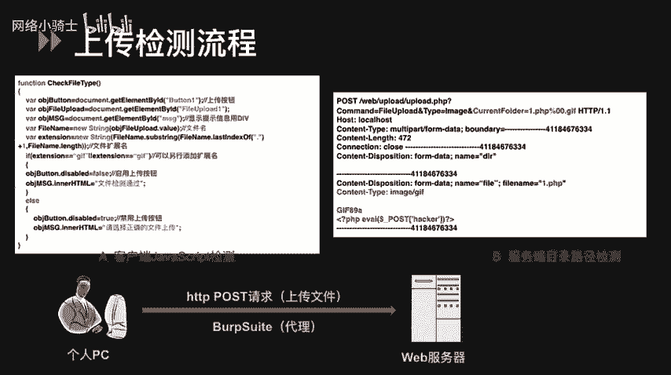
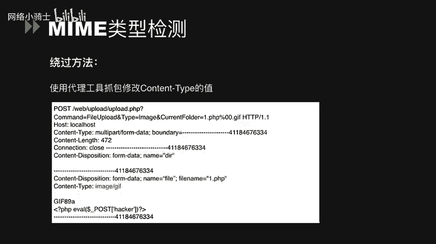
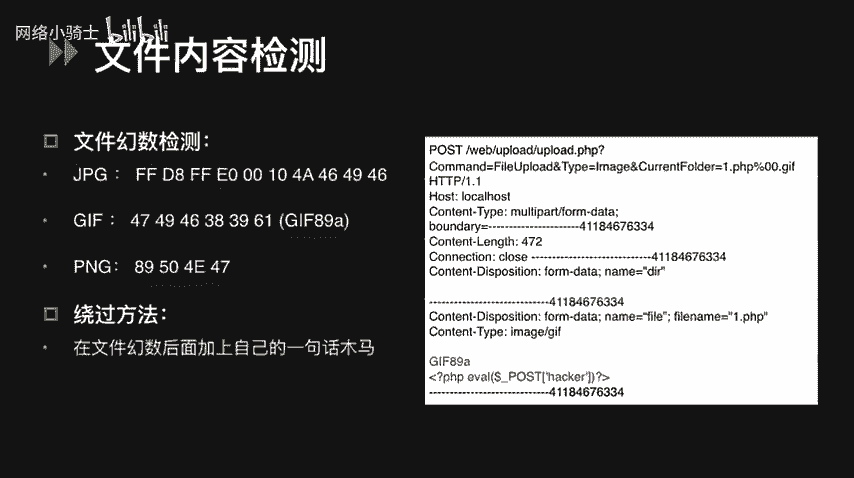
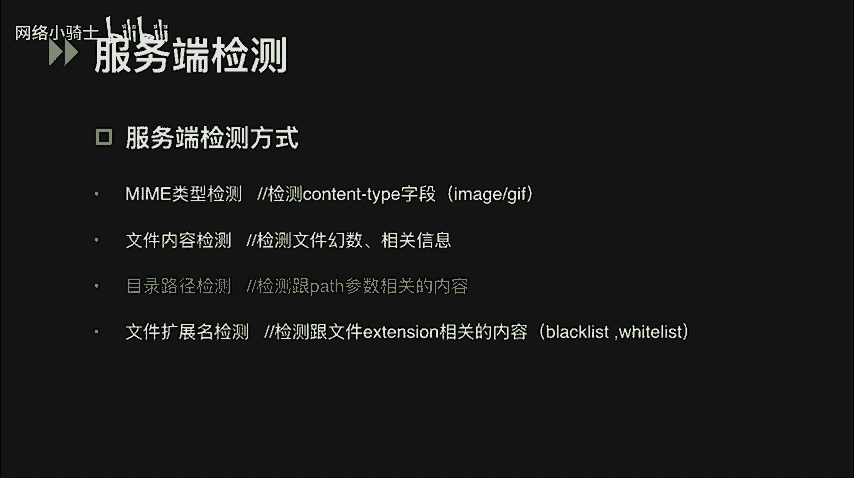
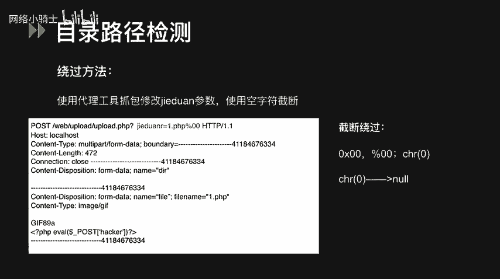
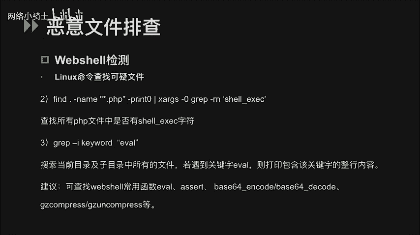
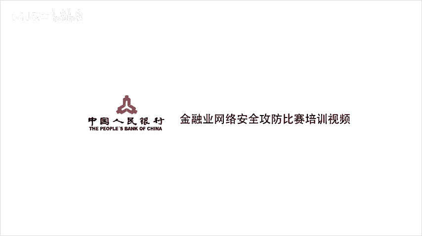

# CTF夺旗赛教程100集（全）从零基础入门到CTF竞赛大神看这套视频就够了！ - P51：54.54.文件上传 - CTF入门教学 - BV1MBiuexEmh

大家好，本次课程讲解的内容是文件上传，我们仍然以PHP语言为主。在CTF比赛中，碰到文件上传这类题型，通常是上传成功后，服务器会返回一个flag值，或者在混战模式下，通过上传木马文件。

get web shell查看flag文件。这类题目解题思路并不复杂，主要是多积累和整理。

本节课主要分为四个部分，文件上传漏洞的相关知识，客户端和服务端的检测方式及绕过方法，以及如何去排查恶意文件web share。什么是文件上传漏洞？在web程序里，我们经常需要用到文件上传的功能。

如果用户可以上传图片、表格等文件，却没有限制上传类型或者限制不严格，被攻击者绕过，那就有可能造成文件上传漏洞。如果上传的是恶意文件。比如说web share获取到网站服务器的操作权限。

就会导致网站被控制，甚至服务器沦陷。比如说可以编辑网页脚本，上传下载文件，甚至查看数据库，执行任意程序命令等等。那么web share是什么呢？就是我们常听到的网页木马，也可以说它是一种后门工具。

简单来说一下web share的原理，这是一个PHP的一句话，木马。这句代码的意思是通过el函数执行post请求传入的参数C，我们只要post一个C等于某个参数的请求。

这个参数值就是我们所想执行的PHP命令，这样就可以在服务器上做我们想做的事情了。举个例子。如果C等于PHP info，显然就是执行PHP info这个函数执行后可以访问到PHP info页面。

查看web服务器的敏感信息。接下来说一下文件上传的检测流程。客户端在上传文件，或者说发送请求到服务器端的过程中，文件可能会经历一次或者多次的校验。

客户端GS检测这种方式通常是上传页面里含有专门检测文件上传的GS代码，最常见的就是检测扩展名是否合法。左上方就是一段客户端用GS检测文件后者名的示例代码。可以看到，这里限制了只允许上传GF文件。

这就是客户端GS检测。客户端检测完毕后，上传文件的请求会发送到服务器端。服务器端也会进行检测。右上方是一个文件上传的post请求，我们可以通过bbe suit一种代理工具去截取HTTP请求。

通过修改数据包，绕过各种服务端的检测。检测方式主要有4种。目录路径检测。

文件扩展名检测mm类型检测和服务端文件内容检测。接下来我们详细一点的来总结一下文件上传的检测方式和绕过方法。根据刚刚提到的检测流程，我们知道一般会分为客户端GS检测和服务端检测两种方式。

判断文件是不是在客户端检测很简单，就是在浏览器加载文件，但还没有点击上传按钮时，便会弹出对话框。内容一般是只允许传某某文件。如果想要进一步确认的话，可以通过配置浏览器的HTTP代理。

只要是没有流量经过代理，就可以证明它可能是客户端的GS检测，因为并没有数据包被发送到服务端，所以一定不存在服务端的检测。绕过方法有两种，一是可以配置bp代理进行抓包。

然后在代理上将通过客户端检测的文件名shall点JPG改为shall点PHP。第二种方法是可以查看上传页面的源代码，修改GS的检测函数，可以使用火狐的firebu之类的插件，把它禁掉。

客户端的检测和绕过方法基本就是这样。在讲服务端的检测和绕过方法之前，先介绍一下PHP里的fis对象。PHP是通过fis对象的一些属性来读取文件的。例如，我可以使用name读取文件名称。

使用typeap去读取文件类型等等。服务端的检测方式主要分为以下这4种。第一种是mam类型检测。mam类型就是文件被打开的类型，可以从HTTP请求的头部content type中获取。

左边这张图是服务端检测文件mm类型的代码示例。主要是看代码第二行的有一个if判断，使用files对象的type属性来读取文件类型，并判断上传的是不是基术文件。绕过mam类型的检测方法是配置bb代理进行。

截取HTTP请求包，其中content type头部的内容就是这个文件的mam类型，将cont type修改为image j，也就是服务端允许的。文件类型就可以成功上传一点PHP这个木马文件。

服务端的文件内容检测通常有两种检测方法，检测文件换术或者检测文件的相关信息。第一种检测方法是文件换术检测。换术可以用来标记文件或者协议的格式，很多文件都有换术标志来表明该文件的格式。

比如zip文件开头一般标记为PK基辅文件一般标记为GIF89A等等。想要绕过这种检测。可以在文件换输后加上自己的一句话木马。我们可以看到右边是一个上传文件的HTTP请求。

红色标记的部分就是在基附文件的换术后，加上了一个一句话木马，从而绕过文件换术检测，上传木马文件。

第二种检测方式是文件的相关信息检测。一般就是检测图片文件的大小、尺寸等信息。绕过这种检测的方法是先伪造好文件换数，写上一句话，再添加一些其他内容来增加文件的大小。通常情况下，对于文件内容检查的绕过。

就是直接用一个结构完整的文件，然后进行代码注入再上传即可。接下来讲目录路径检测，通常检测跟pass参数有相关的内容。

我们来看一段测试代码，这里用fies对象的tamp name属性，先保存了一个临时文件。这里的move upload file函数会检查并确保file指定的文件是合法的上传文件。如果文件合法。

就将其移动为由tge pace参数指定的新文件漏洞就出现在move upload file的targe pace中，它代表的是上传文件移动的最终目的地址。

在targe pace变量中截段变量是从用户的请求中获得的，并且它是我们可控的一个变量。fire eXT变量是指定的扩展名。这里也可以说它是一种文件扩展名的检测。这个漏洞的CV1号是2015-2348。

所以说我们在上传文件的地方，不要把用户可控的变量作为move upload fire函数的目的地址。那么绕过这种检测的方式是，我们可以在HTTP请求包的截段参数里。

利用空字符来截断fiEXT变量指令的扩展名，从而造成任意文件上传。空字符阶段可以使用摆放号000乘00和叉20。百分号00的这种形式，web server会把它当做16进制处理。

然后把十六进制的hax自动翻译为askk码值呢实现阶段。叉20这个字符叉函数表示，返回指定的ask值的字符。举个例子，大写的A的ask码是65。那么print叉65，结果就是大写的A。

所以叉20表示的ask字符是n。当程序输出包含叉20变量时，叉20后面的字符也会被切断，和百分号000叉00的方式是一样的。

最后是扩展名检测，对于扩展名的检测，一般会采取黑名单或者白名单检测的方式。在服务端一般会有个专门的blacklist文件，限制恶意文件上传，里面可能会包含常见的危险脚本文件类型。

例如PHPJSPASP等等。使用黑名单检测会限制的不够全面，绕过的方法可以使。用黑名单里没有的后缀名进行攻击。如果黑名单中没有限制PHP5或者PHT等等，我们就可以用来绕过。除此之外。

RSIS默认支持解析点AP减点CDX点AA点CER等。如果服务器使用了RS中间键可以尝试以这些后缀名绕过检测。还可以使用文件名大小写。特殊文件名绕过，虽然不被允许点PHP这样的文件格式。

但是可以上传shall点PHP空格这样的文件或者shall点PHP点。这样的命名方式在windows系统里是不被允许的，所以不能在客户端直接输入，需要在bp之类的代理里进行修改。

绕过验证后会被windows系统自动去掉后面的点和空格，但是需要注意的是，unux和linux系统都没有这个特性。关于空字符截段，可以参见在目录路径检测里绕过的demo。最后说一种特殊的绕过方式。

点HTacs文件攻击点HT assesss文件是阿帕奇服务器中的一个配置文件。它负责相关目录下的网页配置，这个文件仅在阿帕奇平台上存在。所以当网站服务器的web server是阿帕奇时。

我们才可以使用这种方式进行绕过。我们可以上传一个自定义的点HTacs文件。这个文件的写法是这样的。图中我们可以看到。这段代码的意思是，只要遇到文件名中，包含有A点GSP字符串的任意文件统一执行。

我们可以上传1个A点JPG，内容是一句话木马，上传成功之后就可以用菜刀进行连接了。通常，白名单的安全性比黑名单高很多，但也不能说白名单检测就是绝对安全的。绕过的方法，同样的可以用。

IS默认解析的后缀明绕过，还有空字符截段等。除了之前说过的绕过方法以外，还有一些特殊的姿势。比如说黑名单和白名单的绕过，通常还需要配合中间件的解析漏洞来进行。首先是IS5版本和6版本的解析漏洞。

目录解析是当你上传AP的木马时，必须在RS6。0的环境下，且在以某个点AP为名的文件夹下才能执行图片里的代码。也就是说，图片木马执行必须满足两个条件。第一，你可以自建插点AP的文件夹。第二。

你需要上传图片木马到插点AP的文件夹下。还有文件解析漏洞形式就是在JPG前面加上分号，服务器默认不解析分号后面的内容。因此我们上传的文件就会被解析成AP文件。

第三个是之前已经说过的IS默认支持解析的几个后缀名，可以绕过blacklist的检测。阿帕奇的解析漏洞，我们可以上传test点PHP点。OWF点RAAR这样的文件。

原理是阿帕奇解析文件的规则是从右到左开始解析的。这时，如果后缀明为不可识别文件解析，就再往左判断OWF和RAAR这两种后缀都是阿帕奇不可识别解析的阿帕奇就会把test点PHP点OWF点RAAR解析成test点PHP文件。

除了文件解析问题。还有一些配置会导致文件上传漏洞。第一个是，如果在阿帕奇的cf里有这样一行配置。ad handlelerPHP5杠 script点PHP这时只要文件名里包含点PHP即使文件名是test2点PHP点JPG这样的文件也会以PHP来执行。

第二，如果在阿帕奇的cf里有这样一行配置，at type application斜杠X杠HTPD杠PHP点JPG。那么即使扩展明示。除了文件解析问题，还有一些配置会导致文件上传漏洞。第一个是。

除了文件解析问题，还有一些配置会导致文件上传漏洞。第一个是，如果在阿帕奇的cf里有如配置一这样的一行配置，这时只要文件名里包含点PHP，即使是t2点PHP点JPG这样的文件，也会以PHP来执行。第二是。

如果在阿帕奇的cf里有如配置二这样的一行配置，即使扩展明示JPG，它也一样能以PHP的方式去执行。接下来我们来看NG的解析漏洞。总结利用形式有三种，都是由于PHPCGI解析问题造成的。

利用条件是fast CGI必须是开启的。利用方法是，先使用copy命令，将恶意代码写入图片的二进制代码，避免破坏图片文件的头和尾。test点TST的内容是生成shall点PHP这个一句话木马。

然后上传test点JPG。访问这个URL当test点PHP不存在，则PHP会递归向前解析。当test点接PG当做PHP脚本来解析，执行test点接费G后。

就会在当前目录下生成shall点PHP的木马文件。除了使用工具，我们还可以用lininux命令查找可疑文件。这些命令的意思是，查找we部目录下，最后N分钟被改变文件数据的PHP文件。

当仅仅只是读取文件时，assess time改变，而modify change time不会改变。当修改文件时，acs modify change几 time都会跟着改变。当修改文件属性时。

change time改变，而assecess modify不变。如果我们发现有文件被修改了，可以继续手工确认文件中是否被写入了web shell。

这里的第二句命令是在当前目录查找所有PHP文件中是否有share下划线EXEC字符。我们可以用这个命令来查找web share的特征函数来判断当前目录是否存在web share。

第三句命令是搜索当前目录及子目录中的所有文件。若遇到关键字evvo则打印包含该关键字的整行内容。这里杠I的意思是不区分大小写。那么我们可以通过这些命令去查找web share常用的函数。

evvilas based64 in code等等。

