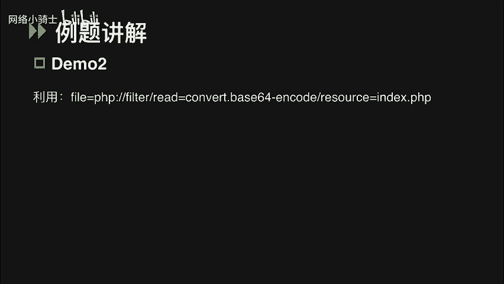
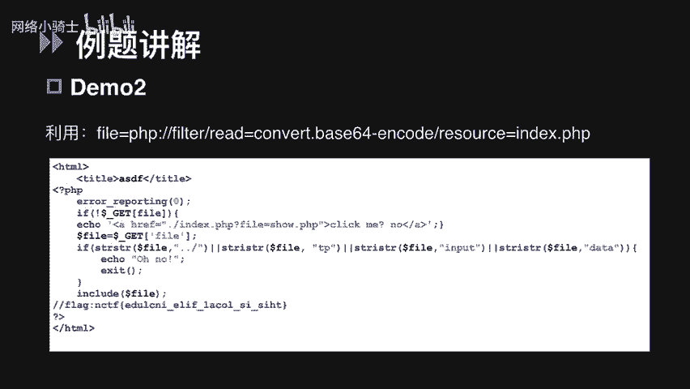

# CTF夺旗赛教程100集（全）从零基础入门到CTF竞赛大神看这套视频就够了！ - P52：55.55.文件包含 - CTF入门教学 - BV1MBiuexEmh

大家好，本次课程讲解的是CTF比赛里外部题型的一类考点，文件包含。文件包含可能会出现在JSPPHPASP等语言中。这里我们就以CTF比赛中最常使用的PHP语言为例来说。本次课程主要是分为三个部分。

文件包含漏洞的原理。CTF比赛中，文件包含题目常见的一些解题思路和相关的例题讲解。首先呢我们来看一下文件包含漏洞的定义。严格来说，文件包含漏洞是代码注入的一种。一个程序开发人员在写程序的时候。

不喜欢把同样的代码写上好几次，通常会把需要重复使用的代码写到单个的文件里。当需要使用的时候就直接调用这个文件，不需要再次去编写。这种调用的过程就被称为包含。我们需要调用某个文件的时候。

就会通过PHP的函数引入文件。如果这个时候传入的文件名没有经过合理的校验。从而操作了预想之外的文件，就可能导致意外的文件泄露甚至恶意的代码的注入。那么对应到CTF的比赛中。

我们就可以通过这个漏洞去读取服务器本地的flag文件，甚至是拿到外部权限去查看flag文件。那说完定义，我们就要分析比赛的时候，怎么去判断某道题考的是不是文件包含漏洞呢？我们先解决第一点。

在PHP中导致文件包含漏洞的函数，最常见的有以下4个。Include。Include one。 require， require ones。这四个函数都可以包含，并且运行指定的文件。

其中include和required的区别在于对错误的处理上，include once和require once。顾名思义就是只包含一次，具体的区别，我们就不在这里做深入的了解了。

当使用这些函数包含一个新的文件时，只要文件的内容符合PHP的语法规范，那么任何扩展名的文件都可以被当做PHP去解析。也就是说，即使我们上传一个包含恶意代码的TXT或者JPG文件。

它都会被当做PHP代码执行。那么刚刚说的第二点，如何通过文件包含漏洞、操纵变量，我们会在后面的例题中有详细的讲解。接下来呢讲一下CTF文件包含类题目常见的一些解题思路。

文件包含分为本地文件包含和远程文件包含。当被包含的文件在服务器本地时，就是本地文件包含。通常我们会通过操纵变量去读取目标机上的flag文件。如果被包含的文件在第三方服务器上。

那我们就把它叫做远程文件包含。这种类型的题目大多会出现在CTF的AWD模式，也就是混战模式中。我们可以指定其他URL上的1个PHP木马来直接运行，从而拿到外部权限查看flag文件。

那什么情况下会存在远程文件包含呢？区分他们最简单的办法就是查看PHP的全局配置文件PHPINI其中有两个非常非常重要的配置项allow UIL F open和al UIL include。

必须是当他们俩同时都开启的时候，才会存在远程文件包含。讲完他们的区别，我们先讲几个本地文件包含常见的解题思路。第一个是直接包含内含有flag的文件。我们来看一道demo。

看一下demo一提议是通过访问UIL可以查看到index页面的PHP源码。简单说一下这段代码的意思。首先，在index点PHP中可以通过get请求提交发热参数，然后判断web目录下是否存在这个文件名。

如果存在，就用include来包含这个文件。如果不存在，就执行 else来include home点PHP这个文件。这段代码我们可以看到，它并没有对取得的参数fire进行任何的过滤。

如果目标主机的flag文件在3W目录下，我们就可以通过fire参数直接指定这个flag文件。那么在代码中相当于我们include了这样的一个文件。红色部分的百分号00是一个字符串结束符。

在这里我们只要在最后加入百分号00，就能截断后面的点PHP包含一个flag点PHP这样的文件。第二种题型是需要我们利用PHP伪协议来读取代码中的flag。

这种解题思路就需要我们先了解PHP的伪协议和我之前说过的全局配置项al UILF open和al UIL include他们之间的联系。首先，PHP伪协议事实上就是PHP支持和它封装的一些协议。

在这里我就不一一去讲这些协议的使用方法了，只涉及到fire和PHP这两种。这两个在CTF中是经常使用到的协议。那他们和全局配置项有什么关系呢？我们来看fire协议。这是一种用来访问本地文件系统的协议。

在CTF比赛中，可以用来读取本地的敏感文件或者是flag文件。另外，fire协议的使用不会受限。意思就是说，如果我们在比赛中访问PHP点INI这个文件。

发现al uL includec和alow uIL f open这两个配置项都没有开启。我们仍然可以尝试用fire协议去读取本地文件。这里我放了一个例子。

就是通过绝对路径读取windows上的一个flag点TXT文件。接下来我们讲一下PHP协议。可以使用PHP协议中的filter参数，读取网页的源代码。同样的，PHPfil也可以在双off的情况下使用。

具体怎么用，我们来看一下demo2。访问题目的URL可以看到一个click me的链接。点击这个链接跳转链接之后，发现在UIL中多了一个fire参数。

我们看到这个参数就可以去判断这个位置可能有文件包含漏洞。如果像这道题的情况是，我们没有办法去查看它的PHP点INI文件。那我们可以先尝试去读取index点PHP页面的源代码。

这道题我们不知道文件的绝对路径，所以首先fi协议时肯定不能用的，应该用PHPfil去读取网页源代码。这里的resource可以指定我们要筛选的数据流，而read可以设定过滤器的名称。

简单来说就是读取index点PHP的内容，并把输入流进行base64编码输出。我们使用这种方式去读到的一定是一段base6编码后的内容。这里为什么要进行b64编码呢？因为不编码就会被当做PHP执行。

我们就看不到源码的内容了。我们拿bb decocode一下，就可以看到源码内容。

像图片中这样，我们可以看到源码中的flag值。

最后是PHP inputput。这个参数比较特别，只要allow uIL include开启。那么无论al uRL f open是否开启，我们都可以将po请求中的数据作为PHP代码执行。

这个就涉及到我们要说的第三种思路，就是通过写入PHP木马获得we权限，查看flag。看一下demo3，首先也是访问题目的UIL，发现直接给了题目的源码。所以这道题依然是一个代码审计的题目。

这段代码里首先有一些关键的信息，这里使用了require once，包含了get请求的fireer参数。然后特别需要注意注释里有两个提示信息。

一是提醒我们要读取PHP点INI二是提示不允许进行远程文件包含。结合前面讲过的知识，现在思路已经很明确了。首先肯定是要按照提示去读取。PHP点INI获得足够的信息。其次。

要么绕过这个安RFI点PHP去包含远程的一句话，要么使用PHP为协议直接执行代码。第一种方法，需要开启alow UILF open和al uIL include。第二种方法。

只需要开启al uIL include就可以了。那我们为了确定使用哪一种思路，我们去看一下PHP点INI这个文件，发现alow uILF open是关闭的。而alow u IL include是开启的。

就可以使用PHP input的协议，尝试去写入木马。上面是一个非常简单的木马文件。我们可以使用火狐的hackbar postPHP木马，这样就可以生成一个shall点PHP的木马文件。上传成功之后。

用菜刀连接木马，就可以看到目标主机上的flag文件。最后我们来说一下远程文件包含。一般远程文件包含会出现在CTF的混战模式中。我们之前也说过，因为混战模式下需要我们去get share。

这里简单的说一个demo。很明显，这段源码存在文件包含漏洞，它使用require once包含了get请求的参数teror访问PHP点II文件发现allow uLF open和alow uRL includelude都开启了。

所以我们判断它存在远程文件包含漏洞。利用的方法很简单，是用parm参数传入一个第三方服务器上的木马文件，问号后面的代码被解释成了URL的cor string，这也是一种阶段。和百分号00的用法一样。

