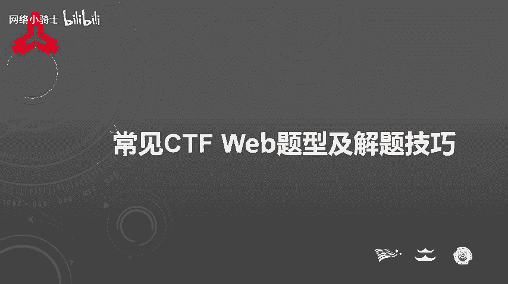
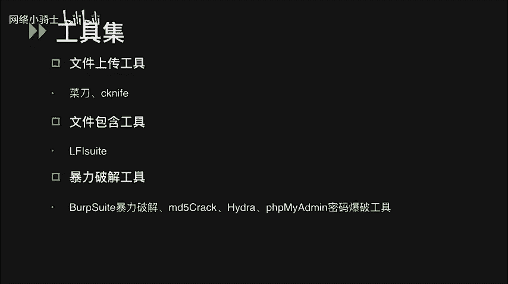
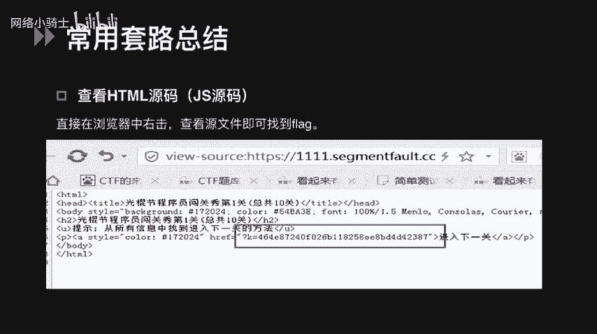
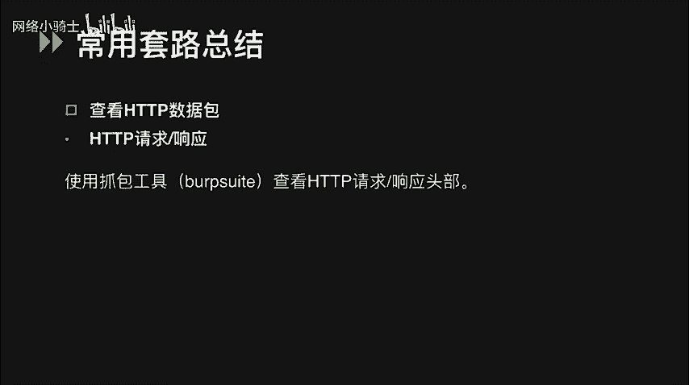
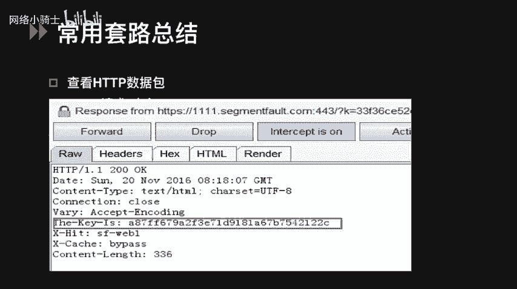
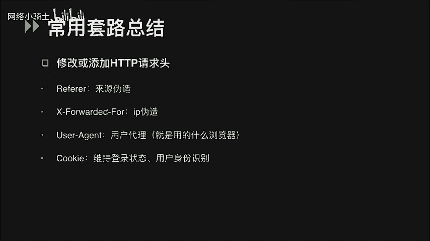
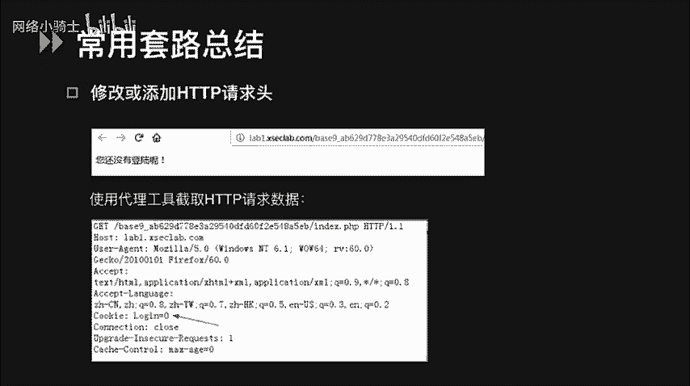
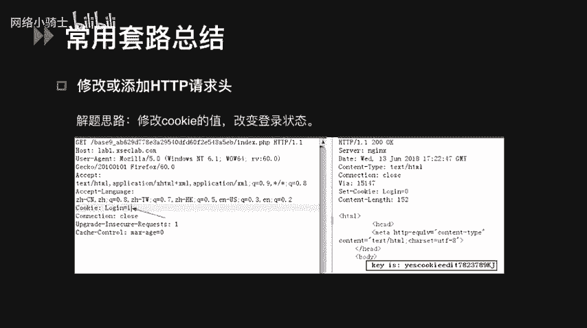
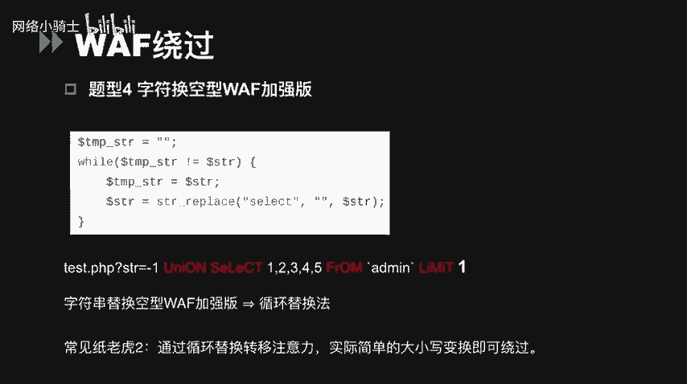
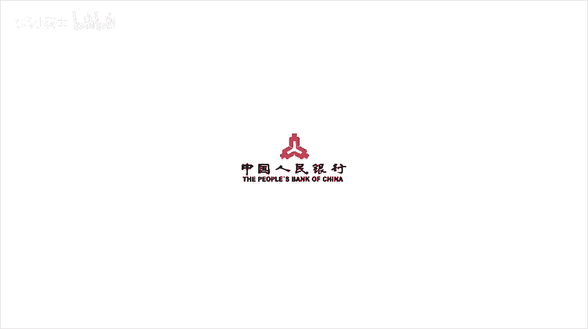

# CTF夺旗赛教程100集（全）从零基础入门到CTF竞赛大神看这套视频就够了！ - P54：57.57.常见CTF WEB题型及解题技巧 - CTF入门教学 - BV1MBiuexEmh

大家好，本次课程的内容是CTF比赛里常见的外部题型及解题技巧。

课程内容主要分为三个部分。CTF外部题型的工具集常用套路总结和常见题型的解题技巧。首先介绍一些CTF web类题目中常用到的工具，基础的工具有box suitffox的work是一个代理工具。

也是用于攻击web应用程序的一个集成平台。包含了许多工具，而ff浏览器中的差别很多，功能强大，例如hackbar可以支持修改pos请求提交的参数，提供了ciQ注入和叉SS工具的功能。

能够快速对字符串进行各种编码。扫描工具中，遇见可以对网站后台进行扫描。nm可以扫描开放端口探测服务。AWVS是一个外部漏洞扫描工具，可以扫描一些常规的外部漏洞。但需要注意，在CTF比赛中。

扫描工具要慎用。有的比赛是禁止参赛人员进行大批量的扫描操作的。注入最常用的工具就是大家都熟知的cico map。叉SS平台能够通过注入叉SS代码获取你能在他人浏览器窗口甚至设备里获取的信息。

比如说本地存储的local storagecookie等，大家可以自己搭建一个，比较有名的是叉SS platform，这个可以上github上下载它的源码。文件上传的工具主要是菜刀CK life。

向网站上传木马文件后，可以在本地连接木马获取，甚至控制整个网站的目录。LFI suit是一个本地文件，包含漏洞神器，它提供了8种不同的本地文件，包含攻击模块，使用方法也非常简单。暴力破解工具有很多种。

其中box suit里的inruder模块就可以用来做认证破解。如果密码是MD5加密的，可以使用MD5craftft等软件进行破解。hi者是一款开源的暴力破解工具，目前支持的破解服务有SSH。

FTPMSciicalmysicalPOP3等。PHP my a密码爆破工具可以通过指定账号和密码对mysq数据库暴力破解进行登录尝试。除此之外，还有很多其他的工具可以使用。我们在这里就不一一列举了。

大家也可以去网上把这些工具下载下来，自己尝试着去使用一下。

在CTF比赛中，胖angMSC。reverse cryrypto都是稳扎稳打的提醒，外部就好像是从他们之中杀出的一个，还需要一些技巧和套路的提醒。首先最简单的一种套路是直接在浏览器右击查看页面云代码。

就可以看到flag。

除了在源代码中，有时flag会藏在HTTP请求或响应包的头部，可以通过代理工具。也就是之前提到的。

Wb suit抓包查看fag值。可以看到图中HTTP响应包的the key is头部的值，就是我们要获取的flag。

我们还可以通过修改或添加HTTP请求头来伪造客户端信息，例如修改refer头，可以伪造来源，修改差 forwarded for可以伪造客户端IP修改useragent，可以伪造浏览器标识。

修改cookie，可以改变用户的登录状态等等。

这里有一道例题，题目题示当前为未登录状态。根据题意，我们可以使用代理工具。查看cookie的职位，包给你的域名。

那我们的解题思路就是可能是需要我们保持一个登录的状态。那么我们可以去尝试修改cookie的值。改成login等于一。当用户处于登录状态的时候，我们就可以得到flag值了。

外部源码泄露了题内。线上CPF比较常见的是VIM源码泄露。如果发现页面有提示VI或者VIM之类的，说明存在SWP文件泄露，直接访问斜杠点index点PHP点。

SWP或斜杠index点PHP拨浪号可以获得源码。有的时候可能我们下载下来的文件还是有一定的乱码。可以在linux下执行VRM杠R indexdex点PHP这样就可以恢复文件了。

还有一种比较常见的是备份文件泄露，可以去访问index点PHP点back或者3W点zip等等这样的。后缀的文件。另外，在运行get初始化代码库的时候，会在当前目录下面产生一个点get的隐藏文件。

用来进入代码的变更记录等，造成点get源码泄露，可以访问点get斜杠config去获取get源码，也可以使用get help等工具，使用方法也就比较简单，这里我就不做详细的讲解了。

SVN它是一个开放源代码的版本控制系统。我们可以通过访问点SVN斜杠。entr获取SVN源码。工具有CSYN和DVCSweper等等。在外部题型里，也常会出现编码加减密这一类的题目。我们来看一下这道题。

访问页面源码得到了很长的一串加密的字符串。根据末尾的等号判断，它可能是一个base64编码后的字符串。我们可以用b64抵扣的一次，发现并没有得到一个明文的字符。那么猜测可能是经过了多次face6次加密。

我们可以用pathon去写一个解密的脚本，将。被杯子64多次加密的字符串放在1个1点TFT的文档中，执行这个脚本就可以得到。接下来看一下摩尔斯电马。摩尔斯电码是一种早期的数字化通信形式。

但是它不同于现代只使用云和一两种状态的二进制代码，它的代码包括5种。Yeah。横杠点和横杠之间的停顿。哪个字符间短的停顿，哪个字之间中等的停顿以及句子之间长的停顿。编码后。

就形如密码样力下的这样的一串字符。我们想要比较快速的破解它的话，可以使用网上的一些在线加点密的网站去解这个摩尔斯电码。给个密码。培根密码它是一种本质上是用二进制来设计的，没有用通常的零和依赖表示。

而是采用A和B。他选取5个为一组，对于铭文上的一个字符加密后会形如密码样一下的结果，同样也可以使用一些在线加点密的网址对它进行解密。栅栏密码也是CTF中常见的加密方式之一。不过栅栏密码本身有一个潜规则。

就是组成栅栏的字母一般不会太多，一般不会超过30个，也就是一两句话。凯撒密码是通过把字母移动一定的位数来实现加密和解密的，也就是按照26个英文字母的顺序。

分别用这个字符的前面或者后面读第多少位来进行替换。这是台加密码的一个加密的样例。我们可以看到，当偏移量为一时，那么将T往后偏移一位就是U。所以说此时T对应的密文就是U，这就是凯撒密码的一个加密原理。

网上可以找到一些加减密凯撒密码的工具。最后我们来看JS fuck。JS fuck编码是由8个这样的字符组成的，它的密码样例我们可以在PPT里看到。如果我们碰到类似于这样的字符串的话。

就可以判断它是JS放进行编码的。网上也有一些在线的加减密的地址。其实编码类的题目主要是看我们平时在做题过程中积累的经验，就看到这样的字符，你能不能迅速的去判断出它是有哪一种方法加密或者编码的。

还有一些windows的特性。首先是短文件名。短文件名是由于为了兼容16位MS杠boss的程序，windows为文件名较长的文件和文件夹生成了对应的windows8。3短文件名。

我们可以利用波浪号字符猜测暴露短文件或者文件夹的名称，例如bake up杠08，等等等。点Cl这个文件，它的短文件就是back up波浪号一点Cl。第二个是ISIS解析漏洞。

windows上IS的解析漏洞，可以用来绕过文件上传中的服务端的白名单和黑名单的检测，具体可以参见文件上传的课程。在CTF中，有一些提醒总能难倒一些人。比如说PHP弱类型。让袜相关的体型。

但是他们往往是有一些技巧和套路的。首先我们来看PHP包含的类型。Spring。Integer， array， double Julia object。Resource， now。

这些其中有的是我们特别常见的spring，就是字符串类型integer是整数类型，areray是数组类型，buing布类型，nun也是PHP中的一种数据类型，但是n类型唯一可能的值就是nun。

也就是空或者出错了，会返回一个nun。接下来看一下PHP的类型比较。在PHP中，两个等于是比较运算符，会先将字符串类型转化成相同的，再进行比较。如果比较一个数字和字符串，或者比较涉及到数字内容的字符串。

那么字符串会被转换成数值，并且比较会按照数值来进行。所以字符串和整数类型的123是相等的，16进制数0乘01和1010进制数一也是相等的。空字符nun过尔值bo均等于0，他们的数组形式也相等。

这里我们可以看到有两个等式，一个是ABC字符串等于0，另一个是123A字符串等于123。其实它们是相等字符串和数值的松散比较，会取它的第一个字符。如果字符是字母强转为0。如果这个字符是数字。

那么就转为这个数字。最后是。是01开头的两个字符串，它们也是相等的，是因为零异开头的字符串在比较的时候会把它视为科学基数法。所以零异后面无论是什么，就相当于零的多少次方，它依然是0。

首先我们来讲解两道题。关于PHP的弱类型。先看题型一。strringCMP字符串比较。thringCNP函数用于二进制安全字符串比较。如果str一小于stream2，返回小于0。

如果str一大于stream2，返回大于0。如果两者相等，返回0。我们这里可以看到，在题目中有一个一图判断。if判断是通过strCMP去比较从get请求传来的参数flag和代码里写好的flag。

如果它们相等的话，就会返回零和后面的零相等，这样我们就可以得到。这里spring cMP传入的期望类型是字符串类型。我们传入一个数组类型的参数flag就可以绕过，是因为函数接受到了不符合的类型。

将发生错误返回那。那么等于0，我们就可以得到flag。接下来看题型2MD5绕过，我们看到源代码里题目的大意是要输入一个字符串和数字类型。它们原值不相等，但是MD5值是相等的。如果满足这两个条件的话。

就可以成功执行下一步语句，得到flag值。这道题有两种解法。第一种解法是使用科学技术法绕过什么是科学技术法呢？就是与十的幂商乘的形式，可以用一来表示。那么0E123456789和0E98764321。

他们表示的都是0乘以10的幂指数，不管幂指数是多少，结果都会是0。那么MD5值的取值范围也是0到F，包含了E这个字母。我们可以找到一个字符串和一个整数类型，它们的MD5值刚好都是零异开头的。

那么MD5函数在判断它的时候，会把它当成一个科学技术法去处理，认为它们俩都等于零，这样的话就可以去绕过这个线测。第二种解法是数组tck，就是通过数组来绕过这个MD5函数。

MD5函数的特性是它是无法去比较数组的，因为这是它不接受的数据类型。那么我们就没有必要再用弱类型比较的特性去做这道题，可以直接利用MD5函数的特性。解法是我们可以传两个数组类型的数据。

当MD我去处理他们的时候，发现无法接受，就返回浪纸，这样可以成功绕过得到flag。接下来讲绕wa的几种常见方式。首先我们使用大小写混合的方式，绕过对关键字的检测。

但是这种形式只针对小写或者大写的关键字匹配技术，正则表达式使用修饰符斜杠I时，对大小写不敏感就无法绕过。第二种是使用编码的方式，例如单引号进行UIL编码后为百分号27，斜杠为百分号2F。

当单引号被过滤时，我们需要读某个数据库或者表下面的数据时，可以使用1六进制编码数据库的库名或者数据库的表明。使用注释在CQ注入中也是很常见的，常见的注释符有井号杠杠两个斜杠和杠杠加等。

他们都可以用来注释后面的语句。而斜杠星号星号斜杠这种注释符可以绕过对空格的过滤或者关键字的识别。看下面的几个例子，第一个是用注释符替代空格，第二个和第三个是用注释符条件注释符绕过对关键字的识别。

看下面的几个例子，第一个是用注释符替代空格。第二个和第三个。都是用注视符绕过对关键字的识别。空字节能起作用，是因为在一些语言中，空字节表示字符串结束符过滤器在处理输入的时候，如果碰到空字节就会停止处理。

那么我们只要把空字节放在注入的语句之前，过滤器就不会处理后面的语句了。使用嵌套玻璃的前提是替换或者删除selectunion等关键词，而且只匹配了一次。

那么我们就可以通过在select里嵌套一个select绕过一次玻璃，最后是避开自定义的过滤器，一些过滤器，它所过滤的字符串都是事先写好的。只要我们输入的语法和它们过滤的不匹配，即可绕过。

例如把and转换成A加ND等。来看一道题，题型式字符替换空形wa符。这种绕过方式很简单，就是刚刚说过的嵌套玻璃的方法。由于strring replace只替换了一次，故剥离了一个select。

还剩下一个这种做法就是很纸老虎的做法，看起来似乎过滤了所有的关键字，却把关键字都替换成了空指。这样就让工具者钻了个空子。来看题型四，字符换空型wa加强版。这题就是通过wire语句实行循环替换。

通过循环替换来转移我们的注意力。实际上简单的大小写吻合就可以绕过这个wa。

常见CTF外b题型及解题技巧的内容就到这里，谢谢大家。

