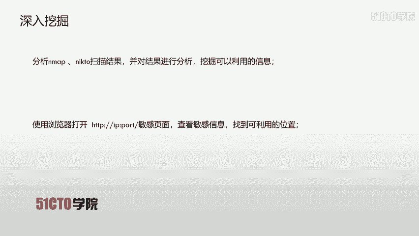
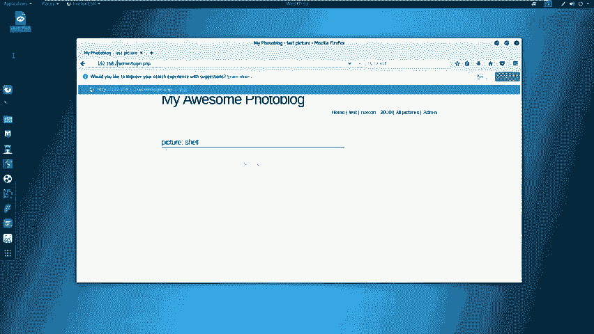
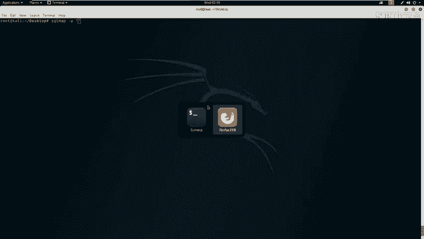
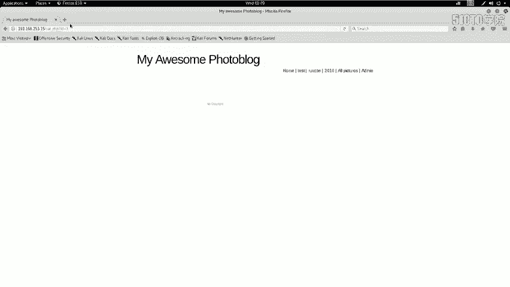
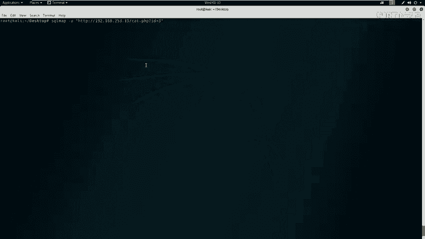
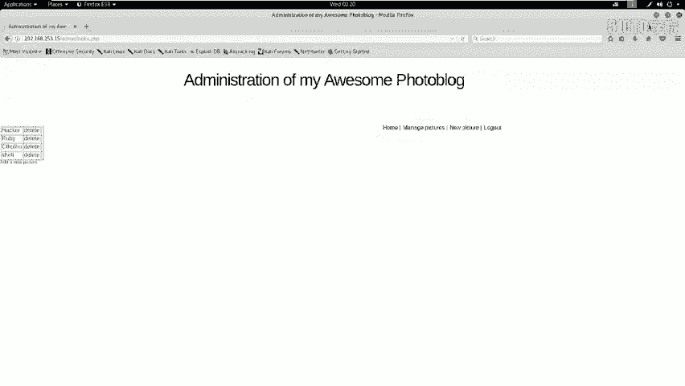
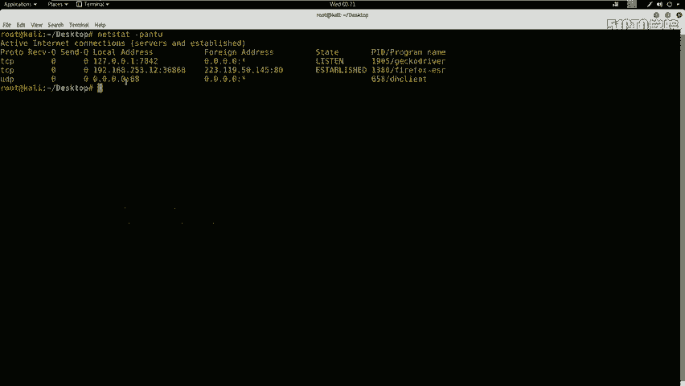

# CTF教程天花板， 国内顶尖战队大佬亲自授课，零基础入门，真题讲解，持续更新中 - P13：14.CTF夺旗-sql注入(get) - 白帽黑客-杰哥 - BV16z421i7dm

好，今天我们来学习一下外部安全当中的社客注意漏洞。咱们通过社客注意漏洞。获取系统的用户名和密码之后，登录系统后台，寻找对应的上传点。上传对应的se之后执行对应的sell返还sell给咱们公积金。

最终取得对应的flag值。下面哎咱们来介绍一下搜科猪漏洞。ser注入哎漏洞，也就是这个ser注入攻击，哎，指的是哎通过构建。的输入作为参数传入到哎咱们web应用程序当中。

而这些输入哎大都是circle语句里的一些组合。通过执行咱们构造的这个circle语句，进而哎执行咱们想要的操作。咱们生成这个s猪漏洞的原因。可以说是哎程序没有细致的过滤用户输入的数据。

致使非法数据侵入系统执行对应的操作。咱们搜课注入产生的原因通常表现在以下几个方面。第一，不正当的类型处理。第二，安全的数据库配置。第三，不合理的查询及处理。第四，不当的错误处理。第五，转移支付处理不适。

第六，哎多个提交处理不当。实际上本质的原因就是咱们程序哎允许用户输入。那么用户输入了恶意自符，咱们系统没有对其过滤或者过滤不严格来致使搜客注入哎的这样一个漏洞出现。那么咱们在开始课程之前。

哎介绍一下今天的实验环境。首先呢公积机的IP地址是192。168。253。12，哎，采用的是咱们卡利linux。8上机器呃是192。168。253。15啊这样1个IP地址。那么咱们拿到这样一个实验环境。

该如何操作呢？咱们不论还是在日常工作当中，还是在CTF比赛当中，咱们一定要想着。获得靶场机器的root权限。当然，在CTF比赛当中，大家一定要注意，获得靶场的root权限之后。

也要哎想方设法找到对应的flag，获得对应的flag值。下面呢哎咱们就带今天的实验环境。来进行一个测试。在测试的第一步当中，我们需要对靶场机器来进行一个信息探测。

首先哎咱们要探测一下靶场机器服务的信息以及服务的版本信息。咱们使用N map，加上杠小写S大V之后加上靶场IP地址来探测。

首先打开终端，打开终端之后，咱们使用M。杠小S打V之后，加上咱们靶厂的IP地。253。15回撤。咱们这时候I map会向靶场发送大量探测数据包。那靶场会给咱们返回对应的响应。之后按m把这些响应处理。

以标准的形式输出到M。的标准输出当中。

可以看到咱们这里探测完毕，咱们除了先探测主机的服务信息以及服务的版本信息，咱们还可以使用。其他的命令来探测更多信息。那么咱们下面使用一下这个探测主机全部信息的命令。M map杠大T4。

这杠大T4代表的是使用M map最快速度来探测靶场IP地址之后是杠大A表示加在所有来探测这个模块来探测靶场IP之后是杠小V表示我们要把所有探测的输入和输出来显示到M map当中。

并且以一种尽可能详细的方式显示。使用嗯map。之后哎咱们输入N map杠T4杠A杠V之后是靶场IP咱们这里哎就把这个靶场IP给它复制过来。配置哎呀，回去了。

咱们这个时候N map会以最快的按这个速度来发送数据包。来接收哎咱们靶成回来的这个数据包，并且对他分析。之后哎以标准的输出哎输出到这个M map的标准输出流当中，显示给咱们看。咱们可以看到，哎。

这时候已经扫描完了。咱们除了哎可以使用M map，哎探测下靶场开放的服务，以及哎扫描一下这个靶场的全部哎这样一个信息。咱们还可以哎对它开放的哎某些具体服务进行探测。

咱们下面就来查看一下使用哎这个对应工具探测HTTP哎这样一个服务的命令。首先咱们使用n two来探测一下HTTP哎，这个靶场上HTTP服务的敏感信息。使用n two杠host hTTP冒号。

然后斜杠之后是靶场I地址之后，冒号加上端口号，这里的端口号如果哎咱们HTTP哎使用默认的80端口，咱们这里的端口号是可以省略。但如果不是80端口号，哎，是其他端口，比如说8080。

那么咱们这里就需要加上对应的端口号。下面咱们来实践一下。因为哎咱们这个靶场开辟了80端口。好，所以说咱们就使用nick two。HTTP。之后哎是靶场IP。哎，这里少加了一个hos这样一个参数。

post哎之后哎，咱们因为是80端口，所以说这里不需要加对应端口号回撤。这时候哎咱们就开始探测这个靶场机器上哎敏感信息。可以看到哎，咱们这里喷测的速度还是比较快的。并且返回了爱某希。敏感信息。

比如说这里哎咱们返回了哎这个PHP的版本信息哎，这些信息可以看到哎，咱们这时探测完了。咱们对于谈子测完这些信息之后，哎，需要对这些信息进行分析，来深入挖掘内部咱们可以利用信息。

咱们这时候哎就来分析一下a map和nic two的扫描结果，来分析来挖掘啊可以利用的信息。比如说哎咱们开放HTTP服务，那么咱们就可以。来查看一下哎这个HTTP服务当中的敏感页面，挖掘敏感信息。

找到可利用的位置。

咱们这时候啊回到卡题当中。咱们看哎敏感信息当中哎有哪些信息，可以看到哎，咱们一直向下面看，可以看到这里哎有这样一条。admin哎lockin thatPHP哎是一个用户登录页面的信息。

那么咱们这时候哎就在浏览器当中打开这样一个页面。192点168点。253。15。

回撤咱们这时候哎发现这是一个哎咱们这个登录界面，咱们尝试一下是否有弱考令at命。之后i叔 at命。咱们点机等录。呃，咱们不进行更新，咱们会发现并没有哎让咱们直接登录到系统当中，也可以哎明确哎。

这里这个系统哎不存在al命这样一个弱口令。那么咱们哎现在的目标是想进入到这个系统后台。那么咱们直接哎想到下一步操作，就是来挖掘一下这个系统是否存在漏洞，存在的这个漏洞。

是否可以让我们获得对应的用户名和密码。通过哎这个获得的用户名和密码登录系统后台呢。那么咱们这时候下一步操作就要对系统进行漏洞扫描。今天咱们使用漏洞扫描器，哎，也就是卡利当中集成的一个web安全扫描器。

avap VIP哎，这是一个世界上最受欢迎的免费安全工具之一，它也是vap哎一个项目之一。它可以帮助哎咱们在开发和测试哎的这个过程中自动发现哎这个oneb应程序当中的安全漏洞。

另外哎他也是咱们如果有着具备丰富经验的渗透测试人员进行哎人工安全测试的哎优秀工具。因为它内部还设有对应的代理机制，可以让咱们进行法的测试。哎，这是哎打开这个软件的一个界面。下面呢咱们就使用这个工具。

对咱们今天的哎这个系统进行一个漏洞扫描。首先哎在这里ation。然后是在这里handize之后，哎点击ZP。🤧咱们把这个关掉。之后哎咱们这个软件正在打开，并且加载着很多这样一些漏洞扫描模块。可看到哎。

这里是加载的进度条。这里也可以看到va的版本12。7。0。And击 start。之后哎咱们在这里输入咱们靶场的IP地址。嗯，咱们把这个关掉。一家点。168点。253。15。在输入完之后。

咱们直接点击attack进行主动扫描。在扫描之前，它是需要哎对这个站点进行一个爬虫。爬取哎他所有的一界面爬取完之后，哎，这个工具会给咱们主动把这些爬取的结果送到主动扫描的这个模块。

这里啊它就会根据哎对应的策略哎，对这个每一个。爬到的这个页面进行安全性检测。呃，咱们也可以看到，哎这个工具的安全性检测，这个进度条还是非常快，表示它的速度也是非常快的。呃，咱们现在已经到了70%多。

咱们需要静静的等待这个扫描的完成。这时候哎咱们扫描完成之后，会主动跳转到alot这个模块当下。咱们在这里哎可以看到三种颜色的这样一个标志。小旗帜。这个深红色哎就是这个深黄色，哎，是代表。哎。

咱们这个是存在高温漏洞的这样一个界面结果。可以看到哎存在哎反射型的叉SS以及ciical注入。而咱们哎黄色的哎是代表这个中微漏洞。浅黄色的哎代表DV漏洞。

咱们今天啊就来使用一下circle来注入来挖掘这个服务器数据库当中的用户名和密码。接下来啊咱们就对哎这个扫描到的这个色刻柱入漏动进行对应的利用。哎，毕竟咱们这个ser助入哎是一个比较高危漏洞。

可以直接获取服务器权限。或者是哎可以获取咱们对应的用户名和密码。下面哎咱们使用circle map利用一下当前的这个srcle注意漏洞。首先呃使用sm杠UURL杠杠DBS来查看数据库名。

之后哎通过查到的这个数据名名之后输入刚刚tables。哎，想要查看的数据表。最后哎咱们杠D数据库名杠大T表明杠Qs查看对应的字段，也就是对应的列名。知道了哎，数据库名表明列名之后，咱们就可以查看。

这个对应的这个字段值，再就是咱们存储的数据。下面哎咱们来实践。哎，把这里这个界面哎可以看到咱们给它复制出来，按ctrorl C来给复制。这里少了一个参数3。呃，controrl还复制出来关闭。

之后哎在终端当中，咱们使用s map来进行测试。酱油。双引号哎之后输入咱们测试点。哎，这里咱们。🤧回到这里。

啊，没有复制出来，咱们就。在站点当中。把刚才的哎这个界面给它展示出来。而是在这里。

那么下面啊就把这个复制出来阔配。之后哎，在这里点击粘贴。咱们这时候哎什么参数都不加，直接探测一下这个ID是否具有哎，咱们蛇刻注入漏洞。

回车哎，这时候会发现。在这里哎是表明它是存在一个s科注入漏洞的。并且哎可以通过波尔类型的注入，以及报错类型的注入，或者是时间忙住哎来注入这个注入点获得对应的数据。那么咱们下面哎就来获取一下对应的数据。

首先来查看一下数据库。会发现哎这里给咱们返回来两个可以利用的数据库名。informationgema是系统自带数据库，而并且记录着数据库当中的一切信息。咱们不需要来使用这个数据库。

那咱们使用的portal block，哎，咱们把它拷配出来。之后是杠大地引号之后，哎，咱们把它粘贴进来。之后咱们查看一下对应数据库下面的表明tables回撤。

这时候哎咱们就返回了哎这个数据库当中的三个表明。因为哎咱们现在想要获取后台登录的用户名和密码，所以说Uer是咱们想要获取的这个用户表。咱们啊来获取一下对应的字段值。Uus杠杠CULUMN回车。

这里哎给我们返回来这张表当中的哎对应的字段。我们下面就来获取一下。用户名和密码的这个对应的值。使用scle map来获取一下lockin和pa。呃，然后输入杠打C啊，然后。lg，然后逗号PASSWRD。

刚刚DUMP回车。书柜书柜。之后哎咱们会看到在这里返回了对应的用户名addmin以及它密码的密文。并且我们使用系统自带的哈西文件破解出这个哈西。

也就是MD5密文对应的名文是P4SSW0RD咱们获取哎这样一个用户名和密码之后，就要使用它来登录系统。下面我们来登录，先把哎这个密码复制出来。咱们打开，等我见面。Ad me输用户名。

之后哎把这密码粘添进来，哎，罗根会发现咱们现在就登录了这样一个系统。那么咱们登录之后，哎，下一步要进行怎样的操作。咱们这时候哎就需要执行哎，下一步操作。

也就是哎咱们想要上传一个sell之后返回服务器权限，返回一个sell啊来执行服务器的呃一些命令。那么咱们在上传sel之前，哎，需要生成哎excel，并且哎启动监听来监听反团回的这个seel。

咱们下面哎就来生成。卡虑当中哎，咱们打开中端。

使用MSF啊，然后t键，然后VENO然后杠PPHP。买特铺。R。测然后是re。TC p。lowaw host，也就是咱们本机的哎这个IP地址。咱为了哎这个一次性哎正确，咱们来查看一下对应的IP地址。呃。

是192。168。253。1哎把它copy出来，复制出来，然后粘贴到这里之后哎输入对应的port。这里哎咱们使用44444呃，4个4。为了哎这个准确，咱们继续来查看一下这个系统当前使用的端口。PPN图。

回撤咱们会发现哎，并没有哎这个使用咱们当前的这个44端口，咱们就可以使用这个44端口来执行监听。可以看到使用7842以及36868这样一些端口。

咱们下面哎就来生成这个像杠F使用ron哎，表示查看它对应的源代码，哎，回撤。这时候哎这个后台正在生成咱们想要的这个sell代码，可以看到生成了1个PHP的这样一段代码。

咱们从哎这个注释符的PHP这里开始复制。之后还邮件。cooffpy来把它复制出来之后，哎在桌面上。新建啊1个PHP。GDIT shellll code点PGP。呃，咱们把这个需要。CD吧，我回去了。

这时爱生成这样一个。木马文件，也就是sell文件。关闭。在生成完文件之后，哎，咱们就需要生成一个监听端。conl咱们来打开mettter spot的控制台这样一个。形式啊一个表现方式。

the metal bullet啊是一个集成啊这个渗透测试所有功能的框架，所说打开比较慢。咱们下面哎使用这个user use exportpo。然后是。

mat you然后header火车that payload设置 payload PSP。然后是matpre。Reverse。哎，咱们按了t键之后，哎，这个会有哎稍微的停动。回车哎。

这时候咱们需要查看一下这两个哎这个ispo和payload需要的参数是用so options。回撤了。接下来我们就需要呃设置一下这个监听的地址和对应的端口。

可以看到这个端口号和咱们之前设置sha的端口号一样。那么咱们L哎这个hos也需要和咱们之前设置的一样，也就设置成卡利公积机的这个IP地址setloho，然后192。168。253点。

