# CTF教程天花板， 国内顶尖战队大佬亲自授课，零基础入门，真题讲解，持续更新中 - P1：1.无涯老师教你如何学习网络安全 - 白帽黑客-杰哥 - BV16z421i7dm

各位B站的小伙伴们，大家好，我是无涯，学海无涯的乌鸦。今年的高考已经结束，秋招求职面试也即将开始。最近有不少粉丝朋友在后台私信问我这些问题。比如我大学选择信息安全专业，想利用暑假提前做准备。

应该从哪一块入手。我也想像你一样成为一名白帽黑客，应该怎么学习？马上就要开始秋招了，对面试有点没底，有没有快速突击提升的方法，或者我想要转行从事网络安全的工作，需要掌握哪一些技术点呢？

针对于上面的这些问题呢，我特意给大家去录制了一套完整的教程。教程的文件夹呢，总共有70多G的内容。这个里面包括了我们要学习的课程的视频。

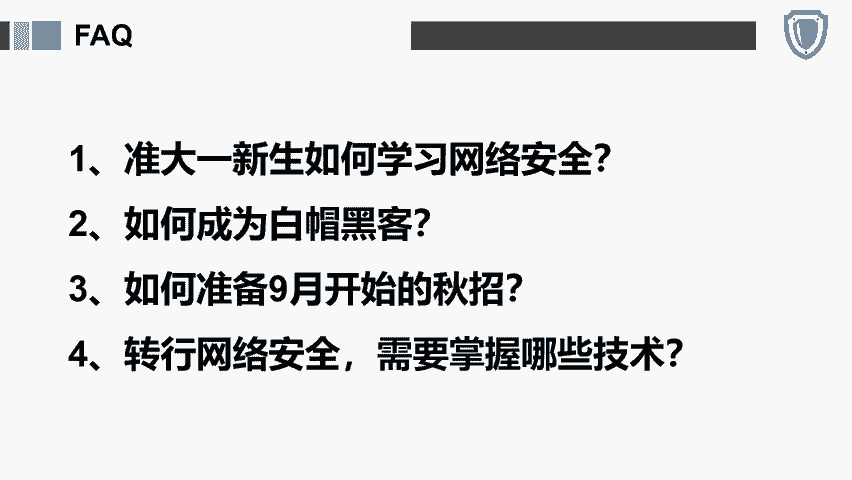

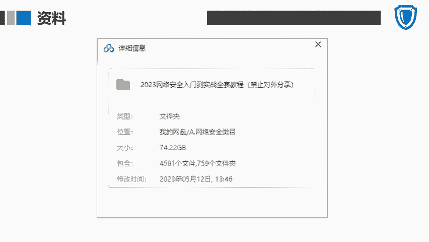

以及推荐大家去阅读的一些电子书籍。还有一些面试经验以及网络安全最常用的这些渗透的工具等等等等。那么我们的学习路线是什么样的呢？我也给同学们来介绍一下啊，这里我给大家把我们完整的学习的路线分成了4个板块。

分别是安全基础。

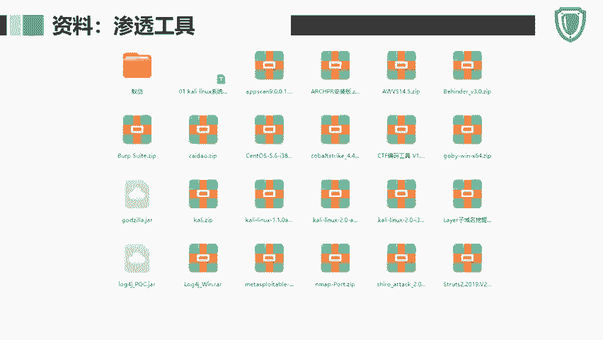

渗透技术、渗透进阶和逆向面杀这个环节。那么安全基础这一块我们学的是什么呢？主要是学的对于这个行业和法规的了解，还有linux操作系统里面。

各种各样的常用的命令计算机网络前后端开发的一些编程语言以及数据库的基础。渗透技术这一块呢包含的内容，各种外b常见的漏洞。比如大家非常熟悉了sq注入叉SSCSF文件上传文件包含SSF叉叉E远程代码执行。

还有逻辑漏洞，密码暴力破解中间件框架的漏洞等等。其次呢就是我们其他的一些平台或者系统的漏洞。比如操作系统相关的漏洞，语音环境相关的或者APP和小程序的渗透。好，那么在这个里面呢。

我们也需要去学习一些wa绕过的技术以及各种常用的工具。比如大家非常熟悉了MSF。

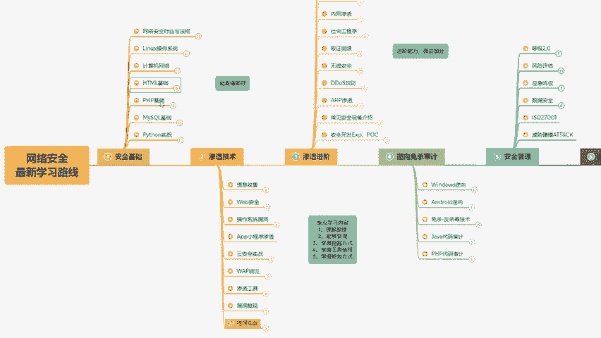

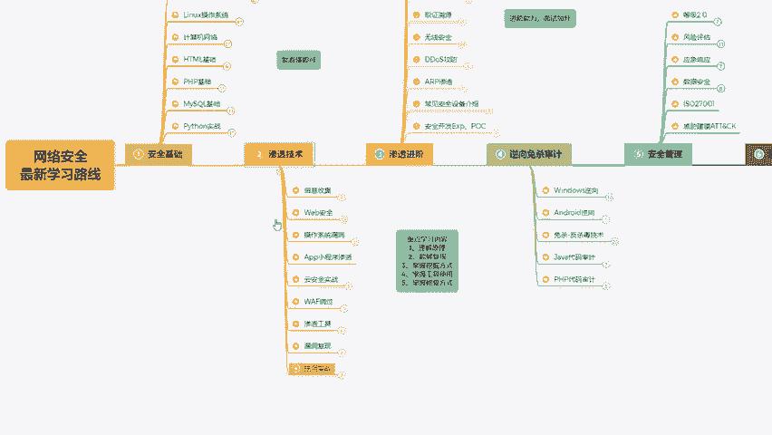

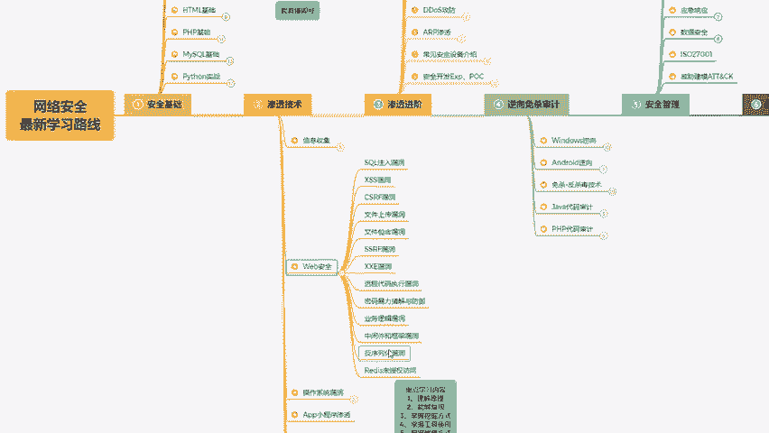

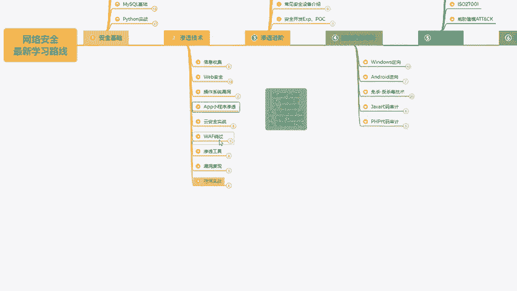

CSBP漏扫的工具，还有一些这种一体化的渗透的工具等等。然后还要去做一些热门的漏洞复现和靶场的实战。那最后呢就是这个。

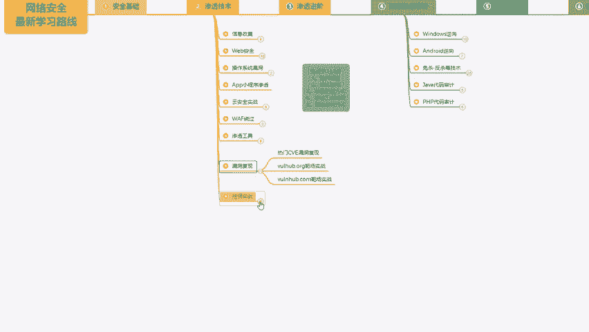

挖漏洞实战的这这一块的内容啊，因为我们学了这些所有的技术，要把它实践运用起来。我们可以在公益的或者企业的SRC或者CNVD教育，还有重测的一些项目里面去提升自己的实战技能。啊，那么第3块呢。

渗透进阶这一块，我们给大家推荐去学习的呢，包括一些渗透相关的一些框架或者后后渗透相关的一些工具，以及权线维持全限提升隧道技术内网渗透社会工程学取证溯源无限安全AIRP渗透低dos的攻击和防御。

还有安全设备的介绍。HRP和POC的编写。最后一个逆向审计的这个环节呢。

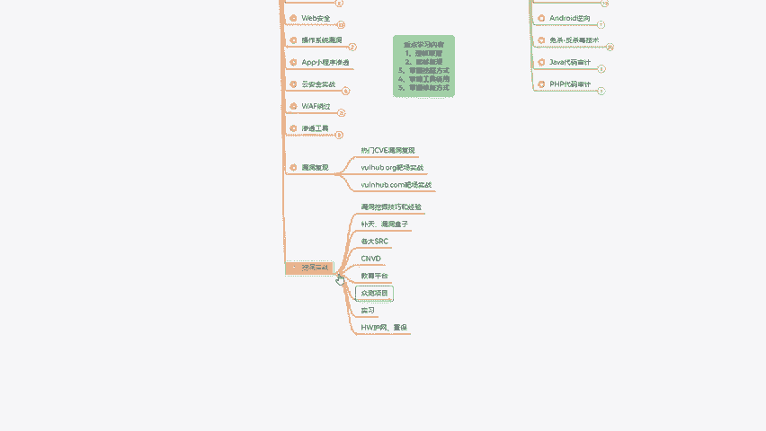

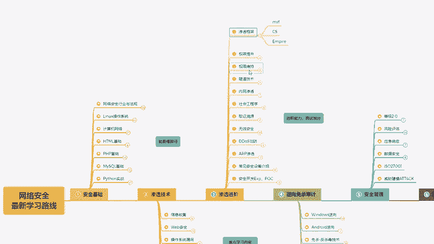

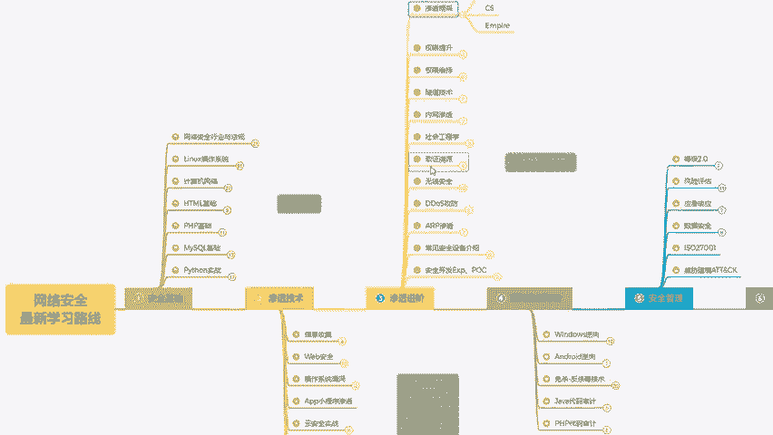

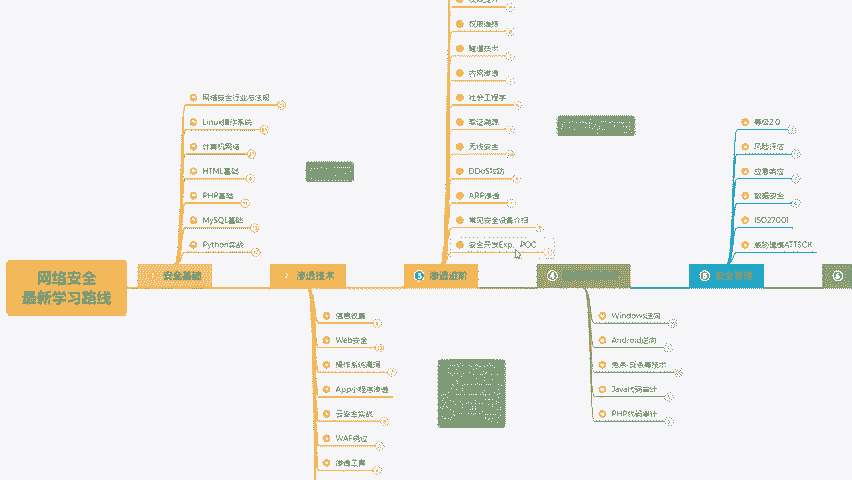

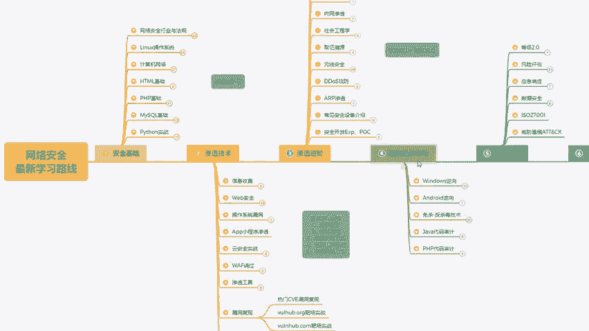

推荐大家去学习windows令下安卓令向免杀的技术，以及java和PHP的代码审计。那么在这样的一个学习路线里面呢，我会手把手的带领大家从零开始去学习网络安全技术。

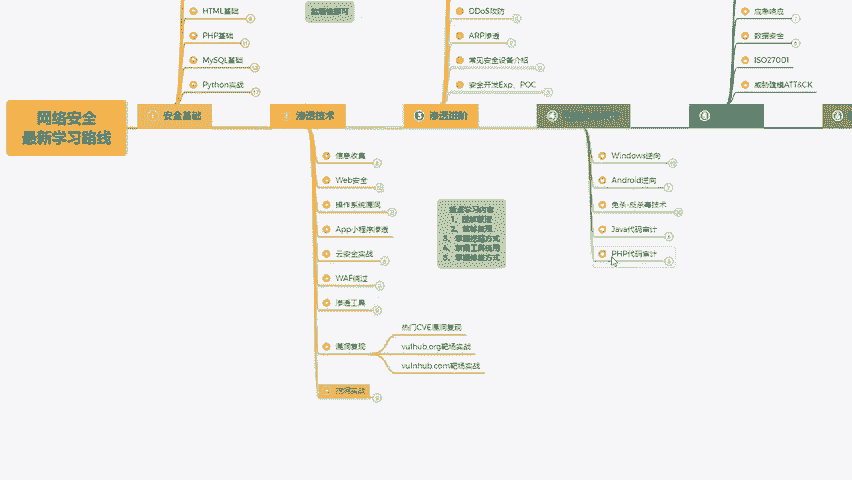

如果你需要在这个教程里面提到的课件笔记源码工具，大家可以去看一下我的评论区。获取方式呢，我已经放在评论区了，都可以无偿免费的分享给大家，希望我的这套教程呢能够帮助大家在自学网络安全的道路上。

少走一些弯路。如果看完我的这套教程，觉得有帮助的话呢，也可以转发给有需要的人，你的三连关注，就是我持续更新的动力。

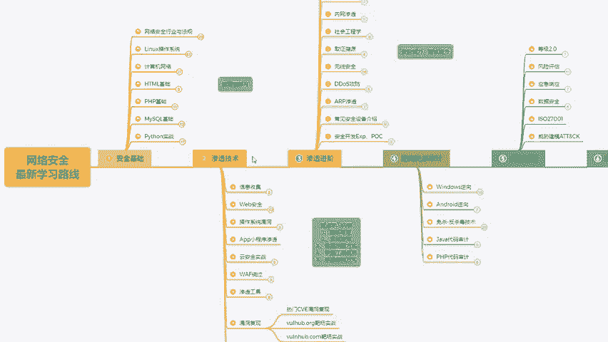