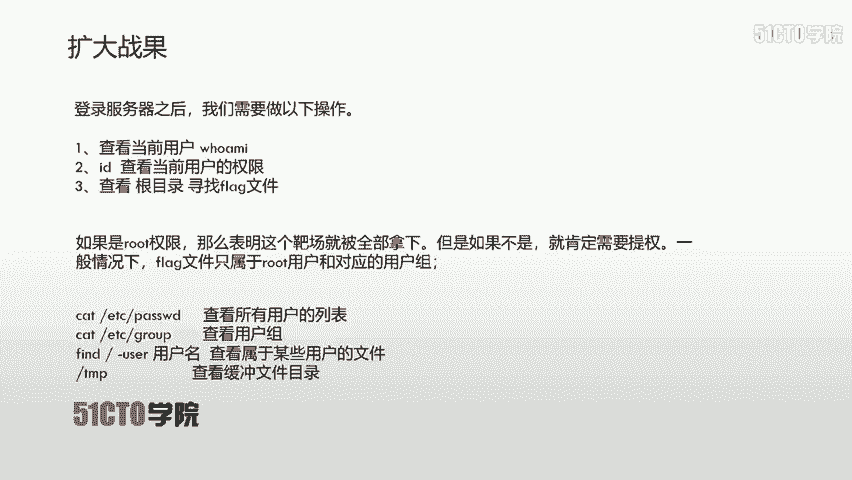
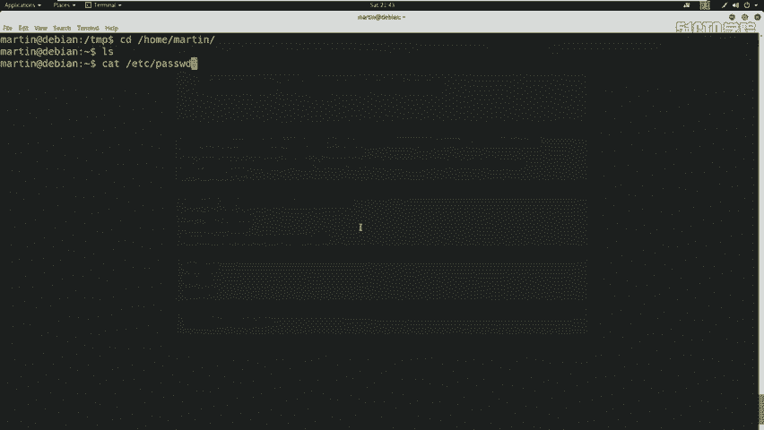
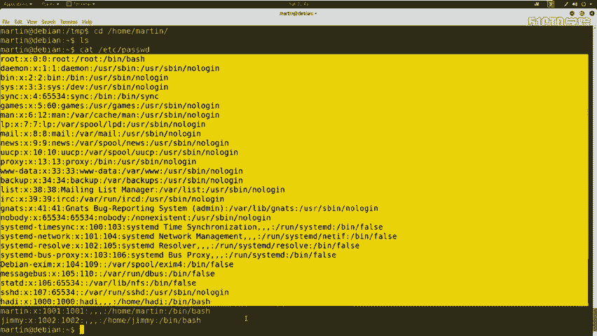
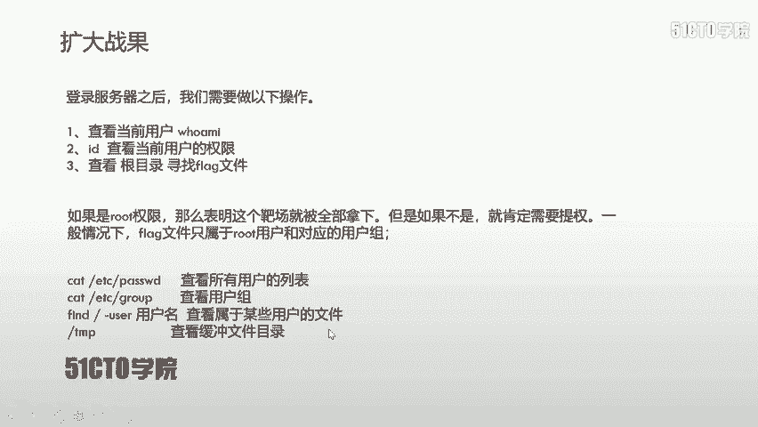
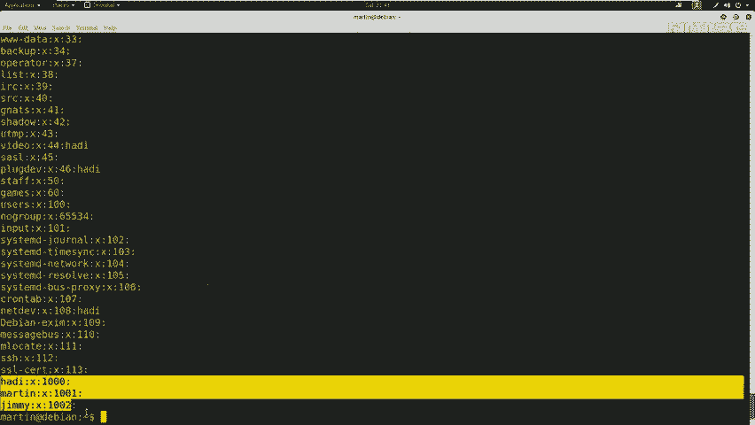
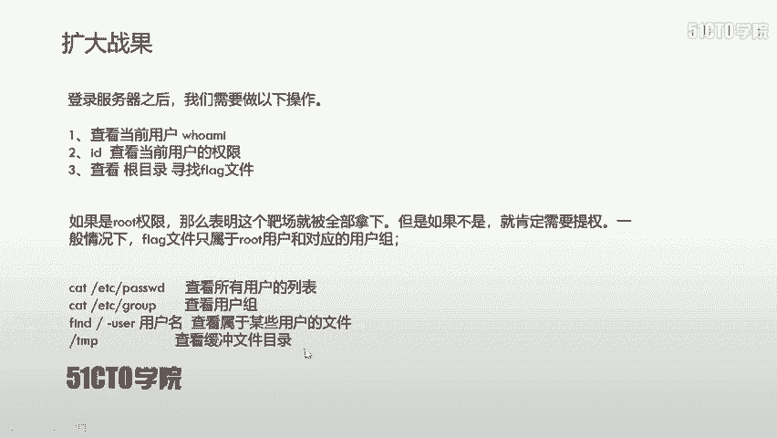
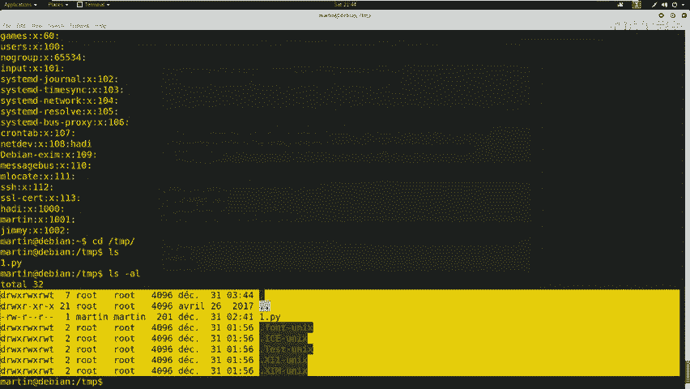

# CTF教程天花板， 国内顶尖战队大佬亲自授课，零基础入门，真题讲解，持续更新中 - P9：10.CTF夺旗-SSH服务测试（拿到root权限） - 白帽黑客-杰哥 - BV16z421i7dm

呃，好，大家好，呃，我们继续呃来进行root服务器。上节课我们讲到哎已经使用martin用户登录哎这个服务器，并且查看了martin的对应的权限和它的用户组，使用到ID命令。

发现哎我们当前登录这个martin用户，并不是哎我们。想要的这个root权限的用户。所以说我们需要提升对应的权限。因为咱们一般情况下，这个flag是属于root用户和root用户对应的用户组。

在进行提全之前，我们可以哎使用以下几条命令来查看一下对应的配置信息。首先，cat杠ETC杠PASSWD查看所有用户的列表。

我们在哎主机里面实现一下。cat杠ETC然后PASSWD回撤查看哎所有的用户组，哎，所有的这个用户。

会发现哎，这里有jimmarin heading以及一些其他的啊系统用户，哎，以及这里有root用户。

除此之外，我们还可以查看一下哎这个用户组使用cat ETC group。

cat ETCGROUP回车，哎，会发现有很多的用户组。这里有handingmartin j哎以及一些其他的系统用户组。

除此之外，我们还可以使用fide，然后再根目录像，哎，以及加上杠user这样一个参数，加上对应的用户名，查看哎，属于某些用户的文件。除此之外。

我们还可以查看一下哎这个敏感目录缓冲目录TMP查看是否哎具有一些临时性的文件在这里。这时候哎咱们就查看一下这个缓存哎文件目录。

这里。CD且切换过去L。在这里哎有1个1点PY，哎，这个一点PY哎是我之前自己上传上去的。如果说哎没有这样。我自己上传这个文件，那么这里啊是不具有任何可见的文件。都是一些隐藏文将。

