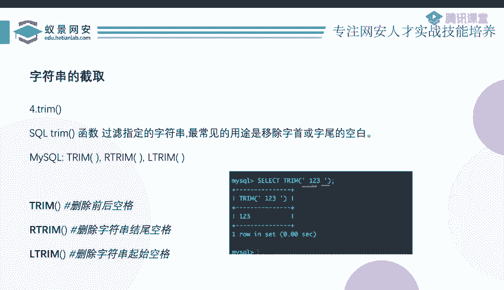
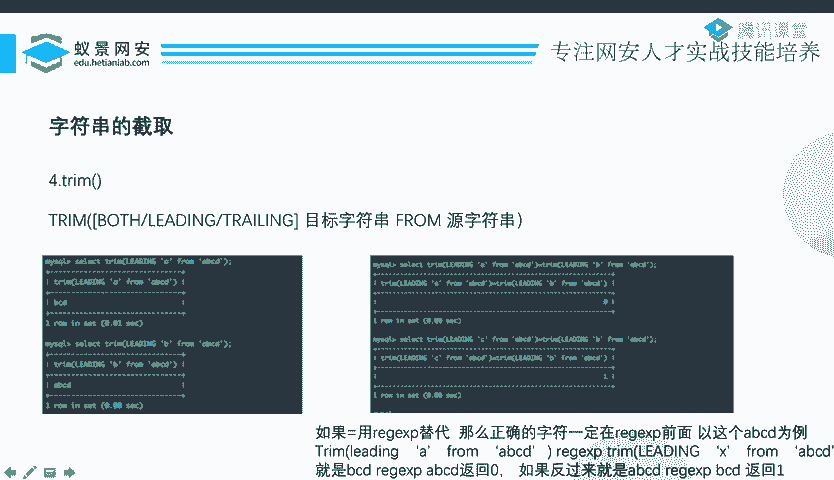
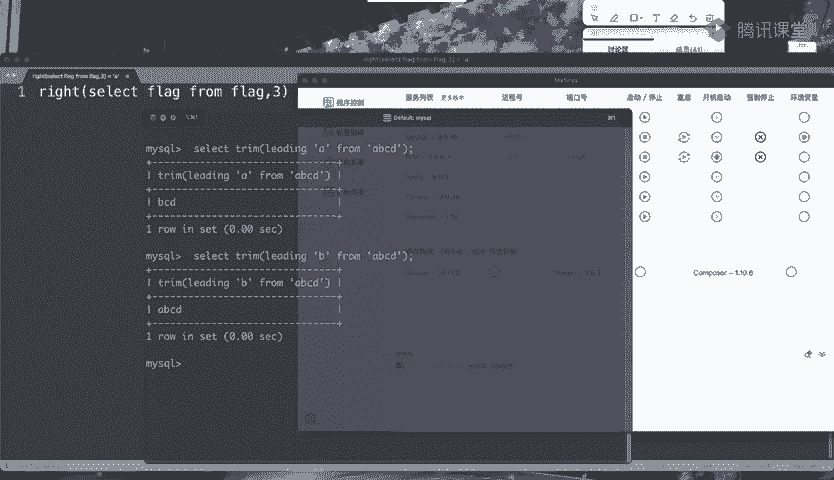
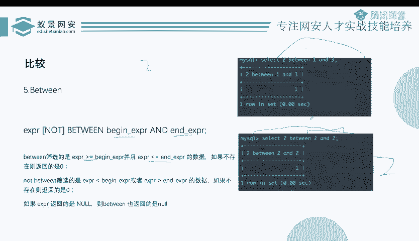
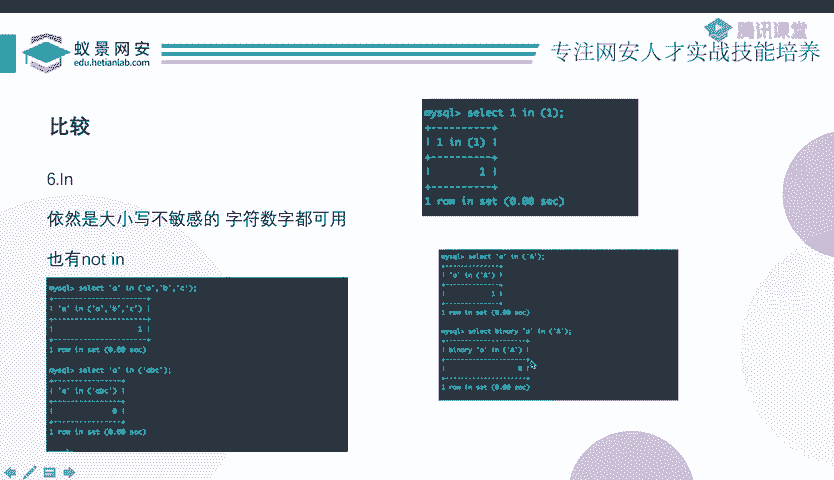
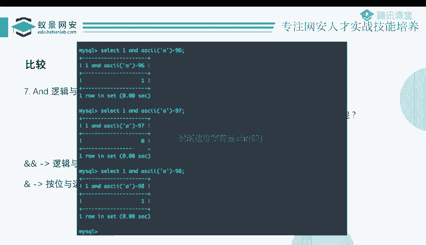
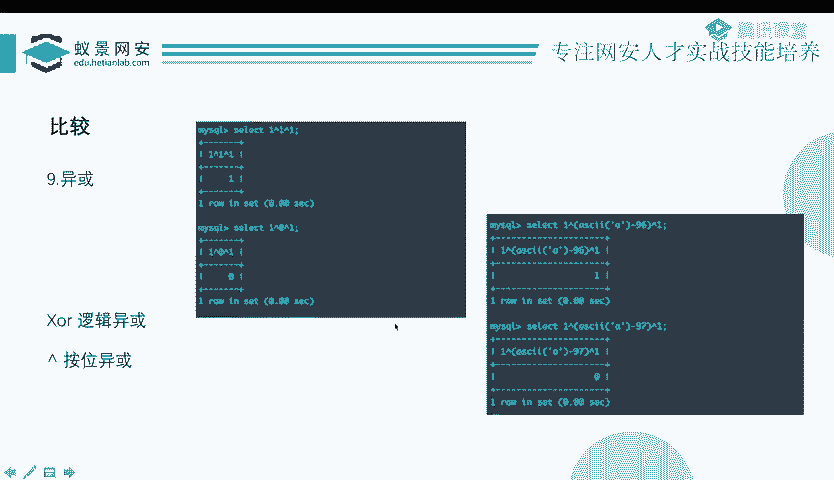
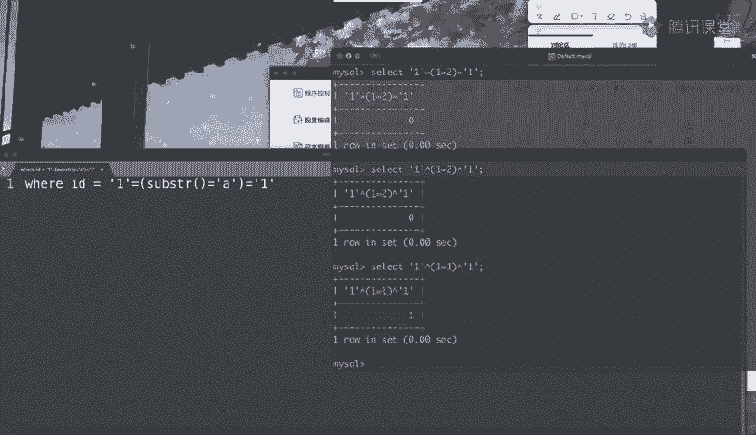

# CTF教程：CTF初学者必备的1000个练习题，每日一练，百日成神！（ctf-wbe／ctf-pwn／ctf-misn／ctf-逆向） - P14：ctf-web13_布尔盲注2 - 白帽子讲安全 - BV1dp4y1j7aN

呃呃，这个前面这个阿克玛到底等于啥，我现在不知道，我假装我不知道。然后我问他说你是不是大于一，他说是我说你是不是大于100，那，不是，那是不是大于50呢？是的，那是不是大于90呢？是的，是不是大于95。

不是是不是大于97。是不是大于98？是不是大于99不是了，不大于99而大于98，是不是就说明它是99？你看现在本来他正确的结果是99，而这个99。如果我正常的跑的话，我从一开始比较比较99。

我要跑99次。而刚刚我只跑了几次，不到10次，我是不是就可以把它跑出来了？这说明什么？这说明有了数字之后，我们就可以用大于号小于号。而有了大于号小于号的判断。是不是你就可以使用一种叫做二分查找的东西？

二分查找这种算法。呃，本来阿斯克玛一共有120多位，那么你最后可能只需要十几次就可以把这120多位中精确的查找出来，不用。跑120多次了，这是不是能大大的减少你发送的包，大大减少你的时间？

减少你的流量对不对啊？是不是一个非常不错的办法啊，这就是。

呃，阿斯玛的好处。当然如果说呃阿斯克玛这个这个函数被过滤了，你还可以使用一个叫ORD的函数。这个ORD函数呢是它的同名函数。啊，用来去绕顾这个关于阿柯玛的过滤啊，这里边也说了，当你能用数字的时候。

尽量用数字啊，三个优优点我们已经说了，第一个是呃能让它精确截取，第二个是排除一些特殊字符的干扰。第三个是可以使用二分法，加快你的速度。

前面这几个呀呃基本上就是比较常见的，除了right以外呢，还有一个left。

left和right差不多。PPT里面没写。但是呢大家可以照模画虎一下就理解了，就是它会从左边开始截取，从左边开始截多少位。但是现在呢这个left呀，它变的就不再是首字母了。

你会发现它的首字母永远是最左边的那个，它变的是尾字符。这个时候你再把它套到ask克里边，好像就不太好使了。因为你再套进去的话，它就没变化，它永远都是A的。

这个时候呃一个技巧就是我们使用一个叫做reverse的函数。这个reverse函数呢会把它给倒过来。那你想你把它给倒过来之后呢，就好办了。你看倒过来之后，是不是本来最后一个字符的变化。

现在就变成了首字符的变化。你是不是就可以继续给他套阿斯克玛了？

对吧。看到没有？所以说如果是left，使用left的话呢，技巧就是left，然后套re再套阿玛或者套ORD。嗯，这是一些比较常规的方法。包括您去百度上搜搜这个mysqQ支符上截取。

基本上搜到了也就这么几种。那接下来呢呃我们来看一些不常见的东西。首先第一个就是chep。这么个这个函数啊，它本来并不能进行自符串截取，它也确实不是进行自符串截取的东西。他干嘛呢？

他会去移除字首或字尾的一个空白。你比如说头边最最开始啊有好多空格，我把这个空格给你干掉，他是干这个的。但是呃这个好像没有办法进行字符上的截取。啊，于是呢我们继续去看他的这个手册，看他说明。

会发现呃它有一个新的用法，就是training括号里面加上bo或者leading或者training一个目标字符串from原字符串。刚才我们说trim是干嘛？它是移除自首或字尾的空白的。

而现在这个新的用法是什么意思呢？我要移除它自首啊或者字尾的目标字符串，就移除的不再是空白了。我想想移除什么东西，就移除什么东西。然后这个boss呢就是自首自尾都移除啊。

leading呢就是指只移除前面的traing就是指移除后面的。😊。

那我们呃来试一下。T啊，你比如说我就来个leading吧。我要移除ABCD这个字符串开头的A。那返回什么呢？它是不是就返回BCD啊？没问题吧。然后如果说是boss的话呢，那会前后都移除，如是那个确定了。

就就移除后面。那么如果说啊我说我要移除ABCD这个字符串开头的B的话。他会反馈什么东西呢？他会返回他本身。因为ABCD并不以B开始，所以说他什么都没干，移除不了这个B，所以就返回了它本身。

但是呃这好像还不能进行字符数上截取，它只能。移除开头或者结尾的某个字符串。这怎么样？像刚才一样呃截取一部分，然后测试截取一部分测试呢？虽然现在不能像刚刚那么精确的截取了，啊它本身也不是做截取的东西。

但是如果我们用一些技巧对它加以利用的话，实际上是可以达到相同的目的的。因为你会发现当我用trim进行操作之后，它已经变成了字符串的一部分，它已经开始有那味了。那这里边呃有一个比较不错的技巧。

是这样的，我在这里边给大家写一下。嗯，我把这个用I来代替。这个呢就就还是ABCD。如果说我们能够做这件事情，那其实还是可以实现一个字符上截取的。具体是怎么利用的呢？大家可能看不明白。没关系啊。

我现在来给大家解释一下，就这个I呢并不是一个字符I呀，我是用它来表示一个字符的意思。你比如说现在I等于一个A。那么I加一就是BI加二就是C，大家能明白这个意思吗？那这少写一个加一啊，是这样的。

所以你比如说我现在是A，然后这是B，那这个时候是呃C，这就是B这样的那这个怎么样就可以把它截取出来呢？实际上你光截取是不行的。你你会发现我们使用的等号就是比较就是这个train。

你必须要截取和比较一起用。然后我们刚才也说了，如果说你trim leading一个不是正确的起始的一个字符。你比如说它以A起始，然后你 leadinging一个B，leading一个X。

leaing一个Y，那么就会返回它本身，对不对？好，所以现在我就来跑这个I就是这个字符ABCDEF的跑。然后我先测试第一行的这个东西。

就是leading I fromABCD和leadingI加一 fromABCD。你比如说这个I就是X，那我就che leadinging X from ABCD和leaing y from ABCD。

我看你这两个结果是不是相等。如果说它是相等，那说明什么呀？说明这个I和I加一，也就是这个X和这个Y都不是它正确的其始，对不对呀？能明白这个意思吗？因为什么呢？

因为如果说你leading leadinging一个什么东西，你这个东西不是它的正确即使，它是不是就返回它本身呀？

你看leaing X方ABCD返回的就是ABCDleading y fromABCD返回的还是ABCDABCD和ABCD是相等的。所以我就知道了啊，我这个I和I加一就是这个X和Y都不是它正确的结果。😊。

所以我就试试试，如果说他俩相等，那说明我找的还不对。而一旦在某一个数的时候，这俩东西。突然不想等了。leading I from ABCD和leadingI加一 fromABCD不相等了，说明什么呢？

说明是不是至少有一个tri，它不再是它本身了呀。因为一个字符串不可能有两种起始吧，你你要么以I为起始，要么以I加一为起始，这就意味着它至少有一个是正确结果。然后另一个不是正确结果，比如说这个正确就是A。

那这个现在我是I是AI加一是B然后leaingA fromABCD得到是BCD leadingingB方ABCD呢，得到是ABCDBCD和ABCD不一样。😊，啊。

所以说我们做第一步就是执行第一行的这个式子，然后找这个I，一旦这俩不相等了。不相等。说明正确结果是I或者I加一。因为你没有办法知道它到底是I还是I加一，对不对啊？没关系。

那我怎么样找出来它到底是I还是I加一呢？我接着再进行一次筛查不就好了吗？当我找到它不相等的时候，我才来执行这个第二行语句，我用I加一和I加二做判断。

因为经过第一行的这个表达式我已经把正确的结果锁死在I和I加一了。然后我用I加一和I加2做比较。如果说I加一和I加二相等。那说明I加一和I加二都不是正确的结果，那我就把I加一删掉，那正确结果就是I。😊。

得正确为I。如果说不相等呢，那说明I加一和I加二里，其中一个是正确的结果。而我们刚才又所死在I和I加一了，所以说如果不相等，那么只能是I加一。为正确结果。你看这样的话，我是不是就可以。呃。

通过这个t加上一个等号的比较，把这个呃头一位给找到了呀。而你找到头一位之后，你接着找第二位那就简单了呀。比如说第一位是A，那我就triam leading AI就完事了。

这个I呢就是AAABACAD你一位一位的试一位一的试，最后是不是就可以把它呃整个的就全都跑出来了。哎，所以说这是呃用trim，因为trim本身并不是做字符串截取的。然后现在我们需要用它来帮我们做帮助。

所以要对它进行一些相应的变化，这就变得很复杂。但是呢复杂归复杂还是可以用的。其实除此之外，你还有很多其他的思路。你比如说我判断它这个trim I和trimI加一的长度是否相同，等等，和自身做比较等等。

有很多种办法去比较它，这并不是唯一的。但是只要你你进行一个相应的判断，能够把争取结果判断出来，就是OK的。哎，这是tri。

还有别的吗？还有，但我们现在在这儿暂时先不说了。😡，然后接下来我们就简单说一说这个。比较比较就比较简单了，等号、大于号、小于号，这些都没得说了。

然后后面主要是一些你能听到了什么like注入正则注入那那些乱七八糟的东西了。我们现在在这里总结一下，第一个就是like。呃，因为数据库这个东西，实际上你是要对对它里边的数据进行筛查的。

就像你用excel一样。你也是要把里边一行一行的东西给他筛查。而你比比如说这个东西啊就是保存的是一些学生信息，学号吧。那这个学号我现在呃不要精准的查询某一个学生。我现在说我要查询所有2019级的学生。

所有2020级的学生。那么实际上我就是在匹配这个student IDD以2019开头以2020开头，是不是这意思啊？但是。那什么等号大于号小于号的没办法完成这件事，除非说你大于201900000。

小于201999999。但是这这种办法太笨了。而且这个ID它到底是数字还是字符，我们也说不好。😊，啊，于是为了。它能让这个数据库进行这种泛泛的查匹配，匹配一半啊，我们有了一个like。

呃like里面呢可以使用百分号做任意。你比如说我想要查询2019，然后后面是任意，那么我只要写 IDlike2019百分号就好了，就会把2019后面是任意的呃全都给搞出来。

那么啊这里边有非常关键的一句话，只要大家把这句话记下上就好了。如果说在没有百分号的情况下，like和等于号就是一个完美相同的东西。如果有有百分号的话，那么like会处理那个百分号等号不会处理。

如果没有百分号的话，那like就是完美替代等号。如果说没有没有等号，你可以首先可用like。然后呢，接着就是正则注入里边说的regEP和allike。

它就是把前面的这个呃字符串呀去和后面的一个正则表达式做匹配。然后看你能不能匹配到。但是这里呢他要注意一个问题，就是你会发现我这个db本来叫小写的CTFgame，但是它匹配大写的CTF还是可以匹配到的。

😊，它是一个大小写不敏感的东西。然后如果说你想要让它大小写敏感呢，你要加上一个banary这个关键字，你加上banary关键字之后，它就变成一个大小写敏感了。它敏感之后就不会进行这种泛泛的匹配了。

如果说你不加的话，那它本来正确结果是大小写全都有的，结果呢你就只搞出来呃，全大写或者全小写，那那肯定是说明你哪里有问题啊为解决这个问题呢？你只要加上banary，把你的脚本重新跑一遍就好了。😊。

完了下一个呢也比较简单，就是比。一个东西比寸什么and什么，它实际上是一个大于等于什么，小于等于什么的过程。其实说白了就是这个比寸后边是一个B区间。因为这里边啊PPT上也写了。

你看它这个不是呃比be一个呃be和一个and嘛，这是大于等于be小于等于and。那么必区间你比如说这个正确结果是2，那么实际上呃有人写脚本会这么写，会写2be一和3。那确实二是确实比成一和三的。

但是没必要，因为它是一个B区间。意味着between一 and3，也就是属于1到3这个B区间的数，整个数有仨分别是123，你这么写确定不了它是2，明白吗？然后有的人啊那那我是不是可以写呃。

比顺一and二比顺2and三也没必要。因为这是比顺，这也不是什么数学的区间，你完全就可以写死比顺二 and2，这个上界和下界相同，一点问题都没有。

你这样是不是实际上slide2比22就就就是在表达二是不是等于二的意思，是不是啊？😊，和slect2等于2是不是一样的呀？这是你写脚本的技巧，没有必要把它。放大区域。

你就直接让它的上界和下界相同相相相同，然后搞一个阿斯法去判断就完事了。

接着呢是印注入啊，就是使用印做一个比较。这个印呢其实也比较简单。页后面有一个括号。这相当于是我们在数学上说的那个集合的属于元素，是不是属于一个集合，就集合论里面学那个东西。呃，也没啥可说的吧。

您看就比如说在在括号里边是不是有ABC啊，然后说A是不是属于这个ABC这个集合呢啊，它确实是的。啊，就这样啊，唯一要说的就是它也是一个大小写不敏感的。你说这个小A是不是在大A这个集合里边呢？是的。

那怎么办呢？我要把小A加上一个boundary，那这样的话它就大开写敏感了，就就不在这个里头了。所以说啊E呢做比较的时候，你也要加上一个Bary。

后面的其实就。一般不用来做这个。

呃，比较的判断，就像这个什么and or这种东西。

所以关于这个我就不多说了啊，我们主要来说一下这个抑货的问题。易货实际上是一个很有意思的东西，而且也有一个呃比较著名的注入方法，就是易货注入。那么这个易货注入啊。抑或也可以用来做比较。但是。

我们说的抑或注入和那些likeck注入什么的，确实还有点不同。易货注入并不单单的是使用易货来做比较这么简单。它呢实际上是有一种呃比较特定的一个呃使用场景吧。就是当你这个题不能让你用注释符的时候。

好，我们回忆一下，昨天就是where子句，where一个什么ID等于。等于一个doer ID这个 dollar ID是你的输入。然后我们怎么办的呢？我们输了一个一，然后首先自己输手工的输入了一个单引号。

这个单引号和前面构成一个闭合，然后按一等于什么什么东西，对吧？但是呢后面还有一个孤00的单引号影响着我们的语法。那这个时候怎么办呢？我们用一个井号或者点点空格，这种把它给注释掉。这是我们昨天干的。

但现在。不允许你使用注射服了，井号也不行，减号也不行。那这个时候后面的这个孤零零的一个单引号，就必须要把它给用起来，是不是啊怎么办呢？我们是不是可以这么写啊，and1个1A。等于1。

就中间这些是我们的输入，也就是说我自己手工构造一个1一半的一个单元号和你后边这个构造闭合，这确实OK的。但是你真正的要注入数据的时候，语法肯定可可就没有什么按的一等一这么简单了。

你要把这个一等一换成那种乱七八糟的截取表达式，对不对？那个式子，如果说题目过滤的言，你可能要进行很很严格的变化。😊，那么呃这个时候中间你要怎么搞呢？我们就可以使用异火。

我们可以让它这个一这个这边的一个一，然后这边一个一，然后中间亦或上一个表达式。这个表达式呢就是说呃sub string一个什么什么东西，是不是。系。是不是等于A。我就可以这么写。

中间啊从从这个一到这个一这里都是我的一个输入。然后这个易或中间有一个括号，括号里边是一个波尔表达式，是字符串截取和比较呃两部分组成的这个波尔表达式会返回一或者零。

那么这个一和零就影响着这个连E或是的一个结果。那这样的话，你就可以呃通过波尔回显进行判断了。所以说易或注入，其实更多的实际上是用在这种场景，就是没有注是符的情况下，怎么把它连起来。这除了抑货以外。

其实你还可以用别的。你比如说我这是不是可以用等号啊，连等OK吧。😊，一是不是等于一等于一，我们来试一下。select一等于，然后一个表达式，哦，这里用字符型的。没关系，他。

这个字符和数字在mys克里边呃内部有一些机制进行转化。具体在这里我我不展开说，但是我们可以看一下，你比如说里边我写个一等一，这是一个真，对不对呀？然后它会返回一，我说一等于二是假，对不对呀？

它是不是就返回零了呀？😊，对不对？你看这个中间这括号这个表达式的真假，是不是正好就影响着整个的结果呀？那我把它换成异惑，OK吧。里边是假，它返回0。里边是真，它就返回一，对不对？

所以说当你使用了一个抑或或者说连等的情况下。里边表达下来结果就能刚好呃在后在外面反反映出来。如果说等号不能用的那你就只用用易或了，或者说还可以用减号，那2减1减12减0减1是不是也可以返回一或者零。

其实有很多种不同的方法的。

所以这个是实际上是疑惑。