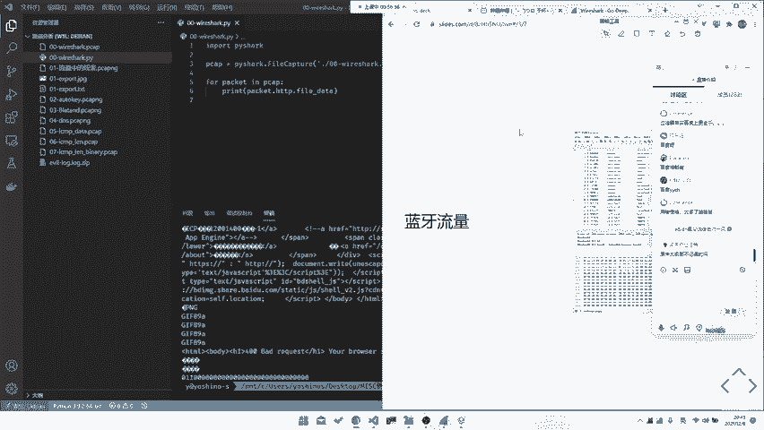

# CTF教程：CTF初学者必备的1000个练习题，每日一练，百日成神！（ctf-wbe／ctf-pwn／ctf-misn／ctf-逆向） - P18：ctf-web17_基础之流量种类 - 白帽子讲安全 - BV1dp4y1j7aN

可以，那我们继续回来讲一下我们的一个流量的种类。就是。就我们刚刚讲过，其实就是流量，其实一般来就是网络流量OSI7层模型的USB的就是USB就是做USB hubub或者说是做那个叫HID的。

还有就是一种就是可能是其他的一些蓝牙啊，或者说是一些其他的802。1协议促但。比如说ZigB的呀，都可以，都是以可能我们需要去做分析的。最常见的可能还是网络流量吧。当然网络流上也有很多种类了。

我们后面会讲到。比如说我们往后走，就是就是这是OSI7层模型嘛。这个我相信大家如果说是学网络计算机相关的话，应该大家都比较熟悉。但是我们这边还是会按照每就是。OSI7层模型的话，它的分的就比较广。

就是分的就比较嗯。分的就比较详细了。比如说他从物理层的这种。呃，物理层的以太网，然后不是物理层的这种802。1A80或者802。802。2。这种的话一般来我们是不会考虑物理层的。

就是我们基本上没有考物理层协议的。然后数据链路层的话嗯考的也不多。网络层可能会考，就是直接去考一些SDMP的协议。然后传输层的话就更多啊，就是可能去做一些这种TCPDUDP的就是纯TCP的分析。

就是他会在TCP上建立一个他自己的应用层协议。但这个应用层协议我要下个分析不出来，或者说是他自己。设计的那这种情况下的话，就可能需要我们自己去。

看然后的话呢再往后的话就是我们的一个呃绘画层的SMTP或者说DNSDNS也是可能会作为分析工具的。再往后的话就是表示层，表示层的话，这个一般来就嗯考的不多嘛。

gooffer也算靠offer其实也算表示能，但是。这个我们就不提了，这是外b里面的东西了。如后这种话的话就是应用层。一般来的话就是应用层会。呃，考的比较多一点，就是比如说是去考HDDP的。

或者说是去考这种FTP的都有可能。呃，你甚至说是我们仅仅真的HDP就很多种考法。我们后面也会讲到，对吧？然后话再往后走就是。数据链路层的话嗯。也基本没有，就是TCPIP4层模型里面。

数据链路层这一层是我们基本上忽略不计的。呃，反正我见到现在来，到现在为止，我也没有做过是测试去考以太网的题目。但是不也不排除未来会有嘛，对吧？也不排除我以后可能出一道题目给大家做做吧。

然后这号哈网络层对网上的话会稍微讲的比较多一点。然后我们就一点点讲嘛。当然其实你甚至可以说物理层，比如说我们去考一些，比如说啊比如说我们去考一些曼哈顿编码，都都算是物理层的一些就是通信相关的知识嘛。

比如说你去做这种码分多指。马分多脂去做就是马分多指的这些解析，或者说是你去做这种。啊，或者说是你做十分多指的，这或者说是跑这种allo后协议啊，什么都有可能，对吧？这个就是T网里面的东西了。

就是你往后走的话，会有这种。数据链路层数据链路层的话嗯考的也不是很多。呃，但是也不排除，你可能或是会从数据应用层里面扣点东西出来给大家考，对吧？所以说这两个的话可能考的不是很多。再往后的话就是网络层。

网络层的话嗯，一般来的话可能大家会比较关注于网络层是我们能考到最底层的，相当于是。比如说他会去考一些。LARP协议的话嗯也可能会出现，就是你看可能会去做在这些协议上面做一些手脚，让你去对他进行一个分析。

或者说是他会在就是他会让你去统计IP地址也是有可能的。所以说网络层经也是可能需要去注意一下的。然后再往后的话就是走的一个。这儿传输层传输层的话，基本上就是我们所说的一些端口号啊。

或者说是一些UDPTCP。然后UDPTCP的协议的一些信息，比如说是握彼次握手，或者说UDP是有协议的啊，UDP是无协无连接的TCP是有连接的这些东西之后这些东西我相信大家嗯不了不理解的。

大家去搜搜文章，或者说是去买本既往的书看看也可以。😊，然后的话再往后的话就是。保安继科等于0。但是这就是我们的矛盾所在。如果miss它是一个什么样的，就是又讲点稍微讲点题外话，就co速讲点题外话。

m这种东西，它就是你要你什么都会。你甚至可能要点会会点开发，会点既网，会点操作系统，会一点数据库，什么都得会一点。对吧这些东西都是都是记往里面的，但是在流量分析中就会用到。然后所以说。一入CTF深似海。

公就是你甚至可以说就是。你可能需要又会rap又会m，又会又会胖，又会逆向，什么都得会，你甚至可能还得会点区块链，说不定在说不定m就会出现区块链了。然后话。对，L3H的那个UDP解析。哎。

所以说就比较恐怖。你这样最后最后往上走的话就是应用层。应用层的话相对来说考的就比较多，而且应用层可以考很花很花。比如说我们公共协议。公共协议的话。公共协议的话。

这种就考的甚至会在公共比赛里面会让你通过公共协议让你去打，或者说打一查一些公共协议的一些流量分析。这个的话我其实相对来说可能还是比较新的一个方向。呃。

因为最近我发现就是因为最近出到公共协议的比赛可能相对来说会越来越多了。但是我发现做的人可能还比较少的。就是公共协议这块可能大家会要去比较关注一下这样子。

所以说然后再往后的话就是有一些HTDB协议的一些分析。比如说是去做CQ注入的，或者说是做这种已见啊，或者说是兵器啊，就是这种攻击流量的分析。再往后的话会有这种FTPFTP可能考的嗯不是很多。

但是现在会有从FTP打一些东西，但是这个不算在流量分析里面东西。然后还有T2STRSS就是SSL嘛。呃，SSL的话嗯，也会有会有在SSL协议上面做一些文章。比如说让你去做一些中介人攻击之类的。

当然最后的话其实就最大大头的就是一个自定义的协议。啊，因为自定义协议的话，它本身的这种协议的格式啊，包括是这种协议的一些字段表示，或者说是一些东西，都可能是挖下它本身不自带的。然后要你去通过一些嗯。

比如说是有的有的协议是会有一些前人栽树。比如说是有比如说有一道题目，就是EB3，不知道大家有没有玩过，就是那个叫乐高那个机器人，EB3的那个通信协议。有钱人写了这个叫。解析脚本那还好。

那如果说没有解析脚本，让你去自己当场。当场搓当场手搓就比较恐怖了。比如说我们之前dedecon出赛的时候，decon出赛的时候有一个游戏，它就是就是要你手撕协议。其实那道题不是手撕起来，就逆向了。

逆向在手撕协议。但最终我们做出来是因为我们先撕的协议，把协议撕出来了，然后再去做的这个叫。呃，再去看的这个叫逆向，对吧？也是有可能的。当然呃这种协议还有会有很多很多，比如说是还有一些未开源的协议。

比如说是未未公开的协要，你去自己分析，要手撕这种叫嗯这种的话，其实难点就在这里了。但是至于怎么手撕协议，我们这个也没有办法说是去教之类的，就是或者说也没有办法去很好的训练，只能说是你耐心的去找资料。

然后的话有一双善于发现异常的眼睛。从里面挖出一些我们的一些东西来，对吧？然后的话当然这是一个网络层的协议，再往后走的话会有这种USB的协议。我们随便掏个USB出来给大家看看。这个题其实也是比较之后。

我们会讲，就说我们会详细点嘛，就是USB的话，它分成三种设备类型。第一种的话就是一些呃UART就是USB的UART这种它只用来做一个。通信只用来做一个数据传输，不做其他的用途。

还有的话就是这种USBHID就是human input devices，就是人体输入设备。比如说像我们的鼠标。比如说像我们的这个叫像我们的键盘，都是我们的这个叫都是一个人体输入设备。

这种人体输入设备的话也是一个，你看这个就是一个。鼠标的一个流量哦，这是个键盘流量。那我们后面会讲到，对吧？然后包括是可能最后一种USB准类，最后一种就是1个USB memoryory。

就是走USB的一些储存设备。比如说我们的U盘，比如说我们的移动硬盘都是我们的USBmeory系列里面的，这个就是USB设备的一个分类。当USB设备也有高速设备，低速设备了。

我们大部分情况下分析的都是USB低速设备，就是我们的用用用户输入设备就是。呃，human input外包括鼠标键盘。之后当然我们也会出现一些手柄流量。之前我们出现过一道去年那个叫叉CTF哪一场。

我忘记了呃，出现了一个steam手柄的流量，让你去通过steam手柄去抓它的一个输入，包括之前也会出现NS的一个手柄流量，我忘想哪场比赛了，也有NS手柄流量的一个解析，对吧？所以说这些东西都是。

稀奇古怪的，你身边能想到的任何有通信，有交流的地方都有流量，有流量就可以用来分析。所以说这是1个USB的USB的话，当然它其它其实USB相对来说就比较简单了，就是都有工具把。所有的我们后面也会讲到。啊。

这是USB的那其实当然往后的话，我们还会有其他的，比如说是这种。蓝牙流量。蓝牙流量的话嗯，这个就蓝牙流量其实相或者说这蓝牙流量只是举个例子嘛。呃，甚至我们可能会说后面会有Zig个B的流量。

或者说是在一些。它会有一些就是比如说是有一些洗流量，它会就是有一些物理层的流量。比如说iphone C啊，或者说SPI这种流量，它会直接跑到TCT上也是有可能的，会有一些设备去这么跑。

或者说是其他802。1协议错。对吧，都是有可能的。比如说你看这边会有一些。哦，魔王刚忘记给大家看一眼。忘记给大家看一眼YR夏里面长什么样的。你看上面这个就是一个所有的流量窗口，就是流量一条条记录。

下面的话就是它的一个。分层。比如说这里的话其实相对来说比较简单，就是一个frameme，然后里面有USBURB，它就它的一个协议包，然后是里面是它的每个字段。比如说它destination啊。

URB IDD啊，type啊这种就是一个一它的所有的一个字段都在这里。然后的话比如说像蓝牙这种。蓝牙他也是分很多层协议的嘛，比如说bluetooth，比如说bluetooth HI。

比如说LCL two C这种对吧？然后就是像这种去从local host remoteote中跑这种协议，这是一个蓝牙协议。那我们刚回头再看一眼我们的外部协议。就是比如说我们看这样一台THTTP协议。

HTP协议其实从上往下单放了好多层嘛。比如说这是一整个frameme。然后这层是以太网的，比如说以太网里面就可以看到两台设备的mac，比如说destination是这一台，然后sourcece这台。

你甚至从能里面看出来这是TPlink的对吧？然后是做的IP然后这是一个指示字段，用来指示下一个层是我们的IPV4，对吧？IPV4的话就在这里是IPV4的，就是source对吧？

再往后走的话就是这个叫TCP的TCP的话就是我们的锁就是一个。哦。这上面是IP，就是TCPTCP就是方有1个SRC sort，就是s source port，还有destination port。

包括是。HTCP的一些，比如说是sequence是多少，ACK多少啊，le多少啊，包括他所有TCP协议的一些。在这里。当然最后就是我们的1个HTTB协议。所以这东西它都是很完整的保存在了一个。

保存在这个里面。过滤器怎就是。哦，这就是一个完整的一个流量包，对吧？所以说这东西其实你一般来一般来话，我们做分析，只做顶层量量分析，就是它能解释到最顶层HTCHTTP的这种。然后的话之后的话我们才会讲。

就是会讲到一些就是可能是往下落也是有可能的。当然不排除往下落的可能，对吧？包括这种line based text data，它这个就直接把我们整个HTTTHTTP的流量解析出来了。对。

刚刚有同学在问说是这个过滤器怎么用的？是这个过滤器。这个的话其实首先第一步就是你这个字段它都会提示给你的。至于这个字段是什么意思，你直接去往下官网上查就完事儿了，肯定是比我讲要全的。而且这东西嗯。😊。

不可能说是你全背下来了，你只能说是当场用当场查，或者说是你可能去备一些常用的，比如HTTP点request点。服务员啊这种都是。都是一些嗯常的针的几个，你背下来，就是或者说你记下来就行了。你做题做多了。

其实基本上都可以自理知道。然后。对，用啥使啥。所以说问问问人不如问百度。

叫什么跟跟跟群友跟群友聊跟群友聊天两个小时，问百度10分钟，对吧？都是这样的。所以说大家要善于使用搜索，善于使用搜索引擎ms里面是这样的。

