# CTF教程：CTF初学者必备的1000个练习题，每日一练，百日成神！（ctf-wbe／ctf-pwn／ctf-misn／ctf-逆向） - P20：ctf-web19_拿到题目该做什么之关键点提取与信息收集 - 白帽子讲安全 - BV1dp4y1j7aN

这一步那第二步是什么？就是关键点提取。什么叫关键点提取呢？就是你需要去找这看数据里面有几种我们需要去call的数据。因为。一个时间序列上的数据可能很多很多很多。比如说这里可能还好一点。

就是可能就只有9000多行。那如果说多起来的话，那么显然不可能每个东西我们都去想办法给他。当然每个东西肯定都是一要的啦，因为它可能是在时间序列上变化，拿到flag。但是的话你要去通分析某些要点的时候。

不可能是所有数据都是你的要点。所以说你要提关键词叫什么划重点。那么哪些部分是重点？第一部分就是提取出来的数据中的一些敏感部分。

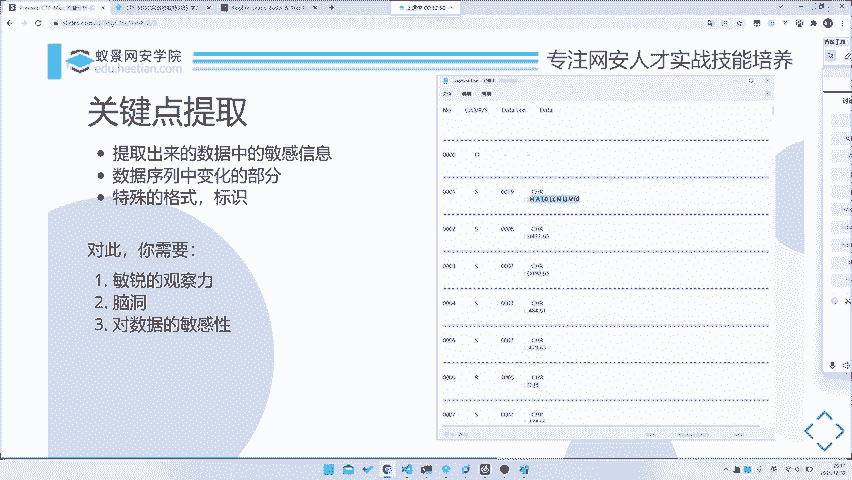

或者说其实说是变化的部分。比如说这我们这个数据里面。从头到尾。它有这么多东西，对吧？那么它变化的是什么？首先第一个是它的这个I，就是这个叫什么number，number是一个呃递增递增递增变化的。

没有我们不是很care这种东西。然后呢，这个CORS我们这里不理解是什么东西，那这他看上去好像都是S，那我们也不ca。那最后的这个data line。和我们这个data，那我们去对应一下。

比如说这里是19，你去数一数这里是不是16个字符，对吧？08，你说这里18个字符，比如说这里去标数12345678，A，对吧？正好，所以说哎它是不是就是指这个的长度。那我们显然重要的是什么？

重要的就是这个data了。那，所以说我们重要的东西是这个data也许是我们的要点。然后就是还有就是一点，就是它里面的一些关键词或者说关键特征，也是我们需要去call的。

我们为什么需要去call这些关键词，就是特殊的格式呢？因为这些特殊格式很有可能帮助我们去。找到它是一个什么什么流量。比如说这里其实我们是不知道它是什么种类人量的，对吧？

因为我们这里并不知道它是跑的一个什么东西。但是的话我们是能够搜索出来的。那搜索你肯定关键词，对吧？那所以说你这里可能需要去拿某些东西做关键词。所以说最后搜索的话，就考需要考察到我们最后一个点。

就是我们的信息搜集能力。啊，当然这里也会去说到，就是如果说你要做关键词提取的话，你需要哪些具备哪些能力。首先就是你要敏锐的观察能力，对吧？你至少需要看出来它什么在变，什么不在变，或者说哪个A。

你看这东西A是不是可能是重要点东西。还有就是你需要脑洞。有这道题目其实相对来说比较简单，就是可能是你稍微看看就可以了。但是有的题目你真的需要一点点的脑洞才能把它给它搞出来，对吧？

或者说你需要正好和出题的思路对上才可以做出来。🎼最后一种就是对数据的敏感能力，就是你需要对这串数据有很敏感很敏感。比如说你看到。

比如说你看到flag的那比如说你你你们大家能背下来flag base64是什么吗？你看到这样东西，就是看到什么ZM叉HZ这个东西，你就很应该很敏感的了解到它是不是我们的一个flag。

比如说我们的flag的16进制666C6167是不是对吧？对，所以说你需要对数据有一定的敏感能力。当然这里的话其实呃跟我们这个叫阿克玛之类的没有任何关系，还没有什么关系了。所以说你需要去这里的话。

其实我们对数据的敏感能力不放在这里，是放在这个地方。

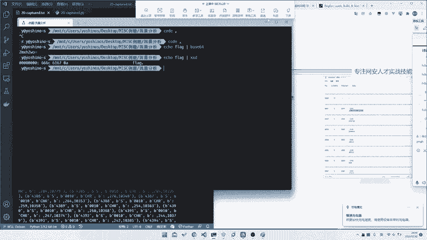

就是我们需要看这个特殊格式，对吧？那我们这个特殊格式是什么？因为我们要把这个特殊格式扔进我们的浏览器里面扫，对吧？所以说我们这边要去看最后一个点就是。😊，信息搜集。就是你对于上述提取到的所有的关键信息。

我们去招进行一个信息搜集。因为你纯就是什么就什么不要重复造轮子。如果说前人哎，你甚至帮你写好了这个题，甚至说是原题，那我们是不是能够直接通过搜索就能拿到了？显然会快多了。

所以说我们这里需要先去进行一个信息搜集。😡，那么信息搜集的话，我们就需要去把上述的关键词提取出来收集。那就是又又又涉及到了如何提取关键词。那信息搜集我们要搜集什么内容查找。比如说是这种协议协议分析题。

你可能需要查找这些协议的详情。或者说查找这个协议的内容。或者说查找我们是否有这个协议的，直接有一个那个叫文档，对吧？或者说你去看是否会有一些嗯比如说是原题啊，或者说类似的题目啊，PPT啊PPT。嗯。

大家看录屏吧，没有PPT就暂时不分享了。然后的话对此的话，其实你需要有一定的能力。比如说你有需要有一些搜索能力。就是你需要有一些就是搜索技巧，你有特殊的搜索技巧吗？你比呃直接百度搜，其实大部分都搜不到。

然后还有就是脑洞，你需要还是也需要一定脑洞去。比如说正好捕获到这个点，就是杨缩的点，还有就是你需要有丰富的网络资源，就是不知道大家有没有个收藏夹，在家里面藏了各种宝藏网址，对吧？啊。

还有最后就是你需要有一定的英语能力。当然你这里甚至不是不只是英语，你课是需要有韩语、日语之别的能力。呃，可以说个小故事，就是之前有一个比赛的某个题目。然后那个题目。中文搜不到英文搜不到。

但是如果说你用韩文一搜就可以搜到韩韩有一个韩国人的比赛。是个原体。对吧所以说。所以说这种东西这种东西其实你也没办法说，因为。呃，因为这东西嗯不可能说是必备某种原则思导。

所以说你多掌握几门外也是很有必要的。好吧，那这也就涉及到这个题，我们该怎么搜。

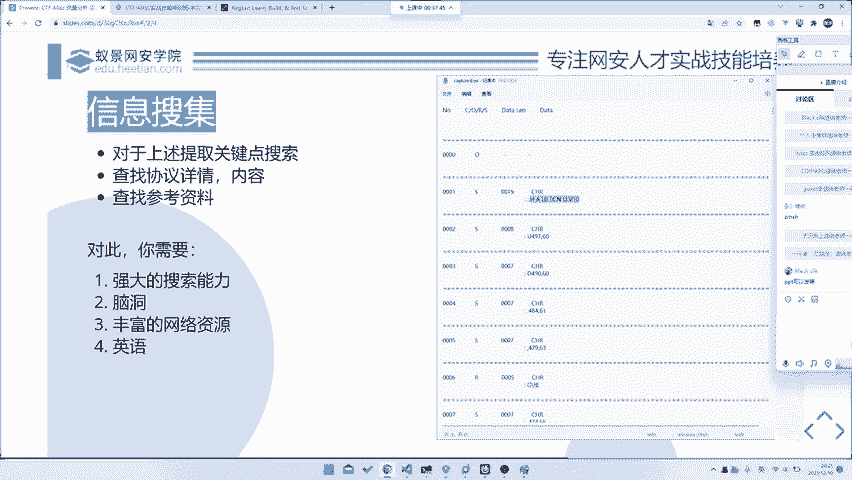

呃，我忘了那个题目是什么了。反正那个题目反正就是反正是web题，然后反正只有韩国人的网站上才有啊。我忘记了，反正他那个题目最终是韩国人出的对吧？对吧？咱咱咱不说了，咱不说了。

咱就是看那这个里面我们能搜什么，那这个东西我们是否能搜，比如说这个什么CRS之类的那我们直接扔进。😊，啊，我们所我们就完整的模拟一下一个搜索的过程，好吧。比如说我们先扔进百度里头。百度里你搜了半天。

你啥都搜不到，对吧？这个是CO他说是转域之类的，这个搜不到。那我们再看其他的字段，那这些字段肯定都没什么用处了。那这个data字段里面是否是我们有我们一可能想要的东西，后面都是代数字的。

一串不知道什么东西，对吧？那我们不知道，但是你看第一头东西。😊，哎，它是否是有一些什么比较神奇的格式，要一定要换在第一位。那我们所以说把它给你不在群里面搜一搜。哎，还是做不到。哎，你看这里对吧？

一模一样的一串东西在这儿了。那是不是说唉这东西我们是不是有用？😡，我们再去看这个题。诶。

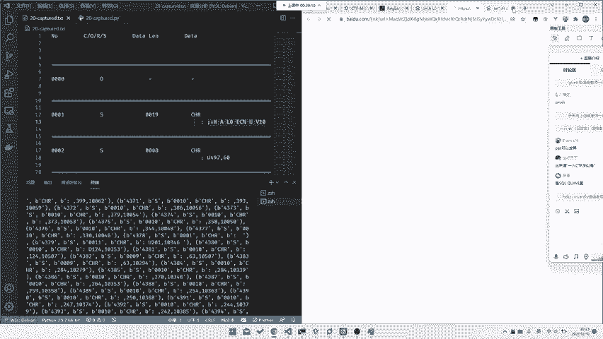

这什么串口DMPL指令刻字机自动识别图形轮廓并刻回PY。哎，你看什么由于家里开了印刷厂，近几年改了改了什么方法。哎，你看对对不对？那是不是就是印刷厂，比如说是那个什么刻制机的一个什么协议。😊。

那我们是不是。哎，对吧？我们找到了，那我们现在需要找什么？我们需要找这个题目。其实你它这个文它这个它这个还是有一定帮助的了。就是你应该其实已经差不多知道这个它的格式协议是什么样子的。

但这东西其实还不是很明确。那我们如果说就要继续往下找，比如说它更加复杂，或者说它这个协议里面涉及的不止这些东西，那我们是不是可能需要去找一下它的协议的一个呃文档，那我们直接去搜。

比如说这个这个协议叫DMPR协议，对吧？那我们直接去搜。比如说我们还是百度。串口DNPL。协议。你看啊其实你不管怎么搜，其实你们都只能知道这篇这一篇文章。所以说你这一场哎，是不是我自我方法错了。

我们扔骨骼里去试试。也是一样的，他告诉你刻字机，它只有刻字机，其他什么都没有，对吧？DMPR语言支持什么刻字机绘制机刻字机。😡，这个DNP啊，什么HPG啊之类的对吧？都有，但是它就是没有文档协议。

那怎么办？这个时候就要涉及到我们最后一个点。就是你需要有英语能力，为什么？DMPR协议就是DMPLprotocol。冰他就有了。在这儿。

他作 digital microprocessor plot language，对吧？它是一个什么向量图文件格式。并且是用来什么from什么houston instruments，右键翻译词好。

给大家翻译一下。当然你这里如果说直接搜DNP协议是不行的，所以说你一定要搜DNP protocol，所以说你需要一定的英语能力。😡，你知道协议是prologo吗？你不知道，那你就记了。那DMP的谁。

你看。😡，什么司机司机，咱司机应该是原文是driver吧，对driver驱动其语源于什么什么什么HP接而不见容器，参阅其一构定义。哦，定义在这写了。

比如说什么reset是什么with是什么hat是什么re X什么re y是什么什么pen select是什么什么东西，对吧？就这样的。

所以说这里又看到了是什么pen selectpen speed是实用来设置比的大小和什么比的那个叫速度，然后就是move对吧？移动到什么地方？然后joaw是什么down是什么东西。

然后什么pen circlecle什么东西，对吧？这就是一个指令。那我们再看这儿设DNPR文件DNPR命令。

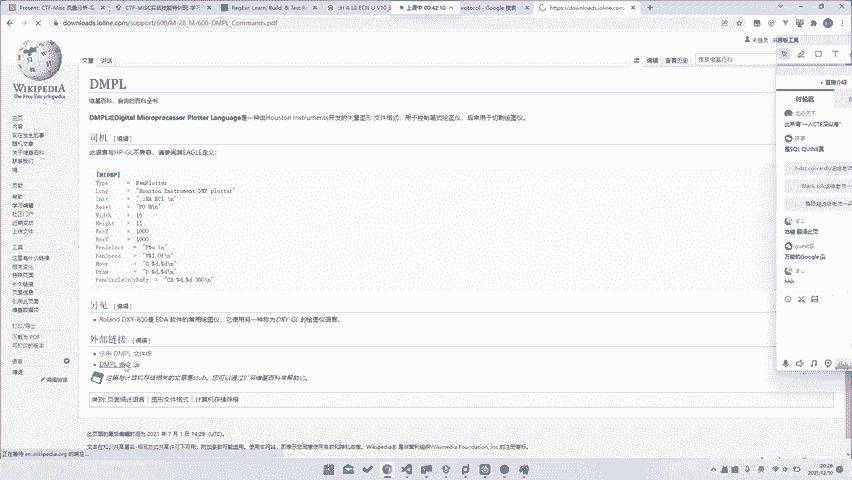

恭喜你找到了他的一个文档。那么基于文档的话，我们就可以做了，对吧？我们就完整的理解它是什么意思。就非常棒了。哎，那这里我们是不是就是进行到了一个搜索，或者说你拿着这个文档。

其实这个题目就其实相当于是结束。你不管说是以后你后面怎么做，你或者说你花时间分析啊也好，你去想办法给他写脚本也好，那我们这里就。我们就不ca你到底是怎么做的。但是因为你搜到这篇文章。

所以说你就肯定能做出来了，对吧？就可以了。所以说这里就是涉及到了我们的一个搜索能力，它非常好的印证了这几个点啊。😊，我觉得这个题真的非常好，就是他虽然很简单，但是他对我们的这个每个点都提到了。

他有这个他需要我们有强大搜索能力，也需要你去有一定的脑洞。当然也需要你去有一些丰富的网络资源。比如说你至少有百度google你之类的要会吧。当然最终就是你需要英语，你没有一定能力，你打死都投不到。

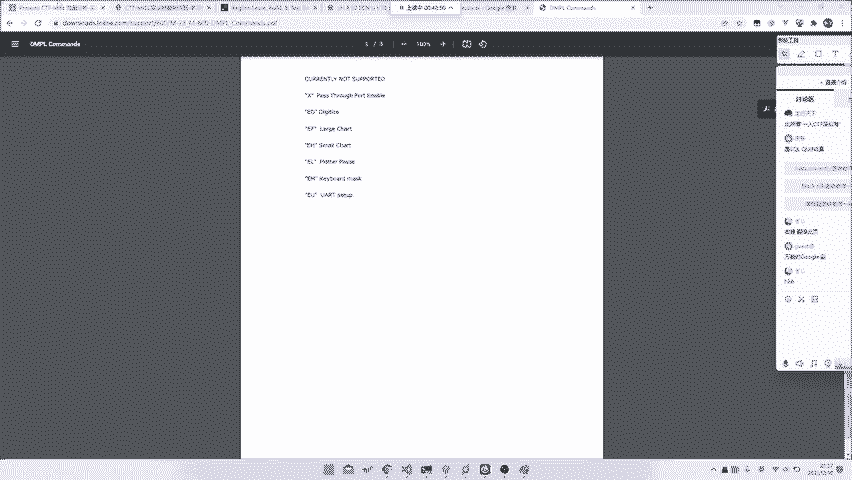

那账样号我们再回到我们的这个题目本身来看怎么做。

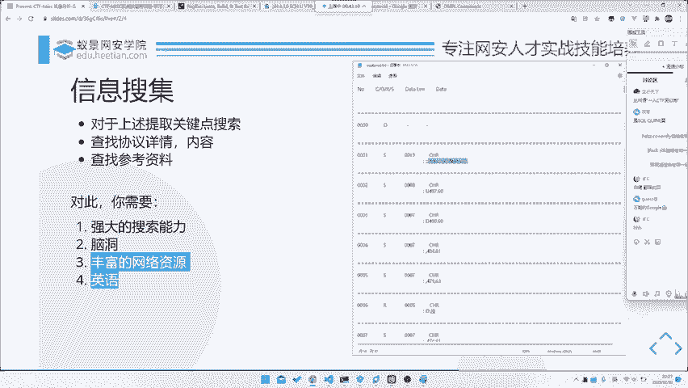

那我们把数据提取出来之后，我们知道了up是抬起来，down时是down还序，然后其他东西都是移动。那我们这也就其实只要对这个数据进行处理就行了。那么我们对于这些数据处理中，我们其他数据我们不call。

我们只call这几部分数据。就是冒号后面这个是逗号开头的，或者说up开头或者是当开头的那我们再去写上这个表啊，是在这里逗号或者是up或者是down，对吧？拿出来。拿出来之后，我们去给他画。

那至于它怎么画呢？那显然很简单，我们就无所谓了，我们不管拿什么画都可以。比如说我们这里其实我们这里如果说不管这个阿按 down的话，我们可以试一试。比如说嗯。这里我们去给他。这套我们东西不管它了。

我们就重新写一上脚本，我们去试一试。如果说我们没有。我们并不知道upend down是什么东西，但是我们因为看到我们后面是有一串点的对吧？其实这样也是可以做的。

就是如果说你并不知道upend down是什么意思的话。比如说这里你去给他找一个嗯。想一想啊。我并不确定这里这里能不能做，但是呃应该是可以的。哎，忘记了，这边要EXIT掉。那我们这里试一下。

我不确定这个可不可以啊，我们先把图画出来再说。涂在在在这。你看哎，其实我们如果说我们什么都不处理，我们不处理upend down的话也是可以的那这里它比较歪头，就是头脖子不大好啊。我老师脖子也不大好。

那我们。Yeah。我们给它调个个儿，然后看一眼。哦。当然你会发现，就是如果说我们这里不做这个叫fiix size这些调整的话，如果说你直接画的话。其实你会发现它会坨成一坨。

因为它的那个叫横坐标和纵坐标差距很大。当然是它的横坐标和纵坐标比例很大，大概是1比1的关系。所以说我们这边去调整一下。那至于为什么要调整，为什么那个那我们这里就不是很ca，就是你做题过程中。

你会自己去发现，然后你就调整。那如果那我们只关心我们的前面这个步骤，对吧？你看哎它是不是就画出来了。😊，这个虽然他要倒过来，那我们倒过来我也不开心，所以说我们再换一个方向。

比如说这里的话就是那个叫它是在。Y轴它倒过来，那我么Y轴去变一变，我们看Y轴它的范围是是多少。0的那我们就算到600吧，我们就600减1减。比如说这是XY上面600减，那就600减。其实负的也行啊。

因为这边是他没说是坐标是那个，我们直接负的也行，那我们不管了，我们就看这样600减1减。

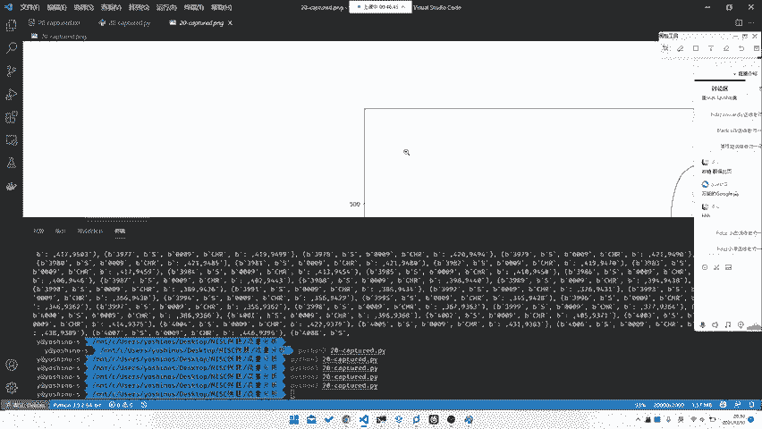

诶。诶。哦。不应该在这负应该在X上浮。我们看一眼。哎，他是不是又好了？就我们甚至不需要管，比如说我们甚至不需要call，就是说它到底是怎么up怎么当的那我们这里是不是就可以直接拿到这个flag了。

就是直接ACT什么33FB是吧？非常好看。虽然它虽然它这个点点点击不是很完整，但是的话他把整个flag画出来了，对吧？那么这样子是不是我们就能拿到，就是即实我们不知道ipad档，我们只是把数据提示出来。

我们也是可以拿到的。所以说呃拿到你up down之后，其实我们更就是更重要的就是我们彻底理解了这个协议。然后我们可以如果说这道题如果说没那么简单，它会做一些，就是它这里没有任何混淆了。

因为它没有移动到什么其他奇怪的地方去。那如果说我们这里做一些混淆，就是什么它抬起来之后又移到了其他什么地方，然后移下一下移下移移完之后再画，对吧？也是有可能的那这里的话没有移。

所以说这边就可以直接做画出来的，那是不是就可以做出来我们这个题目了，对吧？所以说这个题目从头到尾不知道大家有没有仔细思考一遍，就是哪几个步骤。就是首先你需要去给他进行数据的初步分析。然后就是比如预处理。

然后就是你要对它进行一个关键词提取。然后最后的话就是把这些关键词或者是数据扔进我们的搜索搜索引擎里面，然后去搜索一下，就能拿到我们最终的这个flag。所以说这三个步骤就是不管是应对任何题目，简单题也好。

难题也好。这个题目其实相对来说还是简单的。因为它本身没有涉及到一些比较复杂的一些其他知识。是有的题目，比如说嗯让我想一想那个题目叫什么。嗯，那个题目。不知道大家有没有打过，就是冷箭杯那个题目。

龙监碑里面有一个那个叫。呃，在这个文件。就是他用的是一个。呃，是这个吗？呃，IOS对，就是这个。他用的是一个那个叫什么，就是一个。一个ho叫什么什么什么什么scatter。

什么什么什么skycrapper还是什么东西的？我看看叫什么了。啊，哎，我忘记了啊，这个叫什么store story，对吧？storeoryway，我忘怎我不知道怎么读啊，然后为了纠正一下发音。

不给大家带来错的错的。教大家错的东西，我们学一学怎么发音。tayawaytaway对吧？这这东西偷渡者，他拿这个东西做的那这东西的话，他是一个勾写的，然后这东西还挺这东西当时我还。呃。

这个这个比赛我没打过，后最后后来做了一做，对吧？

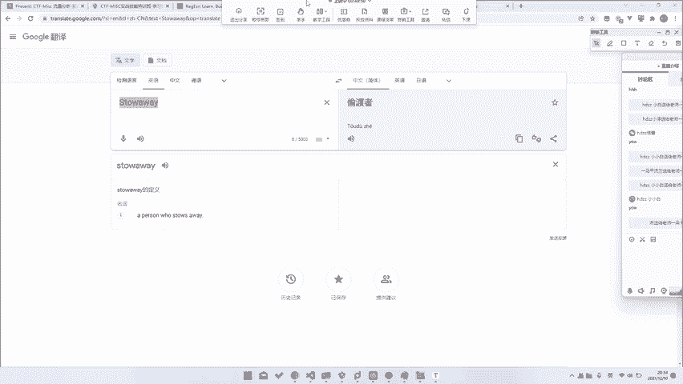

啊，哎，那他怎么回不去啊回去了？

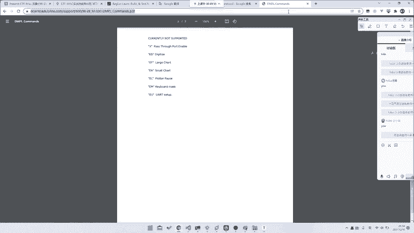

在这t away，我看之前还搜过。他这东西就很烦，他这东西够起来。然后他的协议封装，其他协议封装不繁不繁琐。所以说你这边如果说你要去拟的话，你就需要去完整的把这个协议分装拟出来。

去看它的这个叫完去从它的源码里面偷它的协议封装。比如在这个proto里面。在这个protoco店搞吧，好像是。对它就是定义了各种字段名，然后是定义了各种就是文件包的协议。

所以说你这里需要去逆他的逆他的整个协议，然后才能拿到这个东西。所以这个时候如就是你就是必须要走完三个步骤。比如说你先去给他呃分析，然后提关键词，然后填关键词之后。

然后最后再去给他这样进行一个搜协议的完整立项，对吧？所以说这就是一个呃标准的题目。所以说这里的话，其实我们是说说就是说的这三个步骤。就是对任何题目都是适用的。不知道大家有没有理解一下。

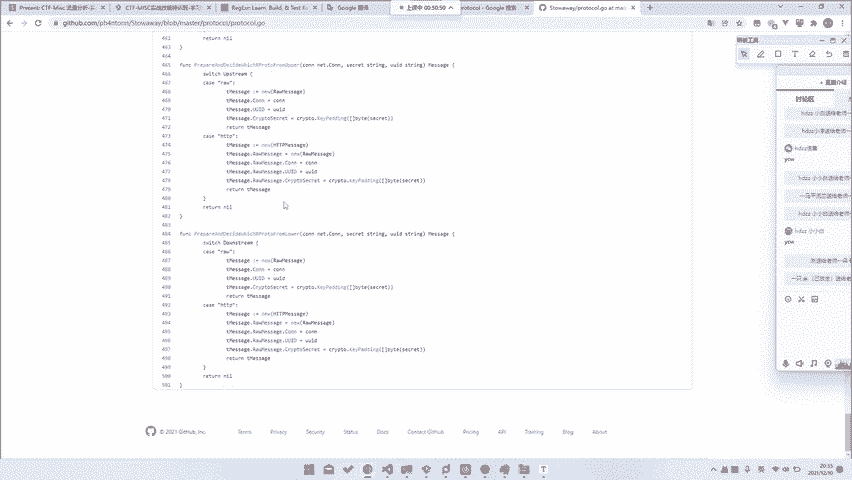