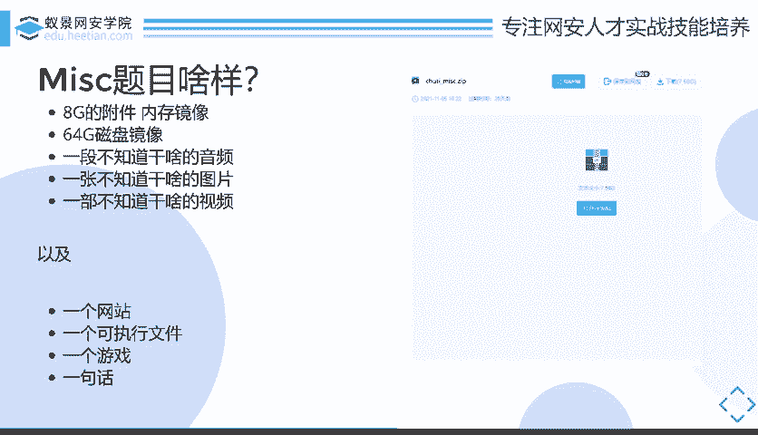
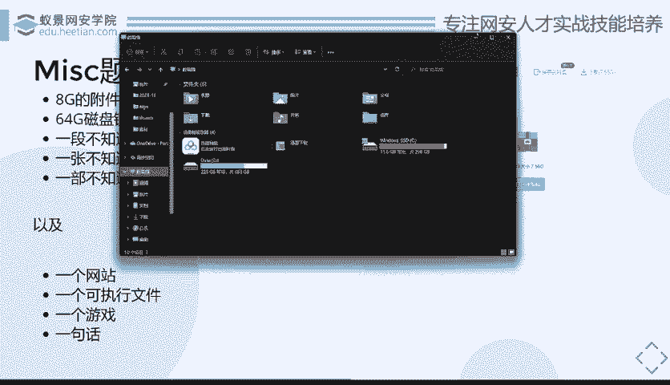
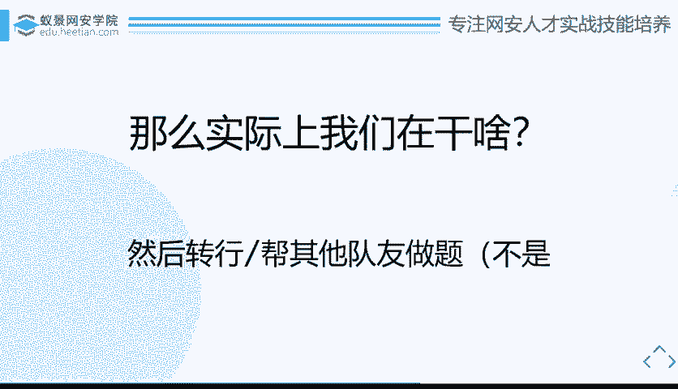

# CTF教程：CTF初学者必备的1000个练习题，每日一练，百日成神！（ctf-wbe／ctf-pwn／ctf-misn／ctf-逆向） - P22：ctf-web21_什么是MISC - 白帽子讲安全 - BV1dp4y1j7aN

好，今天我们的一个分享主题就是这三个。一个是。miss手从哪里来？或者说是m从哪里来，其实更恰当一点。第二个就是mi手持在干啥？我们会讲一讲。😊，当今miss手的存活现状能不能存活下去。

或者说是现在题目的一个现状。还有就是miss时去哪里？就是包括就是可能是你未来如何去学习进步，或者说是一个未来的发展方向嘛。因为毕竟大家知道嘛，就是其实miss就是不管怎么样CTF包括miss。

包括外什么的，都只是一种学习的渠道而已。你真正后面后可能是靠肯定是不可能说是成靠CTF去吃饭的，就是你还是需要去做一些嗯比较实际的网络安全相关的一些工作。所以说是通过miss。

我们需要去达成什么样的一个成就，能够让我们给我们未来营造一个什么样的工作机会，对吧？这样这是一个我们比较关注的问题。然后的话我们就直接。话不多说开始啊。第一个主题是m手从哪里来？

where arem from。首先我们还是非常基础的东西啊，就是很入门的。大家入门第一节课都会讲的东西。就是。什么是m，对吧？通俗了来讲，这个右边这个谷歌谷歌谷歌翻译我就不读了，你们。

你自己想去读可以读一读。你看下面这句话你就知道了，就是不同很多种类型，很多种资源。所以说是什么？通俗来讲就是大杂烩，就是什么都有。你那很多的所有点，它都在里面会有。具体来讲的话。😊，就是一个分类分类嘛。

比如说OSINT一些信息搜集。tgo就是一些引写，包括forthink就是取证，还有一些编码，或者还有很多很多很多很多。就是这些东西可能比较专业了，就是之后我们课程里面也会逐一去讲述这些部分。

就是一些很细节的东西。简而言之的话，就是所有你不知道怎么分类的CTF题目，它都是m。对吧那对于miss这个类型，其实。你可以去看一下国内国外的一些比赛的差别。就是像我们上面想的这些东西，在国外都是会。

如果在比赛中出现，它会细分的细分到。比如说这道题是取证题，这道题是引写题。但是在国内的话。由于一个大环境的问题，导致我们所有的题目全部放在了一个类别，它叫mask里，就导致m题目会很杂。

它比国外的那种m还要杂。对，所以说这就是一个国内的m现状。所以说如果说你真的想成为一个m手的话。😊，你是需要去做到很多功课的。但是其实有一点就是如果说你去问一个大师傅，或者说去问你的学长。

问你的前辈之类的，问你说。CTF是我们学什么比较好，他们自己推荐一般会推荐什么，就是推荐m，为什么呢？首先它是一个最有趣的，也是最平易近人的。我这里说有趣，因为它确实是有趣的。比如说下面说的三个。

比如说是盗号这种，因为其实现在纯粹的一种呃就是说技术手段。比如说是去黑了QQ客户端挖个零类之类的，这种是很少的，大部分其实都是通过一些。欺骗的手段或者说是些社工的手段，社会工程学的手段去把你的账号密码。

账号密码给窃取过来。这一部分的话，其实如果说是真的要算在CTF里面，它就是一个miss的分类。然后还有就是比如说是我们比如说是。我们就举一个最简单的例子嘛，比如说你要查你对象手机跟谁微信聊天了。

但是有对象把微信聊天记录删了，你有什么办法恢复？😊，比如说你电脑的文件被你误删了，要恢复，这些都是算在m里面，对吧？还有包括比如说是。😊，你看到你看到一张照片。就像我们之前其实看到那种新闻。

就是什么有的人看到一个明星的拍的一张窗的照片，然后找到明星家里面这种其实都算是mi，对吧？所以说它是最有趣，是最平易近人的。然后还有就是他最容易入门，为什么最容易入门呢？

就是像外部你可能需要去会一些PP你才能做PP目会on会 java会noteS，你才能去做一些实际的题目，像胖或者说是逆向，你得去你至少都有个IDA对吧？或者说是你可能需要去学一些呃操作系统啊。

计算机计算机计算机结构啊，计算机体系结构啊之类的课程。但是的话。😊，其实你可以什么都不会，甚至你可以不会编程，你就可以入门miss。只要你脑洞够大，对吧？然后还有最后点就是最贴近生活，为什么呢？

还是那点。😊，嗯，就是潜藏在你身边的那些盗号的呀，那些不法分子啊，或者说是一些奇奇怪怪的犯罪的行为。他们很多行为都是在我们m里面类似的。所以说m最终的一个方向。也一点就是正好印证了他这样一种特性。

但是他可以去做我们我们类似的取证工作，就是体制内或者说是一些呃辅助一些呃警察或者说是辅助一些公安办案的时候，可能会用到一些你的取证知识，这可能也是你的未来发放之一。所以说这个是我们之后会提到的。😊。

所以说看似对吧？有这么多优点，所以说劝你来选miask。但是其实呢。😊，miss真正入门之后，或者说是你真正去想在里面做出成绩的时候，又发现这东西到底有多多困难了。首先我们就随便看一眼。

如果说你要做一个m的时候，你需要一些什么特性？或者说你需要一些什么工具，首先你需要一些基础，首先你需要会lininux，对吧？这个是肯定的。还有就是你需要一堆奇奇怪怪的工具。还有就是一些各种各样的知识。

知识包括，但不限于。计算机相关的指识。音频相关的知识图片相关的知识，数字同样处理相关的知识。甚至有可能说是你需要去会AI。会比如说可能可能你要需要去会嵌入式，甚至可能会要去会一些。呃。

比如说是区块链这些东西你都可能得会。如果说你需要。如果说你想把所有的题目都做出来的话，当然肯定这是不现实的对吧？你只能一点点去学一点点去做。当然最重要的就是你需要一颗热爱学习的心。

因为你会发现你做了miss之后，你的所有积累只能成为你最终做题的一小部分。最终大部分的做题的思路，或者说是题目答案的来源，都是你现场去学习的。所以说这是很重要的一点，你需要随时随地的去热爱学习。

然后就是我们需要的一些工具啊。比如说你需要开裂，开裂是最基础最基础的了。你没有这个你都不好意思说你是做安全的，还有包括是一些这些工具，就是用来，比如说是用来做压缩包密码破解的。😊。

比如说是用来做磁盘取证的，包括比如说是做流量分析的，还有国内的国产的个取证大师美亚的。然后比如说是一些国外的类似于全杂式的东西，甚至你可能会需要去用photoshopafter effect一呃。

这些东西就是甚至是阿dobe全家桶，你可能都得要一份。可能有的时候你做做题目就会用到，或者说你需要去用bb suit发包，或者说是m labb mat lab其实。看似是一种很专业的软件嘛。

可能是去做一些数学建模啊，或者说是图像处理之类的。其实你很多时候也会用到，还有就是你需要各种开发环境。你以为themiss是做一些图像处理取证？引写之类的，其实有的时候他会直接给你啪扔你到外部体。

然后告诉你这个外部体比较庞杂，所以说它是m里面。对吧所以说所以说你需要各种各样的开发环境，你要C的，你要你要C加加的，就是你二进制的那套，你也得会外部的那套你也得有。然后最后一点也是最重要的一点。

就是你要一个很大很大的硬盘。😊，当然，硬盘不是用来给小姐姐住的，就是用来存各种学习资料以及真正的学习资料以及存很多的附件。等一后你们就可以看到为什么miss手需要一个很大的硬盘了。😊。

然后就是我们去讲接下来的一个点。miss候在干什么？😡，我们是我们。我们先看下大家怎么说吧。就是我从知乎上面扣的一段问题。就是我觉得这句话非常好，实际上在一些战队中不存在专门做m的人。为什么？

因为m手候不能说是一个单独的职业，因为大家都可以是m手，m时候也可以是各种方样的人。😊，还有就是另外有大佬说的，所谓m的手不应该是外部不会外部不会做，逆向逆不出来，胖，看不懂密码写不出来。

只能做做m签到那些人的自嘲吗？😊，所以说你知道是什么意思吗？就是你又会外部，又会逆向，又会胖，又会密码。最终你才能成为一个m手，对吧？你最终还只能做m的签到。所以说你知道m有多难了。😊。

然后你看旁边这片，旁边这片其实我觉得是说的比较客观，说的比较。客观的吧，你会看到他上面说的可以有引写取证。比如说国内的美亚博科，或者说是还有一些古典密码，还有一些乱七八糟杂上知识，逃艺小众的协议。

但是其实对于这些东西可能只是在比赛中途体现出来的。那么对于比赛外面，我们可以体现出什么呢？就是他们的知识面广，就是因为你要去做miss题目，所以说不得不逼迫你自己去学习很多的新知识。

从而导致你的知识面是比大部分的。相当于是大部分的同运，或者说是大部分和你比如说是我们都是计算机行业，计算计算机行业的嘛，比大部分计算机行业的人都要广。比如说外部手，他们可能只会外b。

他们会PHP他们会python，会java会noteGS逆向手，他们会。😊，他们会逆向，他们比如说是他们会呃IDA拖时拖进去，或者说他们会安卓逆向，会windows逆向，lininux逆向。

但是我们需要会什么，我们什么都要会。我们又要会开发，你要会写一些简单的甚是一些复杂的python代码。可能是mate lab代码，你也需要去会一些安全。比如说你需要去会一些外部里面的基础知识。

比如说HTTP协议，比如说是各种TCPIP协议，甚至你可能是说7层模型里面从最下面开始，物理层数据链路层你就需要会，一直到最网上应用层，你都要会。你可能还会需要一些二进制的知识。比如说计算机体结构。

这事你肯定要知道的对吧？还有就是比如说是可能你还需要去知道一些二进制文件结构。因为有的时候他可能会给你拍扔一张图片，这个图片是损坏掉的。那么你要去修这个图片，那么这个时候相对应的你的知识要跟上。

就是比如说这个图片的结构，那么这个图片结构怎么来？你就要像。比如说你要像一个什么图片浏览器一样，去首撕这样一个图片结构。那这个时候就需要你去对这个图片结构有很大的很强的了解。

就是你知道他每一个字节是干什么用的。就是开玩笑嘛，就是你可以对着一张十六进制的1六进制代码，看出来就是这张色图，对吧？这是当然只是开玩笑而已了，但是你可能确实需要有这样的能力。😊，所以说。

去看就是其实最终对职业对求职帮助都不大，对吧？因为它最终那一些雕虫小技，它都是不会用在生活途中的。但是呢就是他们其实都属于一个for trick的东西，就是拓展知识面是有用的。但是对于职业来说，它很广。

但是它不深。所以说它没有一种专门对口miask就是。大方向mask的一个职业。因为其实像外其实如果说是要深究的话，外部和逆向的话，也不能说是有什么对口的。因为比如说外b你也可以，你也需要去。

专精于比如说是去挖洞，或者说专精于一个呃渗透。逆向的话，你可能要专精于一些游戏外挂研究，或者说是一些。呃，或者说是反外挂，甚至说是一些样本分析，这些都是可能需要去某个方小众方向去专精的。

所以说其实这里的m它是相比于其他的东西更加广且更加不深。所以说也不是说是一种毫无适处的一个方向，它还是有它存在的意义的。因为其实CTFcapture the flag，虽然国内可能最近比较呃。

因为这东西比较火嘛，就是网络安全国内建设比较火嘛，导致大家都会去打导致大家可能在这方面比较内卷。但其实CTF本身它的诞生而言，capture the flag它本身就是一个游戏性质的。

所以说ms在里面是有它存在的价值的。当然我们后面还是会分析的，就是miss的时候，我们可以去在赛场上做到一些什么样的努力，或者说是去给我们的未来发展方向做一些什么样的规划。这部分我们也是会后面会讲到的。

然后就是。我们实际上在赛场上我们能干什么？因为其实我们看根据刚刚那些我们可以看到就是。😊，这些东西它你可以广，而且你都得现场学，而且你发现你外部不会逆向不会，胖不会，密码也不会，只能做签到。

那么其实在赛场上我们最终干什么呢？我们确实就是在逆向，我们就是在渗透，我们就是在挖洞。😡，当其他方都AK的时候，我们就在摸鱼。为什么这么说？我们可以看一下。😊。

这个是这两天正在进行那个比赛的比比赛的一个miss题目的截图啊。这个比赛到现在为止只有一道m题目。😊，这是第二道题目，出题高m点zip大小是7。56G。对吧这就是为什么你需要一个很大很大的硬盘。如果说。

😡，我可以我可以稍微给你们看一下我的硬盘大小。

看。它已经红了，虽然另外一个也差不多红了，这里面存的都是虚拟机啊，各种资源啊，还有就是各种各样的附件。

这个附件就真的很大。比如说它会有1个8个G的内存镜像，甚至可能说是6464个G的磁盘镜像，它甚至可能会有一个比如说是七八个磁盘，它组了一个readd，然后把镜像全部发给你，让你去恢复数据。😊。

这些东西其实可能还比较简单，因为你知道它是一个磁盘，你知道它是一个内存，你要知道它从里面取证出什么东西。但是。很多时候他可能会给你的就是一个。不知道干什么的音频，或者说一张图片，或者说一个视频。

你看了半天这是啥，这啥玩意儿，我也看不懂怎么办呢？你就只能继续在那摸鱼，只继常要对脑洞。或者说。这些都只是可能比较常规的mi题目了。但是一些对于一些比较新颖的，或者说是一些有难度的好的题目。

他可能会给你什么，怕给你扔个网站，怕给你扔个游戏，或者说是他直接给你一句话告诉你。告诉你flag就藏在我的B站主页，大家去看吧，然后你就去找吧。当然这种题目可其实可能国内出现的比较少吧。呃。

国外这种新颖的题目比较多，国内可能还就目前主要侧重于一些套路化的，或者说是一些呃比较形式化的一些取证啊，或者说是一些引写之类的。所以说你看到在你你在比赛现场线下的时候，看到某个选手正在玩游戏的时候。

你可能你需要去问一下他到底是真正的在摸鱼，还是他是一个miss歌手。比如说你像那个叫。前几天的那个叫前几天的比赛。龙原被龙原龙原一样，龙人战役一样，它里面就有两道MC题目。他那你给的附件是什么？

给的是一个minecraft游戏的一个存档。你拦下来之后，打开游戏开始玩，玩通关了，怕给你个flag，对吧？那这个时候玩游戏的是谁？就是我们的亲爱的miss选手。😊，所以说面对于这些稀奇怪怪的题目。

我们在干什么？我们就是在对着题目发呆脑洞，然后想不出来，然后放弃摆烂。😊，当然其实我当然其实我不是在劝你们劝你们摆烂了，其实就是只是告诉你们mi，如果说想出的难的话，或者说是一些好的mi。

它是它其实是确实可以让你想破到都想不出来。但是你看到出解法之后会说我操好妙的。那么面对这种情况的话，我们能干什么转行吗？肯定不现实，对吧？因为毕竟miss还是要有人做的。或者说是直接去帮其他队友做题。

当然这这都是一些开玩笑的话了，对吧？因为我们毕竟还是要有m手的，m存在并有它的价值。

所以说我们放到最后一趴比较重点的部分。