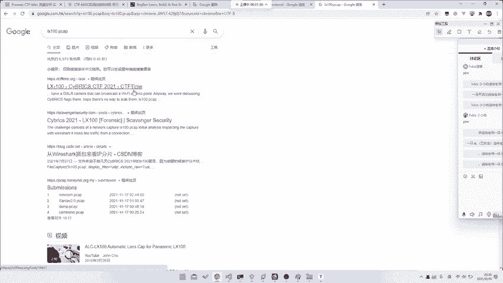
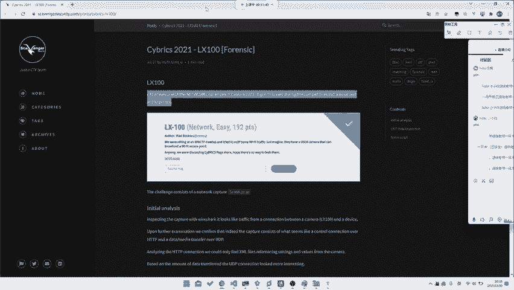
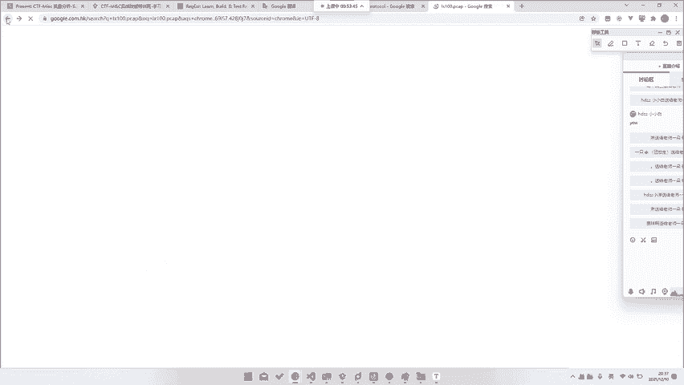
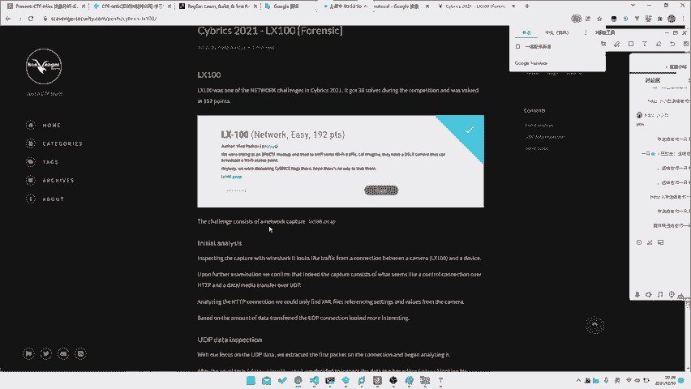
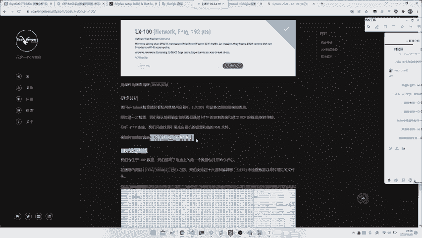
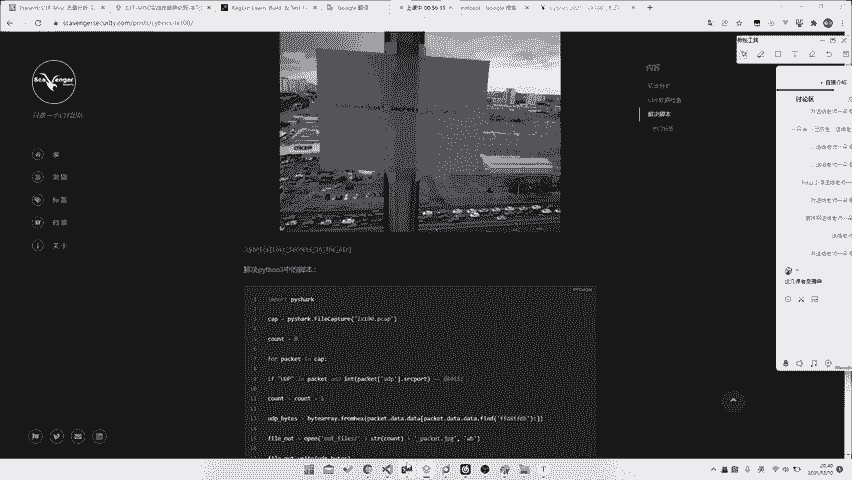
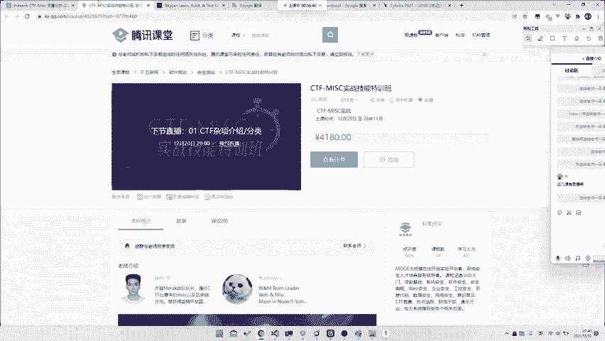

# CTF教程：CTF初学者必备的1000个练习题，每日一练，百日成神！（ctf-wbe／ctf-pwn／ctf-misn／ctf-逆向） - P26：ctf-web25_一些实战分析 - 白帽子讲安全 - BV1dp4y1j7aN

我们事实上不知道他的协议，或者说甚至是我们啥都没干，甚至都有可能做出来。比如说这个题。这个题呃X10这个题。呃，这个题目就是那个叫那个叫是这个叫CYBRSES里面的一个题目。

但这个题目我没找到他的那个叫就是附件，我电脑重新清空了，当时打了，但是就是。

看一眼C of time这个题目。就这个题目，当时我打了，当时虽然当时不是我做的对吧？然后就是就是今年的一场比赛，就当时还是打的挺挺挺那个的。打第二把。然后就是这个题目的话。

它就是一个基本上我们我们的right up也是这么写的。你可以去看看我们队伍的rap time也是这么写的，就。你虽然可以搜索到，比如说说你去搜索一些资料，比如搜索它是什么摄像头啊。

或者说是什么视频流啊之类的那其实我们只需要干什么，就是你蠢蠢的什么都不知道，你把它的所有UDP导出来，然后直接可以给它fomost。他就能直接出来我们的JPG了。所以说你甚至不需要做任何的处理。

就是可以拿到的。就是你甚至不需要理解它的这个叫传输是怎么传输的呀，它的包针构成是什么构成的呀，不需都不需要知道，你只需要知道我们你只需要知道JPG的头是什么。比如说这这里JPG头就是。

B50叉B50叉2200F就这全东西。并且他的那个叫什么哦，不在这里就是只要是他的那个叫什么？pose啊，他这里没写，就是FFD8嘛，就是FFD8之后，然后你把他的所有的那个叫。

所有的按照这个位置上提取出来，提取完之后全部给他依次看一遍，哎，你就能看到这张图片了，对吧？就非常的。非常的怎么说呢？就是。就是其实不需要任何其实没有任何难度。就是即使你不知道这个文件协议。

你不知道这是个像头，什么都不知道。你说你直接fomost都是可以fomost出来的对吧？哦，当然你直接对于整个包fo都是fo出来的，你必须要进行一个就是导出之后再进行。因为它是分分分。

因为它是那个叫什么？因为它是分包的，因为它IP因为它包包包大还过大，它在IP上面分那个了。然后都分包了。所以说这就是这样一个题目，就是你甚至什么都不需要知道。那比如说你看这一他怎么写的啊。😡。

他这告诉你的init analyze什么什么traffic from condition，你不管它呃，不知道大家看看我们还是翻译成中文吧，照顾一下大多数人。哎呀，无法翻应。啊。

好对吧经过进一步检查知道是什么有DP分析什么，我们只能通过找到查描根根据数据的传出来DP看起更有趣。然后我们专注于属于DP提取的链接上第一个包，并开始分析它什么6性质中检查常用的文件，有一些有一些自己。

然后似乎是JPG文件删除相数就我了一个有效的JPG对吧？由于超过共400个单个JPG我们制作一个本从什么提取出来，对吧？然后就其中某一人就A出来了，对吧？那显然的话这就是。

呃，这算不算是intal的一个solution呢，就是算不算预期检呢，其实也说不准，对吧？那其实你说可能他这个预期也就是不需要你分析，你直接去formmost就可以。就是这种题目就是并没有并不说是。

其看似能直接出来，其实的话它也需要你有一定的一个搜索能力，或者说是你有一定脑洞。就是你必须要知道它是A是否是UDP。就是你首先需要把目光聚集到UDP上面才能做出来这个题目，对吧？

所以说这就是这样一道题目。所以说其实对于所有的Mi题目来说，并不是说呃都是一个很难很难，或者说难题目并不是都是需要你去看你并不是那种都是需要你去什么呃什么掌握各种这些miss技巧啊之类的。你只需要有。

怎么说呢？重点核心部分是什么？就是mask的核心是什么？就是一你需要有很强的脑洞。因为脑洞对不上的话就没用，对吧？2。🤢，你需要有很强的搜索能力。如果说你没有搜索能力的话。

你什么你光靠你现有的知识肯定是学不会的。3。你需要有很强大的学习能力。对于任何新的知识，对于任何刚尖触到的知识，你甚至需要5分钟，甚至是10分钟啊，甚至是或者说你刚看到你就需要去会，对吧？

这个协议还相对来说比较简单的就是。他可能是嗯。就是它就只有1个PDF文件。那如果说对于一些更加复杂的协议来说的话，它的它的协议内容就不单单是说是。不单说是几页只那么简单了，它会有一个完整的一个。

是不就是6十几页，或者说是直接是一个什么HOE的一个呃标准文档拿抄出来给你做。那么这时候你也需要去很快速的学会它。😊，所以说这个时候就需要很非常考验我们的学习能力。所以说大家需要有。

如果说真的要去做Miask，或者说话没操作的很好的话，这一点能力是不可或缺的。那当然回到我们的这个流量分析上面来，流量分析。其实说白了呃，我们能讲的其实也不是很多。我们只能把就是把这个叫完整的一个。

比如说HDP流量，或者说USB流量，或者说之类的给你大家提一提。

那至于说流量里面它这个流量协议本身得请你去学既网，也不需要去学我们的这个。呃，不需要去学我们的这个叫什么之类，就是既往上面都会讲到。那，所以说对于这种题目来说，best solution是什么？

就是你要去不断的做一个进行一个做题。做题不是为了去做为了能够争取以后做到原题，而是为了啊我们在做题过程中去吸取这样的一个经验教训。比如说这次你做题没做出来。事后你看了玩别人的rite up，发现哦。

别人是因为用英语搜索了，我没有用英语搜索。那么这样子以后从此以后你就要得到一个教训，就是以后用这几节课都有录播了。从此以后你就又需要去试否用其他语言去搜索一下。比如这次你做出来了，你别人没做出来。

你做出来了，那你去看别人写的rite up哦，他说他怎么分析，怎么分析怎么分析。而你又恰巧哎看到了某一个文章，对吧？那所以说你就要去看哎，当时我是怎么看到这篇文章的对吧？那么这里面有哪个点比较好。

就是哪个点是我们应该去记住的，或者说是哪个点是我们应该去。哪个点是我们应该去以后去一直用的，甚至说可能是你某个无意之举，就是无意间哎，你去想了一想脑洞某脑对上了某个脑洞，A就做出来了。

所以说大家需要去总结规律，在做题的过程中不断去学习，不断去掌握新的一个。学习方法其实相当于是学习不是为其是授人以鱼，不如授人以鱼吗？就是你通过掌握好的学习方法，比掌握一更多的更多的知识更有必要，对吧？

嗯但是如果说你想掌握的更多知识。你也可以去上我们的课，我们课上也会讲很多的点，就是会给大家把这种点都挨个给大家提一遍。但是如果说你真但是如果说你想成为独立成长。

或者说是你想去嗯提高到一个相对来说很高的境界，那就需要你去花费自己的时间去思考出你自己的一套学习思路，去思考出你自己的一套做题策略。对吧所以说这个东西是我想我可能是我比较想教给大家的就是。

如果说大家想去学这种知识点之类的，大家直接刷题好了，没必要听我讲，对吧？😡，那我那我在这边有什么可以给大家就是去做一个重点提醒，或者说是分享的呢？就可能是就是这种学习方法，就是呃我也可以给大家讲一讲。

就是当时那个叫就是我一开始一开始就是纯刷题。刷题刷了有半年，但是那半年时间其实并对我来说并没有增长多少，我只是把基础部分掌握掌握下来了。那面对新的题目我还是不会做。所以后来我干什么？就是我去去打比赛。

我直接去做新的题目，我去做，只是做在做新的题目的过程中，因为没有任何rite up可查。所以在整个思考的过程中，就1。1点的通过对比自己和队友的差距，对比自己和别的队伍的差距。那1。

1点的就把我们的这个做题能力训练出来。所以说这个点，所以说我觉得可能还是嗯。相对来说比较重要的一个部分，对吧？希望大家也能够以后能够记住这个点，对吧？miss课。

我们这个流量分析三节课就就其实就到这里就已经因为我们说老师40文中一节课嘛，三个天才只有90135分钟，135分钟。很少了。如果说你把它作为一个专题，你讲一天8个小时都不为过。😡。

但是更何况说可能我们甚至需要讲一个礼拜之类的都可都都可以讲到。那当然你甚至说你要学这么多，知识学一年都不为过。那1个11说135分钟能讲什么东西，其实也就只能把我们刚刚之前讲的几些内容讲一讲。

就是稍微大家按入个门，然后大家看一看怎么做题。然后大家大家带一带知识点。然后最后看一看大家去如何去给他就是这种纯做题型的技巧。那当然最后还是希望告诉大家，就是希望大家能有一个嗯比较好的一个学习方法。

学习策略。对吧然后的话今天45分钟唉非常好，掌握的非常好，就45分钟唠嗑唠完了。然后还是一样，就是到9点钟嘛，然后所以说我们还是留15分钟给大家问问题。或者说是大家有什么疑问，就是说想最后再和我聊点啥。

对吧？大家可以聊一聊。但如果说你不只想聊这么久，你也可以去。我们从赵博任老师这里点进来。当然如果说你是想跟我聊更多内容的话，你们也可以来这个CTFm训练营，对吧？就能够定期能够看到我。

对吧然后也欢迎大家来学习，对吧？😊，然后今天没有卡，太棒了，没有，还有15分钟呢，大家不要不要不要提前买啊，说不定15分钟，说不定15分钟就卡了啊，日常营业没办法要恰饭的嘛，对吧？就是欢迎大家来报名啊。

就是我觉得还是觉得挺有挺有意义的。就是相对来说，如果说你能够在前期去有一个人带着你去学，或者说是去带着你去。或者说是就带着你去这样子去稍微带一带这个过程还是比较好的。我当时就没有任何老师带。

所以说我嗯反正进步挺挺崎岖的。好吧，哦，大家有什么问题吗？今天给大家留了充足的15分钟时间问问题啊。就是关于missask课程，关于这个叫流量分析，或者说关于做题技巧，或者说是关于这种解题策略。

大家都可以问。或者说你关于这个CTMm实战技能测训营问题也可以问。除了私人问题不能问。😡，嗯。怎么回事？大家今天怎么都这么害羞啊？😊，前几天大家不聊的很开心嘛。

我上课上着上着大家就开始在聊天的框里聊起来了。😊，今天怎么没有什么。现咋没查声了呢？嗯。The sun or。哦。大家别只只摁呀，对吧？CTF对渗透有帮助吗？我可以直接告诉你CTF里面有一块就是渗透。

😡，呃，明天我会去打一个比赛，叫叫叫叫什么叫什么就是某隔壁某某公司办的比赛，就是什么杯，这个比赛里面就会有渗透题目，渗透题目pen test呀。我不知道大家有没有做过一些。

比如说我们的WMCTF里面就有就是WMCTF里面就会就出两道pen test的题目。对吧。就是就是首先渗透在CTF里面就有体现。其次就是你的CTF里面的一些技巧。其实。哦，就是跟跟渗透来说。

跟老跟跟我回答往上一个问题，就是最渗透来说，其实CTF里面最相关的就是web web部里面其实相对来说在渗透里面可能就是作为一个入门的比比如说是一个入口方式，你去打一个入口网站。

可能需要像CTF那样去解析题目，就是一个网站。后面的话对于一些什么就是横向移动纵向移动啊之类的，可能这部分的话，CTF里面考的比较少。

但是最近几年也会把就是直接把渗透的整个环境搬进CTF里面去考到家渗透。所以说肯定是有帮助的对吧？都有渗透题目了。😊，老师一个月有几次比赛？这数不清了啊。就几乎每个周末都有事干。

