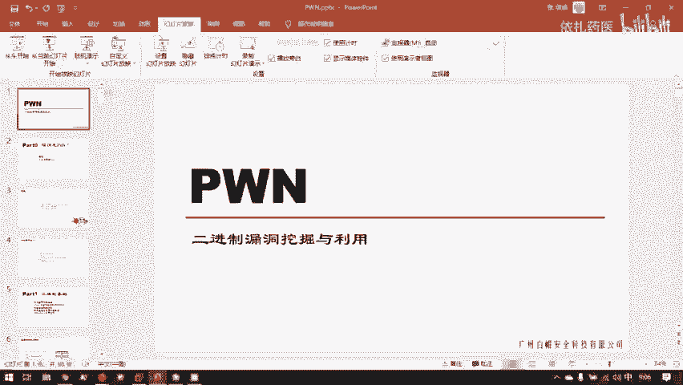
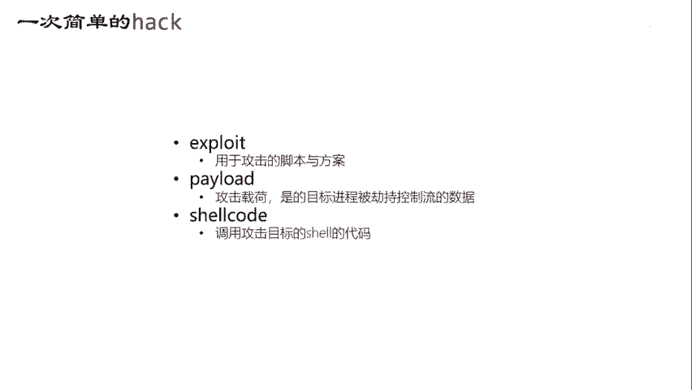
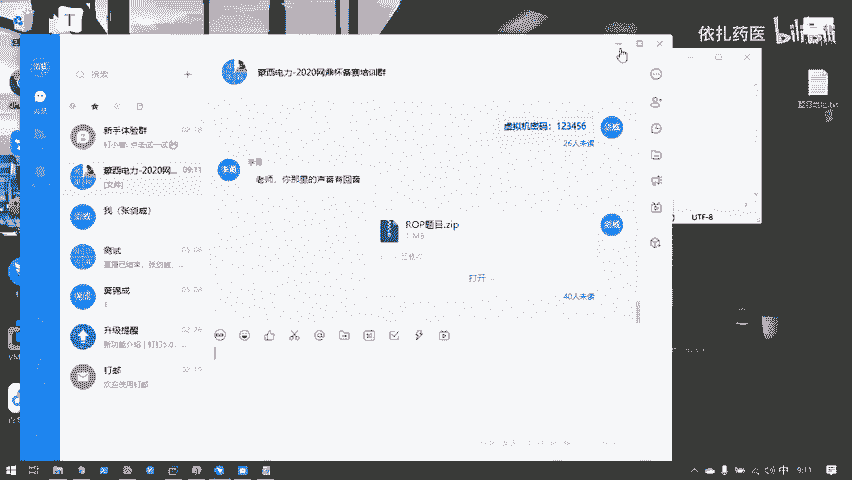
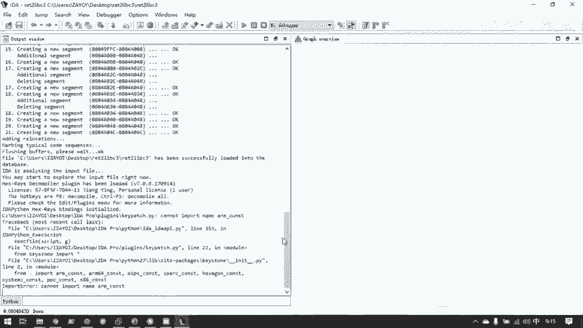
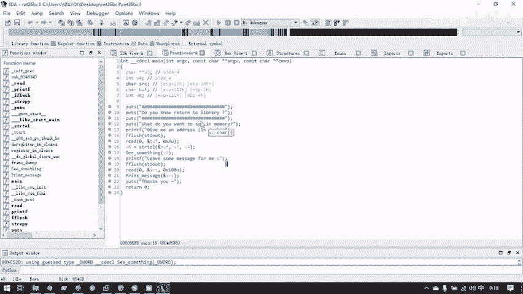
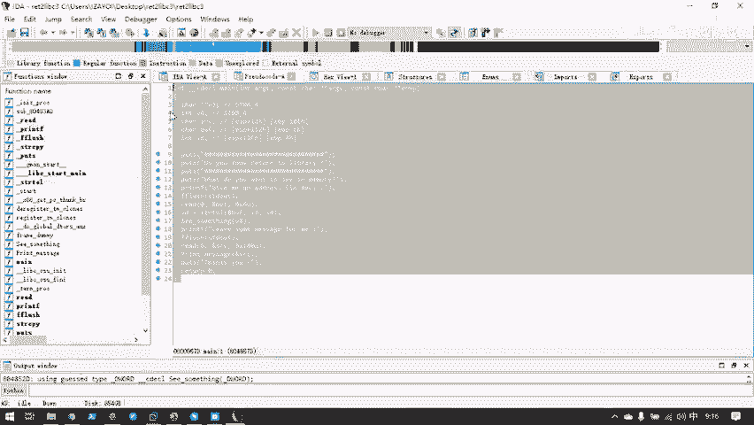
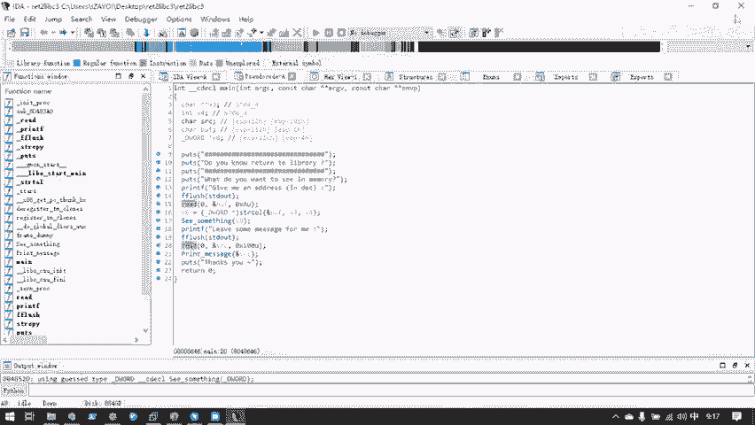
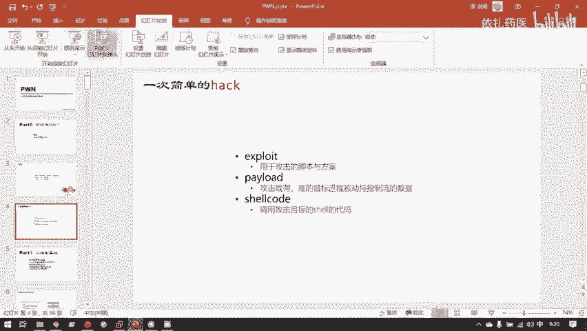
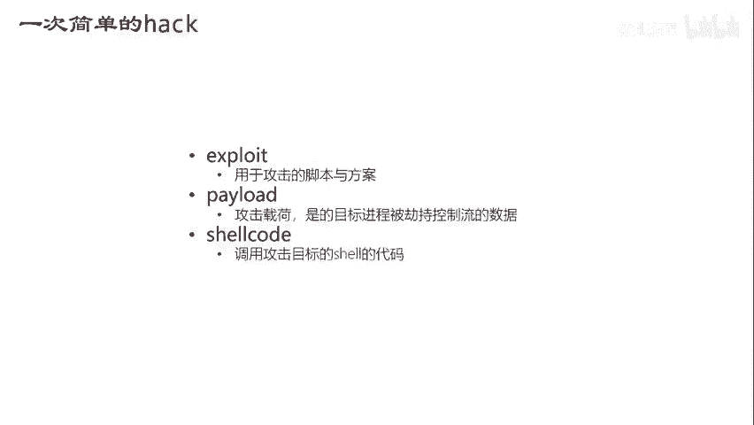
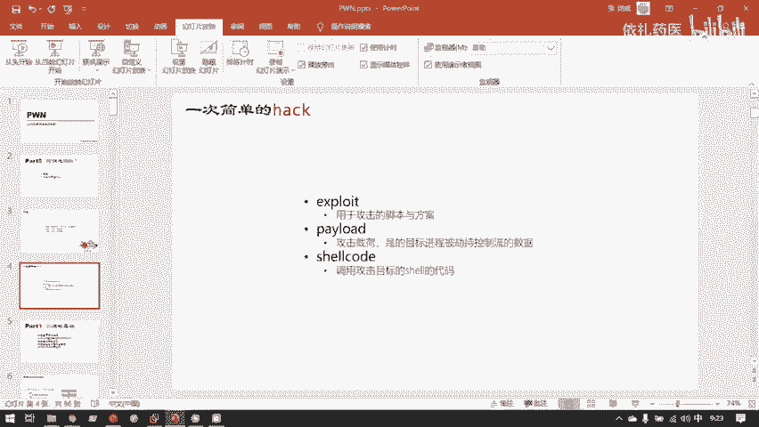

# CTF教程：CTF初学者必备的1000个练习题，每日一练，百日成神！（ctf-wbe／ctf-pwn／ctf-misn／ctf-逆向） - P27：一次简单的hack - 白帽子讲安全 - BV1dp4y1j7aN

接下来的6天，你给大家培训的是二进制漏洞方面相关的知识，也就是CTL比赛中俗称的胖这样一个方向。胖呢他是。CTF中你可以如目前接触，可能只是在CTF中知道有胖这样一个题型。

但胖这个词语最开始来自于一个黑客的俗语。嗯，他是这样被解释的。胖你可以说我胖掉了一个程序。比如说我碰掉了最新版的阿帕奇服务器，这是你们web里应该用到的，就是一个外服务容器。我可以说我胖掉这外服务容器。

意为就是我成功的找到了这个二进制应用中的漏洞，并且利用成功。我可以说我碰掉了一个程序，我也可以说碰掉了一台服务器，我碰掉了公司里的打印机，这样就是说公司里的打印机上面的固件的漏洞被我查找出来。

然后我通过这个漏洞利用成功。然后取得了这个打印机的控制权，可以说我是碰掉这个打印机，或者我碰掉了你的电脑，就是我通过你电脑上某个端口挂的服务。然后通过这个服务上的漏洞，成功控制你的电脑，碰。

大概是这样一整个意思。不过它的核心还是在于二进制漏洞的利用与挖掘。嗯。呃，为什么叫二进制漏洞利用与挖掘呢？它和你们之前学到的外部漏洞有什么不同呢？

就是因为胖所研究的漏洞全都是已经编译成机器码的二进制程序。你的漏洞。而web之前web的漏洞是由于PHP啊那种举个最简单例子，就是PHP这个语言本身，因为它是基于C语言的。

然后导致它语言本身设计上就有大量的缺陷。然后在这个高级语言的层次，它会在语言层面上出现各种漏洞。然后就在一个高级的应用层里，然后挖掘相关PHP里代码可能出现的缺陷，然后进而黑掉别人的网站或者服务器。

然后探索研究漏洞是在哪个层次呢？是已经变译成机械版的二进制程序。你可以这样看PHP的解释器，如果它里面爆出了一个漏洞。那么这个解释器二进制程序本身漏洞，你要去攻破它的话，那就其实是用的是胖。呃。

那么什么是二进制程序呢？我们可以来到此时的。现机你看一下。所谓二进制程序，其实也就是可执行文件。比如我现在随便。进入一个梦里。

lininux下的可执行文件的格式是ELF就和windows下的EXE是等效。然后这个文件。可执行的一个文件，我运行它它就会给我程序运行的结果。那么这个程序就是一个机械码的对应的二进制程序。

对于windows里的二进制可执行程序，举个简单例子，你们已经下载好了ideda pro。里面的idda点EXE还有艾da64点EXE这两个直接双击，它就可以运行一个程序，这也是二进制程序。

当然我们这里先关掉它。好的，接着往下看。嗯，在在给大家讲具体的内容之前，还是先向向大家展示，我们究竟是在学怎样一个东西。就是我们先知道它是一个怎样的东西，然后再去理解这个东西是怎样运作的。

所以这里先简单的演示一次胖这个行为的一个过程。

我现在就是就拿1个CTF题目举例，我CTF题目一般胖的题目是怎样的呢？就是比赛方在服务器上给你挂上，你在某个端口挂上一个二进制服务。对于这里。此时我们。这已经部署好了。

因为我在我们公司的服务器上已经部署好了。一系列的题目，这个文件题目地址大家也之前发过大家了，大家都知道在哪里吗？嗯，我想问一下，你们能找的，就是我发过来的题目，你们都已经下载了吗？如果没有的话。

我可以现在再发一份，因为这个东西非常小。方便起见，还是再发一次。

这是我们前半段所要用到的题目。

嗯，那我现在用这题做演示。此时，在远程的IP为这个的服务器上面，在10202端口上挂了一个二进制服务。对应的二进的程序是这个return live3这个文件。我们可以看一下。对，等一下实实际做题的时候。

你们VM well应该它这个虚拟机上应该是已经安装了VM well toolss的。所以你可以直接把你windows数主机上的文件。按住拖进来。他就直接能到虚拟机。然后我们此时知道了在。

这样1个IP和这样一个端口上。运行了这样一个程序，就是这个文件夹此时的return to live3这样一个程序。我们看本地运行。他给了我一个输出，让我随便输一点。好。

s我的 thoughts全是崩溃了。这个等一下再讲说为什么。那远程服务器它运行的是同样个程序，我们现在可以。访问这远程服务器的这个端口看一下。会发现和我们本地运行的这个输出是一模一样的。

你的服务器的程序也崩溃了。那么此时我。在CPF常规的CTF比赛中，组委会都是会给你直接给你这个二进制程序，然后让你找这个程序里的漏洞。找到之后呢，你远程运行了一个相同的程序。

那你就可以对这个远程的这个端口发起攻击。攻击成功，漏洞利用成功之后，你就会获得一个shall，进而控制远程服务器，并且拿到远程服务器上的fag文件。对于这里。呃呃no我还是把完整的过程演示一次。

我拿到了这个return to deep3这样一个文件。然后呢，我就可以分析它的二性制漏洞。这里先解压一下。嗯，我现在先完全演示一下这个过程，具体的细节大家慢慢的会一步一步的给大家展示。

我先把完成的过程演示一次。我拿到了这样一个二进制程序。我想用这个二建制程序的漏洞去攻献一台远程的服务器。那么首先需要全面的了解这个二进制程序。我先用linux的一个工具叫fill。

我先需要知道它是一个什么样的格式，然后可以看到这里是32比特的E2F，也就是32位的linux下的可执性文件。那么我就可以用。艾达的艾达是一个目前这个星球上最强大的。反变译器与反馈编辑。

当然有一些开业软件跟他竞争，但目前它本身作为一个商人软件，它依然是最强大的。其实这个软件的授权费是非常高昂的。我们目前用的idda pro7。0都是泄露版，就是有一个用户他我们买的单。

然后他把他买的单共享给了所有用户。这个软件的授权费应该是5位数。呃。然后我会用这样的一个反馈编器，我把我得到的二性制文件拖进来。

我来分析这个二进制文件里的代码逻辑是怎样的。可以看到我虽然我只得到了一个二进制文件，但是我通过反汇变器反编译器这样一个工具，我可以让这样一个工具去分析这个二进制代码中究竟有一些什么内容。

可以看到这里默认是显示了他的汇编代码，他已经艾达已经把这个二进制程序的机械码给转译成了汇编代码。当然它还有更强大的功能，它的默认已经安装了F5插件，它可以直接把汇编代码还原成C语言代码。嗯。

这里要说到一点，大家的C语言，如果要学二进制漏洞的话，C语言是基础中的基础。因为我们一切分析都是。最基本的我们要会分析C语言。然后如果是高手的话，就可能直接分析这里对着后面语言。

但是最基本的我们C语也要熟练，看到这些函数啊，函数调用，我们都要知道是在干什么。C语言编程能力要过关。嗯，如果大家对新源编程有疑问的，我可以直接解答。然后仅仅是从赛题出发来补足知识。

然后我们就可以得到这个程序对应的C语言源代码。当然这个源代码不是程序编写者写的一模一样的源代码，但是这个程序反编译出来的程C语言代码的功能和最开始这个程序编写者写的C语言代码功能是一模一样。

然后我们就可以在这样的一个信语源代码里面寻找它有怎样的结构漏洞。找到漏洞之后，我们就可以。利用利用这个漏洞。比如说这一题它的漏洞是在。这里有一个内存泄露。然后这里会有一个战役出。

然后这些漏洞原理到时候再讲。然后我们发现这里有两个漏洞之后，我们就可以去编写漏洞利用程序。

这题对应的漏洞利用程序我已经写好了。哦，目前看不懂没问题，但是先解释一下大概这样的一个攻击脚本是做了什么。首先from point import all，这是胖的。套一个程序或者一个服务器的开端。

当我们分析完了之后，开始写漏洞利用的脚本之后，我们就要借用到pyython的pts这样一个模块。然后从双胖 in就导入这个模块中的所有符号。然后我们就可以使用这个模块进行很方便的进行一系列的攻击。

此时我们先用一个remote函数打开服务对应的我们要攻击的远程服务器的。对应的这个IP的服务器的这个端口。然后与它进行连接。连接之后，我们构造了一些恶意恶意的数据。😊，并且把这些恶意数据发送过去。

然后从最后一行发送恶意数据之后，s after就是我在这个字符之后，把payload这样一段恶意数据送到服务器里。服务器处理完毕之后，服务器里的结程序执行流就被我们控制了。

然后我们就可以最后用一个interact交互这样一个函数，然后与服务器的是要进行交互，我们就可以控制服务器。然后服务器的控制权。我们先来演示一下。我们先运行一下这个脚本。这个脚本刚刚已经看到。

就是在攻击远程攻击。可以看到这里打开了与远程服务器的连接，然后分析了一下此时这几个二级程区的保护措施之后。

然后可以看到switchingswitch switching to interact mode就是进入了交互模式。可以看到这里已经得到了一个shall提示符。我们可以执行一些命密。

就可以看到服务器里的一些文件。然后我们就实际上在真实的攻击中，此时就已经取得了服务器的控制权。但是在CTM比赛中，我们的目的只是要ca一下。第二个。TXT这样一个文件，然后就得到了flag。

那么一道碰题就被完成了。把fag加上99分数。像是在CTL比赛中胖的一整个过程。可以看到这整次攻击其实用了很短的时间。大量的时间都是在编写脚本与漏洞挖掘上，真正的攻击，也就是运行脚本的过程非常快。

python已经帮我们自动化完成了我们所编写的一切步骤。呃，那么接下来就可以进入。这下可以进入基础基础知识部分。

这里简单的介绍一下刚刚所用到的，就是在刚刚类似胖的过程中所用到的几个名词。就是也是为接下来的讲解做准备嘛。首先是 exploitloit。其实这几个名字都对应的中文没有很好的中文的翻译。

就是大家在安全界一般都是直接用英文原单词exloit就是用于攻击的一个脚本，或者是一套攻击的方案。称为exloit。当然这个单词还有一种解释，就是有一种有一种说法就是它直接等同于胖。

但是目前我感觉国内的安全圈目前还是习惯于把exloit翻译成攻击的脚本方案，它是个名词，而非和胖一样的是个动词。那么对于我刚刚碰掉那台服务器，它exloed什么？他就是这个。EXT这PY是脚本文件。

它就是ex。嗯，payload就是攻击在贺，就是我所精心构造的一段恶意数据发送给服务器。然后远程的服务器解析这段数据，造成自己的程序控制流被我劫持。然后这样的个方，恶意数据就成为payload。

然后他比较目前比较标准的翻译就是攻击在客。啊，我们也可以看看刚刚的这一段，其实就是有payload的。这里就是payloadpayload的，你看可以看到我payload构造的是一串。呃。

因为pas三不一样了，所以这里不能说我构造的是一串字符串，应该说是一段字节流。因为在网络IO里发送发送的数据总是自节流嘛。这样的在python中的字符串这样的对象，其实是。不能就是直接。进行发送的。

你如果要发送一个对象，实际要把它编译成自节流。当然我们在攻击的时候，我们直接构造一个自节流发送就可以。最后就是小口。shll code这个比较好理解，就是调用成功调用一个st code。

笑是什么？嗯。我看到有看到你们最开始的调查问卷上，就是一部分同学的有linux基础。然后有一部分同学linux基础较差。

所以这里还是希望大家如果linux基础较差的同学可以下去先补习一下最基础的linux的知识。Shelf，我此时打开的这个是terminal。Tminal就是这样一个窗体，一个tal是一个终端。

它可以运行多个 shellll。然后我此时这个tminal里面用，就是这个终端里面运行的shall是什么呢？是我配置的是ZSS。shall就是一个提供用户与操作系统交互的一个命令行接口。你可以这样理解。

它提供了一个文本接口。嗯，我们平常情况下用windows与操作系统交互是用的什么呢？是用的是叫GY这样一个接口Gic graphic user interface是图形化用户接口。

所以有这样一个图形化用户接口，我们可以用鼠标轻松的点击，然后完成各种各样的操作。

但是lininux不一样，因为linux它主要的工作的地方并不是专要环节。而是服务器啊那样的。就是专业的提供专业的信息服务的一些领域。所以linux呢。很多首先服务器linux大部分是没有GOI的。

就是你与一个服务器连接，它就是一个一个这样的黑黑的窗子。这样的就是一个shall，所以shall和GI是两种不同的。提供给用户的给操作系统接口。嗯，当然我们进行我们此时胖主要胖的是什么？

胖的就是云端linux服务器。所以shall这一点一定要省练。我们最终的目的刚刚其实也就是得到了一个shall。那么接下来继续说一下需要的概念。我刚刚说了这个窗体，这个是tmin是终端。

因为终端你可以运行多个hell。比如说我此时这个默认的是ZSH，我可以运行1个SH你可以看到他就给了我1个SH这样一个需要的提示符。然后在SSS区里面再运行1个BASH就flash。这是linux。

大部分linux默认装的就是BASH这样一个事。然后你看又出现了一个新的。通过这样的一个shall，我们就可以与操作系统进行各种各样交互，以及输入各种各样的命令list。我可以看一下当前目录下的文件。

然后我刚刚是用了ZSH调用了SH调用了bsh。我看以现在按ctrl加D退出第一层。退出了balash，那么就回到了SH。然后再按一次crl加D就是退出SH就回到了ZSH。

因为他们三个我刚刚执行的这一切动作，他们三个其实是。一个副禁程开启一个子禁程的关系。所以子禁程退出他就回到了副进程。那么ZSH呢，我再退出会怎样？

因为ZSH我直接是通过这个tmin终端这样一个窗体启动的，我再按一次ctrl下例退出ZSH。那么这个终端就没有任何在运行的程序了。那么终端就跟着一起退出了。在linux里，就比如说底聘。

它默认启动shall，其实有快捷键control加L加T。还会就会启动一个tminal，并且在tminal里面启动ex个cheel。嗯，这里用了ZSH是为什么呢？

因为ZSH是比要比其他两个人是要强大很多的。它有各种各样的自动补存功能，就举个最简单的例子CD然后此时software如果这个全部打小写的话，ZSH能很智能的帮我补全为大写。😊。

目前我是帮大家已经装好了CSH，并且也推荐大家以后用ZSH它的功能要比其他两个强大。