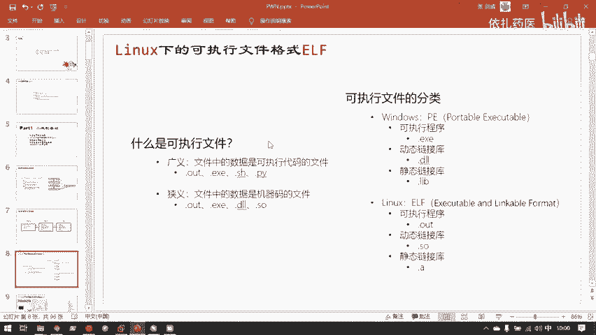
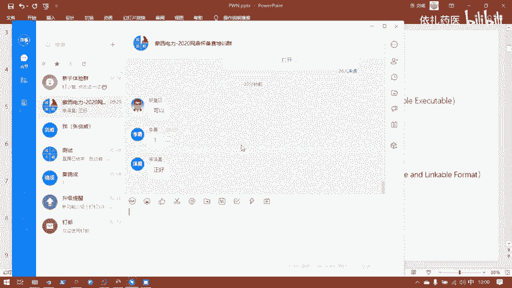
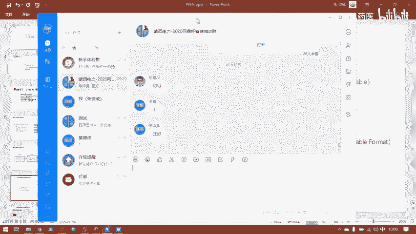
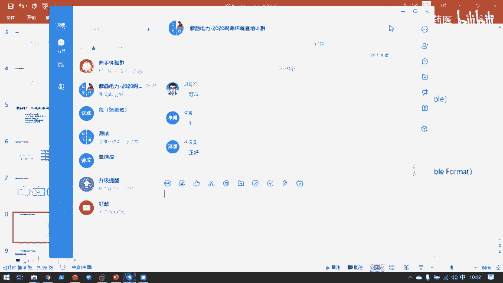
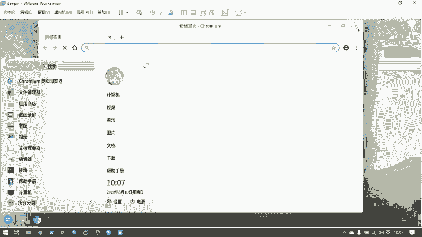
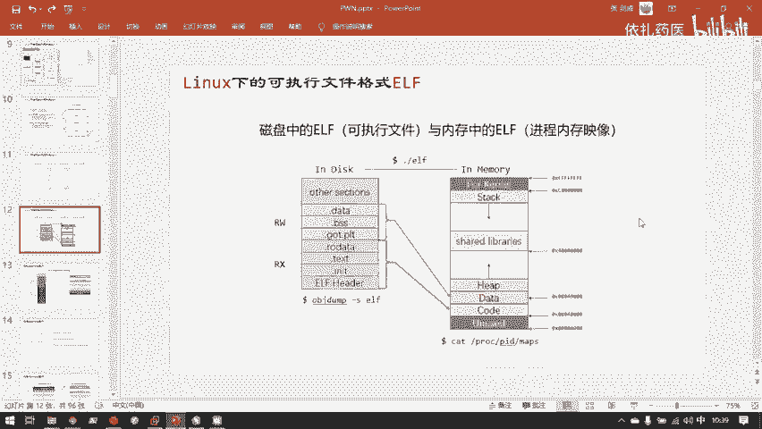

# CTF教程：CTF初学者必备的1000个练习题，每日一练，百日成神！（ctf-wbe／ctf-pwn／ctf-misn／ctf-逆向） - P29：Linux下的可执行文件格式ELF - 白帽子讲安全 - BV1dp4y1j7aN

嗯，可执性文件。可是这文件它。嗯，目前10点了，我们先休息几分钟，然后过一会儿再讲。过一会儿就直接从这里的PPT开始直接讲这行。

那我们现在先休息一下。然后大家如果有什么想说的，可以现在。

在这个钉钉群里发一下就行。

嗯。好了，我们继续。

嗯，这里这里还提一下题外法，就是其实大家如果就是在windows下用lininux的话，其实还有个解决方案。如果你觉得虚拟机。它它还是比较重量级的，比较消耗系统资源的。

其实windows给你提供了一个很方便的使用linux的接口，叫叫WSLwindows subs systemsem forlin，这个是windows微软官方已经帮你写好的一个东西。

你可以直接去微软应用商店。突然就商店不见了。暂且找不到电脑的应用商店了。你winwindows1都是默认带应用商店的，你可以直接去应用商店搜索linux。然后就会给你显示一个主题界面。

是说是在windows下使用linux yes，然后你就可以在上面下载任意一个linux发行版。然后像我这样，我下载是daddy。下载之后，你可以在电脑上很容易的得到，就直接一键启动的。

一键就可以启动的linux的一个。但是windows system forlin它有个缺陷，就是它没有桌面环境。你可以看到我们这个虚拟机启动的这样一个桌面操作系统桌面级的linux发行版操作系。

它是有一个桌面环境的桌面环境里类嵌的一个我可以关掉这个可以打开这个我是我可以不用这个，我甚至可以就像windows一样操纵它还有文件管理器，然后浏览各种各样的文件或者是浏览器上网，还有这样的开始菜单。

windows其实你不用sha要的话，可以像windows一样使用它，尤其。因为它本来就是例图于就什么叫中途也要在操作系统方面做出出破。然后就是第一接过了第一干齐。😊。

所以他其实做的他立志于就是在桌面环境，它可以达到在一定的程度上替代windows这样一个地步。嗯。😊，如果其实做胖题的话，因为胖题是不需要GVI的，你都是在命令行里研究程序本身。

所以如果其实平时在windows要做的话，可以用WLWSL这样。嗯，我们回到主题。我们说我们在我们研究的是二进制logo。二进制logo是什么呢？二进制的可执行程序的logo。什么是可执行文件呢？

这是这是这个说法其实有两种，一个是广义的可视性文件，就是只要它里面保存的是代码。然后可以运行对应这些代码成结果这样的文件都可以叫可性文件。对应的windows下的批处理文件叫BATT。

还有lim亚的批处理文件叫SH，还有python代码，它也是可执行文件。假PY。为什么它是可视性文件呢？我们可以可以看一下python作为一个可视性文件是怎样的。还是的。脚本可以作为可视性文件。

也可以可以作为。文本文件。比如此时这个。E叉P点PY也就是exloit点PY这个攻击的脚本。他此时就是一个。没有执行权限的文本文件。你看到ja下，你可以在CSH下可以很方便的使用LL查看到它详细信息。

He cannot read， write。没有excusable，没有X它就不能执行。那我们怎么运行它呢？我们就调用python解释器。python3这个本身它这个解示器是一个可执行显序。

然后把它输入python三的解示器，让它运行。然后这也是一个攻击脚本嘛，所以我现在得了一个sll很正常。当然，python这样一个脚本文件，它作为可实性文件应该怎么做呢？

在linux啊这一点change mode这一点也是大家要学会的。这是脚本文件，它需要一个特殊的解测器。如果我在头部就帮它标识好解示器的话。并。3。然后。那他能执行吗？直接就能执行吗？

就是用点杠这样的linux加执行法不行，他说权限不够。这秀的。当然也不行。因为他根本就不是用户权限不够，它是这个文件的权限不够。燕人去哎，说错了。它是这个文件本身，它没有可实性权限。

这是一项权限一是用户的权限。二是文件本身有一套权限，就是读写执行权限。我要此时要执现的，我们需要用change mode这个命令。然后给他正就是加上一个X，也就是excutable。这样一个权限，然后。

然后此时再直接点个杠。因为看到时间获取不需要。这是广义的可视性文件。狭义的可执性文件呢就是也是说文件中的数据是代码的文件，但是狭义的它就做一个限制。是必须是机械嘛才可以。

就是编译成了二进制的CPU认的机械代码。这样的程序说是狭义的可执行文件。嗯，这里有快捷键。你可以看到我此时鼠标在de well里，让我按了ctrol加al，我可以释放鼠标。你看此时鼠标变回了手。

就代表回到了我的windows里，然后就可以做各种各样的操。比如说L加t切换应用，然后再点击下，它又回到了。虚拟机理。然后此时按L加t，它是对虚拟机发出的命令，所以它就在虚拟机里切换。这是一个小地。

可执性文件的分类。嗯，我们还是其实在整个CTF里还是会接触到两种可执行文件。一是windows下的PE。不过目前在碰这个方向中，就是windows的胖还是比较少的。

所以window的P这样一个可视性文件的格式。常见的还是在立项这样的题目中，并且立项题目甚至windows大要数量要大于linux。但是在胖中。基本都是linux的偏下。

它lininux可以换各种各样的指令级架构，但它依然运行的是一个linux。所以在胖里我们主要研究的还是ELF这样一个可执行格式。winow下PE什么是PE呢？可视性程序DXE就直接双击。

它就能跑的这种。培讯程序动态连接库这个DLL这个想必不管怎么样，就是小时候玩电脑都应该熟悉了，动不动打开一个游戏，然后就显示什么什么什么DRLL丢失，就是动态连接库丢失了。动态连接库的概念到后面会讲。

还有就是静态连接库，静态连接库因为是程序员所关心的。所以最开始如果没有接受的话，可能知道比较少。然后linux下的ELF。这有一点，其实。刚刚已经说过了，就是。linin系啊。

它并不是用后缀名来标识文件格式的。所以其实这里的后缀名后缀名其实只是辅助记忆的作用。比如说点out的执些文件。我回到刚刚的。这个A点outt它默认编译出来的是给你加了一点outt。

告诉你这是一个可执性文件。名字改成了点A。也并没有什么影响。因为他根本就不是用这个假out这个后缀名来识别文件格式的。所以那个是这个点out点so，还有点A，其实都只是辅助用户识别的一个作用。

它也是像windows一样有可程进程序，公态连接库静态连接库。这样的这三种可视性文件，它里面保存的都是机械版。所以作为可性文件使用。

windows的PE这里一旦有一个有测的历史是他们叫PE呢portable isputable就是windows微软最开始试图统治。桌面端还有移动端。还有平板电脑上面所有应用生态。

然后他制定这个PE的时候，他是想着叫这个文件格是要在。所有的设备和架构上都可以一套程序，一次变译全套运行。但后来他这个梦想破灭了，大家也都知道最后的结果。

嗯，再者就是。接下来就实际了解一下我们所要研究的E缩文件，它的内容是怎样的。什么ER呀，刚刚已经看过了这个这个此时这个。假于这个A就是1个U2F。我现在把它风离一下。

这是一个可持的文件ERF运行就是hello。那么这个可视性文件刚刚已经说过了，它里面的主体内容都是机性嘛。当然不只有机械嘛，它会有各种各样的呃数据部分来标识。这个文件的相关信息。这有一个大图。

这个大图其实就是向你解释了这整个。文件它是以怎样的格式组织的？它这里叫simpleEFFERF。就simple点EIF。可执行的这个文件其时长什么样了？就是这个图里标识的样子。但是这个图是高清图。

大家可以在PPT里，我我过一会儿会把PPPPT发给大家。然后大家可以在这个图片中很清楚的看到。E2S的各种部分。分かた。先对这个这个图简单的看一下吧。就是在这种情况下，其实就是一遍讲。

其实都是很难记住的。我们需要用各种方式，各种角度把同一个知识阐述多遍，然后来确保大家记住。首先ELF大家看这个方框，这就是文件本体了。里面存放了大量的二次数据。刚才经VM看过了。然后他主要是。

分了这里这个图解释的是分了三大部分。一个是他的头。这里是主要它标识的是EF的文件头，还有。program header table，也就是程序头，其实也可以翻译成段表。然后最下面在E儿和末尾。

它有一个节头表。其实这几个除了这个ERF header，它要确保在文件的开始的位置存放。其实这个断表和节奏表它都。双方位置并不需要一定是他图中标识的这样。然后主要就是这三个表，这三个表里面记录的都是。

一些控制信息控制信息中包含了一些可见字符与不可见字符。类型字符就是用一些数字来标识的内容。比如说可执行权限啊这样的东西标识一个截的可执行权限，断的可执行权限。那比如说用一个一标识可执行。

用一个零标识是不可执行。这样的也是不可单进字符。所以即使这样的控制头，你也会看到，此时这里大量的小点就是都是不可单行字符。可这字符呢就是可这字符主要内容都是。这个文件中的一些符号。

符号的内容也是后面会讲到的。然后除了这些控制控制头，然后这个EF的主体就是。代码和数据。相关的内容代码就是很简单理解，就是给CPU认的。可执行的机械码数据就是这些机械码在执行中所用到的一些相关的数据。

举个最简单的例子。我们重新回到这个。たてはい。要不行。intermail比特0。hap print F这个函数的具体实现。他们都是代码，对吧？hello world是代码吗？

hello world它并不是代码。hello world，你可以说hello world执行高吗什么，他什么都不是，它就是一段数据。😊，所以呢那hello word就是对应的是这个EF文件里的数据。

那剩下的这些intermailpre returning。它就是这个ERF中的代码。然后整个ERFERF文件大概就是以这样一种形式组织的。呃，这里就是以一个拓图的结构，然后向大家展示了。EF的内容。嗯。

除了ERF主体的代码和数据。主要内容也就是刚刚说到三个嘛。EF文件投表，然后程序投表和接头表。断表EFphone文件投表记录了整体的。这个EF文件。它的整个组织结构，这个投表是给操作系统看的。

然后操作系统通过分析这个投表，然后为这个ERF建立一个进程印象。程序投表断表。断表是在。分表是。这个也会等一下展开讲，因为这里比较重要。这里目前先大概的解释一下它是怎么回事，段是用来标识。呃。

进程印象不同部分的权限。比如说text段，也就是代码段，可以翻译成代码段。他就是。不可写。😊，代码为什么要可写呢？代码可写呢还不得了。那我在程序执行的过程中，我把代码端随便如果太可写的话。

我随便篡改代码，那我就会使得这个程序的代码随意执行，那就太可怕了。所以代码段肯定是不可写。😊，可写的部分那就是数据段。然后就是这样的段表，它标识了这各种各样的段是应该如何组织。

然后它是拥有什么样的权限的？重定位文件不一定需要断表，重定位文件是什么？就是刚刚的链接库文件。截图表截头表是用来组织截的内容的，节视图是用来给E文件用的。断视图是用来给进程中的进程印象用的。

他们俩什么关系，马上就会讲到。节奏表是用来组织页er文件，存储在磁盘上各个节的信息。比如说同样是代码，但是这个文件里有各种各样的代码，各种各样的代码它有不同的功能。

比如说ts节它的代码就是用户自己写的代码，但是用来完成这个程序所实现的功能的。然后PRT这也会讲到，它也是一段代码，但这段代码它不是用来实现用户所规定的功能，它是用来解析动态连接库。

用户所申请的动态连接库中的函数的。具体地址配份代码，那么同样是代码。texax节和PRP节。他们虽然都是同属于代码段，拥有可执行权限和不可写权限，这成为一个段的两个节。但是他们的所实现的功能不一样。

所以要把它们分为同一个段中的两个节。然后接合表就是记录了这些截。中各种分类信息。嗯，这里主要说到。EF文件它是怎样被执行起来？刚刚已经说过了一经。一个。一个能与你交互。

只要你计算机上在你的电脑屏幕上正在与你交互的东西，那么它肯定是在内存中的，它不不会在磁盘上。包括此时simple点12F。这样一含到word是对应的可能性程序。它单独的存放在磁盘上的文件系统。

被我list出来，我能看到它有这样一个东西。他并不能工作，只有我点杠诉他的时候。然后他被载入内存，他才能工作。所以EF文件它保存在磁盘上，和它在内存上其实是相似的，它结构是相似的，但是是有些区别的。

磁盘是一个大容量的低速存储器，内存是一个小容量的高速存储器。为什么需要这样两个存储器呢，就是因为磁盘便宜。它单位单位容量磁盘的价格要比内存低廉很多。所以就需要磁盘来保存大量的数据。

然后内存就只存放当前执行的数据就行了。当然这就是计算机的一个分层存储的思想。就是越接近CPU的存储器，它的速度越快，它的容量越小，它的价价格越高啊。最接近CPU的催收器是什么？是计存器。

计存器总共也就是计次流量就它单位都是字节了，计算器也就了几百几千个字节没了。然后计存器之后呢，就是cake。就是高速缓冲存储器。cakeake是一般是1个CPU。

是高端CPU还是低端CPU的一个直接体现。高端CPU它的cake一般就会很大。低端CPU它像赛阳那种CPU赛阳一部分赛扬，它根本就没有cake。就成为了低端CPU。呃。

CPU其实比如说从低就拿英特尔举例，从低端的赛扬奔腾到最高端的I7I9，它主要体现在哪里呢？第一是首先I3I5I7I9，它其实同一片大的金元划分出来的。然后品相好的能经受出高频率运行的。

那么它就成为了I7I9。然后品相差一些的，它就成为了I3I5。但其实它是一一刀切的一块金元上的不同部分。然后这比较差的部分就成为了第所谓的低端处理器，比较好的部分就成为了高端处理器。

然后还有一个就是cakeakecake的大小不同。cake是CPU里自带的存储器，它不像内存和磁磁盘，它是专门的在主板上安装的另外的2块存储器。k和计算器是直接在CPU里的两个存储器。

因为直接在CPU里嘛，所以它的速度非常非常快，但是它价格也非常昂贵。k个越大。那么这个CPU它的执行效能就越高，为什么呢？因为它会在CPU中有一个非速度非常快的一个存储单位。来保存当前执行的数据。

而不用频繁的从内存和磁盘中取用。所以kiick对于CPU的性能体现是非常显著的。所以只有在高端CPU上才会配备多级K，并且k的容量会非常大。但是k的容量再大，它的单位也是兆。

赵比特或者是千不是赵拜赵子姐和千字姐，他也不会像计存，他比计存器还要大很多。计存器的单位直接是字己了。但然后到了cake，这里就是千字节和兆字节。然后到内存这里就是集字节，也就是GB及GB的内存嘛。

然后到了硬磁盘硬盘，这里就变成T我2T的硬盘，一T的硬盘。所以这样的一个分层存储。是为了解决CPU的。存储容量空间和它的执行效率时间的一个平衡的问题。所以我们的ER和文件编译好之后。

它必须是存放在磁盘中。但这问题就是因为内存它断了电，它就不能保存程序了。磁盘是它是用磁介质来存储内容的。你断了电，它的磁磁性还在，那么它的内容就还在，但是内存不一样，它是直接用电频信号来保存数据的。

你断了电，它这个电信号丢失了，那内存中所有数据就没有了。所以我们编译好的可执性文件是存放在磁盘中的。然我们要执行这个可视性文件的时候。操作系统就会把磁盘中的这个可实现程序载入到内存中。然后整体来说。

放在磁盘里的可执行程可行可执行程序和它加入到内存，变成了一个进程印象。它们整体的结构是很类似的。你可以看到左边这幅图就是解示图，这个等一下再解释。左面这幅图就是。可这些文件EF放在磁盘中的样子。

右边这幅图就是对应的。磁盘中这个文件，然后载入内存。然后在内存中存储的样子。主要区别是什么呢？可以看到。这三个控制头控制表其实大体是相同的。ER head断表和截头表，你可以看到大体都是相同的。

但是它在磁盘中，它是以段的结构来组织的。在内存中它就变成了以不对，说反了，在磁盘中它是以节的形式来组释的，这里是section一section N，然后到了。内存中它就是以段的形式来组织的了。

这是segment一segment2，然后一直到segment n。呃，这个图就是形象的展示了两者关系。在磁盘中，他磁盘中看这个文件，解析这个文件什么呢？就是这个文件是一个一个的断。

然后这些这个磁盘中的文件，它的所有数据都是紧紧紧相邻的放在一起的。就是哦节又说完了，一个节紧所有的节都是紧紧相邻的放在一起的。然后我运行这个程序，就是我在shall里执行点杠。然后这个ELF。

它就从disk跑到了memory，也就是从磁盘，然后到了内存里。然后那么他的视图就不一样了。所有的断。不所有的不同的节，它会。不同的有相同权限的解，它会变成一个段。

比如此时的data节BSS节和go点PRT节，它们的性质都是这个程序所用到的数据。所以呢这些节在载入之后，它的结视图就消失了。在内存中是不用管这些节具体是怎样的。在执行的过程中，只用CPU看到的只有段。

就是这些节合成了一个段。然后这个段里面的所有的数据，它就只知道就是这些数据，它是它的性质是数据，不是代码。然后它是可读可读可写。但他不可执行的。然后剩下的一些只读只读数据，还有一些代码。

就是这些都是不可写的数据，然后就会把它放到code。然后有时候也叫text这样一个段，这个段就是可执行，然后有一些也不可执行。但是他一定是不可写的。然后会放到这样一段。

然后整体这一部分你可以看到code和data。这样部分在进城整个进城虚拟地址空间，这个也是等一下要讲。嗯，因为这个二进制的知识，它是一环套一环，然后所有的知识紧紧相连。所以我讲这个知识的时候。

既然会涉及到下一个还没有讲的知识，那就先听一下就知道哦，这里有一个这样的知识。然后在下面解释具体解释的时候。然后再深入的展开这个知识是什么？所以你可以看到EF文件。

左边的这部分它载入了虚拟内存空间的时候。它其实主体它只是在code和data这。就是这左边的这所有的内容其实在着这个内存空间，只是占内存空间的一部分。内存空间是用来干什么呢？这整个虚拟内存空间。

那就是用来。进行这整个程负责这整个程序执行。的数据管理一下。然后这个是呃可执性文件本体只占了这个内存空间的一部分。为什么呢？因为这个程序执行，它并不仅仅就是只是这个程序本体就够了。

它需要各种各样的控制结构。比如说stepack用来这个程序站用来管理你这里面函数调用的状态配用来给用户提供内存。动态内存申请和调用。这就可以证明为什么只是这样1EF文ELF文件。

是不足以支撑整个程序的执行的。举个最简单例子，我此时在程序中，我用户然后mlog一个大块内存，然后用来写在大块内存里放一个图片。那这个图片最开始肯定是没有写死在这个可能性文件里的呀。所以就只能。

在内存中的进程空间再开辟一块内存。对应的就是hiap，然后在hiap里。提供用提供给用户me look到内存，然后在hiap里存放图片。那么这个图片同样的在这个。

这个可执性文件对应的进程的虚拟内存空间中。但是这个图片它是不是在内存中，但它并不在这个磁盘里的可能性文件中。所以这也就证明了为什么。内存一个可视性文件载入内存之后，它会有多出各种各样的控制结构。

并且这个可视性文件自己的数据只是这个内存空间中的一小部分一一部分而已。内存文间中还需要大量的其他部分来维持整个程序的运行。嗯，对于lininux这里列出了两命，就是大家好奇它的具体的工作方式的话。

可以用正朗的命密，然后分别查看。就是在磁盘里的。在磁盘里的嗯程序的结构和在内存中的进程的结构。嗯，这里先给大家演示一下。比如说是OG档这个。程序。

这个是b you这样的一个linux亚的工具所提供的一个。内容我这个虚拟器已经帮大大家安安装好了，所以大家直接用就可以。OPG大杠S，然后simple讲E2F。

然后就他就可以直接把这个E2F中的各种各样的截区的数据以二进制的形式显示出来。就给大家展现了一个大家好奇这个程序它的格式究竟是怎样的？用这个命字就可以清楚的看到。然后对应的我们要查看一个进程。

要好奇去查看一个进程，它是一个怎样的格式的话，就用这个命令。大家可以看到，在lininux中，其实一个进程的结构，它是以文件的形式，在文件系统中是存放了一份。是pro。根目录下的pro目录。

然后对应输入PID，然后它的max就是它整个的进程结构。然后用tt把它输出出来，你就能看到具体的内容。但是这里有一点特殊的是。我这simple点12F，我并没有。他执行完了，他自己退出了。

所以我必须我要其实要用这种方法去看一个。进程的呃结构的话，我必须去输出一个正在运行，并且没有停止的进程。所以大家其实如果想看的话，可以去那个文件夹里找一个系统维护的守护进程来看。但是其实还有一个方法。

就是直接查看一个进程的内存空间信息。GDB。😊，这边我这里也是帮大家装好。那个how bug的插件，然后我打一断点。我再运行起来，然后此时它就断在了这个程序的面函数的位置。然后我可以用嗯VMM麦这个命。

直接查看到这个程序的。进程的内存空间的分布。大家可以看到从。因为这是64位的可执现程序，所以他我们要打开呃程序的地址随计化，就是PIE这个保护它的。基始位置就是0差4厘米默认。

然后这里可以看到它标识了程序的各个。断区的数据。战断。然后堆段，当然这里因为没有用到动态内存申请，所以这里是没有堆断的。然后数数据段和代码段都可以它已经用颜色那标识出来，这就是。数据段，然后code。

这样土合是用代码段。然后再可以清楚的看到一个程序。它的进程的各种结构，其实这里就可以直接与PPT的这张图对应起来。你可以看到数据嗯代码段上面数据段再往高地址就是堆，然后再是共享内存，共享内存区。

然后再就是债段。嗯，可以看到，但是这里有一个这里还有问题，等一下也会遇到。这个图画的是低地址到高地址，它是。把低地址画在下面，高地址画在上面。因为这样比较符合一个语言上的直观性，低地址那就在低位嘛。

高地址在高位嘛。但是大部分情况也有一一部分情况，这两种情况参半吧。就有时候比如说此时GDB。他就是把低地址写在上面，然后高地址写在下面。你可以看到这是地址值，这个很大的数字肯定高地址嘛。

这个很小的数字是低地址，但是正好是与这个它的地址空间分布。他画的这个图是正好与这个图反过来。为什么呢？我们这样画是因为因为我刚刚说到是低地址就画在低低的地方，高地址画在高的地方。

然后GDB这样做是为什么呢？是因为数据总是。从低地址往高地址写的，我们写字在一张纸上写字，也是写完第一行再往第二行写。而不是首先从纸的末尾，然后写最后一行，然后把笔往上拿再写上面一行。这个数据也是一样。

它总是写完一行，再往下面一行写，所以是从低地值往高地值写，是出于这种写数据的直觉。所以GDB会这样显示，它把低地值显示在。开头高的地方，然后把它高地址写在这张纸的末尾一的地方。嗯，这是一个。

PPT比较直观的展，就在PPT里绘的图比较直观的展示。

