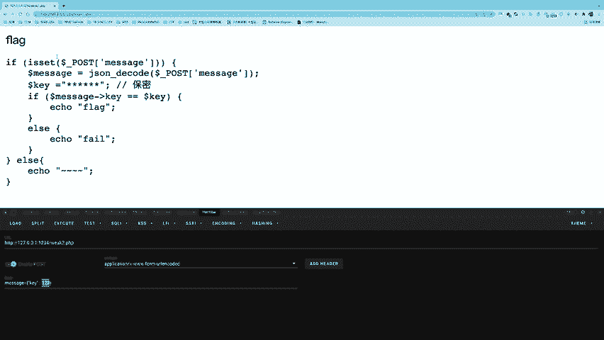
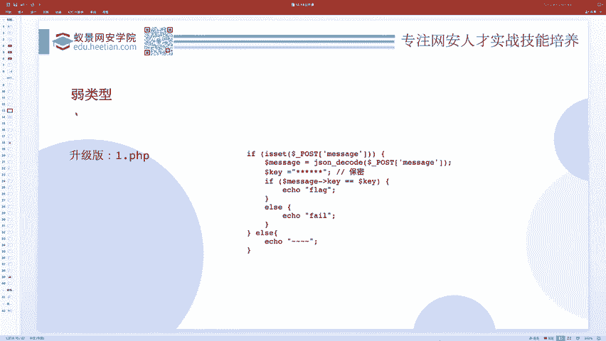
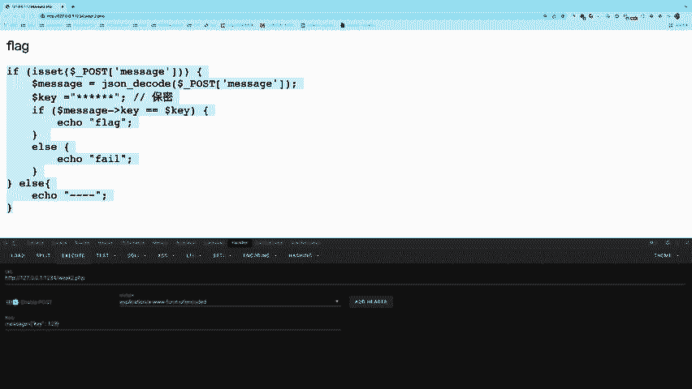

# CTF教程：CTF初学者必备的1000个练习题，每日一练，百日成神！（ctf-wbe／ctf-pwn／ctf-misn／ctf-逆向） - P2：ctf-web01_弱类型问题 - 白帽子讲安全 - BV1dp4y1j7aN

说这是我们三今天的三个内容。首先我们看一下弱类型问题到底是。什么样的问题呢？我们今天呢主要是以PP语言作为啊主要的讲解内容。因为PP语言在外部CTF里面会占很大的一个方向，啊，也是新手比较容易上手的。

因为编程语言它比较简单。首先我们需要知道在这个。呃，PHP语言里头，它和pyython不一样，他在判断两个东西相等的时候呢，有两种判断，一个是三个等于号的判断，一个是两个等于号的判断。

那么三个等于号的判断呢是一种比较严格的判断，它会干嘛？它会判断两种东西的类型是否相同，然后再比较。如果说两个等号的判法，它就是呃不是特别严格的判断。呃，举个例子来讲，你比如说我们大家都都会写代码，对吧？

你写一个if，然后后面是一个条件吧。如果这个条件满足，那么就进到这个if条件里边。那这个条件满足，可以写什么呢？可以写处吧，可以写一，对不对呀？那为什么呢？就是因为一它表示某种意义上的一种针。

处也表示一种真。那其实在弱类型的这种就是不严格的比较的时候，这个一和处啊其实它就是一个差不多的东西。你你就大概这么理解，所以这种不严格的比较，会把这种差不多的东西比较为相等。比如。哦，我们来演一下。

我给它放大一点，我的屏幕可能比较大，大家看不清楚。我们可以搞一个处，对吧？也可以搞一个一可。诶。一。一个是布尔型，一个是int型。然后我问你一和处是否相等呢？

它返回的结果是相等的那如果说一和处是否严格相等呢？他告诉我们。不相等。这就是一个啊比较问题。PVP里边有这么两种比较。那么如果说你使用这个弱相等进行比较的时候，在某种情况下。

本来两个不相同的东西会被比较为相等，然后进而会产生一些安全问题。这个就是弱类型的安全问题。其实大家一定要呃牢牢把握一个重点啊，就是并没有任何一种东西，它生来就是为了漏洞而产生的。你比如说。

这个玩意儿两个等号，有人说，老师，你这东西既然。它有这种安全问题。那P2P为什么不把它给取消掉呢？P2P这么多年的历史，为什么还保留着这种习惯呢？因为它本身不是为了漏洞而创造的，它是方便你开发者写代码。

给你提供一些便利来创造的。只不过这个东西的。不良使用啊，使用不当，然后进而造成了一些安全问题，并不是它本身就是为安全问题而生的。所以说啊这东西本身啊没有什么问题，而且还是一个挺好的东西，挺方便的东西。

开发人员还很喜欢它。但是如果说你对它。这个不注意的话，一不小心他可能会造成一些问题。那这里边呢我们在PPT说了。如果说你是弱相等的时候，它会字符串，先先先把这字符串按类型呢转化成相同的类型再比较。

如果说一个数字和一个字符串。做比较，然后或者涉及到数字的内容的字符串进行比较的时候呢，他会先把字符串转成相应的数值，然后按照这个数值来进行一个比较。这是在两个等号这种不严格的相等情况下呢，它的一个特点。

那比如比如说这里边我给出了这么多种测试，atdmin和零是否相等呢？它返回一个相等。那，我们就说这第一句话，这个这就是为什么呢？它为什么是等于零呢？因为刚才我们说了，它会先进行类型转化吧。

如果涉及到数字，那它会先把字符串转成数字，对不对呀？这里刚说了，那么addmin和零做比较，admin就得呃把这个字符串，这个addmin转成一个数字吧。那字符串转成数字，字符串本来不是数字呀。

它转成数字，它一定得有一个转换的规则，这会转换的规则是什么呢？我给大家简单的写一下。😊，就比如说你字付串在这。然后呃我先来一个比较简单的吧，123。A的面。他会从第一位就开始看看你这个数字是不是数字呢？

第一位是数字是字好，我拿下来，然后接着看第二位是不是数字是数字，好，放在这拿下来。第三位是不是数字是拿下来。第四位是数字吗？不是数字了，他就会从。😊，遇见的第一个不是数字的那一位开始，把后面全都丢弃。

所以相当于123addmin，最后转换的结果就是。123，那你比如说123A123123123123，那它会转成什么东西呢？啊，一位一位看第一位是数字拿下来是二数字，拿下来，第三位是数字拿下来。

第四位不是数字了，就丢弃了。尽管这一位后面还有这么多数字呢，但是它从这一位开始就已经不是数字了，不是数字，那就拉倒就不要了，所以它还是转成个123，这是它的转换的这个。😊，规则。

那你比如说admin这个东西，它就它要转成什么东西呢？首先第一位看是数字拿下来，结果他从第一位开始就不是数字，就是啥也没转了，啥也没有，那啥也没有，那就。等于0。所以说为什么ad的命是零呢？

就是因为ad的命第一位不是数字，所以等于0。那你这一哎一个的命为什么等于一呢？因为从第一位开始数啊，第一位是一个一，所以它等于一偶的命一和一相等吗？不相等，因为它头一位不是数字。

所以它表示为零零和一当然不相等。那我的命一和零相等吗？相等。因为额的命一表现为零，所以零和零相等的。😊，这前4个。没啥问题吧。但你看这第五个。他是为什么呢？那有人说了啊，这是第二位是0。

第二位不是不是数字了，然后它表现为0。这个第二位不是数字，它表现为0，不是那么回事儿。😊，前面为什么它会转换？是因为它一个字符串在和数字做比较。但是你现在最后一行这个东西，它是两个字符串做比较。

你两个字符串，你还转成数字，那不是有病吗？😊，他肯定不是这个规则。那为什么这俩东西明明不一样的字符串，它还返回了相等呢？😊，这是因为这个字符串它不一般。它是一个数字，然后一个亿后面全是数字，一个数字的。

一个亿，后面全是数字。这个意表示什么呢？它表示的是科学计数法，就零乘上个十的多少次方这个意思。所以如果说你这个字符串啊，是这种科学计数法的形式的。😊，他才会给你转成数字，用数字来做比较。

不是说什么字符串都要转成数字。那如果说什么字符上都表成数字，那这就乱套了，这简直是太crazy了，不可能的，只有这种形式的才可以。那你看现在这两零乘的任何数都为0，所以说你不管是0乘10多少次方。😊。

都等于0。所以你你这E后边只要是数字，那前面是0。我们就满足相等。这个是最后一条的，就是在这种啊特殊的一种字符算的时候呢啊它是一种特例也会被当做数字做比较，让它俩返返回相等。这个就是弱类型。

既然啊我们看到了这个比较特殊的这个E的东西，那接着我们再看点别的。当一个字符串啊，这个字被打错了啊，打错了，应该是。被当做啊。被当做一个数值来取值，它的结果和类型如下有以下规则。

如果说这字符串中没有包含点儿啊，小E大E，然后数数值在整形范围之间，那么就会被当成int来处理。你比如说刚才那个123addmin，没有这些数字吧，然后它的数值呢是在整形之间，它会被当成数字。嗯。

或者你比如说再再说个普遍一点的就字符串的123，那就表示int的123。那其他情况下呢会被当做这个fat来处理。float来处理的话呢，呃刚才那个就是呃必须你要是述值在整形范围之间才可以。

然后就就像这种123addmin这种东西呢，它会被当做float来处理的。啊，这种东西呃处理的规则我们刚才已经讲过了，就是从头开始数看前面的这个数字的值，决定了这个字符串。

再转换为一个fat型的数字之后，它的值是多少。也就是说开始的部分决定了它的值。如果说字符串以合法的数值开始，就是也是数字开头了，那就使用这数字，否则那是还没转出来就是0。下面呢是一些规则，1加10。

5等于11。51加上个-1。3乘以呃，E3就是-1。3乘10的3次方，那就是负的1300呗，-1300再加一，那负1299，并且因为它带了E了啊后这个带点了，所以他们都是一个浮点数。10。5是负点数。

这-1300，虽然-1300，你看着是整数，但是因为它有这个E，所以呢。它会被当做float来取值。那这样的话啊一个float加itt，最后值还是float。完了这个呢返回的是一。

因为这个字符串表现为0。为什么表现为零啊？大家应该知道了吧，这个呢表现为2，1加2等于3，这个呢表现为01加0等于1。这些东西呢都比较简单。那接着我们就可以来看看个题，然后做一做。

我先给大家一分钟的时间，虽然你们现在是拿不到这个环境的，因为这是我本机的环境。我们大家自己先读一读源代码，现在是20点14分18秒，我们等一分钟的时间啊，然后来讲这道题，上来你就是拿到这个东西的。😊。

这就是给的源码，然后key是什么呢？是不告诉你的，结果告诉你说你要干这个，我就给你flag。这flag就是正确flag，只不过我用flag就字不出来，意思意思，你的目标就是就是输出这个flag。

大家自己看一看。😊，差不多了吧，时间我我我忘了刚才是啥时候了。那我们现在来看看这个题。他说呃，你需要给我提交一个叫message的po参数啊，然后呢，你这个参数。是jason形式的。

我就把你进行jason抵扣的。然后jasondecode之后呢啊要和这个key做比较，就是jaendecode之后会得到一个呃这个基en。或者说是得到数组，不知道的话，你可以去查一查这个函数。

就如果说你做这个PP也好，什么语言也好，你遇到一函数不认识，那就直接10百度，你看就太多了，随便。嗯，你一点都能点出来。对吧你不认识不知道干嘛的，去查一查。

这里边呢呃就说把一个基cent编码字符串转换为一个这个。那PUP变量，那转换为什么什么类型的呢？默认应该是object对象。如果说你第二个参数置为处，那就返回一个数组。因为PUP数组也是键值对。

所以跟对象也差不了太多。然后有一个message，然后说message的这个key属性啊，因为它是对象啊，key属性呢要和你这个doller key dollar key什么？我不知道。

但是我要和一个不知道的东西相等，才能得到flag。这就很很奇怪了，明明是一个不知道的东西，我还要和你相等。😊，这时候怎么办呢？你可以发现他判断的相等是一个什么样的相等，是一个弱相等吧。两个等号的相等。

那两个等号的相等。我们其实就可以用刚才的呃东西。啊，这里边呢我选择直接使用这个hi bar来pos提交一个数据。message等于等于你这个基算啊。K。然后K的值呢，比如说我随便蒙一个，我说你是我的命。

我先提交一下，他他结果他返回fa了，这肯定是不对的。因为这个K的值不是add。那怎么样利用这个弱类型呢？因为我们知道啊基son这个东西它是可以呃一个属性嗯对应的值是不同类型的。你比如说这个key。

它对应的值这addmin表示字符串，除了addmin这表示字符串以外呢，我可以让它为这个数字，我可以让它为数组，我还可以让它继续为一个对象，这是jason的表示。

所以意思是我可以通过这个基son让这个message的key属性。为一个数字，那如果说这个东西是数字，而你这个东西是什么呀？字符串吧。尽管我不知道字字符串值是什么东西，但我知道它是字符串。

那数字和字符串做比较，字符串就叫转数字。😊，所以我不妨大胆的猜测，你是一个字符串，并且你这个字符串没有以数字开头。那么你一个没有以数字开头的字符串和我一个数字做两个等号的比较，你就要转成数字。

而你不是以数字开头，你转出来数字就为0。所以我放心大胆的在这写个0。于是哎我们就拿到了flag，在这flag就意思一下，我们有真的写flag。对吧可以看到我们就拿到了flag。

这就是呃一个简单的热类型问题的演示。那么呃这个题确实蛮简单的，是我们直接蒙对了啊，就就就我就猜它不是以数字开头，然后它转换就就转成0。😊，那如果说。这里哎这里边有一个呃升级题目啊，we2。等P2P。

还是相同的题，只不过呢。我把这个浏览器放大一点。只不过现在我们在传零的时候。Fail。说明什么呀？说明这个字符串现在以数字开头了。那你如果说你能知道啊，这是一个弱类型问题。

你也知道你要用一个数字去和它去碰撞这个相等。那这个怎么样判断啊，它俩相等，就是用一个数字，对吧？可是这个数字它不是零，怎么办呢？也很简单呀，我们其实就直接。爆破它就好了。因为你既然你不是零。

那你肯定得有个正确答案。😊，你正确答案是什么？我不知道，但是我给你全试一遍，是不是就可以了？所以我们就可以直接把这个包给抓下来。然后嗯你用b suite的 in模块也好，还是用python写个脚本也好。

然后你把这个呃从零开始，然后一啊2。345一直爆破一下。然后当你包括到123的时候，你就得到了flag了，我就不不带大家现场写脚本了，就是浪费时间，这蛮简单的东西啊。

你直接用request模块写个for循环，这这里边就是一个i for I in range0到100万，你你跑一下嘛。如果说收收到flag就输出了。这就是一个呃暴力破解的方法，蛮简单的对吧？

所以遇到这种问题不要慌，尽管我们一下没猜出来，但是办法总是有的，直接就爆破它就完事了。没有个呃10秒20秒的这东西你就能给跑出来，因为就100多个包就可以跑出来。就算它网比较慢的，10秒钟也够了。

好，那这现在大家就了解什么是弱类型问题了。这篇呃图片里边呢呃告诉了大家，在PP里边，我们用这种松散的一个。比较啊 comparison with两个等号，就是呃松散比较不严格的比较。

哪些情况下会返回相等呢？首先这是一个横轴和纵轴，那么它的这个中间的这这这一个线，这这叫什么线啊，就反正这对角线吧。再看看源码，我把这源码发你这个再发你这个聊天框里，好吧。

这个对角线就是两个东西相等的。一定是相等的吧，因因为你横轴和纵轴相等，那他俩一定返回出，这没得说的。😊，那按道理说，如果说是强相等，那除了对角线以外，其他都应该不相等，对吧？

因为其他东西都一定是两个不不一样的东西做比较。但是你看在弱相等的时候。😊，标标色的这些标颜色的全都是可以相等。所以在弱类型里面有这么多东西，它可以相等。基本上就是呃呃真真假假的一些比较。那利用这些东西。

你可以去呃。解决一些题目。这就是。