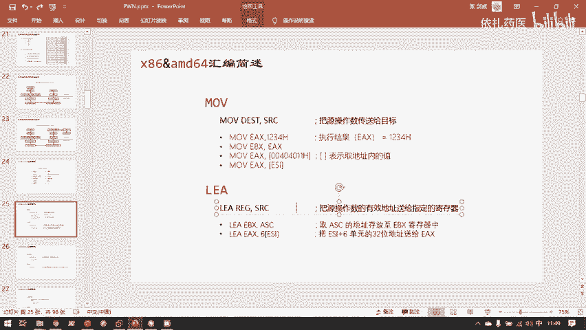
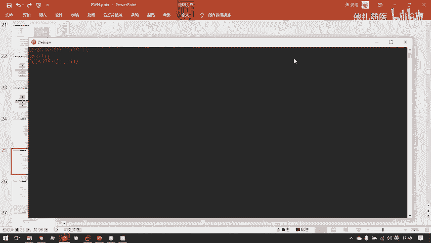
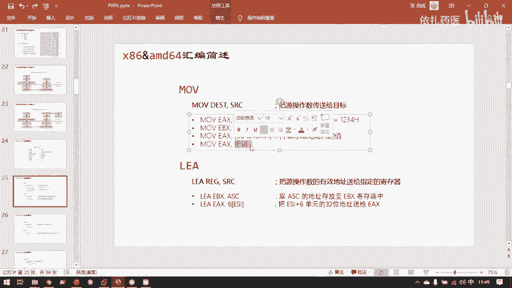
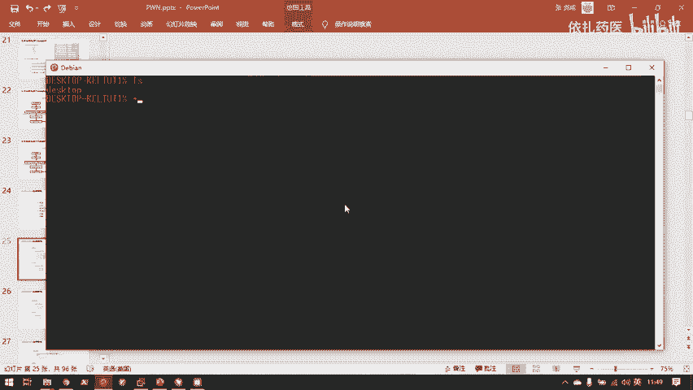
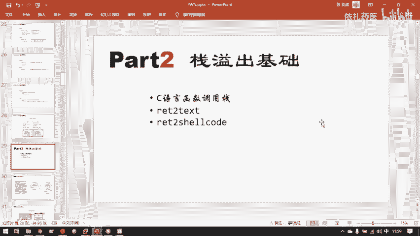

# CTF教程：CTF初学者必备的1000个练习题，每日一练，百日成神！（ctf-wbe／ctf-pwn／ctf-misn／ctf-逆向） - P32：x86&amd64汇编简述 - 白帽子讲安全 - BV1dp4y1j7aN

啊，还差一点，马上基础部分就要讲完了。这是基础部分的最后一点。嗯，这是我们在分析时候的。最常用的一些汇编指令。主要是这些大家后边指定这也是算一个。就是不应该我们此时花太多时间的这应该大家下去补齐了。

但是我们把最重要的几个汇编指令讲一下，大家最好是把这几个汇编指令都查一下他们是怎样工作的。最成功的目。moode指令是应该是最长的一个指令了，它就是一个负值指令，就相当于C语言里的等号。

我C语言intC等于2，其实就是一个mo，然后2，然后传递到目标内存。这样一个。制定。这里要说一下，你可能在陌录指令你看到这样的，或者你在任何地方可以看到这样的方框。这样的中括号中括号相当于什么？

中号实际上和C言的这个取地址不是一样。你比说C延取的是浮音。SPR。那就是说我此时要用的并不是STR这个符号的值，而是我要的是这个STR的地址。

这个也一样。比如说我。

哦，说反了是是是是。

是这个符号。去去支付哈，就是把这个此时。括中号里面的值作为地址来解析，并且把这个地址对应的值给解析出来。对应的取缔值是下面这个值。呃，可以看到，这其实就是一个取地址指令，把s的地址传到保存的位置。

够舌炮。不事泡泡等一下马上会展开讲一下一节就可以开始讲战役初的相关知识了。不署破就是站仓库站的两个指，仓库站就这两个指。这两个指令就是直接操纵的ESP计存器。因为在参观下主要是两两个指令。

站这个数据结构大家不知道清不清楚，站是一种。后进先出的结构。为了防止有些同学还是不太了解这。还是说一下，我想大部分同学都知道站样的工作原因。嗯，站子结构是这样的。我此时我写了第一份数据。

第二份数据我保存在哪呢？我保存在这份数据之上，我再来一份数据，再保存这份数据之上。然后我要从我这个数据库中移出数据，那我首先移出的就是最后保存的这个。再移出就是又是第二后保存的这种。

然后总是后来的数据放在这个数据库最前端的位置。然后要从这个数据库中撤出数据的时候，总是把它最。前端的数据是撤走。就是占这样的一种数据结构，它的读和写总是发生在站点。我比如说我压战压榨一些数据。

我这儿压战一。压在一个C。压榨1个YY。那么我push。push指令p1234H就用这条指令吧。这条指令执行它会在站里发生什么呢？首先是哪个站，咱们了解一下。就是这个站，就是程序。

你说的之之前的函数站就是此时这个站step。虚拟地址空间里最高用户空间地址最高的那个位置那个站。这个是。也是这里的站，也就是我刚刚说的是保存了局部变量函是局部变量的这个站。马上这个站会有很大的篇幅来讲。

因为这个站一出示很多很多漏洞的一个应用的基础。也是目前就是适用范围最广的漏洞。好，那我执行一个push1234。来去。那么在刚刚我给你呈现了一个站里，我我还是按那个站的放法来放吧，因为。你可以发现。

刚刚哦对，这里还是提前把站讲一下，你可以发现所有的数据都是从地低地值往高地值增长，但站是相反的，站从高地值往低地址增长，为什么呢？因为他从低低这往高地者增长，他最开始并不需要他并不知道自己需要多少空间。

这hi往高，从低往高，站从高往低，他们俩就可以完全的把这中间的这一段空闲区域利用起来。如果站从中间的某个位置开始，从低往高增长，那hiip就有可能增长增长增长就碰到站了。

然后导致hiop够用也是有可能的。他设计成这样，他们向相同的方向增长，就能把中间这段白色区域很充分利用起来。这是他的设计书中，所以站的增长方向是相反的。但是从高地址往低地址增长。

就是占一个比较特殊的地方。这个等一下会在站的工作原理那详细的展开。好，我们接着来push这个1234。😊，此时站点已经放了这三个值，然后我执行一个push1234，那么就在站点。占点是最下面，为什么呢？

因为这是函数站函数站刚刚说的它的增长方向是反的，所以它的占比其实是最低地址的位置的占点。那么这里就多了121234。1234H那是24，那是16进去的值。好，这是我执行的push1234H的要结果。

topopEIX。那我直接演示这个泡ES起到成么效果吧。EX是CPU里的一个计算器。之星popEX想必大家都猜得了。首先把占里的这个隐层的1234给它删除掉。然后删除了，但是它的值我还要用保存在哪里呢？

保存在这个EX。这就执行了pEAX之后的效果。如果再执行一次PEX会怎样，那就再把栈最顶层的值删掉，然后在EAX里。保存刚刚弹出的字。就是这样一个过程。还有leave一套。这个大家可以先看一下。

那个是用来。那个是用来就是函数返回的时候会不会负战帧。这个就是因为刚刚也呈信了，这也可以提前讲一下。所谓的战。刚刚那整个战它其实是一个一个的战争构成的。每一个战争它保存了一整个函数的状态。

当然我push一次，我依然push的是一个数据，而不是一整个战争。push的单位是一个数据，push单位数据不是战争，这个一定要注意。比如说我在此时我子函数的战争里，我push了一个数据。

我就会在子函数的战争的底部再加上一段数据，我再push一个，它再加上一段数。他不是push一个战争，他是push一段数据。这点先强调一下，然后先把这两个删除，然后这是子函数的战争，这是负函数的战争。

我一个子函数返回的时候。我就会此函数的战争就会销毁，因为此函数已经调动结束了，它的函数状态就不需要了，所以最后销毁此函数的战争。那此时最后销毁这个战争执行的什么？就是leave。

就是说表示离开当前函数live就是离开的意思嘛。然后 return。就是把。刚刚子涵说复函数交界处。保存的有一个返馈地址，散入粘人校毁，然后把交接书保存的返馈地址。还给EIP或者RAIP。

然后IP刚刚也说过来干什么呢？就是表示当前函数的指向的。指向当前执行指令的地址，就相当于把站领保存的。负函数执行到哪儿？的地址还给RIP，然后重新回去执行方函数。大家可以看一下这里。

就比如刚刚这个利用例的C源源代码。我是不是在内函数？第一行就调了sab函数，但是我sm函数执行完了，是不是还要返回到被函数？所以sam函数的下一行这个。voPTR赋值的这一行。

它就是在各子函数执行之后需要返回的位置，我要给它保存下来之后，我再去执行这个sam函数。所以在sam函数执行之前，创建s函数战争之前。他们先把这行的地址保存下来。然后在sam函数执行完之后。

他再把保存在站里的这行的地址给它弹回去。然后魅函数可以所有魅函数可以在执行完sam之后接着执行下面这行就行了。return这个指令的作用就是这样。嗯，这里要说一点，其实有很多计算机它是有特殊功能。

它有特殊的工作约定的。比如IP上的约定，就是你不能直接去。在RAP上实现复值指令。因为就会导致程序的控制流可以被呃用户任意篡改，这里不能用木。

或者p泡这种微计存器赋值的指令直接操控RRP你只能通过一些已经规定好的。比如说returnreturn起的作用其实和写成泡泡IP这样指引，它们的作用其实是一模一样的。但是你就是不能写这一行，你只能写它。

因为这种无VRP直接传舱的。指令是被禁止RRP不能作为被操纵数。嗯，汇编还有最后一点。就是你可能会看到两种汇编格式，其实这无关紧张。就是因为AT这是美国的一个运营商，英特尔就是那个最大的芯片制造厂。

这毫无疑问。他们俩各自制定了一种汇编的写法。但所以大家看后边可能会看到两种。其实这两种其实区别不大，你学会一种，另一种基本就无视自通了。他们最主要的区别是什么呢？就是英特尔的它的被操作数在。

后操作数在前，然后ATT正好是反的。比如说你看这第一个目。他的意思是把EAX计算器负值为8。然后这行的意思也是把EX计算器复制为8。但你看到EX和8的位置正好是反的。他们所有指令都是这样，反过来。

剩下的区别不大，还有这个他们的取值服不一样。呃，英特尔的刚刚讲过了是中国好APT的它是小国好。剩下的基本都很相似，你可以对比一下这下面的一个样例。嗯，然后下午咱们就可以开始讲战役初基础了。

上午的课现在12点。嗯，那我们上午就到这里结束吧。

