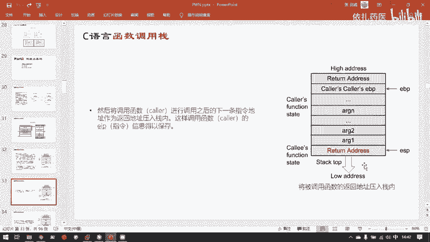
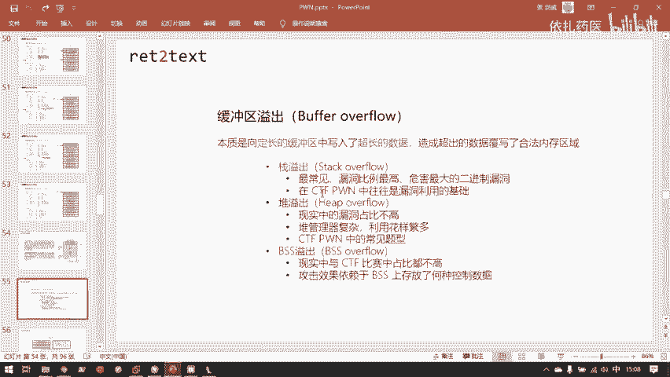

# CTF教程：CTF初学者必备的1000个练习题，每日一练，百日成神！（ctf-wbe／ctf-pwn／ctf-misn／ctf-逆向） - P33：C语言函数调用栈 - 白帽子讲安全 - BV1dp4y1j7aN

估计不来的也不知道会不会来了，那直接开始。上午是讲完了二进制相关的基础知识。然后下午我们就来了解。胖这个领域中的第一个最经典也是最常见的logo是战役出。嗯，当然在讲站役出具体漏洞之前。

还是有大量的基础知识需要补足。尤其是站它本身的工作原理。这个工作原理必须在心里已经滚瓜烂熟了，才能很容易的理解这役出它是怎样的一个过程。嗯，上午已经说过了。

函数调用站简单的带着讲了一下函数调用站的具体功能。首先，函数调用站它是在哪个位置呢？它在虚拟内存的用户空间的最高地址。这个上午也给大家看过了，大家可以翻到前面的PPT可以看到。

然后他是从高地址向低地址增长，这个与。其其他程序虚拟。内存空间中的其他区域是不同的。它的作用是用来保存函数运行时的状态信息。主要是包含了函数的参数，还有局物变量。然后呢，也是上午在。

以画图的形式给大家呈现过了。战争是怎样的一个单位？一个战争保存了是一个函数的。状态信息，然后复函数每调用一个子函数，就会在成函数调用站中新增一个战争。然后战争的战绩是用。

EBP或者是RBP计算器保存下来的。然后站点是ESP或者RSP保存下来的，具体是ESP还是RSP是一还是R打头。这个计算器是要看你的操作系统是32位还是64位。嗯，是CPU是32位还是64位？

32位的CPU32位的叉86的CPU是ESP和然后64位叉8664的CPU是RSP。这里是战争具体结构的详细。带了。嗯，大家可以看到，这是上午讲过的。程序的虚拟内存结构。

然后这呢就是在这个位置是用户空间的最高地址。这是整体的战的结构。在EBP与ESP之间，这样就是一个战争。大家目前可以先关注一下这几个比较重要的区域。一是你可以看到负函数的这此时是当前函数的战争。

那么它的高地址仅邻它的高地处处就是它的负函数的战争，对吧？复函数的战争与当前战的战争紧邻的地方有两个十分重要的控制信息，一个是return address，就是返回地址。

一个是t frame point，这个是上一个战争的站底。的值，也就是上一个战争，它的EBP寄存器的值。上一个战争最开始BP计算器。他在没有调用这个子函数之前，EBP4N器指向的当然是上一个战争的站地。

我假设是这个位置。然后ESP自然也大概在这个位置。然后掉二了子函数之后，EBP就指向了新的战争的战地。所以到这个位置了。那么这等一下就是当前子函数返回之后，我们是要恢复上一个战争的。信息的。

所以那么EBP这个占底指针自然也要被恢复，那怎么恢复呢？那他刚刚指针指在这里的位置的时候。这个指针的指保存在哪里呢？就是这里step point。

它会在当前战争紧邻的上一个字长记录负函数的战争占比指针的值，方便等一下恢复负函数的占体指针。然后。这个这个并这个并不是很重要，这个也是要看具体的程序实现，是子函数会不会保存它的自算器。

然后再者就是局部变量，之前也说过，在那个图里展示过局部变量保存在哪里？局部变量就是保存在对应的函数的占。当前函数战争的局物变量区。其实我们发生战役出的位置也是正是这的，因为局部变量是受用户控制的。

我们可以往其中写入数据。如果写入的超长的话，就会覆盖到其他的控制信息。这里要关注一下。还有一个重要就是参数。这是这整个图是32位的。32位架构下的函数战争的结构。所以在32位传参的时候。子函数。

这也是子函数的战争嘛。你可以看到子函数所用到的参数。它实际上是保存在复函数的战争的末尾的。对，就是这样。子函数它所用的参数并不是保存在自己的战争里，而是复函保存在复函数战争的末尾。

这里的argument是子函数的argument，也就是子函数所要用到的行参。也就是上午讲到的这里的X和Y。嗯，这也有呈现，这个箭头可以表示。这是一个循环下去的一个过程。

负函数的最末尾一个字长保存了复函数自己的占点的值。所以这里指向了复函数的占比。那么这个负函数的负函数的复函数，它也同样的有这样的一个指指向指回去的过程。这个这个图可以复制拷贝。

然后一次一次的粘贴粘贴很多层。嗯，那就接下来开始详细的看一下函数调帧的工作过程。函数状态主要进涉及三个计存器，一是ESPEBP还有EIP啊，我们目前讲都是以叉86作为。

ne因为叉6的它的函数的调用站的工作原理是要比叉6简单那么一点。所以我们先要从简单的入手，所以这里都是一开头的32位宽度的计算器。ESP和EBP刚已经说过了，分别是站点和站点。

EIP就是当前函数执行的指令。在调用下一个函数的时候。它在复函数，也就是color函数，再调用子函数，也就是col函数的时候，它会先把子函数所需要的。参数。倒叙加入战中。你可以看到这右边这个图。

他在压站的时候，子函说的第一个参数是压在站顶的。然后此函数最一个最后一个函数反而是压在比较深的站的里面的地方。所以他是倒取加入。这点也要注意。这些细节其实到时候是直接和我们的漏洞应用相关的。然后在。

所有的参数。压入完毕之后，它就会压入不函数的返回值。

我们从这里开始，我们开始写一个函数来说明一下。

我们还是我们的test点C。嗯，我们就一个s函数。可以看到，此时ma函数和sam函数它的关系是什么呢？是ma函数调用了sam函数。那么媚函数就是s函数的负函数。三函数就是媚函数的子函数。

所以在ma函数调用sam函数的时候，看这张图。上面这张图呢。这这此时这蓝色的所有都是魅函数的，这是魅函数的战争。他在调用sam函数的时候，他会先把sm的。呃，参数压榨，他就会把一和2利续。

压入他当前自己的战争中，这一点要注意。刚刚已经说了，是压入自己的战争。然后此后他会加入return dress，也就是。返回地址。对于我们此时写的这个程序返回地址是什么呢？就是reer0这条指令的地址。

他会在执行完sam函数之后，通过压入的这个返回地址。的值，然后等一下在sam函数执行完之后，它会直接回到sam函数的下条指令，也就是return的地方。压入了返回地址了，还要干什么呢？刚才已经说过了。

在sum函数调用完毕之后，那s那么sam函数的战争就没有用了。因为s函数已经完成它任务，那么们就要恢复me函数的战争。魅函数的战争恢复的时候，那我们就需要知道内函数战争相关信息。所以我们好。

我们回到最开始调用的时候，我们既然在sam函数返回的时候，需要恢复ma函数的相关信息。那我们在sam函数最初调用的时候，我们就不能把魅函数的战争信息给丢弃了。

所以我们必须在调用sam函数之前就把魅函数的。占比指针给你压进去。就是这里布ush了一个coousEBP。对于我们此时写的代码就是ma函数的EBP。现在先讲一遍。

大家可能就是第一遍无法把这整个过程记下来，没有关系。因为这个本身这个对于。啊，站函数调用站的工作原理，要让他在你大脑中形成一个很熟练，就能播放出来动画。这个可能就是需要时间的。

我们等一下会在下方以动画的形式会实际的展示一下。然后呢，压入了。压入了。主调函数，也就是负函数的EBP之后，我们就可以。抬高ESP其实是这里是ESP是减小，因为战士从高地值往低地值增长，它是个反的。

所以现在ESP减小一定的值，减小多少值呢？那就要在那要是编译器，它已经认出来了。你有多少局部变量需要多少空间？那么编译器在会会在把你的新语言代码编译成二进制程序的时候，然后把它需ESP需要留多少空间。

就已经写死在你的程序里了。这也是为什么。我们呃就是。动态申请内存一般不用占。大就是在这种情况下，都是编译的时候就会确定占空间的大小。其实但但并我就是并不是意思，就是站就不能动态申请内存了。

比如说有那个allog这个函数，它的确是可以从站中动态获取内存的。但我们一般不是这样做，因为站其实一个非常小的区域。堆这样一个区域，它的基本单位就是GB。嗯，就是这个图，你可以看到。

虽然这里hiap和t画的他们俩大小差不多。其实hiap的大小是远远超过tack。Stag在叉6下linux默认的大小是8兆，仅仅8兆8兆比起这4GB的空间实在是小的可怜。但是hiap的话。

你可以从中申请一两个G的空间，那是没有问题。在局部变量压入了被角函数，也就是子函数的战争之后。那么载入就可以。通过这些那么子函数的战争就已经形成完毕了，那就可以。通过这些局物变量。

然后完成它所实现的一些功能。此时，EBP指向的是子函数的占点。ESP指向的是子函数的占点。此时，战这个结构的顶部的战争，就是这个区域，也就是子然数的战争。所以说占这一个内存区域。

它的站顶永远是当前正在执行的指命所属的函数对应的战争。嗯。嗯，在我们的子函数执行完毕之后。程序就该返回了。返回的第一步呢就是先把子函数刚刚在这个位置。开辟的用来存放局部变量的空间，性感释放掉。

但是这里的释放并不需要把这一块空间，这个local variables这块空间给它清零。我们只需要把ESP。增大它原来减小的值把ESP重新推到EBP这里，就相当于这部分空间就不再使用了。

这个其实和windows或者各种各样仓系统删除文件啊之类的都是类似的思想。你要。丢弃某一块数据不用，你并不需要把这块数据去抹除，你只需要把它标记成它不是我所使用的范围就可以了。比如我在windows。

我删除1个8GB大小的文件，就一个8GB大小的文件。你可以发现一瞬间就能删除完毕。但是如果删除了800个1KB的文件，你会发现反而删了很久很久，为什么呢？因为它删除这个8GB大小的文件。

它并不用把这8GB全部给它数据给它擦除掉。它只用在它的文件系统里面的某个结构，控制这个文件的结构里给这个文件标记一下，说此此处的8GB的空间是可以被后来的数据复写的。就是说这8GB空间大家可以随便用。

那么这个文件就相当于被删除了。他并不需要把这8GB全部抹除。所以这也是其实是磁盘数据恢复的一个原理。我把一个文件删除了，并且我在回收站已就把它清空了。但是只要我没有网我删除那个文件。

最开始所占用的磁盘的。地址你写入新的数据，那么这个文件在磁盘上，它只是被标记了。他说他占有的空间可以被新来的数据复写掉。如果你没有新来的数据复写它的话，那么你就可以用一些特殊的呃数据恢复工具。

然后把这个你已经删掉的文件给它找回来。因为它那块空间还是原封不动的，它的数据还原封不动的在你磁盘放。嗯，这里也是一样的思想。我们并不需要去清除这块localable的值。我们只需要把EVP给它拉的。

让它的范围不包括在它所占用的内存区域内就行。因为我们的站站顶，我们是哪一块内存区域属于站，总是由这两个指针划分的，是仅仅由他们俩唯一确定的。就是ESP和EBP这两个指针中间就是当前站站顶的战争。然后呢。

在s函数对应我们这写的sam函数。执行完之后，就会首先你可以看到ESP首先会抬高自己，然后把避开这一块呃局部变量所用到的空间。它来到了EBP上。EBP这里，然后呢再把EBP。这里保存的，你看这是内存。

这是内存保存的主调函数的EBP，也就是我们的魅函数的EBP的值弹出到EBP寄存器。然后EBP的计存器的值就从它本来计存器里保存的值是指向这个地址的值。但是他此时弹经过弹出之后。

它保存的值变成了这个地址里保存的值。你要弄清楚这个过程，这里是内存里的值。这个EBP此时个计算器，计算器它保存了一个值。它保存的值本来是指向了这个它保存的值本来是这个位置的地址，但是经过弹出之后。

它的值变成了这个地址，里保存的值。所以EBP就回到了原来内函数的占点的位置。看下一张BPP对它就弹回去了。然后ESP呢就因为刚刚po了，所以ESP就自动减去一个字长。嗯，这里说一下自长的定义。啊。

说简单点，就是32位机自成就是321Q，64位机自成就是641特就这样。呃，你可以看到p和push，它操作数据的单位都是一个字成。如果是64维的系统，那么po一下，它又一下弹出八字节的数据。

就是64比特的数据。如果是32位的系统，他破一下，那就是一下弹出四字节的数据，那就是32匹特的数据。p和push的操作单位都是一个自长，这里要注意。那么刚刚已经po了一次，刚刚那次po是给EBP付了值。

那么接下来ESP就自动加一个磁长，他来到了最开始保存的uterdress这个地方。然后呢，会通过return指令将return address。弹出保存到。EAP这个指令计存器。叫程序计数器里。然后呢。

因为这个returndress最开始刚刚已经说过了，就是returning的地址，所以程序就会在执行完sam之后，回到被函数的下一行代码处就是returning。然后接着执行。这就是负函数调用子函数。

然后子函数执行完毕，再回到复函数的过程。嗯，刚刚这是用这些图展示了一次，接下来用一一幅更形象的更形象的方式来展现一下。嗯，这里是直接是用C语言代码写成了一个coer和ca令，也就是主要函数和被调函数。

嗯，C源代码。之前的PPT展示过了，它编译成对应的会编代码。好，我们现在假设它就变译成这个样子。嗯，这里刚刚说这这也是之前提过的叉86是用站来传递参数的。并且我们目前研究的就是叉86的工作原理。

AMD64，它会将前四个前6个参数，它用计算器传。第七个以后的参数，它才会像叉86一样用站来传递。我们目前先研究这种比较简单的情况，也就是叉发6用站来传递参数。好，我们现在得到了这样一段汇编代码。

然后呢，对应的机械码此时被载入到了进程中，然后开始执行。他是怎样的呢？首先这是主要函数，这是被调函数。我们可以看到此时主调函数在这一行调用的被调函数。那么他过程就是这样的。首先呢。大家首先要记住这两点。

一个一个遵循C语言函数量规范的。函数它的开头一般都是push你pushEBP开头，为什么要pushEP刚刚已经解释过了，需要保存它复函数的。占底的状态。

然后它结束会使leave returnli就是恢复它复函数的占比。return就是返回到复函数的下调指令。OK现实接看一下。现在嗯我们随便拉一只小白鼠。程序来实验一下。在实验之前。

我们我们再用艾da打开一个艾反编译一个程序之前，我们需要看一下这个程序的相关信息。我先拖到。谢这点。不申请。好。好了。直接可以fi一下。这什么文件啊？它是1个3232位的ELELF文件。嗯。

所以我们在用艾打开一个二进制程序之前，我们需要先了解到3是32位还是64位。因为这个32位的艾da和这个64位的挨da，他们分别是用来处理这两种不同的架构。既然这个程序32位。

那我们就打开这个艾da就行，而不是那个艾64。这接够。然后呢，像。我们程序过进来。可以看到这里有大量的函数，但我们关心的是妹。呃，可以按F5版汇编一下。可以看到may函数。

这里调用了一个record函数。这就是一个复函数和子函数的关系。并且这个recod是我们自定义的函数。我们可以来查看一下recoll函数。我们回到它的汇编代码。可以看到他这里这是变译器。

当时因为一些变译选项的原因。他在push和pushush之前，他做了一些其他的操作。但是不管怎么样，一个函数，他在进入他在进入一个新的函数之前，他一定会有这两行代码。进入的时候会有这两行代码。

然后离开的时候一定会有这两行代码。这里用的不是li，也是因为编译器它自己的编译选项。嗯，那这题就不太合适了，找一个。比较老实的题目。就是来看最常规的情。对，这就是最常规的情况。

函数进入的时候会有这样两个。pushEBP moveEBPESP然后离开的时候我们是live return，这是最标准的子函数的调流。好，大家先记住这四行汇编代码。

然后咱们具体来看一下这四行汇编代码是怎么工作的。首先嗯主调函数进入了他自己，他会先把。他它的负函数主调函数也是由另一个函数来调用嘛，所以他会把调用自己的函数的APPP先给它压进去。

然后右边这个视图就是占的视图。大家可以仔细观察这右边是怎样的运作。我们来开全屏看。然后下一条指令moveESPEBP也就是把ESP抬高到和EBP相同的位置。为什么呢？

因为ESPEBP此时已经到了新的战争的位置，所以立马把ESP移过来。并且好下条指令就开始为新的战新的战争开辟局部变量的空间。这里是sab了，就是ESP减10。为什么是减？已经刚才解释过两遍了。

因为站是反向增长。它是减十来开辟呃0叉10的空间。这应该减16。因为这是16进制数，然后呢，它的下一行代码它就开始调用子函数了，也就是被角函数，也就是这里的ca例。那么因为这是叉6。差不6情况下。所以。

他会在站中来保存。被调函数所要用到的参数，所以他会先把被调函数所用到的三个参数123。反向压入站领。为什么是反向？我们再回头看看最开始。这里是第一个参数，是一，第二个参数2，第三个参数是3。

但你看这里123它的顺序。3、最先压入。2第二个压入，一反而是最后压入的，这是反向压入参数。这个细节要记住，因为之后利用都是会严格的遵循这些规则的。然后呢，他的下条指令就去调用。要用被角函数了。

可以看到co这条指令，仔细观察一下co这条指令。扣它不等于叫。降是一个跳转值。比如说ju从这个11E这个地址直接降幅到29。那么它就是直接把EIP移到29这里就没有了。但是扣不一样。

你可以看到仔细观察这里调入了扣之后，站里会有什么变化。调入了扣，它不仅将EIP移到了它的目标代码的位置，它还将站中自动的就把。他的下一条地址保存了下来。此时，他这个returndress其实就是这个。

地址为23的地方。co这条指令，所以说k这条指令是自带保存返回地址这个操作。好，克制之后，那我们就进入了被调函数。被调函数的第一行也是跟刚刚一样。首先一个push。先把主调函数。

也就是它的负函数的战争给保存下来再说。好，你仔细观察右边这个地方的EBP和ESP的变化。破设之后。此时，负函数的EBP就重新增加到站点了。然后他下一条就进行了move yes。ESPEBP。

就是把ESP的值付给EBP。然然后让EBP抬高到新的战争的战。第。然后呢，接着就开始做实际的操作。这一块此时加粗的代码全都是在对它的三个参数传进来的三个参数，123做算术运算。然后运算完毕之后。呃。

这里还有一个一点，你可以发现最后的运算结果。如果你仔细读一下这三段这几段代码操作的话，你可以发现最后的运算结果是保存在EX计算器里。这也是上午说到的AX自算器它默认的情况下，它约定速成的是用来保存的。

函数的返馈值。然后在完成了嗯自己的计算之后，就要回到主站函数。主要函数就会。这里是popEP。木。这你这个PPT我想想。这里会不会写有点问题？哦，这里是没问题的。因为ESP并没有开辟一个局部变量的空间。

popEBP就是因为此时ESP已经在为什么不是leaveleave其实比他这一条popEBP多了一个把ESP移到EBP的位置。那个就是。木。呃，EBPESP之后再poEBP。

然后这里只有个poopEBP为什么呢？你看主流函数，其实这里还是类，就是因为我的子函数，它们并没有任何的局部变量。所以EBP此时在调用它的返回的时候，EBP已经在ESP相同的位置了，它已经指到这里了。

可以看到吗？所以这里直接破个APP就行。pop指令总是把Pop这条指令，总是把当前ESP指向的位置。对应的一个字长的数据弹入到目标位置。所以poopEBP就会把ESPESP此时指向。就是复函数的EBP。

保存在内存中的这一个字长化。所以poEBP之后就会ESP向上抬一个字长，并且把原来ESP指向的这个位置的值弹入EBP存存器中。所以EBP的计算器就变成了这里保存的复函数的原来的EBP的值。

所以EP就拉上面去了。然后ESP就自动的加上了一个字产，就是抬高一个自产。所以站就自动的缩小资场，然后return。return这个指令就是把return像之前也说过了，相当于pEIP。

就是在ESP抬高一个字长，并且把原他原来指向的那个字长的值弹的值弹入到EIP进行器。所以你可以看到。执行reer之后ESP抬高一位，并且EIP它回到了主调函数的下一行指令轴。就是这里23。然后呢。

那么主调函数此时它的任务也完成了。所以就是。也是清空它的局部变呃，清空它的局部变量，还有它的被调函数所用到的相关参数。所以。也是使用ad这条指令来清空数据。然后这一块就都变成了used。

最后呢再将它的返回值保存到EX里。你可以看到最后的操作数也是EAXEX保存了color函数，最后的返回值。然后呢这里呢因为ESP并不你看此时返回的时候，在执行类指的时候ESP并不在EBP这里。

所以它需要执行类ve类ve return就是moESPEBP然后pEBP就是比这个必须要多了一个把ESP移到EBP的位置。因为此时他不在他的位置，所以这里用的是利润。然而刚刚那个他已经在EBP的位置。

所以他用的是poopEBP。所以这里是内容。然后EVPESP到了EBP的位置，然后呢。你可以也可以看到这里写出来了，一类ve相等校于这样一个值。然后return就在和刚刚一样的过程。

只不过此时是从负函数返回到复函数的复函数，也就是爷爷函数。嗯，这就是整个函数调二站的工作流程。这个过程呃刚刚是带着大家看了一遍，但是就是如果需要会做题的话，这个过程要非常熟练。这个已经强调很多遍了。

大家可以反复的在课下，就是这次讲完之后，然后对着把这个过程多看几遍。然后哪里不懂就回到这里，然后划一下。

