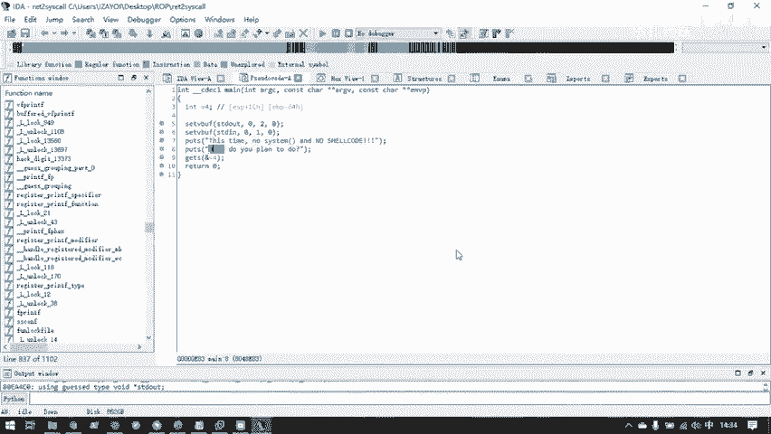
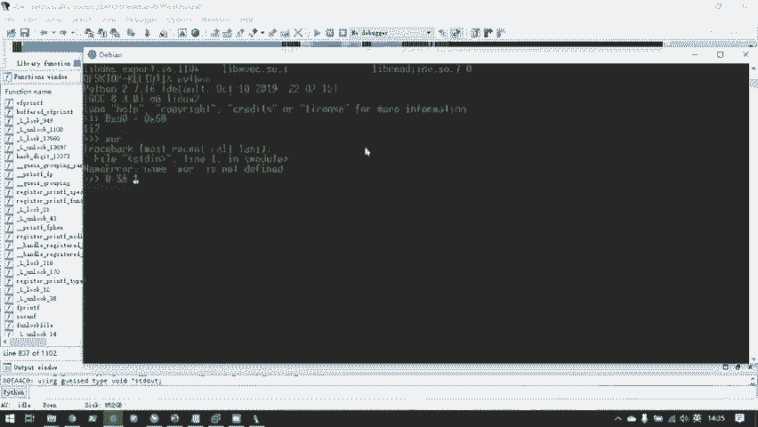
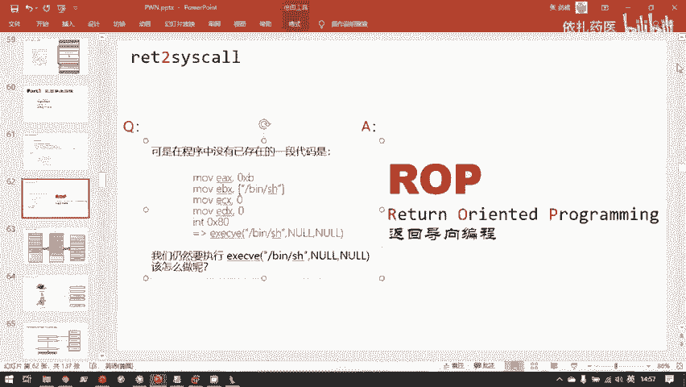
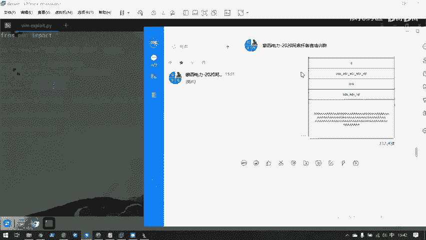
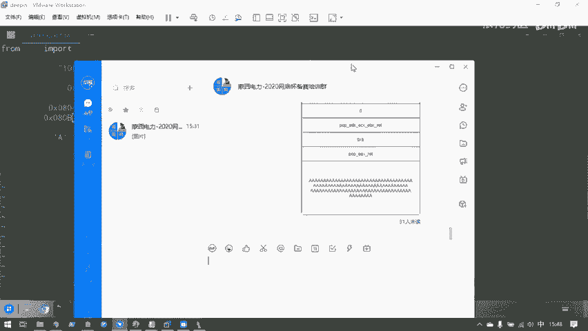
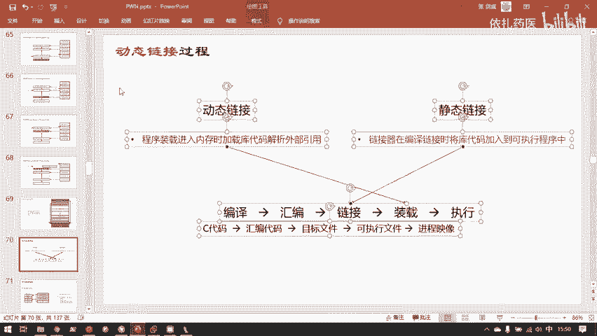
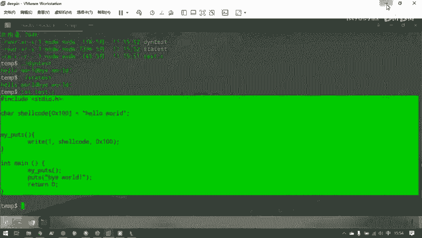
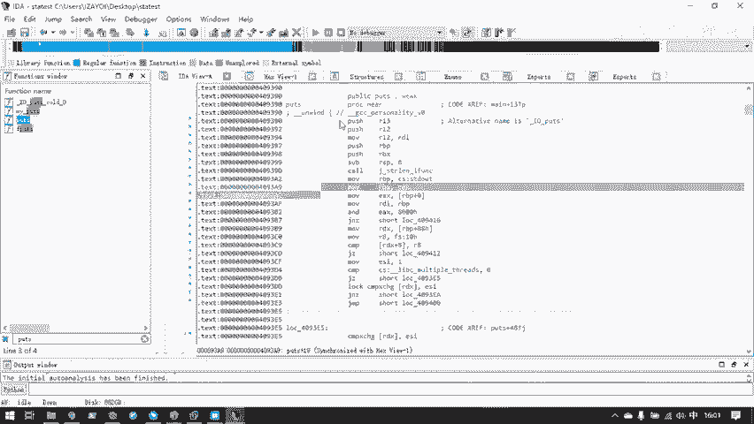

# CTF教程：CTF初学者必备的1000个练习题，每日一练，百日成神！（ctf-wbe／ctf-pwn／ctf-misn／ctf-逆向） - P36：ret2syscall - 白帽子讲安全 - BV1dp4y1j7aN

然后呢，reta to share code过了，我们就可以来到第三部分。返回导向编程。这部分是战役初的第一步境阶。因为此前的战役出都是一步到位，直接返回到了我们想要的目标地址。呃，但从这部分开始。

战一出它的威力远远不仅仅是这样，我们既然能溢出控制一次返回地址，我们就能相当于控制程序的执行流。但是控制程序执行流的话，那就当然如果没有录一次到位的能控制达到能调用sstem变S示的地方。

我们需要需要一个叫ro返回导向编程这样一个工具，这样攻击手法来。在程序的各种代码片段之前来回跳转，直到我们程序的环境变成了我们想要的样子。可以说返回导向变成就是返回导向变成就是一个多次篡改。

EIP或者是RIP成为我们想要地址的一个过程。首先最简单的返回导向编程。我们第一个会讲到的是return to system call。是先反回到系统调用。然后呢，之后就是比较复杂的一个过程。

我们需要了解到一个程序是怎样进行一个动态连接的。动态连接其实在前面讲基础的时候，已经多次提到了，我们在这里就会开始详细展开，并且研究怎样攻击动态连接的程序。然后呢，最经典的动态连接的。

动态连接能被攻击的手法就是return to leave C，并且return to leave C也是。ro提目里最为常见的一种。提醒。就是说到ro，其实你遇到最多的就是这一项。

然后我们会拓然讲一下其他的肉。首先什么是系统调用？我们要return to system call，也就是返回到系统调用。那我们自然首先要知道什么是系统调用。嗯，也是昨天在基础知识部分讲过。

用户是你原则上是不应该直接能接触到硬件的。所有的硬件都应该被操作系统管理起来。然后让这些硬件以操作系统规定的方式提供一个接口，给用户操控。所以呢系统调用就可以说是操作系统提供给用户操作硬件的接口。

它本质上是一些编程接口。哦。这个接口可以被链接库封装成一个函数这样的一个形式。也可以。如果你是汇编程序员的话，你可以直接用。int80，还有叉6下的int80。

还有MD64下的stem core这样的直接二进制指令进行系统调用。系统调用呢就直接它是本质上系统调用的实现是操作系统内核里的一个代码。是内核空间，这里的for kernel里面保存的一段代码。然后呢。

你需要因为你编程你自己编写的程序。内容在。text贝taBSS这里。然后你自己编写的程序载入内存之后，操系里就会为你创建sackhi share library这些段。但是呢这全部都是用户态的。代码。

真正的能直接接触硬件的代码都在最嗯地址空间的最高地址处的 kernelel空间里。那么我们要操控硬件，比如说我此时向屏幕上写出输出一段。字符串就简单那个print hello word。

这个过程难道就是用户代码就能实现吗？其实并不pre f。是。呃，动态连接库给用户包装好的一个函数。我们调用的时候只用一行调用这个函数，就可以向我们屏幕打印出一行字符串。

但是实际上它的背后实现过程是很复杂的。它归根结底，print F最后还是向操作系统的代码申请了一次right这样一个系统调用。然后呢，rightite会向标准输出。

你标准输出其实你目前默就可以默认理解为就是你的屏幕，然后像标准输出。输出你传进去的字符串。所以最后打印到你屏幕上的这段字符串，其实是cardle。我框才来的kil空间里面的rightite。

这个系统调用对应的sstem right这样一个类核函数来完成的工作。嗯，那最简单的例子就是我比如说我此时在函数，我自己的C语言在哪里？我写了一个。My fruit。这样一个函数。就是。Right。

标准输出。嗯。就用这里的。我等一下把12 code里面写了点内容给你插。我此时往需要code这里填写一下内容。让后我用媚函数去调用它。定一下。可以看到他输出还有 word。

那么我们这里的过程写代码的时候很简单，对吧？写语言代码。需要扣的这个缓中去保存了个字符串，然后我用rightite这样一个函数，将这个字符串写到屏幕上就可以了。他实际上。这样一个代码。

它在操作系统层面是怎样执行的呢？my codes调用了right函数。d函数。他本质上是调用了一个。这里的我写的这一行right的函数，它和。操作系统的汇编的系统调用的汇编接口其实是类似的。

但这个r其实是动态联接库里帮你包装好的rap。我们先来首先要来讲一下r这样的一个系统调用，它是具体。工作。首先对于叉86。它会像EAX传入一个系统标用号。right系统交换号还是0叉4。举个例子。

然后呢。EXEBX。看第一个参数。ECS传第二个参数EDS传第三个参数，用什么传的呢？用move这个值。把对应的参数传进去，然后呢，EX系统调用号加上系统调用号对应的。

函数所需要的三个参数全部放进去正确值之后，它会执行。办理。电0 charge办。然后就成功的。调用了这一个系统调用。那么我此时在代码里写的这个。right它实际上就是实现了刚刚的这一些汇编代码的功能。

但只不过这个rightite，我依然是用C语言写的，为什么呢？就是因为那些汇编代码被动态连接库帮忙给我包装了起来。我在C语言里写一行right，然后动态的内le自动的就会把这行right。

他就知道他是要转化成这样的汇编代码，然后执行这样的功能就可以。刚刚一直说到动态云计库，动态云计库，包括我们要讲到的ro。都是离不开动态连接库这样一个东西的。那么动态连接库就是一些什么东西呢？

动态连接的概念等一下再讲。我们先来看一下动态连接库的真面。我先来到计算机的根目。我们先回到刚刚的目里。有一个命名是LDD，它可以查看一个可实现程序所用到的所有动态链面给回撤一下。

我们可以看到我们刚刚编译出的A点out所用到的有这样几个文件。libC点4角6，还有1个LD点4点2。这个我们不关心这个这个是高级胖会用到的一种return toVVDSO。然后我们需要了解的相关知识。

这次培训不会讲到，这个也不关心，这个是动态内库的装载器，它里面是不会有漏洞的，它只是负责把。我们所需要的这些动态连接库文件全部装载到进程序拟内存空间中，装载到哪呢？

就这个share library这个位置。他是做这个。最后一个这个动态连接库文件，它把它们三个都一起装在了这里。这是他干的位置，但并且他我们漏洞不会在他这里发生。我们要关注的什么呢？

就是这个类似点so点6。他呢就是GDBCC语言标准动态连接库的。文件。对应的软链接。对它并不是一个实际的。它并不是一个实际的实现。为什么这里需要一个软链接呢？首先讲一下软硬接是什么。

软件链接就是相当于快捷方式。你看比如说我此时把这个TITTXT创建一个快计方式。我TST文件实际是存放在我计算机的桌面上的。但是我此时把这个框建方式移动到任何位置。我移动艾da pro的目录里。

我双击它，我也能打开这个文件。这个文件的本体存放在这里。但是我快捷方式我只要指向它的实际地址，我快捷方式已经被动到任何地方，我都能正确的打开这个文件。同样的。程序员在编写一个程序。

编译器在链接一个程序的时候。呃，lininux它本身也是一个软件嘛，它也是有版本更新的，它每一次版本更新，它会都会修复一些漏洞，然后更新一些新特性。所以呢实际的动态连接库的文件，它内容是不断在变化。

迭代更新的。但是不断的变化迭代更新，甚至他会改名，有时候会改名字这样。那么编译器怎么办呢？编译器它会首先在编译一个程序的时候，它会把需要哪些动态连接库都写在这个程序。可是他需要的这些动态连接库。

与他程序无关的时候，这些动态接库自己本身都在不断的更新。那么比如说今天它是libbC的版本是2。23，明天就变成2。24了。那我在编译的时候，2。24还出都没有出，那我能把2。24直接写死在我程序里吗。

不能，所以我只能写这个软件接的名字。libbC点4点6，然后任何时候都去调用这个软链接。至于这个软链接指向的是2。23和2。24，那都没有关系了，那就是操作系统自己更新的。

它只用在更新libb C版本之后，把这个软件接的信息。如果动田机构的信息有变化，他就把软链接的信息一起更新就可以了。那我们现在可以看一下这个东西在哪。来根目里。6。ladice跟目录下有一个叫live。

也就是library这样一个目录。里面存放了操作系统所需要的各种各样的链接库文件。但我们。目前。叫文件夹W647LuxGN。这就是。叉8664。libbC文件所在的目的。

我们fill一下这里面的libC点色点6。可以看到它是一个符号链接，它链接到是lib别libbC2。28。就是我此时给你的底拼这个操作系统，它的默认版本是libbC2。82。28。

但实际上现在最新的libbC已经是2。30了。这也就是为什么。我需要这样一个软件接做中间层，我可能我d拼，我过两天更新一下，它就变成2。29。但是我以前程序里写死的所需要链接库都是2了了8。

那我不能再把我原来的所有的二进制程序都跟着一起改。虽然那程序都只用写这个软件接的名字，就个软件接的名字不会变的。至于它指向哪里，那就是操作系统，我们自己跟着更新就可以了。那我们就去找一下。嗯。

我们执行一下这个软件接。执行这个软链接和执行这个。呃，他指向的。动态连接库其实是同一个效果，为什么呢？我此时给挨的。创建一个课捷方式。那我此时把这个快捷方式拖到桌面。

我双击这个快捷方式是不是也是同样的打跑来打开了这个挨打这个应用程序这个300。3877KB的这个应用程序。所以执行会计方式和执行本体其实一样的。其实这里也说到一点，你桌面上的其实这些都不是应用权序本体。

他们全部都是会计方式。比如说这个钉钉，你可以看它的属性，它本身你就是一个科技方式。哎，它这里是直接是。对它是指向了这个位置的钉钉talk launcher EXE这样一个可实行程序。

这个可实行程序的实际位置在C盘的program file这样一个目录下。但是我的这个课件方式放到桌面就行。长按到了。所以linux下的simble link，你就可以理解为windows下的快捷方式。

我们执行一下他的，就相当于执行了我们动态连接库。可以看到执行动态连接库，它会输出动态连接库的相关信息。所以动态连接库它本身也是一个可执行文件，它也有可行执行的入口。你可以把它当一个可执行文件直接执行。

我们可饭养。看一下他相关信息。端连接库是一个怎样的文件呢？它是也是1个64位的ERF。但是它被编译成了地址无关代码。地址无关代码其实它的本意是用来编写动态连接库的。但是它的相当于它的一个复产物。

它可以作为程序保护的一种措施，使得刚刚已经说过很多次的ERF文件的载入位置不断的变化。所以呢所谓的动态连接库其实就是存放在我们计算机的。PWD1下这个目录下的一个可执性文件而已。

然后这个可执性文件里面已经包含了大量的已经。G恩协会的那些老爷子帮我们写好的。C语言的裤带嘛，我们不用重新实现一遍。我们现在其实可以看一下它的具体内容。动连接库也是这点也是日后需要不断接触的。

我们需要对他非常熟悉的。一个内容。我把它拷贝到桌面。我们来先用艾da反编一下，它，看看你们具体内容。这个动态连接过去就是做什么的呢？电脑不较卡，稍等。卡住了。VM死掉了，我这里需要重新打开。

居然是不能拷贝到45G的。嗯。那我们就不用VMware了，这个VMware toolss还看来还有没有安装好，我只能单向的将windows的为文件拖向虚拟机，但不能像将虚拟机文件拖向windows。

还有一个办法，我们可以直接用我们的。WSL里的内容，我们同样的来到WSL的。内部所在目录。然后我们先看一下我们它的类C版本。也是那个C2。28。那我么们就可以直接。这有一点比较方便。

搭配SCL有一点比较方便，就是它可以直接与宿主。宿主机windows的文件系统是互通的，我可以直接把这里的libb C2。28。拷贝的哦。加木乳。单幕的我创建了一个指向windows桌面的一个科技方式。

然后就可以很方便得到这个类C文件。那文件我们此时用艾。反辨一下，看它里面究竟是什么内容。这里是分析进度比较大。在没有分析好之前。嗯，最好不要操作，因为你在没有分析好之前，操作可可能会得出不正确的结果。

此时你操纵安大也会警告。可以看到这里还在动。我们先等他分析一下，因为那个C这个文件本身是比较大的，它包含了C语言所要用到的大量扩展数。呃，我们看lib C主要是关心这边的function式窗口。

这里可以快速的看一下。比如说printF，我们C语言编程的第一步，col word写下的第一个库函数就叫pre f回说一下。我们就可以在libbC中找到preF。那么实际上这里就是什么呢？

这里就是我们在。自己编写代码的时候。我们很方便的。写下来行分。但是我们并没有实际的去实现这个per。proF实际上就是在类bC文件的此时反编译的这个位置实现了。然后在我们实际要用调动proF的时候。

lab C这个文件就载入。我们程序虚拟进程空间的这个位置，然后我们执行tex，然后调用pro F的时候，我们就会只程序。执行流的指针就会跳转到shalllib里面的lib C里的preF函数的地址。

我们可以看一下它实际实现。iphone51下。proF它的实际实现就长这样，它实际上还是调用了一些更更底层的函数。然后这样的一层一层的套下去，最后是调用了一个系统调用right。

然后将数据写出到你的电脑屏幕上。proF调用了这样一个函数，可以看到它的实现实际上是非常非常复杂的，有几千行的实现，并且这个函数还不是最低。这些函数的实现都不是需要我们实现的。当然，除了playF。

我们还关心一下，我们更也是一个常打交道的Cor函数。它也是实现在li C里，包括我们接下来要讲到的ro，有一个很常见的目的，或者说ret live C的根本目的就是要。将我们的程序直行流从t。

然后跳转到share libraryr里面存放的live C里面的。sst函数这里栏st函ss函数在那个s哪个位置呢？ts你可以直接双击它，看到它实际位置，然后你可以反编译，它，看到它实际实现。

这就是我们retturn live的目标。我们要返回到这个函数的地方来。所以呢。整体的我此时在这里所写的这个myput，它调用的。my它的结果就是像屏幕输出一行hello world。

但它对于操作系统来说，它是这样的。my po调用了刚刚所看到类 city里的right这个函数，然后rightite函数包含包含了一一些汇编代码。它把EXEDXEXEDX置置为了正确的值。

然后执行了in80这样一个汇编指令，然后这一行这一系列汇编指令执行完之后就是成功的进入了在内核里的sstem right这个函数的实现。

然后sstem right这个内核函数才是最后实际的完成向你的屏幕上输出一行hello world的作用。这才是my po这样一个简简单的函数，最后输出一个字符串的整体过程。那么我们。呃，说到系统调用。

我们刚刚是讲了一个一下rightite的系统调用。这的确rightite它的系统调用号是4。当然同样的还有一个系统调用，它的系统编号是11，就exelexel其实是并然就是sstem。

刚刚我们在艾da里看到sstem systemem这个函数所包装的一个系统调用。它也是一个它是这样一个系统调用，系统wiI号，系统调用号是11传进来三个参数。后面两个参数。

如果我们仅仅是要调用BSH的话，后面两个参数就是零就可以了。然后这样一个系统调用它的作用就是。在执行。字符第一个参数对应的字符串里的命密。这样一系统调用的效果和我们在。笑亮直接。

输入这个命令是一样的效果，也和我们的。BSH也是一模一样。为什么呢？其实CBSH就是本身上就是对这个系统调用的一个包装。就像刚刚的。

动呃动态连接库里的rightite函数是对right这个系统调用的一个包装一样。呃，然后这里继续展开讲一下。叉86下的系统调用的过程。系统调用的本质上只是一段指令而已。就是这段汇编指令。是动态联系库。

帮我们包装好了，成为。一个函数的姿态呈现给我们的。就比如说。为这些啊把EX到EDX附上rightite对应的系统调用的值是由right这个包装的函数像实现的一样，exive也一样。

我们要完成exccese这个系统调用，实际上就是这道后编代码就直接等同于这个系统调用。我们首先要为EX传入。系统调用号在叉86下，你要执行一个系统调用。EAEX永远保存的是系统交用号。

然后往后的EBXECXEDS就。保存这个系统调用对应的参数即可。然后当参数全部存放完毕，EAX也存放了正确的系统标用号之后，我们就可以用in80这样一个指令。来进行。这样一些系统调用的执行。

int这样一个汇编指令，它本质上是一个它的完完整称呼是interrupt，它不是interger。interger是我们写的in平常资源编程写的int是interger就是。整数的缩写。

但是这里的interinter它本身是一个中断叉6是用中断来执行系统调用的。然后中段对应的也有一一系列的中断号，其中中断号。80叉80这个中断号就代表系统调用。然后这个中断号对应的有一个系统调用号。

我进入了中您叉80这个中断号之后，就代表我进入了系统调用，然后再去读一读取这个系统调用对应的。系统调用号。就是此时11这个系统调用号就是inc对应的系统调用号。

然后我就知道我要是要执行inive这样一个启目调用，然后传进去相对应的参数就可以完成启目调用的执行。那么现在问题来了。这样的一个系统调用固然是好啊，我们只用简简单单的这样的几行后编代码。

我们就可以完成一次。效力获取BSH。的效果。仅仅这几行会编代码就够了。但是。虽然这简单的几行后面代码就能达到我们的攻击目的。但是现在问题是我们程序里并没有这样的一行几行会面代码。

就是程序员没有把这几行会编代码老老实实的写入程序中，我们就无法获取到这样的会编代码。那我们。最后还是但是最后并不是代表我们就无法执行这样的汇编代码，只是我们无法获得连续的这种汇编代码。

我们返回到这第一行，我们控制returndress到第一行，然后他就把剩下的所有内容都执行，然后直接调入ex。我们有连续的这些代码，但我们有分离的一些代码片段，其实我们也是可以达到相同的效果。

那么这就是我们接下来要讲的内容是roreturn就是返回导向编程return orient already programming。rope就是做这个。我们没有一行连续没有一段连续的代码。

我们就用ro来执行分离的一些代码片段，最后组合达到相同的效果。嗯，在那么现在时间差不多了，我们也先下课5分钟，然后接着我们就可以正式开始ro的讲解。对于刚刚的这一题，首先这里可以大家可以看到一点。

就可以。也验证我刚刚所说的GDB它是创建了一个相当于中间又添加一个虚拟层的方式来调试程序的。他把他他把这个程序本体放在自己的一个沙河环境中。你可看到在GDB中。他直接程序本本身的preF地址。

他pre的的确是GDB中的地址。是。此时呢。RSP的地址，并且就是我们写入的字符串的地址。这没有错，那我们GDB之外运行这个程序。它地址和GDB之类就不一样。所以你在GDB之类动态调试程序的时候。

这个偏移是绝对不会错的。但是。他的地址不一定是一模一样。还有GDB调试的时候，它默认是关闭了ASLR的，就是在GDB的环境中，即使你的物理即是打开了ASLR，但GDB中它每次占的地址也是固定的。

在GB中默认ALR是关闭，但是就是一跟你诉主级的ASLR是无关的。然后这里。这题啊目前按照我们return to share code，我刚刚给你们讲过的那个攻击流程，攻击失败。那就说明这题其实这样写。

因为这个程程序自己写的，它并不是一个标准的屏幕，它受到各种各样的环境的影响和编译器选象的影响。现在目前由我猜测可能有一点。那这里就讲一个拓展知识。第一个战争是魅函数的战争。

在ma函数之前执行的所有函数是没有战争的。就是我之前也说过，战并不是仅仅简单的这个结构。我们讲的战争结构只是站的一个。它的主要结构也是初步的一些结构，主体结构是战争性质。

但是在战争之上有大量的其他的数据信息。我回到这个组。这是一个动态连接的程序。你看到在ma函数调用之前，还调用了一系列其他的函数和代码。从这里开始。

这些starlibacystar妹和init它全都是没有战争的。尤其是这些以汇编形式实现的in和star，它不是由C语言实现的，它们都是没有战争这个概念。

并且li say star leave say star make这个即使是一个动态连接库里的函数，但它也没有一个标准的战争这样一个在战上创建的这样一个格式。在你函数中的第一个战争是魅函数。

然后媚函数调用了子函数的战争，会在它下面。迭代嗯，递归叠加。所以因为这里的溢出可能发生在媚函数，并且这是我手动编译的一个题目，可能跟编译器的它的生成代码的权限有关系。首先，这个lib is star。

它可能并不是按照C语言的，就是调文约定。就是什么调鱼原地呢？就是最开始说到了lave returnturn。未函数的末尾可能它编译的最后结果并不是老老实实的这样离开了这个函数。

所以呢需要看汇编才知道要知道最后它是怎样返回的。我们直接能不能直接就把返回地址覆盖到这里，它就能老老实的返回到这里。再者还有个可能的原因就是。本地动态连接库所出现的问题。就比如说这有一例3。

这个我在部署这个题目时候遇到这个问题。就会出现一个远程打得通，本地打不通的情况。我此时我这个脚本是直接打。可以看到直接获取的给shall。但是如果把这个脚本里面的remote改成process打本地。

它就会打不通。这种情况在比赛中也是经常出现的。因为你本地的环境跟远程毕竟是不一样的。这样尤其是这样用到动态连接的程序，它会依赖于本地的环境。你看ret tolib C3这个题目。

它给了一个远程的lib C，为什么呢？就是因为我本地lib C它的内容和远程的是不一样的。我本地的版本都不一样。我本地lib C是2。28，它远程的2。23，所以我们一切一切的攻击都要依据于远程机器。

远程服务器上实际上用的libb C。来进行。然后本地用这题我改成process就打不通了，为什么呢？因为本地2。28的类bC，它做了一些新的安全防护措施。这题用到的是调用的是SH。

而不是BSH我直接SH你看我本地也获得了一个ll。但是本地类C里面可能这个字符串呢就和2。23的存在方式的有各种不一样。所以环境不同，也可能导致一台机器打得通，另一台机器打不通。

这种情况在CTA比赛中是很常见的。这里是本地打不通，远程打不通，更多的情况是本地打不通，远程打不通，这样情况是很正常。所以出现这种情况，就是需要进行一个排错。当然这个排错一一方打通，另一方打不通。

这个排错本身可能是比较不好进行的。这就是环境不同造成的。打不通的结果在CTA比赛中也会经常遇到。我们接着回到我们的。返回导向编程。这部分讲解。就是正常情况下，还是说刚刚那个。正常情况下，我刚刚。

我为什么要自己写一个程序？向然后向大家展示一个64位的return to12code呢。就是我想大家顺便带领大家在看64位的turn to share构过程，看一下CTMCTM题目整个出题过程。

我是怎样编写一个题目的源代码，是怎样编编译这个题目是怎样通过CC的各种参数关闭，选择打开哪些保护，关闭哪些保护，然后怎样改变系统的一些环境配置来配置我的系统的一些保护措施的。

我刚才其实这个过程已经完全的展现给大家了。然后最后没有打通，可能就是因为环境问题，目前我还没有查出环境的哪里的问题。但是如果是一个正常环境的话，比如说我此时把这个底评换成乌班图。

这刚刚的这个过程就很有可能是直接成功了。我目前检查的是所有的点C文件，攻击文件，还有这个最后二次性制文件都没有发现。就是如果是标准情况的话，没有发现任何错误。

所以刚刚这个环境大家刚刚这整个流程大家借鉴借鉴一遍是完全没有问题的。就是在这整个演示过程中，演示本身没有出现错误。呃，我们回到ro，刚刚说到了。程序中我们现在就是要想调用这样一个系统调用来获取。

目标机器上的1个BSH。但是我们程序中编译的编译编写和编译这个程序的程序员，他并没有在程序中给我们准备好这样一段调用这个系统调用的后面代码。但是我们依然能最后。执行这样一个系统调用。

因为我们用到了ro这样一个通击手法。rope呢刚刚也讲到了，它的核心理念是什么呢？我们没有连续的这样代码，我们就用一段一段的这个代码中所包含的代码小片段，然后最后达到相同的。执行效果。

那么这样的小代码片段就称为get。这个get也是专有名词，大家一般直接就说get原文就行。它硬要翻译成中文的就是。代码片段。我们来看这样一个情况。这是战。最左边的。这一栏是战。来标记一下。这里是站。

这里也是站。然后最右边是什么呢？最右边是我们程序的代码段。我们要了解什么是get，就要看这样的一个过程。首先在站里，这里有个反馈地址。然后我们在这下面的某个位置的局部变量。

也是以刚刚演示过很多次的相同的手法。溢出。把返馈地址覆盖掉。然后呢，最简单的战役出，那很简单，返回地址覆盖掉成我们想要的目标地址，然后直接就通过这一行地址，然后程序就到了我们想要的位置，就得到了是要。

但是现在目前。我们没有一个可以直接返回到的这样的一整块代码，我们就不能直接仅仅用这一个返回地址就达到调用一个exc系统调用的目的。所以呢但是我们这里已经控制我们的返回地址，return address。

我们难道就只能用它返回到一个目标位置吗？当然，战役出的威力远远不止不仅于此。我们来看一下此时这一出。好，我从某个位置溢出的数据我都标红。标红的这部分数据是溢出数据。

你可以看到跟我们最开始演示的战役出基础里面的战役术有什么不同？对，最开始。最简单情况的战役出，我们只用溢出到这个位置就可以了，就是把returndress覆盖成我们想要的地址就可以了。

但是此时仅仅是这样，已经不能达到攻击程序的目的了。所以呢我们接着往上溢出更多的内容。为什么要溢出更多内容呢？它能达到什么样的攻击效果呢？那就是这一出的所有内容。

它形成了一个return core return call return的一个链链。可以说你可以理解为就是一个链，链表说不合适，就是一个链链状结构。我在扣了这行代码之后，我return到了这行代码。

我在扣了这行代码，我就return到了这行代码。这些代码的都存在于哪里了，都存在于我们ts段。t段里面有大量的代码片段。所谓的t段里代码片段，我们现在可以直接随便找一个程序来看一下。

这里所谓的代码片段就是ts的段里面的这一行一行的汇编。然后这里面的汇编有一些比较特殊的汇编。它的效果是。有些特殊的汇编，它的指令是p。站中的值到某一个计算器，然后紧接着的指令就是return。

这种指令就比较特殊。我们一般称为这种指令就是get。嗯，对于gst，我们就是昨天提到过一个工具。叫肉干。我们现在就可以我们马上就要研究gedget是一个怎样的工作原理了，我们就可以先看一下。ro加。对。

然后这个工具怎么用呢？首先需要指明你要寻找get进的。二进制文件。参数baary，然后跟上你需要寻找的文件。我们此时要研究就就是这个return to system call。

我马上要碰掉了这个二进制程序。然后后面再给一个参数。Only。就是我需要找什么样的ge觉者，就是我需要什么样的汇编代码呢？后面再给一个自我串，我只需要它的功能是preturn。这样代码，然后回去。好。

那经过一段时间的寻找之后，他就帮我们输出了大量的只含有pop或者是return指令。呃，下面最后找到的只有return，其实都没有什么用。我们主要关心的是这样的一些指。

看他们已经帮这工具是帮我们找出了大量的。呃，指令它仅仅是做的是什么呢？poppop pop returnturn或者是pop returnturn，仅仅做了pop和return两个操作。

我们为什么需要这样的指令片段呢？我们现在随便去一个地方看一下。比如说这里的pEBP你。我回到艾娜艾娜，你有一个很方便的功能是G。你直接在这个IWUA就是反馈边窗口，你按大G。字母，然后你输入一个。

他就直接跳转到这个地址，可以看到我们此时跳转的这个地址是这个程序的texax段，也就是代码段。你们的一段代码。你想想，如果我此时控制程序直接执行这段代码，它是什么效果？我从很远很远的地方直接跳转过来。

那么就直接执行了这段代码。它是把当前站点的值po到EBP计算器里，然后返回。可以看到就是roet找到的这一段代码。为了理解为什么pop和return能被我们用作dt，然后组合起来发挥巨大的威力。

接下来回到PPT。呃，现在还是先看一下。他是怎样组织一个过程？首先，t词段存在大量的类似于pop。计算器return这样的指令。然后呢，tack我们溢出已经已经不能仅仅的溢出到有下str就足够了。

我们溢出的上面。继续译出的高地址部分，有大量的就是这些在代码段的top return的地址，我们全部译出，并把它存放在这中。好，我们此时站和代码段形成了这样一个状态。这样一个状态会发生什么呢？

那我们就模拟一下这个程序的执行。然后看一下它会究竟会产生一个什么样的效果。首先嗯这两个图，你看所谓的get是什么？就是texs段里边。这一段代码片这些代码片段都可以成为get。

我们把这一些get的组合起来，它就能成为一个强大的payload。然后最后达到我们攻击的目的。先记住，我们最后的目的是把这些代码连续的执行掉。好，我们接下来看他具体的执行过程。

先随便拿几个并没有什么实际意义的，ge紧的来做一下演示。呃，我们此时已经成功的进行了战役出。我们从这里这里就是我们溢出的第一行返馈地址。这是我们译出的第一行返馈地址。在返回地址之后。

我们又接接着译出了一些。接着溢出了一些内容。然后这些内容溢出的，比如说你可以看到这几行都是这几行都是地址，很明显的是地址。然后0叉C1C1C10叉0C10C这样的都是数据。

然后我们在return the rest之后的溢出内容。填写上这些get对应的地址。然后这是战。右边这里是站，左边这是text。就对应了这里的texs和这里的栈。然后我们接下来看下。

接下来来看一下会发生什么。好，现在先把第一个get的地址。这里执行return之后，return指令是什么？回想一下。对于叉86，那就是pEIP。那么最会把这个地方保存的值泡泡糖EIP里。

那么EIP就会跳转到这个地方保存的值所指向的位置。那么这个地方保存的指指向的位置，它这段代码里面内容是什么呢？就是pop EDX return。就是类似于刚刚看到的p泡。EBP可以看。此时。

EIP跳转到对PPT里的EIP跳转到这一行，就相当于我们这个程序里跳转到这一行。然后我们看到此时EIP指向了这段代码，那他接下来就要执行这段代码呀。那他执行这段代码是什么效果呢？执行了这段代码。

这段代码是干了什么portEBPEDX。好，他有两他有两行指令，一个第一是PEDX。那么刚刚执行了。return之后ESP是不是就？把这个地址弹出到EIP之后。

那么ESP是不是就指向了这个地址的高一次间地址？那高一字节的地址就是这一段数据了。那我们此时在ESP指向刚刚的这段您叉0C0C这段数据的时候，我们EIP来到了。这样的一个get取子的位置，对吧？

那此时poopEDX就会把这段数据。刚刚的0叉0C0C0C把它的值存放到EDX之中。同时ESP继续向高地值移动。那么EDX是不是就成为了我们想要的值？我们此时就是想要EDX的值变为0叉C0C。

然后EDX在执行了这个概矩的之后，就被填入了我们想要的0叉0C0C0C这样的一个值。然后呢，第一条执行值就执行完毕了。那么这个get还有第二条指引是什么呢？就是又是一个return。

又是一个return。ESP刚刚已经pop执行p之后，ESP指向了这里，然后pop之后，紧接着又是一个return指令。return指令。等效于popEIP，那就又是一次泡。

只不过此时再一次po的又是一个地址了，然后ESP继续增加一个字长，然后呢把这个地址。重新添回了EIP。好，那这又这其实就是从上一个gedget跳转到下一个gedget过程。然后到了下一个ge。

EIP就指向了下一个get保存在站里的下一个get的地址。也就是对应的这行代码的地址。然后EIP来到了这行代码地址呢，那EIP自然就要执行这行代码对应的指令啊，这行代码是什么呢？我们先整体的看一下。

他是XORXOR是干什么呢？是抑货。这也是你们在做胖常常会看到的一颗指令。我们等一下会展开讲抑或是什么。先直接因为我们需要我们的内容连贯性，我们先直接就直接说了，这抑或EXEX就是把EX清空。

它作用就是把EX寄存器全部清空，也就相当于是moEX0，也就是为EX赋值为0。好。那我们执行到了这里。把EX填上了我们想要的值，也就是零之后，它后面一个值令又是一个return。

那又是一个returnal发生什么呢？就会又把此时接ESP。指向的地址弹出就是此时这个地址弹出到EVEIP这里来。然后ESP自动再增加一个资产。那么这就是又到了下一个概局。

因为刚刚return指令这个return指令的作用，让EIP指向了这个位置。因为这个位置的地址已经被写入了站领，并且被p到了EIP然后EIP就又新指向了一个新的概念，就新的一个代码片段。

然后这个time片段的作用是把EEDX里面存放的地址里面的值给EAX。然后EX就变成我们。想要的就是这段代码功能执行之后，这段代码用来给EX赋制一电哦，这一段代码给EDX复制。

EDS里面保存的地址对应的位置复值，因为这是ATT。结构的汇编加上百分号就是前者给后者复制。英特尔就是反没有百分号，就是英特尔格式的，那就是后者给前者复制。那么这里内存里就写入我们想要的值。

然后接着又是一个return。然后这样的一个过程不断循环下去。你可以看到我们只要让这个过程无限的循环下去。我们就能。我们需要多少。这样的pop和return连续的代码。

或者是move returnturn也可以。只要它的结尾是return，那这样的这个过程就可以无限的循环下去，为什么呢？因为return指令总是把站上存放的地址弹出到EIP，让它去执行。

所以只要一个代码片段是以return结束的。那么们就可以把这个代码片段的地址移出到站中。并且把。下一个代码片段的地址也写到站中。当这个代码片段执行完之后，return，它就会立马跳转到下一个代码片段。

这个ro这里较来理解啊，我可能。用图形加讲解，这可能大家还是比较绕，大家可以下去之后，中午会把这个PPT发一下，让大家多看一下这个过程。我可以现在先发一下。我先把。今天上午。

我先把一直到动态连接这个PPT先发给大家，可以下去看一下。因为从这里开始就是比较难的内容。rope可能初次接触ro。我自己当时学ro的时候，理解也用了好几。然后对着这样的教程。

反复的去在脑海中模拟它整个的站的变化过程。然后直到你脑海中这个动画放流畅，你才能真正理解它的过程。先把这部分PPT先在群里发一下。大家可以先把刚刚的那几张PPT对应的过程仔细看一下。

因为在跟着讲解的时候，就是大家各有各的节奏，可能就是讲的大家跟不上，然后就到下面就没有听懂。现在就可以对着PPT，然后自己的研究每一行代码它是怎样工作。然后先给他家几个钟。好。

我们现在重新的再把ro整个过程回顾一下。首先，ro和我们之前学到的战役出基础。里面的溢出思想有什么不同呢？就是因为我们此时没有一个能一步到位的地址。可以覆盖到return dress这。

然后那个地址就可以直接一步到位，让我们调用shall，就是调用shall这个攻击的目标没法通过一个地址一步到位的实现。所以我们就需要。自己将程序中已有的指令组合起来，然后让这些组合起来的指令发挥相同的。

调用摄样的效果。比如我们此时需要调用的是exive这样一个系统调用。那我们需要的指令片段就是为EAXEBXEXEDX附上对应的系统调用的值所需要的值。然后在最后。在使用ink80这样一个。

现有第二个指令将。这个系统调要用执行起来。然后呢，我们所需要的这些给EASEBX一直到EDX不值的这些代码是在哪里呢？是在程序里本来就有的。就是这个程序里编译好之后，这有汇编代码。

但是这些汇编代码并不连续。所以我们不能直接返回到其中一个代码片段，就想就妄想着让他把所有代码片段都执行。所以我们需要把这些代码片段串成一个链状的结构，让它调用完这个立马去调用下一个。

所以我们需要译出很长的一段数据。然后把这段数据组合成想要的格式，然后让这些gedget能连续工作。然后能连续工作的gedget有一个特点，就是他在完成了自己的。

工作任务也就是为他自己主要负责那个一那个计算器赋值之后，他的最后一条指令必须是return。因为只有最后一条指令是return，它才能继续用站上保存的地址来控制EIP的值。

所以我们所需要的get都是这样的一个类型的get。太是结尾该觉。好，那我们得到了所有的Ereturn结尾的gedget之后，我们就需要从中找出能实现我们功能的。代码片段，也就是该组。

对于调用exive这个系统调用，那就是我们需要从所有的。你它是结尾的。get中间找出一个找出分别找出4个代码片段，它们的作用是popEDX popEBS popESPECS。然后呢。这样是最方便的。

因为。用pop一个寄存器这样一个指令，所以直接把这个寄存器中要赋予的值直接写到站上。比如说poEIX returnturn，你可以看到，当ESP指向这里的时候会发生什么呢？他会把。

这条直这个地方破到EAX里。此时EAX填写的就是0叉B，然后他第二条指内return，他就立马把p1BX。这个地方的值放到EEIP，然后EIP就跳转到了这个位置。然后继续执行pEBX一。

然后他会把BSH的地址pop到EBX。然后EBX的计算机构填写正确的值。然后它的紧接着return指令就会把pECXreturn这条指令的地址重新填到EIP里。然后EIP就会再去执行这条值。

然后这个过程一直往后进下。大家可以仔细观察一下。这个站的构造方式，然后在脑海中模拟一下。在这一条条指令执行的过程中，战中发生的变化是怎样的？

那么return to system core其实刚刚用来解释row这个例子，其实其实就已经说明了这里的这个row构造的payload，也就是红色的这块区域。

其实就是一个用于return to system core一段payload。因为这一些代码片段，这些代码片段按站中这样的组合方式连续执行之后。他其实最后得到的效果就是。就相当于一个excBSH。

这其实就是我们reent system system core所要用到的攻击手法。然后呢，刚刚只是看了局部的。去内的空间局部的变化。我们先看一下整体的。第一幅图对应的整体的在训列次空间中是发生了什么？

是我在战中。写了一个返馈地址。写了一系列的反馈例。然后这些返回地址。使得程序在代码段中的各个代码片段连续跳转。这里是从最后一个跳转第一个，再跳转第二个。然后连续在该句中连续跳转之后。

就将所有存存器中安插了正确的值。然后最后使用一个int80指令，就调用了一个系成功调用了一个系统调用，就达到了我们攻击的目的。嗯，那这里应该加一个进头，因为系统调用之后。所有的ge系的执行完毕之后。

系统调用。是在哪里执行的呢？信用调用本质上是执行吗？一个一个kirdle中的代码。所以他应该是。最后从这第二个。就返回到了蝌dle中的。exel对应的stemex函数的代码，应该是这样。嗯。

那我们现在就可以看一下一道return to system code题幕了。我嗯目前这个ro这里可能还是我觉得大家可能目前是脑袋比较绕，大家可以下去继续看一下这部分PPT。然后呢。

也是接下来就立即抢题目，也可以通过题目，大家继续深入理解rope。我们在题目中看rope是一个怎样的过程。最简单的ro的情形，也就是retract to system call。对应的题目呢就是这题。

挂在10004端口上的。听目。我们现在来虚拟集中看一下这道题。首先依然是che赛下。它是叉86的，然后没有callory，这肯定不能有calloary。有calloary的话，我们站一出就没法进行了。

但是它暂不可执行打开了。那我们就没法向站上显示要扣的。然后执行那段是口。并且就算这个没有打开，因为ASLR的存在。其实像这样写sha code也是不用考虑的。

所以return to share code也不行了。然后这个程序我们就。用挨反编译一下。然后我们后来这个程序里找找。首先呢如果这个程序有后门函数的话，这也是CTF比赛中的一个思想。

你首先就看下这个程序有没有后门函数。如果有后门函数，那就不需要去找其他的同学方式了，咱们就想办法反馈到后门函那个后门函数就行。怎样看有没有后面函数呢？最简单的你可以先在这里。

发位成windows按ctrol加F，然后搜索一下。回车没有没有C算法的数，然后你再去。你也可以用shipep加M12。打开自助转窗口。再搜索一下有没有。SH。这个地方是有的，我们就可以跳转看一下。

然后来找一下引用它的位置。好的，我们程序中此时只有BSH字符串，但是没有C次那么函数，那么就没有一个后默函数。虽然是有这后门参后面函数对应的参数，但是没有后默函数啊。

那我们就不能用最开始学到的战役书基础里讲到的return to textex。也不能用return to share code那这题我们就可以考虑return to system code。

return to system system code就开始需要用到ro的手法。我们还是回到ma函数来接着找它漏洞。在这里双击面函数来到汇编窗口，然后按F5进入C语言窗口。看一下陈序的整体逻辑。

两个s bathuff没有用。他说这次没有st函数，也没有shall code可以给你用。所以就告诉我们，前两种攻作方式已经都不行了。然后你准备怎么样做呢？然后依然是一个get。

因为有get的地方就有溢出。ge到V4。那么这里很明显，又是媚函数这。出现了一个战役出。但是只有一个战役出。我们既没有home函数，也没有shall code。然后我们这题就是需要我们用。

在这里的占役出的位置返回到我们。所寻找到的各种get，然后用这种这些get达到一个攻击的目的。这是我们这次公司的目标。可以看到这一题呢。实际上它是用到了两个get，三个get就足够了。

然后我们现在实际的先手动来找一下这个。Toron， binary。把他的输出给用反造符给害了这个。我们来找一下，我们此时需要调用这个。excce函数是需要哪几个参数呢？EX。

需要给EX负值需要给EBX负值。ECXEDX。默认是零就好。所以我们优先的需要找到popEX和p1BX这样的该子。然后ECSEDS运气好的话，我们在调用的时候，它就默认是零了。

其实这种情况也是普遍存在的。就是这样默认为零的计算器，它也是一个参数。但是有时候你并不需要主动去操控这个计算器。你只要运气足够好，程序在执行到那个位置的时候，它带给你，它本身就是你。

如果没有其他东西为它复值的话。啊，这是为了节省时间，我们直接看一下这该系的地址。一个是。我们实际上能从输出的大量的乱七八糟的geage中，找最后找到能用的是这样一个干这样一个干。

一个是popEAXreturn，还有一个是popEDXECXEBX。我们没有我们不能直接找到一个仅仅是poopEBX的return这样一个代码。因为这个程序中本来就没有这一段汇编代码，我们不能强求嘛。

我们只能找到一个。相似的能替代。嗯，其实这里也运气挺好，因为他为EBS赋值的同时，他顺便帮忙把ECSEBS也复值了。好。我们现在来看一下这两个ge去词应该如何使用呢。我们再站起来看一下。

首先我们首先肯定是一个poEAX。那么这个地址放在溢出之后的return address里。那么函数就会跑去执行poEX returnturn，对吧？我们poENS returnturn。

这是我们payload的溢出的payload的第一。第一个自产。那么紧随其后的，我们要填配load的要填充什么内容呢？紧随行后，我们配合的要填充什么内容，就要看这个指令是干的什么。

它popEX returnturn。那么在执行PopEX里，它有这个指令的时候，它紧随其后的这个站这个字长的内容就会被Pop到EX里。那么紧随其后的这个字长，我就要填我EX想号的值。

对应我此时要调用那个调用的倍in那EX值就是零叉。好，接下来那么popEX。这个指令执行完毕了，那他就会执行接下来的指令是return。那么根据他接下来要执行return。

我就又可以知道我的payload下一个集程要填写什么。既然是执行return的话，那return等效于popEIP。那我自然而然的，我要接着控制前序直牛，我只用把下一个。字长的内容。

填上刚刚找到的poED。一。😊，EC还。😊，一B。Return。填到这个位置，他就会在执行。这个return指令的时候。将程序的直行流截持到。这个指令在代码段中所对应的位置。

然后接着代码段就继续执行代码段中的这个指令。那这下面两个战争其实在执行完毕之后就被销毁了。因为pEX会弹出。弹出这个战争。然后return指令也是破bEIP它会弹出这个战争。那我接下来就要关心此时。

我们程序被截持到了新的地址，也就是这串po的地址之后，payload上面还需要放一些什么内容。payload是直接写入站中的，所以也就是换句话说，也就是站中需要接着写入什么内容。

接着使用什么内容跟刚刚一样，我们需要看我们代码实际执行的什么。我们代码现在是跳转到了。popEDSECSEBS returnturn这样一条会比指定的位置。那这条汇员指令他做了什么？

我们就要对应的在站上放什么。首先它第一个是p了EDX，也就是他首先执行的指令是给了EDX一个值。所以我们就要把EDX需要的直线放到站上，因为它第一个就会把站的这层top到EDX。

所以我们先在紧随其后的一个字场填入EDX值。然后呢，接下来他是。嗯，并没有啊。直播会停吗？其他同学可以看到吗？我先用我自己的这里看一下。嗯，我用我自己的号。直播依然在进行中。然后我这里的窗口也是。

正在直播啊。并没有停你那边是怎么回事呢？好的。嗯，我们刚刚是执行了PopEDX，那PEDX的下一条指令是什么呢？是PECX这里这样写的只是方便。好的好的。嗯，这里写成PEDSECS这样子方便。

其实它的实际指令是每一个计算器前面都有一个新的po。我们去可以其实去可以看一下这个get的对应代码实际长什么样子。可以看到他的地址是这种。那我们来到艾大。在湖边窗口喷气跳转。注入这个职引就来到了这里。

可以看到我们跳转到的代码端的这个位置，实际上它执行的就是这样四条直。为EDX负值ECX负值EDF负值。所以我们接着回到这张图。我们在为一填写了一个零，然后这个零等一下就会被p到EDX里之后。

因为它的下一条指令是popECX。所以我们需要把ECX值相应的也填上ECS是干什么的呢？我们可以看一下函数原型。ECX也只要是零就行了。所以呢这里接着网站的高地址继续写个0就可以。好了。

EpopECX执行完毕了，这段get下面又在执行什么呢？它的下条指令变成了pop1BX。那我们就接着把EBX值继续往上写。EBX4是需要的值是什么呢？我们再回到这里看一下韩国也行。

需要的是BSH这个字符串的地址。对应的这道题目，自川的地址，我们刚刚是shift加F12。我们找到了这个字符串。他的地址是。80。8080BE408，那么就需要在这个位置填上昵叉80。うなと？

80B1408。第一。8就OK了。然后呢。这这样。这个gett的。下一个。后面代码poEBX就执行完毕了。这个这条指令是行完毕的，下一条指令就是return。就是返回。返回，那我们就需要控制。

那又可以控制EIP了。因为return就是popEIP嘛。那接下来我们就要填写一个继续让它p的东西。既然此时控制EIP，那我们就接下来这个地方就需要填写一个我们的目标地址了。那我们就要填写。不对。

是in80。按您的地址就可以。我们在。艾达中找到in特body尼这样一个指令。可以看到他的地址是。这里有一个影的80。所以我们在为。通过刚刚这一系列操作。为所有的计存器付好值之后。

我们只用返回到我们此时这个二进制文件的。这个地址。就可以了。因为此时计算器都是已经对应好了的系统调用号与相关的参数。然后执行一的办理就会执行老老实实的执行这个系统没用。好的。

这就是我们整个payload的的构造，也就是我们整个函数调用站的构造。我们现在整个的我们刚刚是构造了，正向的走了一遍构造的顺序。我们现在反向的看它执行的过程，将这个站一步一步的弹出。他是怎样的一个动画？

首先这里本来。是。这里本来是一个return dress，然后通过return dress下面某个位置的局部变量。中发生的溢出。对以这题就是。V4这个变量发生的溢出。

然后向上覆盖到了此时这个位置就是return address，但是仅仅一个return dress还不够，我们需要组合一些gedget来执行大量的代码片段。

所以呢我们将从return address开始的这段占空间。覆盖成了一大段get的地址。和对应的参数。然后此时在内函数返回的时候。它就会因为返回地址已面被我们覆盖了嘛。

它就会返回到Pop EX returnturn地址，然后执行p EX。return这样一条指令。首先他返回的时候就会将返回地址出站了，那这就删除了。然后popE此时程序就正在执行popEX。这条治理。

然后PESEX执行的效果是什么呢？首先。后就把。站顶的值弹出，然后。EX变成了。你。然后popEX的下一条指令是什么？是return。return是干什么的呢？是把当前站点的地址p到EIP。好。

topopreturn这条指令执行完毕之后。站顶的返位地址就消失了。然后此时。EIP。就变成了。干。😊，2、也就是刚刚的p连续p三个计算器return那个指令。好的，那现在因为刚刚捋他的指令。

导致我们控制EIP到了第二个ge。那么第二该取的第一条指令是什么呢？是pop1DS。好。那么占比的值由于pop的存在消失了。同时，EDX计存器。对。同样的，下一条指能变成了pECX return。

占比能力消失。TC。😊，然后下一条指令是po1BX。好，占你的值消失。先复制一下。站定的值消失。1BX。想我们想要的值。好了，pop EBX returnturn结束之后。又是一条return指令。

return指令就是把当前站点的地址传到EIP。那么站顶的最后一项消失此时EIP重新被写成了。get3。对的。一。叉80这条这理，那么此时就会去执行int0叉80。这样的一行指令。

因为此时你可以看到所有的计算器都变成了我们执行。excce这样一个系统调用的值。所以此时int80。这行会变值就直接执行了。ex BSH。这样一个视频调用。那么这整个ro过程就完成了。此时。

函数我们所有的payload都已经被弹出，然后所有计算器变成我们想要的样子，最后控制了EIP指向了我们想要的位置，调用了系统调用。然后完成了获取需的目的。

这就是整个return to system code对于这题来说，return to system code的过程。然后大家可以下去继续深入的。仔细思考一下rope是一个简单的过程。

刚刚的这段动画已经在用绘图方式完整的展现了一下。然后下午的话，我们就开始详细的看这一题是如何做的。然后今天上午的课程时间也差不多了，今天上午的课程就到这里。嗯。嗯，时间到了。

我们还是等来两位数的同学之后再开始讲，我们还是先等几分钟吧。好了，来了10位同学了。我们接着上午的进度继续讲。嗯，上午说完了就是return to system core这道题目的整体的空击思路。

这边先重新打开。嗯，其实这道题目。比较这道题目的文件比较有意思一点是我们输入缺限。你可以发现。好，这个这个被描述。你么帅啊，我想想。你可以发现他这里是。Sty。这里是静态连接，它并不是动态连接的。

所以你可以在A大里看到它包含了各种各样的函数。虽然它的主函数里面的内容非常少，但是它的它程序本体包含了各种各样的函数。我们说过。键态连接就是在编译的时候，就把库代码直接附加到程序本体类。所以你可以看到。

即使。主函数实现了非常简单的功能，但是他完成这个功能，其实背后是有非常非常多左边这一栏的库函数在支撑着它。你编写的C语言代码，最后要变成CPU执行的机械码，其实还要添加上左边这么多其他的函数。

但是这些函数已经是别人帮我们实现好的，所以我们可以直接用。再者就是上午讲到的一个。还没有说完的一个指令是SOR抑或指。一会儿什么意思呢？逻辑语和逻辑或，这个想必大家。

大部分同学应该应该都是接触过的。逻辑语，比如说C语言里面的就是。这个符号。逻辑或C语言里是这个符号，然后在python里相应的就是and。关键词。口号。这个其实比较好理解。比如说逻辑语。0写上一。

那么就是必须是两个操作数。全部都是。

两侧多数全部都是一的时候。他这个表达式的。才会是一有一个是0，那么它表达式的值就是0，这是逻辑与运算，它逻辑或运算。看讲啊两个操作数中只要有一个是一的话，一个逻辑或者表达式它的值就是一。还有逻辑非。

这是几个逻辑运算。复运算也可以说是逻辑费，就是把它取反。C0A1。第一。😊，有。那么这里还有个异惑。D货在汇编上是SOR。在一些地方，你可以你看到E或的表示法也可以是这个符号，就是me这样的。嗯。

对于汇编辑的XOR就是将两个操作数。进行异会操作，一会什么意思呢？0。一。一。0亦或0。有。一。一或一。一1或0。一大家发现什么没有？🎼抑惑这个操作只要。操两个操作数，他们俩是不一样的。

那么以后的结果就是一。如果他们俩是一样的，抑后的操作结果就是0。所以抑惑你可以理解为他判断两三个数是不是一样的。然后是一样的话，它值就是真就是一。对？说反了是不是不一样的。如果是不一样的话。

那么它的值就是真，也就是为一。如果是一样的话，那就是为0。所以呢一会操作我们上午看到了他。一会EX。依杯。他的两个操纵数都是同一个计算机。这个计算器里所保存的值，同一计算器，它所保存的值肯定是只有一份。

肯定是一样的对吧？所以呢这个计算器里的每一个比格。我假设EX此时是0000111，那么它的操作数就变成这样了。然后抑货操作会对他的每一位进行抑活比较。当然了，因为他们一模一样的。

所以抑或得到的表达式最后的结果全部都是你。所以XOREA。1A。这个操作就会使得EX变成0。所以XOR一般在很多情况下都是用来清空计算器。清空计算器你并不需要一种。EX。因为这样。嗯。

这是汇编上的一个内容。moode这个指令所销的系统资源是要比直直接这样的未运算的指令是消耗的要多的。所以用能用XR清空的话，那就它会比用moode清空要更快。

这是可能在大家看反馈编程序的时候会遇到的一些。嗯，那么就接着开始说这个题目。这个题目呢同样的。豆豆已经说过了，是。此时像V4里get了一个任意长度字符串造成的战一出，并且呢站的保护大多都关闭了。

所以呢这里就可以进行热热操作。首先，root的第一步，我们依然是要。覆盖。程序的这个返馈地址。我们用这个返馈地址作为我们整个gedget执行流的入口。首那么我们要执行的第一条指定的地址。

自然自然就是放在这个位置。上午详细讲过了GDB的使用。所以呢我希望大家现在可以尝试一下。大家就是试着告诉我。从。这里的V4。到EBP。嗯，不是，是一直到returndress。就是此时这个方框。

它应该覆盖多大的距离，就是我此时需要填充多少个字节的垃圾数据。这你看到了艾da你看到的不一定是正确的。大家现在可以试着用GDB动态调试一下这个程序。然后嗯可以在钉钉群里告诉我。此时。

首先我们要覆盖到这个return address之前，我们需要先填充多少个自己的垃圾数据。给大家几分钟的时间试着做一下这。嗯，为了方便有些同学可能从压缩班里再重新把题目文件拿出来，比较麻烦。

我此时这里直接再直接往群里传，可能比较快一点。嗯，对，的确就是112。看来掌握的不错。我们可以让一下。然后。看看它的反馈编结果，我们需要在guess这里向V4写入数据。

那么就先把之前的没有用的代码全不超过。一直到ge这。好，他此时这里出现提示，等待我们输入。我们依然先输入一个。然后回去之后就输入当我们。所需要的数入输入。此时在来看。可以看到输入的数据在这个地址。

这个地址在哪里？在这里。此时。这所显示内容有些少？我并没有看到EBP在哪我们就正在。好了。得了一地。我们就可以计算。我们写入的这段数据AAA我们就可以知道我们数据是写到这个地址了。

然后来计算它到APP的距离。298减22298减22C，可以用拍散直接算一下。等于108对吧？所以我们写入的缓冲区到EBP的距离就是108。但是呢我们还要覆盖到返馈地址。

返回地址下面还有一个preCBP又是4个字节，因为32比的距，所以呢就是108加4等于112，你需要先填充112字己的垃圾数据。然后接下来继续写四字节，就是我们的返馈地址。那么现在就可以。

就可以开始攻击这个程序吗。嗯，当然我们还没有做好准备。不过呢我们现在用已有的信息先开始写一个脚本。先把脚本你可以已知的信息先添加。当然我们交伙文建议先。大変な。然后呢，就要需要构造我们payload。

问你知道了。我们的。黑load中，首先需要112个字节的垃圾数据。这里有它个函数来。正函数接受一个列表参数，最中列表的每一项他要把每一项都转成字节型的数据，并且自动把不足一个字成数据给它填补出来。

那么我们的flat呢第一项就应该先是我们的。去。同样的用大A屏就可以。乘以112。好了。第二项是什么呢？第二项就是我们return dress需要填写的内容。嗯，现在暂时是不知道。

我们想一想我们现在的任务是什么？我们是攻击方法是return to system call。比成这个C字目，我们共整个工具流程是。用了像战场溢出了一系列的get。这样的地址。

首先我们这get是有一定的顺序来执行的。那么我们这个returndress自然就需要是我们第一条get的地址。我们现在需要哪几个get呢？对于这题，我们的目标是调用exive定SDH。所以呢我们就需要。

最终get要达到的效果和这一道后学代码一样。就是要把EX到EDS不上正确的值，那么就需要能操控这4个计算器。对。嗯，那我就要介入一下若。依矩。首先指明valary是我们此时攻击到了这个二进制文件。

we是 system call，然后后面跟上only表述我们需要哪些汇编指令。哦， shelter炮。就成的不边致命。然后呢，po return看有很多计算器可以被po。

那我们现在首先我们第一步是要给EX数值。那我们要怎样从pop return？我们上午已经看到了top return这个程序中有大量的pop return。所以呢我们要把纸质需要EX的。

可是他的数入太多了，我们要快速的找EX怎么办呢？lin呀也是系统自带的我叫bri他可以把你前嗯这是管道服。转纳福是用来干什么的呢？是把你前一个。指命的命令的输出。作为你后一个命令的输入。

中间管道福就做了一个数据传输这样。所以呢我们前一个rap gat的输出，我们可以用管道符直接输入到后面一个gri这个工具，作为它的输入gri的功能是什么呢？gri是吧，你对他的输入中。

还有你后面的第一个参数。这样一个字符串。好，全部输出出来。所以呢。这里ro干后面接一个grrey。就可以看到它就输出了所有还有ENX的泡。这个看起来非常好看，那我们就要它了。这是这第一个干写的地。

我们接接把它写入我们的公小本。是泡。一直。有事的。刚刚获的这个。然后我们接下来要向EBXECXEBS尤其是EBX中要写入正选值。怎么办呢？一那我们同样的用这个命密。接着用我们这个工具gre。一地。

输出这么多。嗯，可以看到。这里有一部分已经可以达到我们的目的了，但是它同时也有一部分指令。他。呃，就是我们最后用的是这一条。EDS我找一下。对我们既然等一下，反正都要为这所有的计算器都附上职的。

那么我与其比如说我与其用这个，我一条该写的，我把EBX和EBX写上，我为什么不用这个呢？我这一条指令你可以把EBXECBXEDX所有的值都给它写入。那最后我们选中的是这个。

因为这一个ge就可以完成所有的任务。我们复制一下。然后将它写入我们的。公是脚本。他是炮。E1D。一。一地。你看。这样一个事情。然后他的地址。这个。当然，那我们此时拥有了将4个计算器的值互为正确的值，对？

那我们接下来要进行系统调用。那我们自然就需要系统调用。对应的体定。系统调用的指令是int，然后它调用号当int指令传入的终端号是N280的话，那么它就是进行执行系统调用。That'错。这就不能可。

可以看到整个城市就有一条interrup中断之路。是。这里的280。就我们要求。那么。20。180H。呃一个。好，我们现在能完成我们任务的ges但凡已经转化。那么接下来呢，我们就需要构造配load。嗯。

自然而然的。现在刚刚已经说了，那么return address，我们首先覆盖的就是我们的gedget入口gedget的地址，那就是po。Yes。😊，Thank you。

然后popEAXreturn的地址写入之后，程序在返回到这个位置的时候，就会首先执行pop EX returnturn。那么自然我们就下一个下一个字成的数据，就需要写入EX所填写的数数值。呃。

exive的系统标二号是0叉B，所以这里就是。那么下一步呢。下一步就是topEX执行完了，然后执行return。return的时候会把站上的下一个位置的。数据填写进入EIP。所以呢我们在此后的这个字场。

填写我们下一个该去。就可以了。然后呢，程序就会跳到这个badget，这里会执行。然后他会执行连续执行三个po，他既然会把站上的值P3次，那我们就要需要在站上放三个子成的数据。

然后对应的数据就是这三个计算器里，最我需要的是。EDS需要什么呢？这里。ECX需要什么呢？也是0。EBX。店小区的地址。DCH第址个。我现在不知道。两种方法，第一去挨打这个。同样的ship加。

获得所有词符串，然后我就找。crl3。换。SH不证，我们可以找到。这个程序中所出现的这个字符串的位置，双击进入。他地址我们就可以得到了。还有种方法。是用counts自带的。搜索侦看。双。

然后tts它有一个功能是分析ERF文件。这个我们等一下也是会用到。现在先。有就给家展示一下。回撤就创建了1个EF文件对象。那么我这个EF文件的相关信息。就此时在入这个对象中。看下可以看下的数据类型。嗯。

那么我们就可以此时用生成的这个对象的各种方法。我们想要的东西。嗯。这个函数的名字是什么？我有点忘记。So。等一下，我查一下contl手册，我一现在想不起来这个函数的名字是什么。嗯。

有一个函数可以直接寻找到汉语云的所有出现字符串。位置的地址，然后将这个地址返回成一个列表。然后我们从这个列表中就可以任意取用。那我们此时就用艾打这里的。给我们的地址。Spring windows。

很消心。然后继续变成们胶的。BSH的地址。这就得到了。复制过来的是一个。我们补上0。X来表示他这个16G的数字。然后。接着编写我们payload。那么此时我们就需要将BSH的地址传入就即可。嗯。

当然这这连续三个字长是用来填写参数。那么参数填写完毕之后，我们干什么？自然就是执行你办理这条指令。对资产就是。80。指令的地址就可以在这个回份指令返回的时候。执行这个指面。好，这是我们配漏的。

我们可以将配套的发送过去。然后。应该就被我们攻起了。是运行。可以看到我们成功的获取。嗯，这就是这题的整体的攻击流程。现在我。我这里演示的是攻击本地。攻击本地程序，或许的是要。所以呢这里没有flag。

大家此时可以从题目列表里。

找到。这其的远程地址。您服器上。比ctor system call是10004端口。发一下，然后将远程服务器上的flag拿下来，然后拿到同学可以在群里发一下。给大家几分钟的时间再见。

这些流程比起前面是要稍微长一点，然后这里再重新提示一下整体的流程。嗯，首先我们通过动态调试。获得了我们需要填充的。垃圾数据的程度是112个字节，后面紧随其后的就是我们的get的地址。

我们需要目用rop gat发现呢我们需要的两个get。一个两盖车的地址。然后呢，对应的这两个纯参的get。每一个ge据的地址之后，仅明的就是对应计存器所要传入的参数。传送完毕之后。

第二个ge矩的到第三个gech，也就是到int80H这样一个ge矩的。的地址写到最后。作为完整配load配load的内容就是。112字节垃圾数据加上get一，加上get一所需要的一个参数，加上get2。

加上get2所需要的三个参数，加上get3，这就是payload的构成，然后将payload send过去就可以调用interact进行交互了。再等2分钟，还是没有同学能提供flag的话。

那就那就是看来大家还是这里还是有点没弄懂，我会再演示一遍。嗯。嗯，我想问一下的是就是。是就是到目前为止，是不是有很多同学是没有跟上，还是怎么回事啊？就是。最近几次发的其实这些内容这都可以看到。

其实有多少人是正在做的。但是目前我看到大家就是参与度不高，是不是就是到目前这些内容，然后前面的内内容没有消化，然后直接讲后面的内容，大家就是。有点不知所云。我希望能给我一些反馈。

因为这是这次还是要备赛嘛，这是最基础的题目。这种级别的题目在比赛中是on领杯比赛中是不会出现的。这只能作为网比杯比赛的基础知识。所以呢要最后要追求培训的效果，还是希望大家能及时反馈自己的学习效果。

然后我们及时的调整。嗯，请问会有就是。就是大家目前会举。我看到这个目前这个任务的复现的情况。是不是大家都会觉得就是到这里就有有会有不知道在讲什么东西，在干什么东西这种情况呢？还是说是知道在干什么。

但不知道我这整个流程是具体怎样一个原理呢。我现在在群里能给我一下反馈。配漏的编写过程跟不上。嗯，那我想问一下。

就是那前面的比较基础的更基础的return to text和return to share code这部分的payload能理解吗？因为从ro开始，payload就会变得比较复杂。不像。

为什么要加一个0叉B？对，这样的问题可以直接问出来。然后。就在这里直接做个解答吗？payload的编写过程。嗯，我还是想问一下，是只是这个ro的比较复杂的payload不理解。

还是是上午就是昨天培训的那种更简单的一步到位的payload。也没有搞清楚怎么回事，就是或者说不熟练。加个0叉B是。是这里的0叉B对吧？那我们还是来复复习一下系统调用是怎样的一个过程。今天这种好的。

那等一下就那看来ro这里还是比较难，因为这的确是战役出的第二个难点。第一个难第一个难点就是站的工作原理，这是第二个难点。ro。若不这里是比较难，那我们就还是继续放慢一下速度。

您叉B首先来解答第一个您叉B这个问题。我们来回想一下。

哦。系统调用是怎样的一个过程？首先系统调用是什么？系统调用是。这里面的一个函数是kil空间的一个系统操作系统内核的函数。但操作系统内核的函数，它的实现什么的？全都是操作系统自己保管起来的。

我们是看不到的，它仅仅给我们的只是一个接口。就是这个函数我保存了下来，在我操作系统内核空间里。然后你要调用的话，你就要遵循系统调用，就是我调用操作系统，它定义好的函数。是叫系统调用。

那么怎么调用在这个kidle空间里的系统调用呢？它和一般的函数调用不一样。我们可以看一下一般的函数调用是怎样进行的。我回到没海。有点多搜一下。我们可以看到内函数，首先看C原件里。就直接那没有什么。

那就直接是一个写什么函数了就这。那么他实际上讲实现了来看汇编。比如说这里的。我们可以把此时把这个C语言代码拷到。汇编代码界面对照来看一下pos。调动put是怎样的呢？首先一行分别代码传参数。

然后接着就是coll put。这个同样的也是传参数扣就可以了。同样的s busuff也是先用这部分代码传参数，传完参数之后就直接col就OK了。这是调用用户自己写的函数。就是是。只要是调用。

这底下用户空间，你的函数都直接一个扣就搞定了。不管是用户自己写的texaxE2F写在E2F的tex段的用户自己定义的函数，还是GN协会老爷子帮你写的。呃，labse的扩函数都是只用一个扣就搞定了。

但是系统调用不一样，因为它是高贵的操作系统内核的函数，你不能直接去ca它。你得用一些特殊的汇编指令去调用它。首先调用它的后边指令是。啊快点。这个汇编指令是中断，首先这是中断指令。中断指令有很多中断号。

它对应了不同的作用。其中，0叉80这个中断号。代表进行系统调用。所以呢应频0叉80就是系统调用的co。啊，我们这里是写的是一个co print puts。你就可以理解为co。裤子。这是用户函数。

调二用函数的方式int0叉80，这就是相当于用户用户空间的扣。它直接你可以把内核空间的命0叉80就理理解为调用用户空间函数的扣。int0叉80。可是我印点0380，这虽然已经是一个co。

但是我还并不知道我要去调用什么内容。我又不能直接的去把操务系统实现的ssister right。这个函数写在这里，int80后面跟的参数并不直接是操作系统内核函数。单个函数一般是这样写的。

就是system right systemem，然后后面跟函数提，比如说stem exist。这就是我们此时攻击这道题目所要调的系统调用。挺好的，有瑞。

各种各样的系统要用在操息比中都是以这种来数名来实现的。但是我们此时不能直接ge成0叉801个。EXT。这不可以的。我们要怎样告诉这个co。我们要调用哪一个操作系统里的函数呢？就只能通过计存器传单。嗯。

比如此时我要调用exce这个系统调用的话，那么我的计算器就应该是这样的。首先EX的作用是什么呢？EX这个计算器在col，也就是int80仓内核。函数的时候，EX是保存了系统调用号。

那么这里就是幸目标位号是什么？我刚刚说过了嗯，所有的操作系统内核函数。他实际上他函数名是长这样的。但是我此时不能直接用他的。那么我我在用户代码里，我想调到它怎么办呢？我只能用它代号。

s right代号人。他最好不是死。System exam。他这个很数代号就是。那么刚刚0叉B的什么就解束了。二进制数十进制是11，对应的十6进制是什么呢？为什么呢？因为9是9。是A。11。😊，对。

1要点。所以呢此时stex这个内核函数，它对应的系统调用号直接就是B。这就是什么EX1赋予差B。接着回到我们刚刚的小战室。要印巴黎。的时候，我们要为系统调用传递参数。怎么办呢？

我们要为EXEX用来保存系统标换号的H叉B。excel这个新的。然后呢，一。是第一个参数，就是BSH的地址，就是刚刚的0叉8048。然后呢，接下来就是第三个参数。第三个程度就保存了一次。是0。

同样的ED。是的。在执行int80这个汇编代码对应的机械码的时候，我们要确保这四个计存器都已经存放了对应的这一个函数的。所需要的参数，这里说的这个函数是0叉B这个系统调用号对应的。Yes。

B这样一个内核里的函数的调用号，0叉B就直接代表这个函。然后此时调用in80就可以完成sstex BSH的调用。然后接下来就是这个payload的，那我们再重新构造一遍配load。

我们现在对着这个最后答案看一下我们配偶的是怎样构成的。那。大家既然还有疑惑，那就重新的。咱把上午的过程。我们的站是这样的。首先我们的payload是不是写入了？每次。V4它比较大。

V4的空间V4的大小有100自己，那我们就这样画画起来形象一点。我们此时战役出之后，就呈现了这样的状态。首先我们站了他暂且没有溢处。假设他也没有。然后。这是未溢出之前状态。未议出之前的状态，这里就是。

嗯。并且这个returndress是ma函数返回到调用它的libbacy star make地址。好，这是我们在。执行。😊，这行gues之前站的状态，对吧？此时V4还并没有显入数据。然后接着下面一行。

执行get向V4中输入数据。好，那么此时ges执行了ges guess到的什么呢？看看我们脚本，我们send line过去发送了一行payload。

那么ges就是把这个payload对应的所有内容读住了。那么此时V4。因为我们输入的内容是超过了它的空间的，所以V4就会向上。增长把returndress覆盖掉，并且还。向上延伸很长的一段。

那么此时它里面填写了什么内容呢？溢出之后，战其实就变成这个样子。这是刚刚的return dress的地方。V4到returnerdress中间是什么内容呢？是我们刚刚动态调试发现的。

他需要填充112个字节的垃圾数据。那其实这里就是。诶诶。这里标准一点，咱们可以用python来打印一下。にいた。这样就很形象了。那这个站就是我们此时用到的站。又卡住。す。嗯。因为。此时。

电脑同时又在直播，又在跑虚拟机，还在跑外部工具，就是还跑了两个虚拟机，就是电脑资源比较吃紧，风扇在风狂这转，所以电脑目前比较卡。请大家稍等。不行，完全卡住了，这个网页已经崩溃了。你重新介入一下。

那我这张可能就。还是崩溃。看看有没有备份，看来是没有了那我们就需要。重新化。嗯，那也正好，那我们就从零开始重新构建一遍这个站。然后来解释配后是怎样得到的。哇，他不会自动换。这首先是我们112个垃圾数据。

这是我们的V4。V4的内容是这110。他数理。然后在V4之上。我们的站还继续延绎出延伸了一长段。首先，V4填满垃圾数据之后，紧邻的。地址就是return address。

也就是我们能控制EIP的第一个位置。然后我们刚刚分析了，我们现在需要进行一个sstem core系统调用。我们需要三个gedge。然后呢。第一个概率是pEA。的地址。那么我们此时。

程序在执行完内返回的时候，就会返回到popEX returnturn这个代码的位置。那么这个代码是什么作用呢？他把站上的下一个字长。他把站上的下一个字长。的数据。弹出到EX里。

然后再将下一个字成的下下个字成的数据弹到EIP。就是pEX和return这两个指令起到作用。那首先是p EIX，那就是马上此时我。框选的这个这一个字长的站。他马上他的数据就要被弹出到EAX计算器。

然后呢，我们需要执行exce这个系统调用EX计算器刚刚已经分析过了，它里面保存的值必须是0叉B。那么执行poEAX。这个指令紧随其后。的数据就是名叉D。然后呢，把0叉B弹出到EX中之后。

就要return了。return会发生什么呢？就把紧邻的下一个。下一个方框。里面保存的地址再弹出到EIP，然后进而去执行那个地址里的代码那个地址。那我们接下来执行完第一个get之后。

我们要执行的代码是什么？是第二个ge据，所以这里应该填写个top。一D。他们ED。ECC。第。比特。这样一个指令。那么此时。指这个指令执行完之后，return就会return到这个指令的位置来。

那么这个指令连续po3次。然后分别把这三次的内容都放到EDXEXEBX计算器里。那我连续op3次，那我们就准备。三份数据吧。马上为他提供po的内容。

然后这三个字长的数据就分别填写三个计算器的所需要的参数值。0EDX要是0。ECX要是。EBX是BSH区的地址是多少呢？这里就回到了刚刚那个未解决的问题上。DSS的地址是多少？刚刚说了pt托s可以。

方便的直接获取电SH的地址。然后呢。因为python3和python2。他的改动还是比较大的。打掉。DF。pen三和pyon二的改装还是比较大的，我又打错了。还是有点一心难以一心两用。

pathon3对path2的改动还是比较大的。所以刚刚那个函数是我的确我记得是中文意思是ELF这样一个文件对象，然后调用它的寻找这个方法。所以我继承了fin译的，但实际上它是search。

search一下。然后呢，因为python3，所以你必须在字符串前面加一个byB来表示它是字节型数据，然后来找并。不然你就 search的是python3的这个STR对象，而不是字节型的数据的。

是BSH的编码。这车。它就返回了一个search code的一个生成器geneator。然后之前python2，我记得python2他。返回的不是一个gene，它是一个列表类似，然后类似可以直接用索引。

然后用索引名就是访问第一项，然后来获得内容。但pa3它这个模块它改成了geneator生成器，那我们就必须用d。方法。nexice这个函数传入这个深成器。control加sha加C加V粘贴。

传入这个生成器，那我们可以看到就可以得到了。最终的这个BMH区的地址。但是这个地址它默认是以十进制的值显示的，因为地址它毕竟是个整数嘛，我们要。把它变成我们方便辨人的样，要需要一个害词。

也就是将整数变成十六进制格式的整数。就可以看到是80B1408。那种就成功的得到了BSH的值，并且是用pts得到的。为什么pts得到会更方便的？因为你就在编写脚本的时候。

你就可以自动化的去获取你所需要的一些符号或者字符串的地址了，而不需要去。在艾大里手动的寻找，你用代码交给他是自动寻找。就可以完成这项任务。好的，那我们现在得到了BSH的地址。红真啊。

那这就是第三个po所完成的任务了，他将BSH的地址破到EBX里。好，我们此时检查一下EX等于0叉B的调用系统标号EDXEX都是0EBX是BSH区的地址，看是否符合我们。

system exit system BSH这个系统调用函数的格式。他要求呢。分别这几个值正好满足。所以我们通过把函数的战役出之后，将。站上的内容构造成这样一个格式，就可以完成这样一个系统标用的执行。

那么payload的是什么呢？payload的很简单，既然我们从。V4这里开始。向上写入数据。并且我们此时写入的数据就是从这里往站上写入的。那么此时我这个图里呈现的就是payload的真实内容。呃。

可能大家初期的话用这种fllash。bl这种。就是人家包装好的构造payload的函数有点不方便，并且它比较不直观。比如说他把这个0叉B变成了一个。P64，然后传了一个0差B，这个隐藏的操作。

大家这样写不直观的话。那我将这行Pload的删掉。咱们一步一步来构成配漏。首先是112个字节的。垃圾数据。然后接着我们来看这张图。是我们的popeEX的地址。当然，此时这个地址它是一个整数。

我们必须把它转换成字节数。所以就是泡。64。然后呢，紧随气后是什么呢？再来看一下这张图是EX所需要的值是0叉B同样的。第64。整数变成字节性数据，并且宽度是64比特0叉。O。然后接下来是什么呢？

是EDSESEDS returnturn的地址。164。一地。然后呢，后面紧随其后就是。三个参数。嗯，是B64。164。0。's going。要是。好了，哎，不对，这最后一个不是你。😊，这是电影。

メsッセー？字体有点大。那这些gedget我们就已经把参数传递完毕了。那我们只剩最后一步了。这些ge记的把参数传递完毕，那我们就最后在在这里的return。返回到int80的地址就可以了。

in80的地址是多少？刚刚也已经得到了。是。这个你复制一下。什么情况？要我不是过来。Processing。加ship加C。啊，可能是在这个底拼在Vb里，它没有与宿主机共享剪切版。在为米。

他没有把为米复制的内容传出去，手打一下。8049421。那这就是in此。0叉80的地址，那么我们最后一也就完成了。既然这里写的是。这就是我们整个战役出之后啊站构造的内容。嗯，我可以把这个图片导出。

导出到本机。好了。这就是我们最后构造的这样的结构。我此时把它发到钉钉里，然后大家可以对着这张图来重新的写一下payload。

那么对于我这里。黑load的就只剩下最后一步。就是P。要4。嗯。80H。然后我们的payload就构造完毕了。大家试着再重新的对着这张图构造一下payload。

然后将payload send到云端服务器，试试能不能攻制成功。这里也先给几分钟的时间，并且我这里也测试一下云端服务器是。然后做出来的同学是可以把flag在群里发一下。稍等是我写错了。那。时刚刚写错了。

云端是没有问题的，你们可以接着对着云端做。哦，这里写错了，我忘记了，这是个32位程序，所有的P32要改成P64。😊，回复了。这是1个32维程序，不是1个64维程序。把所有的64都改成32。

这样他打包出来的数据都是32。看毕。啊，这其实可以用快捷指令一键给修改。这个子。现在OK了。他家油版啊。flag拿到了就上群里发一下。嗯，哦，时间已经超了。那你们同时在做这题的时候。那先下下课一会儿。

大家休息一下，然后等一下也可以接着做，然后有结果的话就发出来就行。嗯。嗯。还是没有同学做出来。嗯，那这里可能还是对于大家来说，初级阶段。我这里直接展示一下。大家看着这个这个脚本。

这直接跑这个脚本本身就能打。然后大家。觉着跟着写下。然后啊得到了fag在群你发一下。

初级阶来再有觉得有困难的话，其实其实把答案跟着写一遍，其实也是有会有很大的收获的。就让你已经感受了这遍整个工作流程。下一次继续学习的时候，在脑袋中，不管怎么说都会有什么印象。

然后就会你印象里即使有知识空缺，你也会知道这个空缺的位置在哪。然后在学习的时候，就会以更高的效率把它填补起来。这部分的内容。这部分内容是接下来内容的又是一个基础。嗯，也是因为之前说的二进制安全。

这是一个。一层一层循序渐进的越学越深的一个方向。所以前面的内容一定是后面的基础，所以这部分要过关了，咱们才能继续进行下一部分的。因为下一部分包括下一部分的return to BC。

也是会直接是用到我们刚刚讲到的ro的，并且它是更复杂的ro。啊。再等2分钟，如果还是没有人给我flag的话，那也没有办法，那只有将课程继续向前推进了。还是没有人给我flag的话。

我会最后将直接将这个脚本发到群里。这里如果没有弄清楚的话，大家也可以直接说是哪里没有清楚，然后我们再着重的去解释。因为下一部分会直接在刚刚讲的这些内容上接着进行。嗯。嗯，那我同时想咨询一下。

大家觉得就是。这两天的二进制的培训难度，比起前几天的web来说是怎样的呢？

我那我就把这个脚本发在群里，大家可以下去他去研究一下。这个脚本你直接运行就是可以拿到flag的。那么这里。打一下。这就是最终态。嗯，那到这里为止就是一个基本的。

Return to system code演示。呃，如果大家觉得这部分的知识还有欠缺的话，其实因为讲后面的部分去这部分的关联性很强，所以对后面部分的学习也会反回来强化刚刚所学到的内容。

所以我们接着往下进行。刚刚呢是最基础的ro。嗯，接下来马上会讲到的是一个叫之前以经提到过很多次的动态链接这样一个内容。最基本的ro就是咱们ro到几个程序中已有的后编代码，然后就能完成一次。

调用shall这样一个工资目的。但是有时候我们程序里的代码并不足以。就是包括我们刚刚使用说geget，大家设想一下，如果我们说get根本就没有能给我们成功的提供。

那些我们所需要的。嗯，get的话那会怎么办呢？举个最简单的例子，我此时在找最后一个get这个int80的时候，那万一他说rop gat告诉我，我没找到，啥都没有。那这条路岂不是就堵死了？

所以我们接下来就是研究这种情况。首先说一下动态连接和静态连接。我们依然是来到我们的。好给我们 test下。咱们随便写一写代码。在这里再加一个柱子吧。那就。By work。再加一行。然后咱们GC。呃。

第一个动态连接的，我们命名为戴拉敏。告欧。这里还是先把PIE关掉，因为这是后来才要接触到一个内容。然后s点C。就是动态链接得到的内容。给一的删掉，然后在静态连静态连接使用静态连接编译一次。

咱们来观察他们不同。使用这台连接编译呢只需要加一个参数。Sty。33叔。就是表示将程序变译成进程一些的。啊。完了。我的杠O没有改，输出成相同的文件。这就叫。But。Startuding。好的。

我现在就得到了一个dynamicmic。做一个 static test。这两个可执性文件都是由同一个C语言源代码编译而来的。但是他们唯一的区别就仅仅是在变异的时候，一个加上了s，一个没有加。

就是一个是静态连接，一个是动态连。那我们先来看一下他们有什么不同。首先fill一下。打你。可以看到是64位的可视性文件。然后这里明确说明了是动态链接的。我们再泛耀泛耀一下这个静态连接的问题。

仔细对比一下这两个输出有什么不同。全部都一样全部都一样。除了这里。tatic link它是静态连接，这里说的是动态连接，并且它是动态连接。它在后面指明了层它所依赖的装载器。静态连接呢就什么都没有了。

那么他们有什么本质上有什么不同的？我们首先首先来看一下他们的。大小。你可以发现动态连接的代码只有17KB，静态连接代码有739KB。这可是同一份源代码编译出来的，它们俩大小差距居然有如此之大。

但是运行起来呢。效果其实其实是完全一样的。他们运行的效果是一模一样的，但是仅仅是因为它是静态连接，所以它大小膨胀了非常多倍。为什么呢？嗯。对了，这个。刚刚已经看到这个虚拟机的文件不能往外拷。

所以我需要在。我的WSL里重新编译次。然后用艾打来分分别查看他们俩究竟有什么不同。他们俩文件类部究竟有什么不同。

就。嗯。呃，那在这边先安装的时候，我们直接在这里写用。借用windows即是本写。然给他重为你一下。放在这里。那么这里就还需要安装GC稍等。那所以呢我们就那我们先讲下一个内容吧。大家想想。

刚刚我们在做这题return to system core这一题的时候。我们很成功的很轻松的就用ro get it。就找到了我们所需要的各种代码片段。大家想想这是为什么为什么这么轻易的就能找到呢？

还记不记得？我之前说过的rovege。嗯，不对，是return to system core这一题和其他的题目有些不一样。我们返回。大家还记得是什么不一样？对。他其实。是一个静态连接的文件。

但我们之前做的两题全都是动态连接的。其实这里给出的所有题目只有它是静态连接的。为什么？这这么多题偏偏就是这题是竞态连接论的。因为我们这一题用到了getage，用到了很多getdge。

我们用get实现了一次完整的攻击。为什么是静态连接的，它才能方便我们找个gedget呢？是因为静态连接它本身将。库函数全部都写入了EF文件本身。而动态连接都只是把他所用要要用到的扩函数标记一下。

说我到时候执行的时候，我会用到这个函数，他并没有把他要用到的扩函数的代码都完整的拷贝到他自己。的本体里面。所以呢我们这两个文件此时大小差距这么大。差的就是库函数的。内容。哦，是在。大小差距有这么大。

就是差了括函数的L。看看别也好，现在好了。哎，虽然可以传，那是为什么呢？刚刚那一次我是没有成功的，那么就不用干这次了。我们直接将我们这里编译的给它拖到物理机上。好的。

那我们就可以直接用挨da来看他们俩的。差别。当然我刚刚编译的是64位的。那么就得用IW4。够一下。这个就可以关掉。我们还要再打开。然后分别。So dynamic dynamic。Yes。和。

Static test。拖进来。对不。可以看到。这也是dynamic test，大家看它有大家看一下它的函数数量。它整个程序只有17KB目标程序只有17KB，然后总共只有这些函数。

那我们对比一下相应的tatic呢。大家可以看到这个滚动条。向下拖了很远很远，它有数不清的函数。最简单的例子，我们最直观的对比来解释他们有什么不同，就是以这个pose函数来作为例证。

可以看到我调用了1个C语言标准库里的pos。在 dynamicmic。test里面这个pos。他有具体的实现吗？没有，这里也是我之前讲id的时候讲过的。

粉色背景的函数都是只是在这个程序里停留了它存放了一个符号，它并没有存放函数体。然后这个符号到时候就是去解以解析这个函数真正的在动态的间库里的位置。所以这个pos我双击它。

大家看它在二进制层面是怎样的一个内容，它只是一个表象。他就占用了一个自长的程本，他占用了一个。不止于资产。呃，就是1个PRT表象大小的。内容大概就这一小块。但是的。我如果是静态连接的话。我们来搜索一下。

可以看到我可以直接得到pos函数题。那poss函数体所占用的空间就当然要是比那个表象要大很多了。

并且同时。呃，动态连接库里的函数。他还要调用其他动态连接库里函数。比如说pos，他如果你看到一个动态连接库里函数，就是短短的一小行。那么他肯定他要完成这些任务是不够的。

他其实还会调用一些动态联接库里的更底层的函数。还记得我们上午看的preS吗？PF实际的实现仅仅有好像是十几行二十行C语言代码。那么print F实现难道有这么简单吗？

并不print F是调用了Vprint FVprint F我们上午也是跟进看了一下，它的实现有2000多行代码，并且在这2000多行代码中还调用了那些库中的还更底层的一些函数。

所以呢就造成了虽然仅仅是一个小小的put。但是呢pos所用到的所有的函数和这些所有的函数所用到的一切的函数全部都要链接进入我们的程序。就是因为我们是静态连接的，我们的程序所有的代码都要保存在自身内部。

而不能去在运行的时候再去找别人拿，所以造成了我们程序变成了700多K的大小。并且这左边的这些函数的数量膨胀了非常多倍，就是这样的一个原因。那么就可以解答刚刚的问题了。

为什么我们这最开始的ro这这么多题就只有return to system core那题需要完全的用get来完成攻击的那题是静态连接。就是因为静态连接的程序中的代码非常多。

他把所有链接库里的代码都在自身拷贝了一份。所以呢各种各样的指令片段都可能存在。所以就很容易的用指令片段构成一个完整的攻击流。

