# CTF教程：CTF初学者必备的1000个练习题，每日一练，百日成神！（ctf-wbe／ctf-pwn／ctf-misn／ctf-逆向） - P38：ret2libc - 白帽子讲安全 - BV1dp4y1j7aN

这样一个攻击手法。return tolib C它往往也是依赖于rop，就是ro gadget。rop所需要的各种gadget来创造执行sh code的环境。但是它的目标是返回到哪儿的？

它是返回到lave city里的s type函数，这一类可以给我们提供一个hell的函数。

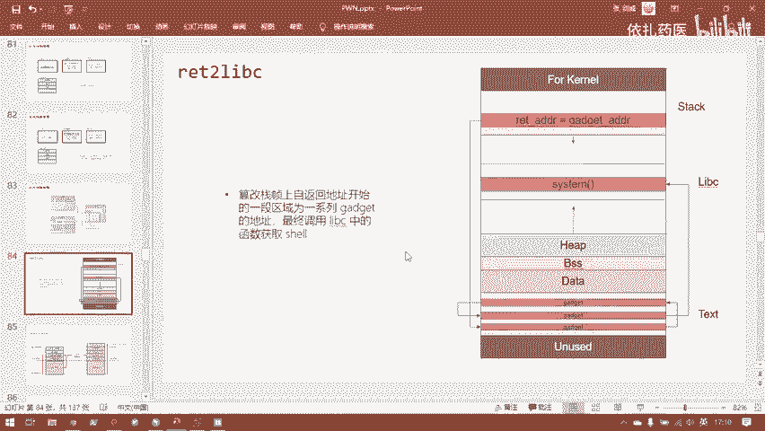

嗯，从在return to live C讲完之后，呃，当我们把rock部分讲完之后，我们会着重的去做一些练习。然后重点的去在练习中去巩固大家的知识。然后在练习中，大家如果有什么问题的话。

可以就针对性的去在实战相关的知识上给大家讲解和解决问题。

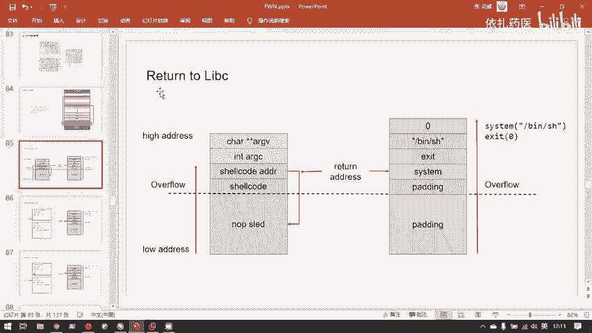

呃，Return to live C。内容比较多，因为它的情况呢它是就是ro比起简单的ro，它又复杂了一些，它又是结合动态连接相目的内容。所以呢return me C这里有总共有三道题。

前面的四道题我们也解决了，关于基本ro这里还有三道题。然后我们就会展开讲一些更高级种和一些难度比较提升进阶的内容。呃，那我们现在先看一下return to lip C的第一道题目吧。

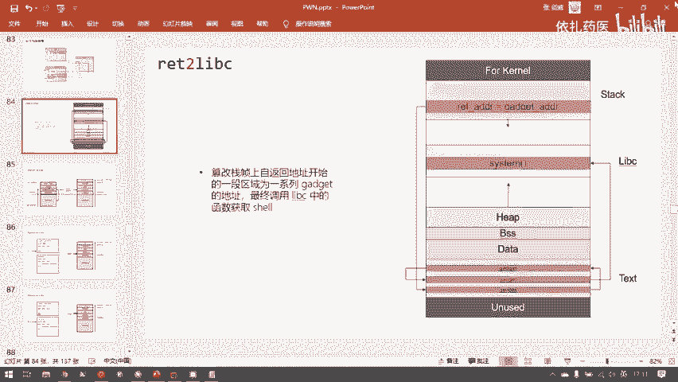

先了解这个题目给我们带来了什么样的新困难。然后我们再去看一下return v C是一个怎么样的攻击过程。就是这道reemp to leave C1。我们先来同样的第一步其是。看一下他的反护措施。

可以看到他说是。32位的程序。没有callorie这不可执行，没有PIE大概就是这样一个情况。了解基本情况，我们就可以用艾da开始反复颠它。空格键进入。后编窗口F5进入编译窗口。

就是这就是完整的程序的逻辑了。可以看到，这也是一个很简单的战一出sendb和po函数，这里是没有漏洞的，但是它也是在站上开辟的一个缓冲区。证明那一个值部变量它是一个缓冲区。

并且像这个缓冲区里用get这样一个微险函数读入了任意程度的字符串。嗯，这个漏洞这个函数体的漏洞好像和我们上一题与ter to some call好像没有任何区别。

那么return to system在对于这题来说，它的工资方法还能实现吗？那我们先来按上一级的攻击流程来检验一下。首先这个战役出呢跟上一级的战役出是一模一样，你就不关心了。我开始找ge。

首先是为我们EXEBX那些计算器赋值的。我看我们能涨到多少。可以看到，这和上一题就不一样了。还记得上一题我们输入这行命密，找出所有的带有po returnturn指令的代码片段，它输出多长吗？

当时显示都显示不下。为什么这一题一下就没有很多可以用的get呢？它总共只有7个get。并且这些get里面看看满足要求的这个要满足要求。没有，我们只能控制EDX的值。所以get的是完全不够用的。

为什么不够用？想想我刚刚已经提到过了，因为上一题是唯一一题是静态变译的程序，它里面包含了大量的库函数。然后这些库函数提供了大量的代码片段，所以代码片段的数量上来了。那我们能找到满足要求。

代码片段的概率就大大提高了。而这题变成了动态连接。漏洞虽然是一模一样的，但由于动态连结，导致它代表量过少。就是变成了不容易找到我们所需要的能执行一次sstem call的ge紧。那我们只有另行思路了。

对于这一题，我们最开始学到的还有两种分手法，与con test可以吗？也先来检验一下。看他有没有后门函数，你就看一些他是否有一些。长得比较奇怪，明显不是。库函数的函数就是。是明显是程序员自己写函数。

这有一个这倒是有一个s secureec。

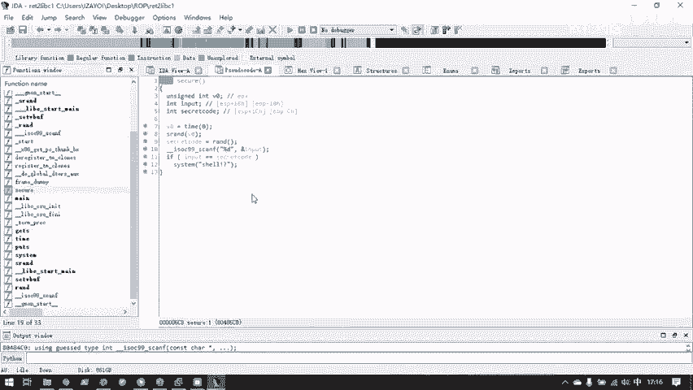

但是。seccure有是有，但它是后门函数嘛，我们看这里有一个system shell。

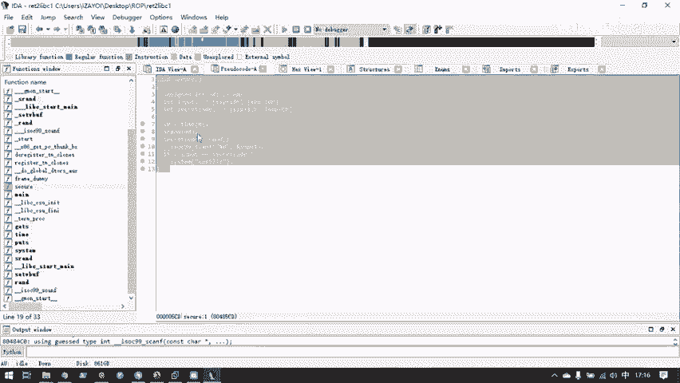

也就是执行sha这个命。我们在终端执行一下有什么效果。不号是好。什么都没有发现。因为这根本就不是一个秘密。就是你看起来他好像唉这里是一个后码函数，但实际上呢不是的。这个函数我们看它干了什么，获取的时间。

通过这个时间作为一个种子，生成一个随机数。随机数给了这个变量。然后读取了一个整数，如果这个变量等于这个整数，就是如果你在输入的过程中猜对了这个整数，它就执行。是，感叹好凤好。但是share感叹号问号。

它本身sstemsha感叹号问号卵用的没有，因为这根本就不是一个秘密。所以就算你。上辈次拯救了世界，你的运气足够好，你把程序的控制流截持到了secure函数，并且在这里用input。

你猜对了这个随机数也是没有任何用。所以这题re是t是失败了，可以明显看到这是出题人放在这里一个背秒有什么用的函数。

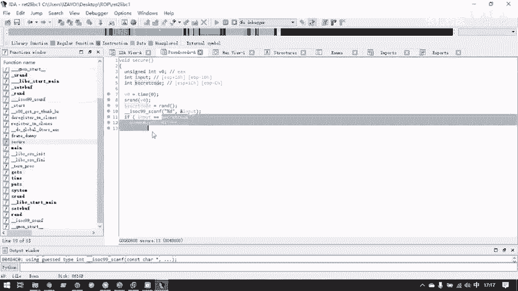

他真的没有什么用吗？其实也并不是。

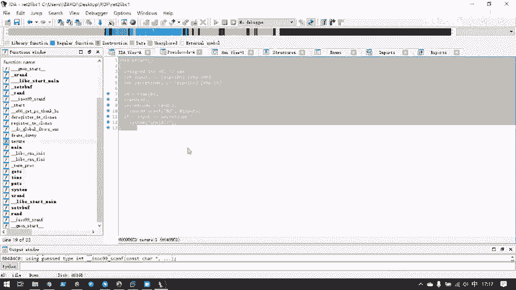

他这个函数虽然并不能帮助我们达到攻击的目的，但他还是留下了一点遗产的。他调用了s。还记得我们刚刚看的PRRT表吗？如果。一个一个程序他没有调用。没有掉用一个函数，那么这个函数即使是存在于动态链接库的。

但是它也是不会存在于这个程序的PRT和got里的。比如说。我们此时的这个程序。我们来看它的PLT可以看到就是刚刚的那三项。因为我已经调用过了coth cr printF和exite。

但是我并没有这过stem，所以它的PD表象里是并没有stister。所以你看到这个题目像这样写的时候，你看到哎呀好遗憾，这个stem并不能帮助我获取sha。

但是同时也别忘了这个stem为这个程序的PRT中增加了一个表象，是stem。

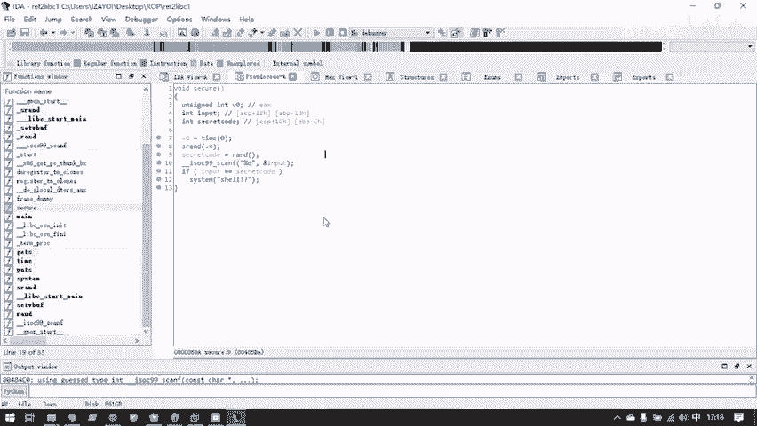

那么问题就出现了，为什么他为PRT表象中增加一个st对我们来说是一个件很有帮助的事情呢？我们调这题的时候发现了之前讲过的，我们在扣一个函数的时候，比如说这题。他在扣llco这函数的时候。

它实际上不是直接跳转到了。动态连接库的po实现代码，它是跳转到了自己的代码段对应的postPRT表中的。然后这个PRRT表会全自动的进行一些一系列的操作，并且跳转到最后实际的。在动态连接库中的。

复置代码的位置。所以呢对于我们的程序来说，我们跳转到裤s。对应的跳转到PRT对应的函数表象，其实和我们跳转到这个函数，最后的结果是一样的。中间的过程都是对对于用户来说是不可见的。

都是被嗯程序代码自动化完成了。所以呢我们在returnlea C的时候，我们考虑的并不是一步到位，直接跳到C这个lea C中的sstem，而是我们可以跳到。ts中的。透制的。

对应的对是sem对应的leave C的表象PRT表象，然后这个表象会自动的把我们的程序的执行流。拉到6个C的C上面函数这。

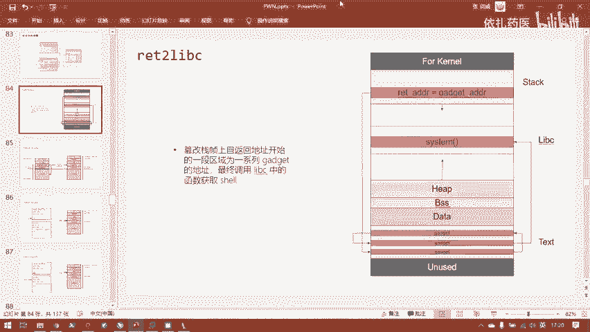

那么这里可以看到，首先ssem对应的PRT的表象是什么呢？没有。我们把这条线往右拖一下，你就可以发现它默认藏起来的一些东西。可以看到。这里其实显示了各个节的名字的。然后呢，我们要找到P。

sstem们的PRT地址就在这里。稍击一下。

我们就来到了对应的PRT的地。对呢sem的PRT的地。在这里。所以呢我们其实等一下控制程序执行流跳转到这里。就实际上等同于跳转到。呃，leaveC里的 system函数了。这就是这些工司思路。

但是还有个问题没有解决。我们我就算返回到了。sstem这个函数的位置，那么它的参数怎么办呢？我们并没有为sstem写上并SH的参数啊，它就并不能返回给我明示啊。那为他传参。

这里就要用到刚刚已经学过的ro这个手法。我们在战役出的同时，用一些get把。嗯。这里跟嗯对这里才传参其实有一些不一样。因为系统调用是都是要用呃计分器传参的。但是在32位的情况下，传递的参数都在站上。

但是这里。实际上也是需要用ro的手段把参数直接布置在站上，并且传递给。sstem函数。呃，那么。我们的BSH这个参数要放在站上的哪个位置，才能正确的传到sstem里面呢。这个就要回到我们最开始讲的地方。

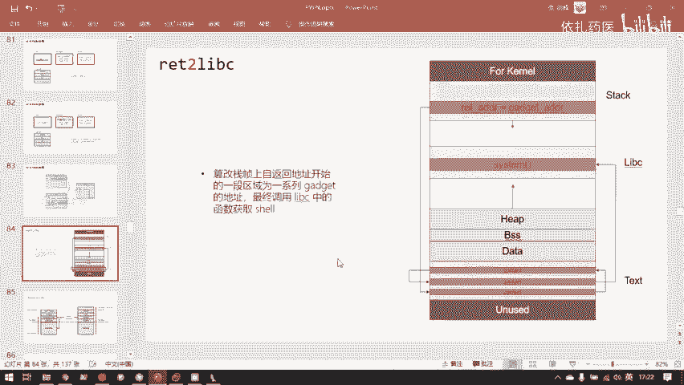

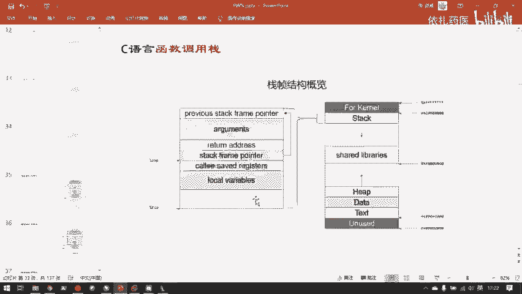

还记得这张图吗？大家看这个地方。我子函数所用的参数是放在哪里的呢？对于叉86s尔维的叉86，它其实放在负函数的战争里了。复函数在调用它之前，会把子函数用到的所有的参数都压占。所以呢。

实际上我们此时调用stem的时候。我们所需要的。战役出之后，我们需要在战中构建这样的片段，这是sstem函数的。飘丽弟。然后呢。这是ss函s函数返回所需要的任意一个returndress。

比如说我去给它填成excite meexite。这为什么还需要在stem函数sstem函数的地址之上还要填一个返回地址，这个也会展开来讲。大家先记住这。然后呢，再在这其上。就是。Such。DSS设地址。

这样的状况把栈中构建这样的一个结构，就可以使得它成为子函数的参数。再回来看这张图。参数会在复函数的战争中，然后子函数的战争就直接从参数向下增长。

然后return address此时这里被我们覆盖成了sstem的地址，然后它的参数就可以直接从上方取得了。然后为什么这张图和这里又有点不一样了？是因为我们破坏了，其实我们在这个攻击的过程中。

已经破坏了默认的C语言的函数调用模式。所以呢我们其实在这里就需要外的添加一个。一个自长的数据，然后来表示cem的返地址。这个明天也会用动画给大家详细的演示，但是怎一个过程。呃，然后今天最后。

最后一个知识点。来说一下，大家注意到Cthe systemthe函数原型是啥？是sister吗？我们最后要执行的时际上是这样一个东西吗？System。对。Sa。我们最后要执行是这样的东西。

但是我这里我这样写，我把呃dress给它去掉。那这张图是对的吗？不，他不是对的，因为在C元的字符串。在传递字符串参数的时候，它和C语言传递字符串参数，它传递的都是这个字符串的起始指针。

这个这个字符串本身它都是在编译的时候，都已经被编码，就是硬编码在程序的。read only data也就是只读数据节理了。它传递的并不是BSH这个字符串对应的阿柯玛编码值。这样太量成资源了。

并且也没有必要，甚至也不方便处理。它实际上传递的是BSH存放在。程序的。Read only data。断你的BSH的自古值，你看这里很巧，这里正好你可以看到BSH存放在了re data节。

它实际上存放在这里，然后呢，它传给stem的实际上是什么呢？是它的地址。比如说对于我们此时反编译的这个。MBE的这个文件C侧接收的函接收的参数其实。是什么？是这个值。真正传进去的是这个值8048720。

所以我们调用的时际上调用的是这个东西。80。4872。对，这才是最终的。我们调用C上的样子。所以呢在我们retlic这一题的时候，构建的战接就应该是这样的。然后sstemPRT的地址。然后任意一个地址。

那我这就填一个垃圾数。对。这样的新我们在这里形成这样的一块区域，并且C这里填入sem的地址呢是returndress，就能达到最后调用一个sstem bSH的效果，就能为我们获取一个sha。嗯。

今天的主要内容就到这里为止了，明天就接着来看这一道明天注例C的第一题。然后。今天就结束了，大家再见。

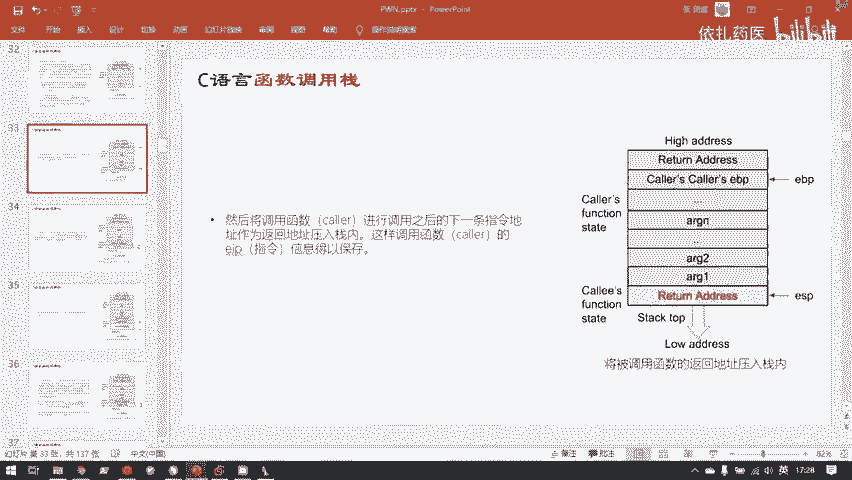