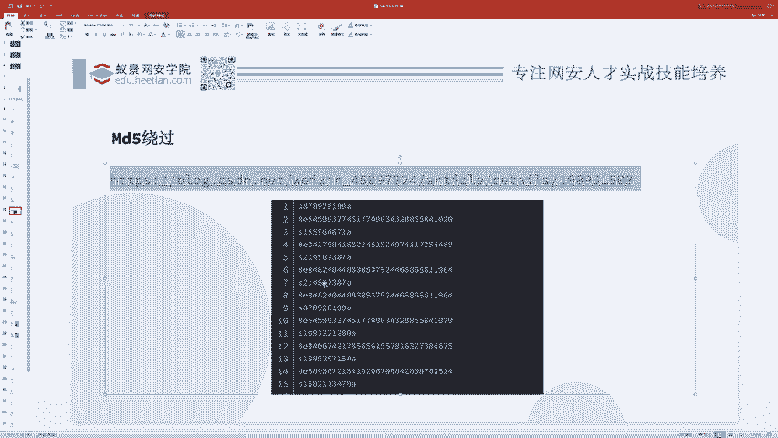
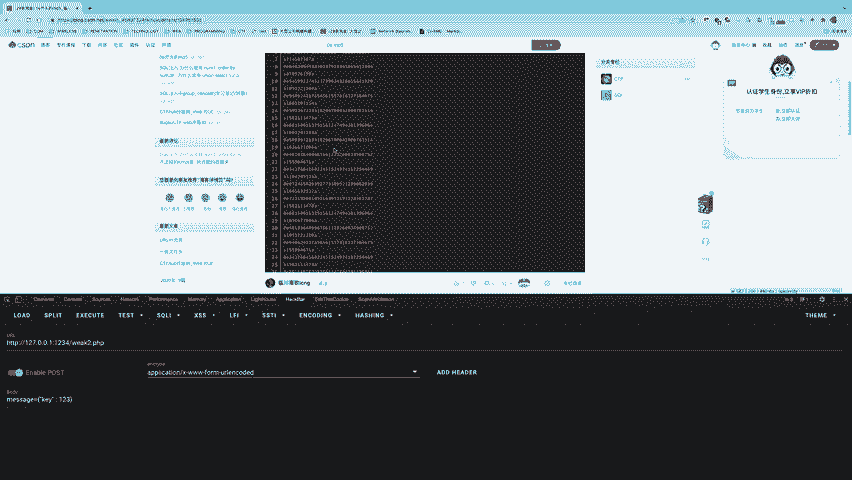
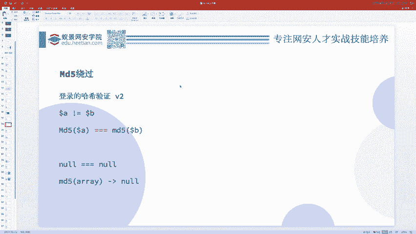
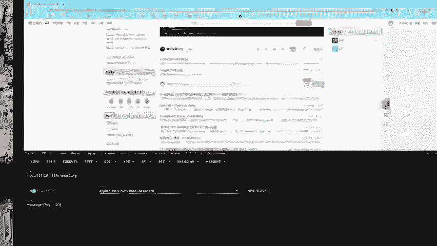
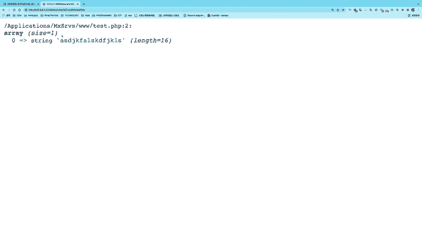
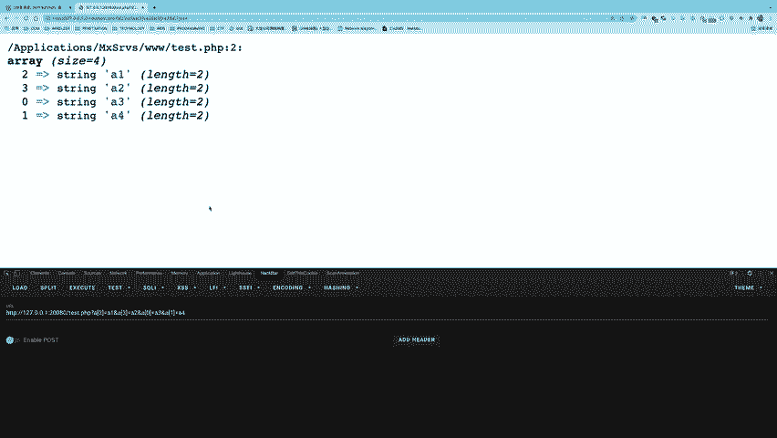
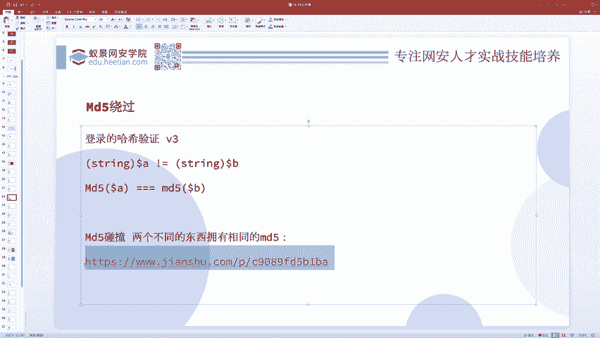
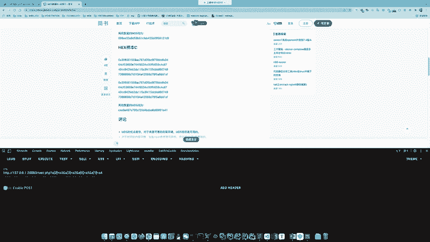
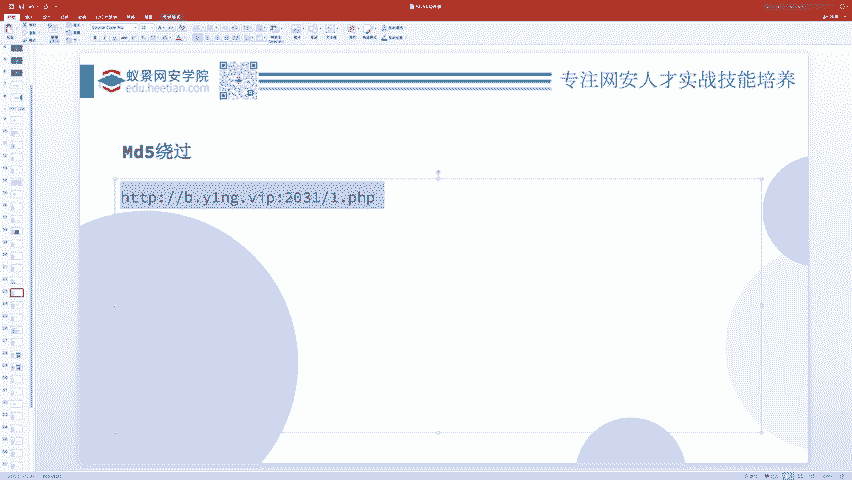
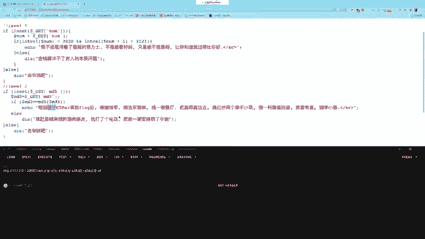

# CTF教程：CTF初学者必备的1000个练习题，每日一练，百日成神！（ctf-wbe／ctf-pwn／ctf-misn／ctf-逆向） - P3：ctf-web02_哈希（MD5）绕过问题 - 白帽子讲安全 - BV1dp4y1j7aN

解决一些题目。这就是弱类型。接着呢我们说哈希的绕过问题，在哈希绕过问题里面，我们以MD5呃为例来讲来来讲解。😊，其实这个哈希绕过问题啊，就是弱类型问题的一个应用与延伸。你知道了弱类型问题。

哈希问题就结束了，就就就学会了哈希问题本质上它也是应用弱类型来解决的。😊，比如说。这里边我有这么一个题目。doller A和doer B是两个，你需要给我提交的变量。这是你的用户的输入。

你这个do了A和do了B呢不可以相等，但是MD5的do A和MD5的do了B。可以相等。就必须是一个弱相等，就两个东西，两个字符串不相等。但他们的哈希值相等。😊，这时候。怎么办呢？大家可以。想一下。啊。

从这个。讨论区。数组没错，数组是一种解决办法，除了数组还有别的吗？对于这东西有有三种解决办法。数组啊，这个同学说的很好啊，是是一种很不错的东西。这是其中一种，还有别的吗？你再想想两个。哈希碰撞哎也可以。

因为哈希并不是绝对的那个两个不同的东西，就一定有不同的哈希值，它是存在碰撞，哈希碰撞也是一种情况。😊，我能问问这个是干嘛的吗？什么叫哪哪个？你是想问哪个是干嘛的？

灵E还有这个QNCDZ0这这个东西没错啊，就是基本就是呃三种办法。看大家的水平都还蛮高的。哎，把这些东西全都能讲出来，说明大家的实力都很强。基本上啊我们这。呃，评论区就已经把它结果说出来了。

零基础能看吗？零基础差不多呀，你只要会最基本的这些函数，你是知道这东西叫变量，你知道这个东西判断是否相等的判断是否不相等。什么叫MD5，你知道这个就好了呀，这都是一些最最最最最最根本的东西。

你就把这些最底层的了解，这差不多有一点代码基础更好了。好，那我们现在就来看这东西怎么做。三种办法，对吧？这是第一关，这是这个嗯最简单的A和B不相等，MD5却满足弱相等。我们可以利用这个东西。

之前我们在这个弱类型里面，是不是讲过这句话？😊，我把他给裱黄了吧。因为这个比较特殊，它是一个两个字符串，满足若相等的例子。为什么呀？因为它是科学技术法的形式。

那现在我是不是就可以找到两个科学技术法形式的这个MD5值啊，那这2MD5值是不是都是字符串呀？那MD5就是字符串，它俩满足弱相等吧，所以这两个东西是弱相等的。而这个MD5值。

它又是MD5MD5是什么格式啊？32位0到9A到F。对不对？就这几个字符，你看这满足吗？尽管你觉得它好像很奇怪，和我们见到的MD5不太一样。但是你说它不是MD5吗？它哪一条不是MD5。

没有不符合MD5的特征了，它就是MD5。😊，那这样的话，我只要找到这2个MD5，然后把A和B分别换换成它那个原原型，就是铭文。然后它的哈希值就满足了若相等。那这样的MD5去哪找啊？

比如说这里面有这么多这个的MD5是它这个的MD5是它这个的MD5是它这个的MD5是它他们都是一些呃字符串，然后字符串MD5值是一些呃。😊，灵E后面是纯数字的。招是灵异纯数字。

那么它就会被当做一个科学技术法来用吧。

这篇文章里边呢给你总结了好多好多好多30多个在这儿呢。

啊，我给大家发一发。我把这篇文章的链接啊发到聊天框里边，大家自己收藏一下。这是第一种，这是最简单的。然，现在我把它升级了。😊，呃，怎么样升级的呢？现在不是弱相等了，MD5不是弱相等了，MD5是强相等。

你这2MD5必须要严格的相等。那怎么办呢？这个时候呃就可以用当时呃这个这个。这个同学他说的。办法给个数组就好了。所以就是我们用数组。

这就是一个解决办法呃，为什么用数组可以呢？我给大家做一个演示。😊，我们输出一下MD5值啊，这MD5函数随便我先搞一个字符串，就这个字符串。那么它的MD5值就是一个字符串，对吧？就是以结果没没啥问题。

但是如果说我把这doller A dollar B就是这个呃你用户的输入搞成了一个数组，那你看它会变成什么样呢？我搞一个数组。

哎，你看他报了一个 warnings，他说MD expects parameter one to be stringray given。他说我这个MD5函数，我期望你给我的第一个参数是一个字符串。

但是呢你给了我一个数组。啊，这就会报一个 warningning，虽然是 warningning，而不是一个什么非al error，所以说它还会执行，它只是一个警告，警告在不太行。就是他返回什么呢？

他返回了一个no。这是数组，哎我我写一个数组啊。这数组里边有一个元素啊。这元素的值呢是ABC。它返回闹吧，我又再来一个数组，这个原这个数组的值呢是DEF了，它也返回 now。

那你看这个ABC和DEF这2个MD5值，我判断它是否强相等。两个都是闹啊。ow和no是不是就。相等啊强相等对吧？错你俩东西一模一样的，全都是nNULL。NULL这这能不相等吗？这肯定是相等。

所以说尽管我改成了强相等，依然可以搞定就用数组绕过。也有个问题就是我怎么样能够。传一个数组进去呢，比如说。我在这里边。写一个one dump dollar get。诶。

这个A参数你怎么样把这个A参数搞成一个数组呢？你在传参的时候。啊，你像正常情况下，我给一个A等于123，那它是字符串的123。你在这里爱写什么东西，写什么东西。他就是字符串，怎么样给数组啊。

其实非常的简单，我只需要在这个A后面加上一个中括号。啊，这个同学说的非常正确啊，就是你就给他了一个呃变成了一个数组。😊，然后呃如果说你你你知道大家知道数组它是有有多个这个。就是元素的对吧？

我把这个东西放大一点，不知道大家看不看得见，我用这个ha搞一下啊，AA中括号等于这个，那么现在只有一个元素，要再给他加一个元素怎么办呢？这个是一个呃元素A。😊。

A1，然后我要加个A2怎么办呢？我可以接着写and，因为end就是传多个参数嘛，我再写一个A中括号等于A2哎，就可以了吧。你看这样的话，它就加进去两个元素，然后你再写一个I等于A3。它有加三个元素。

所以说这是用URL给数组传多个元素的方法。但PPT速度是个键职队哎，这键职队这个键默认你不给的话，就是0123。如果说我想改这个键怎么办呢？可以在这中括号里面写。😊，嗯，X。写个Y。可以。

你看他的这键是不是就变成了XYZ啊？之前出过这样的一个题，这个题是这么个流程。这个流程就是说首先第一步我要检测检测你的这个数组，就是呃不是说第一步通过UL传1个dollerA是数组。第二步。

检查dollerA0。和。doraA1。就是对这do了A0和A1有很很严格的过滤，就是他必须要要去做个什么事情，具体干嘛，我忘了，然后呢取。这个do了A数组的前两个呃，前两个元素。做评接。执行危险。

命令这我忘了到底要干嘛，好像执行命令吧。就比如说你要执行命令，但是呢对这零和1。过滤的特别严，你没有办法命令注入。这个题。怎么做呢？包括呃去年的2020年的1024在上海。上海。有个gigpang。

大家知道吧？digpang呢有一个第二届云安拳挑战赛。远安全带答错了，远安全挑战赛就在线下答的里边就也出了这个知识点。那这个东西。怎么样来解决它呢？解决办法就是我们这么传菜。A3等于这是命令。

输入的配load的。输入的K，然后呢你再弹1个A4。也等于明明注注的退漏的。啊，我就写写作配load的吧，然后你再传。A0。这等于一个很正常的东西啊正常。然后A1。等于。正常。更卡。解法就是这样的。

比如说我现在给你演示一下啊，我先写个2A2A3。然后A0。A。二。等于我这新新买的键盘用不太顺手。你看到没有？就是你传进去这个顺序是什么？它这个顺序就是什么？😡。

2301你是这么传的那它就是2301这个顺序。然后我们这检查是检查什么呀？检查的是A0和A1，我这A0和A1，这是两个两敏，但是呢它取的速度前两个元素做拼接，前两个元素是二和3。😊，于是这样的话。

你看你是不是就绕过了他的这个检查，他的检查是无解的。但是我让他去检查别的东西，而我给他的是一个新的东西。😊，这是我印象里边一个比较蛮有意思的题。啊，这就是用一个这种啊传数组的一个特性。

接着我们看这个呃哈西绕过的第三层，就是嗯把它转成字符串，全是字符串。因为你刚才不是传的数组吗？那现在我要求你必须是字符串，然后下面还是强相等。这个时候怎么办呢？这个时候。你就没有办法去再乱搞了。

我们只能乖乖老老实实的进行1个MD5碰撞。大家可以看一看。

这个链接。两张图片相同MD53张图片相同M两个hax相同MD52个hax相同MD5hax相同MD5。从这种你就可以看出来。

那不同的这个呃东西它是有着呃就是有着相同的MD5的MD5并不是一个坚不可摧的东西，并不是一个完全没有办法碰撞的东西。你就可以去碰撞他。包括今天抢吻杯也出过这种东西。

而这里边啊有一个立体。这个例题呢就主要考了这么一个点，就到了MD5和MD5到了MD5。就这两个东西呢，他都必须要呃去。呃。就是你要传一个刀了MD5这个参数。

然后呢把这刀了MD5这个参数进行一层MD5之后，还和这个刀了MD5满足弱相等。就是这样一个题。啊，我们可以看一下这个题的代码。

这题呢我也。发出来。在这里呢。到了MD5是你传的，然后呢，M到了MD5的MD5值等于到了MD5，这样的话就可以了。我先把这两个。把这两个人踢出去。我不知道我这器人能不能生效。那我们先看一下这个题。

其实这个题很多很多人会会被这东西迷惑掉。他觉得你要传1个MD5，这个MD5好像很难搞。😊，但其实你不要被他迷惑了。你比如说这样我就把这两行代码给你复制出来。😊，然后拿到我们的这个文件里头。哎。

这个麦怎么会？你不就干这件事吗？对吧？然后我现在做一个替换，我把这dollerMD5。😊，我替换成dollerA。我只是改了一个变量名。我别的啥也没变吧，我只是改了个变量名吧，变量名字爱叫什么叫什么。

doller A dollarll了 Bdoller你好，doll了早上好，doll了晚上好，你爱叫什么叫什么，没问题，都是一样的意思。但是你现在再看。😊，是不是还是可以啊？一样的意思吧。

这是改之后的这是之前的，你比较一下。所以你不要被他所迷惑了，它叫dollraMD5，但是没有人真正的要求doraMD5一定就是个MD5啊，它就是个字符串啊。大家千万不要被这个题目带跑偏了。

就很多时候就是呃题目啊，它会引导你往一个方向走。但是你跟着他那个思路过去。😊，那你的题制做不出来呗。你就掉坑里了。如果你仔细分析分析，那么你就才可以从这个坑里爬出来。出题人越引导你往哪走。

你愿愿越要反其道而行之才可以。所以这个到了MD5并不是1个MD5，它就是一个字符串，只不过它叫MD5这个变量罢了。那这样的话，我就到了哎，其实给个什么东西都无所谓了。

那这现在其实解决这个问题就变得简单了。😊，我们刚才学过了MD5的绕过问题，对吧？所以我现在只需要准备一个0E，然后一堆纯数字的东西。然后它的MD5值呢也是一个0E，然后纯数字的东西就可以了吧。

我只要准备一个这样的就可以了，并不一定是1个MD5吧。

在这呢有这么多啊，这是。嗯，总结好的现成的。这是刀了MD5，我给他叫刀了A吧，那刀了A更更更清楚一些，它是这个，然后他的MD5这是这个它是这个它的MD5这是这个它是这个，它MD5是这个太多了。😊。

大家可以截屏保存一下什么之类的，我看能我发几个出来吧，好。发太多了，他不让我发。哎呀，我发我发这么多行，他都不让我发，我发两个吧。看下两个能不能发出去。两个可以，大家收藏两个基本够用了。

这是两层MD5的，你不要被他圈套啊。掉进了他的陷阱里。