# CTF教程：CTF初学者必备的1000个练习题，每日一练，百日成神！（ctf-wbe／ctf-pwn／ctf-misn／ctf-逆向） - P42：弱口令爆破 - 白帽子讲安全 - BV1dp4y1j7aN

在正式讲述内容之前呢，还是给大家强调一下，本课程呢是仅限于网络安全教学，严禁用于非法途径。😊。

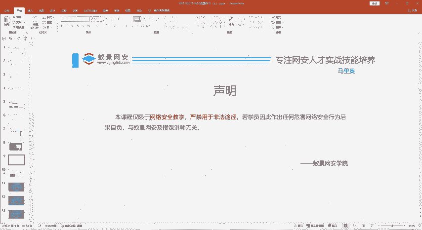

这个昨天的黑客例子也给大家举例了，然后我们国家也有相应的一个法律。那么我们今天的主要内容呢就是三部分。第一部分呢是简单回顾一下我们昨天的上课内容。然后第二部分呢是给大家讲一些web的真题是如何做的。

然后第三部分是我们总结以及我们今天的一个作业。所以今天在课程最后呢会给大家留一些小作业啊，希望大家认真的听讲。😊，只要认真听的做这些作业肯定是没有问题的。

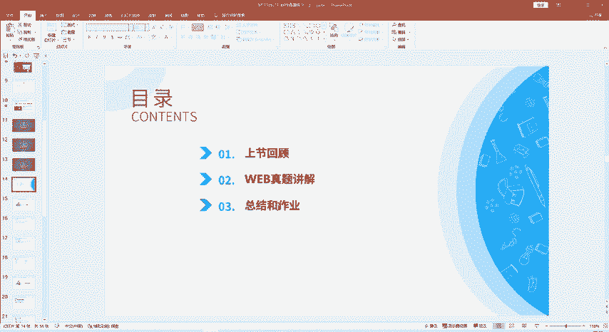

啊，找班主任要一下昨天录播视频，这些也都清楚了。那我们今天呢主要是带大家做六道外部的真题。这六道题是什么题呢？都是那种啊大学社团招新呢这些。😊，CTF社团招新要考验一下你对CTF webb的一个理解。

主要是这些题目。这些题目难度不是很大，但是也饱含了很多的知识点，也很有趣味。那我们一起来看一下。😊。

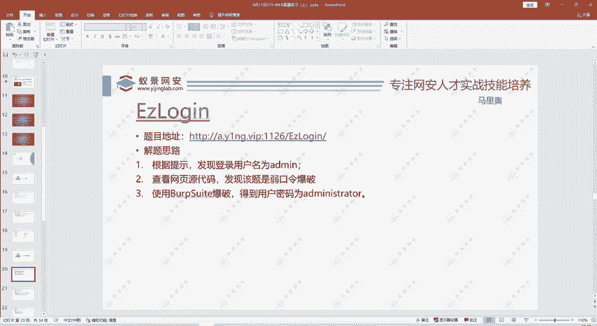

啊，这是我们的题目。我们看一下第一题这个。啊， easy log in。那我们做CTF的题目呢？他的每一个信息都是有用的。我们叫CTF昨天给大家介绍，它是偷胎于游戏。那两队相互之间抢旗帜这样一个游戏。

所以在我们的比赛中，在我们做题中也有这个游戏性。

他这个标题。或者这个题目叫什么名字，这本身就是一个有用的信息。EZ log in那我们看哎，这里有个登录框，是不是就提示我们要进行一个登录？

那么。现在用户名是多少，密码是多少？😊，啊，我们当然是不知道的。那么那我用户名就是。eay log in是不是就是这个标题呢？有这个可能性。就是现在就是随便猜嘛。我们就不会直接告诉大家结果，而。

重点大家做这个题。哎，那么你点击的论文还说please log in at me。那就嗯不是。以经挪个亿，那是我的命。addmin那密码是多少呢？那现在也不知道，我随便猜一个addmin。😊，哎。

他先告诉我是run password说明。从这里就知道这个用户名确实是我的密，但是密码不是我的密。那我们现在下一步的工作就是要找到这个密码是什么。这个时候呢，我们看这个外部贴。我们注意一下他的URL。

URL当中呢可能就包含一些信息。那现在我们这里呢？需要找的是密码，现在可能看不出什么。😊，那我们还可以看点击右键，可以看一下查看网页源代码。我们看一下网页源代码中是否有一些我们需要的信息密码。啊。

他没有告诉我密码是什么。哎，大家注意到这一块是不是一段特殊的文字？这是不是跟密码相关呢？那么我们有一定做题经验的同学就可以看出这段是不是两个等号结尾或一个等号结尾的。这个一般都是什么。

是不是贝斯64编码？他既然那有的同学已经猜到了，这是被464编码。那他既然编码了，那我们就给以进行一个解码，是不是？😊，解码呢这里可以给大家介绍一个编码解码的一个工具。

就是这个sber check是怎么用呢？

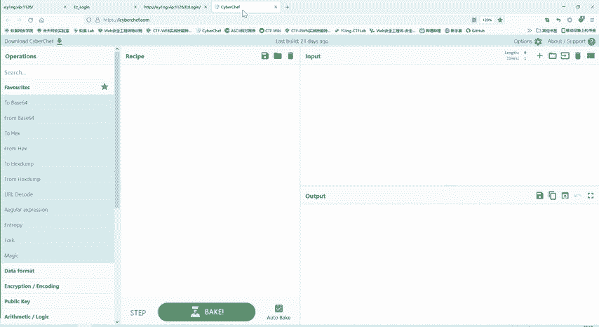

我们把这个文字。

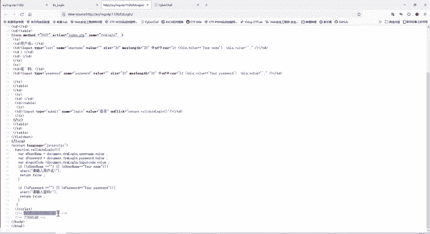

啊，复制过来。这是输入输出是什么呢？他这里有各种编码解码的办法，我们要选择。我们需要的编码解码，这是从b斯64进行解码。啊，这一段是。这段我们刚才从还原代码中看到内容。

几乎被s news解码之后是什么呢？I have no circle。啊，就是说我没有circle的功circle的这个模块。那说明这个题他告诉我们不是一个circle注的题。

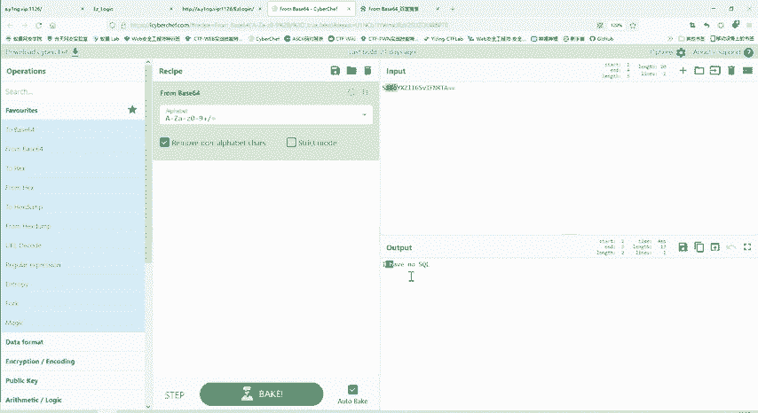

那你不能用CF住的那样万能密码这么去做。这是一个有用的信息。帮我们排除他错误的做法是吧？那我们就更接近正确的。那么这个工具的话啊，我们刚才也给大家介绍了，我们所有的工具啊。

录播视频啊都是在班主任那里啊都要提。那么下面这个是什么呢？😊。

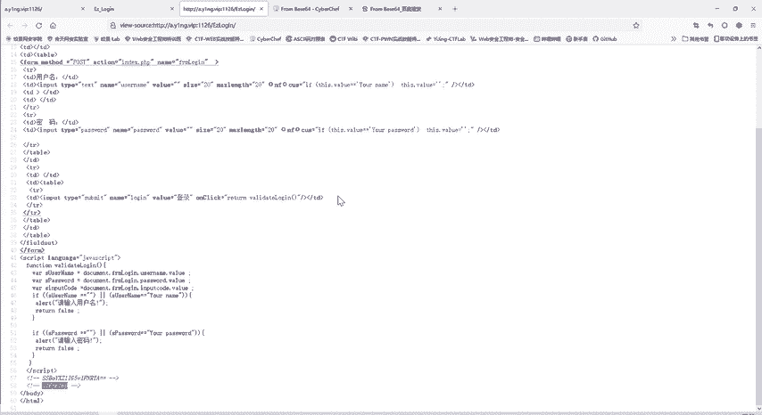

哎，下面这个经过贝斯64解码是这的。这个啊你看一下是不是很不合理。那说明他这个编码方式呢就不是贝斯664的编码方式，我们把这个删除掉。那这样是一个什么变化方式呢？我们注意到7765616B。

是不是很像我们的啊十六进制的编码？你看他最多他要不是数字，要不就到B嘛，十6进制是A到F是吧？0到9A到F。那么这里呢我们选from his。那这里跟哎他解码之后是什么wa。那么如果说大家做的多的。

就直接就。记得这六一就是A。这是经常出现的。啊，所以他给我们提示weake。

we是什么？是密码吗？那我们输上WEAKwe进行一个登录。啊，他现在还是一个run password。那说明这个w也是不对的那这个密码是什么呢？😊，那么们知道。

大家经常也会听说过啊绕口令就像啊群里面有人提出来的，我们讨论去。这个绕口令。那根据目前掌握的情况呢，它应该是一一个入口令的密码。那入口令密码是什么？123456789。😊，啊，就热口径太多了。

那我怎么办？我一个个的试。虽然弱口径是比较简单，但你要一个是，那也是成千上万个。那也不太可能。这时候呢我们就要使用bp suit这个工具。首先打开我们的代理。然后呢。打开我们的b suit，这时候呢。

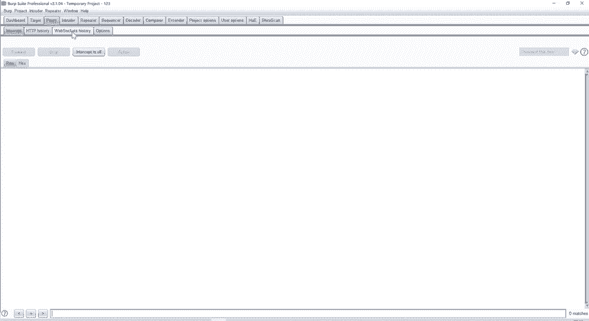

啊，我自的监听的是本地的8080端口，就已经能够监听浏览器的行为了。😊。

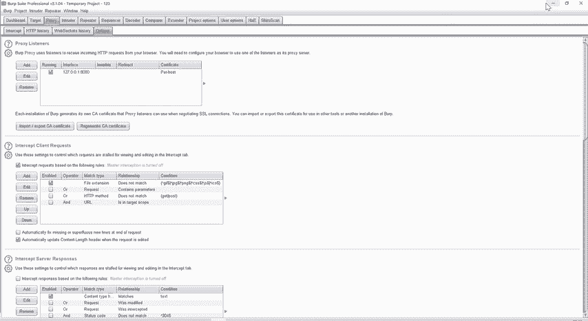

然后我再进行一次登录。用户名我们是知道的密码呢，我随便说12345678。

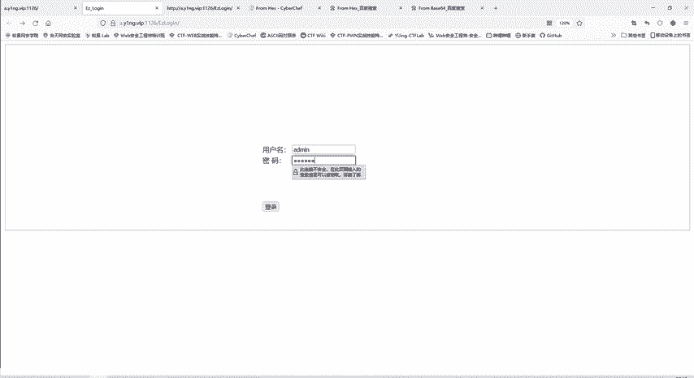

那当然是不对的，但是他这样尽管是不对，但是他这个访问的过程呢，就已经被我的bb速给记录下来了。那我们现在再看。😊，啊，这是不是我们访问的过程？这是一个pos的方法，发送了数据，发送了什么数据呢？

参数的名称，username值设 me参数名称pass word值是12345678。😊，那这样当然是这个结果是不对的那我们怎么找到正确结果呢？就可以使用bp进行一个爆破。

我们把这个发送到iner模块当中，点击右键发送到introer模块。😊。

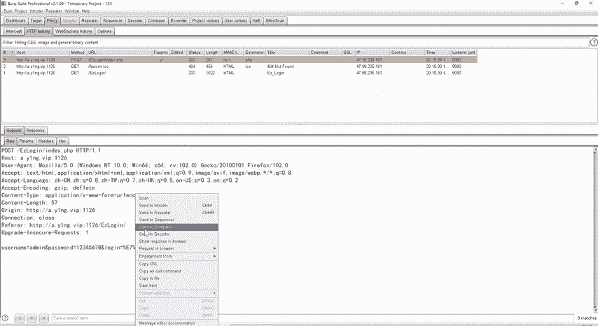

它就自动把我们设计好了，设置好了这个目标host，还有端口。这个位置呢就我们爆破的位置，我们先把它自动加的位置给清除掉cle。然后我们要改变的地方呢，就只有这个pass word。

是不是跟昨天讲的爆破就非常类似了？

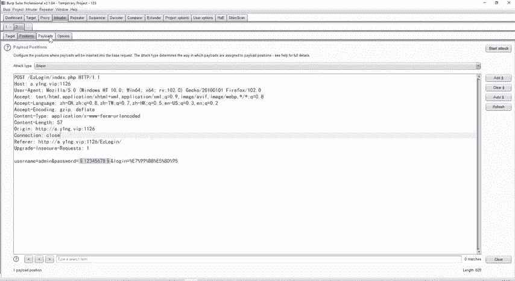

那我们添再添加字典。就搞就是top10啊。能搞简单一点，然后。直接运行。那100个还是比较少的，跑的比较快。那这。密码在不在这100个里面呢？我们进行一个筛选。哎，大家发现没有？

administrator它的响应长度223，那么其他的都是207。这时候是不是我就可以和你猜测，那其他的这些口令。😊，你看这有一些口令。都是错的administrator呢就是对的。

因为他的响音包跟别人都不一样。正确的密码肯定就一个嘛。这时候呢，我就把这个密码复制过来。

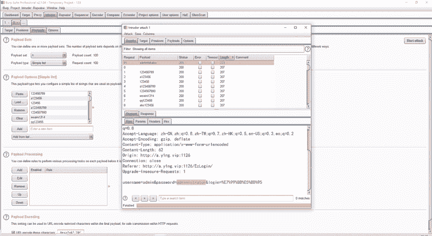

然后再进行一个登录。哎，这个时候就找到了我们的flag。啊，大家就完成了一道CTF外的真题。😊，啊，这对于有的同学来说，可能是第一做的第一道题目。😊，这题目说简单那也不简单，说难也不是很难。😊，嗯。

大家做过了有经验的。就很容易，那没做过的那现在带大家做一遍了，相信大家应该也掌握了。😊。

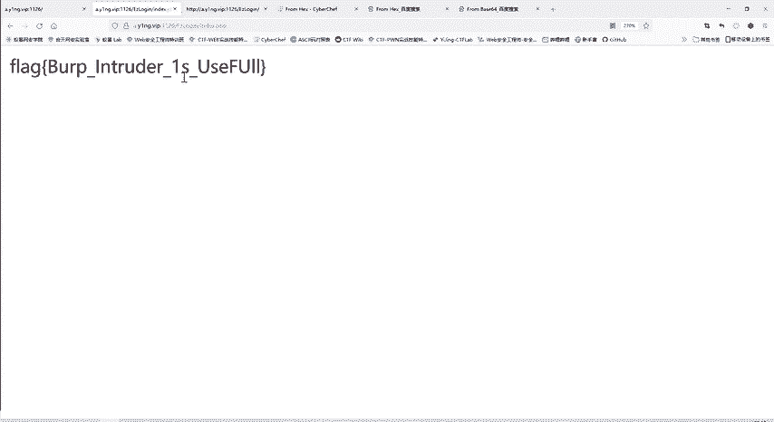

第一题，那么就是这个解题思路。先是根据这个网源代码，根据提示呢发现用户名舍的密。根据网源代码呢发现是一个若口令包破的。一个题目，然后再使用b4的包破，就得到了这个用户的密码。

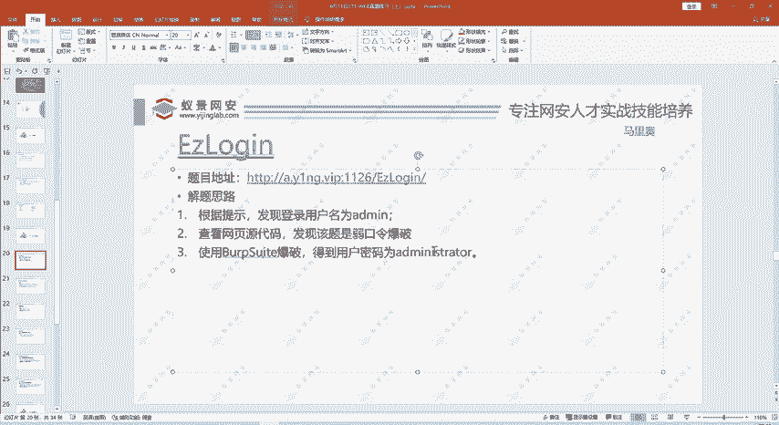