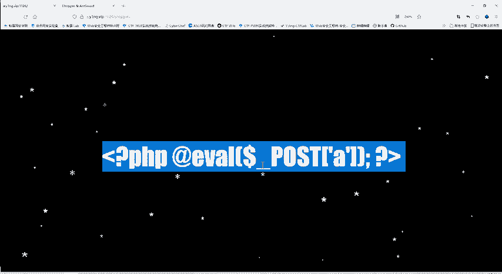
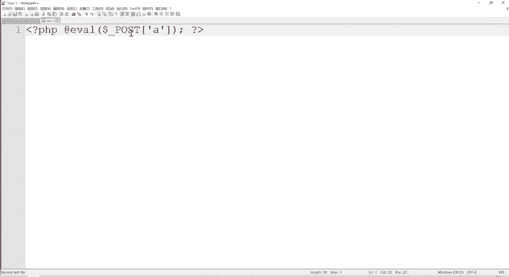
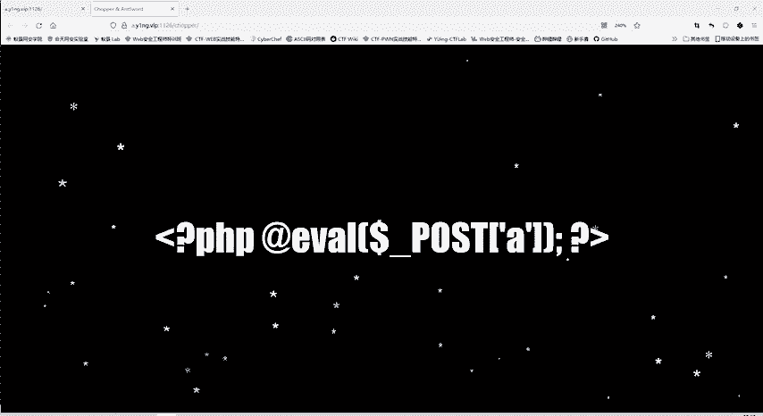
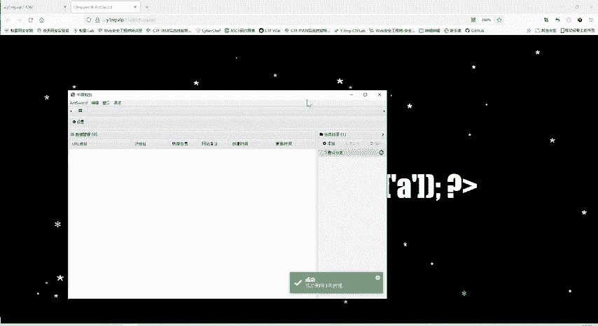
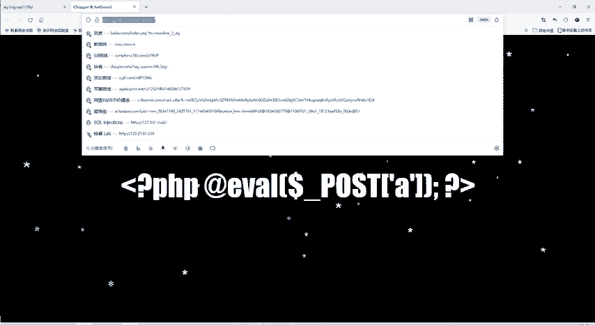
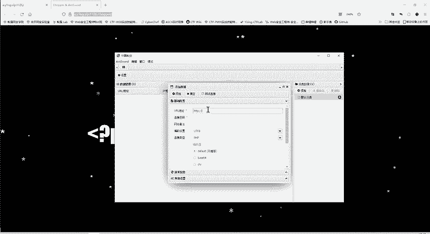
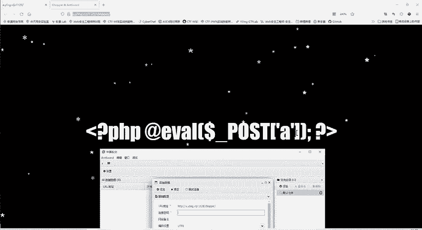
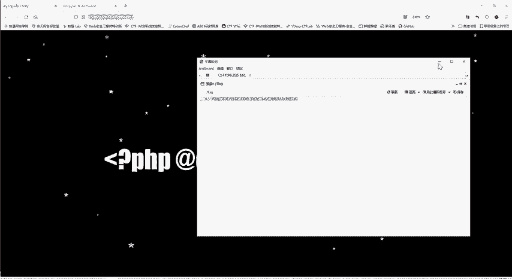
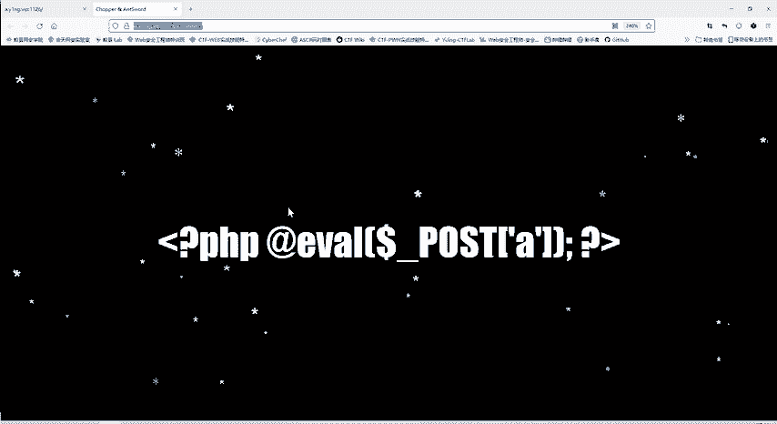

# CTF教程：CTF初学者必备的1000个练习题，每日一练，百日成神！（ctf-wbe／ctf-pwn／ctf-misn／ctf-逆向） - P44：一句话木马 - 白帽子讲安全 - BV1dp4y1j7aN

这是我们的啊第二个题。那我们看一下第三个题。😊，哎，第三个题，它一下子给我们显示1个PHP的语句。是吧。evvo这个多 post a。这个语句。是不是昨天也给大家介绍了？😊。

这个语句就是一个一句话木马。大家自己写木马的时候，也可以写这一句，这句一句话木马。😊，这个木马也可以给大家解析一下，这前面呢是P1P的标签，这是结尾。😊，所以真正起作用的就是中间一句话。

所以叫一句话木马嘛。这个艾特符号呢，这就是我们艾特谁，这个艾特符号它是只是就不报错。😊，这个evil eVL就是把里面的东西当成PCP代码来执行。那这里面的don post a是什么意思呢？

就是他接收pos的方法传递过来的参数。那接收参数put传递方案的参数有很多。比如说我们刚才第一题有user name，有pass word等等。它接收哪个呢？接收A这个参数。😊。

也就是说你po方传接过来A等于多少？比如A等于aldme，那么它就接受过了。那么这个多呢po a呢就是ald me，然后im呢就执行这个语句。😊，啊，这就是。一个一句话木马，那这里我不传入我的命。

我传入什么PHPin这些PHP的命令或system执行系统命令，然后样eva当把这个命令当成PHP代码来执行。😊，是不是就实现了控制服务器的目的？

这就是一句话木马的一个原理。那么这里提示我们有一句话不满了。那既然这么提示了，是吧？这个题目就这么显示，那我当然要使用我们的中国已键呢进行一个连接。

那我们打开一键。

然后呢，把这个网址给复制过来。

已健就是昨天给大家介绍的web笑管理工具有3个，已键哥斯拉冰仙。这是之一。那我们点击右键添加数据，把这URL添加过来，连接密码呢就是。😊。

这个A这个连接的参数。

然后我们测试连接，哎，发现连接成功，那就添加，然后直接双击进去。那么这个服务器就已经被我们所控制了。我们它这里面的每个文件我们都是能看的。😊，那这里面呢就可以看到里面呢跟目录下有个flag文件。点进去。

啊，就看到了flag，把这个进行提交呢，这道题也就完成了。😊，呃，这道题。你只要理解什么是一句话木马，然后会使用一键就能做出来。😊。

这道题还是。比较简单的，当是你不知道一句话木马。你没有已键这个工具的话，那你做出来就比较难。

