# CTF教程：CTF初学者必备的1000个练习题，每日一练，百日成神！（ctf-wbe／ctf-pwn／ctf-misn／ctf-逆向） - P46：双写绕过 - 白帽子讲安全 - BV1dp4y1j7aN

那我们看一下第五个题，employer这个。

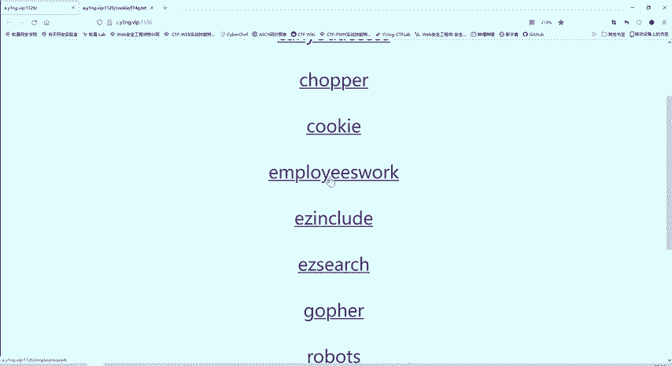

哎，这里。我们看一下这个。标题。URL哎好像没什么内容。那我们看一下网页源代码。这个文源代码也是比较简单的。也看不出什么内容，是不是？对里个链接可以点击一下。点击一下这时候呢有很多内容。

是不是我们这时候可以点击个conrl F来进行一个搜索，看是否存在flag这个字段。😊，因为这很多内容你自己看的话，你可能错过哎，发现一个flag点PHP。

那说明这个flag点PHP呢是我们一个访问的目标。是不是跟我们这个CDF比赛就夺旗嘛，就找了这flag，这就跟flag相关的信息。我们就要访问这个flag点PHP。😊。

那么这里我直接访问一下flag点PP。嗯，好像哎没什么内容，看一下网页源码。也没有内容。啊，那说明这个是不能够直接访问flag点PP的。这个方法是。不对的。那么我们注意到这里面啊，是不是有个链接。

那么这个链接点击一下是什么效果呢？我们看一下。

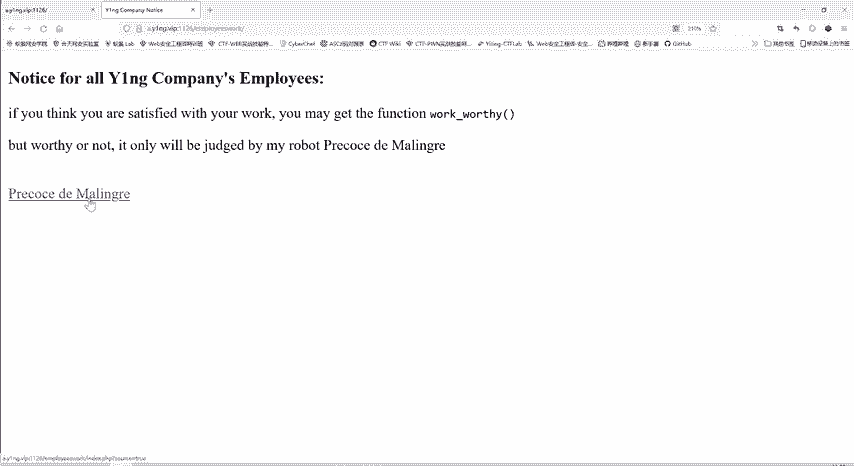

点击之后发现是不是给我们显示了后端的代码。

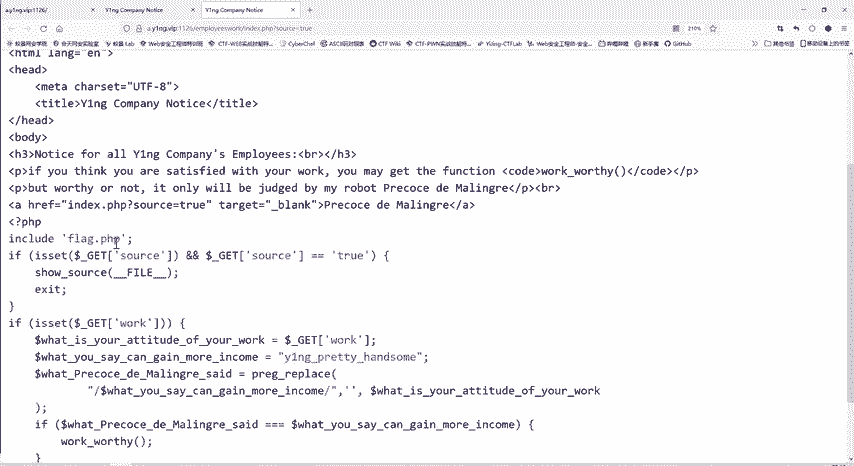

他这里要inclo flag点PP。incloode就是一个调用。我们。有时候接触过C语言，是不是最开始的incstand IO点H。😊，其实调用库，它这里调用这个文件。那么这里就可以理解吧。

这道题呢不需要我们直接访问flag点PPP。还是他帮我们调用，那调用自然就有条件，是不是？那怎么。怎样才能实现一个调用呢？啊，这里前面是。说这里sourcece等于t。的时候呢就都要退出。

那么下面这里呢用get方法传递这个work参数。他就会把这个work参数的值付给这个。你的态度、工作态度、attitude。付给态度。然后呢，你的获得你能得到多少？是这个字符串。他后面进行一个什么操作？

pg replace就是进行一个替换。替换是替换什么呢？你这个g就获得就是这个YNGprety handsome这个字符串是不是？😊，把这个字符串替换成什么呢？替换成空。😊，在哪里替换？

就是在这个HQ的这个字符转，HQ的就是通我们通过work传递过来的参数值。啊，就你。大家之前可能说啊我不知道这个pg replace这个函数。😊，是什么作用？没见过，现在是不是理解了？

首先replace就是个替代嘛，所以这个函函数呢是一个替换的作用。😊，它怎么替换呢？它有三个参数。第一个。😊，第二个。第3个。它怎么替换呢？它就是在第三个这个字符串中找第一个这个字符串，如果找到了。

就替换成第二个。那对这里来说。😊。

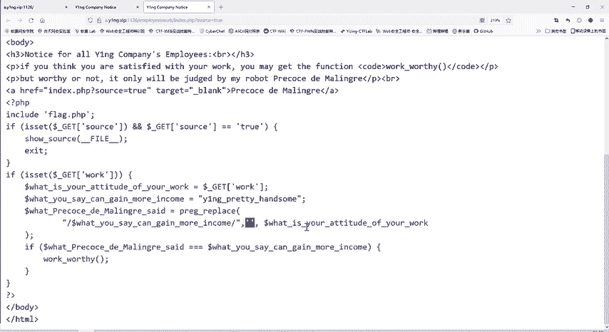

我们可以。进入检查，我们自己啊操作一下。

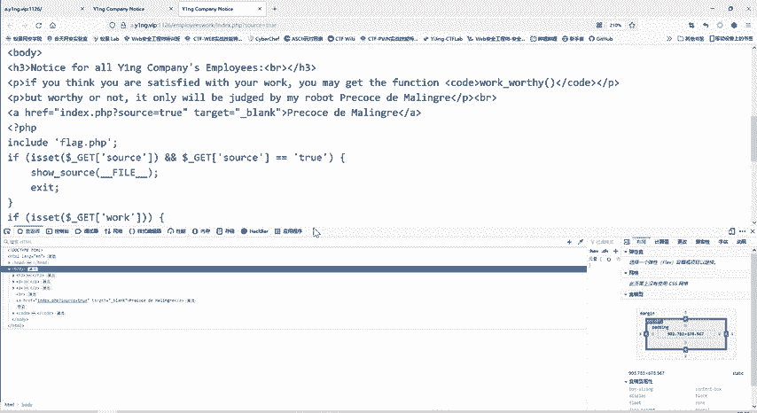

用到我们昨天讲的hib这个工具，我们导入UIL。

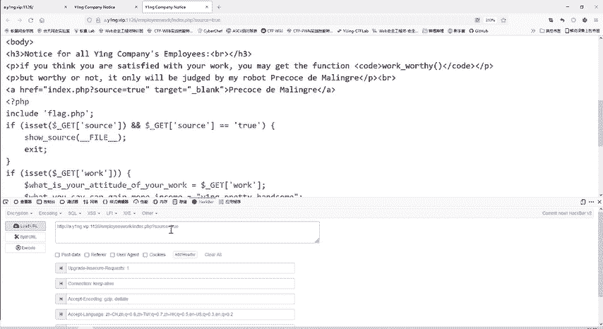

直直接传递这个source等于t呢，它就退出，那我们就不传递source等于t。我们传递的是什么work这个参数。work这个参数等于什么呢？1234，我先随便说一下，试一下是什么结果。

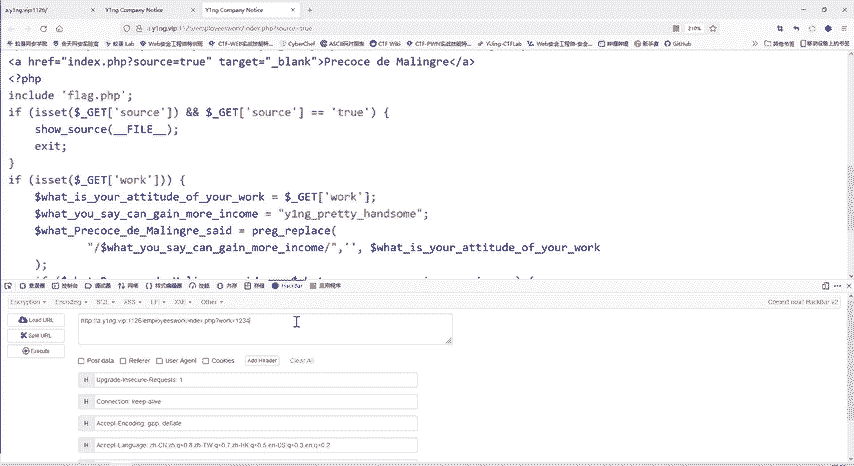

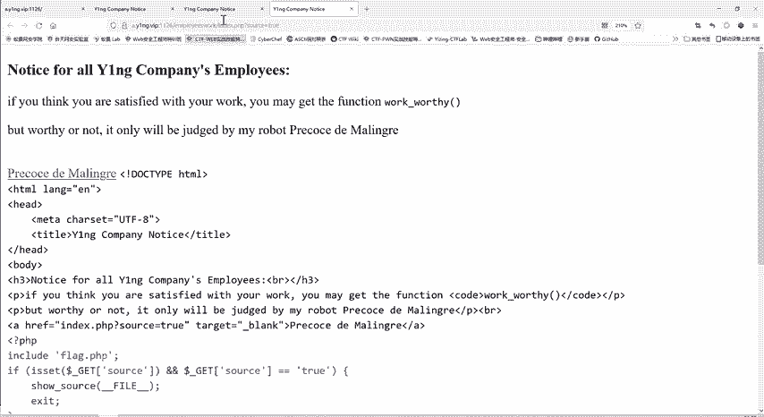

那么这里呢？就没有。排掉了验证就不通过。

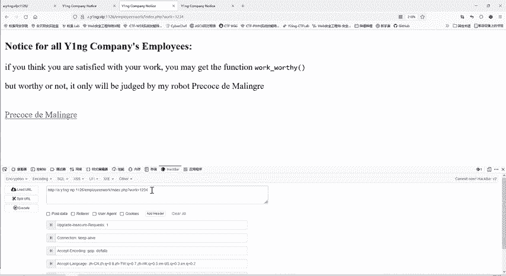

这里我们再看一下他要么。找的是什么？最后要进行一个什么判断呢？就要是这最后这个替换后的字符串要等于我们传进来的这个。更就是这个就要替换后的字符串，就说经过替换之后，还要等于YG。

Pretty handsome。大家想这是不是直接看这是不是一个矛盾。因为你告诉我你这个p的replace这函数就是在后面这个字符串里面寻找它，找到了就替换为空啊。那你既然把它听往为空了。

那最后怎么可能相等呢？这个时候就需要用到我们一种方法叫做双写绕务。

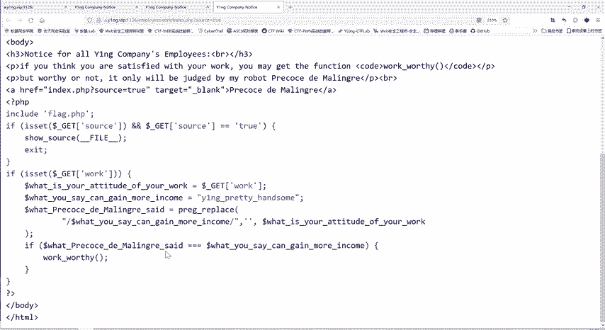

双写效果其实在很多地方都有用。

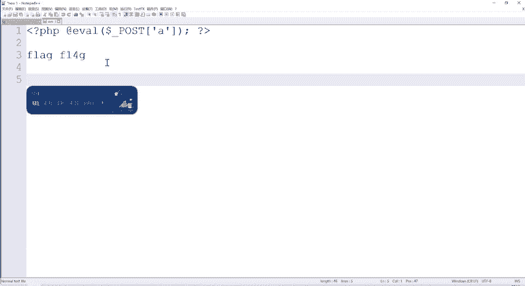

双写要我什么意思？他要把我这这是最后要验证的字符转，这也是要过滤的一个字符转。那么最后怎么实现它目的呢？我就在这个字符串中间，我再把它自己添加一遍。那你想是不是中间这个字产会不会替换为空，替换为空。

那之后呢，是不是它就没有了，那最终还得到YNGpre handsome就符合题目的一个要求了，是不是？😊。

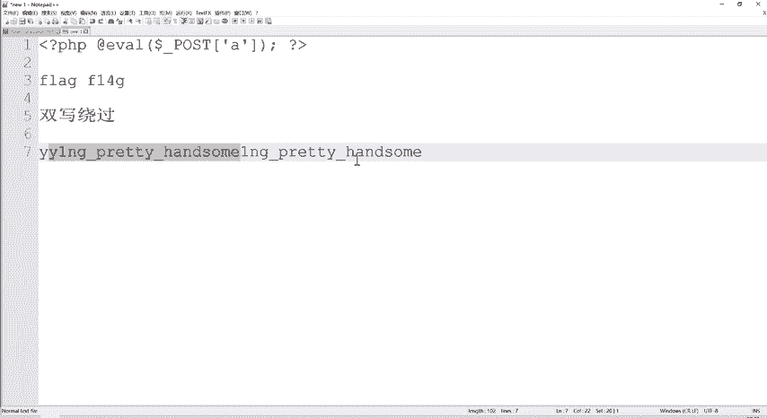

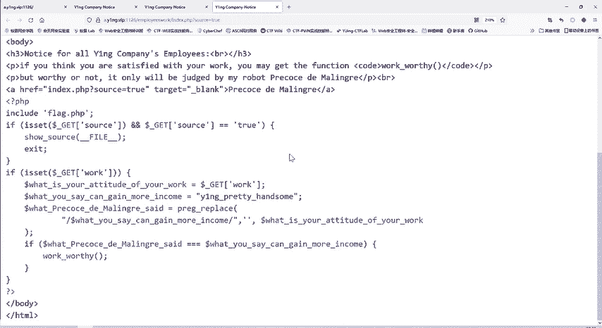

这就是一个双斜绕果。那么我们就把这里。先复制一遍，在它中间啊，再复制一遍。那我们执行一下。是不是flag就出来了？那。

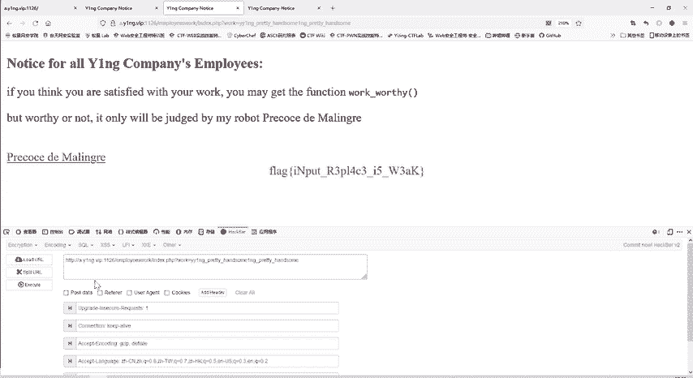

怎么进行双斜绕过？这里。其实双写的一我们利用的是什么？就是我们的p replace函数，它是把这个替换为空了。替换为空。所以说我在这中间插入一下，它替换为空，它就不存在了，那就是原来的。字符串。

所以叫双写嘛，双写，你把一个替换为空，那另一个。😊，是不是？剩下的就是原来的。这你要替换的位置呢？其实很多位置就行，你只要不是特殊的位置，比如说最前最后，那么它都进行替换，你看最前最后它就有两个Y音机。

这个它都替换为空了。但最后得到空就没有意义了。😊，如果说你放在中间。或者是你不不是说第二位、第三位、第四位都可以。你放在中间任何一个位置。他把它替换为空handsome，那剩下的就是你所需要的字符串。

也就是说，双写之后你要保证什么？你所希望得到的字符串在你整个这个双写之后的字符串中只出现一次。是不是你如果说就写在正后面，那会出现两次，它就会进行一个多次的替换。你如果在整个字符上只出现一次。

把这一个替换为空了。😊，那么剩下的就是你所想要的。

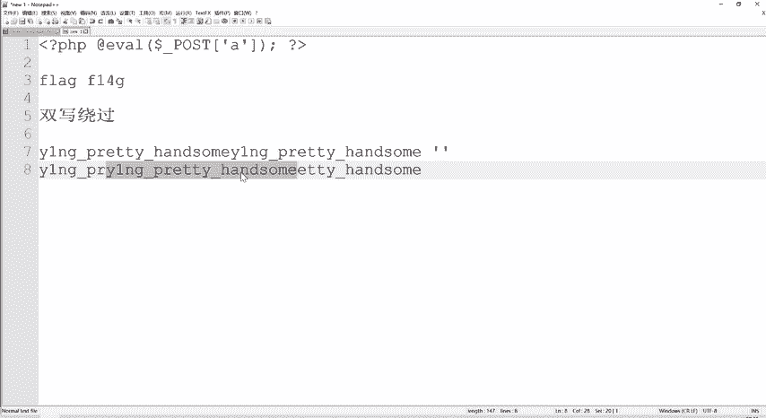

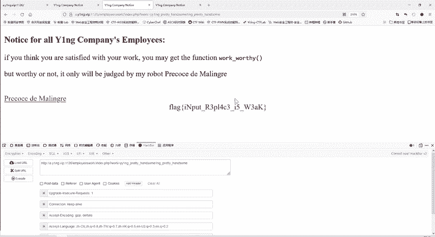

那么这样呢flag就显示出来了。它的原理呢就是我们通过了这个比较，然后执行了work worthy。这个函数呢也就是包含flag点PHP那flag点PHP的内容呢，我们就看到了就是这么多。😊。

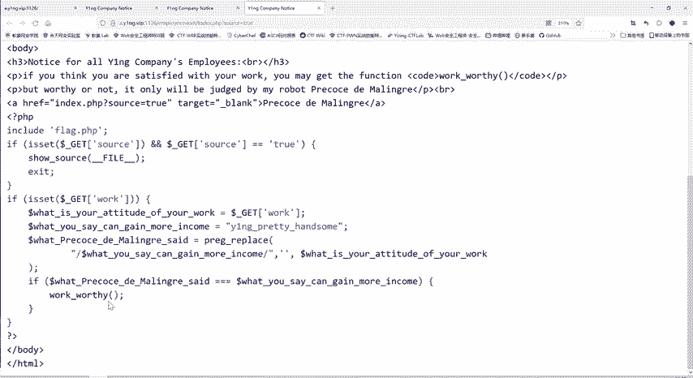

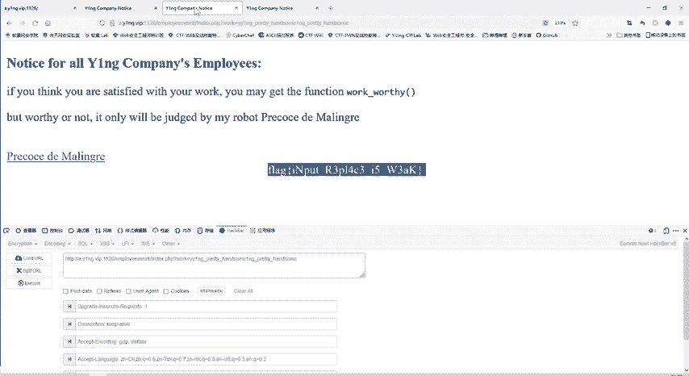

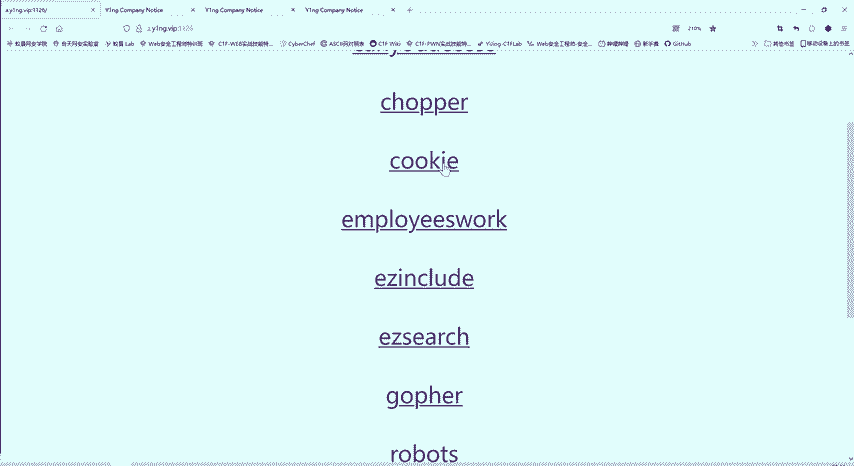