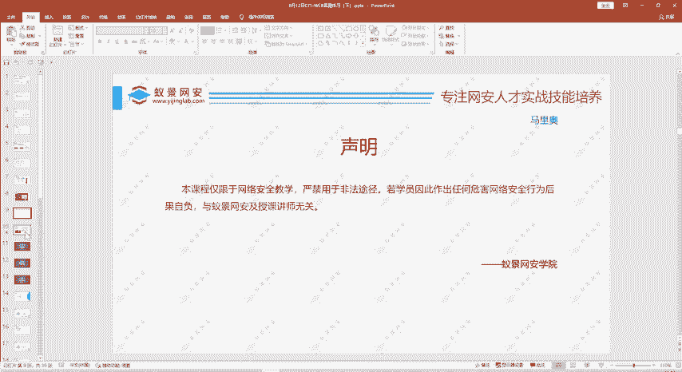
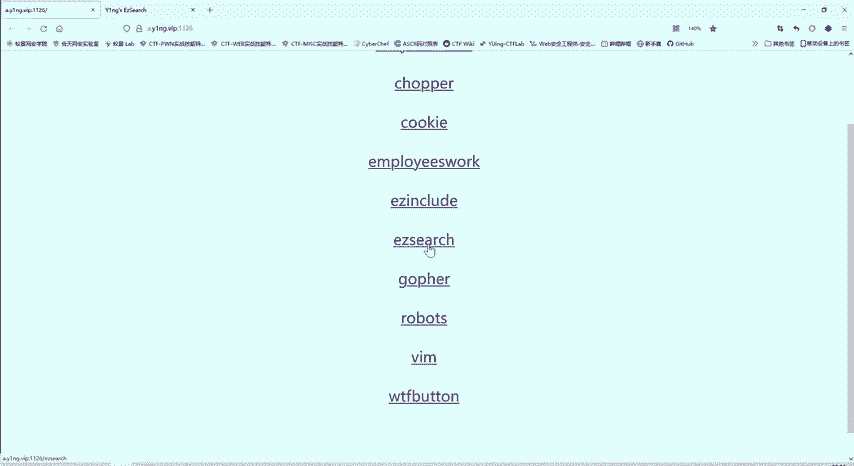
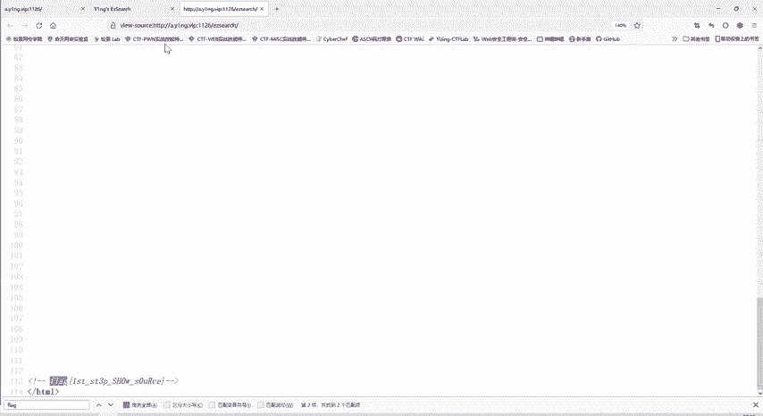

# CTF教程：CTF初学者必备的1000个练习题，每日一练，百日成神！（ctf-wbe／ctf-pwn／ctf-misn／ctf-逆向） - P48：网页源代码搜索 - 白帽子讲安全 - BV1dp4y1j7aN

那么在正实讲示内容之前呢，还是给大家声明本课程呢是仅限于网络安全教学的，严禁用于非法途径。

这个案例啊前两天也给大家介绍过，这个法医也介绍过，就不重复了。首先还是题目地址呢，还是我们昨天的一个题目。那么昨天这前六道题是教大家做了作业啊，那么有的同学作业发到我的邮箱当中，我都看了。

而且给予个回复啊，这些同学都做的比较好的。那希望其他同学呢也是把这些题目自己做一遍。尽管啊老师上课讲了，你可能听明白了，但是你如果不动手做一遍的话，你很快就会忘记。😊，所以说这个实操练习是非常重要的。

那么上节课呢是讲到了啊E include。那我们这节课看看这个啊。

EZ327。那么我们打开这个题目呢。他就告诉我们啊，问们where is flagag flagag在哪？那我们找。啊，这里面看不到flag。这个URL当中呢是这个标题ECZ search。

s期就是搜索嘛。是吧我们第一题EZ log in就要登录，入口您登录进去。那这个题叫搜索。那我们现在这里看不到了，我们在源代码里面看一下。是不是我们刚开始一眼看啊没什么内容。找不到flag。

但是我们追意到这个进度条是不是？这个金度桥就告诉我们啊，下面还有很多内容。那我们就往下看。哎，往下看的时候就看到了这个flag信息。那么这个fllog大家注意到。这个间括号感叹号。

这个是HTML的一个注释。所以这个说这个flag内容是这个HTML文档的注释内容。那我们在网页当中呢就是看不到的，只有在网页源代码中才能看到。所以说大家做外部提的时候，要特别注意这个网页源代码作用。

同时呢不要被他所迷惑，他可能只给你显示这么多内容。实际上你要上滑，或有时候他这个一横条内容很多，要左右滑动，就会有非常多的内容出现。那么遇到这种题呢，我们。啊，查看完源代码之后，你可能找哎。

一下子没找到这个时候怎么办呢？我们可以。😊，按一下我们键盘的crl加F键，那么这里面页面就可以。调出这个搜索框。那我们因为做CTF题目嘛，就找flag，那我们就直接搜索flag。

可以看到他找到了两个匹配价，这是第一个匹配的。然后我们点击下一个哎，就找到了。有时候flag是潜藏在众多的文字当中的，你一下发现不了，那么就按crl加F调出这个搜索框，然后搜索flag。

这样你就能找到了，不会遗漏。所以这个题呢如果说没有CTF做题经验的人来说，可能觉得哎无从下手，这没有什么可点击的地方。你看这么点击，他没有任何变化。但是大家有一定的做题经验了，这题就非常简单了。

直接在源代码里面一搜索。就找到flag，然后提交就得分了。所以说我们就说这个CTF他做题经验是非常重要的。

那么第一题呢，就是非常简单。