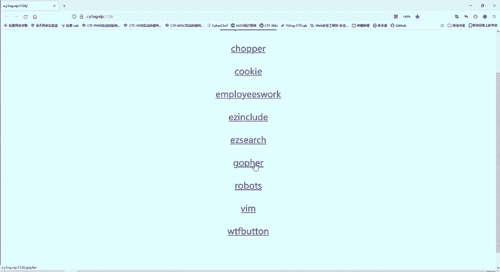
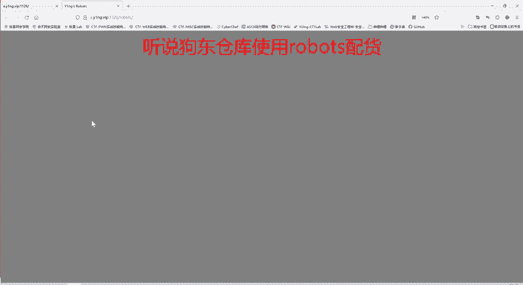
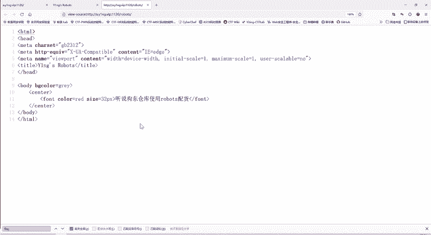
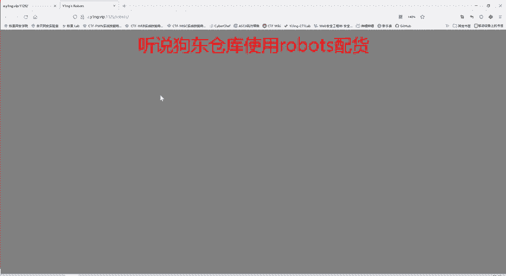
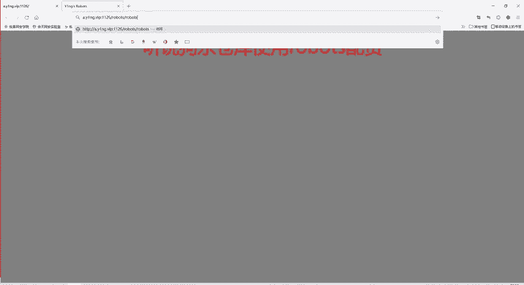
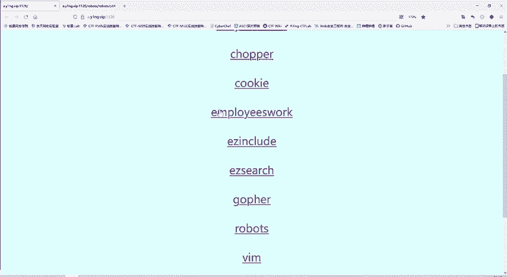
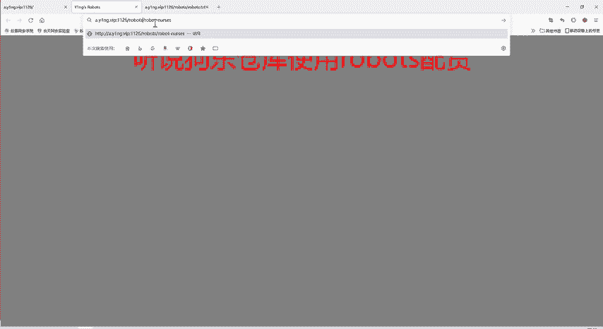
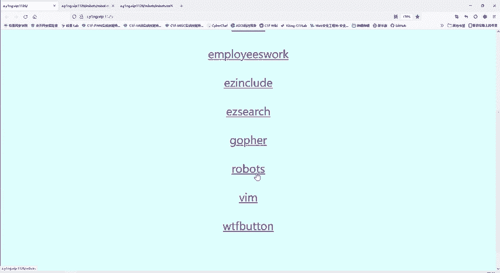

# CTF教程：CTF初学者必备的1000个练习题，每日一练，百日成神！（ctf-wbe／ctf-pwn／ctf-misn／ctf-逆向） - P49：robots协议 - 白帽子讲安全 - BV1dp4y1j7aN

那么我们。这个goffer协议啊，因为它比较复杂，我们训练营的课程呢是讲不了这么多的，只有在我们正式课程中才有。所以这里就不给大家详述了，这是一个goffer协议的一个使用。😊。

那我们看一看这个题，robots。我们今天的第二道题。你看他给我们提示信息什么啊，这个狗东仓库使用robos配货。那么在标题中呢，也是roberts。啊，现在好像看不出什么内容。

那我们看一下网页的源代码。

给完源代码嗯，也没有什么关于flag信息。那我们搜索一遍试试。看能不能找到flag，可能是我们自己啊没注意，没找到flag。经过搜索呢发现啊确实不存在flag这个字段。

这二题怎么做呢？

这个题啊这里这是第一题，第二题也给大家写了。这个题呢，其实是考察大家知不知道robos这个协议。😊，罗不斯协议其实是一个爬虫协议。就是我们网站有很多内容。比如说我们京东上啊有各种各样网页。

有商品信息啊、淘宝啊这些。包括知乎啊这些别人的问答这些信息。那有人就可以写爬虫工具，爬取这些网站的信息。那这个robos协议呢，就是告诉这个爬取者，我这个网站里面你哪些内容是可以爬取的？

哪些内容是禁止你扒取的？这就是啊一个ros协议。

那这里反复提到robots，那我们去看看是否存在这个robos协议。所谓robos协议就是它会在你网站里面存在一个robot点TXT这样一一个文档。哎，这里就存在这个文档。这文档的意思是什么？

user agent。

还记得我们昨天讲这个U在A进吗？我们昨天讲的一个题。还有他对HGP协议的理解里面是不是就有个UAT的要我们使用ABC browser进行一个访问。他这是限定的浏览器。冒号就是说指值是什么？

新星号是通配符，就代表任意的。这句话是说，我对任意的浏览器都适用于下面的规则。下面规则是什么？D love。😊，不允许。他不允许访问我这网站目录下的这个文件或者这文件夹。

这两个文件或文件夹下面的内容都是不允许爬虫的。当然这个robos协议就像有有的同学说的好的，是一个君子协议。他并不是说技术手段，我禁止访问这个文件夹，我就访问不了，访问是能访问的掉的。

但是你如果爬起来之后，就要承担法律的风险。就对方是可以。就是这网站的这个管理者是可以控告这个爬去者的。因为他这里已经声明了这个网站内容是不能进行扒取的。那从这里呢，我们就可以知道。

这个网站目录下是不是存在这两个文件或者文件夹，我们现在不清楚这是文件还是文件夹。😊，是不是？因为如果说不存在这样的文件的话，那你当然也就没有不允许一说了。因此呢，我们再打开这道题，如这道题。

然后我们把这个路径给复制过来。看一下这个不允许爬雪文件或者文件夹下是什么内容。

哎，这个没有内容。哎，刚开始以为没有内容，是不是？那么看这个进度条就知道这个啊不简单。那么下面的内容它内容藏在最下面。有时候还会像上一道的题那样，他把内容呢是作为注释信息，那么这个整个页面就没有内容。

这时候呢我们在网页源代码中进行一个搜索。啊，这里的标志啊不是flag，是YNG robot。你进行搜索了就能找到。所以这个题啊还是比较简单的。大家知道如ber斯这个协议啊就很好理解了。😊。

那如果说不知道的话。那这个钱就无从下手。嗯，这个robots它不是爬取，那么我们要我们作为爬虫者，要爬取这个网站下面的内容呢，我们要写一个爬虫程序。比如说你用pyson里面有这种爬虫的框架。

你使用这个爬虫框架来爬虫。那我们作为这个网站的拥有者，我就不希望别人来扒取我网站的内容，是不是？我网站的内容我不想让不希望让别人知道，所以我就在网站的目录下放一个robots点TXT这个文件。

这个文件就告诉爬取者。你不管使用什么浏览器，都不能够查取我这两个文件或这两个文件夹下的内容。如果你排取的。技术上是没什么问题，但是会面临一定的法医风险。就是说我是网站拥有者，是可以起诉你的。

当然实际上起不起诉，那就看具体的情况了。所以说像一些大公司，比如说京东啊这种大公司都会有robos这样的协议。因为他里面的商品的信息啊、价格，他不希望被别人爬雪。那别人爬取过去进行分析。

是不是那不管什么商品都比你啊少1块2块钱。那对京东是不是一个损失？😊，那么这是robot，这个主要是大家教大家理解这个robos协议。这robot协议呢，这道题就会做了。

